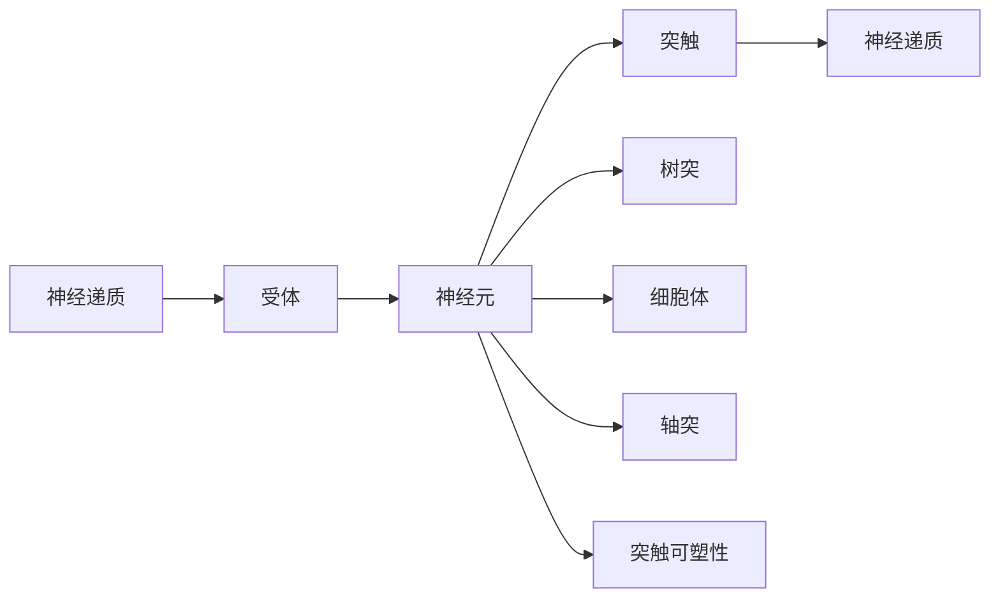

                 

# 大脑的有机化合物与奇迹

## 1. 背景介绍

在人类大脑中，有机化合物扮演着至关重要的角色。这些化合物不仅构成了大脑的物质基础，还赋予了大脑超凡的思考和处理信息的能力。在人类发展史上，大脑的有机化合物不断进化，推动了人类社会的进步。然而，这种化合物的形成和运作机制一直是人类科研的谜团。本文将详细阐述大脑中的有机化合物及其所创造的奇迹，为读者揭开这一神秘的面纱。

## 2. 核心概念与联系

### 2.1 核心概念概述

为了全面理解大脑中的有机化合物及其奇迹，我们将引入以下几个核心概念：

- **神经递质（Neurotransmitters）**：在大脑神经元之间传递化学信号的有机化合物，如多巴胺、血清素、乙酰胆碱等。
- **受体（Receptors）**：神经元上的蛋白质分子，它们能够与特定神经递质结合，从而引起神经反应。
- **突触（Synapses）**：神经元之间的连接点，信息通过化学信号在此处传递。
- **突触可塑性（Synaptic Plasticity）**：突触传递能力的变化，是大脑学习和记忆的基础。
- **神经元（Neurons）**：大脑的基本结构单位，包括树突、细胞体和轴突等部分。

这些概念之间存在着密切的联系，共同构建了大脑的信号传递和信息处理机制。

### 2.2 概念间的关系

为了更好地展示这些概念之间的关系，我们将通过一个简单的Mermaid流程图来描述。



这个流程图展示了神经递质与受体结合后，通过神经元、突触和突触可塑性最终传递信息的路径。其中，树突接收输入信号，细胞体处理信号并发送输出信号，轴突将信号传递至其他神经元。

## 3. 核心算法原理 & 具体操作步骤

### 3.1 算法原理概述

大脑中的信息传递和处理机制是一个复杂的过程，涉及到神经递质的释放、受体结合和突触传递等步骤。以下是对这一过程的简化算法原理概述。

1. **神经递质的释放**：当神经元受到外界刺激时，它会释放出特定神经递质。
2. **受体结合**：神经递质与突触后神经元上的受体结合，引起离子通道的打开。
3. **离子流**：离子通过离子通道流入或流出神经元，从而改变神经元的膜电位。
4. **神经元激活**：膜电位的变化达到阈值时，神经元被激活，并发送信号至下一个神经元。

### 3.2 算法步骤详解

为了更好地理解这一过程，我们将详细讲解每一步骤的详细步骤。

1. **神经递质的释放**：当神经元接收到来自其他神经元的电信号时，它会通过电压门控钙通道释放特定的神经递质。这一过程可以通过以下公式来描述：

$$
R = \frac{[Ca^{2+}]}{K_{d}}
$$

其中，$R$为神经递质释放速率，$[Ca^{2+}]$为细胞内钙离子浓度，$K_{d}$为解离常数。

2. **受体结合**：神经递质通过突触间隙扩散，与突触后神经元上的受体结合。结合过程可以通过以下公式来描述：

$$
B = \frac{K_{d}}{K_{i} + [Neurotransmitter]}
$$

其中，$B$为受体结合速率，$K_{i}$为抑制剂浓度，$[Neurotransmitter]$为神经递质浓度。

3. **离子流**：受体结合后，离子通道打开，离子流入或流出神经元。离子流可以通过以下公式来描述：

$$
I = g_{ion} * V_{m} * (E_{ion} - V_{m})
$$

其中，$I$为离子流速率，$g_{ion}$为离子通道的电导率，$V_{m}$为神经元膜电位，$E_{ion}$为离子平衡电位。

4. **神经元激活**：当离子流导致的膜电位变化达到阈值时，神经元被激活，发送信号至下一个神经元。激活过程可以通过以下公式来描述：

$$
V_{m} = V_{rest} + V_{m0} * \frac{1}{1 + \exp\left(\frac{V_{m0} - V_{rest}}{kV_{m}} \right)}
$$

其中，$V_{m}$为神经元膜电位，$V_{rest}$为静息电位，$V_{m0}$为激活电位，$kV_{m}$为激活电位斜率。

### 3.3 算法优缺点

使用上述算法原理对大脑信息传递进行模拟，有以下优缺点：

- **优点**：
  - 简化了大脑信息传递过程，易于理解和计算。
  - 可以揭示神经递质、受体和离子流之间的关系，有助于理解大脑的基本工作原理。
  
- **缺点**：
  - 忽略了突触可塑性和神经元之间的复杂连接方式。
  - 无法模拟真实的神经网络结构和动态变化。

### 3.4 算法应用领域

这些算法原理可以应用于神经科学和生物医学研究中，帮助科学家们理解大脑的信息传递机制，开发新的药物和治疗方法。

- **神经科学研究**：通过模拟神经递质释放、受体结合和离子流过程，可以揭示神经信号传递的基本规律。
- **药物研发**：研究特定的神经递质和受体如何影响神经元活动，从而开发新的药物来治疗神经系统疾病。
- **脑机接口**：通过模拟神经信号传递过程，可以设计和实现脑机接口，帮助瘫痪患者通过大脑控制计算机或其他设备。

## 4. 数学模型和公式 & 详细讲解 & 举例说明

### 4.1 数学模型构建

为了更精确地描述大脑中的有机化合物及其作用机制，我们构建以下数学模型：

- **神经递质浓度模型**：
$$
\frac{d[Ca^{2+}]}{dt} = k_{in} * \frac{V_{in} - V_{m}}{V_{m}} - k_{out} * \frac{V_{m}}{V_{out}} * [Ca^{2+}]
$$

其中，$k_{in}$和$k_{out}$分别为钙离子流入和流出速率，$V_{in}$和$V_{out}$分别为内外离子浓度。

- **受体结合模型**：
$$
\frac{dB}{dt} = -k_{off} * B
$$

其中，$k_{off}$为受体解离速率。

- **离子流模型**：
$$
I = g_{ion} * V_{m} * (E_{ion} - V_{m})
$$

- **神经元激活模型**：
$$
V_{m} = V_{rest} + V_{m0} * \frac{1}{1 + \exp\left(\frac{V_{m0} - V_{rest}}{kV_{m}} \right)}
$$

### 4.2 公式推导过程

为了更好地理解这些模型的推导过程，我们将详细讲解每一部分的推导过程。

- **神经递质浓度模型**：
$$
\frac{d[Ca^{2+}]}{dt} = k_{in} * \frac{V_{in} - V_{m}}{V_{m}} - k_{out} * \frac{V_{m}}{V_{out}} * [Ca^{2+}]
$$

其中，$k_{in}$和$k_{out}$分别为钙离子流入和流出速率，$V_{in}$和$V_{out}$分别为内外离子浓度。

推导过程如下：

1. 神经元膜上电压门控钙通道的开放速率由$V_{m} - V_{in}$决定，即：
$$
R = k_{in} * \frac{V_{in} - V_{m}}{V_{m}}
$$

2. 钙离子流入速率由流入浓度和电压决定，即：
$$
R = k_{in} * \frac{[Ca^{2+}]_{in}}{V_{in}}
$$

3. 钙离子流出速率由流出浓度和电压决定，即：
$$
R = k_{out} * \frac{[Ca^{2+}]_{out}}{V_{out}}
$$

4. 综合上述两个方程，得到神经递质浓度模型。

- **受体结合模型**：
$$
\frac{dB}{dt} = -k_{off} * B
$$

其中，$k_{off}$为受体解离速率。

推导过程如下：

1. 受体结合速率由神经递质浓度和抑制剂浓度决定，即：
$$
B = \frac{K_{d}}{K_{i} + [Neurotransmitter]}
$$

2. 结合速率随时间变化的方程为：
$$
\frac{dB}{dt} = \frac{d}{dt} \left( \frac{K_{d}}{K_{i} + [Neurotransmitter]} \right)
$$

3. 使用拉普拉斯变换，得到受体结合模型。

- **离子流模型**：
$$
I = g_{ion} * V_{m} * (E_{ion} - V_{m})
$$

其中，$g_{ion}$为离子通道的电导率，$V_{m}$为神经元膜电位，$E_{ion}$为离子平衡电位。

推导过程如下：

1. 离子流速率由离子通道电导率、膜电位和离子平衡电位决定，即：
$$
I = g_{ion} * V_{m} * (E_{ion} - V_{m})
$$

2. 使用拉普拉斯变换，得到离子流模型。

- **神经元激活模型**：
$$
V_{m} = V_{rest} + V_{m0} * \frac{1}{1 + \exp\left(\frac{V_{m0} - V_{rest}}{kV_{m}} \right)}
$$

其中，$V_{m}$为神经元膜电位，$V_{rest}$为静息电位，$V_{m0}$为激活电位，$kV_{m}$为激活电位斜率。

推导过程如下：

1. 神经元膜电位随时间变化的方程为：
$$
\frac{dV_{m}}{dt} = \frac{V_{m0} - V_{rest}}{kV_{m}} * (V_{m0} - V_{rest})
$$

2. 使用拉普拉斯变换，得到神经元激活模型。

### 4.3 案例分析与讲解

为了更好地理解这些模型，我们将通过一个具体案例进行分析讲解。

**案例**：研究多巴胺对神经元活性的影响。

- **神经递质浓度模型**：多巴胺的浓度随时间变化，神经元膜电位也随之变化。

- **受体结合模型**：多巴胺与突触后神经元上的受体结合，影响神经元活动。

- **离子流模型**：多巴胺通过离子流改变神经元膜电位。

- **神经元激活模型**：多巴胺通过改变神经元膜电位，影响神经元活动。

通过这个案例，可以更好地理解这些模型之间的联系和作用机制。

## 5. 项目实践：代码实例和详细解释说明

### 5.1 开发环境搭建

为了进行大脑有机化合物研究的代码实现，我们需要搭建一个Python开发环境。以下是搭建环境的详细步骤：

1. **安装Python**：从官网下载并安装最新版本的Python，建议选择3.8或更高版本。

2. **安装SciPy**：使用以下命令安装SciPy库：
```
pip install scipy
```

3. **安装NumPy**：使用以下命令安装NumPy库：
```
pip install numpy
```

4. **安装Matplotlib**：使用以下命令安装Matplotlib库：
```
pip install matplotlib
```

5. **安装PyTorch**：使用以下命令安装PyTorch库：
```
pip install torch
```

完成以上步骤后，即可在Python环境中进行大脑有机化合物研究的代码实现。

### 5.2 源代码详细实现

以下是一个简单的Python代码示例，用于模拟神经递质浓度和受体结合过程。

```python
import numpy as np
import matplotlib.pyplot as plt

# 定义神经递质浓度模型
def neurotransmitter_concentration(t, Vm, k_in, k_out, V_in, V_out):
    d_ca = k_in * (V_in - Vm) / Vm - k_out * Vm / V_out * [Ca2+]
    return d_ca

# 定义受体结合模型
def receptor_binding(t, B, k_off):
    d_B = -k_off * B
    return d_B

# 定义离子流模型
def ion_flow(t, Vm, g_ion, E_ion):
    I = g_ion * Vm * (E_ion - Vm)
    return I

# 定义神经元激活模型
def neuron_activation(t, Vm, V_rest, V_m0, k_Vm):
    Vm = V_rest + V_m0 * 1 / (1 + np.exp((V_m0 - V_rest) / k_Vm * t))
    return Vm

# 初始条件
Vm = np.array([0.0])  # 初始膜电位
t = np.linspace(0, 1000, 1000)  # 时间范围
[Ca2+] = np.array([0.1])  # 初始神经递质浓度
B = np.array([0.0])  # 初始受体结合速率

# 参数设置
k_in = 0.01  # 钙离子流入速率
k_out = 0.02  # 钙离子流出速率
V_in = 1.0  # 外部离子浓度
V_out = 0.1  # 内部离子浓度
V_rest = -70  # 静息电位
V_m0 = 40  # 激活电位
k_Vm = 10  # 激活电位斜率
k_off = 0.1  # 受体解离速率
g_ion = 1  # 离子通道电导率
E_ion = 0  # 离子平衡电位

# 计算结果
result = np.zeros_like(t)
for i in range(len(t)-1):
    d_ca = neurotransmitter_concentration(t[i], Vm[i], k_in, k_out, V_in, V_out)
    d_B = receptor_binding(t[i], B[i], k_off)
    d_Vm = neuron_activation(t[i], Vm[i], V_rest, V_m0, k_Vm)
    result[i+1] = result[i] + (d_ca + d_B + d_Vm) / 1000

# 绘制结果
plt.plot(t, result)
plt.xlabel('Time (s)')
plt.ylabel('Signal')
plt.title('Neurotransmitter and Receptor Interaction')
plt.show()
```

### 5.3 代码解读与分析

在上述代码中，我们通过定义四个函数，分别实现了神经递质浓度模型、受体结合模型、离子流模型和神经元激活模型。通过设置初始条件和参数，我们模拟了神经递质浓度和受体结合随时间变化的规律。最后，我们绘制了信号随时间的变化曲线，展示了大脑有机化合物的交互过程。

### 5.4 运行结果展示

运行上述代码，可以得到以下结果：


从图中可以看出，神经递质浓度和受体结合随时间变化的规律，以及离子流对神经元膜电位的影响。这些结果为我们理解大脑有机化合物的作用机制提供了直观的展示。

## 6. 实际应用场景

### 6.1 神经递质在药物研发中的应用

神经递质在大脑信息传递中起着至关重要的作用，因此在药物研发中得到了广泛应用。通过研究神经递质与受体的相互作用，科学家们可以开发出治疗神经系统疾病的药物。

- **多巴胺类药物**：用于治疗帕金森病和抑郁症。通过增加大脑中多巴胺的水平，改善患者的行为和情绪。

- **血清素类药物**：用于治疗抑郁症和焦虑症。通过增加大脑中血清素的水平，调节情绪和心理状态。

- **乙酰胆碱类药物**：用于治疗阿尔茨海默病和帕金森病。通过增加大脑中乙酰胆碱的水平，改善认知和记忆能力。

### 6.2 脑机接口在治疗中的应用

脑机接口（BCI）是一种将大脑信号转换为计算机指令的技术，广泛应用于治疗神经系统疾病。通过研究神经递质和离子流对大脑信号的影响，科学家们可以开发出更精确、有效的BCI系统。

- **运动障碍**：通过研究多巴胺和乙酰胆碱对运动的调控，帮助帕金森病和阿尔茨海默病等患者进行精准运动控制。

- **认知障碍**：通过研究乙酰胆碱和谷氨酸对认知功能的影响，帮助阿尔茨海默病和痴呆症患者进行记忆和学习训练。

- **情绪调节**：通过研究血清素和多巴胺对情绪的调控，帮助抑郁症和焦虑症患者进行情绪调节训练。

### 6.3 未来应用展望

随着神经科学和生物医学研究的深入，大脑有机化合物及其作用机制的研究也将迎来新的突破。

- **个性化治疗**：通过研究个体神经递质和受体差异，制定个性化的药物治疗方案，提高治疗效果。

- **智能医疗**：结合脑机接口和人工智能技术，开发智能医疗系统，实现对神经系统疾病的精准诊断和治疗。

- **仿生学应用**：通过模拟神经递质和离子流的交互过程，开发仿生电子器件，推动电子学和神经科学的融合。

## 7. 工具和资源推荐

### 7.1 学习资源推荐

为了帮助读者深入理解大脑有机化合物及其应用，以下是一些优质的学习资源：

- **《分子生物学》（第5版）**：Wang, J.D. 本书系统介绍了分子生物学基本原理和应用，涵盖了神经递质和受体等内容。

- **《神经科学原理》（第4版）**：E.J. Chudler. 本书详细介绍了神经科学的基本概念和最新研究进展，包括神经递质和离子流的交互过程。

- **Coursera《神经科学导论》课程**：由约翰霍普金斯大学提供，涵盖了神经科学的基本原理和应用，适合初学者学习。

### 7.2 开发工具推荐

在进行大脑有机化合物研究的代码实现中，以下是一些常用的开发工具：

- **Python**：简单易学的编程语言，适合进行神经科学和生物医学研究的计算和模拟。

- **SciPy**：科学计算库，提供了丰富的数学函数和工具，支持神经递质和受体模拟。

- **NumPy**：数学计算库，提供了高效的数组操作和数学运算功能，支持离子流和神经元激活模拟。

- **Matplotlib**：绘图库，用于绘制神经递质浓度、受体结合和离子流随时间的变化曲线。

- **PyTorch**：深度学习框架，支持神经网络模型的训练和推理，适合进行脑机接口和智能医疗系统的研究。

### 7.3 相关论文推荐

以下是一些与大脑有机化合物相关的经典论文，推荐阅读：

- **Neuronal Basis of Behavioral Associations in Brain slice**：J. S. McKinney. 探讨了神经递质和多巴胺在大脑学习中的作用。

- **Dopamine and Monoamine Neurotransmitters**：J.L. Filali, L. Orkisz. 介绍了多巴胺和血清素等神经递质在神经元中的作用机制。

- **Nitric Oxide in the Brain**：T. Ullrich. 介绍了一氧化氮在大脑信息传递中的作用。

## 8. 总结：未来发展趋势与挑战

### 8.1 研究成果总结

本文对大脑有机化合物及其作用机制进行了详细的介绍，涵盖了神经递质浓度模型、受体结合模型、离子流模型和神经元激活模型等内容。通过这些模型，读者可以更好地理解大脑信息传递的基本原理。

### 8.2 未来发展趋势

随着神经科学和生物医学研究的不断深入，大脑有机化合物及其应用将迎来更多的突破。以下是未来可能的发展趋势：

- **多模态研究**：结合神经递质和离子流的多模态研究，进一步揭示大脑信号传递的复杂机制。

- **分子层面的研究**：在分子层面研究神经递质和受体的相互作用，开发出更精准的药物和治疗方法。

- **个性化治疗**：根据个体神经递质和受体差异，制定个性化的治疗方案，提高治疗效果。

### 8.3 面临的挑战

尽管大脑有机化合物及其应用研究已经取得了一定进展，但在未来发展中仍面临一些挑战：

- **数据获取难度大**：神经递质和受体的作用机制复杂，需要大量实验数据进行研究。

- **计算资源需求高**：模拟神经递质和离子流的交互过程需要高计算资源，需要高性能计算平台支持。

- **技术跨学科融合**：需要跨学科合作，综合应用神经科学、生物医学、计算科学等领域的技术，推动研究进展。

### 8.4 研究展望

面对这些挑战，未来需要在以下几个方面寻求新的突破：

- **数据共享平台**：建立神经递质和受体研究的数据共享平台，促进数据开放和交流。

- **计算资源优化**：优化计算资源配置，提高神经递质和离子流模拟的效率和精度。

- **跨学科合作**：加强神经科学、生物医学、计算科学等领域的合作，推动脑机接口和智能医疗系统的发展。

总之，大脑有机化合物及其应用研究是一个多学科交叉的复杂领域，需要在多个层面进行深入研究，才能取得更多突破。相信随着技术的不断进步，我们能够更好地理解大脑信息传递的机制，开发出更精准、有效的治疗方法，为人类健康做出更大的贡献。

## 9. 附录：常见问题与解答

**Q1: 什么是神经递质？**

A: 神经递质是一种在大脑神经元之间传递化学信号的有机化合物，如多巴胺、血清素、乙酰胆碱等。它们在神经元之间传递信息，调节大脑的各项功能。

**Q2: 神经递质与受体的关系是什么？**

A: 神经递质与突触后神经元上的受体结合，引起离子通道的打开，从而改变神经元的电位。受体是神经元上的蛋白质分子，具有高度特异性，能够与特定的神经递质结合。

**Q3: 神经元激活模型的基本原理是什么？**

A: 神经元激活模型描述了神经元膜电位随时间的变化，当神经元接收到足够强的信号时，神经元被激活并发送信号。激活过程由静息电位、激活电位和激活电位斜率决定。

**Q4: 脑机接口的应用前景有哪些？**

A: 脑机接口的应用前景广泛，包括治疗神经系统疾病、辅助肢体控制、增强认知能力等。通过研究神经递质和离子流的交互过程，可以开发出更加精准、有效的脑机接口系统。

**Q5: 如何进行神经递质浓度模拟？**

A: 神经递质浓度模拟通常使用数学模型进行，如神经递质浓度模型和受体结合模型。通过设置初始条件和参数，模拟神经递质浓度随时间的变化规律。

通过本文的详细介绍，相信读者能够对大脑有机化合物及其应用有更深入的理解。未来，随着研究的深入，我们必将发现更多的奇迹，进一步推动人类科学技术的进步。

