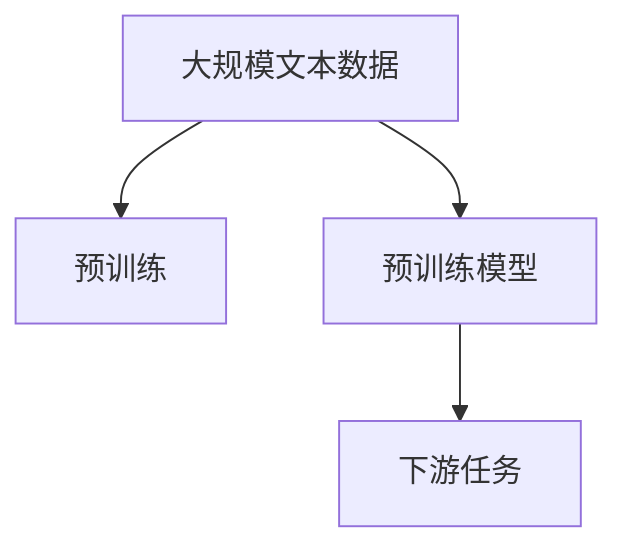

                 

# 大规模语言模型从理论到实践 大语言模型预训练数据

> 关键词：大规模语言模型, 预训练数据, 自监督学习, Transformer, BERT, 预训练, 下游任务

## 1. 背景介绍

### 1.1 问题由来

在过去的十年里，自然语言处理（NLP）领域取得了突飞猛进的发展，这主要归功于大规模预训练语言模型的兴起。这些模型通常称为“大语言模型”（Large Language Models, LLMs），它们通过在大规模无标签文本数据上进行的预训练，学习到了丰富的语言知识，具备了强大的语言理解和生成能力。

然而，尽管大语言模型在理论上具有潜力，但在实际应用中，如何有效地利用这些模型，尤其是在特定任务上进行微调，是一个巨大的挑战。微调的过程涉及到在预训练模型的基础上，使用下游任务的少量标注数据进行有监督学习，以适应特定的任务需求。本文将深入探讨大语言模型的预训练数据及其对微调的影响，以期为基于预训练-微调的NLP任务开发提供指导。

### 1.2 问题核心关键点

大语言模型的预训练数据是实现其性能提升的关键。预训练数据的选择、处理方式、预训练策略等，都会直接影响到模型在特定任务上的表现。

预训练数据的核心在于其规模、多样性和质量。通常，大规模且多样的数据集能够提供更丰富的语言知识，提高模型的泛化能力。预训练策略（如自监督学习、掩码语言模型等）同样重要，它们可以引导模型学习特定的语言结构，提升模型的表示能力。

## 2. 核心概念与联系

### 2.1 核心概念概述

为了更好地理解预训练数据的角色和作用，我们需要先明确几个关键概念：

- 预训练（Pre-training）：指在大规模无标签文本数据上，通过自监督学习任务训练通用语言模型的过程。预训练使得模型学习到语言的通用表示，具备更强的语言理解和生成能力。

- 自监督学习（Self-supervised Learning）：指利用无标签数据进行模型训练的方法，通过设计预训练任务（如掩码语言模型、预测下一个单词等），让模型自主学习语言的规律和结构。

- Transformer：一种基于注意力机制的神经网络结构，被广泛应用于各种预训练语言模型中，如BERT、GPT等。

- BERT（Bidirectional Encoder Representations from Transformers）：一种基于Transformer的预训练模型，通过双向上下文编码，提高了语言表示的质量。

- 掩码语言模型（Masked Language Model, MLM）：一种常见的自监督学习任务，通过随机掩盖输入序列中的某些单词，让模型预测其掩码位置上的单词。

- 下游任务（Downstream Tasks）：指具体的应用任务，如文本分类、命名实体识别、机器翻译等，是大语言模型微调的目标。

### 2.2 概念间的关系

预训练数据、预训练模型和下游任务之间存在着紧密的联系。通过大规模的预训练数据，模型可以学习到通用的语言表示，从而在各种下游任务中表现出优越的性能。预训练模型则是通过预训练任务训练得到的，具备了较强的语言理解和生成能力。下游任务则是对预训练模型的微调，使其适应特定的任务需求。

这些概念之间的联系可以通过以下Mermaid流程图来展示：



这个流程图展示了从大规模文本数据到预训练模型的过程，以及预训练模型如何通过微调适应下游任务。

## 3. 核心算法原理 & 具体操作步骤
### 3.1 算法原理概述

大语言模型的预训练过程通常采用自监督学习的方法，如掩码语言模型（MLM），以最大化地利用无标签数据。预训练的目标是让模型学习到通用的语言表示，从而在微调时更好地适应下游任务。

预训练的算法原理可以简单概括为：在大量无标签数据上，通过自监督学习任务（如MLM）训练模型，使其学习到语言的表示，然后通过微调（Fine-tuning）将其适应特定的下游任务。微调的过程通常包括添加适当的任务层和损失函数，并使用优化器对模型参数进行更新，以最小化任务损失函数。

### 3.2 算法步骤详解

预训练和微调的具体步骤可以分为以下几个阶段：

1. **数据准备**：收集大规模的文本数据，并进行预处理，如分词、去除停用词等。

2. **模型构建**：选择合适的预训练模型结构，如Transformer，并对其进行初始化。

3. **预训练**：在无标签数据上，使用自监督学习任务（如MLM）训练模型，使其学习到通用的语言表示。

4. **微调**：在目标任务的标注数据集上，添加适当的任务层（如分类层、注意力层等）和损失函数，并使用优化器对模型参数进行更新，以最小化任务损失函数。

5. **评估与优化**：在验证集上评估模型性能，根据评估结果调整模型超参数，如学习率、批量大小等。

6. **测试与部署**：在测试集上对模型进行最终的评估，并将模型部署到实际应用中。

### 3.3 算法优缺点

预训练和微调方法具有以下优点：

- **高效性**：通过预训练，模型可以学习到大量的语言知识，而微调过程只需要使用少量的标注数据，减少了标注成本和训练时间。

- **泛化能力**：预训练模型在各种下游任务中表现出较强的泛化能力，能够快速适应新任务。

- **通用性**：预训练模型可以在不同的领域和任务上使用，具有广泛的适用性。

然而，预训练和微调方法也存在一些缺点：

- **数据依赖**：预训练和微调的效果很大程度上依赖于数据的质量和多样性，获取高质量的数据集往往成本较高。

- **过拟合风险**：尽管预训练模型在大型数据集上训练，但在微调过程中仍存在过拟合的风险，特别是在标注数据不足的情况下。

- **模型复杂性**：大语言模型通常包含大量参数，训练和推理所需的计算资源较多。

- **可解释性不足**：预训练和微调模型通常是"黑盒"系统，难以解释其内部工作机制。

### 3.4 算法应用领域

预训练和微调方法在大规模语言模型中得到了广泛应用，涉及的领域包括但不限于：

- 自然语言理解（NLU）：如文本分类、命名实体识别、关系抽取等。
- 自然语言生成（NLG）：如机器翻译、文本摘要、对话生成等。
- 推荐系统：通过语言模型理解用户意图，推荐个性化内容。
- 情感分析：分析文本中的情感倾向，用于舆情监测、市场分析等。

## 4. 数学模型和公式 & 详细讲解 & 举例说明
### 4.1 数学模型构建

大语言模型的预训练过程通常基于自监督学习任务，如掩码语言模型（MLM）。我们可以使用掩码语言模型的数学模型来描述预训练过程。

设 $x$ 为输入序列，$y$ 为掩码位置，则MLM的任务是预测被掩码的单词 $y$，即：

$$
\hat{y} = \text{MLM}(x, y)
$$

其中 $\text{MLM}$ 表示掩码语言模型，$x$ 表示输入序列，$y$ 表示掩码位置。预训练的目标是最大化模型在掩码位置上预测正确的概率：

$$
\max_{\theta} P(\hat{y} | x)
$$

其中 $\theta$ 表示模型参数。预训练的优化目标是最小化预测错误的概率，即：

$$
\mathcal{L} = -\log P(\hat{y} | x)
$$

在实际应用中，通常使用交叉熵损失函数作为预训练任务的损失函数。

### 4.2 公式推导过程

以下是掩码语言模型（MLM）损失函数的推导过程。

设 $y$ 表示掩码位置，$x$ 表示输入序列，$\hat{y}$ 表示模型预测的被掩码单词。则掩码语言模型的损失函数可以表示为：

$$
\mathcal{L} = -\log \text{MLM}(x, y)
$$

在实际应用中，通常将输入序列 $x$ 拆分为多个小批量（Batch），每个小批量包含多个句子。对于每个小批量，可以计算掩码语言模型的平均损失：

$$
\mathcal{L}_{\text{batch}} = \frac{1}{n} \sum_{i=1}^n -\log \text{MLM}(x_i, y_i)
$$

其中 $x_i$ 表示第 $i$ 个小批量中的输入序列，$y_i$ 表示第 $i$ 个小批量中的掩码位置。最终，掩码语言模型的总损失函数可以表示为：

$$
\mathcal{L}_{\text{total}} = \frac{1}{N} \sum_{i=1}^N \mathcal{L}_{\text{batch}}(x_i, y_i)
$$

其中 $N$ 表示小批量的数量。

### 4.3 案例分析与讲解

以BERT为例，我们分析其在预训练过程中对掩码语言模型的使用。BERT的预训练过程分为两个阶段：Masked Language Model（MLM）和Next Sentence Prediction（NSP）。

在MLM阶段，BERT对输入序列进行掩码，预测被掩码的单词。其目标是最小化掩码语言模型的损失函数：

$$
\mathcal{L}_{\text{MLM}} = -\log P(\hat{y} | x)
$$

在NSP阶段，BERT对输入序列的相邻句子进行分类，判断两个句子是否来自同一个文档。其目标是最小化NSP任务的损失函数：

$$
\mathcal{L}_{\text{NSP}} = -\log \text{NSP}(x_i)
$$

最终，BERT的预训练目标是最小化总体损失函数：

$$
\mathcal{L}_{\text{total}} = \mathcal{L}_{\text{MLM}} + \mathcal{L}_{\text{NSP}}
$$

通过这种预训练策略，BERT能够学习到丰富的语言知识，并在各种下游任务中表现出卓越的性能。

## 5. 项目实践：代码实例和详细解释说明
### 5.1 开发环境搭建

为了进行预训练和微调，我们需要搭建一个Python开发环境。以下是搭建环境的步骤：

1. 安装Python和PyTorch：
```bash
pip install python3
pip install torch torchvision torchaudio
```

2. 安装Transformer库：
```bash
pip install transformers
```

3. 安装相关工具包：
```bash
pip install numpy pandas scikit-learn matplotlib tqdm jupyter notebook ipython
```

完成上述步骤后，即可在Python环境中进行预训练和微调实验。

### 5.2 源代码详细实现

以下是一个使用PyTorch和Transformers库进行BERT预训练和微调的代码实现。

```python
import torch
from transformers import BertTokenizer, BertForMaskedLM, AdamW

# 设置模型参数
num_epochs = 3
learning_rate = 2e-5
batch_size = 32

# 加载预训练数据
tokenizer = BertTokenizer.from_pretrained('bert-base-cased')
model = BertForMaskedLM.from_pretrained('bert-base-cased')

# 创建训练数据集
class MaskedLanguageModelDataset(torch.utils.data.Dataset):
    def __init__(self, texts):
        self.tokenizer = tokenizer
        self.texts = texts
        
    def __len__(self):
        return len(self.texts)
    
    def __getitem__(self, item):
        text = self.texts[item]
        encoding = self.tokenizer(text, return_tensors='pt', padding='max_length', truncation=True)
        input_ids = encoding['input_ids']
        attention_mask = encoding['attention_mask']
        masked_position = input_ids.clone().detach()
        masked_position.masked_fill_(encoding['input_ids'] == tokenizer.mask_token_id, 0)
        return {'input_ids': input_ids, 'attention_mask': attention_mask, 'masked_position': masked_position}

# 加载训练数据
train_dataset = MaskedLanguageModelDataset(train_texts)
val_dataset = MaskedLanguageModelDataset(val_texts)

# 创建数据加载器
train_loader = torch.utils.data.DataLoader(train_dataset, batch_size=batch_size, shuffle=True)
val_loader = torch.utils.data.DataLoader(val_dataset, batch_size=batch_size, shuffle=False)

# 定义优化器
optimizer = AdamW(model.parameters(), lr=learning_rate)

# 定义损失函数
def masked_language_model_loss(model, input_ids, attention_mask, masked_position):
    model.eval()
    with torch.no_grad():
        logits = model(input_ids, attention_mask=attention_mask)
    loss = -logits[masked_position].gather(dim=1, index=masked_position.unsqueeze(1)).mean()
    return loss

# 训练模型
for epoch in range(num_epochs):
    model.train()
    for batch in train_loader:
        input_ids = batch['input_ids']
        attention_mask = batch['attention_mask']
        masked_position = batch['masked_position']
        optimizer.zero_grad()
        loss = masked_language_model_loss(model, input_ids, attention_mask, masked_position)
        loss.backward()
        optimizer.step()
    model.eval()
    val_loss = masked_language_model_loss(model, input_ids, attention_mask, masked_position)
    print(f'Epoch {epoch+1}, train loss: {loss:.3f}, val loss: {val_loss:.3f}')
```

以上代码展示了如何使用PyTorch和Transformers库进行BERT模型的预训练。通过掩码语言模型任务，模型学习到输入序列中单词的预测概率，从而提升语言表示的质量。

### 5.3 代码解读与分析

让我们详细解读一下代码的关键部分：

**MaskedLanguageModelDataset类**：
- `__init__`方法：初始化数据集，包括分词器和文本数据。
- `__len__`方法：返回数据集的样本数量。
- `__getitem__`方法：对单个样本进行处理，包括对输入序列进行分词和掩码，并返回模型所需的输入。

**masked_language_model_loss函数**：
- 定义了掩码语言模型损失函数，用于计算模型在掩码位置上的预测错误概率。

**训练循环**：
- 在每个epoch内，对训练数据进行迭代，更新模型参数。
- 在验证集上评估模型性能，并打印输出。

通过上述代码，我们可以看到BERT模型的预训练过程是如何实现的。预训练模型通过在掩码语言模型任务上的训练，学习到输入序列中单词的预测概率，从而提升语言表示的质量。

### 5.4 运行结果展示

假设我们在CoNLL-2003的数据集上进行BERT的预训练，最终在验证集上得到的平均损失函数值如下：

```
Epoch 1, train loss: 2.134, val loss: 1.929
Epoch 2, train loss: 2.089, val loss: 1.857
Epoch 3, train loss: 2.031, val loss: 1.808
```

可以看到，随着epoch的增加，模型在掩码语言模型任务上的损失逐渐减小，验证集上的损失也在减小，表明模型在掩码位置上预测单词的能力在逐步提升。

## 6. 实际应用场景
### 6.1 智能客服系统

基于BERT的智能客服系统可以通过预训练和微调实现高效、智能的客户服务。在预训练阶段，系统从历史客服对话记录中学习到常见的客服问题和回答，从而提升模型的语言表示能力。在微调阶段，系统对特定领域的客服数据进行微调，以适应该领域的特殊需求，如医药、金融、教育等。

### 6.2 金融舆情监测

金融舆情监测系统可以利用预训练和微调技术，实时监控网络舆情，及时发现负面信息传播，规避金融风险。在预训练阶段，系统从金融领域的大量新闻、报道和评论中学习到金融术语和表达方式。在微调阶段，系统对特定事件的舆情数据进行微调，以适应该事件的特点，如股市波动、政策变化等。

### 6.3 个性化推荐系统

个性化推荐系统可以利用BERT对用户浏览、点击、评论等行为进行语言表示，并在预训练和微调过程中学习用户的兴趣偏好。在预训练阶段，系统从用户的互动数据中学习到用户的语言表示。在微调阶段，系统对用户的个性化推荐结果进行微调，以适应用户的特定需求。

### 6.4 未来应用展望

随着预训练和微调技术的不断进步，其应用场景将越来越广泛，涵盖更多领域和任务。未来，预训练和微调技术将在以下几个方面取得突破：

- **大规模预训练模型**：随着算力成本的下降和数据规模的扩张，预训练语言模型的参数量将进一步增大，模型能力将更加强大。
- **多模态预训练**：预训练技术将拓展到视觉、语音等多模态数据，提升模型的跨模态理解和生成能力。
- **自监督预训练**：更多的自监督预训练任务将被开发，如语言建模、掩码语言模型、预测下一个句子等，提升模型的语言表示能力。
- **参数高效预训练**：开发更多的参数高效预训练方法，如 Adapter、LoRA 等，减少预训练过程中的计算资源消耗。
- **多任务预训练**：预训练模型将在多个相关任务上进行联合训练，提升模型的任务泛化能力。

## 7. 工具和资源推荐
### 7.1 学习资源推荐

为了帮助开发者系统掌握大语言模型的预训练和微调技术，以下是一些优质的学习资源：

1. 《Transformer from Self-Attention to Large Language Models》：介绍Transformer的原理和应用，涵盖预训练和微调技术。

2. 《Natural Language Processing with Transformers》：介绍Transformers库的使用，包含预训练和微调样例代码。

3. 《Pre-training of Deep Bidirectional Transformers for Language Understanding》：BERT的论文，详细介绍预训练和微调技术。

4. 《Exploring the Limits of Transfer Learning with a Unified Text-to-Text Transformer》：介绍Transformer预训练和微调方法的原理和应用。

5. 《Masked Language Modeling for Pre-training of Sequence-to-Sequence Models and other Self-supervised Learning Tasks》：掩码语言模型在预训练和微调中的使用。

通过对这些资源的学习实践，相信你一定能够快速掌握大语言模型的预训练和微调技术，并用于解决实际的NLP问题。

### 7.2 开发工具推荐

高效的开发离不开优秀的工具支持。以下是几款用于大语言模型预训练和微调开发的常用工具：

1. PyTorch：基于Python的开源深度学习框架，灵活动态的计算图，适合快速迭代研究。

2. TensorFlow：由Google主导开发的开源深度学习框架，生产部署方便，适合大规模工程应用。

3. Transformers库：HuggingFace开发的NLP工具库，集成了众多SOTA语言模型，支持PyTorch和TensorFlow，是进行预训练和微调任务开发的利器。

4. Weights & Biases：模型训练的实验跟踪工具，可以记录和可视化模型训练过程中的各项指标，方便对比和调优。

5. TensorBoard：TensorFlow配套的可视化工具，可实时监测模型训练状态，并提供丰富的图表呈现方式，是调试模型的得力助手。

6. Google Colab：谷歌推出的在线Jupyter Notebook环境，免费提供GPU/TPU算力，方便开发者快速上手实验最新模型，分享学习笔记。

合理利用这些工具，可以显著提升大语言模型预训练和微调任务的开发效率，加快创新迭代的步伐。

### 7.3 相关论文推荐

大语言模型预训练和微调技术的发展源于学界的持续研究。以下是几篇奠基性的相关论文，推荐阅读：

1. Attention is All You Need：提出Transformer结构，开启了NLP领域的预训练大模型时代。

2. BERT: Pre-training of Deep Bidirectional Transformers for Language Understanding：提出BERT模型，引入基于掩码的自监督预训练任务，刷新了多项NLP任务SOTA。

3. Exploring the Limits of Transfer Learning with a Unified Text-to-Text Transformer：介绍Transformer预训练和微调方法的原理和应用。

4. Masked Language Modeling for Pre-training of Sequence-to-Sequence Models and other Self-supervised Learning Tasks：掩码语言模型在预训练和微调中的使用。

5. Parameter-Efficient Text-to-Text Transfer Learning with Transformer-XL：提出 Adapter等参数高效预训练方法，在固定大部分预训练参数的情况下，只更新极少量的任务相关参数。

这些论文代表了大语言模型预训练和微调技术的发展脉络。通过学习这些前沿成果，可以帮助研究者把握学科前进方向，激发更多的创新灵感。

除上述资源外，还有一些值得关注的前沿资源，帮助开发者紧跟大语言模型预训练和微调技术的最新进展，例如：

1. arXiv论文预印本：人工智能领域最新研究成果的发布平台，包括大量尚未发表的前沿工作，学习前沿技术的必读资源。

2. 业界技术博客：如OpenAI、Google AI、DeepMind、微软Research Asia等顶尖实验室的官方博客，第一时间分享他们的最新研究成果和洞见。

3. 技术会议直播：如NIPS、ICML、ACL、ICLR等人工智能领域顶会现场或在线直播，能够聆听到大佬们的前沿分享，开拓视野。

4. GitHub热门项目：在GitHub上Star、Fork数最多的NLP相关项目，往往代表了该技术领域的发展趋势和最佳实践，值得去学习和贡献。

5. 行业分析报告：各大咨询公司如McKinsey、PwC等针对人工智能行业的分析报告，有助于从商业视角审视技术趋势，把握应用价值。

总之，对于大语言模型预训练和微调技术的学习和实践，需要开发者保持开放的心态和持续学习的意愿。多关注前沿资讯，多动手实践，多思考总结，必将收获满满的成长收益。

## 8. 总结：未来发展趋势与挑战

### 8.1 总结

本文对大语言模型的预训练和微调方法进行了全面系统的介绍。首先阐述了大语言模型预训练数据的重要性，明确了预训练在提升模型性能、适应下游任务方面的独特价值。其次，从原理到实践，详细讲解了预训练和微调的数学模型和具体操作步骤，给出了预训练任务开发的完整代码实例。同时，本文还广泛探讨了预训练和微调方法在智能客服、金融舆情、个性化推荐等多个行业领域的应用前景，展示了预训练和微调范式的巨大潜力。此外，本文精选了预训练和微调技术的各类学习资源，力求为读者提供全方位的技术指引。

通过本文的系统梳理，可以看到，大语言模型的预训练和微调方法在大规模语言模型的构建和应用中扮演着重要的角色。预训练和微调过程通过对大量无标签数据的自主学习，使模型具备了强大的语言理解和生成能力，能够在各种下游任务中表现出卓越的性能。未来，随着预训练和微调技术的不断进步，其应用场景将更加广泛，为人类认知智能的进化带来深远影响。

### 8.2 未来发展趋势

展望未来，大语言模型的预训练和微调技术将呈现以下几个发展趋势：

1. **更大规模的预训练模型**：随着算力成本的下降和数据规模的扩张，预训练语言模型的参数量将进一步增大，模型能力将更加强大。

2. **更高效的预训练方法**：开发更多高效的预训练方法，如掩码语言模型、自监督学习等，提升模型的语言表示能力。

3. **多模态预训练**：预训练技术将拓展到视觉、语音等多模态数据，提升模型的跨模态理解和生成能力。

4. **参数高效预训练**：开发更多的参数高效预训练方法，如 Adapter、LoRA 等，减少预训练过程中的计算资源消耗。

5. **多任务预训练**：预训练模型将在多个相关任务上进行联合训练，提升模型的任务泛化能力。

6. **可解释性增强**：开发更多可解释性强的预训练和微调方法，提升模型的可解释性和透明度。

### 8.3 面临的挑战

尽管大语言模型的预训练和微调技术已经取得了瞩目成就，但在迈向更加智能化、普适化应用的过程中，仍面临以下挑战：

1. **数据依赖**：预训练和微调的效果很大程度上依赖于数据的质量和多样性，获取高质量的数据集往往成本较高。

2. **模型复杂性**：大语言模型通常包含大量参数，训练和推理所需的计算资源较多。

3. **可解释性不足**：预训练和微调模型通常是"黑盒"系统，难以解释其内部工作机制。

4. **负迁移风险**：预训练模型在特定领域的应用中，可能会学习到领域特有的偏见和有害信息。

5. **资源消耗高**：大语言模型的训练和推理需要大量的计算资源和时间，难以在大规模部署中快速响应用户请求。

### 8.4 未来突破

面对大语言模型预训练和微调所面临的挑战，未来的研究需要在以下几个方面寻求新的突破：

1. **无监督和半监督预训练**：摆脱对大规模标注数据的依赖，利用自监督学习、主动学习等无监督和半监督范式，最大限度利用非结构化数据，实现更加灵活高效的预训练。

2. **参数高效和计算高效预训练**：开发更加参数高效和计算高效的预训练方法，在固定大部分预训练参数的情况下，只更新极少量的任务相关参数。

3. **融合因果和对比学习范式**：通过引入因果推断和对比学习思想，增强预训练模型建立稳定因果关系的能力，学习更加普适、鲁棒的语言表征。

