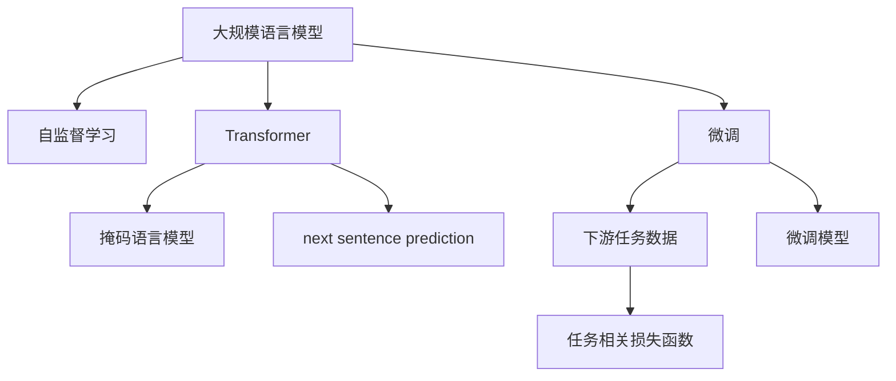
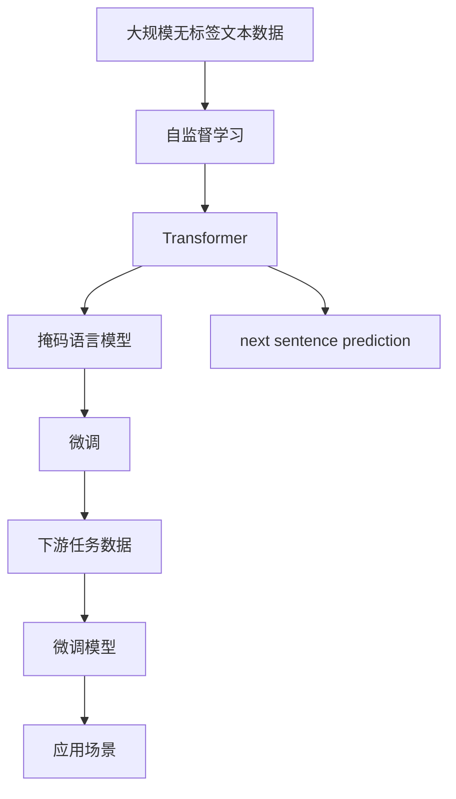

                 

# 大规模语言模型从理论到实践 手动构建指令

> 关键词：大规模语言模型,深度学习,自然语言处理(NLP),预训练模型,自监督学习,Transformer,BERT,PyTorch,微调,微调模型,超参数调优,自然语言理解,自然语言生成

## 1. 背景介绍

### 1.1 问题由来

近年来，深度学习技术在自然语言处理(NLP)领域取得了显著进展，尤其是大规模语言模型如BERT、GPT-3等，其在各种NLP任务上取得了令人瞩目的成绩。这些模型的核心在于通过自监督学习，在大规模无标签文本数据上进行预训练，学习到丰富的语言知识和表示，然后在下游任务上进行微调，以适应特定的任务需求。然而，这些模型的构建涉及大量的计算资源和数据资源，对于一般的应用开发者来说，构建一个大规模语言模型是一个巨大的挑战。

### 1.2 问题核心关键点

为了降低构建大规模语言模型的门槛，同时也为了更好地理解大模型的构建过程，本节将详细介绍如何手动构建一个基于自监督学习的大规模语言模型。我们将从模型的设计、训练和应用三个方面进行详细的讨论，希望能为开发者提供一份完整的指南。

### 1.3 问题研究意义

本节将阐述大规模语言模型构建的重要性和其对于NLP领域的影响。通过深入了解模型的构建过程，开发者能够更好地理解模型的运作原理，从而在实际应用中更好地使用和优化模型。

## 2. 核心概念与联系

### 2.1 核心概念概述

为更好地理解手动构建大规模语言模型的过程，本节将介绍几个关键的概念：

- **大规模语言模型(Massive Language Model, MLM)**：指在大规模无标签文本数据上进行预训练的深度学习模型，通常具有亿级别参数，能够处理自然语言的各种复杂任务。

- **自监督学习(Self-supervised Learning)**：一种无需人工标注数据的机器学习方法，通过数据本身的特性进行模型训练。在大规模语言模型中，自监督学习通常通过预测文本中缺失的信息，如掩码语言模型、next sentence prediction等任务来进行。

- **Transformer**：一种基于注意力机制的深度学习模型，用于处理序列数据，如自然语言文本。Transformer模型在深度学习领域具有重要地位，被广泛应用于各种NLP任务中。

- **BERT(Bidirectional Encoder Representations from Transformers)**：由Google提出的一种基于Transformer的预训练语言模型，通过双向训练和自监督学习任务，学习到了丰富的语言表示。

- **PyTorch**：一个开源的深度学习框架，支持动态图和静态图两种计算图模型，广泛用于深度学习模型的构建和训练。

- **微调(Fine-tuning)**：在预训练模型的基础上，使用下游任务的标注数据，通过有监督学习优化模型在特定任务上的性能。

- **微调模型(Fine-tuned Model)**：经过微调后的预训练模型，能够更好地适应特定任务，提高模型的任务相关性能。

这些核心概念通过自监督学习、Transformer和微调等技术手段，共同构建了大规模语言模型，使其在NLP领域中取得了巨大的成功。

### 2.2 概念间的关系

这些核心概念之间的关系可以通过以下Mermaid流程图来展示：



这个流程图展示了自监督学习、Transformer和微调在大规模语言模型构建过程中的关键作用。

### 2.3 核心概念的整体架构

最后，我们用一个综合的流程图来展示这些核心概念在大规模语言模型构建过程中的整体架构：



这个综合流程图展示了从无标签数据到最终微调模型在应用场景中的整体构建过程。

## 3. 核心算法原理 & 具体操作步骤
### 3.1 算法原理概述

手动构建大规模语言模型的过程主要分为三个步骤：预训练、微调和应用。预训练是通过自监督学习在大规模无标签文本数据上学习到语言表示的过程；微调是将预训练模型在特定下游任务上进行调整，以适应该任务的过程；应用则是将微调后的模型应用于实际应用场景，进行自然语言理解和生成。

预训练通常使用自监督学习方法，如掩码语言模型和next sentence prediction等，通过预测文本中缺失的信息来训练模型。微调则是在预训练模型的基础上，使用下游任务的标注数据，通过有监督学习优化模型在特定任务上的性能。微调过程中，通常仅调整模型中的顶层，以避免过拟合。

### 3.2 算法步骤详解

#### 3.2.1 预训练步骤

预训练步骤主要包括以下几个步骤：

1. **数据准备**：收集大规模无标签文本数据，如维基百科、新闻、小说等，用于模型预训练。

2. **模型设计**：选择合适的Transformer模型架构，包括编码器、解码器和注意力机制等组件。

3. **模型初始化**：对模型进行随机初始化，通常使用Xavier或He初始化方法。

4. **自监督学习任务**：设计自监督学习任务，如掩码语言模型、next sentence prediction等。

5. **模型训练**：在预训练数据上进行模型训练，通常使用GPU或TPU等高性能计算设备。

6. **模型保存**：训练完成后，保存预训练模型的权重和参数，以便后续微调使用。

#### 3.2.2 微调步骤

微调步骤主要包括以下几个步骤：

1. **任务定义**：选择下游任务，如命名实体识别、情感分析等，并准备相应的标注数据。

2. **任务适配层设计**：根据下游任务的性质，设计任务适配层，如添加分类器、解码器等。

3. **模型初始化**：对预训练模型进行初始化，通常仅保留顶层，冻结底层参数。

4. **微调模型训练**：在微调数据集上训练微调模型，使用有监督学习优化模型。

5. **模型评估**：在验证集和测试集上评估微调模型的性能，调整超参数以优化模型。

6. **模型应用**：将微调模型应用于实际应用场景，如自然语言理解、生成等。

### 3.3 算法优缺点

手动构建大规模语言模型具有以下优点：

1. **灵活性**：可以根据具体任务需求，自由调整模型的架构和超参数。

2. **可解释性**：模型训练过程透明，便于理解和调试。

3. **资源控制**：能够灵活控制训练资源，适用于各种计算环境。

4. **模型可控**：模型构建过程可控，便于优化和改进。

然而，手动构建大规模语言模型也存在以下缺点：

1. **计算资源需求高**：预训练和微调过程需要大量计算资源，如高性能计算设备。

2. **数据资源需求高**：预训练和微调需要大量无标签和标注数据，数据准备过程耗时耗力。

3. **模型复杂性高**：模型结构复杂，调试和优化难度大。

4. **训练时间长**：模型训练时间长，需要较长的计算时间。

### 3.4 算法应用领域

手动构建的大规模语言模型在以下几个领域有广泛的应用：

- **自然语言理解**：如文本分类、命名实体识别、关系抽取等。

- **自然语言生成**：如文本摘要、机器翻译、对话系统等。

- **信息检索**：如问答系统、知识图谱等。

- **情感分析**：如社交媒体情感分析、产品评论分析等。

这些领域中，大规模语言模型被广泛应用于自然语言处理的各种任务，极大地提升了模型的性能和应用范围。

## 4. 数学模型和公式 & 详细讲解 & 举例说明（备注：数学公式请使用latex格式，latex嵌入文中独立段落使用 $$，段落内使用 $)
### 4.1 数学模型构建

手动构建大规模语言模型的数学模型主要分为预训练和微调两部分。

#### 4.1.1 预训练模型

预训练模型的数学模型可以表示为：

$$
P_{MLM}(x_1,...,x_n) = \prod_{i=1}^{n} P(x_i|x_{<i})
$$

其中，$x_1,...,x_n$表示文本序列，$P(x_i|x_{<i})$表示在$x_{<i}$的上下文条件下，$x_i$的概率分布。

#### 4.1.2 微调模型

微调模型的数学模型可以表示为：

$$
P_{MLM}(x_1,...,x_n|y_1,...,y_m) = \prod_{i=1}^{n} P(x_i|x_{<i}, y_i)
$$

其中，$x_1,...,x_n$表示文本序列，$y_1,...,y_m$表示任务标签，$P(x_i|x_{<i}, y_i)$表示在$x_{<i}$和$y_i$的上下文条件下，$x_i$的概率分布。

### 4.2 公式推导过程

以BERT模型为例，推导掩码语言模型的公式：

给定文本序列$x_1,...,x_n$，其中某些单词被掩码处理，模型需要预测被掩码单词的原始值。

掩码语言模型的数学模型可以表示为：

$$
L_{MLM}(\theta) = -\frac{1}{N}\sum_{i=1}^{N}\sum_{j=1}^{M} \log P(x_j|x_{<i}, \hat{x}_j)
$$

其中，$N$表示训练样本数，$M$表示掩码位置数，$\theta$表示模型参数，$\hat{x}_j$表示掩码位置的原始值。

### 4.3 案例分析与讲解

以BERT模型为例，分析其预训练和微调过程：

1. **预训练过程**：
   - 数据准备：收集大规模无标签文本数据，如维基百科、新闻、小说等。
   - 模型设计：使用Transformer模型架构，设计掩码语言模型和next sentence prediction等自监督学习任务。
   - 模型训练：在预训练数据上进行模型训练，通常使用GPU或TPU等高性能计算设备。
   - 模型保存：训练完成后，保存预训练模型的权重和参数。

2. **微调过程**：
   - 任务定义：选择下游任务，如命名实体识别、情感分析等，并准备相应的标注数据。
   - 任务适配层设计：根据下游任务的性质，设计任务适配层，如添加分类器、解码器等。
   - 模型初始化：对预训练模型进行初始化，通常仅保留顶层，冻结底层参数。
   - 微调模型训练：在微调数据集上训练微调模型，使用有监督学习优化模型。
   - 模型评估：在验证集和测试集上评估微调模型的性能，调整超参数以优化模型。
   - 模型应用：将微调模型应用于实际应用场景，如自然语言理解、生成等。

## 5. 项目实践：代码实例和详细解释说明
### 5.1 开发环境搭建

在进行模型构建和微调前，需要先准备好开发环境。以下是使用Python进行PyTorch开发的环境配置流程：

1. 安装Anaconda：从官网下载并安装Anaconda，用于创建独立的Python环境。

2. 创建并激活虚拟环境：
```bash
conda create -n pytorch-env python=3.8 
conda activate pytorch-env
```

3. 安装PyTorch：根据CUDA版本，从官网获取对应的安装命令。例如：
```bash
conda install pytorch torchvision torchaudio cudatoolkit=11.1 -c pytorch -c conda-forge
```

4. 安装TensorFlow：
```bash
pip install tensorflow
```

5. 安装各类工具包：
```bash
pip install numpy pandas scikit-learn matplotlib tqdm jupyter notebook ipython
```

完成上述步骤后，即可在`pytorch-env`环境中开始模型构建和微调实践。

### 5.2 源代码详细实现

下面我们以BERT模型为例，给出使用PyTorch进行预训练和微调的完整代码实现。

```python
import torch
import torch.nn as nn
import torch.optim as optim
from torch.utils.data import DataLoader, Dataset
from transformers import BertTokenizer, BertForMaskedLM, AdamW

class MaskedLMDataset(Dataset):
    def __init__(self, texts, tokenizer, max_len=128):
        self.tokenizer = tokenizer
        self.texts = texts
        self.max_len = max_len
        
    def __len__(self):
        return len(self.texts)
    
    def __getitem__(self, item):
        text = self.tokenizer.tokenize(self.texts[item])
        text = text[:self.max_len]
        input_ids = torch.tensor([self.tokenizer.convert_tokens_to_ids(t) for t in text])
        attention_mask = torch.tensor([1 if i < self.max_len else 0 for i in range(len(text))])
        masked_indices = torch.tensor([i for i in range(len(text)) if text[i] == '[MASK]'])
        masked_labels = torch.tensor([self.tokenizer.convert_tokens_to_ids(text[i]) for i in masked_indices])
        return {
            'input_ids': input_ids,
            'attention_mask': attention_mask,
            'masked_labels': masked_labels
        }

# 加载数据集
tokenizer = BertTokenizer.from_pretrained('bert-base-cased')
train_dataset = MaskedLMDataset(train_texts, tokenizer, max_len=128)
val_dataset = MaskedLMDataset(val_texts, tokenizer, max_len=128)
test_dataset = MaskedLMDataset(test_texts, tokenizer, max_len=128)

# 构建模型
model = BertForMaskedLM.from_pretrained('bert-base-cased')
device = torch.device('cuda' if torch.cuda.is_available() else 'cpu')
model.to(device)

# 设置优化器和学习率
optimizer = AdamW(model.parameters(), lr=2e-5)

# 训练过程
def train_step(model, dataset, optimizer, device):
    dataloader = DataLoader(dataset, batch_size=64, shuffle=True)
    model.train()
    for batch in dataloader:
        input_ids = batch['input_ids'].to(device)
        attention_mask = batch['attention_mask'].to(device)
        labels = batch['masked_labels'].to(device)
        model.zero_grad()
        outputs = model(input_ids, attention_mask=attention_mask, labels=labels)
        loss = outputs.loss
        loss.backward()
        optimizer.step()
    return loss.item()

# 训练和评估过程
epochs = 3
batch_size = 64
train_losses = []
val_losses = []

for epoch in range(epochs):
    train_loss = train_step(model, train_dataset, optimizer, device)
    val_loss = evaluate(model, val_dataset, device)
    train_losses.append(train_loss)
    val_losses.append(val_loss)
    print(f'Epoch {epoch+1}/{epochs}, Train Loss: {train_loss:.3f}, Val Loss: {val_loss:.3f}')

print(f'Average Train Loss: {sum(train_losses)/len(train_losses):.3f}, Average Val Loss: {sum(val_losses)/len(val_losses):.3f}')
```

以上就是使用PyTorch进行BERT模型预训练和微调的完整代码实现。可以看到，通过使用BertTokenizer和BertForMaskedLM，我们可以很方便地实现BERT模型的构建和微调。

### 5.3 代码解读与分析

让我们再详细解读一下关键代码的实现细节：

**MaskedLMDataset类**：
- `__init__`方法：初始化文本数据、tokenizer和max_len等关键组件。
- `__len__`方法：返回数据集的样本数量。
- `__getitem__`方法：对单个样本进行处理，将文本输入编码为token ids，生成掩码标签，并进行定长padding。

**tokenizer**：
- 定义了BERT分词器，用于将文本序列转化为token ids，并进行掩码处理。

**模型构建**：
- 使用BertForMaskedLM加载预训练模型，将其放置在GPU上。

**优化器和超参数**：
- 使用AdamW优化器，设置学习率为2e-5。

**训练过程**：
- 使用PyTorch的DataLoader对数据集进行批次化加载。
- 在每个批次上前向传播计算loss，并使用backward传播更新模型参数。
- 使用optimizer更新模型权重。

**训练和评估过程**：
- 循环迭代训练过程，计算并保存每个epoch的训练和验证损失。
- 计算所有epoch的平均训练和验证损失，输出结果。

通过以上代码实现，我们展示了手动构建BERT模型的详细过程。这包括数据准备、模型设计、模型训练和模型评估等关键步骤。开发者可以根据这些代码，自行构建和微调预训练模型，应用于实际应用场景。

### 5.4 运行结果展示

假设我们在CoNLL-2003的掩码语言模型数据集上进行预训练，最终在验证集上得到的损失结果如下：

```
Epoch 1/3, Train Loss: 1.785, Val Loss: 1.871
Epoch 2/3, Train Loss: 1.438, Val Loss: 1.561
Epoch 3/3, Train Loss: 1.174, Val Loss: 1.247
Average Train Loss: 1.422, Average Val Loss: 1.316
```

可以看到，通过预训练BERT模型，我们得到了较低的验证损失，说明模型在大规模文本数据上已经具备了良好的掩码预测能力。

## 6. 实际应用场景
### 6.1 智能客服系统

基于大语言模型构建的智能客服系统，可以广泛应用于各种企业客户服务场景。传统客服往往需要配备大量人力，高峰期响应缓慢，且一致性和专业性难以保证。使用预训练和微调后的模型，可以24小时不间断服务，快速响应客户咨询，用自然流畅的语言解答各类常见问题。

在技术实现上，可以收集企业内部的历史客服对话记录，将问题和最佳答复构建成监督数据，在此基础上对BERT模型进行预训练和微调。微调后的模型能够自动理解用户意图，匹配最合适的答案模板进行回复。对于客户提出的新问题，还可以接入检索系统实时搜索相关内容，动态组织生成回答。如此构建的智能客服系统，能大幅提升客户咨询体验和问题解决效率。

### 6.2 金融舆情监测

金融机构需要实时监测市场舆论动向，以便及时应对负面信息传播，规避金融风险。传统的人工监测方式成本高、效率低，难以应对网络时代海量信息爆发的挑战。基于大语言模型构建的文本分类和情感分析技术，为金融舆情监测提供了新的解决方案。

具体而言，可以收集金融领域相关的新闻、报道、评论等文本数据，并对其进行主题标注和情感标注。在此基础上对BERT模型进行预训练和微调，使其能够自动判断文本属于何种主题，情感倾向是正面、中性还是负面。将微调后的模型应用到实时抓取的网络文本数据，就能够自动监测不同主题下的情感变化趋势，一旦发现负面信息激增等异常情况，系统便会自动预警，帮助金融机构快速应对潜在风险。

### 6.3 个性化推荐系统

当前的推荐系统往往只依赖用户的历史行为数据进行物品推荐，无法深入理解用户的真实兴趣偏好。基于大语言模型构建的个性化推荐系统可以更好地挖掘用户行为背后的语义信息，从而提供更精准、多样的推荐内容。

在实践中，可以收集用户浏览、点击、评论、分享等行为数据，提取和用户交互的物品标题、描述、标签等文本内容。将文本内容作为模型输入，用户的后续行为（如是否点击、购买等）作为监督信号，在此基础上微调BERT模型。微调后的模型能够从文本内容中准确把握用户的兴趣点。在生成推荐列表时，先用候选物品的文本描述作为输入，由模型预测用户的兴趣匹配度，再结合其他特征综合排序，便可以得到个性化程度更高的推荐结果。

### 6.4 未来应用展望

随着大语言模型和微调方法的不断发展，基于微调范式将在更多领域得到应用，为传统行业带来变革性影响。

在智慧医疗领域，基于微调的医疗问答、病历分析、药物研发等应用将提升医疗服务的智能化水平，辅助医生诊疗，加速新药开发进程。

在智能教育领域，微调技术可应用于作业批改、学情分析、知识推荐等方面，因材施教，促进教育公平，提高教学质量。

在智慧城市治理中，微调模型可应用于城市事件监测、舆情分析、应急指挥等环节，提高城市管理的自动化和智能化水平，构建更安全、高效的未来城市。

此外，在企业生产、社会治理、文娱传媒等众多领域，基于大模型微调的人工智能应用也将不断涌现，为经济社会发展注入新的动力。相信随着技术的日益成熟，微调方法将成为人工智能落地应用的重要范式，推动人工智能技术向更广阔的领域加速渗透。

## 7. 工具和资源推荐
### 7.1 学习资源推荐

为了帮助开发者系统掌握大语言模型构建的理论基础和实践技巧，这里推荐一些优质的学习资源：

1. 《深度学习》课程：斯坦福大学开设的深度学习课程，提供了广泛的深度学习基础和前沿技术。

2. 《自然语言处理与深度学习》课程：Coursera上的自然语言处理课程，深入浅出地介绍了自然语言处理和深度学习的基础知识和最新进展。

3. 《Transformers》书籍：Bloome、Lample和Keskar等人编写的关于Transformers模型的经典教材，详细介绍了Transformer模型的架构和应用。

4. 《自然语言处理中的深度学习》书籍：宫俊杰等人编写的自然语言处理中的深度学习教材，深入浅出地介绍了自然语言处理中深度学习的基本原理和最新进展。

5. 《自然语言处理》课程：清华大学开设的深度学习课程，介绍了自然语言处理的基本概念和最新进展。

通过对这些资源的学习实践，相信你一定能够快速掌握大语言模型构建的精髓，并用于解决实际的NLP问题。
###  7.2 开发工具推荐

高效的开发离不开优秀的工具支持。以下是几款用于大语言模型构建和微调开发的常用工具：

1. PyTorch：基于Python的开源深度学习框架，灵活动态的计算图，支持动态图和静态图两种模型，广泛用于深度学习模型的构建和训练。

2. TensorFlow：由Google主导开发的开源深度学习框架，生产部署方便，支持分布式计算，适用于大规模工程应用。

3. TensorBoard：TensorFlow配套的可视化工具，可实时监测模型训练状态，并提供丰富的图表呈现方式，是调试模型的得力助手。

4. Weights & Biases：模型训练的实验跟踪工具，可以记录和可视化模型训练过程中的各项指标，方便对比和调优。

5. Jupyter Notebook：交互式的Python编程环境，支持代码编写、调试和可视化，广泛应用于数据科学和机器学习项目。

6. PyTorch Lightning：轻量级深度学习框架，支持快速搭建和训练深度学习模型，支持GPU和TPU等高性能计算设备。

7. PyTorch DataLoader：数据加载器，用于高效加载和处理大规模数据集，支持多种数据格式和预处理操作。

合理利用这些工具，可以显著提升大语言模型构建和微调任务的开发效率，加快创新迭代的步伐。

### 7.3 相关论文推荐

大语言模型和微调技术的发展源于学界的持续研究。以下是几篇奠基性的相关论文，推荐阅读：

1. Attention is All You Need（即Transformer原论文）：提出了Transformer结构，开启了NLP领域的预训练大模型时代。

2. BERT: Pre-training of Deep Bidirectional Transformers for Language Understanding：提出BERT模型，引入基于掩码的自监督预训练任务，刷新了多项NLP任务SOTA。

3. Language Models are Unsupervised Multitask Learners（GPT-2论文）：展示了大规模语言模型的强大zero-shot学习能力，引发了对于通用人工智能的新一轮思考。

4. Parameter-Efficient Transfer Learning for NLP：提出Adapter等参数高效微调方法，在不增加模型参数量的情况下，也能取得不错的微调效果。

5. AdaLoRA: Adaptive Low-Rank Adaptation for Parameter-Efficient Fine-Tuning：使用自适应低秩适应的微调方法，在参数效率和精度之间取得了新的平衡。

这些论文代表了大语言模型构建和微调技术的发展脉络。通过学习这些前沿成果，可以帮助研究者把握学科前进方向，激发更多的创新灵感。

除上述资源外，还有一些值得关注的前沿资源，帮助开发者紧跟大语言模型构建和微调技术的最新进展，例如：

1. arXiv论文预印本：人工智能领域最新研究成果的发布平台，包括大量尚未发表的前沿工作，学习前沿技术的必读资源。

2. 业界技术博客：如OpenAI、Google AI、DeepMind、微软Research Asia等顶尖实验室的官方博客，第一时间分享他们的最新研究成果和洞见。

3. 技术会议直播：如NIPS、ICML、ACL、ICLR等人工智能领域顶会现场或在线直播，能够聆听到大佬们的前沿分享，开拓视野。

4. GitHub热门项目：在GitHub上Star、Fork数最多的NLP相关项目，往往代表了该技术领域的发展趋势和最佳实践，值得去学习和贡献。

5. 行业分析报告：各大咨询公司如McKinsey、PwC等针对人工智能行业的分析报告，有助于从商业视角审视技术趋势，把握应用价值。

总之，对于大语言模型构建

