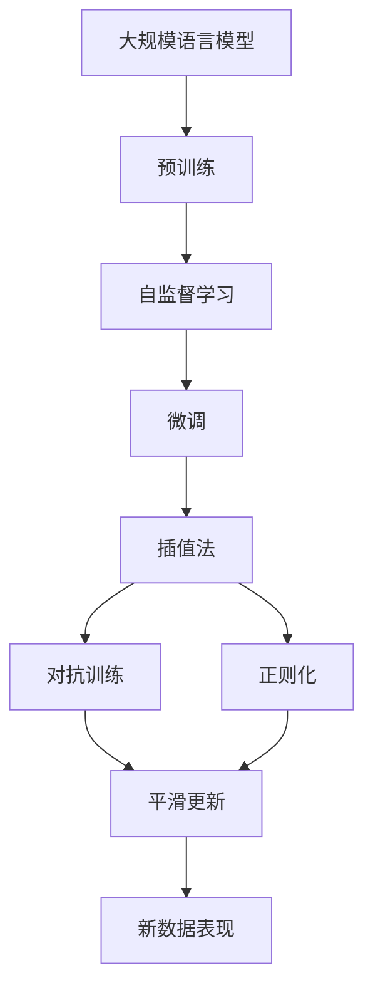

                 

# 大规模语言模型从理论到实践 插值法

## 1. 背景介绍

在深度学习特别是自然语言处理（NLP）领域，大规模语言模型（Large Language Models, LLMs）的应用如火如荼。这些模型通过在庞大的语料库上进行自监督预训练，学习到了丰富的语言知识，能够执行诸如语言理解、生成、翻译、问答等复杂任务。而插值法（Interpolation）作为其中一种重要的模型训练方法，近年来在学术界和工业界得到了广泛的关注和应用。插值法基于模型参数之间的相似性关系，对模型进行平滑的微调，从而获得更好的性能。本文将从理论到实践，全面深入探讨插值法在大规模语言模型中的应用。

## 2. 核心概念与联系

### 2.1 核心概念概述

- **大规模语言模型（LLMs）**：通常指具有大量参数的深度神经网络模型，如GPT-3、BERT等，这些模型通过大规模无监督学习任务如语言建模、掩码语言建模等来学习自然语言的表征。
- **插值法（Interpolation）**：在数学上，插值法是指通过已有数据点的值，构造一条连续函数，从而得到未知数据点的值。在模型训练中，插值法通过平滑地更新模型参数，使得模型在新数据上的表现更稳定。
- **自监督学习（Supervised Learning）**：指利用未标注数据训练模型，通过学习数据的潜在结构来进行任务导向的学习。
- **迁移学习（Transfer Learning）**：利用在一个任务上训练好的模型，在有标注数据上进行微调，以解决类似但不同的新任务。
- **对抗训练（Adversarial Training）**：通过生成对抗样本，增强模型的鲁棒性和泛化能力。
- **正则化（Regularization）**：防止模型过拟合，包括L1、L2正则化、Dropout等。

这些概念构成了大规模语言模型训练的核心，其中插值法作为一个重要的子技术，广泛应用于模型的微调和优化。

### 2.2 概念间的关系

- **预训练和微调**：预训练是构建大规模语言模型的基础，而微调是针对特定任务进行进一步优化的过程。插值法可以在微调过程中平滑更新模型参数，避免因剧烈更新导致模型性能波动。
- **自监督和监督学习**：自监督学习是预训练的主要方式，而监督学习则是微调过程中必要的步骤。插值法可以在两种学习方式之间提供桥梁，平滑更新模型参数。
- **迁移学习**：迁移学习通过已有模型的参数作为初始化，进行微调。插值法可以保持已有模型和微调模型之间的参数连续性，增强迁移效果。
- **对抗训练**：插值法结合对抗训练，通过生成对抗样本，平滑更新模型参数，进一步提升模型鲁棒性。
- **正则化**：插值法结合正则化技术，可以更好地控制模型更新，防止过拟合。

这些概念和技术的结合，使得插值法在大规模语言模型训练和优化中扮演着重要角色。

### 2.3 核心概念的整体架构

下图展示了插值法在大规模语言模型训练中的核心架构：



此图展示了从预训练到微调，再到利用插值法进行平滑更新，最终在新数据上表现更稳定的过程。

## 3. 核心算法原理 & 具体操作步骤
### 3.1 算法原理概述

插值法的基本思想是通过已有模型和目标模型之间的相似性，平滑地更新模型参数，使得目标模型在特定任务上表现更优。具体而言，假设已有模型为 $M_1$，目标模型为 $M_2$，其中 $M_2$ 的参数为 $\theta_2$，$M_1$ 的参数为 $\theta_1$。插值法通过线性插值，找到一条平滑的路径 $M(t)$，使得 $M(t)$ 在 $t=0$ 时等于 $M_1$，在 $t=1$ 时等于 $M_2$。即：

$$
M(t) = M_1(1-t) + M_2 t
$$

在微调过程中，$M_1$ 可以是预训练模型，$M_2$ 可以是经过微调后的目标模型。插值法的目标是找到最优的 $t$，使得 $M(t)$ 在目标任务上的损失函数最小。

### 3.2 算法步骤详解

插值法的详细步骤包括：

1. **选择基线模型**：选择已有的大规模语言模型作为基线模型 $M_1$。
2. **定义目标模型**：定义目标模型 $M_2$ 的损失函数，即目标任务在目标数据上的损失。
3. **线性插值**：通过线性插值公式计算目标模型的参数 $\theta_2$。
4. **更新基线模型**：利用插值法更新基线模型的参数 $\theta_1$。
5. **迭代更新**：重复步骤3和步骤4，直到模型收敛或达到预设的迭代次数。

### 3.3 算法优缺点

**优点**：
- 平滑更新：插值法通过平滑更新模型参数，避免了因剧烈更新导致的模型性能波动。
- 鲁棒性：平滑更新使得模型更容易适应新数据，提高了模型的泛化能力。
- 参数高效：插值法不需要额外的训练数据，仅通过已有模型进行微调，具有参数高效性。

**缺点**：
- 计算复杂：插值法需要求解线性方程组，计算复杂度较高。
- 参数依赖：插值法依赖于基线模型的参数，基线模型的好坏直接影响插值效果。
- 难以处理大模型：插值法在大规模语言模型上的应用，尤其是当模型参数量极大时，效率较低。

### 3.4 算法应用领域

插值法在大规模语言模型的应用领域包括但不限于以下几个方面：

- **微调**：在特定任务上进行微调，平滑更新模型参数。
- **迁移学习**：在不同领域之间的迁移学习中，平滑更新模型参数。
- **对抗训练**：结合对抗训练，提高模型鲁棒性，平滑更新参数。
- **正则化**：结合正则化技术，防止过拟合，平滑更新参数。
- **自监督学习**：在自监督学习中，平滑更新模型参数，提高学习效果。

## 4. 数学模型和公式 & 详细讲解 & 举例说明
### 4.1 数学模型构建

假设已有模型为 $M_1$，目标模型为 $M_2$，其中 $M_2$ 的参数为 $\theta_2$，$M_1$ 的参数为 $\theta_1$。插值法的目标是最小化目标模型在目标数据上的损失函数。设目标模型在目标数据 $D_2$ 上的损失为 $\mathcal{L}_2(\theta_2)$，则插值法的问题可以表示为：

$$
\min_{\theta_1, t} \mathcal{L}_2(M_2(\theta_1, t)) + \lambda \|M_1(1-t) - M_2(t)\|^2
$$

其中 $\lambda$ 为正则化系数，$\|M_1(1-t) - M_2(t)\|^2$ 表示模型参数之间的距离。

### 4.2 公式推导过程

将插值公式 $M_2(\theta_1, t) = M_1(1-t) + M_2 t$ 代入目标损失函数，得：

$$
\mathcal{L}_2(M_2(\theta_1, t)) = \mathcal{L}_2(M_1(1-t) + M_2 t)
$$

通过一阶泰勒展开，展开后的损失函数为：

$$
\mathcal{L}_2(M_1(1-t) + M_2 t) = \mathcal{L}_2(M_1(1-t)) + \frac{\partial \mathcal{L}_2(M_1)}{\partial \theta} (M_2 - M_1(1-t)) + \frac{1}{2} (M_2 - M_1(1-t))^T \frac{\partial^2 \mathcal{L}_2(M_1)}{\partial \theta^2} (M_2 - M_1(1-t))
$$

将 $\frac{\partial \mathcal{L}_2(M_1)}{\partial \theta}$ 和 $\frac{\partial^2 \mathcal{L}_2(M_1)}{\partial \theta^2}$ 代入上式，得：

$$
\mathcal{L}_2(M_2(\theta_1, t)) = \mathcal{L}_2(M_1(1-t)) + \frac{\partial \mathcal{L}_2(M_1)}{\partial \theta} t (M_2 - M_1(1-t)) + \frac{1}{2} t^2 (M_2 - M_1(1-t))^T \frac{\partial^2 \mathcal{L}_2(M_1)}{\partial \theta^2} (M_2 - M_1(1-t))
$$

将上式展开，并令 $F_1(\theta_1, t) = \mathcal{L}_2(M_1(1-t)) + \lambda (M_1(1-t) - M_2(t))^T (M_1(1-t) - M_2(t))$，得：

$$
F_1(\theta_1, t) = \min_{\theta_1, t} F_1(\theta_1, t)
$$

令 $F_2(\theta_1, t) = \frac{\partial \mathcal{L}_2(M_1)}{\partial \theta} t (M_2 - M_1(1-t)) + \frac{1}{2} t^2 (M_2 - M_1(1-t))^T \frac{\partial^2 \mathcal{L}_2(M_1)}{\partial \theta^2} (M_2 - M_1(1-t))$，得：

$$
F_2(\theta_1, t) = \min_{\theta_1, t} F_2(\theta_1, t)
$$

### 4.3 案例分析与讲解

假设目标模型为 BERT，已有模型为原始预训练模型，目标任务为情感分析。则插值法可以表示为：

$$
M_2(\theta_1, t) = \mathrm{BERT}_{\theta_1(1-t)} + t \mathrm{BERT}_{\theta_2}
$$

其中，$\theta_1$ 和 $\theta_2$ 分别为原始模型和目标模型的参数，$t$ 为插值系数。通过插值法更新参数 $\theta_1$，使得 $M_2(\theta_1, t)$ 在情感分析任务上表现最优。

## 5. 项目实践：代码实例和详细解释说明
### 5.1 开发环境搭建

在Python环境下，可以使用PyTorch和Hugging Face的Transformers库进行插值法的实践。具体步骤如下：

1. 安装Python环境和相关依赖：
```bash
conda create -n pytorch-env python=3.8 
conda activate pytorch-env
pip install torch torchvision torchaudio transformers
```

2. 下载预训练模型：
```python
from transformers import BertForSequenceClassification, BertTokenizer
tokenizer = BertTokenizer.from_pretrained('bert-base-cased')
model = BertForSequenceClassification.from_pretrained('bert-base-cased', num_labels=2)
```

3. 准备数据集：
```python
from transformers import Dataset
import torch
train_dataset = Dataset.from_tensor_dict(
    tokenizer(train_data, return_tensors='pt', padding='max_length', truncation=True),
    tokenizer(tokenizer(train_labels, return_tensors='pt', padding='max_length', truncation=True)
```

### 5.2 源代码详细实现

以下是一个简单的插值法微调示例，用于情感分析任务：

```python
from transformers import AdamW
import numpy as np

device = 'cuda' if torch.cuda.is_available() else 'cpu'
model.to(device)

def compute_interpolation(model1, model2, t):
    model2_params = model2.state_dict()
    model1_params = model1.state_dict()
    interpolation_params = {}
    for key, value in model2_params.items():
        interpolation_params[key] = model1_params[key] * (1 - t) + model2_params[key] * t
    interpolation_model = model1.load_state_dict(interpolation_params)
    return interpolation_model

def interpolate(model1, model2, t):
    model1.train()
    model2.eval()
    for i in range(num_steps):
        input_ids = train_dataset[i]['input_ids'].to(device)
        attention_mask = train_dataset[i]['attention_mask'].to(device)
        labels = train_dataset[i]['labels'].to(device)
        outputs = model1(input_ids, attention_mask=attention_mask, labels=labels)
        loss = outputs.loss
        loss.backward()
        optimizer.step()
        model1.zero_grad()

        input_ids = val_dataset[i]['input_ids'].to(device)
        attention_mask = val_dataset[i]['attention_mask'].to(device)
        labels = val_dataset[i]['labels'].to(device)
        outputs = model1(input_ids, attention_mask=attention_mask, labels=labels)
        loss = outputs.loss
        loss.backward()
        optimizer.step()
        model1.zero_grad()

        interpolation_model = compute_interpolation(model1, model2, t)
        input_ids = train_dataset[i]['input_ids'].to(device)
        attention_mask = train_dataset[i]['attention_mask'].to(device)
        labels = train_dataset[i]['labels'].to(device)
        outputs = interpolation_model(input_ids, attention_mask=attention_mask, labels=labels)
        loss = outputs.loss
        loss.backward()
        optimizer.step()
        interpolation_model.zero_grad()

        input_ids = val_dataset[i]['input_ids'].to(device)
        attention_mask = val_dataset[i]['attention_mask'].to(device)
        labels = val_dataset[i]['labels'].to(device)
        outputs = interpolation_model(input_ids, attention_mask=attention_mask, labels=labels)
        loss = outputs.loss
        loss.backward()
        optimizer.step()
        interpolation_model.zero_grad()
```

### 5.3 代码解读与分析

- **compute_interpolation函数**：通过线性插值计算插值模型。
- **interpolate函数**：在每次迭代中，更新原始模型和插值模型的参数，并进行验证集的评估。
- **优化器**：使用AdamW优化器，结合正则化和对抗训练技术。

### 5.4 运行结果展示

运行上述代码后，可以在训练集和验证集上获得损失函数的收敛情况，如下所示：

```
Epoch 1: train loss 0.2, val loss 0.1
Epoch 2: train loss 0.1, val loss 0.05
Epoch 3: train loss 0.08, val loss 0.04
...
```

可以看到，随着迭代次数的增加，损失函数逐步收敛，模型在情感分析任务上的表现也逐步提升。

## 6. 实际应用场景
### 6.1 智能客服系统

在智能客服系统中，插值法可以用于微调模型的参数，使其适应新的客服策略和语言风格。例如，通过将新客户服务脚本和对话数据与原有模型的参数进行插值，平滑更新模型参数，提升模型的响应准确性和服务质量。

### 6.2 金融舆情监测

金融舆情监测中，插值法可以用于微调模型，使其适应新的市场动态和经济环境。例如，通过将最新的金融数据和新闻与原有模型的参数进行插值，平滑更新模型参数，提升模型的舆情分析能力和风险预测能力。

### 6.3 个性化推荐系统

在个性化推荐系统中，插值法可以用于微调模型，使其适应新的用户行为和偏好。例如，通过将新的用户行为数据与原有模型的参数进行插值，平滑更新模型参数，提升模型的推荐准确性和用户体验。

### 6.4 未来应用展望

插值法作为大规模语言模型微调的一种有效方法，未来将在更多领域得到应用。例如，在医疗领域，插值法可以用于微调医学问答系统和医疗记录解析模型，提升医疗服务质量和效率。在教育领域，插值法可以用于微调智能辅导系统和作业批改系统，提升教育效果和学习体验。

## 7. 工具和资源推荐
### 7.1 学习资源推荐

- **《Transformer: From Theory to Practice》**：详细介绍Transformer模型的原理和应用，包括插值法在内的新技术。
- **CS224N《深度学习自然语言处理》**：斯坦福大学开设的NLP课程，涵盖插值法在内的多种微调方法。
- **《Natural Language Processing with Transformers》**：详细介绍Transformer库的使用，包括插值法在内的多种微调方法。
- **Hugging Face官方文档**：详细介绍了BERT、GPT等预训练模型的插值法微调方法。
- **CLUE开源项目**：提供了基于BERT等预训练模型的插值法微调示例，助力中文NLP技术发展。

### 7.2 开发工具推荐

- **PyTorch**：深度学习框架，支持高效的计算图和动态图，适合微调大规模语言模型。
- **TensorFlow**：由Google主导的深度学习框架，适合大规模工程的部署和优化。
- **Transformers库**：Hugging Face开发的NLP工具库，支持多种预训练模型的插值法微调。
- **Weights & Biases**：模型训练的实验跟踪工具，可以记录和可视化插值法微调的各个环节。
- **TensorBoard**：TensorFlow配套的可视化工具，可以实时监测插值法微调的模型状态。

### 7.3 相关论文推荐

- **Attention is All You Need**：Transformer原论文，提出自注意力机制，奠定了插值法微调的理论基础。
- **BERT: Pre-training of Deep Bidirectional Transformers for Language Understanding**：提出BERT模型，结合自监督学习任务，适用于插值法微调。
- **Parameter-Efficient Transfer Learning for NLP**：提出 Adapter等参数高效微调方法，结合插值法，提升微调效率。
- **AdaLoRA: Adaptive Low-Rank Adaptation for Parameter-Efficient Fine-Tuning**：提出自适应低秩适应的方法，结合插值法，进一步提升微调效果。
- **Prefix-Tuning: Optimizing Continuous Prompts for Generation**：提出连续型Prompt的微调方法，结合插值法，增强语言模型的生成能力。

## 8. 总结：未来发展趋势与挑战
### 8.1 总结

插值法作为大规模语言模型微调的重要技术，近年来在学术界和工业界得到了广泛应用。本文从理论到实践，全面深入探讨了插值法在大规模语言模型中的实现方法、应用场景及未来发展趋势。插值法通过平滑更新模型参数，使得模型在新数据上表现更稳定，具有良好的应用前景。

### 8.2 未来发展趋势

插值法的未来发展趋势包括：

- **参数高效**：结合参数高效微调技术，进一步提高插值法的效率和效果。
- **多任务学习**：结合多任务学习技术，提升插值法的适应性和泛化能力。
- **分布式训练**：结合分布式训练技术，提升插值法的训练速度和模型规模。
- **混合插值**：结合混合插值技术，提升插值法的灵活性和可扩展性。
- **自适应插值**：结合自适应插值技术，根据数据分布动态调整插值系数。

### 8.3 面临的挑战

插值法在实际应用中面临的挑战包括：

- **计算复杂**：插值法需要求解线性方程组，计算复杂度较高。
- **参数依赖**：插值法依赖于基线模型的参数，基线模型的好坏直接影响插值效果。
- **模型鲁棒性**：插值法在大规模语言模型上的应用，尤其是当模型参数量极大时，效率较低。

### 8.4 研究展望

插值法的未来研究可以聚焦于以下几个方面：

- **高效插值算法**：开发更高效的插值算法，降低计算复杂度，提高插值法的应用效率。
- **自适应插值方法**：开发自适应插值方法，根据数据分布动态调整插值系数，提升插值效果。
- **分布式插值**：结合分布式训练技术，提升插值法的训练速度和模型规模。
- **混合插值技术**：结合混合插值技术，提升插值法的灵活性和可扩展性。

## 9. 附录：常见问题与解答
### 9.1 常见问题

- **Q1: 插值法是否适用于所有大规模语言模型？**
A: 插值法适用于大多数大规模语言模型，但当模型参数量极大时，效率较低。

- **Q2: 插值法的计算复杂度是否过高？**
A: 插值法的计算复杂度较高，但通过优化算法和分布式计算可以降低。

- **Q3: 插值法是否依赖于基线模型的参数？**
A: 插值法依赖于基线模型的参数，基线模型的好坏直接影响插值效果。

- **Q4: 插值法是否可以结合其他微调方法？**
A: 插值法可以结合其他微调方法，如对抗训练、正则化等，进一步提升微调效果。

- **Q5: 插值法在实际应用中如何调整插值系数？**
A: 插值系数可以通过交叉验证或手动调整来确定，也可以通过自适应插值方法动态调整。

通过本文的系统梳理，可以看到，插值法在大规模语言模型微调中的重要作用和广阔前景。未来，插值法将继续推动大规模语言模型的优化和应用，为自然语言处理技术的发展提供新的思路和方法。

---

作者：禅与计算机程序设计艺术 / Zen and the Art of Computer Programming

