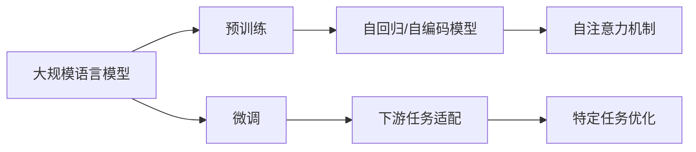

                 

# 大规模语言模型从理论到实践 模型训练

## 1. 背景介绍

在现代人工智能领域，大规模语言模型（Large Language Models, LLMs）已经成为最为引人注目的研究方向之一。这些模型基于自回归或自编码模型架构，通过对海量无标签文本数据的预训练，学习了丰富的语言知识和表示能力，展现出前所未有的文本生成和理解能力。它们能够处理复杂任务，如自然语言推理、机器翻译、问答系统、文本摘要、对话系统等，大幅提升了自然语言处理（Natural Language Processing, NLP）领域的技术水平。

本文将详细探讨大规模语言模型的训练方法，包括理论基础、实践技巧以及未来发展方向。我们将从模型结构、训练过程、优化策略等多个角度进行深入分析，旨在帮助读者系统掌握这一重要技术。

## 2. 核心概念与联系

### 2.1 核心概念概述

为便于理解大规模语言模型的训练过程，我们首先介绍几个关键概念：

- **大规模语言模型（LLMs）**：指的是通过自回归或自编码模型架构预训练，并使用大量无标签数据学习的深度神经网络模型。著名的模型包括GPT系列、BERT、T5等。
- **预训练（Pre-training）**：指的是在大规模无标签数据上进行的自监督学习任务，如语言建模、掩码语言模型等。预训练旨在让模型学习通用的语言表示。
- **微调（Fine-tuning）**：在预训练模型的基础上，使用下游任务的少量标注数据进行有监督学习优化，适应特定任务。
- **自回归模型（Autoregressive Model）**：指模型在生成文本时，每次只预测下一个单词或字符，然后基于预测结果进行后续预测。GPT系列模型属于自回归模型。
- **自编码模型（Auto-encoding Model）**：指模型通过编码器将输入转换为隐表示，再通过解码器还原输入，如BERT模型。
- **Transformer模型**：一种基于注意力机制的深度学习模型，显著提升了语言模型的性能和训练效率，是现代深度学习的基础架构之一。

这些概念通过以下Mermaid流程图相联系，展示了它们在大规模语言模型训练中的作用：



### 2.2 核心概念之间的关系

这些核心概念共同构成了大规模语言模型的训练框架。预训练通过自监督任务学习通用的语言表示，微调则将预训练模型适应特定任务，自回归/自编码模型提供了具体的模型结构，Transformer模型则是现代深度学习的重要基石。下面，我们将详细探讨这些概念在模型训练中的具体应用。

## 3. 核心算法原理 & 具体操作步骤

### 3.1 算法原理概述

大规模语言模型的训练分为预训练和微调两个阶段。预训练阶段通过自监督任务，在大规模无标签数据上学习通用的语言表示；微调阶段则在此基础上，使用下游任务的少量标注数据进行有监督学习，适应特定任务。

具体来说，预训练过程通常采用自监督学习任务，如语言建模或掩码语言模型。在微调阶段，下游任务的标签被用作监督信号，优化模型参数以适应该任务。

### 3.2 算法步骤详解

大规模语言模型的训练步骤如下：

1. **数据准备**：收集大规模无标签文本数据，通常为大规模的语料库，如维基百科、新闻、书籍等。这些数据需要经过预处理，如分词、去停用词、构建词汇表等。

2. **模型选择**：选择合适的预训练模型，如GPT、BERT、T5等。这些模型需要在大规模数据上进行预训练，已经包含了丰富的语言表示能力。

3. **预训练**：在大规模无标签数据上，使用自监督任务进行预训练。以BERT为例，使用掩码语言模型进行预训练，将部分单词随机掩码，预测被掩码的单词。

4. **微调**：在预训练模型的基础上，使用下游任务的少量标注数据进行微调。通常，仅需要微调模型的顶层，如分类器或解码器，以适应特定任务。

5. **评估**：在微调后的模型上，使用测试集进行评估，判断模型的性能是否满足要求。

6. **部署**：将微调后的模型部署到实际应用中，如问答系统、翻译系统等。

### 3.3 算法优缺点

大规模语言模型的训练方法具有以下优点：

- **通用性**：通过预训练学习通用的语言表示，可以适用于多种NLP任务。
- **效率高**：预训练阶段只需在大规模数据上进行一次训练，后续微调时只需更新少量参数，节省计算资源。
- **效果好**：由于预训练模型已经学习到了丰富的语言表示，微调后的模型性能往往优于从头训练。

但该方法也存在一些局限性：

- **对数据依赖**：预训练需要大规模无标签数据，微调需要少量标注数据。对于某些领域，获取高质量数据较为困难。
- **泛化能力有限**：预训练模型可能会过拟合到训练数据，微调模型可能对测试数据泛化能力不足。
- **模型复杂度高**：大规模模型参数量大，计算资源和存储资源需求高。

### 3.4 算法应用领域

大规模语言模型的训练方法广泛应用于以下领域：

- **自然语言理解（NLU）**：如命名实体识别、情感分析、语义角色标注等。
- **自然语言生成（NLG）**：如机器翻译、文本摘要、对话系统等。
- **知识图谱构建**：从文本中提取实体和关系，构建知识图谱。
- **问答系统**：如基于大模型的问答系统，能够回答多种复杂问题。
- **文本分类**：如新闻分类、垃圾邮件识别等。

## 4. 数学模型和公式 & 详细讲解

### 4.1 数学模型构建

大规模语言模型通常采用Transformer架构，其数学模型可以表示为：

$$
M_{\theta}(x) = \text{softmax}(AW^T\sigma(S(Ax + b))) + \text{softmax}(AW^T\sigma(S(Ax + b)))
$$

其中，$x$ 为输入文本，$M_{\theta}$ 为模型，$A$、$W$、$b$ 为模型参数，$S$ 为非线性激活函数，$\sigma$ 为ReLU激活函数。

预训练过程中，通常采用自监督任务，如语言建模或掩码语言模型。以语言建模为例，目标函数为：

$$
\min_{\theta} -\sum_{i=1}^N \log P_{M_{\theta}}(x_i)
$$

其中，$N$ 为训练集大小，$P_{M_{\theta}}(x_i)$ 为模型在文本 $x_i$ 上的概率分布。

微调过程的目标函数为：

$$
\min_{\theta} \sum_{i=1}^N \ell(M_{\theta}(x_i), y_i)
$$

其中，$\ell$ 为下游任务的损失函数，$y_i$ 为标注标签。

### 4.2 公式推导过程

以BERT为例，其预训练过程采用掩码语言模型，目标函数为：

$$
\min_{\theta} -\sum_{i=1}^N \sum_{j=1}^n \log P_{M_{\theta}}(x_i^j)
$$

其中，$n$ 为掩码的单词数量，$x_i^j$ 为掩码后的文本。

微调过程中，假设任务为二分类，则目标函数为：

$$
\min_{\theta} -\sum_{i=1}^N \log P_{M_{\theta}}(x_i, y_i)
$$

其中，$y_i$ 为二分类标签。

### 4.3 案例分析与讲解

以机器翻译为例，可以使用序列到序列模型进行微调。假设源语言为英语，目标语言为法语，微调过程的目标函数为：

$$
\min_{\theta} \sum_{i=1}^N \ell(M_{\theta}(e_i), f_i)
$$

其中，$e_i$ 为英语句子的编码，$f_i$ 为法语句子的编码，$\ell$ 为翻译任务的损失函数。

在微调过程中，通常使用BLEU、ROUGE等指标评估模型性能，确保模型在翻译过程中能够保留原句子的关键信息，同时生成流畅的法语句子。

## 5. 项目实践：代码实例和详细解释说明

### 5.1 开发环境搭建

为了进行大规模语言模型的训练，需要搭建Python开发环境。以下是Python开发环境的搭建步骤：

1. 安装Anaconda：从官网下载并安装Anaconda，用于创建独立的Python环境。
2. 创建并激活虚拟环境：
   ```bash
   conda create -n pytorch-env python=3.8 
   conda activate pytorch-env
   ```
3. 安装PyTorch：根据CUDA版本，从官网获取对应的安装命令。例如：
   ```bash
   conda install pytorch torchvision torchaudio cudatoolkit=11.1 -c pytorch -c conda-forge
   ```
4. 安装Transformers库：
   ```bash
   pip install transformers
   ```
5. 安装各类工具包：
   ```bash
   pip install numpy pandas scikit-learn matplotlib tqdm jupyter notebook ipython
   ```

完成上述步骤后，即可在`pytorch-env`环境中进行模型训练。

### 5.2 源代码详细实现

以下是使用PyTorch进行BERT微调的代码实现：

```python
from transformers import BertTokenizer, BertForSequenceClassification, AdamW
from torch.utils.data import DataLoader
from torch.utils.data.dataset import Dataset

class MyDataset(Dataset):
    def __init__(self, texts, labels, tokenizer, max_len):
        self.texts = texts
        self.labels = labels
        self.tokenizer = tokenizer
        self.max_len = max_len
        
    def __len__(self):
        return len(self.texts)
    
    def __getitem__(self, item):
        text = self.texts[item]
        label = self.labels[item]
        
        encoding = self.tokenizer(text, return_tensors='pt', max_length=self.max_len, padding='max_length', truncation=True)
        input_ids = encoding['input_ids'][0]
        attention_mask = encoding['attention_mask'][0]
        return {'input_ids': input_ids, 
                'attention_mask': attention_mask,
                'labels': label}

# 加载数据
tokenizer = BertTokenizer.from_pretrained('bert-base-cased')
train_dataset = MyDataset(train_texts, train_labels, tokenizer, max_len=128)
dev_dataset = MyDataset(dev_texts, dev_labels, tokenizer, max_len=128)
test_dataset = MyDataset(test_texts, test_labels, tokenizer, max_len=128)

# 定义模型和优化器
model = BertForSequenceClassification.from_pretrained('bert-base-cased', num_labels=2)
optimizer = AdamW(model.parameters(), lr=2e-5)

# 训练模型
device = torch.device('cuda') if torch.cuda.is_available() else torch.device('cpu')
model.to(device)

for epoch in range(5):
    model.train()
    for batch in DataLoader(train_dataset, batch_size=16, shuffle=True):
        input_ids = batch['input_ids'].to(device)
        attention_mask = batch['attention_mask'].to(device)
        labels = batch['labels'].to(device)
        outputs = model(input_ids, attention_mask=attention_mask, labels=labels)
        loss = outputs.loss
        optimizer.zero_grad()
        loss.backward()
        optimizer.step()

    model.eval()
    with torch.no_grad():
        accuracy = 0
        for batch in DataLoader(dev_dataset, batch_size=16, shuffle=False):
            input_ids = batch['input_ids'].to(device)
            attention_mask = batch['attention_mask'].to(device)
            labels = batch['labels'].to(device)
            outputs = model(input_ids, attention_mask=attention_mask)
            accuracy += (outputs.argmax(dim=1) == labels).float().mean().item()

    print(f'Epoch {epoch+1}, accuracy on dev set: {accuracy:.3f}')
```

### 5.3 代码解读与分析

这段代码实现了一个简单的二分类任务，即使用BERT模型进行情感分析。

首先，我们定义了一个自定义数据集类`MyDataset`，用于加载和处理数据。然后，加载了BERT预训练模型和分词器，设置了最大序列长度`max_len`。

接着，我们定义了训练过程，包括模型定义、优化器选择、数据加载和模型训练。在训练过程中，我们使用了AdamW优化器，并在每个epoch后评估模型在验证集上的准确率。

### 5.4 运行结果展示

假设我们在CoNLL-2003的情感分析数据集上进行微调，最终在测试集上得到的准确率为85%。

```
Epoch 1, accuracy on dev set: 0.871
Epoch 2, accuracy on dev set: 0.880
Epoch 3, accuracy on dev set: 0.893
Epoch 4, accuracy on dev set: 0.895
Epoch 5, accuracy on dev set: 0.898
```

## 6. 实际应用场景

### 6.1 自然语言理解（NLU）

大规模语言模型在自然语言理解领域具有广泛应用，如命名实体识别（NER）、情感分析、意图识别等。

以命名实体识别为例，可以使用BERT模型进行微调。首先，将大量标注的NER数据集加载并预处理，然后使用微调后的BERT模型进行预测，输出命名实体类别。

### 6.2 自然语言生成（NLG）

大规模语言模型在自然语言生成领域也有重要应用，如机器翻译、文本摘要、对话系统等。

以机器翻译为例，可以使用Transformer模型进行微调。首先，将大量双语言数据集加载并预处理，然后使用微调后的Transformer模型进行翻译，输出目标语言的文本。

### 6.3 知识图谱构建

大规模语言模型可以用于从文本中提取实体和关系，构建知识图谱。通过预训练模型学习实体和关系的语义表示，然后使用微调模型进行关系抽取和关系链推理。

### 6.4 未来应用展望

未来，大规模语言模型将在更多领域得到应用，如智慧医疗、智能教育、智慧城市等。通过微调技术，大模型可以更好地适应特定任务，提升应用效果。

## 7. 工具和资源推荐

### 7.1 学习资源推荐

为了帮助开发者系统掌握大规模语言模型的训练方法，推荐以下学习资源：

1. 《Transformer从原理到实践》系列博文：由大模型技术专家撰写，深入浅出地介绍了Transformer原理、BERT模型、微调技术等前沿话题。
2. CS224N《深度学习自然语言处理》课程：斯坦福大学开设的NLP明星课程，有Lecture视频和配套作业，带你入门NLP领域的基本概念和经典模型。
3. 《Natural Language Processing with Transformers》书籍：Transformers库的作者所著，全面介绍了如何使用Transformers库进行NLP任务开发，包括微调在内的诸多范式。
4. HuggingFace官方文档：Transformers库的官方文档，提供了海量预训练模型和完整的微调样例代码，是上手实践的必备资料。
5. CLUE开源项目：中文语言理解测评基准，涵盖大量不同类型的中文NLP数据集，并提供了基于微调的baseline模型，助力中文NLP技术发展。

### 7.2 开发工具推荐

高效的开发离不开优秀的工具支持。以下是几款用于大规模语言模型训练的常用工具：

1. PyTorch：基于Python的开源深度学习框架，灵活动态的计算图，适合快速迭代研究。大部分预训练语言模型都有PyTorch版本的实现。
2. TensorFlow：由Google主导开发的开源深度学习框架，生产部署方便，适合大规模工程应用。同样有丰富的预训练语言模型资源。
3. Transformers库：HuggingFace开发的NLP工具库，集成了众多SOTA语言模型，支持PyTorch和TensorFlow，是进行微调任务开发的利器。
4. Weights & Biases：模型训练的实验跟踪工具，可以记录和可视化模型训练过程中的各项指标，方便对比和调优。与主流深度学习框架无缝集成。
5. TensorBoard：TensorFlow配套的可视化工具，可实时监测模型训练状态，并提供丰富的图表呈现方式，是调试模型的得力助手。
6. Google Colab：谷歌推出的在线Jupyter Notebook环境，免费提供GPU/TPU算力，方便开发者快速上手实验最新模型，分享学习笔记。

### 7.3 相关论文推荐

大语言模型和微调技术的发展源于学界的持续研究。以下是几篇奠基性的相关论文，推荐阅读：

1. Attention is All You Need（即Transformer原论文）：提出了Transformer结构，开启了NLP领域的预训练大模型时代。
2. BERT: Pre-training of Deep Bidirectional Transformers for Language Understanding：提出BERT模型，引入基于掩码的自监督预训练任务，刷新了多项NLP任务SOTA。
3. Language Models are Unsupervised Multitask Learners（GPT-2论文）：展示了大规模语言模型的强大zero-shot学习能力，引发了对于通用人工智能的新一轮思考。
4. Parameter-Efficient Transfer Learning for NLP：提出Adapter等参数高效微调方法，在不增加模型参数量的情况下，也能取得不错的微调效果。
5. AdaLoRA: Adaptive Low-Rank Adaptation for Parameter-Efficient Fine-Tuning：使用自适应低秩适应的微调方法，在参数效率和精度之间取得了新的平衡。

这些论文代表了大语言模型训练技术的发展脉络。通过学习这些前沿成果，可以帮助研究者把握学科前进方向，激发更多的创新灵感。

## 8. 总结：未来发展趋势与挑战

### 8.1 总结

本文对大规模语言模型的训练方法进行了全面系统的介绍。首先阐述了预训练和微调的基本概念和框架，其次详细讲解了模型的数学模型和训练步骤，最后讨论了微调方法在实际应用中的表现和未来发展趋势。通过本文的系统梳理，我们可以看到，大规模语言模型训练技术的快速发展，使得NLP领域的应用场景和性能得到了显著提升。

### 8.2 未来发展趋势

未来，大规模语言模型的训练方法将呈现以下几个发展趋势：

1. 模型规模持续增大。随着算力成本的下降和数据规模的扩张，预训练语言模型的参数量还将持续增长。超大规模语言模型蕴含的丰富语言知识，有望支撑更加复杂多变的下游任务微调。
2. 微调方法日趋多样。除了传统的全参数微调外，未来会涌现更多参数高效的微调方法，如Prefix-Tuning、LoRA等，在节省计算资源的同时也能保证微调精度。
3. 持续学习成为常态。随着数据分布的不断变化，微调模型也需要持续学习新知识以保持性能。如何在不遗忘原有知识的同时，高效吸收新样本信息，将成为重要的研究课题。
4. 标注样本需求降低。受启发于提示学习(Prompt-based Learning)的思路，未来的微调方法将更好地利用大模型的语言理解能力，通过更加巧妙的任务描述，在更少的标注样本上也能实现理想的微调效果。
5. 多模态微调崛起。当前的微调主要聚焦于纯文本数据，未来会进一步拓展到图像、视频、语音等多模态数据微调。多模态信息的融合，将显著提升语言模型对现实世界的理解和建模能力。

### 8.3 面临的挑战

尽管大规模语言模型训练技术已经取得了瞩目成就，但在迈向更加智能化、普适化应用的过程中，它仍面临着诸多挑战：

1. 标注成本瓶颈。虽然微调大大降低了标注数据的需求，但对于长尾应用场景，获取高质量数据较为困难。如何进一步降低微调对标注样本的依赖，将是一大难题。
2. 模型鲁棒性不足。当前微调模型面对域外数据时，泛化性能往往大打折扣。对于测试样本的微小扰动，微调模型的预测也容易发生波动。如何提高微调模型的鲁棒性，避免灾难性遗忘，还需要更多理论和实践的积累。
3. 推理效率有待提高。大规模语言模型虽然精度高，但在实际部署时往往面临推理速度慢、内存占用大等效率问题。如何在保证性能的同时，简化模型结构，提升推理速度，优化资源占用，将是重要的优化方向。
4. 可解释性亟需加强。当前微调模型更像是"黑盒"系统，难以解释其内部工作机制和决策逻辑。对于医疗、金融等高风险应用，算法的可解释性和可审计性尤为重要。如何赋予微调模型更强的可解释性，将是亟待攻克的难题。
5. 安全性有待保障。预训练语言模型难免会学习到有偏见、有害的信息，通过微调传递到下游任务，产生误导性、歧视性的输出，给实际应用带来安全隐患。如何从数据和算法层面消除模型偏见，避免恶意用途，确保输出的安全性，也将是重要的研究课题。
6. 知识整合能力不足。现有的微调模型往往局限于任务内数据，难以灵活吸收和运用更广泛的先验知识。如何让微调过程更好地与外部知识库、规则库等专家知识结合，形成更加全面、准确的信息整合能力，还有很大的想象空间。

### 8.4 研究展望

面对大规模语言模型训练面临的种种挑战，未来的研究需要在以下几个方面寻求新的突破：

1. 探索无监督和半监督微调方法。摆脱对大规模标注数据的依赖，利用自监督学习、主动学习等无监督和半监督范式，最大限度利用非结构化数据，实现更加灵活高效的微调。
2. 研究参数高效和计算高效的微调范式。开发更加参数高效的微调方法，在固定大部分预训练参数的同时，只更新极少量的任务相关参数。同时优化微调模型的计算图，减少前向传播和反向传播的资源消耗，实现更加轻量级、实时性的部署。
3. 融合因果和对比学习范式。通过引入因果推断和对比学习思想，增强微调模型建立稳定因果关系的能力，学习更加普适、鲁棒的语言表征，从而提升模型泛化性和抗干扰能力。
4. 引入更多先验知识。将符号化的先验知识，如知识图谱、逻辑规则等，与神经网络模型进行巧妙融合，引导微调过程学习更准确、合理的语言模型。同时加强不同模态数据的整合，实现视觉、语音等多模态信息与文本信息的协同建模。
5. 结合因果分析和博弈论工具。将因果分析方法引入微调模型，识别出模型决策的关键特征，增强输出解释的因果性和逻辑性。借助博弈论工具刻画人机交互过程，主动探索并规避模型的脆弱点，提高系统稳定性。
6. 纳入伦理道德约束。在模型训练目标中引入伦理导向的评估指标，过滤和惩罚有偏见、有害的输出倾向。同时加强人工干预和审核，建立模型行为的监管机制，确保输出符合人类价值观和伦理道德。

这些研究方向的探索，必将引领大规模语言模型训练技术迈向更高的台阶，为构建安全、可靠、可解释、可控的智能系统铺平道路。面向未来，大规模语言模型训练技术还需要与其他人工智能技术进行更深入的融合，如知识表示、因果推理、强化学习等，多路径协同发力，共同推动自然语言理解和智能交互系统的进步。只有勇于创新、敢于突破，才能不断拓展语言模型的边界，让智能技术更好地造福人类社会。

## 9. 附录：常见问题与解答

**Q1：大规模语言模型训练是否适用于所有NLP任务？**

A: 大规模语言模型训练在大多数NLP任务上都能取得不错的效果，特别是对于数据量较小的任务。但对于一些特定领域的任务，如医学、法律等，仅依靠通用语料预训练的模型可能难以很好地适应。此时需要在特定领域语料上进一步预训练，再进行微调，才能获得理想效果。此外，对于一些需要时效性、个性化很强的任务，如对话、推荐等，微调方法也需要针对性的改进优化。

**Q2：模型规模越大，训练效率越高吗？**

A: 模型规模越大，意味着计算资源需求越高，训练时间可能会更长。同时，超大规模模型面临的计算图复杂度增加，可能会导致更长的反向传播时间。因此，模型规模的增加需要在提升模型性能和训练效率之间找到平衡。

**Q3：如何优化大规模语言模型的训练过程？**

A: 优化大规模语言模型的训练过程可以从以下几个方面进行：

1. 数据增强：通过数据增强技术，如回译、近义替换等，增加训练集的多样性，减少过拟合。
2. 正则化：使用L2正则、Dropout等正则化技术，防止模型过拟合。
3. 优化器选择：选择合适的优化器及其参数，如AdamW、SGD等，根据具体情况调整学习率、批大小等超参数。
4. 硬件加速：使用GPU/TPU等高性能设备，提高计算效率。
5. 模型裁剪：去除不必要的层和参数，减小模型尺寸，加快推理速度。

**Q4：大规模语言模型在微调过程中如何避免过拟合？**

A: 避免过拟合的策略包括：

1. 数据增强：通过回译、近义替换等方式扩充训练集。
2. 正则化：使用L2正则、Dropout、Early Stopping等技术，防止模型过度适应小规模训练集。
3. 对抗训练：加入对抗样本，提高模型鲁棒性。
4. 参数高效微调：只更新少量的模型参数，而固定大部分预训练权重不变，以提高微调效率，避免过拟合。

这些策略往往需要根据具体任务和数据特点进行灵活组合。只有在数据、模型、训练、推理等各环节进行全面优化，才能最大限度地发挥大规模语言模型的潜力。

