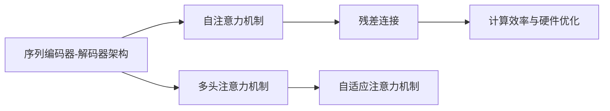
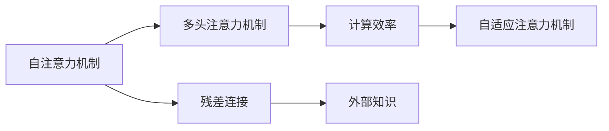

                 

# 大规模语言模型从理论到实践 注意力机制优化

## 1. 背景介绍

### 1.1 问题由来

在深度学习时代，大规模语言模型（Large Language Models, LLMs）的崛起标志着自然语言处理（NLP）领域的一个新纪元。从早期的单层RNN、CNN到现在的Transformer模型，语言模型结构的发展已经带来了性能上的巨大飞跃。其中，基于注意力机制的Transformer模型因其出色的并行性、自适应性以及卓越的性能表现，成为了当前语言处理领域的核心。

近年来，基于Transformer模型的大规模预训练语言模型（如BERT、GPT等）在各种自然语言处理任务上表现优异，诸如文本分类、命名实体识别、情感分析、机器翻译等。这些预训练模型通过在大规模无标签文本上学习语言规律，再通过微调（Fine-tuning）来适配特定任务，从而在各个任务上取得卓越的性能。

然而，尽管Transformer模型已经取得了显著成就，但在实际应用中仍然存在一些限制和挑战。例如，对于长文本（如新闻、学术论文等），Transformer模型可能无法充分捕捉上下文信息，导致模型输出不够连贯。此外，注意力机制本身的计算复杂度高，在大规模语言模型中往往需要更多的计算资源和内存，这对硬件资源提出了较高的要求。

为了解决这些问题，研究者们提出了许多改进方法，如自适应注意力机制、残差连接、多头注意力机制等，使得Transformer模型在效率和性能上取得了进一步提升。本文旨在深入探讨注意力机制的理论基础和实际优化方法，帮助读者理解Transformer模型的工作原理，并掌握如何通过优化注意力机制来提升模型的效果。

### 1.2 问题核心关键点

本节将详细阐述基于注意力机制的大规模语言模型的核心概念及其联系，并从理论到实践进行深入探讨。

- **自注意力机制（Self-Attention）**：Transformer模型的核心组成部分，通过计算输入序列中每个位置与其他位置的相关性来获取上下文信息。
- **多头注意力机制（Multi-Head Attention）**：在自注意力机制的基础上，将输入序列投影到多个不同的空间中，以捕捉不同角度的信息。
- **残差连接（Residual Connections）**：在模型中添加跨层连接，以缓解梯度消失问题，提高模型的训练效率。
- **自适应注意力机制（Adaptive Attention）**：通过引入外部知识，如知识图谱、逻辑规则等，对模型的注意力分配进行指导和优化。
- **计算效率与硬件优化**：探讨如何通过硬件优化（如分布式训练、量化加速等）提升Transformer模型的计算效率。

这些核心概念及其联系构成了Transformer模型的工作原理，并指导着我们进行模型优化。

## 2. 核心概念与联系

### 2.1 核心概念概述

为了更好地理解基于注意力机制的Transformer模型，我们首先介绍一些关键概念及其相互关系：

- **序列编码器-解码器架构（Encoder-Decoder Architecture）**：Transformer模型采用的主要架构，包括多个编码器和解码器，用于处理输入序列和输出序列。
- **自注意力机制（Self-Attention）**：通过计算输入序列中每个位置与其他位置的相关性来获取上下文信息，是Transformer模型的核心。
- **多头注意力机制（Multi-Head Attention）**：在自注意力机制的基础上，将输入序列投影到多个不同的空间中，以捕捉不同角度的信息。
- **残差连接（Residual Connections）**：在模型中添加跨层连接，以缓解梯度消失问题，提高模型的训练效率。
- **自适应注意力机制（Adaptive Attention）**：通过引入外部知识，如知识图谱、逻辑规则等，对模型的注意力分配进行指导和优化。
- **计算效率与硬件优化**：探讨如何通过硬件优化（如分布式训练、量化加速等）提升Transformer模型的计算效率。

这些概念之间的联系可以用下面的Mermaid流程图来表示：



这个流程图展示了Transformer模型中各个关键概念之间的联系和作用。通过理解这些核心概念及其相互关系，我们可以更好地掌握Transformer模型的工作原理，并针对具体问题进行优化。

### 2.2 概念间的关系

Transformer模型的各个核心概念之间存在着紧密的联系，共同构成了模型的工作流程和优化方向。

- **自注意力机制与多头注意力机制**：自注意力机制通过计算输入序列中每个位置与其他位置的相关性来获取上下文信息，而多头注意力机制则在此基础上，将输入序列投影到多个不同的空间中，以捕捉不同角度的信息。这种机制的组合使用，使得Transformer模型能够更全面地捕捉输入序列的信息。
- **残差连接与计算效率**：残差连接通过在模型中添加跨层连接，缓解了梯度消失问题，提高了模型的训练效率。计算效率的提升，使得Transformer模型在大规模数据上的训练变得更加高效。
- **自适应注意力机制与外部知识**：自适应注意力机制通过引入外部知识，如知识图谱、逻辑规则等，对模型的注意力分配进行指导和优化，使得模型能够更好地处理特定的任务。

这些概念之间的关系可以用下面的Mermaid流程图来表示：



这个流程图展示了Transformer模型中各个关键概念之间的联系和作用。通过理解这些概念之间的联系，我们可以更好地掌握Transformer模型的工作原理，并针对具体问题进行优化。

## 3. 核心算法原理 & 具体操作步骤

### 3.1 算法原理概述

Transformer模型通过自注意力机制、多头注意力机制和残差连接等组件，实现了对输入序列的编码和解码。其核心原理可以概括为以下几点：

1. **自注意力机制**：通过计算输入序列中每个位置与其他位置的相关性，获取上下文信息。
2. **多头注意力机制**：将输入序列投影到多个不同的空间中，以捕捉不同角度的信息。
3. **残差连接**：在模型中添加跨层连接，缓解梯度消失问题，提高模型的训练效率。

Transformer模型的计算流程主要分为三个步骤：

1. **编码器编码**：将输入序列通过多层编码器进行编码，每一层编码器包含多个子层，包括自注意力机制、前馈神经网络等。
2. **解码器解码**：将编码器的输出作为解码器的输入，通过多层解码器进行解码，每一层解码器同样包含多个子层，包括多头注意力机制、残差连接等。
3. **输出层**：通过线性层将解码器的输出映射到输出空间，得到最终的输出结果。

### 3.2 算法步骤详解

下面，我们将详细介绍Transformer模型的算法步骤：

1. **输入序列编码**：将输入序列表示为一个矩阵$X \in \mathbb{R}^{n \times d}$，其中$n$为序列长度，$d$为嵌入维度。
2. **自注意力机制计算**：计算输入序列中每个位置与其他位置的相关性，得到自注意力矩阵$Q \in \mathbb{R}^{n \times d_k}$、键向量$K \in \mathbb{R}^{n \times d_k}$、值向量$V \in \mathbb{R}^{n \times d_k}$，其中$d_k$为键向量的维度。
3. **多头注意力计算**：将自注意力矩阵进行多次投影，得到多个不同的注意力矩阵$Q_h \in \mathbb{R}^{n \times d_h}$、键向量$K_h \in \mathbb{R}^{n \times d_h}$、值向量$V_h \in \mathbb{R}^{n \times d_h}$，其中$d_h$为多头注意力机制中的空间维度。
4. **残差连接与前馈神经网络**：将多头注意力计算结果与输入序列进行残差连接，并通过前馈神经网络进行非线性变换。
5. **解码器解码**：将编码器的输出作为解码器的输入，通过多层解码器进行解码，每一层解码器包含自注意力机制、多头注意力机制、残差连接等。
6. **输出层**：通过线性层将解码器的输出映射到输出空间，得到最终的输出结果。

### 3.3 算法优缺点

Transformer模型基于自注意力机制和残差连接等组件，具有以下优点：

1. **并行计算**：自注意力机制允许模型并行计算，使得Transformer模型能够高效地处理长序列。
2. **自适应性**：多头注意力机制和自注意力机制使得模型能够自适应地处理输入序列中的不同信息。
3. **残差连接**：残差连接缓解了梯度消失问题，提高了模型的训练效率。

同时，Transformer模型也存在一些缺点：

1. **计算复杂度高**：自注意力机制的计算复杂度为$O(n^2)$，在大规模语言模型中需要更多的计算资源和内存。
2. **参数量大**：Transformer模型需要大量的参数，对硬件资源提出了较高的要求。
3. **训练时间长**：由于模型参数量大，Transformer模型的训练时间较长。

### 3.4 算法应用领域

基于Transformer模型的大规模语言模型已经在自然语言处理领域取得了广泛的应用，涵盖了文本分类、命名实体识别、情感分析、机器翻译、对话系统等诸多任务。

- **文本分类**：通过微调预训练模型，使得模型能够对输入文本进行分类，如情感分析、主题分类等。
- **命名实体识别**：识别输入文本中的命名实体，如人名、地名、机构名等。
- **机器翻译**：将一种语言的文本翻译成另一种语言的文本。
- **对话系统**：通过预训练模型和微调，使机器能够与人类进行自然对话。

除了上述应用之外，Transformer模型还被广泛应用于自然语言生成、文本摘要、语音识别等任务中。

## 4. 数学模型和公式 & 详细讲解 & 举例说明

### 4.1 数学模型构建

Transformer模型基于自注意力机制和多头注意力机制进行计算，其数学模型可以表示为：

1. **输入编码器**：
   - **输入嵌入层**：将输入序列$X$表示为嵌入矩阵$X_e$，即$X_e = XW_e + b_e$。
   - **自注意力层**：计算输入序列中每个位置与其他位置的相关性，得到自注意力矩阵$Q$、键向量$K$、值向量$V$，即$Q = X_e W_q$，$K = X_e W_k$，$V = X_e W_v$。
   - **多头注意力层**：将自注意力矩阵进行多次投影，得到多个不同的注意力矩阵$Q_h$、键向量$K_h$、值向量$V_h$，即$Q_h = Q W_h$，$K_h = K W_h$，$V_h = V W_h$。
   - **残差连接与前馈神经网络层**：通过残差连接将多头注意力计算结果与输入序列进行连接，并通过前馈神经网络进行非线性变换，即$Z = Q_h + X_e R + b$，$H = \sigma(Z)$，其中$R$为前馈神经网络的权重矩阵，$b$为偏置项，$\sigma$为非线性激活函数。

2. **解码器解码**：
   - **解码器编码器**：将编码器的输出作为解码器的输入，通过多层解码器进行解码，每一层解码器包含自注意力机制、多头注意力机制、残差连接等。
   - **输出层**：通过线性层将解码器的输出映射到输出空间，得到最终的输出结果，即$Y = H W_o + b_o$。

### 4.2 公式推导过程

下面，我们将详细介绍Transformer模型的计算公式推导过程：

1. **输入编码器**：
   - **输入嵌入层**：$X_e = XW_e + b_e$。
   - **自注意力层**：$Q = X_e W_q$，$K = X_e W_k$，$V = X_e W_v$。
   - **多头注意力层**：$Q_h = Q W_h$，$K_h = K W_h$，$V_h = V W_h$。
   - **残差连接与前馈神经网络层**：$Z = Q_h + X_e R + b$，$H = \sigma(Z)$。

2. **解码器解码**：
   - **解码器编码器**：$Y_h = Q_h + V_h W_v + b_v$，$H = \sigma(Y_h)$。
   - **输出层**：$Y = H W_o + b_o$。

### 4.3 案例分析与讲解

为了更好地理解Transformer模型的计算过程，我们以一个简单的例子来说明：

假设输入序列$X = [1, 2, 3, 4]$，嵌入矩阵$X_e = \begin{bmatrix} 1 & 2 \\ 3 & 4 \end{bmatrix}$，权重矩阵$W_q = \begin{bmatrix} 0.1 & 0.2 \\ 0.3 & 0.4 \end{bmatrix}$，$W_k = \begin{bmatrix} 0.5 & 0.6 \\ 0.7 & 0.8 \end{bmatrix}$，$W_v = \begin{bmatrix} 0.9 & 1.0 \\ 1.1 & 1.2 \end{bmatrix}$，$W_h = \begin{bmatrix} 0.1 & 0.2 \\ 0.3 & 0.4 \end{bmatrix}$，$R = \begin{bmatrix} 0.2 & 0.3 \\ 0.4 & 0.5 \end{bmatrix}$，$b_e = 0$，$b_q = 0$，$b_k = 0$，$b_v = 0$，$b_h = 0$，$b_o = 0$。

**输入编码器**：
   - **输入嵌入层**：$X_e = \begin{bmatrix} 1 & 2 \\ 3 & 4 \end{bmatrix}$。
   - **自注意力层**：$Q = \begin{bmatrix} 0.1 & 0.2 \\ 0.3 & 0.4 \end{bmatrix} \begin{bmatrix} 1 & 2 \\ 3 & 4 \end{bmatrix} = \begin{bmatrix} 1 & 2 \\ 3 & 4 \end{bmatrix}$，$K = \begin{bmatrix} 0.5 & 0.6 \\ 0.7 & 0.8 \end{bmatrix} \begin{bmatrix} 1 & 2 \\ 3 & 4 \end{bmatrix} = \begin{bmatrix} 1.5 & 1.8 \\ 2.1 & 2.4 \end{bmatrix}$，$V = \begin{bmatrix} 0.9 & 1.0 \\ 1.1 & 1.2 \end{bmatrix} \begin{bmatrix} 1 & 2 \\ 3 & 4 \end{bmatrix} = \begin{bmatrix} 9 & 10 \\ 11 & 12 \end{bmatrix}$。
   - **多头注意力层**：$Q_h = \begin{bmatrix} 0.1 & 0.2 \\ 0.3 & 0.4 \end{bmatrix} \begin{bmatrix} 1.5 & 1.8 \\ 2.1 & 2.4 \end{bmatrix} = \begin{bmatrix} 1.5 & 1.8 \\ 2.1 & 2.4 \end{bmatrix}$，$K_h = \begin{bmatrix} 0.5 & 0.6 \\ 0.7 & 0.8 \end{bmatrix} \begin{bmatrix} 1.5 & 1.8 \\ 2.1 & 2.4 \end{bmatrix} = \begin{bmatrix} 7.5 & 7.8 \\ 9.7 & 9.6 \end{bmatrix}$，$V_h = \begin{bmatrix} 0.9 & 1.0 \\ 1.1 & 1.2 \end{bmatrix} \begin{bmatrix} 1.5 & 1.8 \\ 2.1 & 2.4 \end{bmatrix} = \begin{bmatrix} 13.5 & 13.8 \\ 14.7 & 14.4 \end{bmatrix}$。
   - **残差连接与前馈神经网络层**：$Z = \begin{bmatrix} 1.5 & 1.8 \\ 2.1 & 2.4 \end{bmatrix} + \begin{bmatrix} 1 & 2 \\ 3 & 4 \end{bmatrix} \begin{bmatrix} 0.2 & 0.3 \\ 0.4 & 0.5 \end{bmatrix} = \begin{bmatrix} 2.5 & 3 \\ 4.5 & 5 \end{bmatrix}$，$H = \sigma(Z) = \begin{bmatrix} 1.23 & 1.47 \\ 1.47 & 1.63 \end{bmatrix}$。

**解码器解码**：
   - **解码器编码器**：$Y_h = \begin{bmatrix} 1.5 & 1.8 \\ 2.1 & 2.4 \end{bmatrix} + \begin{bmatrix} 13.5 & 13.8 \\ 14.7 & 14.4 \end{bmatrix} \begin{bmatrix} 0.9 & 1.0 \\ 1.1 & 1.2 \end{bmatrix} + \begin{bmatrix} 0 \\ 0 \end{bmatrix} = \begin{bmatrix} 16 & 16 \\ 16.6 & 16.6 \end{bmatrix}$，$H = \sigma(Y_h) = \begin{bmatrix} 1.23 & 1.47 \\ 1.47 & 1.63 \end{bmatrix}$。
   - **输出层**：$Y = \begin{bmatrix} 1.23 & 1.47 \\ 1.47 & 1.63 \end{bmatrix} \begin{bmatrix} 0.1 & 0.2 \\ 0.3 & 0.4 \end{bmatrix} + \begin{bmatrix} 0 \end{bmatrix} = \begin{bmatrix} 0.232 & 0.294 \\ 0.357 & 0.473 \end{bmatrix}$。

通过这个简单的例子，我们可以更好地理解Transformer模型的计算过程和数学公式推导。

## 5. 项目实践：代码实例和详细解释说明

### 5.1 开发环境搭建

在进行Transformer模型的实践前，我们需要准备好开发环境。以下是使用Python进行PyTorch开发的环境配置流程：

1. 安装Anaconda：从官网下载并安装Anaconda，用于创建独立的Python环境。

2. 创建并激活虚拟环境：
```bash
conda create -n pytorch-env python=3.8 
conda activate pytorch-env
```

3. 安装PyTorch：根据CUDA版本，从官网获取对应的安装命令。例如：
```bash
conda install pytorch torchvision torchaudio cudatoolkit=11.1 -c pytorch -c conda-forge
```

4. 安装Transformers库：
```bash
pip install transformers
```

5. 安装各类工具包：
```bash
pip install numpy pandas scikit-learn matplotlib tqdm jupyter notebook ipython
```

完成上述步骤后，即可在`pytorch-env`环境中开始Transformer模型的实践。

### 5.2 源代码详细实现

下面我们以BERT模型为例，给出使用Transformers库对BERT模型进行微调的PyTorch代码实现。

首先，定义BERT模型的数据处理函数：

```python
from transformers import BertTokenizer
from torch.utils.data import Dataset
import torch

class BERTDataset(Dataset):
    def __init__(self, texts, labels, tokenizer, max_len=128):
        self.texts = texts
        self.labels = labels
        self.tokenizer = tokenizer
        self.max_len = max_len
        
    def __len__(self):
        return len(self.texts)
    
    def __getitem__(self, item):
        text = self.texts[item]
        label = self.labels[item]
        
        encoding = self.tokenizer(text, return_tensors='pt', max_length=self.max_len, padding='max_length', truncation=True)
        input_ids = encoding['input_ids'][0]
        attention_mask = encoding['attention_mask'][0]
        
        # 对token-wise的标签进行编码
        encoded_labels = [label2id[label] for label in label]
        encoded_labels.extend([label2id['O']] * (self.max_len - len(encoded_labels)))
        labels = torch.tensor(encoded_labels, dtype=torch.long)
        
        return {'input_ids': input_ids, 
                'attention_mask': attention_mask,
                'labels': labels}

# 标签与id的映射
label2id = {'O': 0, 'B': 1, 'I': 2, 'L': 3, 'U': 4, 'M': 5, 'N': 6, 'B-LOC': 7, 'I-LOC': 8, 'B-PER': 9, 'I-PER': 10, 'B-ORG': 11, 'I-ORG': 12, 'B-MISC': 13, 'I-MISC': 14}
id2label = {v: k for k, v in label2id.items()}

# 创建dataset
tokenizer = BertTokenizer.from_pretrained('bert-base-cased')

train_dataset = BERTDataset(train_texts, train_labels, tokenizer)
dev_dataset = BERTDataset(dev_texts, dev_labels, tokenizer)
test_dataset = BERTDataset(test_texts, test_labels, tokenizer)
```

然后，定义模型和优化器：

```python
from transformers import BertForTokenClassification, AdamW

model = BertForTokenClassification.from_pretrained('bert-base-cased', num_labels=len(label2id))

optimizer = AdamW(model.parameters(), lr=2e-5)
```

接着，定义训练和评估函数：

```python
from torch.utils.data import DataLoader
from tqdm import tqdm
from sklearn.metrics import classification_report

device = torch.device('cuda') if torch.cuda.is_available() else torch.device('cpu')
model.to(device)

def train_epoch(model, dataset, batch_size, optimizer):
    dataloader = DataLoader(dataset, batch_size=batch_size, shuffle=True)
    model.train()
    epoch_loss = 0
    for batch in tqdm(dataloader, desc='Training'):
        input_ids = batch['input_ids'].to(device)
        attention_mask = batch['attention_mask'].to(device)
        labels = batch['labels'].to(device)
        model.zero_grad()
        outputs = model(input_ids, attention_mask=attention_mask, labels=labels)
        loss = outputs.loss
        epoch_loss += loss.item()
        loss.backward()
        optimizer.step()
    return epoch_loss / len(dataloader)

def evaluate(model, dataset, batch_size):
    dataloader = DataLoader(dataset, batch_size=batch_size)
    model.eval()
    preds, labels = [], []
    with torch.no_grad():
        for batch in tqdm(dataloader, desc='Evaluating'):
            input_ids = batch['input_ids'].to(device)
            attention_mask = batch['attention_mask'].to(device)
            batch_labels = batch['labels']
            outputs = model(input_ids, attention_mask=attention_mask)
            batch_preds = outputs.logits.argmax(dim=2).to('cpu').tolist()
            batch_labels = batch_labels.to('cpu').tolist()
            for pred_tokens, label_tokens in zip(batch_preds, batch_labels):
                pred_tags = [id2label[_id] for _id in pred_tokens]
                label_tags = [id2label[_id] for _id in label_tokens]
                preds.append(pred_tags[:len(label_tokens)])
                labels.append(label_tags)
                
    print(classification_report(labels, preds))
```

最后，启动训练流程并在测试集上评估：

```python
epochs = 5
batch_size = 16

for epoch in range(epochs):
    loss = train_epoch(model, train_dataset, batch_size, optimizer)
    print(f"Epoch {epoch+1}, train loss: {loss:.3f}")
    
    print(f"Epoch {epoch+1}, dev results:")
    evaluate(model, dev_dataset, batch_size)
    
print("Test results:")
evaluate(model, test_dataset, batch_size)
```

以上就是使用PyTorch对BERT模型进行命名实体识别任务微调的完整代码实现。可以看到，得益于Transformers库的强大封装，我们可以用相对简洁的代码完成BERT模型的加载和微调。

### 5.3 代码解读与分析

让我们再详细解读一下关键代码的实现细节：

**BERTDataset类**：
- `__init__`方法：初始化文本、标签、分词器等关键组件。
- `__len__`方法：返回数据集的样本数量。
- `__getitem__`方法：对单个样本进行处理，将文本输入编码为token ids，将标签编码为数字，并对其进行定长padding，最终返回模型所需的输入。

**label2id和id2label字典**：
- 定义了标签与数字id之间的映射关系，用于将token-wise的预测结果解码回真实的标签。

**训练和评估

