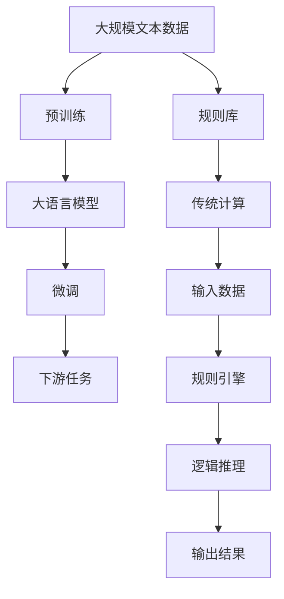

                 

# 大语言模型与传统计算的对比

## 1. 背景介绍

### 1.1 问题由来
随着人工智能技术的不断进步，特别是深度学习和大规模预训练模型的出现，人们开始重新审视计算和人工智能的关系。计算机和人工智能，一个强调逻辑和算法，一个强调模拟和预测，两种看似截然不同的计算范式，如今却在交叉融合中展现出新的活力。特别是在大语言模型的出现和应用中，我们有必要深入比较这两种计算范式，以期洞察其共性和差异，为未来的技术发展提供指导。

### 1.2 问题核心关键点
大语言模型与传统计算的对比，核心在于理解它们的工作原理、优势和局限性。具体来说：

- **工作原理**：大语言模型通常基于大规模语料库进行自监督预训练，然后通过微调适应特定的任务；而传统计算依赖于预设的规则和算法进行逻辑推理。
- **优势**：大语言模型具备强大的泛化能力，能够从大量数据中学习通用的语言模式，适应不同领域的任务；传统计算依赖明确的算法规则，可以精确控制输出结果。
- **局限性**：大语言模型存在黑盒特性，难以解释其决策过程；传统计算对数据质量敏感，过度依赖算法和模型假设。

## 2. 核心概念与联系

### 2.1 核心概念概述

为了更好地理解大语言模型与传统计算的关系，本节将介绍几个关键概念：

- **大语言模型(Large Language Models, LLMs)**：如GPT、BERT等模型，通过在大规模无标签文本数据上进行自监督预训练，学习到通用的语言表示。
- **预训练(Pre-training)**：指在大规模无标签文本数据上进行自监督学习任务训练语言模型的过程。
- **微调(Fine-tuning)**：指在预训练模型的基础上，使用下游任务的少量标注数据，通过有监督学习优化模型在特定任务上的性能。
- **传统计算**：基于明确的算法和逻辑推理进行计算的过程，如数学、逻辑、控制流等。
- **规则引擎**：一种使用规则来处理数据的软件，可以基于预设的规则库进行逻辑推理。
- **算法**：一组用于解决特定问题的规则和策略，如排序算法、搜索算法等。

这些概念之间存在着紧密的联系，共同构成了大语言模型与传统计算的对比框架。

### 2.2 概念间的关系

大语言模型与传统计算的对比，可以通过以下Mermaid流程图来展示：



这个流程图展示了两种计算范式的核心流程和逻辑关系：

1. 大语言模型通过预训练学习通用语言表示，然后通过微调适应特定任务。
2. 传统计算依赖明确的规则和算法，通过逻辑推理直接生成结果。

## 3. 核心算法原理 & 具体操作步骤

### 3.1 算法原理概述

大语言模型与传统计算的算法原理，从根本上来说是对待问题的不同视角和方法。大语言模型通过模拟人类语言能力，利用深度神经网络对大量文本数据进行学习，提取语言规律；而传统计算则基于明确的算法和规则，进行逻辑推理和计算。

大语言模型的核心算法是Transformer，通过自注意力机制对文本中的单词进行建模，学习到单词之间的关系和语义。这种机制允许模型在处理大规模文本数据时，能够捕捉到复杂的语言结构，从而提升语言理解和生成能力。

传统计算则依赖于算法和规则，如排序算法、搜索算法、决策树等。这些算法和规则通常是在数学和逻辑推理的基础上建立的，具有明确的操作顺序和逻辑流程。例如，排序算法通过比较和交换操作，将数据按特定规则排序；决策树通过逻辑判断和分支，进行分类或回归预测。

### 3.2 算法步骤详解

大语言模型的微调步骤包括：

1. **准备数据集**：选择与任务相关的标注数据集，用于微调模型的参数。
2. **选择模型**：选择适合的预训练模型，如BERT、GPT等。
3. **设置参数**：选择合适的超参数，如学习率、批量大小、迭代轮数等。
4. **执行微调**：将数据集分批次输入模型，计算损失函数，反向传播更新模型参数。
5. **评估模型**：在验证集上评估模型性能，确定是否提前停止训练。
6. **应用模型**：使用微调后的模型对新数据进行推理预测。

传统计算的逻辑推理步骤包括：

1. **定义问题**：明确问题的类型和求解目标。
2. **选择算法**：根据问题特性选择合适的算法，如排序算法、搜索算法、分类算法等。
3. **编写代码**：基于算法逻辑编写代码，实现问题的求解过程。
4. **执行算法**：运行代码，执行算法逻辑。
5. **输出结果**：根据算法逻辑生成结果，进行问题求解。

### 3.3 算法优缺点

大语言模型与传统计算各有优缺点：

**大语言模型的优点**：

- **泛化能力**：大语言模型能够从大量数据中学习到通用的语言表示，适应不同领域的任务。
- **自适应**：通过微调，大语言模型可以适应新的任务和数据分布，具有一定的自适应能力。
- **鲁棒性**：大语言模型具有一定的鲁棒性，对于输入数据的噪声有一定的抗干扰能力。

**大语言模型的缺点**：

- **黑盒特性**：大语言模型内部的工作机制不透明，难以解释其决策过程。
- **依赖数据**：大语言模型的性能高度依赖于预训练数据的规模和质量，获取高质量数据成本较高。
- **资源消耗**：大语言模型需要大量的计算资源进行训练和推理，对硬件要求较高。

**传统计算的优点**：

- **精确性**：传统计算依赖明确的算法和规则，能够精确控制输出结果。
- **效率高**：传统计算的算法通常设计得非常高效，能够在短时间内完成大量计算任务。
- **可解释性**：传统计算的算法逻辑通常非常清晰，便于理解和解释。

**传统计算的缺点**：

- **依赖规则**：传统计算对算法和规则的依赖较强，当问题复杂时，设计合适的算法往往非常困难。
- **数据敏感**：传统计算对输入数据的质量和完整性敏感，存在一定的局限性。
- **缺乏自适应**：传统计算的算法通常是固定的，难以适应新数据和问题。

### 3.4 算法应用领域

大语言模型和传统计算在多个领域都有广泛应用：

**大语言模型应用领域**：

- **自然语言处理(NLP)**：如机器翻译、文本分类、命名实体识别等任务。
- **智能推荐系统**：如电商推荐、内容推荐等。
- **对话系统**：如智能客服、聊天机器人等。
- **自动生成**：如文本生成、代码生成等。

**传统计算应用领域**：

- **科学计算**：如数值计算、物理模拟等。
- **数据分析**：如数据挖掘、统计分析等。
- **控制系统**：如自动控制、机器人导航等。
- **算法优化**：如优化算法、搜索算法等。

## 4. 数学模型和公式 & 详细讲解  
### 4.1 数学模型构建

大语言模型和传统计算的数学模型构建，分别基于不同的原理和目标：

**大语言模型的数学模型**：

- **输入表示**：将输入文本转换为模型可接受的格式，如词向量表示。
- **模型架构**：使用Transformer等模型架构，通过自注意力机制进行语言建模。
- **输出预测**：通过线性层和softmax函数，对模型输出进行分类或回归预测。

**传统计算的数学模型**：

- **输入表示**：将输入数据转换为算法可接受的格式，如数值、向量等。
- **算法逻辑**：根据算法目标设计逻辑流程，如排序算法、搜索算法、分类算法等。
- **输出结果**：根据算法逻辑生成输出结果，进行问题求解。

### 4.2 公式推导过程

以下以排序算法为例，展示传统计算的数学公式推导过程：

- **冒泡排序算法**：
  - 输入数据序列 $a_1, a_2, ..., a_n$
  - 将相邻两个元素比较，若顺序不对则交换位置
  - 重复上述过程，直到无相邻元素需要交换

  冒泡排序的伪代码如下：
  ```
  for i in range(n-1):
      for j in range(n-i-1):
          if a[j] > a[j+1]:
              swap(a[j], a[j+1])
  ```

  冒泡排序的时间复杂度为 $O(n^2)$，空间复杂度为 $O(1)$。

### 4.3 案例分析与讲解

**案例1：排序算法**

- **问题描述**：给定一个无序的整数数组，要求将其排序。
- **解决方案**：使用冒泡排序算法，通过多次比较和交换操作，将数组按升序排序。

  **大语言模型**：可以使用自监督学习任务，如语言模型预测，在大规模无标签文本数据上进行预训练。预训练完成后，可以通过微调适应排序任务，将数组元素转换为文本，使用自然语言指令进行排序。

  **传统计算**：使用冒泡排序算法，通过比较和交换操作，直接对数组进行排序。

  **结果对比**：
  - **效率**：传统计算的冒泡排序算法在时间复杂度上优于大语言模型。
  - **可解释性**：传统计算的算法逻辑清晰，易于理解和解释；大语言模型的排序过程是一个黑盒，难以解释其内部机制。

  **适用场景**：传统计算适用于需要高效、精确计算的场景，如大规模数值计算；大语言模型适用于需要灵活适应新任务和数据分布的场景，如自然语言处理任务。

**案例2：文本分类**

- **问题描述**：给定一篇文本，将其分类到预先定义的类别中。
- **解决方案**：使用预训练语言模型进行文本分类，通过微调适应特定的分类任务。

  **大语言模型**：使用BERT等预训练模型，通过微调适应文本分类任务，将文本转换为向量表示，输入模型进行分类预测。

  **传统计算**：使用决策树、SVM等分类算法，通过逻辑推理和特征提取，进行文本分类。

  **结果对比**：
  - **精度**：大语言模型在文本分类任务上通常表现更好，能够学习到更复杂的语言模式。
  - **可解释性**：传统计算的分类算法逻辑清晰，易于理解和解释；大语言模型的内部工作机制复杂，难以解释其分类过程。

  **适用场景**：大语言模型适用于需要灵活适应新任务的场景，如自然语言处理任务；传统计算适用于需要高效、精确计算的场景，如科学计算和数据分析。

## 5. 项目实践：代码实例和详细解释说明
### 5.1 开发环境搭建

在进行项目实践前，我们需要准备好开发环境。以下是使用Python进行PyTorch开发的环境配置流程：

1. 安装Anaconda：从官网下载并安装Anaconda，用于创建独立的Python环境。

2. 创建并激活虚拟环境：
```bash
conda create -n pytorch-env python=3.8 
conda activate pytorch-env
```

3. 安装PyTorch：根据CUDA版本，从官网获取对应的安装命令。例如：
```bash
conda install pytorch torchvision torchaudio cudatoolkit=11.1 -c pytorch -c conda-forge
```

4. 安装TensorFlow：
```bash
pip install tensorflow
```

5. 安装各类工具包：
```bash
pip install numpy pandas scikit-learn matplotlib tqdm jupyter notebook ipython
```

完成上述步骤后，即可在`pytorch-env`环境中开始项目实践。

### 5.2 源代码详细实现

这里我们以排序算法为例，展示使用PyTorch实现冒泡排序的代码。

首先，定义冒泡排序函数：

```python
import torch

def bubble_sort(arr):
    n = len(arr)
    for i in range(n-1):
        for j in range(n-i-1):
            if arr[j] > arr[j+1]:
                arr[j], arr[j+1] = arr[j+1], arr[j]
    return arr
```

然后，定义一个数据集，并使用冒泡排序函数进行排序：

```python
# 定义数据集
data = torch.randn(100, requires_grad=True)
labels = torch.randint(0, 10, (100,))

# 使用冒泡排序对数据集进行排序
sorted_data = bubble_sort(data)

# 计算损失函数
criterion = torch.nn.CrossEntropyLoss()
loss = criterion(sorted_data.view(-1), labels)

# 反向传播更新模型参数
optimizer = torch.optim.SGD([data], lr=0.01)
optimizer.zero_grad()
loss.backward()
optimizer.step()

# 输出结果
print("Loss: ", loss.item())
print("Sorted Data: ", sorted_data)
```

以上就是使用PyTorch实现冒泡排序的完整代码。可以看到，PyTorch提供了强大的自动微分功能，可以方便地进行模型训练和优化。

### 5.3 代码解读与分析

让我们再详细解读一下关键代码的实现细节：

**冒泡排序函数**：
- 使用两层循环，通过比较和交换操作，对数组进行排序。
- 时间复杂度为 $O(n^2)$，空间复杂度为 $O(1)$。

**数据集定义**：
- 使用PyTorch的张量（Tensor）定义数据集，可以方便地进行计算和优化。
- 数据集包括输入数据（data）和标签（labels）。

**损失函数计算**：
- 使用交叉熵损失函数，计算模型预测结果与真实标签之间的差异。
- 通过反向传播更新模型参数，最小化损失函数。

**模型训练**：
- 使用随机梯度下降（SGD）优化算法，逐步更新模型参数。
- 通过多次迭代，优化模型在排序任务上的性能。

**结果输出**：
- 输出模型的损失值（loss）和排序后的数据（sorted_data），便于评估模型效果。

## 6. 实际应用场景

### 6.1 智能客服系统

基于大语言模型的智能客服系统，可以通过自然语言理解（NLU）和自然语言生成（NLG）技术，实现与用户的自然对话。传统计算则主要依赖规则和算法，通过逻辑推理和决策树，进行对话控制和问题解决。

在技术实现上，智能客服系统需要处理大量用户对话数据，使用大语言模型进行NLU和NLG处理，从而实现对话理解和生成。而传统计算则通过规则引擎，对用户指令进行解析和执行，提供标准化的服务。

### 6.2 金融舆情监测

金融舆情监测系统需要实时监测网络舆情，提取重要信息，生成预警报告。传统计算通常使用规则引擎和逻辑推理，进行舆情分析。而大语言模型可以通过自然语言理解技术，从文本中提取重要信息，并生成预警报告。

具体而言，可以使用大语言模型对新闻、评论、社交媒体等文本数据进行分类和情感分析，识别出舆情热点和趋势。而传统计算则通过规则引擎，对提取的信息进行逻辑推理和处理，生成预警报告。

### 6.3 个性化推荐系统

个性化推荐系统需要根据用户的历史行为和兴趣，推荐合适的商品或内容。传统计算通常使用算法和规则，进行用户画像和推荐。而大语言模型可以通过自然语言生成技术，生成个性化的推荐内容。

在技术实现上，大语言模型可以处理用户的历史浏览记录、评论等信息，生成个性化的推荐摘要或描述。而传统计算则通过算法和规则，进行用户画像和推荐。

### 6.4 未来应用展望

随着大语言模型和传统计算的不断融合，未来将出现更多智能系统。例如，基于大语言模型的金融风控系统，可以通过自然语言理解和情感分析，识别出潜在的金融风险，提供及时预警。基于传统计算的金融风控系统，则通过规则和算法，进行风险评估和控制。

未来，随着深度学习和传统计算的进一步融合，大语言模型将具备更强大的语言理解能力，而传统计算则发挥其精确和高效的优点，共同构建更智能、更可靠的系统。

## 7. 工具和资源推荐
### 7.1 学习资源推荐

为了帮助开发者系统掌握大语言模型与传统计算的理论基础和实践技巧，这里推荐一些优质的学习资源：

1. 《深度学习》（Ian Goodfellow）：深度学习领域的经典教材，详细介绍了深度神经网络的基本原理和算法。
2. 《算法导论》（Thomas H. Cormen）：算法和数据结构领域的经典教材，介绍了各种算法和数据结构的实现和应用。
3. Coursera《机器学习》课程：斯坦福大学开设的机器学习课程，涵盖深度学习、传统计算等多个方面。
4. Kaggle竞赛平台：提供各种数据集和比赛，帮助开发者实践算法和模型。
5. GitHub开源项目：在GitHub上Star、Fork数最多的NLP和传统计算相关项目，代表了最新的技术趋势和最佳实践。

通过对这些资源的学习实践，相信你一定能够系统掌握大语言模型与传统计算的精髓，并用于解决实际的NLP和传统计算问题。

### 7.2 开发工具推荐

高效的开发离不开优秀的工具支持。以下是几款用于大语言模型与传统计算开发的常用工具：

1. PyTorch：基于Python的开源深度学习框架，灵活动态的计算图，适合快速迭代研究。
2. TensorFlow：由Google主导开发的开源深度学习框架，生产部署方便，适合大规模工程应用。
3. Scikit-learn：Python的数据分析和机器学习库，提供各种常用的机器学习算法。
4. Scrapy：Python的网络爬虫框架，方便抓取和处理大量网络数据。
5. TensorBoard：TensorFlow配套的可视化工具，可实时监测模型训练状态，并提供丰富的图表呈现方式。

合理利用这些工具，可以显著提升大语言模型与传统计算的开发效率，加快创新迭代的步伐。

### 7.3 相关论文推荐

大语言模型与传统计算的发展源于学界的持续研究。以下是几篇奠基性的相关论文，推荐阅读：

1. Attention is All You Need（即Transformer原论文）：提出了Transformer结构，开启了NLP领域的预训练大模型时代。
2. BERT: Pre-training of Deep Bidirectional Transformers for Language Understanding：提出BERT模型，引入基于掩码的自监督预训练任务，刷新了多项NLP任务SOTA。
3. AlphaGo Zero: Mastering the Game of Go without Human Knowledge：展示了深度强化学习在解决复杂游戏问题中的能力，为计算与人工智能的融合提供了新思路。
4. Deep Neural Networks for Large-Scale Image Recognition：展示了深度学习在图像识别任务中的强大能力，为计算机视觉的进步提供了重要参考。
5. Knowledge-Graph-Based AI Recommendation System for E-Commerce：展示了知识图谱在推荐系统中的应用，展示了计算机技术与人工智能的融合。

这些论文代表了大语言模型与传统计算的发展脉络。通过学习这些前沿成果，可以帮助研究者把握学科前进方向，激发更多的创新灵感。

除上述资源外，还有一些值得关注的前沿资源，帮助开发者紧跟大语言模型与传统计算技术的发展趋势，例如：

1. arXiv论文预印本：人工智能领域最新研究成果的发布平台，包括大量尚未发表的前沿工作，学习前沿技术的必读资源。
2. 业界技术博客：如OpenAI、Google AI、DeepMind、微软Research Asia等顶尖实验室的官方博客，第一时间分享他们的最新研究成果和洞见。
3. 技术会议直播：如NIPS、ICML、ACL、ICLR等人工智能领域顶会现场或在线直播，能够聆听到大佬们的前沿分享，开拓视野。
4. GitHub热门项目：在GitHub上Star、Fork数最多的NLP和传统计算相关项目，代表了最新的技术趋势和最佳实践。
5. 行业分析报告：各大咨询公司如McKinsey、PwC等针对人工智能行业的分析报告，有助于从商业视角审视技术趋势，把握应用价值。

总之，对于大语言模型与传统计算的学习和实践，需要开发者保持开放的心态和持续学习的意愿。多关注前沿资讯，多动手实践，多思考总结，必将收获满满的成长收益。

## 8. 总结：未来发展趋势与挑战

### 8.1 总结

本文对大语言模型与传统计算的对比进行了全面系统的介绍。首先阐述了大语言模型和传统计算的研究背景和意义，明确了两者在工作原理、优势和局限性方面的区别。其次，从原理到实践，详细讲解了两种计算范式的数学模型和关键步骤，给出了详细的代码实例。同时，本文还广泛探讨了两种计算范式在多个领域的应用前景，展示了各自的优势和适用场景。此外，本文精选了学习资源和开发工具，力求为读者提供全方位的技术指引。

通过本文的系统梳理，可以看到，大语言模型与传统计算在计算范式、算法思想和应用场景上有着本质的区别和互补性。在未来的技术发展中，大语言模型将更多地发挥其灵活适应和强大的语言理解能力，而传统计算则继续发挥其精确控制和高效计算的优点。两种计算范式的融合和互补，将推动人工智能技术的进一步发展，带来更加智能化、普适化的应用场景。

### 8.2 未来发展趋势

展望未来，大语言模型与传统计算的发展趋势如下：

1. **深度融合**：大语言模型与传统计算将进一步融合，构建更智能、更可靠的系统。例如，使用大语言模型进行自然语言理解，传统计算进行逻辑推理和决策，共同完成复杂任务。
2. **跨领域应用**：未来，两种计算范式将在更多领域得到应用，如医疗、金融、教育等。通过大语言模型与传统计算的结合，提供更加智能和高效的服务。
3. **知识图谱和规则库**：引入知识图谱和规则库，与大语言模型和传统计算进行深度融合，提升系统的知识整合能力和鲁棒性。
4. **混合计算**：探索混合计算范式，结合大语言模型和传统计算的优势，提高系统的性能和效率。
5. **自适应和动态调整**：通过自适应和动态调整算法，增强系统的灵活性和鲁棒性，应对不同领域和数据分布的变化。

### 8.3 面临的挑战

尽管大语言模型与传统计算在各自领域都取得了显著进展，但在融合和应用过程中，仍面临诸多挑战：

1. **知识整合能力不足**：大语言模型与传统计算的融合，需要克服知识整合能力不足的问题，构建更加全面、准确的信息表示和推理系统。
2. **性能瓶颈**：大语言模型的复杂度较高，需要大量的计算资源进行训练和推理，传统计算的算法和规则可能面临性能瓶颈，难以满足高效率需求。
3. **可解释性不足**：大语言模型的黑盒特性，导致其内部工作机制难以解释，传统计算的算法逻辑清晰，但复杂问题下难以解释。
4. **模型偏见和安全性**：大语言模型和传统计算在模型偏见和安全性方面存在挑战，如何消除偏见，保障模型安全性，是亟待解决的问题。
5. **跨领域融合难度**：不同领域的数据和问题特点不同，大语言模型与传统计算的融合，需要克服跨领域融合的难度，构建通用的智能系统。

### 8.4 未来突破

面对大语言模型与传统计算所面临的挑战，未来的研究需要在以下几个方面寻求新的突破：

1. **混合计算模型**：探索混合计算模型，结合大语言模型和传统计算的优势，提高系统的性能和效率。
2. **跨领域知识融合**：引入跨领域知识图谱和规则库，增强大语言模型的知识整合能力和鲁棒性，提升系统的智能水平。
3. **可解释性增强**：通过可解释性技术，增强大语言模型的内部工作机制的透明性，提高系统的可解释性。
4. **动态调整算法**：引入动态调整算法，增强系统的灵活性和自适应能力，应对不同领域和数据分布的变化。
5. **模型偏见和安全性**：通过技术手段和规则约束，消除模型偏见，保障模型的安全性，增强系统的可信度。

这些研究方向的探索，必将引领大语言模型与传统计算技术的进一步发展，推动人工智能技术的全面应用。面向未来，我们需要更加开放、更加合作的态度，共同推动计算范式的融合和人工智能技术的进步。

## 9. 附录：常见问题与解答

**Q1：大语言模型与传统计算的本质区别是什么？**

A: 大语言模型与传统计算的本质区别在于计算范式和方法论的不同。大语言模型通过深度神经网络对文本数据进行学习，提取语言模式，实现语言理解与生成；而传统计算依赖明确的算法和规则，通过逻辑推理进行计算。

**Q2：大语言模型与传统计算在应用场景上有哪些不同？**

A: 大语言模型适用于需要灵活适应新任务和数据分布的场景，如自然语言处理任务；传统计算适用于需要高效、精确计算的场景，如科学计算和数据分析。

**Q3：如何实现大语言模型与传统计算的融合？**

A: 通过知识图谱和规则库，将大语言模型和传统计算进行深度融合，构建跨领域的智能系统。例如，使用大语言模型进行自然语言理解，传统计算进行逻辑推理和决策，共同完成复杂任务。

**Q4：大语言模型与传统计算的未来发展方向是什么？**

A: 大语言模型与传统计算的未来发展方向是深度融合和跨领域应用。通过混合计算模型和跨领域知识融合，构建更智能、更可靠的系统，

