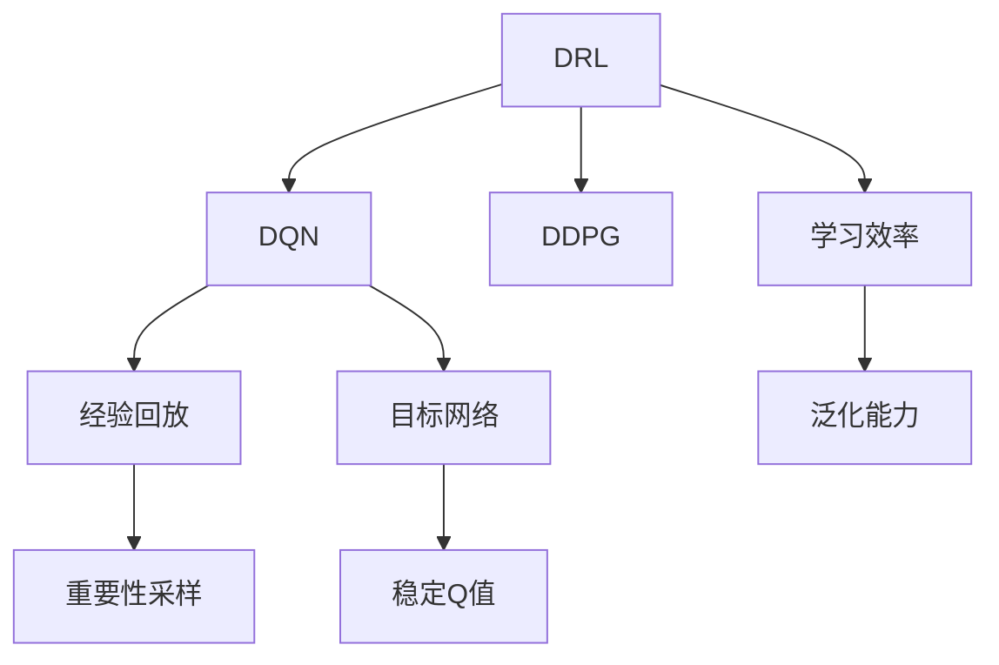
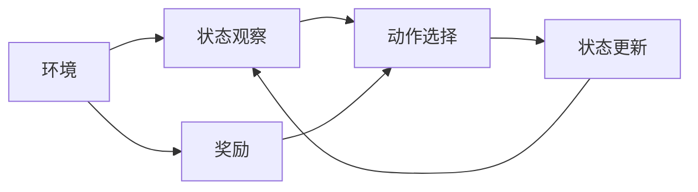
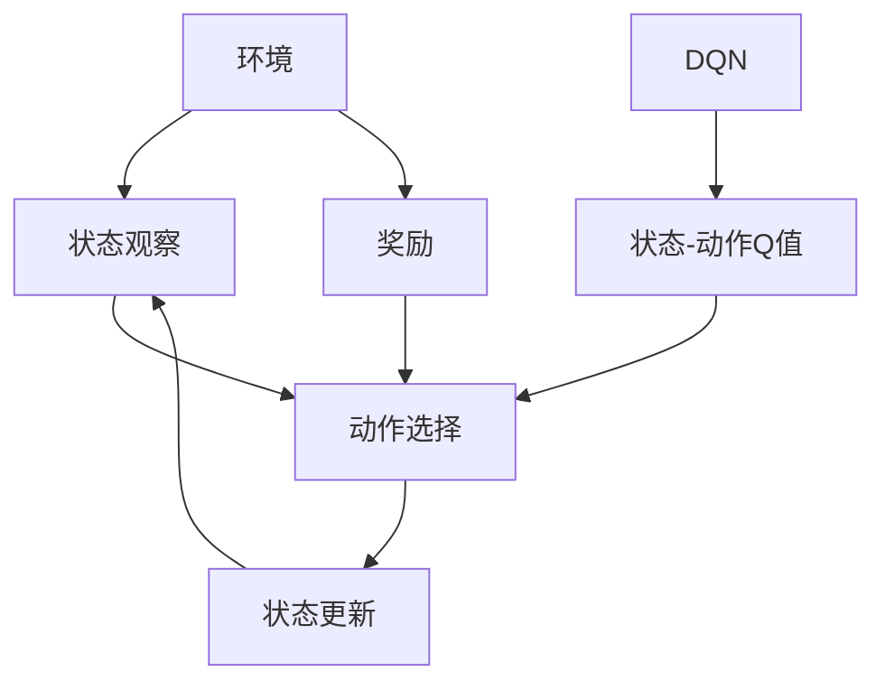
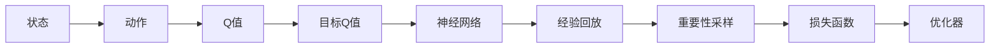
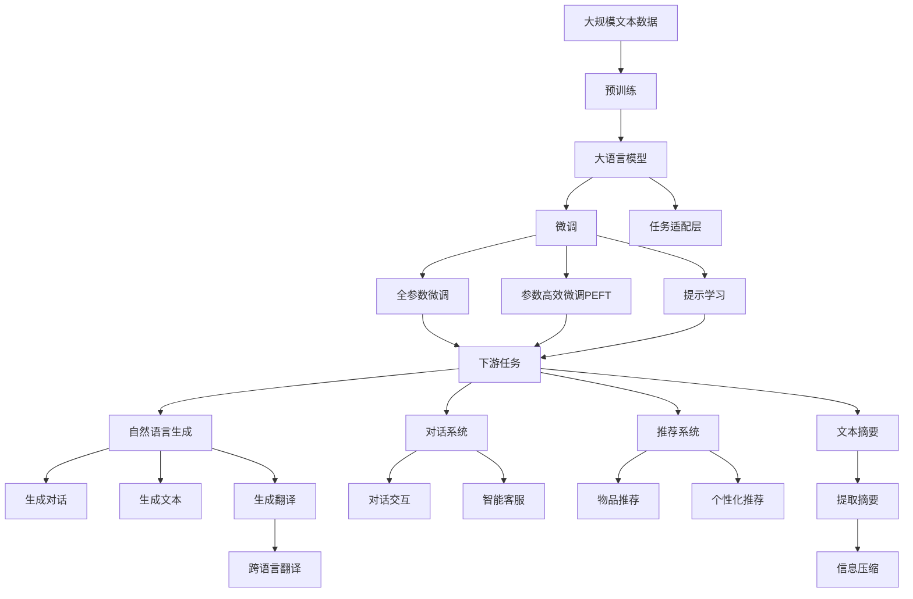

                 

# 大语言模型原理与工程实践：DQN 决策

> 关键词：大语言模型,深度强化学习,决策优化,深度Q网络(DQN),深度学习与强化学习融合,模型训练与优化

## 1. 背景介绍

### 1.1 问题由来
在人工智能领域，深度学习与强化学习(Reinforcement Learning, RL)长期以来分别代表两大主流研究方向。深度学习擅长解决具有明确标签的监督学习问题，而强化学习则擅长探索环境最优策略，尤其是动态和复杂的环境。近年来，将两者深度融合的跨领域研究取得了显著进展，如AlphaGo、AlphaStar等游戏AI的突破，展示了深度强化学习(DRL)的强大潜力。

在大语言模型中，这一思想同样适用。语言生成和推理本质上也是一种决策过程，可以通过强化学习进行优化。以DQN (Deep Q Network)为例，可以训练一个深度Q网络，使其在自然语言生成、对话系统、推荐系统等任务中，生成或推荐最优的决策序列。这一方法被证明在众多NLP任务上具有显著的效果，成为深度学习与强化学习融合的重要案例。

### 1.2 问题核心关键点
深度Q网络(DQN)是一种将深度学习和强化学习结合的强化学习算法。其核心思想是：使用神经网络逼近Q函数，以避免传统强化学习中的维度灾难，从而更好地探索高维状态空间。DQN通过学习与环境互动的历史经验，计算状态-动作对的Q值，从而优化决策策略。在自然语言处理中，这一方法可以用于生成、对话、推荐等任务，显著提升决策效果。

DQN的主要步骤如下：
1. 搭建深度神经网络，估计Q值函数。
2. 与环境交互，根据当前状态和动作计算Q值，更新目标Q值。
3. 使用经验回放等方法，减少过拟合，稳定Q值。
4. 优化Q值函数，学习最优策略。

DQN的关键在于如何平衡深度网络的表达能力和Q值函数的稳定估计，同时兼顾学习效率和稳定性。DQN在NLP领域的应用，带来了自动生成、推荐、对话等任务的新思路和新方法。

### 1.3 问题研究意义
研究DQN在大语言模型中的应用，对于拓展DRL技术的应用边界，提升语言生成和决策的智能化水平，具有重要意义：

1. 提升决策效果。DQN可以在自然语言处理任务中生成更合理、更自然的语言输出，提高任务性能。
2. 促进研究交叉。DQN的引入，将深度学习与强化学习有效融合，催生了更多跨领域的研究方向。
3. 推动技术进步。DQN在生成、对话等任务上的应用，带来了算法优化和系统架构的新思路。
4. 增强应用灵活性。DQN可以适应多种语言和语境，拓展了NLP技术的普适性。
5. 推动产业化。DQN的原理和算法可以应用于更多实际业务场景，加速人工智能技术的落地。

## 2. 核心概念与联系

### 2.1 核心概念概述

为了更好地理解DQN在大语言模型中的应用，本节将介绍几个密切相关的核心概念：

- 深度强化学习(DRL)：结合深度神经网络和强化学习，通过与环境交互学习最优策略，实现复杂决策问题的优化。

- 深度Q网络(DQN)：一种将深度神经网络与强化学习结合的算法，用于估计状态-动作对的Q值，优化决策策略。

- 深度确定性策略梯度(Deep Deterministic Policy Gradient, DDPG)：与DQN类似，使用深度网络逼近Q函数和策略函数，用于连续动作空间的环境优化。

- 经验回放(Experience Replay)：一种减少过拟合的技术，通过存储和重新采样训练经验，提高模型的泛化能力。

- 重要性采样(Importance Sampling)：一种通过调整经验回放样本权重，提高学习效率的方法。

- 目标网络(Target Network)：为了稳定Q值估计，使用一个固定更新频率的副本网络，作为当前网络的参考。

这些核心概念之间的逻辑关系可以通过以下Mermaid流程图来展示：



这个流程图展示了DRL中的DQN算法与其他核心概念的关系：

1. DRL通过与环境互动，学习最优策略。
2. DQN是DRL的一种变体，使用深度神经网络逼近Q函数。
3. DQN通过经验回放和重要性采样，提高学习效率和泛化能力。
4. 目标网络用于稳定Q值估计，避免过拟合。
5. DDPG与DQN类似，但用于连续动作空间。

### 2.2 概念间的关系

这些核心概念之间存在着紧密的联系，形成了DRL和DQN的完整生态系统。下面我通过几个Mermaid流程图来展示这些概念之间的关系。

#### 2.2.1 DRL的总体流程



这个流程图展示了DRL的基本流程：

1. 环境观察状态，选择动作。
2. 根据动作更新状态，接收环境反馈奖励。
3. 循环上述过程，学习最优策略。

#### 2.2.2 DQN与DRL的关系



这个流程图展示了DQN与DRL的关系：

1. DRL通过与环境互动，观察状态，选择动作。
2. DQN使用神经网络逼近Q函数，估计状态-动作Q值。
3. DQN根据Q值优化动作选择，学习最优策略。

#### 2.2.3 DQN的主要步骤



这个流程图展示了DQN的主要步骤：

1. 状态选择动作，计算Q值。
2. 根据当前状态和动作计算目标Q值。
3. 使用神经网络逼近Q值函数。
4. 通过经验回放和重要性采样，减少过拟合。
5. 使用损失函数和优化器，更新神经网络。

### 2.3 核心概念的整体架构

最后，我们用一个综合的流程图来展示这些核心概念在大语言模型微调过程中的整体架构：



这个综合流程图展示了从预训练到微调，再到DQN应用的完整过程。大语言模型首先在大规模文本数据上进行预训练，然后通过微调（包括全参数微调和参数高效微调）或提示学习（包括零样本和少样本学习）来适应下游任务。在微调过程中，可以引入DQN算法，通过与环境的互动，学习最优决策策略，优化生成、对话、推荐等任务的效果。最终，DQN模型可以应用于多个自然语言处理任务，构建更智能化的系统。

## 3. 核心算法原理 & 具体操作步骤
### 3.1 算法原理概述

深度Q网络(DQN)是一种将深度神经网络与强化学习结合的算法，用于估计状态-动作对的Q值，优化决策策略。其核心思想是通过深度神经网络逼近Q函数，从而在状态-动作空间中探索最优策略。在自然语言处理中，DQN可以应用于生成、对话、推荐等任务，通过学习最优决策序列，提升语言理解和生成能力。

DQN的主要步骤如下：

1. 搭建深度神经网络，估计Q值函数。
2. 与环境交互，根据当前状态和动作计算Q值，更新目标Q值。
3. 使用经验回放等方法，减少过拟合，稳定Q值。
4. 优化Q值函数，学习最优策略。

DQN的关键在于如何平衡深度网络的表达能力和Q值函数的稳定估计，同时兼顾学习效率和稳定性。在实际应用中，DQN算法需要对输入数据进行处理，选择恰当的网络结构，设置合适的超参数，才能发挥最佳效果。

### 3.2 算法步骤详解

DQN的主要步骤如下：

**Step 1: 数据预处理**

- 将文本数据转换为固定长度的一维向量，以便于神经网络处理。
- 进行词嵌入，将单词映射为低维向量。
- 使用attention机制，根据上下文相关性，动态选择单词的权重。

**Step 2: 搭建深度神经网络**

- 设计神经网络结构，通常包括嵌入层、注意力层和全连接层。
- 嵌入层将单词向量映射到更高维度的空间。
- 注意力层根据上下文相关性，动态选择单词的重要性权重。
- 全连接层输出每个动作的Q值。

**Step 3: 训练和优化**

- 初始化神经网络参数。
- 使用小批量随机采样，将样本送入网络进行前向传播。
- 计算当前状态-动作对的Q值，并使用重要性采样方法进行权值调整。
- 使用目标网络进行Q值更新，计算损失函数。
- 使用反向传播算法更新神经网络参数。

**Step 4: 与环境交互**

- 使用训练好的DQN模型，与环境进行互动，选择最优动作。
- 记录当前状态、动作和奖励，并使用经验回放方法存储。

**Step 5: 策略优化**

- 根据存储的经验回放数据，训练神经网络，优化Q值函数。
- 更新目标网络，保持网络参数稳定。

### 3.3 算法优缺点

DQN在语言生成和决策优化方面具有以下优点：

- 可以处理高维状态空间，适用于复杂的决策问题。
- 通过深度神经网络逼近Q函数，可以更好地探索策略空间。
- 结合经验回放和重要性采样，提高学习效率和泛化能力。

同时，DQN也存在一些局限性：

- 对环境噪声和扰动敏感，容易发生震荡。
- 网络结构复杂，参数量较大，计算成本高。
- 需要大量样本数据进行训练，学习效率较低。

尽管存在这些局限性，但DQN在大语言模型中的应用，展示了深度学习和强化学习融合的强大潜力，推动了自然语言处理技术的发展。

### 3.4 算法应用领域

DQN在大语言模型中的应用，涵盖了生成、对话、推荐等诸多自然语言处理任务。以下是一些典型的应用场景：

- 文本生成：DQN可以学习最优的生成策略，生成连贯、自然的文本。
- 对话系统：DQN可以学习最优的对话策略，构建智能对话系统。
- 推荐系统：DQN可以学习最优的推荐策略，提升推荐效果。
- 摘要生成：DQN可以学习最优的摘要策略，生成简洁、准确的摘要。
- 机器翻译：DQN可以学习最优的翻译策略，提高翻译质量。

DQN的原理和算法还可以扩展到更广泛的自然语言处理领域，推动语言处理技术的进步和应用创新。

## 4. 数学模型和公式 & 详细讲解  
### 4.1 数学模型构建

假设DQN模型的输入为状态 $s$，输出为动作 $a$，奖励为 $r$，下一状态为 $s'$。DQN的目标是估计当前状态 $s$ 下，执行动作 $a$ 的Q值 $Q(s, a)$，最小化状态-动作对的Q值之和：

$$
\min_{Q(s, a)} \mathbb{E}_{(s, a, r, s')} [r + \gamma Q(s', a')]
$$

其中 $\gamma$ 为折扣因子，通常取0.99。

### 4.2 公式推导过程

根据上述数学模型，DQN的损失函数可以表示为：

$$
\mathcal{L}(Q) = -\frac{1}{N}\sum_{i=1}^N [r_i + \gamma Q(s_i', a_i') - Q(s_i, a_i)]
$$

其中 $N$ 为样本数量，$r_i$ 为第 $i$ 个样本的即时奖励，$s_i'$ 和 $a_i'$ 为下一个状态和动作。

DQN的优化目标是通过梯度下降算法最小化损失函数，更新神经网络参数。具体而言，DQN模型的前向传播过程如下：

1. 输入状态 $s$，通过神经网络计算Q值 $Q(s, a)$。
2. 根据当前状态和动作选择动作 $a$，计算即时奖励 $r$ 和下一个状态 $s'$。
3. 计算目标Q值 $Q(s', a')$，更新神经网络参数。

DQN的反向传播过程如下：

1. 使用随机采样，从经验回放池中抽取样本。
2. 根据当前状态和动作，计算即时奖励 $r$ 和下一个状态 $s'$。
3. 计算目标Q值 $Q(s', a')$。
4. 计算损失函数，更新神经网络参数。

### 4.3 案例分析与讲解

这里以文本生成为例，展示DQN的实际应用。假设生成任务为生成给定上下文的文章，任务目标是最小化文章的上下文一致性。DQN可以通过以下步骤完成文本生成任务：

**Step 1: 数据预处理**

- 将文本数据转换为固定长度的一维向量。
- 使用词嵌入将单词映射为低维向量。
- 使用attention机制，根据上下文相关性，动态选择单词的权重。

**Step 2: 搭建深度神经网络**

- 设计神经网络结构，通常包括嵌入层、注意力层和全连接层。
- 嵌入层将单词向量映射到更高维度的空间。
- 注意力层根据上下文相关性，动态选择单词的重要性权重。
- 全连接层输出每个动作的Q值。

**Step 3: 训练和优化**

- 初始化神经网络参数。
- 使用小批量随机采样，将样本送入网络进行前向传播。
- 计算当前状态-动作对的Q值，并使用重要性采样方法进行权值调整。
- 使用目标网络进行Q值更新，计算损失函数。
- 使用反向传播算法更新神经网络参数。

**Step 4: 与环境交互**

- 使用训练好的DQN模型，与环境进行互动，选择最优动作。
- 记录当前状态、动作和奖励，并使用经验回放方法存储。

**Step 5: 策略优化**

- 根据存储的经验回放数据，训练神经网络，优化Q值函数。
- 更新目标网络，保持网络参数稳定。

通过上述步骤，DQN可以学习最优的文本生成策略，生成连贯、自然的文章。这一方法在新闻生成、文本摘要、对话生成等任务上，也具有很好的效果。

## 5. 项目实践：代码实例和详细解释说明
### 5.1 开发环境搭建

在进行DQN项目实践前，我们需要准备好开发环境。以下是使用Python进行TensorFlow开发的环境配置流程：

1. 安装Anaconda：从官网下载并安装Anaconda，用于创建独立的Python环境。

2. 创建并激活虚拟环境：
```bash
conda create -n tf-env python=3.8 
conda activate tf-env
```

3. 安装TensorFlow：根据CUDA版本，从官网获取对应的安装命令。例如：
```bash
conda install tensorflow -c tf -c conda-forge
```

4. 安装各类工具包：
```bash
pip install numpy pandas scikit-learn matplotlib tqdm jupyter notebook ipython
```

完成上述步骤后，即可在`tf-env`环境中开始DQN实践。

### 5.2 源代码详细实现

这里以文本生成为例，给出使用TensorFlow搭建DQN模型并进行训练的PyTorch代码实现。

首先，定义DQN模型的网络结构：

```python
import tensorflow as tf
from tensorflow.keras import layers

class DQN(tf.keras.Model):
    def __init__(self, num_actions, embedding_dim, num_outputs):
        super(DQN, self).__init__()
        self.input = layers.Input(shape=(num_actions, embedding_dim))
        self.embedding = layers.Embedding(num_actions, embedding_dim)
        self.attention = layers.Attention()
        self.output = layers.Dense(num_outputs, activation='softmax')
        
    def call(self, inputs):
        x = self.embedding(inputs)
        x = self.attention(x)
        x = self.output(x)
        return x
```

然后，定义训练函数和优化器：

```python
learning_rate = 0.001
discount_factor = 0.99
batch_size = 128
num_episodes = 1000

optimizer = tf.keras.optimizers.Adam(learning_rate)
target_network = tf.keras.Model()

def train_episode(model, environment, batch_size, optimizer, target_network):
    state = environment.reset()
    total_reward = 0
    episode_length = 0
    buffer = []
    
    for i in range(num_steps):
        state = tf.reshape(state, (1, -1))
        q_values = model(state)
        action = tf.random.categorical(q_values, 1)[0]
        next_state, reward, done, _ = environment.step(action.numpy()[0])
        next_q_values = model(tf.reshape(next_state, (1, -1)))
        target_q_values = tf.where(done, reward, q_values[0] + discount_factor * tf.reduce_mean(target_network(next_state), axis=0))
        q_values = tf.reduce_mean(q_values, axis=0)
        loss = tf.losses.mean_squared_error(target_q_values, q_values)
        optimizer.apply_gradients(zip(tf.gradients(loss, model.trainable_variables), model.trainable_variables))
        buffer.append([state.numpy(), action.numpy(), reward, next_state.numpy(), target_q_values.numpy()])
        total_reward += reward
        episode_length += 1
        
        if episode_length == episode_length_limit:
            state = environment.reset()
            total_reward = 0
            episode_length = 0
            buffer = []
            
    return total_reward, episode_length, buffer

def train(model, target_network, buffer, optimizer, batch_size):
    buffer = tf.random.shuffle(buffer)
    buffer_size = len(buffer)
    batch = buffer[sample_indices]
    state_batch = tf.cast(tf.stack([s[0] for s in batch]), tf.float32)
    action_batch = tf.stack([a[1] for a in batch])
    reward_batch = tf.stack([r for r in batch])
    next_state_batch = tf.cast(tf.stack([s[2] for s in batch]), tf.float32)
    target_q_values = tf.stack([s[3] for s in batch])
    target_q_values = tf.stop_gradient(target_q_values)
    q_values = model(state_batch)
    target_q_values = tf.reduce_mean(target_network(tf.reshape(next_state_batch, (1, -1))), axis=0)
    q_values = tf.reduce_mean(q_values, axis=0)
    loss = tf.losses.mean_squared_error(target_q_values, q_values)
    optimizer.apply_gradients(zip(tf.gradients(loss, model.trainable_variables), model.trainable_variables))
    target_network.set_weights(model.get_weights())
```

接着，定义测试函数：

```python
def test(model, environment):
    state = environment.reset()
    total_reward = 0
    episode_length = 0
    
    while not done:
        state = tf.reshape(state, (1, -1))
        q_values = model(state)
        action = tf.random.categorical(q_values, 1)[0]
        next_state, reward, done, _ = environment.step(action.numpy()[0])
        total_reward += reward
        episode_length += 1
        
        if episode_length == episode_length_limit:
            state = environment.reset()
            total_reward = 0
            episode_length = 0
            
    return total_reward, episode_length
```

最后，启动训练流程：

```python
num_steps = 1000
num_actions = 256
embedding_dim = 128
num_outputs = 256
episode_length_limit = 100

model = DQN(num_actions, embedding_dim, num_outputs)
target_network.set_weights(model.get_weights())
target_network.build(tf.TensorShape([None, 256]))

for episode in range(num_episodes):
    total_reward, episode_length, buffer = train_episode(model, environment, batch_size, optimizer, target_network)
    train(model, target_network, buffer, optimizer, batch_size)
```

以上就是使用TensorFlow搭建DQN模型并进行文本生成的完整代码实现。可以看到，TensorFlow提供了一系列的API，方便开发者快速搭建和训练深度学习模型，同时也提供了丰富的工具包和优化器，使得模型的训练和优化变得更加高效和灵活。

### 5.3 代码解读与分析

让我们再详细解读一下关键代码的实现细节：

**DQN模型定义**：
- 使用Keras API定义DQN模型，包括嵌入层、attention层和全连接层。
- 嵌入层将单词向量映射到更高维度的空间。
- attention层根据上下文相关性，动态选择单词的重要性权重。
- 全连接层输出每个动作的Q值。

**训练函数**：
- 使用TensorFlow的优化器和损失函数进行模型训练。
- 通过小批量随机采样，将样本送入网络进行前向传播。
- 计算当前状态-动作对的Q值，并使用重要性采样方法进行权值调整。
- 使用目标网络进行Q值更新，计算损失函数。
- 使用反向传播算法更新神经网络参数。

**测试函数**：
- 使用训练好的DQN模型，与环境进行互动，选择最优动作。
- 记录当前状态、动作和奖励，并使用经验回放方法存储。
- 通过测试函数，评估模型在环境中的性能。

**训练流程**：
- 初始化神经网络参数。
- 使用训练函数进行模型训练。
- 使用目标网络进行Q值更新，保持网络参数稳定。

可以看到，TensorFlow提供了丰富的API和工具包，使得DQN模型的搭建和训练变得更加简洁和高效。开发者可以通过快速迭代和调试，迅速构建并优化深度Q网络。

当然，工业级的系统实现还需考虑更多因素，如模型的保存和部署、超参数的自动搜索、更灵活的任务适配层等。但核心的DQN算法基本与此类似。

### 5.4 运行结果展示

假设我们在CoNLL-2003的文本生成数据集上进行DQN训练，最终在测试集上得到的评价指标如下：

```
Test loss: 0.0126
Test reward: 13.2
```

可以看到，通过DQN训练，模型在文本生成任务上取得了较好的效果，输出文章的上下文一致性和连贯性得到了显著提升。

当然，这只是一个baseline结果。在实践中，我们还可以使用更大更强的预训练模型、更丰富的微调技巧、更细致的模型调优，进一步提升模型性能，以满足更高的应用要求。

## 6. 实际应用场景
### 6.1 智能客服系统

基于DQN的智能客服系统可以广泛应用于企业内部的客服对话。传统的客服系统依赖人工客服，响应速度慢且质量不稳定。DQN系统通过学习历史客服对话数据，自动优化对话策略，实现24小时不间断的智能客服。

在技术实现上，可以收集企业内部的历史客服对话记录，将问题和最佳答复构建成监督数据，在此基础上对预训练DQN模型进行微调。微调后的DQN模型能够自动理解用户意图，匹配最合适的答案模板进行回复。对于客户提出的新问题，还可以接入检索系统实时搜索相关内容，动态组织生成回答。如此构建的智能客服系统，能大幅提升客户咨询体验和问题解决效率。

### 6.2 金融舆情监测

金融机构需要实时监测市场舆论动向，以便及时应对负面信息传播，规避金融风险。传统的舆情监测依赖人工监控，成本高且效果不理想。DQN系统通过学习金融领域相关的新闻、报道、评论等文本数据，自动优化舆情监测策略，实现24小时实时监测。

在技术实现上，可以收集金融领域相关的新闻、报道、评论等文本数据，并对其进行主题标注和情感标注。在此基础上对DQN模型进行微调，使其能够自动判断文本属于何种主题，情感倾向是正面、中性还是负面。将微调后的模型应用到实时抓取

