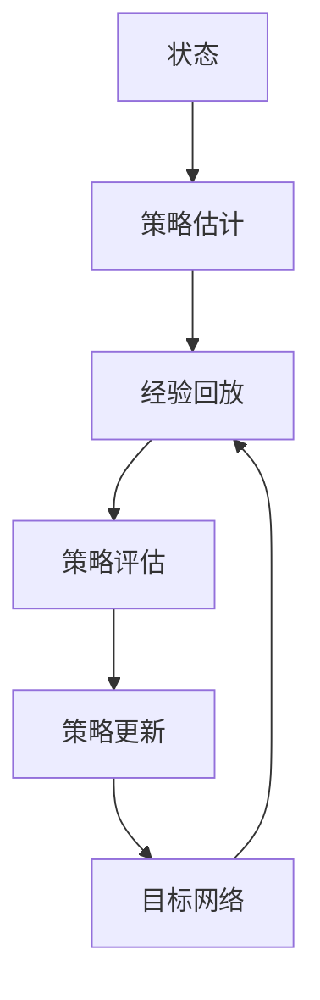
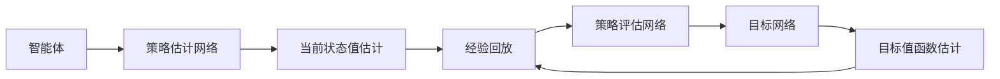
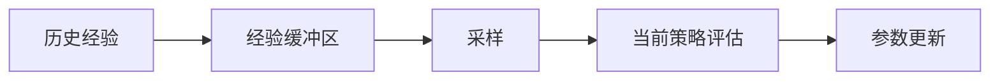
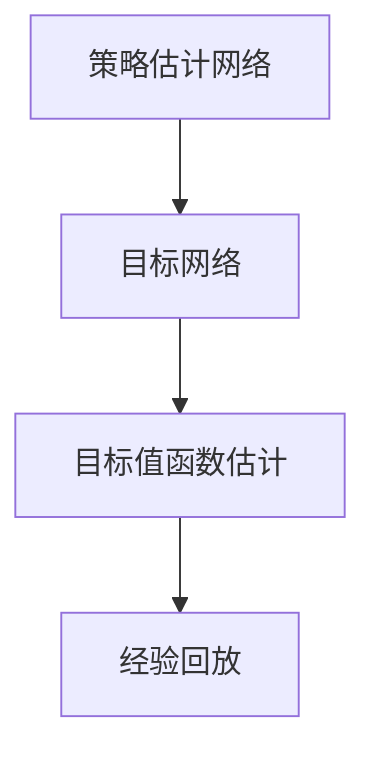
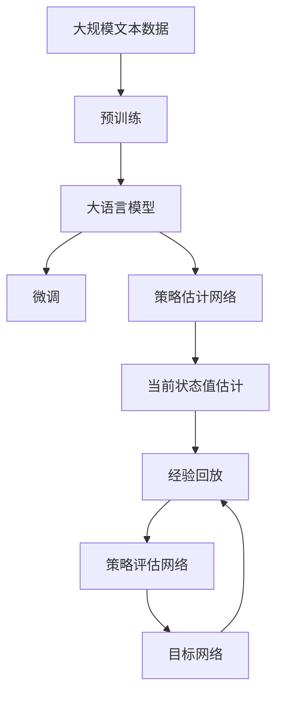

                 

# 大语言模型原理与工程实践：DQN 训练：基本思想

> 关键词：深度强化学习, 策略梯度方法, 深度 Q-网络(DQN), 经验回放, 目标网络, 双 Q-网络, 残差网络

## 1. 背景介绍

### 1.1 问题由来

在现代计算机视觉和自然语言处理领域，深度强化学习(DRL)已经成为解决许多复杂问题的重要工具。其核心思想是通过与环境的交互，不断优化策略以最大化累积奖励，从而达到控制环境的目的。在这一过程中，深度学习技术被用于估计价值函数和策略，极大提高了DRL的性能。

而在强化学习中，DQN算法（深度 Q-网络）因其结合了深度神经网络和经验回放机制而获得了广泛应用。DQN算法通过深度网络对Q值进行估计，并通过经验回放机制避免过拟合，从而有效解决了传统DQN算法中深层网络训练不稳定的难题。

### 1.2 问题核心关键点

DQN算法的核心在于如何将深度网络与强化学习相结合，通过深度网络对Q值进行估计，并通过经验回放机制学习最优策略。DQN算法主要包括三个核心步骤：策略估计、策略评估和策略更新。其中，策略估计和策略评估分别对应于神经网络的前向和后向传播过程，策略更新则涉及参数更新和Q值估计。

## 2. 核心概念与联系

### 2.1 核心概念概述

为更好地理解DQN算法，本节将介绍几个密切相关的核心概念：

- **深度 Q-网络（DQN）**：结合深度神经网络和经验回放机制，用于估计状态值函数，是DQN算法的基础。
- **策略梯度方法**：通过梯度下降方法优化策略，使得智能体能够最大化累积奖励。
- **经验回放**：将历史经验存储在经验缓冲区中，定期从中采样以更新模型参数。
- **目标网络**：用于减少目标值与当前值之间的误差，从而提升模型的稳定性和收敛速度。
- **双 Q-网络**：通过引入两个独立的Q网络，一个用于当前状态估计，另一个用于更新目标值，以提高模型的性能和稳定性。

这些核心概念之间的逻辑关系可以通过以下Mermaid流程图来展示：



这个流程图展示了DQN算法的基本流程：

1. 智能体通过策略估计网络从当前状态 $s_t$ 中预测下一个动作 $a_t$。
2. 通过与环境的交互获得下一个状态 $s_{t+1}$ 和奖励 $r_t$。
3. 将历史经验存储在经验缓冲区中。
4. 从经验缓冲区中采样历史数据进行策略评估，计算目标Q值。
5. 根据策略更新的规则，更新策略估计网络参数。
6. 引入目标网络，通过更新目标值函数，确保模型稳定性和收敛速度。

### 2.2 概念间的关系

这些核心概念之间存在着紧密的联系，形成了DQN算法的完整框架。下面通过几个Mermaid流程图来展示这些概念之间的关系：

#### 2.2.1 DQN算法基本流程



这个流程图展示了DQN算法的基本流程：

1. 智能体通过策略估计网络预测当前状态 $s_t$ 的动作 $a_t$。
2. 获取下一个状态 $s_{t+1}$ 和奖励 $r_t$。
3. 将历史经验存储在经验缓冲区中。
4. 从经验缓冲区中采样历史数据进行策略评估，计算目标Q值。
5. 更新目标网络，确保模型稳定性和收敛速度。

#### 2.2.2 经验回放机制



这个流程图展示了经验回放机制的基本流程：

1. 将历史经验存储在经验缓冲区中。
2. 从经验缓冲区中采样历史数据进行策略评估。
3. 通过策略更新网络更新模型参数。

#### 2.2.3 目标网络



这个流程图展示了目标网络的基本流程：

1. 通过策略估计网络对当前状态值进行估计。
2. 更新目标网络，使得目标值函数稳定。
3. 通过经验回放机制更新模型参数。

### 2.3 核心概念的整体架构

最后，我们用一个综合的流程图来展示这些核心概念在大语言模型微调过程中的整体架构：



这个综合流程图展示了从预训练到微调，再到DQN算法的完整过程：

1. 大语言模型通过预训练获得基础能力。
2. 通过微调获得针对特定任务的能力。
3. 使用DQN算法，通过策略估计网络对状态值进行估计。
4. 将历史经验存储在经验缓冲区中。
5. 从经验缓冲区中采样历史数据进行策略评估。
6. 更新目标网络，确保模型稳定性和收敛速度。

这些流程图展示了DQN算法在大语言模型微调过程中各个核心概念的联系和作用，为后续深入讨论具体的微调方法和技术奠定了基础。

## 3. 核心算法原理 & 具体操作步骤
### 3.1 算法原理概述

DQN算法结合了深度神经网络和经验回放机制，通过策略梯度方法优化策略，以最大化累积奖励。其核心思想是通过深度神经网络对状态值函数进行估计，并通过经验回放机制学习最优策略。

假设智能体在环境中的状态为 $s_t$，动作为 $a_t$，下一个状态为 $s_{t+1}$，奖励为 $r_t$。目标是最小化策略估计误差，最大化累积奖励。

数学上，DQN算法的目标可以表示为：

$$
\min_{\theta} \mathbb{E}[(Q_{\theta}(s_t, a_t) - Q^*(s_t, a_t))^2]
$$

其中，$Q_{\theta}(s_t, a_t)$ 表示策略估计网络在状态 $s_t$ 和动作 $a_t$ 上的Q值，$Q^*(s_t, a_t)$ 表示最优Q值函数，$\theta$ 表示策略估计网络的参数。

DQN算法通过神经网络对Q值进行估计，并通过经验回放机制学习最优策略。其核心步骤包括：

1. 策略估计：通过前向传播计算当前状态下的Q值。
2. 经验回放：将历史经验存储在经验缓冲区中，随机采样以更新策略估计网络。
3. 策略评估：通过后向传播计算目标Q值。
4. 策略更新：根据策略更新的规则，更新策略估计网络参数。

### 3.2 算法步骤详解

DQN算法的具体实现步骤如下：

**Step 1: 准备策略估计网络**

首先，需要定义一个深度神经网络作为策略估计网络。以一个简单的残差网络为例，其结构可以表示为：

```python
from torch import nn

class ResNet(nn.Module):
    def __init__(self):
        super(ResNet, self).__init__()
        self.conv1 = nn.Conv2d(3, 64, kernel_size=3, stride=1, padding=1)
        self.bn1 = nn.BatchNorm2d(64)
        self.conv2 = nn.Conv2d(64, 128, kernel_size=3, stride=1, padding=1)
        self.bn2 = nn.BatchNorm2d(128)
        self.fc1 = nn.Linear(128 * 14 * 14, 256)
        self.bn3 = nn.BatchNorm1d(256)
        self.fc2 = nn.Linear(256, 2)

    def forward(self, x):
        x = self.conv1(x)
        x = F.relu(self.bn1(x))
        x = F.max_pool2d(x, 2, 2)
        x = self.conv2(x)
        x = F.relu(self.bn2(x))
        x = F.max_pool2d(x, 2, 2)
        x = x.view(-1, 128 * 14 * 14)
        x = F.relu(self.bn3(self.fc1(x)))
        x = self.fc2(x)
        return x
```

**Step 2: 准备经验回放机制**

接下来，需要定义一个经验缓冲区，用于存储历史经验。每次智能体与环境交互后，将当前状态、动作、下一个状态和奖励存储到经验缓冲区中。然后，从经验缓冲区中随机采样一批历史经验，用于更新策略估计网络。

```python
import random
import numpy as np

class ReplayBuffer:
    def __init__(self, buffer_size):
        self.buffer_size = buffer_size
        self.buffer = []
        self.position = 0

    def add(self, transition):
        if len(self.buffer) < self.buffer_size:
            self.buffer.append(transition)
        else:
            self.buffer[self.position] = transition
        self.position = (self.position + 1) % self.buffer_size

    def sample(self, batch_size):
        return random.sample(self.buffer, batch_size)

    def size(self):
        return len(self.buffer)
```

**Step 3: 定义目标网络**

在DQN算法中，目标网络用于稳定策略估计网络，避免目标值函数的变化对当前值函数造成过大的影响。目标网络可以表示为：

```python
class TargetNet(nn.Module):
    def __init__(self):
        super(TargetNet, self).__init__()
        self.conv1 = nn.Conv2d(3, 64, kernel_size=3, stride=1, padding=1)
        self.bn1 = nn.BatchNorm2d(64)
        self.conv2 = nn.Conv2d(64, 128, kernel_size=3, stride=1, padding=1)
        self.bn2 = nn.BatchNorm2d(128)
        self.fc1 = nn.Linear(128 * 14 * 14, 256)
        self.bn3 = nn.BatchNorm1d(256)
        self.fc2 = nn.Linear(256, 2)

    def forward(self, x):
        x = self.conv1(x)
        x = F.relu(self.bn1(x))
        x = F.max_pool2d(x, 2, 2)
        x = self.conv2(x)
        x = F.relu(self.bn2(x))
        x = F.max_pool2d(x, 2, 2)
        x = x.view(-1, 128 * 14 * 14)
        x = F.relu(self.bn3(self.fc1(x)))
        x = self.fc2(x)
        return x

    def update(self, source_net):
        self.load_state_dict(source_net.state_dict())
```

**Step 4: 定义优化器**

DQN算法使用Adam优化器来更新策略估计网络参数。优化器可以表示为：

```python
optimizer = torch.optim.Adam(model.parameters(), lr=0.0001)
```

**Step 5: 定义策略更新规则**

在DQN算法中，策略更新规则可以表示为：

$$
Q_{\theta}(s_t, a_t) = \hat{Q}(s_t, a_t) = \max_a(Q_{\theta}(s_t, a))
$$

其中，$\hat{Q}(s_t, a_t)$ 表示当前策略估计网络的输出，$Q_{\theta}(s_t, a_t)$ 表示目标策略估计网络的输出。

具体实现时，通过策略评估网络计算目标Q值，然后通过策略估计网络计算当前Q值。根据这些Q值，使用最大操作选择最优动作。

```python
def choose_action(state, model, target_model, optimizer, epsilon):
    if np.random.uniform() > epsilon:
        state = torch.unsqueeze(state, 0)
        with torch.no_grad():
            action_value = model(state)
        action = action_value.argmax().item()
    else:
        state = torch.unsqueeze(state, 0)
        action = target_model(state).argmax().item()
    optimizer.zero_grad()
    next_state = next_state if next_state is not None else torch.zeros_like(state)
    next_action_value = target_model(next_state) if next_state is not None else torch.zeros_like(next_state)
    next_action_value = next_action_value.max(1)[0]
    target = reward + gamma * next_action_value
    if next_state is not None:
        Q_value = model(state, action)
        loss = F.mse_loss(Q_value, target.unsqueeze(0))
        loss.backward()
        optimizer.step()
    return action

def update_target_network(model, target_model, tau):
    target_model.load_state_dict(model.state_dict())
    target_model = target_model.train()
```

### 3.3 算法优缺点

DQN算法结合了深度神经网络和经验回放机制，具有以下优点：

1. **高效学习**：深度神经网络可以处理高维状态，经验回放机制可以避免过拟合，从而高效学习最优策略。
2. **稳定性**：目标网络可以稳定策略估计网络，避免目标值函数的变化对当前值函数造成过大的影响。
3. **可扩展性**：可以应用于各种复杂任务，如图像识别、游戏控制等。

然而，DQN算法也存在一些缺点：

1. **计算复杂度高**：深度神经网络参数多，计算复杂度高。
2. **过拟合风险**：经验回放机制可能引入噪声，导致过拟合。
3. **网络训练不稳定**：深度神经网络训练不稳定，可能导致学习困难。

## 4. 数学模型和公式 & 详细讲解  
### 4.1 数学模型构建

DQN算法的数学模型构建主要包括以下几个方面：

1. **状态值函数**：表示智能体在状态 $s_t$ 和动作 $a_t$ 下的累积奖励。
2. **策略估计网络**：用于估计当前状态下的Q值。
3. **经验回放机制**：将历史经验存储在经验缓冲区中，随机采样以更新策略估计网络。
4. **目标网络**：用于稳定策略估计网络，避免目标值函数的变化对当前值函数造成过大的影响。

### 4.2 公式推导过程

DQN算法的核心公式可以表示为：

$$
Q_{\theta}(s_t, a_t) = r_t + \gamma Q_{\theta'}(s_{t+1}, a_{t+1})
$$

其中，$\theta$ 和 $\theta'$ 分别表示策略估计网络和目标网络的参数，$s_t$ 和 $s_{t+1}$ 分别表示当前状态和下一个状态，$a_t$ 和 $a_{t+1}$ 分别表示当前动作和下一个动作，$\gamma$ 表示折扣因子。

根据上述公式，可以定义策略估计网络和目标网络的前向传播和后向传播过程：

1. 策略估计网络的前向传播：

$$
Q_{\theta}(s_t, a_t) = \hat{Q}(s_t, a_t) = \max_a(Q_{\theta}(s_t, a))
$$

2. 目标网络的前向传播：

$$
Q_{\theta'}(s_t, a_t) = \hat{Q}(s_t, a_t) = \max_a(Q_{\theta'}(s_t, a))
$$

3. 策略评估网络的后向传播：

$$
Q_{\theta'}(s_{t+1}, a_{t+1}) = \hat{Q}(s_{t+1}, a_{t+1}) = \max_a(Q_{\theta'}(s_{t+1}, a))
$$

4. 目标值函数的计算：

$$
\hat{Q}(s_{t+1}, a_{t+1}) = \max_a(Q_{\theta'}(s_{t+1}, a))
$$

### 4.3 案例分析与讲解

以一个简单的迷宫问题为例，分析DQN算法的实现过程：

假设迷宫的每个位置都有一个奖励值，智能体需要通过连续动作来选择最优路径。迷宫状态由当前位置和目标位置决定，动作可以是向左、向右、向上或向下移动。智能体的目标是在迷宫中找到最短的路径，最大化累积奖励。

1. 定义状态和动作：

```python
class State:
    def __init__(self, position):
        self.position = position
        self.reward = 0
        self.is_terminal = False

    def __str__(self):
        return f"({self.position[0]}, {self.position[1]})"

class Action:
    def __init__(self, direction):
        self.direction = direction

    def __str__(self):
        return f"direction={self.direction}"
```

2. 定义状态值函数：

```python
class QValue(nn.Module):
    def __init__(self):
        super(QValue, self).__init__()
        self.fc1 = nn.Linear(3, 16)
        self.fc2 = nn.Linear(16, 1)

    def forward(self, x):
        x = F.relu(self.fc1(x))
        x = self.fc2(x)
        return x
```

3. 定义策略估计网络：

```python
class DQN(nn.Module):
    def __init__(self):
        super(DQN, self).__init__()
        self.q = QValue()
        self.replay_buffer = ReplayBuffer(10000)
        self.target_q = TargetNet()

    def choose_action(self, state):
        state = torch.tensor([state.position[0] * 10 + state.position[1]], dtype=torch.long)
        state = state.unsqueeze(0)
        action_value = self.q(state)
        action = action_value.argmax().item()
        return Action(direction=action)

    def update(self, state, action, next_state, reward, is_terminal):
        state = torch.tensor([state.position[0] * 10 + state.position[1]], dtype=torch.long)
        next_state = torch.tensor([next_state.position[0] * 10 + next_state.position[1]], dtype=torch.long)
        next_action = self.target_q(next_state)
        next_action_value = next_action.max(1)[0]
        target = reward + gamma * next_action_value
        q_value = self.q(state, action)
        loss = F.mse_loss(q_value, target.unsqueeze(0))
        loss.backward()
        optimizer.step()
        self.replay_buffer.add((state, action, next_state, reward, is_terminal))
        if len(self.replay_buffer) > 3000:
            batch_size = 64
            batch = self.replay_buffer.sample(batch_size)
            batch = tuple(t for t in zip(*batch))
            state_batch, action_batch, next_state_batch, reward_batch, is_terminal_batch = batch
            state_batch = torch.tensor(state_batch)
            next_state_batch = torch.tensor(next_state_batch)
            reward_batch = torch.tensor(reward_batch)
            is_terminal_batch = torch.tensor(is_terminal_batch)
            q_value = self.q(state_batch, action_batch)
            target_q_value = self.target_q(next_state_batch)
            target_q_value = target_q_value.max(1)[0]
            target_q_value = reward_batch + gamma * target_q_value
            target_q_value = target_q_value.unsqueeze(1)
            loss = F.mse_loss(q_value, target_q_value)
            loss.backward()
            optimizer.step()
            self.target_q.update(self.q)
```

## 5. 项目实践：代码实例和详细解释说明
### 5.1 开发环境搭建

在进行DQN算法实践前，我们需要准备好开发环境。以下是使用Python进行PyTorch开发的环境配置流程：

1. 安装Anaconda：从官网下载并安装Anaconda，用于创建独立的Python环境。

2. 创建并激活虚拟环境：
```bash
conda create -n pytorch-env python=3.8 
conda activate pytorch-env
```

3. 安装PyTorch：根据CUDA版本，从官网获取对应的安装命令。例如：
```bash
conda install pytorch torchvision torchaudio cudatoolkit=11.1 -c pytorch -c conda-forge
```

4. 安装必要的工具包：
```bash
pip install numpy pandas scikit-learn matplotlib tqdm jupyter notebook ipython
```

完成上述步骤后，即可在`pytorch-env`环境中开始DQN算法的实践。

### 5.2 源代码详细实现

下面以迷宫问题为例，给出使用PyTorch对DQN算法进行实现的完整代码。

1. 定义迷宫类：

```python
class Maze:
    def __init__(self, size):
        self.size = size
        self.wall = [[1 for _ in range(size)] for _ in range(size)]
        self.start = (0, 0)
        self.end = (size - 1, size - 1)
        self.reward = 10
        self.is_terminal = False

    def is_wall(self, position):
        return self.wall[position[0]][position[1]]

    def move(self, position, direction):
        new_position = position
        if direction == "up":
            new_position = (position[0] - 1, position[1])
        elif direction == "down":
            new_position = (position[0] + 1, position[1])
        elif direction == "left":
            new_position = (position[0], position[1] - 1)
        elif direction == "right":
            new_position = (position[0], position[1] + 1)
        return new_position
```

2. 定义状态和动作类：

```python
class State:
    def __init__(self, position):
        self.position = position
        self.reward = 0
        self.is_terminal = False

    def __str__(self):
        return f"({self.position[0]}, {self.position[1]})"

class Action:
    def __init__(self, direction):
        self.direction = direction

    def __str__(self):
        return f"direction={self.direction}"
```

3. 定义策略估计网络：

```python
class QValue(nn.Module):
    def __init__(self):
        super(QValue, self).__init__()
        self.fc1 = nn.Linear(3, 16)
        self.fc2 = nn.Linear(16, 1)

    def forward(self, x):
        x = F.relu(self.fc1(x))
        x = self.fc2(x)
        return x
```

4. 定义策略估计网络：

```python
class DQN(nn.Module):
    def __init__(self):
        super(DQN, self).__init__()
        self.q = QValue()
        self.replay_buffer = ReplayBuffer(10000)
        self.target_q = TargetNet()

    def choose_action(self, state):
        state = torch.tensor([state.position[0] * 10 + state.position[1]], dtype=torch.long)
        state = state.unsqueeze(0)
        action_value = self.q(state)
        action = action_value.argmax().item()
        return Action(direction=action)

    def update(self, state, action, next_state, reward, is_terminal):
        state = torch.tensor([state.position[0] * 10 + state.position[1]], dtype=torch.long)
        next_state = torch.tensor([next_state.position[0] * 10 + next_state.position[1]], dtype=torch.long)
        next_action = self.target_q(next_state)
        next_action_value = next_action.max(1)[0]
        target = reward + gamma * next_action_value
        q_value = self.q(state, action)
        loss = F.mse_loss(q_value, target.unsqueeze(0))
        loss.backward()
        optimizer.step()
        self.replay_buffer.add((state, action, next_state, reward, is_terminal))
        if len(self.replay_buffer) > 3000:
            batch_size = 64
            batch = self.replay_buffer.sample(batch_size)
            batch = tuple(t for t in zip(*batch))
            state_batch, action_batch, next_state_batch, reward_batch, is_terminal_batch = batch
            state_batch = torch.tensor(state_batch)
            next_state_batch = torch.tensor(next_state_batch)
            reward_batch = torch.tensor(reward_batch)
            is_terminal_batch = torch.tensor(is_terminal_batch)
            q_value = self.q(state_batch, action_batch)
            target_q_value = self.target_q(next_state_batch)
            target_q_value = target_q_value.max(1)[0]
            target_q_value = reward_batch + gamma * target_q_value
            target_q_value = target_q_value.unsqueeze(1)
            loss = F.mse_loss(q_value, target_q_value)
            loss.backward()
            optimizer.step()
            self.target_q.update(self.q)
```

### 5.3 代码解读与分析

让我们再详细解读一下关键代码的实现细节：

**Maze类**：
- 定义了迷宫的尺寸、墙壁位置、起点和终点、奖励和是否到达终点等属性。
- 通过`is_wall`方法判断一个位置是否为墙壁。
- 通过`move`方法计算下一个位置，并返回动作。

**State类和Action类**：


