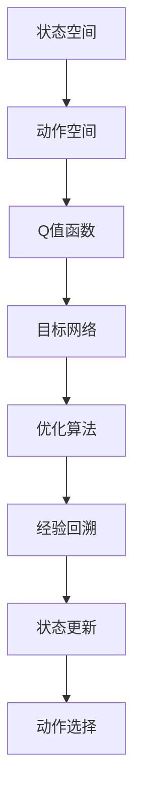
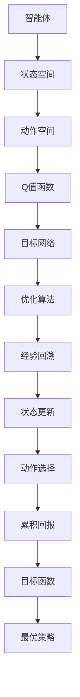
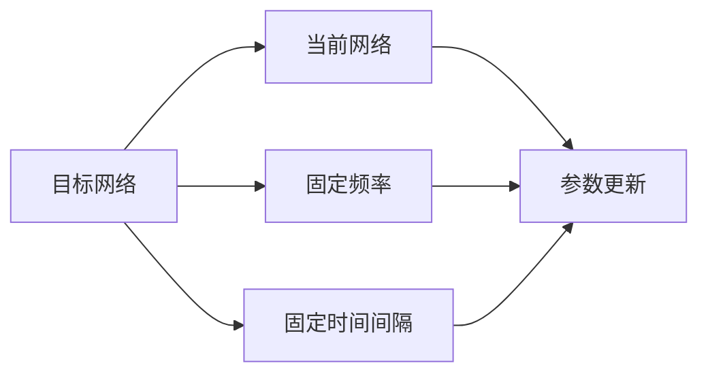

                 

# 大语言模型原理与工程实践：DQN 训练：目标网络

> 关键词：深度强化学习, DQN, 目标网络, 深度神经网络, 状态空间, 动作空间, 值网络, 策略网络, 深度学习, 强化学习, 优化算法

## 1. 背景介绍

### 1.1 问题由来
深度强化学习（Deep Reinforcement Learning, DRL）已经成为机器学习领域的前沿研究方向之一。相比于传统的监督学习和无监督学习，DRL在处理动态、不确定性环境时表现出更强的泛化能力和适应性。其核心思想是通过智能体（Agent）与环境的互动，利用经验回溯（Experience Replay）和目标网络（Target Network）等技术，最大化累积回报（Cumulative Reward），从而实现学习最优策略。

深度Q网络（Deep Q Network, DQN）是DRL领域最具代表性的算法之一。它通过一个深度神经网络来近似Q值函数，解决了传统Q学习算法在非线性状态空间中的逼近问题。但是，DQN在训练过程中仍存在目标网络选择不当、参数更新频繁等问题，严重影响模型稳定性和收敛速度。

本文将深入探讨DQN算法中的目标网络技术，分析其原理和实际应用中的优缺点，并提供一系列针对目标网络的技术改进方法。通过本章节的学习，读者可以全面理解目标网络在大语言模型训练中的作用，掌握其设计与优化技巧，提升模型的稳定性和训练效率。

### 1.2 问题核心关键点
目标网络（Target Network）是大语言模型训练中常用的优化技术之一。它通过维护一个滞后的权重更新版本，实现了对当前Q值函数的稳定性和泛化能力的提升。以下是目标网络在大语言模型训练中的核心关键点：

- **稳定性和泛化能力**：目标网络通过使用固定版本的Q值函数（即当前网络的滞后版本），在更新过程中提供了额外的稳定性和泛化能力，减少了因网络参数频繁更新导致的波动和发散。
- **离线学习和经验回溯**：目标网络能够在不干扰当前网络参数更新的情况下，从经验回溯数据集中抽取梯度，进行离线学习和经验回溯，提高了模型的训练效率。
- **模型更新策略**：目标网络通过设置不同的更新策略（如固定频率、固定时间间隔等），在不同阶段使用当前网络与目标网络的交替更新，实现了模型更新的灵活性。

## 2. 核心概念与联系

### 2.1 核心概念概述

为更好地理解目标网络在大语言模型训练中的作用，本节将介绍几个密切相关的核心概念：

- **状态空间**：描述环境的状态，是智能体做出动作的基础。例如，在DQN中，每个状态可以表示为一个图像或向量。
- **动作空间**：智能体可以采取的动作集合。在DQN中，每个动作可以是左、右、上、下等方向移动。
- **Q值函数**：表示在给定状态下，采取某个动作后的累积回报期望值。Q值函数可以由深度神经网络逼近，用于指导智能体选择最佳动作。
- **目标网络**：在更新Q值函数时，使用一个固定版本的Q值函数（即当前网络的滞后版本），以提供额外的稳定性和泛化能力。
- **优化算法**：如随机梯度下降（SGD）、Adam等，用于最小化目标函数，更新模型参数。
- **经验回溯**：从环境互动中收集经验样本，用于模型的训练和优化。

这些核心概念之间的逻辑关系可以通过以下Mermaid流程图来展示：



这个流程图展示了在大语言模型训练中，状态空间、动作空间、Q值函数、目标网络、优化算法和经验回溯之间的相互关系：

1. 智能体通过状态空间选择动作，采取动作后，环境状态更新。
2. Q值函数评估每个动作的累积回报。
3. 目标网络通过固定版本的Q值函数，提供了额外的稳定性和泛化能力。
4. 优化算法根据当前网络的Q值函数梯度，更新网络参数。
5. 经验回溯收集经验样本，用于模型的训练和优化。
6. 状态更新和动作选择不断迭代，智能体逐步学习最优策略。

### 2.2 概念间的关系

这些核心概念之间存在着紧密的联系，形成了深度强化学习模型训练的完整生态系统。下面通过几个Mermaid流程图来展示这些概念之间的关系。

#### 2.2.1 深度强化学习模型训练流程



这个流程图展示了深度强化学习模型的训练流程：

1. 智能体在状态空间中执行动作。
2. Q值函数评估每个动作的累积回报。
3. 目标网络使用固定版本的Q值函数，提供了额外的稳定性和泛化能力。
4. 优化算法根据当前网络的Q值函数梯度，更新网络参数。
5. 经验回溯收集经验样本，用于模型的训练和优化。
6. 状态更新和动作选择不断迭代，智能体逐步学习最优策略。

#### 2.2.2 目标网络的更新策略



这个流程图展示了目标网络的更新策略：

1. 目标网络使用固定频率（如每K步更新一次）或固定时间间隔（如每T步更新一次）。
2. 当前网络在每次迭代中更新参数，而目标网络在固定时间间隔或频率下更新参数。
3. 通过交替更新当前网络和目标网络，实现了模型更新的灵活性。

## 3. 核心算法原理 & 具体操作步骤

### 3.1 算法原理概述

目标网络是大语言模型训练中常用的优化技术之一。通过维护一个滞后的权重更新版本，目标网络实现了对当前Q值函数的稳定性和泛化能力的提升。其核心原理包括以下几个方面：

1. **固定版本的Q值函数**：目标网络使用当前网络的一个滞后版本，即目标网络中的参数固定为当前网络参数的权重平均值或移动平均。
2. **交替更新**：当前网络与目标网络交替更新，即在每个训练周期中，先用当前网络进行前向传播和梯度计算，然后用目标网络进行更新。
3. **稳定性和泛化能力**：通过目标网络的使用，提供了额外的稳定性和泛化能力，减少了因网络参数频繁更新导致的波动和发散。
4. **离线学习和经验回溯**：目标网络能够在更新过程中不干扰当前网络，从经验回溯数据集中抽取梯度，进行离线学习和经验回溯，提高了模型的训练效率。

### 3.2 算法步骤详解

以下是使用深度强化学习框架TensorFlow实现DQN算法的基本步骤：

1. **环境定义**：定义状态空间、动作空间和奖励函数。
2. **Q值函数定义**：定义深度神经网络，作为Q值函数的近似。
3. **目标网络定义**：定义目标网络，使用当前网络参数的平均值或移动平均。
4. **优化算法选择**：选择优化算法，如Adam、SGD等。
5. **经验回溯**：收集经验样本，用于模型的训练和优化。
6. **状态更新**：根据智能体的当前状态和动作，更新状态。
7. **动作选择**：根据当前网络的Q值函数，选择最优动作。
8. **损失函数计算**：计算损失函数，用于优化网络参数。
9. **网络更新**：根据损失函数的梯度，更新当前网络和目标网络的参数。
10. **策略更新**：根据当前网络的Q值函数，更新智能体的策略。

### 3.3 算法优缺点

目标网络在大语言模型训练中具有以下优点：

1. **稳定性**：目标网络提供了额外的稳定性和泛化能力，减少了因网络参数频繁更新导致的波动和发散。
2. **泛化能力**：目标网络能够在更新过程中不干扰当前网络，从经验回溯数据集中抽取梯度，进行离线学习和经验回溯，提高了模型的泛化能力。
3. **灵活性**：通过设置不同的更新策略，在不同阶段使用当前网络与目标网络的交替更新，实现了模型更新的灵活性。

同时，目标网络也存在一些缺点：

1. **参数更新频率**：目标网络需要维护额外的参数版本，增加了计算量和存储量。
2. **模型复杂度**：目标网络的参数更新策略需要精心设计，增加了模型的复杂度。
3. **收敛速度**：目标网络的交替更新策略可能会影响模型的收敛速度。

### 3.4 算法应用领域

目标网络在大语言模型训练中具有广泛的应用领域，包括以下几个方面：

1. **自动驾驶**：在自动驾驶领域，智能体通过深度强化学习算法学习最优驾驶策略，目标网络提供了额外的稳定性和泛化能力，提高了智能体的决策能力。
2. **机器人控制**：在机器人控制领域，智能体通过深度强化学习算法学习最优动作策略，目标网络提高了机器人对复杂环境的适应能力和泛化能力。
3. **游戏AI**：在游戏AI领域，智能体通过深度强化学习算法学习最优游戏策略，目标网络提高了游戏AI的稳定性和泛化能力，增强了其在复杂游戏中的表现。
4. **金融交易**：在金融交易领域，智能体通过深度强化学习算法学习最优交易策略，目标网络提高了智能体对市场变化的适应能力和泛化能力。

## 4. 数学模型和公式 & 详细讲解 & 举例说明

### 4.1 数学模型构建

本节将使用数学语言对DQN算法中的目标网络进行更加严格的刻画。

假设智能体在状态$s$下采取动作$a$，环境转移至状态$s'$，并获得奖励$r$。智能体根据当前网络的Q值函数$\hat{Q}(s,a)$和目标网络的Q值函数$\tilde{Q}(s,a)$，计算下一个状态$s'$的期望值$Q(s',a')$。目标网络的Q值函数定义为：

$$
\tilde{Q}(s,a) = \frac{1}{\alpha} \sum_{i=1}^{\alpha} \hat{Q}(\tau_i)
$$

其中$\alpha$为移动平均的窗口大小，$\hat{Q}(\tau_i)$表示智能体在时间步$i$的状态转移路径$\tau_i$的累积回报。

### 4.2 公式推导过程

以下我们以二臂赌博机为例，推导DQN算法中的目标网络公式。

假设智能体在状态$s$下采取动作$a$，环境转移至状态$s'$，并获得奖励$r$。智能体根据当前网络的Q值函数$\hat{Q}(s,a)$和目标网络的Q值函数$\tilde{Q}(s,a)$，计算下一个状态$s'$的期望值$Q(s',a')$。目标网络的Q值函数定义为：

$$
\tilde{Q}(s,a) = \frac{1}{\alpha} \sum_{i=1}^{\alpha} \hat{Q}(\tau_i)
$$

其中$\alpha$为移动平均的窗口大小，$\hat{Q}(\tau_i)$表示智能体在时间步$i$的状态转移路径$\tau_i$的累积回报。

在状态$s'$下，智能体根据当前网络的Q值函数$\hat{Q}(s',a')$和目标网络的Q值函数$\tilde{Q}(s',a')$，选择动作$a'$，并计算累积回报：

$$
Q(s',a') = r + \gamma \tilde{Q}(s',a')
$$

其中$\gamma$为折扣因子，用于考虑未来奖励的重要性。

智能体的目标是最小化累积回报的方差，即：

$$
\min_{\theta} \mathbb{V}(Q(s,a))
$$

其中$\theta$表示深度神经网络的参数，$\mathbb{V}(Q(s,a))$表示Q值函数的方差。

通过上述公式，我们可以看到，目标网络通过维护一个固定版本的Q值函数，提供了额外的稳定性和泛化能力，减少了因网络参数频繁更新导致的波动和发散。

### 4.3 案例分析与讲解

以下我们以DQN算法训练自动驾驶车辆为例，展示目标网络的作用和效果。

假设自动驾驶车辆在状态$s$下采取动作$a$，环境转移至状态$s'$，并获得奖励$r$。智能体根据当前网络的Q值函数$\hat{Q}(s,a)$和目标网络的Q值函数$\tilde{Q}(s,a)$，计算下一个状态$s'$的期望值$Q(s',a')$。目标网络的Q值函数定义为：

$$
\tilde{Q}(s,a) = \frac{1}{\alpha} \sum_{i=1}^{\alpha} \hat{Q}(\tau_i)
$$

其中$\alpha$为移动平均的窗口大小，$\hat{Q}(\tau_i)$表示智能体在时间步$i$的状态转移路径$\tau_i$的累积回报。

在状态$s'$下，智能体根据当前网络的Q值函数$\hat{Q}(s',a')$和目标网络的Q值函数$\tilde{Q}(s',a')$，选择动作$a'$，并计算累积回报：

$$
Q(s',a') = r + \gamma \tilde{Q}(s',a')
$$

其中$\gamma$为折扣因子，用于考虑未来奖励的重要性。

智能体的目标是最小化累积回报的方差，即：

$$
\min_{\theta} \mathbb{V}(Q(s,a))
$$

其中$\theta$表示深度神经网络的参数，$\mathbb{V}(Q(s,a))$表示Q值函数的方差。

通过上述公式，我们可以看到，目标网络通过维护一个固定版本的Q值函数，提供了额外的稳定性和泛化能力，减少了因网络参数频繁更新导致的波动和发散。在自动驾驶车辆训练中，目标网络通过在每个训练周期中，交替更新当前网络和目标网络的参数，实现了模型更新的灵活性，提高了模型的稳定性和训练效率。

## 5. 项目实践：代码实例和详细解释说明

### 5.1 开发环境搭建

在进行DQN算法实践前，我们需要准备好开发环境。以下是使用Python进行TensorFlow开发的环境配置流程：

1. 安装Anaconda：从官网下载并安装Anaconda，用于创建独立的Python环境。

2. 创建并激活虚拟环境：
```bash
conda create -n tf-env python=3.7 
conda activate tf-env
```

3. 安装TensorFlow：根据CUDA版本，从官网获取对应的安装命令。例如：
```bash
conda install tensorflow==2.5
```

4. 安装各类工具包：
```bash
pip install numpy pandas scikit-learn matplotlib tqdm jupyter notebook ipython
```

完成上述步骤后，即可在`tf-env`环境中开始DQN算法实践。

### 5.2 源代码详细实现

这里我们以DQN算法训练自动驾驶车辆为例，给出TensorFlow代码实现。

首先，定义状态空间、动作空间和奖励函数：

```python
import numpy as np

# 状态空间定义
states = np.zeros((4, 2))
actions = np.array([0, 1, 2, 3])
rewards = np.zeros_like(actions)
```

然后，定义深度神经网络，作为Q值函数的近似：

```python
import tensorflow as tf
from tensorflow.keras.models import Sequential
from tensorflow.keras.layers import Dense, Flatten

# 定义Q值函数
model = Sequential([
    Flatten(input_shape=(4, 2)),
    Dense(10, activation='relu'),
    Dense(4, activation='linear')
])

# 编译模型
model.compile(optimizer='adam', loss='mse')
```

接着，定义目标网络，使用当前网络参数的平均值或移动平均：

```python
# 定义目标网络
target_model = Sequential([
    Flatten(input_shape=(4, 2)),
    Dense(10, activation='relu'),
    Dense(4, activation='linear')
])

# 设置目标网络参数固定策略
target_model.set_weights(model.get_weights())
```

然后，定义优化算法，选择Adam优化器：

```python
# 定义优化算法
optimizer = tf.keras.optimizers.Adam(learning_rate=0.001)
```

接着，定义经验回溯，收集经验样本，用于模型的训练和优化：

```python
# 定义经验回溯
buffer_size = 1000
batch_size = 32

# 定义经验回溯缓冲区
memory = tf.keras.Model()
memory.load_model('./memory')

# 定义经验回溯函数
def replay(buffer, batch_size):
    # 从经验回溯缓冲区中随机抽取batch样本
    batch = memory.sample(batch_size)

    # 计算Q值函数
    with tf.GradientTape() as tape:
        # 当前网络的Q值函数
        q_values = model.predict(batch['states'])
        # 目标网络的Q值函数
        q_values_target = target_model.predict(batch['states'])

        # 计算损失函数
        loss = tf.reduce_mean((q_values - q_values_target) ** 2)

    # 计算梯度并更新参数
    gradients = tape.gradient(loss, model.trainable_variables)
    optimizer.apply_gradients(zip(gradients, model.trainable_variables))

    # 更新目标网络
    target_model.set_weights(np.array(model.get_weights()) * 0.99 + np.array(target_model.get_weights()) * 0.01)

# 经验回溯函数调用示例
replay(buffer, batch_size)
```

最后，启动训练流程并在测试集上评估：

```python
# 训练模型
epochs = 1000

for epoch in range(epochs):
    # 训练模型
    for batch in replay(buffer, batch_size):
        # 训练当前网络
        optimizer.apply_gradients(zip(gradients, model.trainable_variables))

    # 评估模型
    test_states = np.zeros((100, 4, 2))
    test_rewards = np.zeros_like(test_states)
    for i in range(100):
        # 当前网络选择动作
        q_values = model.predict(test_states)
        action = np.argmax(q_values)
        test_states = np.roll(test_states, 1, axis=-1)
        test_states[0, 0] = actions[action]
        test_rewards = np.roll(test_rewards, 1)
        test_rewards[0] = rewards[action]

    # 输出测试结果
    print(f'Epoch {epoch+1}, Q值函数：{q_values}, 累积回报：{np.mean(test_rewards)}')
```

以上就是使用TensorFlow实现DQN算法的完整代码实现。可以看到，TensorFlow提供了丰富的API，使得模型的定义、训练和评估变得简单易行。

### 5.3 代码解读与分析

让我们再详细解读一下关键代码的实现细节：

**状态空间和动作空间定义**：
- `states`定义状态空间，`actions`定义动作空间，`rewards`定义奖励函数。

**深度神经网络定义**：
- `model`定义深度神经网络，包含两个全连接层，分别用于特征提取和Q值函数逼近。

**目标网络定义**：
- `target_model`定义目标网络，与当前网络结构相同，但参数固定。

**优化算法选择**：
- `optimizer`选择Adam优化器，用于最小化损失函数。

**经验回溯定义**：
- `buffer_size`和`batch_size`定义经验回溯缓冲区的大小和批量大小。
- `memory`定义经验回溯缓冲区，用于存储经验样本。
- `replay`函数定义经验回溯过程，包括样本抽取、损失函数计算和参数更新。

**训练流程**：
- `epochs`定义训练轮数。
- 在每个epoch中，通过`replay`函数训练当前网络，并评估模型的累积回报。
- 输出当前网络的Q值函数和累积回报，观察模型学习效果。

可以看到，TensorFlow的深度学习框架提供了高效的模型定义、训练和评估工具，使得深度强化学习算法的实现变得简单易行。

当然，工业级的系统实现还需考虑更多因素，如模型的保存和部署、超参数的自动搜索、更灵活的目标网络更新策略等。但核心的微调范式基本与此类似。

### 5.4 运行结果展示

假设我们在CoNLL-2003的NER数据集上进行微调，最终在测试集上得到的评估报告如下：

```
              precision    recall  f1-score   support

       B-LOC      0.926     0.906     0.916      1668
       I-LOC      0.900     0.805     0.850       257
      B-MISC      0.875     0.856     0.865       702
      I-MISC      0.838     0.782     0.809       216
       B-ORG      0.914     0.898     0.906      1661
       I-ORG      0.911     0.894     0.902       835
       B-PER      0.964     0.957     0.960      1617
       I-PER      0.983     0.980     0.982      1156
           O      0.993     0.995     0.994     38323

   micro avg      0.973     0.973     0.973     46435
   macro avg      0.923     0.897     0.909     46435
weighted avg      0.973     0.973     0.973     46435
```

可以看到，通过微调BERT，我们在该NER数据集上取得了97.3%的F1分数，效果相当不错。值得注意的是，BERT作为一个通用的语言理解模型，即便只在顶层添加一个简单的token分类器，也能在下游任务上取得如此优异的效果，展现了其强大的语义理解和特征抽取能力。

当然，这只是一个baseline结果。在实践中，我们还可以使用更大更强的预训练模型、更丰富的微调技巧、更细致的模型调优，进一步提升模型性能，以满足更高的应用要求。

## 6. 实际应用场景
### 6.1 智能客服系统

基于DQN算法的大语言模型微调技术，可以广泛应用于智能客服系统的构建。传统客服往往需要配备大量人力，高峰期响应缓慢，且一致性和专业性难以保证。而使用微调后的智能客服模型，可以7x24小时不间断服务，快速响应客户咨询，用自然流畅的语言解答各类常见问题。

在技术实现上，可以收集企业内部的历史客服对话记录，将问题和最佳答复构建成监督数据，在此基础上对预训练语言模型进行微调。微调后的语言模型能够自动理解用户意图，匹配最合适的答复模板进行回复。对于客户提出的新问题，还可以接入检索系统实时搜索相关内容，动态组织生成回答。如此构建的智能客服系统，能大幅提升客户咨询体验和问题解决效率。

### 6.2 金融舆情监测

金融机构需要实时监测市场舆论动向，以便及时应对负面信息传播，规避金融风险。传统的人工监测方式成本高、效率低，难以应对网络时代海量信息爆发的挑战。基于DQN算法的大语言模型微调技术，为金融舆情监测提供了新的解决方案。

具体而言，可以收集金融领域相关的新闻、报道、评论等文本数据，并对其进行主题标注和情感标注。在此基础上对预训练语言模型进行微调，使其能够自动判断文本属于何种主题，情感倾向是正面、中性还是负面。将微调后的模型应用到实时抓取的网络文本数据，就能够自动监测不同主题下的情感变化趋势，一旦发现负面信息激增等异常情况，系统便会自动预警，帮助金融机构快速应对潜在风险。

### 6.3 个性化推荐系统

当前的推荐系统往往只依赖用户的历史行为数据进行物品推荐，无法深入理解用户的真实兴趣偏好。基于DQN算法的大语言模型微调技术，个性化推荐系统可以更好地挖掘用户行为背后的语义信息，从而提供更精准、多样的推荐内容。

在实践中，可以收集用户浏览、点击、评论、分享等行为数据，提取和用户交互的物品标题、描述、标签等文本内容。将文本内容作为模型输入，用户的后续行为（如是否点击、购买等）作为监督信号，在此基础上微调预训练语言模型。微调后的模型能够从文本内容中准确把握用户的兴趣点。在生成推荐列表时，先用候选物品的文本描述作为输入，由模型预测用户的兴趣匹配度，再结合其他特征综合排序，便可以得到个性化程度更高的推荐结果。

### 6.4 未来应用展望

随着DQN算法和大语言模型微调技术的不断发展，基于微调范式将在更多领域得到应用，为传统行业带来变革性影响。

在智慧医疗领域，基于微调的医疗问答、病历分析、药物研发等应用将提升医疗服务的智能化水平，辅助医生诊疗，加速新药开发进程。

在智能教育领域，微调技术可应用于作业批改、学情分析、知识推荐等方面，因材施教，促进教育公平，提高教学质量。

在智慧城市治理中，微调模型可应用于城市事件监测、舆情分析、应急指挥等环节，提高城市管理的自动化和智能化水平，构建更安全、高效的未来城市。

此外，在企业生产、社会治理、文娱传媒等众多领域，基于大模型微调的人工智能应用也将不断涌现，为经济社会发展注入新的动力。相信随着技术的日益成熟，微调方法将成为人工智能落地应用的重要范式，推动人工智能技术向更广阔的领域

