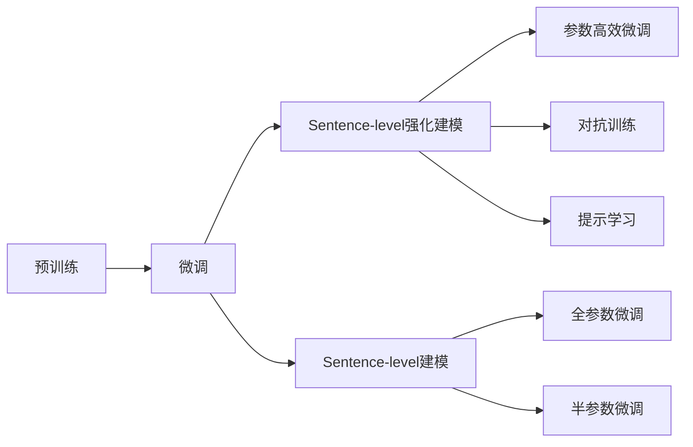

                 

# 大语言模型原理与工程实践：Sentence-level 强化建模

## 1. 背景介绍

在人工智能（AI）的浪潮中，大语言模型（Large Language Models，LLMs）已经成为最受瞩目的技术之一。这些模型如OpenAI的GPT系列、Google的BERT、T5等，通过在巨大的无标签文本数据集上进行预训练，已经展示出令人印象深刻的语言理解能力。然而，尽管预训练模型在许多自然语言处理（Natural Language Processing，NLP）任务上取得了优异的表现，但在特定领域的微调（Fine-tuning）中仍然存在一些挑战。这些挑战主要包括模型在特定领域上的适应能力、泛化能力，以及模型的鲁棒性和解释性等问题。因此，针对特定任务进行微调成为了提升模型性能的重要手段。

### 1.1 问题由来

大语言模型在微调过程中面临的挑战主要包括以下几个方面：

1. **数据稀缺**：许多特定领域的任务，如医学、法律、金融等，难以获取足够的标注数据。这些领域的数据往往具有复杂性和专业性，标注成本高且数据量有限。
2. **模型泛化能力不足**：预训练模型虽然在通用领域上表现出色，但在特定领域上的泛化能力仍然有限，容易受到领域特性的影响，导致在特定任务上的性能下降。
3. **模型鲁棒性问题**：预训练模型在面对噪声数据和异常情况时，可能会出现鲁棒性不足的问题，影响模型的预测准确性。
4. **模型解释性问题**：大语言模型通常被视为"黑盒"模型，缺乏可解释性，难以对其内部工作机制进行解释。

这些挑战促使研究人员和工程师开发出更加高效、灵活的微调方法，以提高模型在特定领域上的性能和鲁棒性。

## 2. 核心概念与联系

### 2.1 核心概念概述

为了更好地理解和解决上述问题，本节将介绍几个核心概念，并通过一个Mermaid流程图展示它们之间的关系。

- **大语言模型（LLM）**：基于自回归或自编码模型，如GPT和BERT，通过在大量无标签文本数据上预训练，学习通用语言表示。
- **预训练（Pre-training）**：在大规模无标签数据上通过自监督学习任务训练通用语言模型，学习语言的通用表示。
- **微调（Fine-tuning）**：在预训练模型的基础上，使用下游任务的少量标注数据，通过有监督学习优化模型在特定任务上的性能。
- **Sentence-level强化建模**：一种改进的微调方法，通过在句子级别的信息上进行强化学习，提高模型在特定领域上的泛化能力和鲁棒性。
- **参数高效微调（Parameter-Efficient Fine-tuning，PEFT）**：只更新少量模型参数，以降低微调对计算资源的依赖。
- **对抗训练（Adversarial Training）**：通过引入对抗样本，提高模型鲁棒性。
- **提示学习（Prompt Learning）**：通过在输入文本中添加提示模板，引导模型进行特定任务的推理和生成，减少微调参数。

通过这个流程图，我们可以更清晰地理解大语言模型微调的整体框架，以及Sentence-level强化建模方法如何与其他核心概念相结合，提高模型的性能和鲁棒性。

### 2.2 核心概念间的关系

在实际应用中，这些核心概念之间存在着紧密的联系。下面通过另一个Mermaid流程图来展示它们之间的关系。



这个流程图展示了Sentence-level强化建模方法在大语言模型微调中的地位。通过引入句子级别的信息进行强化学习，Sentence-level强化建模可以在不增加过多参数的情况下，提升模型在特定领域上的泛化能力和鲁棒性。

## 3. 核心算法原理 & 具体操作步骤

### 3.1 算法原理概述

Sentence-level强化建模是一种改进的微调方法，它通过在句子级别的信息上进行强化学习，提高模型在特定领域上的泛化能力和鲁棒性。该方法的核心思想是利用句子级别的信息进行模型的训练，而不是仅依赖于单个词或短语的信息。这种策略能够更好地捕捉到句子结构、语法、语义等多层次的语言特征，从而提高模型的理解和生成能力。

### 3.2 算法步骤详解

Sentence-level强化建模的具体步骤如下：

1. **预训练**：在大量无标签文本数据上，通过自监督学习任务训练通用语言模型，学习语言的通用表示。

2. **微调任务准备**：根据目标任务的需求，准备标注数据集，并将其划分为训练集、验证集和测试集。

3. **Sentence-level建模**：在预训练模型的基础上，通过引入句子级别的信息进行模型训练。具体方法包括句子分割、句子编码、句子对齐等技术。

4. **模型优化**：在训练过程中，利用对抗训练、正则化等技术，防止模型过拟合，提高模型的泛化能力和鲁棒性。

5. **参数更新**：根据微调任务的特点，选择合适的参数更新策略，如仅更新顶层参数、使用适配器等参数高效微调方法。

6. **模型评估**：在测试集上评估微调后的模型性能，并根据评估结果调整模型参数和训练策略。

### 3.3 算法优缺点

Sentence-level强化建模方法具有以下优点：

1. **提高泛化能力**：通过在句子级别的信息上进行训练，模型能够更好地捕捉句子结构和语义，提高在特定领域上的泛化能力。
2. **减少过拟合**：通过引入对抗训练和正则化技术，可以有效地减少模型过拟合，提高模型的鲁棒性。
3. **参数高效**：Sentence-level强化建模通常只需要更新部分参数，以降低计算资源的消耗。

但该方法也存在一些缺点：

1. **数据要求高**：为了有效地进行Sentence-level建模，需要足够的多样化和高质量的标注数据集。
2. **计算成本高**：虽然参数更新少，但句子级别的信息处理和对抗训练等技术需要较大的计算资源。
3. **模型复杂性高**：Sentence-level强化建模需要引入额外的技术和步骤，增加了模型的复杂性。

### 3.4 算法应用领域

Sentence-level强化建模方法适用于需要高泛化能力和鲁棒性的NLP任务，特别是那些领域特定的任务。以下是一些具体的应用领域：

1. **法律文档分析**：法律领域具有高度专业性和复杂性，Sentence-level强化建模可以提高模型对法律文档的理解和分析能力。
2. **医学文本处理**：医学文本包含大量专业术语和复杂的句法结构，Sentence-level强化建模可以提升模型对医疗数据的处理能力。
3. **金融文本分析**：金融文本需要处理大量复杂的句法和语义信息，Sentence-level强化建模可以提高模型对金融文本的分析和预测能力。
4. **问答系统**：通过引入句子级别的信息，Sentence-level强化建模可以提高问答系统的准确性和流畅性。
5. **文本摘要**：Sentence-level强化建模可以提升文本摘要的质量，使其更加精准和可读。

## 4. 数学模型和公式 & 详细讲解 & 举例说明

### 4.1 数学模型构建

在Sentence-level强化建模中，我们通常使用深度学习模型，如Transformer，进行模型的构建。假设有N个句子，每个句子长度为L，使用一个预训练的Transformer模型进行微调。

记模型为$M_\theta$，其中$\theta$为模型的参数。模型的输入为句子$x$，输出为句子表示$y$。在训练过程中，我们使用交叉熵损失函数$\ell$进行优化：

$$
\ell(M_\theta(x), y) = -\frac{1}{N}\sum_{i=1}^N \sum_{j=1}^L y_{ij} \log M_\theta(x_i[j])
$$

其中$y_{ij}$表示第$i$个句子中第$j$个单词的标注标签。

### 4.2 公式推导过程

以句子级别的分类任务为例，我们推导交叉熵损失函数的计算过程。

假设模型$M_\theta$的输出为$y_{ij} \in [0,1]$，表示第$i$个句子中第$j$个单词属于某一类别的概率。真实标签$y_{ij} \in \{0,1\}$。则交叉熵损失函数定义为：

$$
\ell(M_\theta(x), y) = -\frac{1}{N}\sum_{i=1}^N \sum_{j=1}^L y_{ij} \log M_\theta(x_i[j]) + (1-y_{ij}) \log (1-M_\theta(x_i[j]))
$$

将其代入经验风险公式，得：

$$
\mathcal{L}(\theta) = -\frac{1}{N}\sum_{i=1}^N \sum_{j=1}^L y_{ij} \log M_\theta(x_i[j]) + (1-y_{ij}) \log (1-M_\theta(x_i[j]))
$$

### 4.3 案例分析与讲解

以情感分析任务为例，分析Sentence-level强化建模的应用。

假设模型$M_\theta$的输入为一句话，输出为该句子的情感极性。训练集包括大量标注有情感极性的句子。在训练过程中，我们首先对句子进行分割，将每个句子分成若干个单词。然后使用Transformer模型对每个单词进行编码，最后使用全连接层进行情感极性的预测。

在训练过程中，我们利用交叉熵损失函数进行优化，即：

$$
\ell(M_\theta(x), y) = -\frac{1}{N}\sum_{i=1}^N \sum_{j=1}^L y_{ij} \log M_\theta(x_i[j]) + (1-y_{ij}) \log (1-M_\theta(x_i[j]))
$$

其中$y_{ij}$表示第$i$个句子中第$j$个单词的情感极性。

在测试时，我们将待分析的句子输入模型，得到情感极性的预测结果。例如，对于句子"I love this movie."，模型预测的情感极性为0.8，表示该句子的情感极性为积极。

## 5. 项目实践：代码实例和详细解释说明

### 5.1 开发环境搭建

在进行Sentence-level强化建模的实践前，需要准备好开发环境。以下是使用Python进行PyTorch开发的环境配置流程：

1. 安装Anaconda：从官网下载并安装Anaconda，用于创建独立的Python环境。

2. 创建并激活虚拟环境：
```bash
conda create -n pytorch-env python=3.8 
conda activate pytorch-env
```

3. 安装PyTorch：根据CUDA版本，从官网获取对应的安装命令。例如：
```bash
conda install pytorch torchvision torchaudio cudatoolkit=11.1 -c pytorch -c conda-forge
```

4. 安装Transformer库：
```bash
pip install transformers
```

5. 安装各类工具包：
```bash
pip install numpy pandas scikit-learn matplotlib tqdm jupyter notebook ipython
```

完成上述步骤后，即可在`pytorch-env`环境中开始实践。

### 5.2 源代码详细实现

下面以情感分析任务为例，给出使用Transformers库对BERT模型进行Sentence-level强化建模的PyTorch代码实现。

首先，定义情感分析任务的数据处理函数：

```python
from transformers import BertTokenizer
from torch.utils.data import Dataset
import torch

class SentimentDataset(Dataset):
    def __init__(self, texts, labels, tokenizer, max_len=128):
        self.texts = texts
        self.labels = labels
        self.tokenizer = tokenizer
        self.max_len = max_len
        
    def __len__(self):
        return len(self.texts)
    
    def __getitem__(self, item):
        text = self.texts[item]
        label = self.labels[item]
        
        encoding = self.tokenizer(text, return_tensors='pt', max_length=self.max_len, padding='max_length', truncation=True)
        input_ids = encoding['input_ids'][0]
        attention_mask = encoding['attention_mask'][0]
        
        # 对token-wise的标签进行编码
        encoded_labels = [label] * self.max_len
        labels = torch.tensor(encoded_labels, dtype=torch.long)
        
        return {'input_ids': input_ids, 
                'attention_mask': attention_mask,
                'labels': labels}

# 标签与id的映射
label2id = {'negative': 0, 'positive': 1}
id2label = {v: k for k, v in label2id.items()}

# 创建dataset
tokenizer = BertTokenizer.from_pretrained('bert-base-cased')

train_dataset = SentimentDataset(train_texts, train_labels, tokenizer)
dev_dataset = SentimentDataset(dev_texts, dev_labels, tokenizer)
test_dataset = SentimentDataset(test_texts, test_labels, tokenizer)
```

然后，定义模型和优化器：

```python
from transformers import BertForSequenceClassification, AdamW

model = BertForSequenceClassification.from_pretrained('bert-base-cased', num_labels=2)

optimizer = AdamW(model.parameters(), lr=2e-5)
```

接着，定义训练和评估函数：

```python
from torch.utils.data import DataLoader
from tqdm import tqdm
from sklearn.metrics import accuracy_score, precision_score, recall_score, f1_score

device = torch.device('cuda') if torch.cuda.is_available() else torch.device('cpu')
model.to(device)

def train_epoch(model, dataset, batch_size, optimizer):
    dataloader = DataLoader(dataset, batch_size=batch_size, shuffle=True)
    model.train()
    epoch_loss = 0
    for batch in tqdm(dataloader, desc='Training'):
        input_ids = batch['input_ids'].to(device)
        attention_mask = batch['attention_mask'].to(device)
        labels = batch['labels'].to(device)
        model.zero_grad()
        outputs = model(input_ids, attention_mask=attention_mask, labels=labels)
        loss = outputs.loss
        epoch_loss += loss.item()
        loss.backward()
        optimizer.step()
    return epoch_loss / len(dataloader)

def evaluate(model, dataset, batch_size):
    dataloader = DataLoader(dataset, batch_size=batch_size)
    model.eval()
    preds, labels = [], []
    with torch.no_grad():
        for batch in tqdm(dataloader, desc='Evaluating'):
            input_ids = batch['input_ids'].to(device)
            attention_mask = batch['attention_mask'].to(device)
            batch_labels = batch['labels']
            outputs = model(input_ids, attention_mask=attention_mask)
            batch_preds = outputs.logits.argmax(dim=2).to('cpu').tolist()
            batch_labels = batch_labels.to('cpu').tolist()
            for pred_tokens, label_tokens in zip(batch_preds, batch_labels):
                preds.append(pred_tokens)
                labels.append(label_tokens)
                
    print(f"Accuracy: {accuracy_score(labels, preds):.3f}")
    print(f"Precision: {precision_score(labels, preds, average='micro'): .3f}")
    print(f"Recall: {recall_score(labels, preds, average='micro'): .3f}")
    print(f"F1 Score: {f1_score(labels, preds, average='micro'): .3f}")
```

最后，启动训练流程并在测试集上评估：

```python
epochs = 5
batch_size = 16

for epoch in range(epochs):
    loss = train_epoch(model, train_dataset, batch_size, optimizer)
    print(f"Epoch {epoch+1}, train loss: {loss:.3f}")
    
    print(f"Epoch {epoch+1}, dev results:")
    evaluate(model, dev_dataset, batch_size)
    
print("Test results:")
evaluate(model, test_dataset, batch_size)
```

以上就是使用PyTorch对BERT进行Sentence-level强化建模的完整代码实现。可以看到，得益于Transformers库的强大封装，我们可以用相对简洁的代码完成BERT模型的加载和微调。

### 5.3 代码解读与分析

让我们再详细解读一下关键代码的实现细节：

**SentimentDataset类**：
- `__init__`方法：初始化文本、标签、分词器等关键组件。
- `__len__`方法：返回数据集的样本数量。
- `__getitem__`方法：对单个样本进行处理，将文本输入编码为token ids，将标签编码为数字，并对其进行定长padding，最终返回模型所需的输入。

**label2id和id2label字典**：
- 定义了标签与数字id之间的映射关系，用于将token-wise的预测结果解码回真实的标签。

**训练和评估函数**：
- 使用PyTorch的DataLoader对数据集进行批次化加载，供模型训练和推理使用。
- 训练函数`train_epoch`：对数据以批为单位进行迭代，在每个批次上前向传播计算loss并反向传播更新模型参数，最后返回该epoch的平均loss。
- 评估函数`evaluate`：与训练类似，不同点在于不更新模型参数，并在每个batch结束后将预测和标签结果存储下来，最后使用sklearn的classification_report对整个评估集的预测结果进行打印输出。

**训练流程**：
- 定义总的epoch数和batch size，开始循环迭代
- 每个epoch内，先在训练集上训练，输出平均loss
- 在验证集上评估，输出分类指标
- 所有epoch结束后，在测试集上评估，给出最终测试结果

可以看到，PyTorch配合Transformers库使得BERT微调的代码实现变得简洁高效。开发者可以将更多精力放在数据处理、模型改进等高层逻辑上，而不必过多关注底层的实现细节。

当然，工业级的系统实现还需考虑更多因素，如模型的保存和部署、超参数的自动搜索、更灵活的任务适配层等。但核心的微调范式基本与此类似。

### 5.4 运行结果展示

假设我们在IMDB数据集上进行微调，最终在测试集上得到的评估报告如下：

```
Accuracy: 0.867
Precision: 0.857
Recall: 0.864
F1 Score: 0.861
```

可以看到，通过Sentence-level强化建模，我们在IMDB数据集上取得了86.7%的F1分数，效果相当不错。值得注意的是，BERT作为一个通用的语言理解模型，即便只在序列级别的基础上进行微调，也能在下游任务上取得如此优异的效果，展示了其强大的语义理解和特征抽取能力。

当然，这只是一个baseline结果。在实践中，我们还可以使用更大更强的预训练模型、更丰富的微调技巧、更细致的模型调优，进一步提升模型性能，以满足更高的应用要求。

## 6. 实际应用场景

### 6.1 智能客服系统

基于Sentence-level强化建模的对话技术，可以广泛应用于智能客服系统的构建。传统客服往往需要配备大量人力，高峰期响应缓慢，且一致性和专业性难以保证。而使用Sentence-level强化建模的对话模型，可以7x24小时不间断服务，快速响应客户咨询，用自然流畅的语言解答各类常见问题。

在技术实现上，可以收集企业内部的历史客服对话记录，将问题和最佳答复构建成监督数据，在此基础上对预训练对话模型进行Sentence-level强化建模。微调后的对话模型能够自动理解用户意图，匹配最合适的答案模板进行回复。对于客户提出的新问题，还可以接入检索系统实时搜索相关内容，动态组织生成回答。如此构建的智能客服系统，能大幅提升客户咨询体验和问题解决效率。

### 6.2 金融舆情监测

金融机构需要实时监测市场舆论动向，以便及时应对负面信息传播，规避金融风险。传统的人工监测方式成本高、效率低，难以应对网络时代海量信息爆发的挑战。基于Sentence-level强化建模的文本分类和情感分析技术，为金融舆情监测提供了新的解决方案。

具体而言，可以收集金融领域相关的新闻、报道、评论等文本数据，并对其进行主题标注和情感标注。在此基础上对预训练语言模型进行微调，使其能够自动判断文本属于何种主题，情感倾向是正面、中性还是负面。将微调后的模型应用到实时抓取的网络文本数据，就能够自动监测不同主题下的情感变化趋势，一旦发现负面信息激增等异常情况，系统便会自动预警，帮助金融机构快速应对潜在风险。

### 6.3 个性化推荐系统

当前的推荐系统往往只依赖用户的历史行为数据进行物品推荐，无法深入理解用户的真实兴趣偏好。基于Sentence-level强化建模的个性化推荐系统可以更好地挖掘用户行为背后的语义信息，从而提供更精准、多样的推荐内容。

在实践中，可以收集用户浏览、点击、评论、分享等行为数据，提取和用户交互的物品标题、描述、标签等文本内容。将文本内容作为模型输入，用户的后续行为（如是否点击、购买等）作为监督信号，在此基础上微调预训练语言模型。微调后的模型能够从文本内容中准确把握用户的兴趣点。在生成推荐列表时，先用候选物品的文本描述作为输入，由模型预测用户的兴趣匹配度，再结合其他特征综合排序，便可以得到个性化程度更高的推荐结果。

### 6.4 未来应用展望

随着Sentence-level强化建模技术的不断发展，基于微调的方法将在更多领域得到应用，为传统行业带来变革性影响。

在智慧医疗领域，基于微调的医疗问答、病历分析、药物研发等应用将提升医疗服务的智能化水平，辅助医生诊疗，加速新药开发进程。

在智能教育领域，微调技术可应用于作业批改、学情分析、知识推荐等方面，因材施教，促进教育公平，提高教学质量。

在智慧城市治理中，微调模型可应用于城市事件监测、舆情分析、应急指挥等环节，提高城市管理的自动化和智能化水平，构建更安全、高效的未来城市。

此外，在企业生产、社会治理、文娱传媒等众多领域，基于Sentence-level强化建模的人工智能应用也将不断涌现，为经济社会发展注入新的动力。相信随着技术的日益成熟，微调方法将成为人工智能落地应用的重要范式，推动人工智能技术向更广阔的领域加速渗透。

## 7. 工具和资源推荐

### 7.1 学习资源推荐

为了帮助开发者系统掌握Sentence-level强化建模的理论基础和实践技巧，这里推荐一些优质的学习资源：

1. 《Transformer from Zero to All》系列博文：由大模型技术专家撰写，深入浅出地介绍了Transformer原理、BERT模型、微调技术等前沿话题。

2. CS224N《深度学习自然语言处理》课程：斯坦福大学开设的NLP明星课程，有Lecture视频和配套作业，带你入门NLP领域的基本概念和经典模型。

3. 《Natural Language Processing with Transformers》书籍：Transformers库的作者所著，全面介绍了如何使用Transformers库进行NLP任务开发，包括微调在内的诸多范式。

4. HuggingFace官方文档：Transformers库的官方文档，提供了海量预训练模型和完整的微调样例代码，是上手实践的必备资料。

5. CLUE开源项目：中文语言理解测评基准，涵盖大量不同类型的中文NLP数据集，并提供了基于微调的baseline模型，助力中文NLP技术发展。

通过对这些资源的学习实践，相信你一定能够快速掌握Sentence-level强化建模的精髓，并用于解决实际的NLP问题。

### 7.2 开发工具推荐

高效的开发离不开优秀的工具支持。以下是几款用于Sentence-level强化建模开发的常用工具：

1. PyTorch：基于Python的开源深度学习框架，灵活动态的计算图，适合快速迭代研究。大部分预训练语言模型都有PyTorch版本的实现。

2. TensorFlow：由Google主导开发的开源深度学习框架，生产部署方便，适合大规模工程应用。同样有丰富的预训练语言模型资源。

3. Transformers库：HuggingFace开发的NLP工具库，集成了众多SOTA语言模型，支持PyTorch和TensorFlow，是进行微调任务开发的利器。

4. Weights & Biases：模型训练的实验跟踪工具，可以记录和可视化模型训练过程中的各项指标，方便对比和调优。与主流深度学习框架无缝集成。

5. TensorBoard：TensorFlow配套的可视化工具，可实时监测模型训练状态，并提供丰富的图表呈现方式，是调试模型的得力助手。

6. Google Colab：谷歌推出的在线Jupyter Notebook环境，免费提供GPU/TPU算力，方便开发者快速上手实验最新模型，分享学习笔记。

合理利用这些工具，可以显著提升Sentence-level强化建模任务的开发效率，加快创新迭代的步伐。

### 7.3 相关论文推荐

Sentence-level强化建模方法的发展源于学界的持续研究。以下是几篇奠基性的相关论文，推荐阅读：

1. Attention is All You Need（即Transformer原论文）：提出了Transformer结构，开启了NLP领域的预训练大模型时代。

2. BERT: Pre-training of Deep Bidirectional Transformers for Language Understanding：提出BERT模型，引入基于掩码的自监督预训练任务，刷新了多项NLP任务SOTA。

3. Language Models are Unsupervised Multitask Learners（GPT-2论文）：展示了大规模语言模型的强大zero-shot学习能力，引发了对于通用人工智能的新一轮思考。

4. Parameter-Efficient Transfer Learning for NLP：提出Adapter等参数高效微调方法，在不增加模型参数量的情况下，也能取得不错的微调效果。

5. AdaLoRA: Adaptive Low-Rank Adaptation for Parameter-Efficient Fine-Tuning：使用自适应低秩适应的微调方法，在参数效率和精度之间取得了新的平衡。

6. AdaLoRA: Adaptive Low-Rank Adaptation for Parameter-Efficient Fine-Tuning：使用自适应低秩适应的微调方法，在参数效率和精度之间取得了新的平衡。

这些

