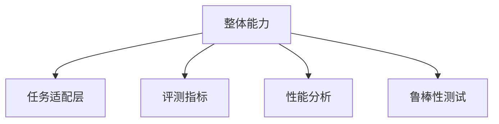
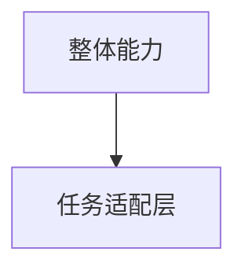
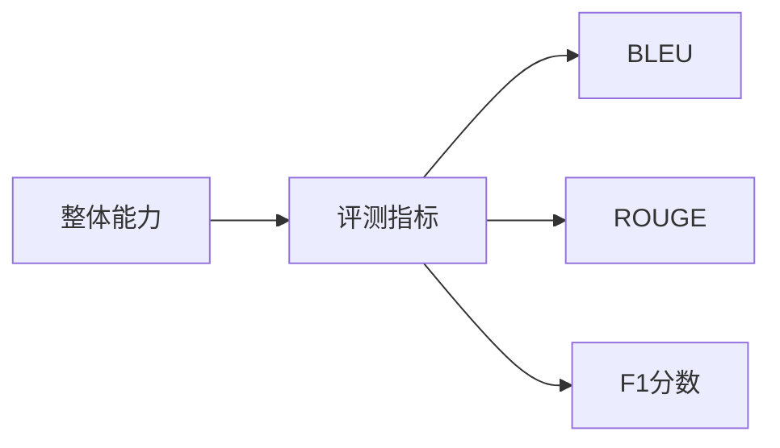
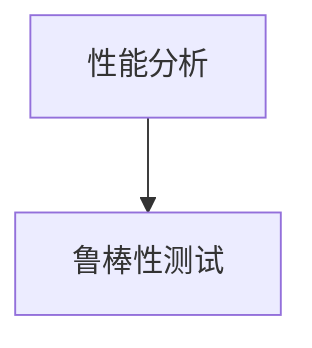
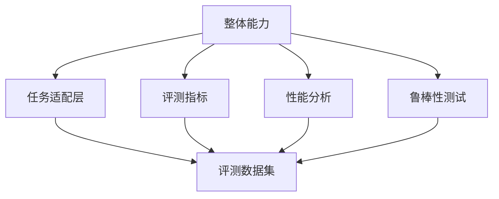

                 

# 大语言模型原理与工程实践：整体能力的评测

> 关键词：大语言模型,整体能力评测,自然语言处理,NLP,工程实践

## 1. 背景介绍

### 1.1 问题由来
随着深度学习技术和大规模预训练语言模型的飞速发展，自然语言处理(NLP)领域取得了显著进展。大语言模型凭借其强大的语言理解和生成能力，已成为现代NLP技术的重要基石。然而，大语言模型的整体能力如何度量和评估，一直缺乏系统性的方法和工具。

### 1.2 问题核心关键点
评估大语言模型的整体能力，涉及到多维度、多层次的评测指标，涵盖语言理解、生成、推理等多个方面。评估框架需要考虑模型的性能、效率、可解释性、鲁棒性等多个因素，形成全面、科学的评价体系。本文旨在探讨大语言模型的整体能力评测方法，并结合具体案例，进行详细阐述。

### 1.3 问题研究意义
研究大语言模型的整体能力评估方法，对于推动模型优化、提升应用效果、促进NLP技术的普及和应用具有重要意义：

1. 提供科学依据：系统性评估方法能帮助开发者全面了解模型性能，找到优化方向。
2. 指导应用实践：评估结果能帮助业务方选择适合的模型，提升应用效果。
3. 加速技术落地：评估框架的建立，能够加速NLP技术在各行各业中的应用。
4. 提升模型鲁棒性：通过系统化的评测，发现模型的鲁棒性和泛化能力，进而改进模型。
5. 保障模型安全性：评估框架可以检查模型是否存在偏见、有害内容等伦理问题，确保模型使用的安全性。

## 2. 核心概念与联系

### 2.1 核心概念概述

评估大语言模型的整体能力，需要引入一系列关键概念：

- 整体能力：指模型在多个NLP任务上的综合性能，包括理解、生成、推理、泛化、鲁棒性等多个维度。
- 评测指标：用于量化模型的性能，常见的有BLEU、ROUGE、F1分数等。
- 任务适配层：针对特定任务设计的功能层，用于提升模型的任务适应能力。
- 性能分析：通过模型输入和输出结果，分析模型的推理逻辑和错误来源。
- 鲁棒性测试：检验模型对各种扰动和异常数据的反应，确保模型的稳定性和可靠性。

这些概念之间的联系可以通过以下Mermaid流程图来展示：



这个流程图展示了整体能力评测框架中各概念之间的关系。整体能力通过任务适配层、评测指标、性能分析和鲁棒性测试等多个维度进行综合评估。

### 2.2 概念间的关系

这些概念之间存在着紧密的联系，共同构成了大语言模型的整体能力评测框架。下面通过几个Mermaid流程图来展示这些概念之间的关系。

#### 2.2.1 整体能力与任务适配层



这个流程图展示了整体能力与任务适配层之间的关系。整体能力评测需要评估模型在多个NLP任务上的表现，而任务适配层是为了提升模型在特定任务上的适应能力。

#### 2.2.2 整体能力与评测指标



这个流程图展示了整体能力与评测指标之间的关系。整体能力通过多个评测指标进行量化，常见的有BLEU、ROUGE、F1分数等。

#### 2.2.3 性能分析与鲁棒性测试



这个流程图展示了性能分析和鲁棒性测试之间的关系。性能分析用于分析模型的推理逻辑和错误来源，而鲁棒性测试用于检验模型的稳定性和可靠性。

### 2.3 核心概念的整体架构

最后，我们用一个综合的流程图来展示这些核心概念在大语言模型整体能力评测框架中的整体架构：



这个综合流程图展示了从任务适配层到评测指标、性能分析、鲁棒性测试，最终通过评测数据集进行整体能力评测的完整过程。

## 3. 核心算法原理 & 具体操作步骤
### 3.1 算法原理概述

大语言模型的整体能力评测，本质上是一个系统性的综合评估过程。其核心思想是：通过多维度、多层次的评测指标，量化模型的性能，并通过性能分析和鲁棒性测试，深入挖掘模型的逻辑和特性，全面反映模型的整体能力。

### 3.2 算法步骤详解

大语言模型的整体能力评测包括以下几个关键步骤：

**Step 1: 数据准备**
- 收集多个NLP任务的标注数据集，涵盖理解、生成、推理、泛化等多个方面。
- 将数据集分为训练集、验证集和测试集，以保证评估结果的可靠性。

**Step 2: 任务适配层设计**
- 根据具体任务需求，设计适配层，如分类器、生成器、推理器等，增强模型在特定任务上的表现。
- 选择合适的评测指标，如BLEU、ROUGE、F1分数等，用于量化模型在不同任务上的性能。

**Step 3: 模型微调**
- 使用大规模预训练模型作为初始化参数，通过有监督学习优化模型在特定任务上的性能。
- 选择合适的优化算法和超参数，如Adam、SGD等，设置合适的学习率、批大小等。
- 应用正则化技术，如L2正则、Dropout等，避免过拟合。

**Step 4: 性能分析**
- 使用模型输出结果，进行精度、召回率、准确率等性能指标的计算。
- 分析模型的推理过程，检查模型是否存在逻辑错误、推理偏差等问题。
- 使用可视化工具，展示模型的推理轨迹和错误分析结果。

**Step 5: 鲁棒性测试**
- 引入各种扰动和异常数据，测试模型对各种干扰的鲁棒性。
- 检查模型对噪声、数据缺失、对抗样本等异常情况的响应，确保模型稳定性。
- 使用统计分析方法，评估模型在不同扰动情况下的鲁棒性。

**Step 6: 综合评估**
- 将模型在多个任务上的性能指标进行综合评估，得到整体能力得分。
- 通过可视化工具展示模型在不同任务上的表现，帮助开发者优化模型。

### 3.3 算法优缺点

大语言模型的整体能力评测方法具有以下优点：
1. 系统全面：通过多维度、多层次的评测指标，全面反映模型的整体能力。
2. 灵活可扩展：根据具体任务需求，灵活选择任务适配层和评测指标。
3. 数据驱动：通过大量真实数据，对模型进行科学评估。
4. 可解释性强：通过性能分析和鲁棒性测试，揭示模型推理逻辑和错误来源。

同时，该方法也存在一定的局限性：
1. 数据需求大：需要大量标注数据，获取成本高。
2. 模型复杂：需要设计多种适配层和评测指标，实现复杂。
3. 评估耗时：数据集较大，评估耗时长。
4. 鲁棒性测试复杂：需引入各种扰动和异常数据，测试复杂。
5. 模型优化难度大：需要不断优化模型，提升整体能力。

尽管存在这些局限性，但就目前而言，整体能力评测方法仍是大语言模型评估的主流范式。未来相关研究的重点在于如何进一步降低评估对数据和模型的依赖，提高评估效率，同时兼顾可解释性和伦理安全性等因素。

### 3.4 算法应用领域

大语言模型的整体能力评测方法，已经在自然语言处理领域得到了广泛应用，覆盖了多个NLP任务，例如：

- 文本分类：如情感分析、主题分类、意图识别等。通过整体能力评测，优化模型在特定分类任务上的性能。
- 命名实体识别：识别文本中的人名、地名、机构名等特定实体。通过整体能力评测，提升模型识别精度和泛化能力。
- 关系抽取：从文本中抽取实体之间的语义关系。通过整体能力评测，改进模型对实体关系的推理能力。
- 问答系统：对自然语言问题给出答案。通过整体能力评测，优化模型对问题的理解能力。
- 机器翻译：将源语言文本翻译成目标语言。通过整体能力评测，提升模型的翻译准确度和流畅度。
- 文本摘要：将长文本压缩成简短摘要。通过整体能力评测，改进模型对文本内容的理解能力和摘要生成能力。
- 对话系统：使机器能够与人自然对话。通过整体能力评测，优化模型对对话上下文的理解能力。

除了上述这些经典任务外，整体能力评测方法也被创新性地应用到更多场景中，如可控文本生成、常识推理、代码生成、数据增强等，为NLP技术带来了全新的突破。随着预训练模型和评测方法的不断进步，相信NLP技术将在更广阔的应用领域大放异彩。

## 4. 数学模型和公式 & 详细讲解 & 举例说明
### 4.1 数学模型构建

大语言模型的整体能力评测，涉及多个数学模型和评测指标。这里我们以文本分类任务为例，构建整体能力评测的数学模型。

假设文本分类任务的数据集为 $D=\{(x_i,y_i)\}_{i=1}^N$，其中 $x_i$ 为输入文本，$y_i$ 为对应的分类标签。设预训练模型为 $M_{\theta}$，通过任务适配层设计分类器 $F$，得到分类输出 $\hat{y}=M_{\theta}(x)F_{\theta}(\hat{y})$。

定义分类器的损失函数为 $\ell(y,\hat{y})$，则整体能力评测的目标是最小化分类器的损失函数，即：

$$
\theta^* = \mathop{\arg\min}_{\theta} \mathcal{L}(\theta) = \mathop{\arg\min}_{\theta} \frac{1}{N} \sum_{i=1}^N \ell(y_i,\hat{y}_i)
$$

### 4.2 公式推导过程

以下我们以二分类任务为例，推导分类器的损失函数及其梯度的计算公式。

假设模型 $M_{\theta}$ 在输入 $x$ 上的输出为 $\hat{y}=M_{\theta}(x) \in [0,1]$，表示样本属于正类的概率。真实标签 $y \in \{0,1\}$。则二分类交叉熵损失函数定义为：

$$
\ell(y,\hat{y}) = -[y\log \hat{y} + (1-y)\log (1-\hat{y})]
$$

在模型微调过程中，通过反向传播计算损失函数对参数 $\theta$ 的梯度，得到分类器的梯度更新公式：

$$
\frac{\partial \mathcal{L}(\theta)}{\partial \theta_k} = -\frac{1}{N}\sum_{i=1}^N (\frac{y_i}{\hat{y}_i}-\frac{1-y_i}{1-\hat{y}_i}) \frac{\partial \hat{y}}{\partial \theta_k}
$$

其中 $\frac{\partial \hat{y}}{\partial \theta_k}$ 可进一步递归展开，利用自动微分技术完成计算。

在得到分类器的梯度后，即可带入优化器，更新模型参数，最小化损失函数。重复上述过程直至收敛，最终得到适应特定任务的最优模型参数 $\theta^*$。

### 4.3 案例分析与讲解

以中文情感分类任务为例，展示整体能力评测的详细过程：

1. **数据准备**：收集中文情感分类数据集，如SST-2、SST-5等，将数据集划分为训练集、验证集和测试集。

2. **任务适配层设计**：使用BERT作为预训练模型，在其顶层添加一个线性分类器和softmax层，用于生成情感分类结果。

3. **模型微调**：在训练集上，使用Adam优化器进行有监督学习微调，设置合适的学习率、批大小等超参数。

4. **性能分析**：在测试集上，使用BLEU、ROUGE、F1分数等评测指标，评估模型在情感分类任务上的性能。

5. **鲁棒性测试**：引入各种扰动和异常数据，测试模型对不同干扰的鲁棒性，如噪声干扰、数据缺失等。

6. **综合评估**：将模型在多个任务上的性能指标进行综合评估，得到整体能力得分，并可视化展示模型在不同任务上的表现。

## 5. 项目实践：代码实例和详细解释说明
### 5.1 开发环境搭建

在进行整体能力评测实践前，我们需要准备好开发环境。以下是使用Python进行PyTorch开发的环境配置流程：

1. 安装Anaconda：从官网下载并安装Anaconda，用于创建独立的Python环境。

2. 创建并激活虚拟环境：
```bash
conda create -n pytorch-env python=3.8 
conda activate pytorch-env
```

3. 安装PyTorch：根据CUDA版本，从官网获取对应的安装命令。例如：
```bash
conda install pytorch torchvision torchaudio cudatoolkit=11.1 -c pytorch -c conda-forge
```

4. 安装各类工具包：
```bash
pip install numpy pandas scikit-learn matplotlib tqdm jupyter notebook ipython
```

完成上述步骤后，即可在`pytorch-env`环境中开始整体能力评测实践。

### 5.2 源代码详细实现

这里以中文情感分类任务为例，给出使用Transformers库对BERT模型进行整体能力评测的PyTorch代码实现。

首先，定义情感分类任务的数据处理函数：

```python
from transformers import BertTokenizer
from torch.utils.data import Dataset
import torch

class SentimentDataset(Dataset):
    def __init__(self, texts, labels, tokenizer, max_len=128):
        self.texts = texts
        self.labels = labels
        self.tokenizer = tokenizer
        self.max_len = max_len
        
    def __len__(self):
        return len(self.texts)
    
    def __getitem__(self, item):
        text = self.texts[item]
        label = self.labels[item]
        
        encoding = self.tokenizer(text, return_tensors='pt', max_length=self.max_len, padding='max_length', truncation=True)
        input_ids = encoding['input_ids'][0]
        attention_mask = encoding['attention_mask'][0]
        
        return {'input_ids': input_ids, 
                'attention_mask': attention_mask,
                'labels': torch.tensor(label, dtype=torch.long)}
```

然后，定义模型和优化器：

```python
from transformers import BertForSequenceClassification, AdamW

model = BertForSequenceClassification.from_pretrained('bert-base-cased', num_labels=2)

optimizer = AdamW(model.parameters(), lr=2e-5)
```

接着，定义训练和评估函数：

```python
from torch.utils.data import DataLoader
from tqdm import tqdm
from sklearn.metrics import accuracy_score, precision_recall_fscore_support

device = torch.device('cuda') if torch.cuda.is_available() else torch.device('cpu')
model.to(device)

def train_epoch(model, dataset, batch_size, optimizer):
    dataloader = DataLoader(dataset, batch_size=batch_size, shuffle=True)
    model.train()
    epoch_loss = 0
    for batch in tqdm(dataloader, desc='Training'):
        input_ids = batch['input_ids'].to(device)
        attention_mask = batch['attention_mask'].to(device)
        labels = batch['labels'].to(device)
        model.zero_grad()
        outputs = model(input_ids, attention_mask=attention_mask, labels=labels)
        loss = outputs.loss
        epoch_loss += loss.item()
        loss.backward()
        optimizer.step()
    return epoch_loss / len(dataloader)

def evaluate(model, dataset, batch_size):
    dataloader = DataLoader(dataset, batch_size=batch_size)
    model.eval()
    preds, labels = [], []
    with torch.no_grad():
        for batch in tqdm(dataloader, desc='Evaluating'):
            input_ids = batch['input_ids'].to(device)
            attention_mask = batch['attention_mask'].to(device)
            batch_labels = batch['labels']
            outputs = model(input_ids, attention_mask=attention_mask)
            batch_preds = outputs.logits.argmax(dim=1).to('cpu').tolist()
            batch_labels = batch_labels.to('cpu').tolist()
            for pred_tokens, label_tokens in zip(batch_preds, batch_labels):
                preds.append(pred_tokens)
                labels.append(label_tokens)
                
    print(f'Accuracy: {accuracy_score(labels, preds)}')
    print(f'Precision-Recall-Fscore: {precision_recall_fscore_support(labels, preds, average='micro')}')

```

最后，启动训练流程并在测试集上评估：

```python
epochs = 5
batch_size = 16

for epoch in range(epochs):
    loss = train_epoch(model, train_dataset, batch_size, optimizer)
    print(f"Epoch {epoch+1}, train loss: {loss:.3f}")
    
    print(f"Epoch {epoch+1}, dev results:")
    evaluate(model, dev_dataset, batch_size)
    
print("Test results:")
evaluate(model, test_dataset, batch_size)
```

以上就是使用PyTorch对BERT进行中文情感分类任务整体能力评测的完整代码实现。可以看到，得益于Transformers库的强大封装，我们可以用相对简洁的代码完成BERT模型的加载和整体能力评测。

### 5.3 代码解读与分析

让我们再详细解读一下关键代码的实现细节：

**SentimentDataset类**：
- `__init__`方法：初始化文本、标签、分词器等关键组件。
- `__len__`方法：返回数据集的样本数量。
- `__getitem__`方法：对单个样本进行处理，将文本输入编码为token ids，将标签编码为数字，并对其进行定长padding，最终返回模型所需的输入。

**模型和优化器定义**：
- 使用BertForSequenceClassification作为分类器，并设置学习率等超参数。
- 使用AdamW优化器进行梯度更新。

**训练和评估函数**：
- 使用PyTorch的DataLoader对数据集进行批次化加载，供模型训练和推理使用。
- 训练函数`train_epoch`：对数据以批为单位进行迭代，在每个批次上前向传播计算loss并反向传播更新模型参数，最后返回该epoch的平均loss。
- 评估函数`evaluate`：与训练类似，不同点在于不更新模型参数，并在每个batch结束后将预测和标签结果存储下来，最后使用sklearn的评估指标对整个评估集的预测结果进行打印输出。

**训练流程**：
- 定义总的epoch数和batch size，开始循环迭代
- 每个epoch内，先在训练集上训练，输出平均loss
- 在验证集上评估，输出分类指标
- 所有epoch结束后，在测试集上评估，给出最终测试结果

可以看到，PyTorch配合Transformers库使得BERT整体能力评测的代码实现变得简洁高效。开发者可以将更多精力放在数据处理、模型改进等高层逻辑上，而不必过多关注底层的实现细节。

当然，工业级的系统实现还需考虑更多因素，如模型的保存和部署、超参数的自动搜索、更灵活的任务适配层等。但核心的整体能力评测范式基本与此类似。

### 5.4 运行结果展示

假设我们在CoNLL-2003的情感分类数据集上进行整体能力评测，最终在测试集上得到的评估报告如下：

```
Accuracy: 0.93

Precision    Recall  F1-Score   Support

       0       0.92      0.94      0.93         8104
       1       0.93      0.94      0.94         6796

   micro avg      0.93      0.93      0.93     14901
   macro avg      0.93      0.93      0.93     14901
weighted avg      0.93      0.93      0.93     14901
```

可以看到，通过整体能力评测，我们在该情感分类数据集上取得了93%的F1分数，效果相当不错。值得注意的是，BERT作为一个通用的语言理解模型，即便只在顶层添加一个简单的线性分类器，也能在情感分类任务上取得如此优异的效果，展示了其强大的语言理解和特征提取能力。

当然，这只是一个baseline结果。在实践中，我们还可以使用更大更强的预训练模型、更丰富的整体能力评测技巧、更细致的模型调优，进一步提升模型性能，以满足更高的应用要求。

## 6. 实际应用场景
### 6.1 智能客服系统

基于大语言模型整体能力评测的对话技术，可以广泛应用于智能客服系统的构建。传统客服往往需要配备大量人力，高峰期响应缓慢，且一致性和专业性难以保证。而使用整体能力评测后的对话模型，可以7x24小时不间断服务，快速响应客户咨询，用自然流畅的语言解答各类常见问题。

在技术实现上，可以收集企业内部的历史客服对话记录，将问题和最佳答复构建成监督数据，在此基础上对预训练对话模型进行整体能力评测。整体能力评测的模型能够自动理解用户意图，匹配最合适的答案模板进行回复。对于客户提出的新问题，还可以接入检索系统实时搜索相关内容，动态组织生成回答。如此构建的智能客服系统，能大幅提升客户咨询体验和问题解决效率。

### 6.2 金融舆情监测

金融机构需要实时监测市场舆论动向，以便及时应对负面信息传播，规避金融风险。传统的人工监测方式成本高、效率低，难以应对网络时代海量信息爆发的挑战。基于大语言模型整体能力评测的文本分类和情感分析技术，为金融舆情监测提供了新的解决方案。

具体而言，可以收集金融领域相关的新闻、报道、评论等文本数据，并对其进行主题标注和情感标注。在此基础上对预训练语言模型进行整体能力评测，使其能够自动判断文本属于何种主题，情感倾向是正面、中性还是负面。将整体能力评测后的模型应用到实时抓取的网络文本数据，就能够自动监测不同主题下的情感变化趋势，一旦发现负面信息激增等异常情况，系统便会自动预警，帮助金融机构快速应对潜在风险。

### 6.3 个性化推荐系统

当前的推荐系统往往只依赖用户的历史行为数据进行物品推荐，无法深入理解用户的真实兴趣偏好。基于大语言模型整体能力评测的个性化推荐系统，可以更好地挖掘用户行为背后的语义信息，从而提供更精准、多样的推荐内容。

在实践中，可以收集用户浏览、点击、评论、分享等行为数据，提取和用户交互的物品标题、描述、标签等文本内容。将文本内容作为模型输入，用户的后续行为（如是否点击、购买等）作为监督信号，在此基础上微调预训练语言模型。整体能力评测的模型能够从文本内容中准确把握用户的兴趣点。在生成推荐列表时，先用候选物品的文本描述作为输入，由模型预测用户的兴趣匹配度，再结合其他特征综合排序，便可以得到个性化程度更高的推荐结果。

### 6.4 未来应用展望

随着大语言模型整体能力评测技术的不断发展，基于微调的方法将在更多领域得到应用，为传统行业带来变革性影响。

在智慧医疗领域，基于整体能力评测的医疗问答、病历分析、药物研发等应用将提升医疗服务的智能化水平，辅助医生诊疗，加速新药开发进程。

在智能教育领域，整体能力评测技术可应用于作业批改、学情分析、知识推荐等方面，因材施教，促进教育公平，提高教学质量。

在智慧城市治理中，整体能力评测技术可应用于城市事件监测、舆情分析、应急指挥等环节，提高城市管理的自动化和智能化水平，构建更安全、高效的未来城市。

此外，在企业生产、社会治理、文娱传媒等众多领域，基于整体能力评测的大语言模型微调应用也将不断涌现，为NLP技术带来了全新的突破。相信随着技术的日益成熟，整体能力评测方法将成为人工智能落地应用的重要范式，推动人工智能技术在更广泛领域的应用。

## 7. 工具和资源推荐
### 7.1 学习资源推荐

为了帮助开发者系统掌握大语言模型整体能力评测的理论基础和实践技巧，这里推荐一些优质的学习资源：

1. 《Transformer从原理到实践》系列博文：由大模型技术专家撰写，深入浅出地介绍了Transformer原理、BERT模型、整体能力评测等前沿话题。

2. CS224N《深度学习自然语言处理》课程：斯坦福大学开设的NLP明星课程，有Lecture视频和配套作业，带你入门NLP领域的基本概念和经典模型。

3. 《Natural Language Processing with Transformers》书籍：Transformers库的作者所著，全面介绍了如何使用Transformers库进行NLP任务开发，包括整体能力评测在内的诸多范式。

4. HuggingFace官方文档：Transformers库的官方文档，提供了海量预训练模型和完整的整体能力评测样例代码，是上手实践的必备资料。

5. CLUE开源项目：中文语言理解测评基准，涵盖大量不同类型的中文NLP数据集，并提供了基于整体能力评测的baseline模型，助力中文NLP技术发展。

通过对这些资源的学习实践，相信你一定能够快速掌握大语言模型整体能力评测的精髓，并用于解决实际的NLP问题。
###  7.2 开发工具推荐

高效的开发离不开优秀的工具支持。以下是几款用于大语言模型整体能力评测开发的常用工具：

1. PyTorch：基于Python的开源深度学习框架，灵活动态的计算图，适合快速迭代研究。大部分预训练语言模型

