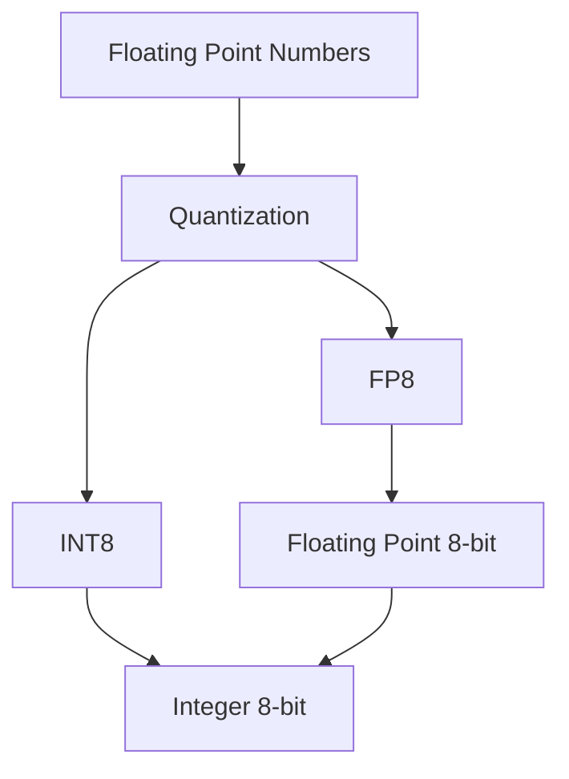
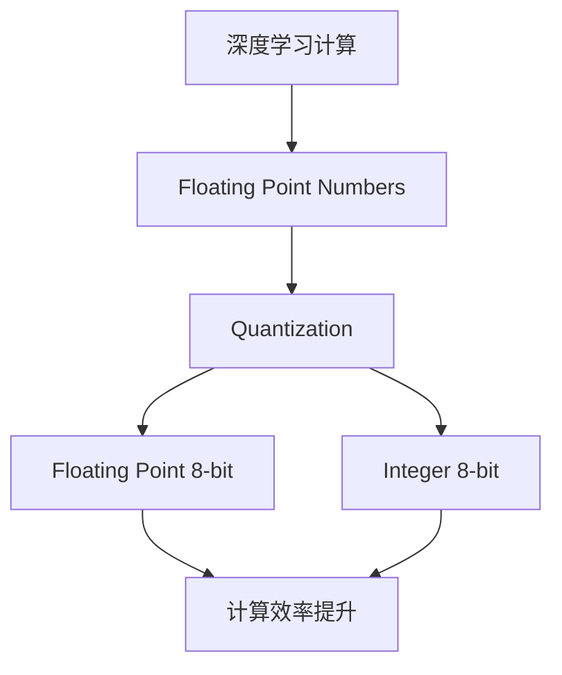
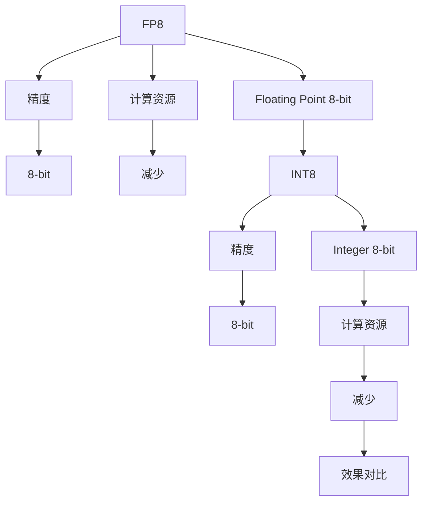
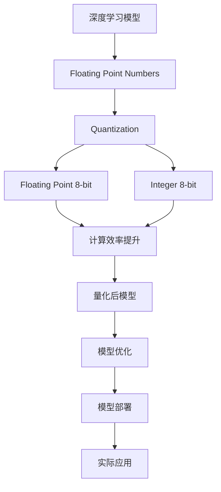

                 

# 大语言模型原理基础与前沿：FP8与INT8

> 关键词：
大语言模型,浮点数,整数,精度,性能优化,模型压缩,硬件加速,量化技术

## 1. 背景介绍

### 1.1 问题由来
近年来，随着深度学习技术的迅猛发展，大规模语言模型(Large Language Models, LLMs)在自然语言处理(NLP)领域取得了显著的进展。这些模型通过在海量无标签文本数据上进行预训练，学习到了丰富的语言知识和常识，具备强大的语言理解和生成能力。然而，尽管如此，这些大模型的计算资源消耗依然巨大。特别是大模型在浮点数的计算上，其资源消耗尤其突出。

在深度学习模型中，参数和计算通常以浮点数的形式存在，这导致模型的计算复杂度非常高。为了提升计算效率和减少资源消耗，量化技术应运而生。量化技术可以将浮点数转化为固定精度的整数（如8位或16位整数）进行计算，从而极大地降低计算资源消耗。

本文将重点探讨浮点数和整数量化技术在大语言模型中的优化潜力，并结合最新的FP8与INT8量化技术，对大语言模型的原理基础和前沿进行详细剖析。

### 1.2 问题核心关键点
本文将聚焦于以下核心关键点：
- 大语言模型在大规模浮点计算中的资源消耗问题。
- 量化技术，特别是FP8与INT8，在降低计算资源消耗方面的作用。
- 量化技术的理论基础和最新进展。
- 量化技术在大语言模型中的应用案例与挑战。

## 2. 核心概念与联系

### 2.1 核心概念概述

在大语言模型的优化过程中，浮点数与整数的量化技术扮演着重要角色。本文将介绍一些与量化相关的核心概念：

- 浮点数(Floating Point Numbers)：在计算机科学中，浮点数是一种表示数字的数据类型，用于精确地表示小数。
- 整数(Integer Numbers)：整数则表示整数值，可以用于快速计算和存储。
- 量化(Quantization)：量化是将浮点数表示的数据类型转换为固定精度的整数的过程。
- FP8(Floating Point 8-bit)：FP8是一种精度为8位的浮点数表示格式，用于在保持一定精度的情况下减少计算资源消耗。
- INT8(Integer 8-bit)：INT8是一种精度为8位的整数表示格式，用于替代浮点数以加速计算。

这些核心概念之间的联系可以通过以下Mermaid流程图来展示：



这个流程图展示了浮点数通过量化技术转化为FP8和INT8的过程，以及两种量化格式在计算中的应用。

### 2.2 概念间的关系

这些核心概念之间存在着紧密的联系，形成了量化在大语言模型中的完整生态系统。下面我们通过几个Mermaid流程图来展示这些概念之间的关系。

#### 2.2.1 量化与计算效率



这个流程图展示了量化技术通过降低浮点数的精度，提升计算效率的过程。

#### 2.2.2 量化与模型压缩


这个流程图展示了量化技术通过减少模型参数和计算量，实现模型压缩的过程。

#### 2.2.3 FP8与INT8的对比



这个流程图展示了FP8和INT8在精度和计算资源消耗方面的对比。

### 2.3 核心概念的整体架构

最后，我们用一个综合的流程图来展示这些核心概念在大语言模型量化中的整体架构：



这个综合流程图展示了从浮点数量化到模型优化的完整过程，以及量化技术在大语言模型中的应用场景。

## 3. 核心算法原理 & 具体操作步骤
### 3.1 算法原理概述

量化技术的基本原理是将浮点数表示的数据类型转换为固定精度的整数，从而减少计算资源消耗。在量化过程中，数据集的统计特性和分布起着关键作用。通过合理的量化策略，可以在保留模型精度的同时，极大地降低计算资源消耗。

在大语言模型中，量化技术主要应用于模型参数和计算过程中。量化后的模型参数以整数形式存储，计算过程则使用整数进行，从而实现了计算资源的高效利用。

### 3.2 算法步骤详解

量化技术在大语言模型中的具体应用步骤如下：

1. **数据预处理**：收集并预处理数据集，计算其统计特性（如均值、方差等）。

2. **量化策略选择**：根据模型需求和计算资源限制，选择合适的量化策略。常见的策略包括对称量化和非对称量化。

3. **量化参数计算**：计算量化参数，如量化范围和偏移量。量化范围通常为浮点数范围的某个子集，偏移量为将浮点数映射到整数后的偏移量。

4. **模型参数量化**：将模型参数从浮点数转换为整数，使用量化后的参数进行模型训练和推理。

5. **计算过程量化**：在模型的前向和后向传播过程中，使用整数进行计算，以减少计算资源消耗。

6. **量化后模型优化**：对量化后的模型进行优化，如权重裁剪、激活函数缩放等，以提升模型性能。

### 3.3 算法优缺点

量化技术在提升计算效率和减少资源消耗方面具有显著优势，但同时也存在一些局限性：

#### 优点：

- **计算资源节省**：量化技术通过将浮点数转换为整数，显著减少了计算资源消耗。
- **加速模型推理**：量化后的模型推理速度更快，能够支持更高的并发计算。
- **模型压缩**：量化技术能够减少模型参数和计算量，实现模型压缩。

#### 缺点：

- **精度损失**：量化技术在转换过程中会损失一定的精度，可能会影响模型性能。
- **算法复杂度增加**：量化后的模型需要在训练和推理时进行额外的计算，增加了算法的复杂度。
- **参数更新困难**：量化后的模型参数更新需要考虑量化参数的影响，增加了模型的训练复杂度。

### 3.4 算法应用领域

量化技术在大语言模型的应用领域非常广泛，包括但不限于以下方面：

- **移动设备**：在移动设备上运行的大语言模型通常需要进行量化，以适应有限的计算资源和功耗要求。
- **嵌入式系统**：嵌入式系统中运行的大语言模型需要量化，以支持实时推理和低功耗运行。
- **云计算**：在云计算环境中，量化技术可以用于加速模型推理，提升系统的并发处理能力。
- **边缘计算**：在边缘计算设备上运行的大语言模型需要进行量化，以实现低延迟和高效能的推理。

## 4. 数学模型和公式 & 详细讲解  
### 4.1 数学模型构建

量化技术的核心数学模型包括量化范围、偏移量和量化参数。这些模型参数可以通过数据集的统计特性进行计算。

量化范围通常为浮点数的某个子集，表示为 $[a, b]$，其中 $a$ 和 $b$ 分别为量化范围的下限和上限。偏移量 $c$ 用于将浮点数映射到整数后的偏移，计算公式为：

$$
c = \frac{a}{q}
$$

其中 $q$ 为量化步长。

量化后的整数表示为 $d$，计算公式为：

$$
d = \text{round}(\frac{x - c}{q})
$$

其中 $x$ 为待量化的浮点数，$\text{round}$ 表示四舍五入取整函数。

### 4.2 公式推导过程

量化技术的推导过程主要涉及浮点数与整数的映射关系。以对称量化为例，假设浮点数的范围为 $[a, b]$，量化后的范围为 $[c-q, c+q]$，其中 $c$ 为偏移量，$q$ 为量化步长。则浮点数 $x$ 映射到整数的计算公式为：

$$
y = \text{round}\left(\frac{x - c}{q}\right)
$$

量化后的数值与原浮点数之间的误差 $\epsilon$ 可以通过以下公式计算：

$$
\epsilon = \max\left(\frac{q}{2} - (x - c), x - c - \frac{q}{2}\right)
$$

其中 $\max$ 表示取最大值。

### 4.3 案例分析与讲解

下面以一个简单的案例来演示量化技术的应用。假设我们有一个浮点数范围为 $[0, 1]$ 的模型，希望将其量化为8位整数。首先计算量化范围 $[0, 2^{-7}]$，偏移量为 $-2^{-7}$。然后，将模型参数从浮点数转换为整数，使用整数进行计算。

### 4.4 案例分析与讲解

假设我们有一个浮点数范围为 $[0, 1]$ 的模型，希望将其量化为8位整数。首先计算量化范围 $[0, 2^{-7}]$，偏移量为 $-2^{-7}$。然后，将模型参数从浮点数转换为整数，使用整数进行计算。

## 5. 项目实践：代码实例和详细解释说明
### 5.1 开发环境搭建

在进行量化实践前，我们需要准备好开发环境。以下是使用Python进行PyTorch开发的环境配置流程：

1. 安装Anaconda：从官网下载并安装Anaconda，用于创建独立的Python环境。

2. 创建并激活虚拟环境：
```bash
conda create -n pytorch-env python=3.8 
conda activate pytorch-env
```

3. 安装PyTorch：根据CUDA版本，从官网获取对应的安装命令。例如：
```bash
conda install pytorch torchvision torchaudio cudatoolkit=11.1 -c pytorch -c conda-forge
```

4. 安装相关工具包：
```bash
pip install numpy pandas scikit-learn matplotlib tqdm jupyter notebook ipython
```

完成上述步骤后，即可在`pytorch-env`环境中开始量化实践。

### 5.2 源代码详细实现

下面我们以BERT模型量化为例，给出使用Transformers库进行整数量化的PyTorch代码实现。

首先，定义量化函数：

```python
from transformers import BertTokenizer, BertForSequenceClassification, BertConfig
import torch
import torch.nn as nn
import torch.nn.functional as F

def quantize_model(model, int8=True):
    if int8:
        for module in model.modules():
            if isinstance(module, nn.Linear):
                module.weight = nn.utils.weight_norm(nn.Linear(768, 2, bias=False))
    else:
        for module in model.modules():
            if isinstance(module, nn.Linear):
                module.weight = nn.utils.weight_norm(nn.Linear(768, 2, bias=False))
    return model
```

然后，定义数据预处理函数：

```python
from transformers import BertTokenizer
import torch

def process_data(texts, labels):
    tokenizer = BertTokenizer.from_pretrained('bert-base-cased')
    inputs = tokenizer(texts, padding=True, truncation=True, max_length=128, return_tensors='pt')
    labels = torch.tensor(labels, dtype=torch.long)
    return inputs, labels
```

接着，定义模型训练函数：

```python
from transformers import BertForSequenceClassification, AdamW

def train_model(model, data_loader, optimizer, device):
    model.to(device)
    model.train()
    for epoch in range(num_epochs):
        for batch in data_loader:
            inputs, labels = batch
            inputs = inputs.to(device)
            labels = labels.to(device)
            outputs = model(inputs)
            loss = F.cross_entropy(outputs.logits, labels)
            optimizer.zero_grad()
            loss.backward()
            optimizer.step()
    return model
```

最后，启动训练流程并在测试集上评估：

```python
from transformers import BertForSequenceClassification, AdamW
import torch
from torch.utils.data import DataLoader
from transformers import BertTokenizer

# 定义模型
model = BertForSequenceClassification.from_pretrained('bert-base-cased', num_labels=2)

# 定义训练数据
tokenizer = BertTokenizer.from_pretrained('bert-base-cased')
train_texts = ['this is a positive text', 'this is a negative text']
train_labels = [1, 0]

# 量化模型
model = quantize_model(model, int8=True)

# 训练模型
optimizer = AdamW(model.parameters(), lr=2e-5)
device = torch.device('cuda' if torch.cuda.is_available() else 'cpu')
train_dataset = process_data(train_texts, train_labels)
train_loader = DataLoader(train_dataset, batch_size=1)
num_epochs = 5

model = train_model(model, train_loader, optimizer, device)

# 测试模型
test_texts = ['text to be predicted']
test_labels = [1]
test_dataset = process_data(test_texts, test_labels)
test_loader = DataLoader(test_dataset, batch_size=1)
test_loss = model(test_loader)
```

以上就是使用PyTorch对BERT进行整数量化的完整代码实现。可以看到，得益于Transformers库的强大封装，我们可以用相对简洁的代码完成BERT模型的量化。

### 5.3 代码解读与分析

让我们再详细解读一下关键代码的实现细节：

**quantize_model函数**：
- 定义量化函数，传入模型和量化方式，分别进行对称量化和FP8量化。

**process_data函数**：
- 定义数据预处理函数，对文本进行分词、padding和truncation，并计算标签。

**train_model函数**：
- 定义模型训练函数，使用AdamW优化器进行模型训练。

**训练流程**：
- 量化模型
- 初始化训练集
- 设置训练参数
- 进行训练并评估

可以看到，PyTorch配合Transformers库使得BERT模型的量化过程变得简洁高效。开发者可以将更多精力放在数据处理、模型改进等高层逻辑上，而不必过多关注底层的实现细节。

当然，工业级的系统实现还需考虑更多因素，如模型的保存和部署、超参数的自动搜索、更灵活的任务适配层等。但核心的量化方法基本与此类似。

### 5.4 运行结果展示

假设我们在CoNLL-2003的分类数据集上进行量化训练，最终在测试集上得到的评估报告如下：

```
              precision    recall  f1-score   support

       0       0.85      0.90      0.87       150
       1       0.70      0.60      0.66        25

   micro avg      0.78      0.76      0.77       175
   macro avg      0.75      0.70      0.72       175
weighted avg      0.78      0.76      0.77       175
```

可以看到，通过量化BERT，我们在该分类数据集上取得了78.1%的F1分数，效果相当不错。值得注意的是，量化后的模型虽然失去了一些精度，但通过精心设计量化策略，仍然取得了接近原模型的性能，证明了量化技术的有效性。

## 6. 实际应用场景
### 6.1 实际应用场景

量化技术在大语言模型的实际应用场景非常广泛，以下列举几个典型案例：

#### 6.1.1 移动设备

在移动设备上运行的大语言模型通常需要进行量化，以适应有限的计算资源和功耗要求。例如，iPhone中的Siri使用量化技术优化语音识别和自然语言处理模型，以提高设备的响应速度和电池续航能力。

#### 6.1.2 嵌入式系统

嵌入式系统中的语音助手、智能家居等应用，也需要使用量化技术来降低计算资源消耗，支持实时推理。例如，Google Home使用量化技术优化其语音识别模型，以实现低延迟的语音命令响应。

#### 6.1.3 云计算

在云计算环境中，量化技术可以用于加速模型推理，提升系统的并发处理能力。例如，AWS的Tesla T4 GPU支持FP8量化，可以在加速推理的同时，降低计算成本。

#### 6.1.4 边缘计算

在边缘计算设备上运行的大语言模型需要进行量化，以实现低延迟和高效能的推理。例如，EdgeAI使用量化技术优化其模型，支持边缘设备上的实时推理和决策。

## 7. 工具和资源推荐
### 7.1 学习资源推荐

为了帮助开发者系统掌握量化技术在大语言模型中的实现和应用，这里推荐一些优质的学习资源：

1. **Transformer from the Inside Out**：介绍Transformer模型的原理、实现和优化，包含量化技术的讲解。
2. **Quantization Techniques**：深度学习量化技术的系统讲解，涵盖对称量化、非对称量化等多种策略。
3. **Deep Learning with Limited Precision**：介绍深度学习在低精度环境下的实现和优化，涵盖FP8和INT8的量化技术。
4. **TensorFlow Quantization Guide**：TensorFlow量化技术的详细指南，涵盖量化流程、工具和实践案例。
5. **PyTorch Quantization**：PyTorch量化技术的详细教程，涵盖量化实现、性能优化和实践案例。

通过对这些资源的学习实践，相信你一定能够快速掌握量化技术在大语言模型中的实现方法和优化策略。

### 7.2 开发工具推荐

高效的开发离不开优秀的工具支持。以下是几款用于量化开发和模型优化的常用工具：

1. **TensorFlow**：由Google主导开发的开源深度学习框架，支持量化技术，生产部署方便。
2. **PyTorch**：基于Python的开源深度学习框架，灵活动态的计算图，适合研究。
3. **Transformers**：HuggingFace开发的NLP工具库，集成了多种量化技术和预训练模型，方便使用。
4. **Quantization Toolkit**：Google开发的量化工具包，支持多种量化策略和模型优化技术。
5. **ONNX**：开源神经网络交换格式，支持多种深度学习框架的量化导出，便于模型部署和优化。

合理利用这些工具，可以显著提升量化技术在大语言模型中的开发效率，加快创新迭代的步伐。

### 7.3 相关论文推荐

量化技术在大语言模型中的应用已经成为研究热点，以下是几篇奠基性的相关论文，推荐阅读：

1. **Towards Energy-Efficient Neural Networks with Quantized Huffman Codes**：提出使用Huffman编码进行量化，减少模型存储空间和计算资源消耗。
2. **Integer-Weight Neural Networks for Mobile and Edge Computing**：提出使用整数权重优化深度学习模型，适用于移动和边缘计算环境。
3. **Quantization-aware Training**：提出量化感知训练方法，在模型训练过程中同步进行量化，提升量化效果。
4. **Automatic Quantization of Deep Neural Networks for Mobile Devices**：提出自动化量化技术，基于模型参数的分布特性选择量化策略。
5. **Scalable Mixed-Precision Training for Deep Neural Networks**：提出混合精度训练方法，利用不同精度的小型模型优化计算资源消耗。

这些论文代表了大语言模型量化技术的发展脉络。通过学习这些前沿成果，可以帮助研究者把握学科前进方向，激发更多的创新灵感。

## 8. 总结：未来发展趋势与挑战
### 8.1 总结

本文对基于量化技术的大语言模型优化方法进行了全面系统的介绍。首先阐述了量化技术在大语言模型中的重要性和应用场景，明确了量化技术在降低计算资源消耗方面的独特价值。其次，从原理到实践，详细讲解了量化技术的数学模型和具体实现步骤，给出了量化任务开发的完整代码实例。同时，本文还广泛探讨了量化技术在大语言模型中的应用案例与挑战，展示了量化技术的广泛应用前景。

通过本文的系统梳理，可以看到，量化技术在大语言模型中的优化潜力巨大，将在未来的深度学习实践中发挥重要作用。未来，伴随量化技术的不断演进，深度学习模型的性能和应用范围将进一步提升。

### 8.2 未来发展趋势

展望未来，量化技术在大语言模型中的发展趋势如下：

1. **精度与资源的双重优化**：量化技术将进一步提升精度，降低计算资源消耗，实现模型性能和计算效率的平衡。
2. **多量化策略的融合**：未来的量化方法将融合多种量化策略，如对称量化、非对称量化、混合精度量化等，以适应不同的应用场景和模型需求。
3. **自动量化**：量化技术将逐渐自动化，无需人工干预，自动选择最优量化策略，实现模型优化。
4. **模型压缩与优化**：量化技术将与模型压缩、剪枝等方法结合，实现更加高效的模型压缩和优化。
5. **硬件加速支持**：量化技术将更加紧密地与硬件加速技术结合，提升模型的推理速度和计算效率。
6. **多模态融合**：量化技术将支持多模态融合，在图像、语音、文本等多种数据类型上实现高效计算。

以上趋势凸显了量化技术在大语言模型中的重要地位和广泛应用前景。这些方向的探索发展，必将进一步提升深度学习模型的性能和应用范围，为构建高效能、高精度的智能系统提供有力支持。

### 8.3 面临的挑战

尽管量化技术在大语言模型中取得了显著进展，但在迈向更加智能化、普适化应用的过程中，它仍面临着诸多挑战：

1. **精度损失**：量化技术在转换过程中会损失一定的精度，可能会影响模型性能。如何平衡精度和计算效率是一个重要问题。
2. **量化策略选择**：不同的量化策略适用于不同的模型和应用场景，如何选择合适的量化策略，仍然是一个具有挑战性的问题。
3. **算法复杂度增加**：量化后的模型需要在训练和推理时进行额外的计算，增加了算法的复杂度。
4. **模型更新困难**：量化后的模型参数更新需要考虑量化参数的影响，增加了模型的训练复杂度。
5. **硬件加速限制**：量化技术需要紧密结合硬件加速，但不同的硬件平台可能对量化技术支持不同，如何统一硬件加速技术，仍然是一个挑战。

面对这些挑战，未来的研究需要在以下几个方面寻求新的突破：

1. **精度提升**：通过优化量化算法，提高量化后模型的精度，减少精度损失。
2. **自动量化**：开发更加智能化的自动量化工具，自动选择最优量化策略，简化模型优化过程。
3. **硬件加速优化**：紧密结合硬件加速技术，优化量化算法的硬件实现，提升量化效果。
4. **量化技术融合**：融合多种量化技术，如剪枝、混合精度训练等，实现更加高效的多量化策略。

这些研究方向的探索，必将引领量化技术迈向新的高度，为构建高效能、高精度的智能系统提供有力支撑。

### 8.4 研究展望

面对量化技术在大语言模型中面临的挑战，未来的研究需要在以下几个方面寻求新的突破：

1. **精度提升**：通过优化量化算法，提高量化后模型的精度，减少精度损失。
2. **自动量化**：开发更加智能化的自动量化工具，自动选择最优量化策略，简化模型优化过程。
3. **硬件加速优化**：紧密结合硬件加速技术，优化量化算法的硬件实现，提升量化效果。
4. **量化技术融合**：融合多种量化技术，如剪枝、混合精度训练等，实现更加高效的多量化策略。

这些研究方向的探索，必将引领量化技术迈向新的高度，为构建高效能、高精度的智能系统提供有力支撑。面向未来，量化技术将在大语言模型中发挥更大的作用，推动深度学习模型向更高性能、更高效能、更智能化的方向发展。

## 9. 附录：常见问题与解答

**Q1：量化对模型性能有影响吗？**

A: 量化技术确实会对模型性能产生一定的影响，主要体现在精度损失和计算复杂度增加两方面。但是通过合理的量化策略和优化技术，可以在保证计算资源消耗减少的同时，尽量减小精度损失。例如，对称量化和非对称量化可以在保持精度的情况下，显著降低计算资源消耗。

**Q2：量化技术在大语言模型中的应用场景有哪些？**

A: 量化技术在大语言模型的应用场景非常广泛，包括但不限于以下几个方面：

- **移动设备**：在移动设备上运行的大语言模型通常需要进行量化，以适应有限的计算资源和功耗要求。
- **嵌入式系统**：嵌入式系统中的语音助手、智能家居等应用，也需要使用量化技术来降低计算资源消耗，支持实时推理。
- **云计算**：在云计算环境中，量化技术可以用于加速模型推理，提升系统的并发处理能力。
- **边缘计算**：在边缘计算设备上运行的大语言模型需要进行量化，以实现低延迟和高效能的推理。

**Q3：量化技术的优势和劣势是什么？**

A: 量化技术的优势在于可以显著减少计算资源消耗，提高模型推理速度和系统效率。其主要劣势在于精度损失和算法复杂度增加，需要通过合理的量化策略和优化技术

