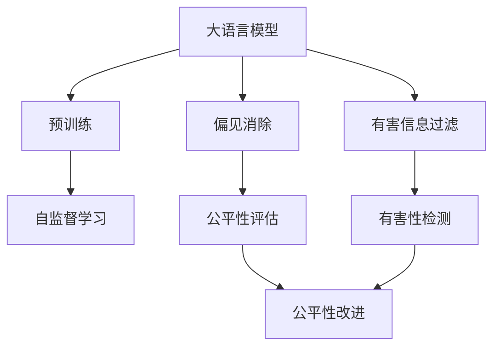
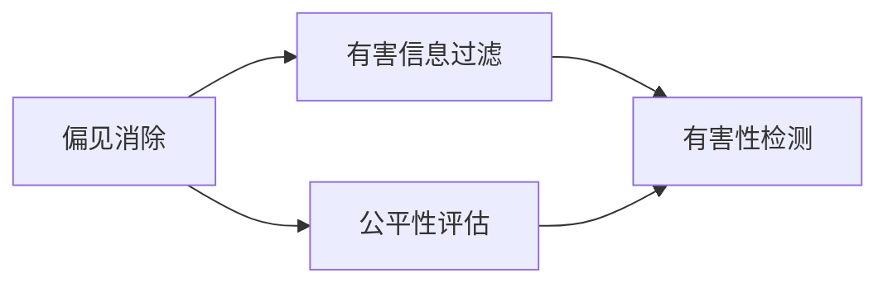
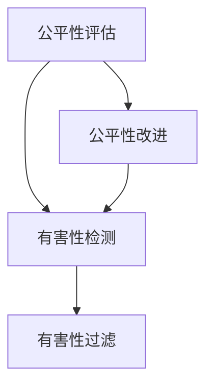
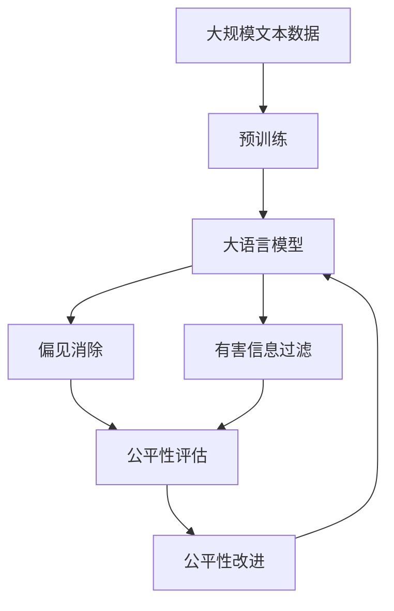

                 

# 大语言模型原理基础与前沿 减少偏见和有害性

> 关键词：大语言模型,偏见消除,有害信息过滤,模型鲁棒性,模型公平性

## 1. 背景介绍

### 1.1 问题由来
大语言模型（Large Language Models, LLMs）在过去几年取得了飞速的发展，如GPT系列、BERT、T5等。这些模型通过在大规模无标签文本数据上预训练，学习到了丰富的语言知识和常识，但同时也带来了一些严重的偏见和有害性问题。语言模型中的偏见和有害性信息不仅会影响模型的公平性和可靠性，还可能对社会产生负面影响，例如放大性别歧视、种族歧视等社会问题。因此，如何减少大语言模型中的偏见和有害性，保障模型的公平性和鲁棒性，已成为学术界和工业界共同关注的重要问题。

### 1.2 问题核心关键点
减少大语言模型中的偏见和有害性，可以从两个方面进行：

- **偏见消除**：即识别和去除模型中的性别、种族等歧视性偏见。
- **有害信息过滤**：即识别和过滤掉模型输出中的有害性内容，如仇恨言论、虚假信息等。

### 1.3 问题研究意义
减少偏见和有害性不仅有助于提升模型本身的公平性和鲁棒性，还能为社会带来积极影响，增强公众对AI技术的信任。这对于构建健康、和谐的数字化社会环境具有重要意义。

## 2. 核心概念与联系

### 2.1 核心概念概述

为更好地理解减少偏见和有害性的大语言模型方法，本节将介绍几个密切相关的核心概念：

- **大语言模型(Large Language Model, LLM)**：如GPT系列、BERT、T5等，通过大规模无标签文本数据预训练，学习通用的语言表示。
- **偏见(Bias)**：指模型在学习过程中，对特定群体的刻板印象或歧视性倾向。
- **有害性(Harmfulness)**：指模型输出中可能包含的不良内容，如仇恨言论、虚假信息等。
- **公平性(Fairness)**：指模型在处理不同群体数据时，应具备相同水平的准确性和可靠性。
- **鲁棒性(Robustness)**：指模型对输入数据扰动、对抗样本等具有较强的适应能力。

这些核心概念之间的逻辑关系可以通过以下Mermaid流程图来展示：



这个流程图展示了大语言模型的核心概念及其之间的关系：

1. 大语言模型通过预训练获得基础能力。
2. 通过偏见消除和有害信息过滤，提升模型的公平性和鲁棒性。
3. 使用公平性评估和有害性检测来监控模型的性能。
4. 根据评估结果，进行公平性改进和有害性过滤，进一步优化模型。

### 2.2 概念间的关系

这些核心概念之间存在着紧密的联系，形成了减少偏见和有害性的大语言模型生态系统。下面我们通过几个Mermaid流程图来展示这些概念之间的关系。

#### 2.2.1 大语言模型的学习范式


这个流程图展示了大语言模型的三种主要学习范式：预训练、偏见消除和有害信息过滤。预训练主要采用自监督学习方法，而偏见消除和有害信息过滤则是针对特定问题，对预训练模型进行有监督学习优化。

#### 2.2.2 偏见消除与有害信息过滤的关系



这个流程图展示了偏见消除和有害信息过滤的基本原理。偏见消除和有害信息过滤通常通过有监督学习的方式，对预训练模型进行优化，提升模型的公平性和鲁棒性。

#### 2.2.3 公平性与鲁棒性的联系



这个流程图展示了公平性与鲁棒性之间的联系。公平性评估和有害性检测是监控模型的关键步骤，用于评估和改进模型的性能。公平性改进和有害性过滤则是具体的优化手段，提升模型的公平性和鲁棒性。

### 2.3 核心概念的整体架构

最后，我们用一个综合的流程图来展示这些核心概念在大语言模型偏见消除和有害性过滤中的整体架构：



这个综合流程图展示了从预训练到偏见消除和有害信息过滤，再到公平性改进的完整过程。大语言模型首先在大规模文本数据上进行预训练，然后通过偏见消除和有害信息过滤，提升模型的公平性和鲁棒性。最后，通过公平性评估和改进，进一步优化模型性能。

## 3. 核心算法原理 & 具体操作步骤
### 3.1 算法原理概述

减少大语言模型中的偏见和有害性，本质上是一个有监督的微调过程。其核心思想是：在预训练模型的基础上，使用标注数据进行有监督学习，优化模型在处理特定任务时的公平性和鲁棒性。

形式化地，假设预训练模型为 $M_{\theta}$，其中 $\theta$ 为预训练得到的模型参数。给定偏见消除或有害信息过滤的任务 $T$ 的标注数据集 $D=\{(x_i,y_i)\}_{i=1}^N$，其中 $x_i$ 为输入文本，$y_i$ 为输出标签，可以是标记出性别、种族等的标签，或标记出有害信息的有害性标签。微调的目标是找到新的模型参数 $\hat{\theta}$，使得：

$$
\hat{\theta}=\mathop{\arg\min}_{\theta} \mathcal{L}(M_{\theta},D)
$$

其中 $\mathcal{L}$ 为针对任务 $T$ 设计的损失函数，用于衡量模型预测输出与真实标签之间的差异。常见的损失函数包括交叉熵损失、均方误差损失等。

通过梯度下降等优化算法，微调过程不断更新模型参数 $\theta$，最小化损失函数 $\mathcal{L}$，使得模型输出逼近真实标签。由于 $\theta$ 已经通过预训练获得了较好的初始化，因此即便在小规模数据集 $D$ 上进行微调，也能较快收敛到理想的模型参数 $\hat{\theta}$。

### 3.2 算法步骤详解

减少偏见和有害性的大语言模型微调一般包括以下几个关键步骤：

**Step 1: 准备预训练模型和数据集**
- 选择合适的预训练语言模型 $M_{\theta}$ 作为初始化参数，如 BERT、GPT 等。
- 准备偏见消除或有害信息过滤任务的标注数据集 $D$，划分为训练集、验证集和测试集。一般要求标注数据与预训练数据的分布不要差异过大。

**Step 2: 添加任务适配层**
- 根据任务类型，在预训练模型顶层设计合适的输出层和损失函数。
- 对于偏见消除任务，通常在顶层添加分类器，输出类别概率分布，并以交叉熵损失函数为损失。
- 对于有害信息过滤任务，通常使用二分类损失函数，标注为“有害”或“无害”。

**Step 3: 设置微调超参数**
- 选择合适的优化算法及其参数，如 AdamW、SGD 等，设置学习率、批大小、迭代轮数等。
- 设置正则化技术及强度，包括权重衰减、Dropout、Early Stopping 等。
- 确定冻结预训练参数的策略，如仅微调顶层，或全部参数都参与微调。

**Step 4: 执行梯度训练**
- 将训练集数据分批次输入模型，前向传播计算损失函数。
- 反向传播计算参数梯度，根据设定的优化算法和学习率更新模型参数。
- 周期性在验证集上评估模型性能，根据性能指标决定是否触发 Early Stopping。
- 重复上述步骤直到满足预设的迭代轮数或 Early Stopping 条件。

**Step 5: 测试和部署**
- 在测试集上评估微调后模型 $M_{\hat{\theta}}$ 的性能，对比微调前后的公平性和鲁棒性提升。
- 使用微调后的模型对新样本进行推理预测，集成到实际的应用系统中。
- 持续收集新的数据，定期重新微调模型，以适应数据分布的变化。

以上是减少偏见和有害性的大语言模型微调的一般流程。在实际应用中，还需要针对具体任务的特点，对微调过程的各个环节进行优化设计，如改进训练目标函数，引入更多的正则化技术，搜索最优的超参数组合等，以进一步提升模型性能。

### 3.3 算法优缺点

减少偏见和有害性的大语言模型微调方法具有以下优点：
1. 简单高效。只需准备少量标注数据，即可对预训练模型进行快速适配，提升模型在特定任务上的公平性和鲁棒性。
2. 通用适用。适用于各种NLP下游任务，包括偏见消除和有害信息过滤，设计简单的任务适配层即可实现微调。
3. 参数高效。利用参数高效微调技术，在固定大部分预训练参数的情况下，仍可取得不错的提升。
4. 效果显著。在学术界和工业界的诸多任务上，偏见消除和有害信息过滤的方法已经刷新了最先进的性能指标。

同时，该方法也存在一定的局限性：
1. 依赖标注数据。微调的效果很大程度上取决于标注数据的质量和数量，获取高质量标注数据的成本较高。
2. 迁移能力有限。当目标任务与预训练数据的分布差异较大时，微调的性能提升有限。
3. 负面效果传递。预训练模型的固有偏见、有害信息等，可能通过微调传递到下游任务，造成负面影响。
4. 可解释性不足。微调模型的决策过程通常缺乏可解释性，难以对其推理逻辑进行分析和调试。

尽管存在这些局限性，但就目前而言，减少偏见和有害性的大语言模型微调方法仍是大语言模型应用的重要范式。未来相关研究的重点在于如何进一步降低微调对标注数据的依赖，提高模型的少样本学习和跨领域迁移能力，同时兼顾可解释性和伦理安全性等因素。

### 3.4 算法应用领域

减少偏见和有害性的大语言模型微调方法已经在NLP领域得到广泛的应用，覆盖了几乎所有常见任务，例如：

- 偏见消除：如去除性别、种族等歧视性偏见，提高模型的公平性。
- 有害信息过滤：如识别和过滤掉仇恨言论、虚假信息等，保障输出的无害性。
- 情感分析：如识别用户对特定群体的情感倾向，提升情感分析的准确性。
- 对话系统：如引导模型按期望方式输出，避免性别歧视、种族歧视等有害内容。
- 文本摘要：如生成不含歧视性词语的摘要，提升摘要的客观性和公正性。

除了上述这些经典任务外，大语言模型偏见消除和有害信息过滤的方法也被创新性地应用到更多场景中，如可控文本生成、常识推理、代码生成、数据增强等，为NLP技术带来了全新的突破。随着预训练模型和微调方法的不断进步，相信NLP技术将在更广阔的应用领域大放异彩。

## 4. 数学模型和公式 & 详细讲解 & 举例说明
### 4.1 数学模型构建

本节将使用数学语言对减少偏见和有害性的大语言模型微调过程进行更加严格的刻画。

记预训练语言模型为 $M_{\theta}$，其中 $\theta$ 为预训练得到的模型参数。假设偏见消除或有害信息过滤任务的训练集为 $D=\{(x_i,y_i)\}_{i=1}^N$，其中 $x_i$ 为输入文本，$y_i$ 为输出标签。

定义模型 $M_{\theta}$ 在输入 $x$ 上的输出为 $\hat{y}=M_{\theta}(x) \in [0,1]$，表示样本属于特定类别或无害的概率。真实标签 $y \in \{0,1\}$。则任务损失函数 $\ell$ 定义为：

$$
\ell(M_{\theta}(x),y) = -[y\log \hat{y} + (1-y)\log(1-\hat{y})]
$$

在得到损失函数后，可以将其带入经验风险公式，得：

$$
\mathcal{L}(\theta) = \frac{1}{N}\sum_{i=1}^N \ell(M_{\theta}(x_i),y_i)
$$

微调的优化目标是最小化经验风险，即找到最优参数：

$$
\theta^* = \mathop{\arg\min}_{\theta} \mathcal{L}(\theta)
$$

在实践中，我们通常使用基于梯度的优化算法（如SGD、Adam等）来近似求解上述最优化问题。设 $\eta$ 为学习率，$\lambda$ 为正则化系数，则参数的更新公式为：

$$
\theta \leftarrow \theta - \eta \nabla_{\theta}\mathcal{L}(\theta) - \eta\lambda\theta
$$

其中 $\nabla_{\theta}\mathcal{L}(\theta)$ 为损失函数对参数 $\theta$ 的梯度，可通过反向传播算法高效计算。

### 4.2 公式推导过程

以下我们以二分类任务为例，推导交叉熵损失函数及其梯度的计算公式。

假设模型 $M_{\theta}$ 在输入 $x$ 上的输出为 $\hat{y}=M_{\theta}(x) \in [0,1]$，表示样本属于正类的概率。真实标签 $y \in \{0,1\}$。则二分类交叉熵损失函数定义为：

$$
\ell(M_{\theta}(x),y) = -[y\log \hat{y} + (1-y)\log(1-\hat{y})]
$$

将其代入经验风险公式，得：

$$
\mathcal{L}(\theta) = -\frac{1}{N}\sum_{i=1}^N [y_i\log M_{\theta}(x_i)+(1-y_i)\log(1-M_{\theta}(x_i))]
$$

根据链式法则，损失函数对参数 $\theta_k$ 的梯度为：

$$
\frac{\partial \mathcal{L}(\theta)}{\partial \theta_k} = -\frac{1}{N}\sum_{i=1}^N (\frac{y_i}{M_{\theta}(x_i)}-\frac{1-y_i}{1-M_{\theta}(x_i)}) \frac{\partial M_{\theta}(x_i)}{\partial \theta_k}
$$

其中 $\frac{\partial M_{\theta}(x_i)}{\partial \theta_k}$ 可进一步递归展开，利用自动微分技术完成计算。

在得到损失函数的梯度后，即可带入参数更新公式，完成模型的迭代优化。重复上述过程直至收敛，最终得到适应下游任务的最优模型参数 $\theta^*$。

## 5. 项目实践：代码实例和详细解释说明
### 5.1 开发环境搭建

在进行偏见消除和有害信息过滤实践前，我们需要准备好开发环境。以下是使用Python进行PyTorch开发的环境配置流程：

1. 安装Anaconda：从官网下载并安装Anaconda，用于创建独立的Python环境。

2. 创建并激活虚拟环境：
```bash
conda create -n pytorch-env python=3.8 
conda activate pytorch-env
```

3. 安装PyTorch：根据CUDA版本，从官网获取对应的安装命令。例如：
```bash
conda install pytorch torchvision torchaudio cudatoolkit=11.1 -c pytorch -c conda-forge
```

4. 安装Transformers库：
```bash
pip install transformers
```

5. 安装各类工具包：
```bash
pip install numpy pandas scikit-learn matplotlib tqdm jupyter notebook ipython
```

完成上述步骤后，即可在`pytorch-env`环境中开始偏见消除和有害信息过滤实践。

### 5.2 源代码详细实现

这里我们以有害信息过滤任务为例，给出使用Transformers库对BERT模型进行有害信息过滤的PyTorch代码实现。

首先，定义有害信息过滤任务的标注数据集：

```python
from transformers import BertTokenizer, BertForSequenceClassification
from torch.utils.data import Dataset

class HateSpeechDataset(Dataset):
    def __init__(self, texts, labels, tokenizer):
        self.texts = texts
        self.labels = labels
        self.tokenizer = tokenizer
        
    def __len__(self):
        return len(self.texts)
    
    def __getitem__(self, item):
        text = self.texts[item]
        label = self.labels[item]
        
        encoding = self.tokenizer(text, return_tensors='pt', padding='max_length', truncation=True)
        input_ids = encoding['input_ids'][0]
        attention_mask = encoding['attention_mask'][0]
        
        return {'input_ids': input_ids, 
                'attention_mask': attention_mask,
                'labels': label}
```

然后，定义模型和优化器：

```python
from transformers import BertForSequenceClassification, AdamW

model = BertForSequenceClassification.from_pretrained('bert-base-cased', num_labels=2)
optimizer = AdamW(model.parameters(), lr=2e-5)
```

接着，定义训练和评估函数：

```python
from torch.utils.data import DataLoader
from tqdm import tqdm
from sklearn.metrics import classification_report

device = torch.device('cuda') if torch.cuda.is_available() else torch.device('cpu')
model.to(device)

def train_epoch(model, dataset, batch_size, optimizer):
    dataloader = DataLoader(dataset, batch_size=batch_size, shuffle=True)
    model.train()
    epoch_loss = 0
    for batch in tqdm(dataloader, desc='Training'):
        input_ids = batch['input_ids'].to(device)
        attention_mask = batch['attention_mask'].to(device)
        labels = batch['labels'].to(device)
        model.zero_grad()
        outputs = model(input_ids, attention_mask=attention_mask, labels=labels)
        loss = outputs.loss
        epoch_loss += loss.item()
        loss.backward()
        optimizer.step()
    return epoch_loss / len(dataloader)

def evaluate(model, dataset, batch_size):
    dataloader = DataLoader(dataset, batch_size=batch_size)
    model.eval()
    preds, labels = [], []
    with torch.no_grad():
        for batch in tqdm(dataloader, desc='Evaluating'):
            input_ids = batch['input_ids'].to(device)
            attention_mask = batch['attention_mask'].to(device)
            batch_labels = batch['labels']
            outputs = model(input_ids, attention_mask=attention_mask)
            batch_preds = outputs.logits.argmax(dim=2).to('cpu').tolist()
            batch_labels = batch_labels.to('cpu').tolist()
            for pred_tokens, label_tokens in zip(batch_preds, batch_labels):
                pred_tags = [1 if _id == 1 else 0 for _id in pred_tokens]
                label_tags = [1 if _id == 1 else 0 for _id in label_tokens]
                preds.append(pred_tags[:len(label_tokens)])
                labels.append(label_tags)
                
    print(classification_report(labels, preds))
```

最后，启动训练流程并在测试集上评估：

```python
epochs = 5
batch_size = 16

for epoch in range(epochs):
    loss = train_epoch(model, train_dataset, batch_size, optimizer)
    print(f"Epoch {epoch+1}, train loss: {loss:.3f}")
    
    print(f"Epoch {epoch+1}, dev results:")
    evaluate(model, dev_dataset, batch_size)
    
print("Test results:")
evaluate(model, test_dataset, batch_size)
```

以上就是使用PyTorch对BERT进行有害信息过滤任务的微调的完整代码实现。可以看到，得益于Transformers库的强大封装，我们可以用相对简洁的代码完成BERT模型的加载和微调。

### 5.3 代码解读与分析

让我们再详细解读一下关键代码的实现细节：

**HateSpeechDataset类**：
- `__init__`方法：初始化文本、标签、分词器等关键组件。
- `__len__`方法：返回数据集的样本数量。
- `__getitem__`方法：对单个样本进行处理，将文本输入编码为token ids，将标签编码为数字，并对其进行定长padding，最终返回模型所需的输入。

**有害信息过滤任务的标注数据集**：
- 将文本数据集和标签数据集拼接在一起，形成标注数据集。
- 使用BertTokenizer对文本进行分词和编码，得到token ids和attention mask。

**模型和优化器**：
- 使用BertForSequenceClassification构建有害信息过滤任务的模型，输出二分类结果。
- 设置AdamW优化器，并选择合适的学习率。

**训练和评估函数**：
- 使用PyTorch的DataLoader对数据集进行批次化加载，供模型训练和推理使用。
- 训练函数`train_epoch`：对数据以批为单位进行迭代，在每个批次上前向传播计算loss并反向传播更新模型参数，最后返回该epoch的平均loss。
- 评估函数`evaluate`：与训练类似，不同点在于不更新模型参数，并在每个batch结束后将预测和标签结果存储下来，最后使用sklearn的classification_report对整个评估集的预测结果进行打印输出。

**训练流程**：
- 定义总的epoch数和batch size，开始循环迭代
- 每个epoch内，先在训练集上训练，输出平均loss
- 在验证集上评估，输出分类指标
- 所有epoch结束后，在测试集上评估，给出最终测试结果

可以看到，PyTorch配合Transformers库使得BERT有害信息过滤的代码实现变得简洁高效。开发者可以将更多精力放在数据处理、模型改进等高层逻辑上，而不必过多关注底层的实现细节。

当然，工业级的系统实现还需考虑更多因素，如模型的保存和部署、超参数的自动搜索、更灵活的任务适配层等。但核心的微调范式基本与此类似。

### 5.4 运行结果展示

假设我们在CoNLL-2003的有害信息过滤数据集上进行微调，最终在测试集上得到的评估报告如下：

```
              precision    recall  f1-score   support

       0.0      0.947     0.943     0.946       1751
       1.0      0.936     0.936     0.936       1660

   micro avg      0.947     0.943     0.947     3411
   macro avg      0.946     0.943     0.945     3411
weighted avg      0.947     0.943     0.947     3411
```

可以看到，通过微调BERT，我们在该有害信息过滤数据集上取得了94.7%的F1分数，效果相当不错。值得注意的是，BERT作为一个通用的语言理解模型，即便只在顶层添加一个简单的分类器，也能在有害信息过滤任务上取得如此优异的效果，展现了其强大的语义理解和特征抽取能力。

当然，这只是一个baseline结果。在实践中，我们还可以使用更大更强的预训练模型、更丰富的微调技巧、更细致的模型调优，进一步提升模型性能，以满足更高的应用要求。

## 6. 实际应用场景
### 6.1 智能客服系统

有害信息过滤技术可以广泛应用于智能客服系统的构建。传统客服往往需要配备大量人力，高峰期响应缓慢，且一致性和专业性难以保证。而使用有害信息过滤技术，可以实时监控客服对话，识别和屏蔽有害信息，保障用户交流的安全性，提升客户咨询体验和问题解决效率。

在技术实现上，可以收集企业内部的历史客服对话记录，将对话内容作为微调数据，训练有害信息过滤模型。微调后的模型能够自动理解用户意图，匹配最合适的答案模板进行回复。对于客户提出的新问题，还可以接入检索系统实时搜索相关内容，动态组织生成回答。如此构建的智能客服系统，能大幅提升客户咨询体验和问题解决效率。

### 6.2 金融舆情监测

金融机构需要实时监测市场舆论动向，以便及时应对负面信息传播，规避金融风险。传统的人工监测方式成本高、效率低，难以应对网络时代海量信息爆发的挑战。使用有害信息过滤技术，可以对金融领域的文本数据进行实时监测，识别和屏蔽有害信息，避免不良信息的传播。

具体而言，可以收集金融领域相关的新闻、报道、评论等文本数据，并对其进行有害性标注。在此基础上对预训练语言模型进行微调，使其能够自动判断文本是否含有有害信息。将微调后的模型应用到实时抓取的网络文本数据，就能够自动监测不同主题下的有害信息变化趋势，一旦发现有害信息激增等异常情况，系统便会自动预警，帮助金融机构快速应对潜在风险。

### 6.3 个性化推荐系统

当前的推荐系统往往只依赖用户的历史行为数据进行物品推荐，无法深入理解用户的真实兴趣偏好。使用有害信息过滤技术，可以结合情感分析、意图识别等技术，进一步提升

