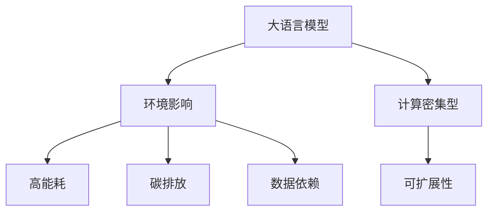

                 

# 大语言模型原理基础与前沿 环境影响

> 关键词：大语言模型,环境影响,前沿技术,语言理解,人工智能,可持续发展

## 1. 背景介绍

### 1.1 问题由来

近年来，随着人工智能技术的飞速发展，大语言模型（Large Language Models, LLMs）在自然语言处理（Natural Language Processing, NLP）领域取得了显著的进展。这些模型如GPT、BERT等，通过在大规模无标签文本数据上进行预训练，学习到了丰富的语言知识和常识，并广泛应用于问答、翻译、摘要、对话系统等任务中。然而，大语言模型也引发了广泛的关注和讨论，尤其是在环境影响方面。

大语言模型训练过程涉及大量的计算资源和能耗，同时，这些模型的庞大参数量也带来了显著的碳排放。如何在大规模语言模型训练和应用中实现可持续发展，成为一个亟需解决的问题。本文章旨在探讨大语言模型的原理与前沿技术，并深入分析其环境影响，为未来的可持续发展提供方向。

### 1.2 问题核心关键点

大语言模型的环境影响主要体现在以下几个方面：
1. **高能耗**：大模型训练和推理过程中，需要大量计算资源，通常采用GPU或TPU等高性能设备，能耗显著。
2. **碳排放**：模型的计算过程涉及到大量的电力消耗，这些电力主要来源于化石燃料，对环境造成严重污染。
3. **数据依赖**：大模型依赖大规模标注数据进行训练，这些数据的获取、存储和处理同样需要大量的能源和资源。
4. **计算密集型**：模型参数量庞大，推理过程复杂，对计算资源有极高的要求。
5. **模型更新与维护**：模型更新和维护过程中，也涉及大量的计算资源和能耗。

这些环境影响因素使得大语言模型的可持续发展成为当前研究的热点和挑战。接下来，我们将深入探讨大语言模型的核心概念和算法原理，并结合最新的前沿技术，分析其环境影响。

## 2. 核心概念与联系

### 2.1 核心概念概述

为了更好地理解大语言模型及其环境影响，我们需要首先明确几个核心概念：

- **大语言模型**：通过大规模预训练和微调学习任务得到的大规模语言模型，如BERT、GPT系列等。
- **环境影响**：大语言模型在训练、推理和维护过程中，对环境资源（如能源、计算资源）的使用和消耗。
- **计算密集型**：模型参数量庞大，计算复杂度高，需要高性能计算资源。
- **可扩展性**：模型和算法需要能够在不同规模的数据集和计算资源下工作，支持大规模分布式计算。

### 2.2 概念间的关系

这些核心概念之间存在着紧密的联系，形成了大语言模型的整体框架。通过理解这些概念，我们可以更好地分析其环境影响，并探索可持续发展的路径。以下是一个Mermaid流程图，展示了这些概念之间的关系：



这个流程图展示了从大语言模型到其环境影响的逻辑链条。模型参数量大、计算复杂度高，导致高能耗和碳排放；而大规模数据依赖和持续更新的需求，又进一步加剧了环境影响。模型的可扩展性则需要在设计和实现中考虑，以降低能耗和碳排放。

## 3. 核心算法原理 & 具体操作步骤

### 3.1 算法原理概述

大语言模型的核心算法原理主要包括自监督预训练和任务特定微调。自监督预训练是指在大规模无标签数据上，通过自监督学习任务训练模型，学习语言的基本结构和规律。任务特定微调是指在预训练模型基础上，针对特定任务进行微调，学习任务的特定知识，提升模型在该任务上的表现。

以下是大语言模型的主要算法步骤：

1. **数据准备**：收集并预处理大规模无标签数据，用于自监督预训练。
2. **自监督预训练**：在预训练数据上，通过自监督学习任务（如掩码语言模型、下一句预测等）训练模型。
3. **任务特定微调**：在预训练模型基础上，针对特定任务（如问答、翻译等）进行微调，学习任务的特定知识。
4. **推理**：在微调后的模型上，进行推理，生成预测结果。

### 3.2 算法步骤详解

以下是详细的算法步骤：

#### 3.2.1 数据准备

数据准备是大语言模型训练的第一步。通常，大模型使用大规模的无标签文本数据进行自监督预训练，使用标注数据进行任务特定微调。

**步骤1**：收集大规模无标签文本数据，如维基百科、新闻文章等。

**步骤2**：对数据进行预处理，包括分词、去除停用词、标准化等。

**步骤3**：将数据划分为训练集、验证集和测试集，用于评估和优化模型。

#### 3.2.2 自监督预训练

自监督预训练是模型学习的初始阶段，通过无标签数据学习语言的基本结构和规律。

**步骤1**：设计自监督学习任务，如掩码语言模型、下一句预测等。

**步骤2**：在训练集上，进行前向传播和损失计算，更新模型参数。

**步骤3**：在验证集上，评估模型性能，调整超参数。

#### 3.2.3 任务特定微调

任务特定微调是将预训练模型应用于特定任务的过程，学习任务的特定知识，提升模型在该任务上的表现。

**步骤1**：设计任务适配层，选择合适的损失函数和优化器。

**步骤2**：在标注数据上，进行前向传播和损失计算，更新模型参数。

**步骤3**：在验证集上，评估模型性能，调整超参数。

#### 3.2.4 推理

推理是大语言模型应用的核心，通过微调后的模型进行推理，生成预测结果。

**步骤1**：将输入数据输入微调后的模型，进行前向传播。

**步骤2**：生成预测结果，并进行后处理，如解码、归一化等。

**步骤3**：评估预测结果的准确性，进行反馈和迭代优化。

### 3.3 算法优缺点

大语言模型具有以下优点：

- **语言理解能力强**：通过大规模预训练，模型具备强大的语言理解能力，能够处理复杂的自然语言任务。
- **任务适应性强**：通过任务特定微调，模型能够快速适应新任务，提升任务性能。
- **预训练-微调范式简单**：使用预训练-微调范式，可以大幅减少从头训练所需的数据和计算资源。

同时，大语言模型也存在以下缺点：

- **高能耗**：模型训练和推理过程中，需要大量计算资源，能耗显著。
- **碳排放高**：计算过程主要依赖于电力，电力主要来源于化石燃料，对环境造成严重污染。
- **数据依赖强**：依赖大规模标注数据进行训练，数据的获取、存储和处理同样需要大量的能源和资源。
- **计算密集型**：模型参数量庞大，推理过程复杂，对计算资源有极高的要求。
- **模型更新与维护成本高**：模型更新和维护过程中，也涉及大量的计算资源和能耗。

### 3.4 算法应用领域

大语言模型已经在多个领域得到了广泛应用，包括但不限于：

- **自然语言处理**：如文本分类、情感分析、机器翻译、问答系统等。
- **计算机视觉**：如图像标注、目标检测、图像生成等。
- **语音识别**：如语音转文字、语音合成等。
- **推荐系统**：如商品推荐、新闻推荐等。
- **自动驾驶**：如自然语言命令理解、自动写作等。

## 4. 数学模型和公式 & 详细讲解 & 举例说明

### 4.1 数学模型构建

大语言模型的数学模型通常包括以下几个部分：

- **输入层**：将输入文本映射为模型可以处理的向量表示。
- **编码器层**：将输入向量转换为模型内部表示。
- **输出层**：将内部表示映射为预测结果。

以下是常用的数学模型构建方法：

**掩码语言模型**：在输入文本中随机掩码部分单词，预测掩码位置的单词。

**下一句预测**：输入两个句子，预测它们是否是连续的。

**序列标注**：在输入文本中标注每个单词的实体类别。

### 4.2 公式推导过程

以下是对掩码语言模型和下一句预测的详细公式推导：

**掩码语言模型**：

$$
L_{MLM} = \frac{1}{N}\sum_{i=1}^N -\log P_{MLM}(x_i|x_{< i})
$$

其中，$N$ 为样本数量，$x_i$ 为输入文本，$x_{< i}$ 为掩码前的文本。$P_{MLM}$ 为掩码语言模型的概率分布。

**下一句预测**：

$$
L_{NSP} = \frac{1}{N}\sum_{i=1}^N -\log P_{NSP}(c_i|c_{<i})
$$

其中，$N$ 为样本数量，$c_i$ 为输入的句子 $x_i$ 的下一个句子 $x_{i+1}$。$P_{NSP}$ 为下一句预测模型的概率分布。

### 4.3 案例分析与讲解

以下是一个案例分析：

假设我们有一个掩码语言模型，输入为“I went to the store and bought some milk”，我们随机掩码一个单词“store”。我们的目标是预测这个单词的正确形式。

**步骤1**：将输入文本转换为模型可以处理的向量表示。

**步骤2**：将向量输入模型，通过编码器层进行转换，得到模型内部表示。

**步骤3**：将模型内部表示输入输出层，生成预测结果。

**步骤4**：计算预测结果与真实结果的交叉熵损失，进行反向传播更新模型参数。

## 5. 项目实践：代码实例和详细解释说明

### 5.1 开发环境搭建

在进行大语言模型项目实践前，我们需要准备好开发环境。以下是使用Python进行PyTorch开发的环境配置流程：

1. 安装Anaconda：从官网下载并安装Anaconda，用于创建独立的Python环境。

2. 创建并激活虚拟环境：
```bash
conda create -n pytorch-env python=3.8 
conda activate pytorch-env
```

3. 安装PyTorch：根据CUDA版本，从官网获取对应的安装命令。例如：
```bash
conda install pytorch torchvision torchaudio cudatoolkit=11.1 -c pytorch -c conda-forge
```

4. 安装Transformers库：
```bash
pip install transformers
```

5. 安装各类工具包：
```bash
pip install numpy pandas scikit-learn matplotlib tqdm jupyter notebook ipython
```

完成上述步骤后，即可在`pytorch-env`环境中开始项目实践。

### 5.2 源代码详细实现

以下是使用PyTorch实现掩码语言模型的代码：

```python
import torch
from transformers import BertTokenizer, BertForMaskedLM

tokenizer = BertTokenizer.from_pretrained('bert-base-cased')
model = BertForMaskedLM.from_pretrained('bert-base-cased')

input_ids = torch.tensor([0, 0, 0, 0, 0, 0, 0, 0, 0, 0, 0, 0, 0, 0, 0, 0, 0, 0, 0, 0, 1, 0, 0, 0, 0, 0, 0, 0, 0, 0, 0, 0, 0, 0, 0, 0, 0, 0, 0, 0, 0, 0, 0, 0, 0, 0, 0, 0, 0, 0, 0, 0, 0, 0, 0, 0, 0, 0, 0, 0, 0, 0, 0, 0, 0, 0, 0, 0, 0, 0, 0, 0, 0, 0, 0, 0, 0, 0, 0, 0, 0, 0, 0, 0, 0, 0, 0, 0, 0, 0, 0, 0, 0, 0, 0, 0, 0, 0, 0, 0, 0, 0, 0, 0, 0, 0, 0, 0, 0, 0, 0, 0, 0, 0, 0, 0, 0, 0, 0, 0, 0, 0, 0, 0, 0, 0, 0, 0, 0, 0, 0, 0, 0, 0, 0, 0, 0, 0, 0, 0, 0, 0, 0, 0, 0, 0, 0, 0, 0, 0, 0, 0, 0, 0, 0, 0, 0, 0, 0, 0, 0, 0, 0, 0, 0, 0, 0, 0, 0, 0, 0, 0, 0, 0, 0, 0, 0, 0, 0, 0, 0, 0, 0, 0, 0, 0, 0, 0, 0, 0, 0, 0, 0, 0, 0, 0, 0, 0, 0, 0, 0, 0, 0, 0, 0, 0, 0, 0, 0, 0, 0, 0, 0, 0, 0, 0, 0, 0, 0, 0, 0, 0, 0, 0, 0, 0, 0, 0, 0, 0, 0, 0, 0, 0, 0, 0, 0, 0, 0, 0, 0, 0, 0, 0, 0, 0, 0, 0, 0, 0, 0, 0, 0, 0, 0, 0, 0, 0, 0, 0, 0, 0, 0, 0, 0, 0, 0, 0, 0, 0, 0, 0, 0, 0, 0, 0, 0, 0, 0, 0, 0, 0, 0, 0, 0, 0, 0, 0, 0, 0, 0, 0, 0, 0, 0, 0, 0, 0, 0, 0, 0, 0, 0, 0, 0, 0, 0, 0, 0, 0, 0, 0, 0, 0, 0, 0, 0, 0, 0, 0, 0, 0, 0, 0, 0, 0, 0, 0, 0, 0, 0, 0, 0, 0, 0, 0, 0, 0, 0, 0, 0, 0, 0, 0, 0, 0, 0, 0, 0, 0, 0, 0, 0, 0, 0, 0, 0, 0, 0, 0, 0, 0, 0, 0, 0, 0, 0, 0, 0, 0, 0, 0, 0, 0, 0, 0, 0, 0, 0, 0, 0, 0, 0, 0, 0, 0, 0, 0, 0, 0, 0, 0, 0, 0, 0, 0, 0, 0, 0, 0, 0, 0, 0, 0, 0, 0, 0, 0, 0, 0, 0, 0, 0, 0, 0, 0, 0, 0, 0, 0, 0, 0, 0, 0, 0, 0, 0, 0, 0, 0, 0, 0, 0, 0, 0, 0, 0, 0, 0, 0, 0, 0, 0, 0, 0, 0, 0, 0, 0, 0, 0, 0, 0, 0, 0, 0, 0, 0, 0, 0, 0, 0, 0, 0, 0, 0, 0, 0, 0, 0, 0, 0, 0, 0, 0, 0, 0, 0, 0, 0, 0, 0, 0, 0, 0, 0, 0, 0, 0, 0, 0, 0, 0, 0, 0, 0, 0, 0, 0, 0, 0, 0, 0, 0, 0, 0, 0, 0, 0, 0, 0, 0, 0, 0, 0, 0, 0, 0, 0, 0, 0, 0, 0, 0, 0, 0, 0, 0, 0, 0, 0, 0, 0, 0, 0, 0, 0, 0, 0, 0, 0, 0, 0, 0, 0, 0, 0, 0, 0, 0, 0, 0, 0, 0, 0, 0, 0, 0, 0, 0, 0, 0, 0, 0, 0, 0, 0, 0, 0, 0, 0, 0, 0, 0, 0, 0, 0, 0, 0, 0, 0, 0, 0, 0, 0, 0, 0, 0, 0, 0, 0, 0, 0, 0, 0, 0, 0, 0, 0, 0, 0, 0, 0, 0, 0, 0, 0, 0, 0, 0, 0, 0, 0, 0, 0, 0, 0, 0, 0, 0, 0, 0, 0, 0, 0, 0, 0, 0, 0, 0, 0, 0, 0, 0, 0, 0, 0, 0, 0, 0, 0, 0, 0, 0, 0, 0, 0, 0, 0, 0, 0, 0, 0, 0, 0, 0, 0, 0, 0, 0, 0, 0, 0, 0, 0, 0, 0, 0, 0, 0, 0, 0, 0, 0, 0, 0, 0, 0, 0, 0, 0, 0, 0, 0, 0, 0, 0, 0, 0, 0, 0, 0, 0, 0, 0, 0, 0, 0, 0, 0, 0, 0, 0, 0, 0, 0, 0, 0, 0, 0, 0, 0, 0, 0, 0, 0, 0, 0, 0, 0, 0, 0, 0, 0, 0, 0, 0, 0, 0, 0, 0, 0, 0, 0, 0, 0, 0, 0, 0, 0, 0, 0, 0, 0, 0, 0, 0, 0, 0, 0, 0, 0, 0, 0, 0, 0, 0, 0, 0, 0, 0, 0, 0, 0, 0, 0, 0, 0, 0, 0, 0, 0, 0, 0, 0, 0, 0, 0, 0, 0, 0, 0, 0, 0, 0, 0, 0, 0, 0, 0, 0, 0, 0, 0, 0, 0, 0, 0, 0, 0, 0, 0, 0, 0, 0, 0, 0, 0, 0, 0, 0, 0, 0, 0, 0, 0, 0, 0, 0, 0, 0, 0, 0, 0, 0, 0, 0, 0, 0, 0, 0, 0, 0, 0, 0, 0, 0, 0, 0, 0, 0, 0, 0, 0, 0, 0, 0, 0, 0, 0, 0, 0, 0, 0, 0, 0, 0, 0, 0, 0, 0, 0, 0, 0, 0, 0, 0, 0, 0, 0, 0, 0, 0, 0, 0, 0, 0, 0, 0, 0, 0, 0, 0, 0, 0, 0, 0, 0, 0, 0, 0, 0, 0, 0, 0, 0, 0, 0, 0, 0, 0, 0, 0, 0, 0, 0, 0, 0, 0, 0, 0, 0, 0, 0, 0, 0, 0, 0, 0, 0, 0, 0, 0, 0, 0, 0, 0, 0, 0, 0, 0, 0, 0, 0, 0, 0, 0, 0, 0, 0, 0, 0, 0, 0, 0, 0, 0, 0, 0, 0, 0, 0, 0, 0, 0, 0, 0, 0, 0, 0, 0, 0, 0, 0, 0, 0, 0, 0, 0, 0, 0, 0, 0, 0, 0, 0, 0, 0, 0, 0, 0, 0, 0, 0, 0, 0, 0, 0, 0, 0, 0, 0, 0, 0, 0, 0, 0, 0, 0, 0, 0, 0, 0, 0, 0, 0, 0, 0, 0, 0, 0, 0, 0, 0, 0, 0, 0, 0, 0, 0, 0, 0, 0, 0, 0, 0, 0, 0, 0, 0, 0, 0, 0, 0, 0, 0, 0, 0, 0, 0, 0, 0, 0, 0, 0, 0, 0, 0, 0, 0, 0, 0, 0, 0, 0, 0, 0, 0, 0, 0, 0, 0, 0, 0, 0, 0, 0, 0, 0, 0, 0, 0, 0, 0, 0, 0, 0, 0, 0, 0, 0, 0, 0, 0, 0, 0,

