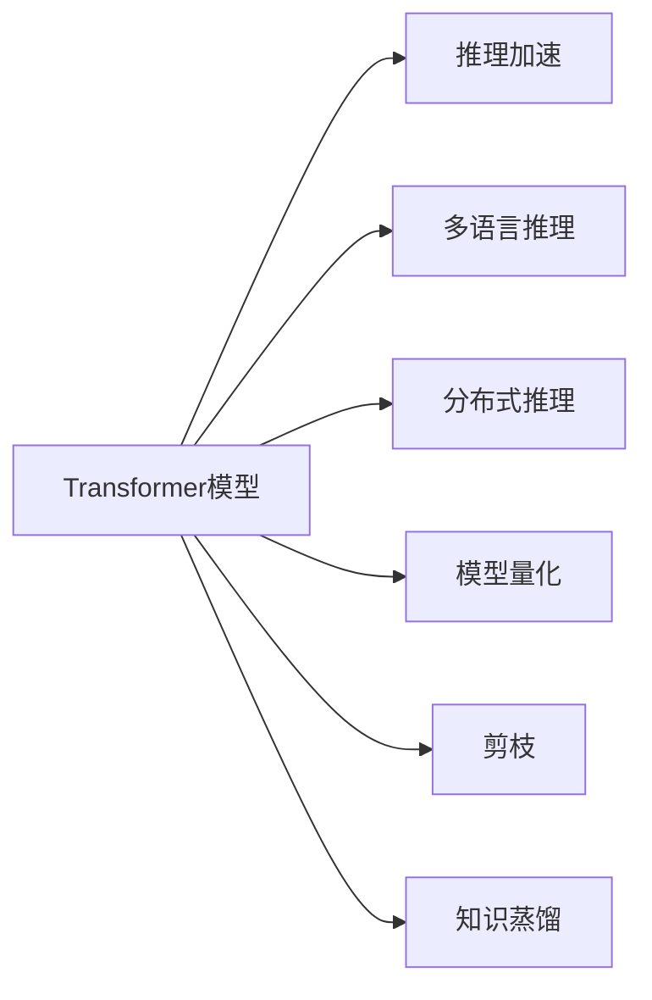
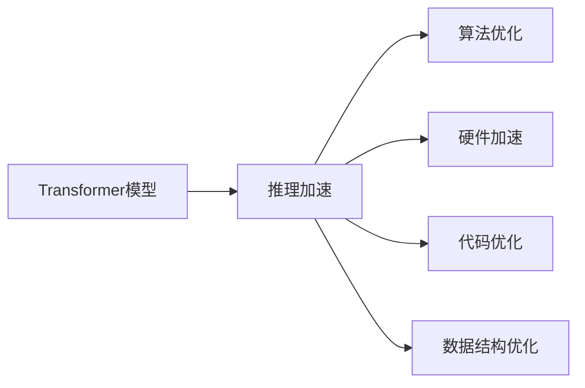
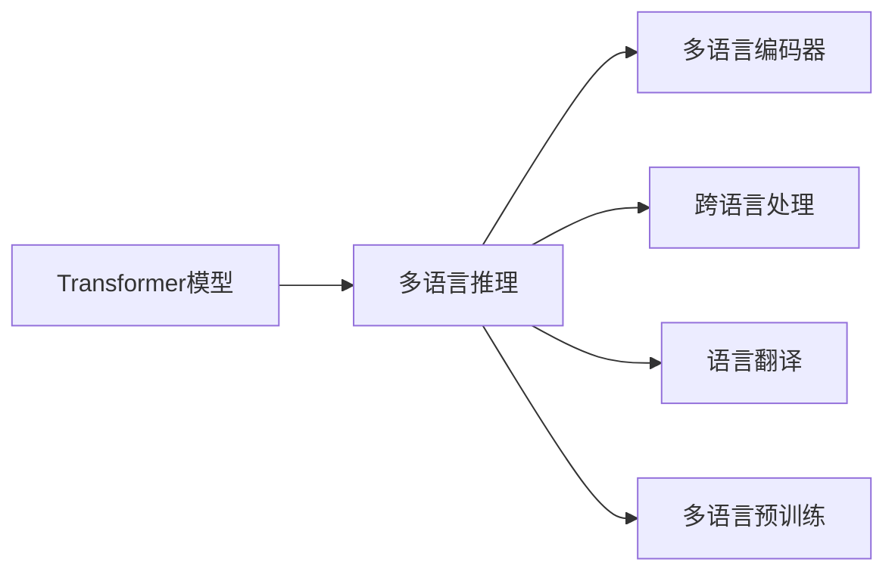
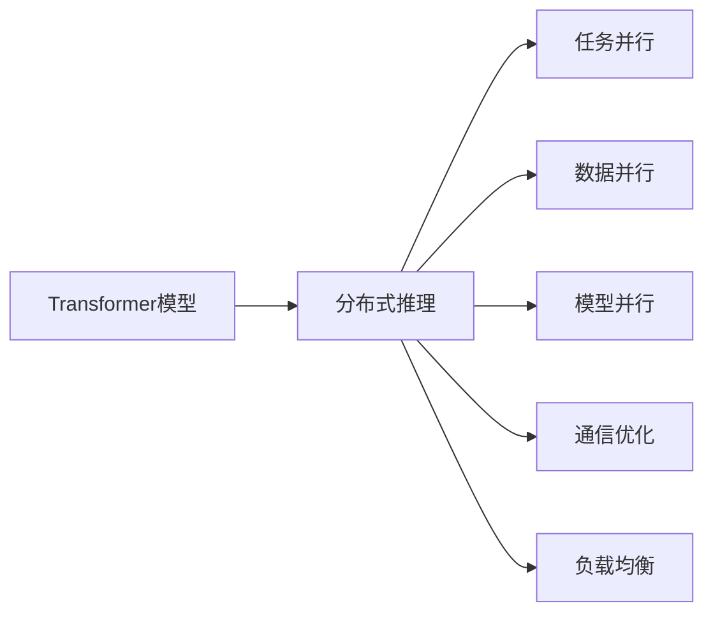
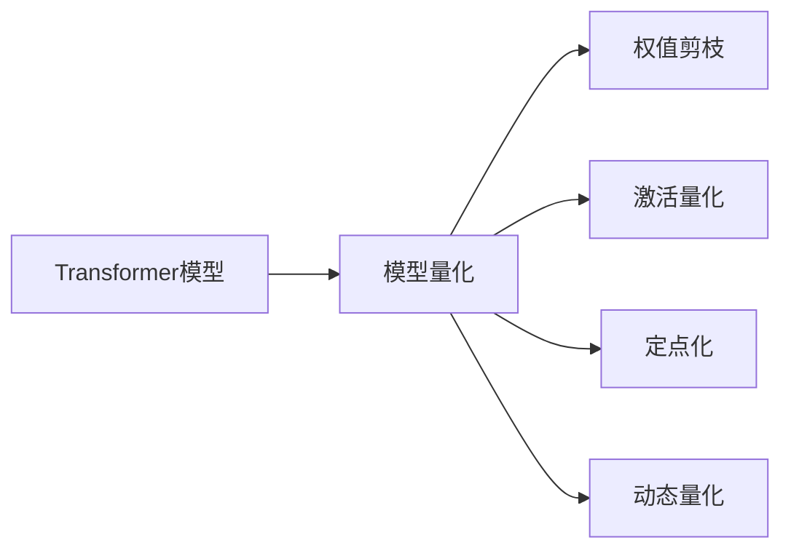

                 

# 大语言模型原理基础与前沿 高效扩展Transformer推理

> 关键词：大语言模型, 高效扩展, Transformer, 推理加速, 多语言支持, 分布式推理, 模型量化

## 1. 背景介绍

### 1.1 问题由来
随着深度学习技术的快速发展，大规模语言模型在大规模文本数据上进行预训练，学习到丰富的语言知识和常识，成为自然语言处理(NLP)领域的重要突破。以Transformer为代表的大语言模型具有很强的语言理解和生成能力，广泛应用于机器翻译、文本摘要、问答系统等众多领域。然而，在大规模应用中，Transformer模型的推理速度和资源占用仍是关键挑战，尤其在移动端、嵌入式等硬件资源有限的场景中，这个问题更加突出。

### 1.2 问题核心关键点
本文聚焦于Transformer推理加速方法，主要解决以下核心问题：
1. **高效推理**：如何在保证模型性能的前提下，大幅提升推理速度和降低资源占用。
2. **多语言支持**：如何在单个模型中支持多种语言的推理。
3. **分布式推理**：如何在大规模分布式系统中进行高效的推理计算。
4. **模型量化**：如何将浮点模型转化为定点模型，提高模型运行效率和资源利用率。

### 1.3 问题研究意义
研究Transformer推理加速方法，对于推动大语言模型的广泛应用，降低推理成本，提高系统性能具有重要意义：
1. **降低资源开销**：通过高效扩展，减少推理过程中的资源占用，提高算力利用效率。
2. **提升推理速度**：加快推理速度，适应高并发、实时性要求高的场景。
3. **支持多语言**：实现多语言共存的推理功能，简化语言模型训练和部署。
4. **提升系统可靠性**：通过分布式推理和模型量化，增强系统容错能力和稳定性。
5. **推动产业应用**：加速大语言模型在各个垂直行业的落地，提升商业价值和用户体验。

## 2. 核心概念与联系

### 2.1 核心概念概述

为更好地理解Transformer推理加速方法，本节将介绍几个密切相关的核心概念：

- **Transformer模型**：基于自注意力机制的深度神经网络模型，广泛应用于NLP任务。Transformer由编码器和解码器两部分组成，能够有效处理长距离依赖。

- **推理加速**：通过优化算法和数据结构，提升模型推理速度，降低计算和内存开销，提高系统性能。

- **多语言推理**：支持多种语言的无缝推理，利用多语言编码器实现高效的跨语言处理。

- **分布式推理**：在多台计算设备上并行执行推理计算，提高计算效率和系统可扩展性。

- **模型量化**：将浮点模型转化为定点模型，减少内存占用和计算复杂度，提高推理速度。

- **剪枝和蒸馏**：通过剪枝、知识蒸馏等技术，减少模型参数和计算量，提升推理效率。

这些核心概念之间的逻辑关系可以通过以下Mermaid流程图来展示：



这个流程图展示了大语言模型的关键组件及其与推理加速方法之间的关系：

1. 通过推理加速方法，可以提升Transformer模型的推理效率。
2. 多语言推理扩展了模型支持的语种范围，提高了模型的通用性。
3. 分布式推理扩大了模型计算规模，适应大规模应用场景。
4. 模型量化降低了模型存储和计算开销，提高了资源利用率。
5. 剪枝和蒸馏通过减少模型复杂度，进一步优化推理性能。

### 2.2 概念间的关系

这些核心概念之间存在着紧密的联系，形成了Transformer推理加速的完整生态系统。下面我们通过几个Mermaid流程图来展示这些概念之间的关系。

#### 2.2.1 推理加速方法与Transformer模型的关系



这个流程图展示了推理加速方法对Transformer模型的提升过程，包括算法、硬件、代码和数据结构等多方面的优化。

#### 2.2.2 多语言推理与Transformer模型的关系



这个流程图展示了多语言推理的实现过程，包括多语言编码器、跨语言处理、语言翻译和多语言预训练等技术。

#### 2.2.3 分布式推理与Transformer模型的关系



这个流程图展示了分布式推理的计算过程，包括任务并行、数据并行、模型并行、通信优化和负载均衡等技术。

#### 2.2.4 模型量化与Transformer模型的关系



这个流程图展示了模型量化的过程，包括权值剪枝、激活量化、定点化和动态量化等技术。

## 3. 核心算法原理 & 具体操作步骤

### 3.1 算法原理概述

Transformer推理加速方法的核心思想是通过优化算法和数据结构，提升模型推理速度，降低资源占用。其基本原理可以概括为以下几个步骤：

1. **算法优化**：选择合适的推理算法，如矩阵乘法、FFT、Swin Transformer等，优化推理过程中的计算复杂度。
2. **硬件加速**：利用GPU、TPU等硬件设备，提高计算速度和并行度。
3. **代码优化**：通过手写代码或使用自动微调技术，减少计算图构建和优化开销。
4. **数据结构优化**：利用稀疏矩阵、张量板块等数据结构，减少内存占用和计算量。

### 3.2 算法步骤详解

#### 3.2.1 算法优化

Transformer模型的推理过程主要涉及矩阵乘法、FFT、Swin Transformer等算法。

- **矩阵乘法优化**：利用矩阵分块、矩阵重组等技术，减少矩阵乘法的计算复杂度。具体来说，可以将大矩阵分解为小矩阵，并利用矩阵并行和分块加速计算。例如，在大规模矩阵乘法中，可以使用Tiling算法和Strassen算法，提高计算效率。

- **FFT优化**：利用快速傅里叶变换（FFT），加速DFT和DFT的逆变换。在Transformer模型中，FFT可以应用于卷积操作和谱域滤波等过程中，提高计算效率。

- **Swin Transformer优化**：Swin Transformer是一种基于局部感知窗口的Transformer变体，适用于处理大规模图像等高维数据。通过划分局部感知窗口，减少计算量和内存占用。

#### 3.2.2 硬件加速

硬件加速是提升推理速度的重要手段。以下是一些常见的硬件加速方法：

- **GPU加速**：使用NVIDIA的CUDA平台，利用GPU的并行计算能力，加速模型推理。
- **TPU加速**：使用Google的TPU平台，利用专用硬件加速模型计算。TPU具有更高的并行度和计算效率。
- **FPGA加速**：利用可编程逻辑门阵列（FPGA），实现自定义加速逻辑，提高计算速度。

#### 3.2.3 代码优化

代码优化是减少推理开销的重要手段。以下是一些常见的代码优化方法：

- **手写代码**：手写低级代码，减少高层次计算图构建和优化开销。例如，可以使用C++或CUDA编写计算核心，提高计算效率。
- **自动微调**：利用自动微调技术，优化计算图构建和优化过程。例如，可以使用TensorRT或ONNX Runtime进行推理优化，提高计算效率和资源利用率。

#### 3.2.4 数据结构优化

数据结构优化是减少内存占用和计算量的重要手段。以下是一些常见的数据结构优化方法：

- **稀疏矩阵**：利用稀疏矩阵存储数据，减少内存占用和计算复杂度。例如，可以使用CSR（Compressed Sparse Row）格式存储稀疏矩阵，提高计算效率。
- **张量板块**：利用张量板块技术，将高维张量分割为小矩阵，减少内存占用和计算量。例如，可以将大张量分割为多个小张量，并利用块并行加速计算。

### 3.3 算法优缺点

Transformer推理加速方法具有以下优点：

- **提升推理速度**：通过算法优化、硬件加速、代码优化和数据结构优化等手段，大幅提升模型的推理速度，适应高并发、实时性要求高的场景。
- **降低资源开销**：通过优化算法和数据结构，减少内存占用和计算复杂度，提高资源利用效率。
- **支持多语言**：通过多语言编码器等技术，实现多种语言的推理，简化语言模型的训练和部署。

同时，这些方法也存在一些缺点：

- **复杂度增加**：算法优化、硬件加速和代码优化等手段，需要增加复杂度，增加开发和维护成本。
- **性能不确定**：优化方法和硬件设备的选择对性能影响较大，需要不断试验和调整。
- **可移植性差**：某些优化方法依赖于特定的硬件平台，跨平台性能可能较差。

### 3.4 算法应用领域

Transformer推理加速方法在NLP、计算机视觉、语音识别等多个领域都有广泛应用。以下是几个典型应用场景：

- **机器翻译**：利用Transformer模型进行多语言翻译，通过推理加速技术，提升翻译速度和准确率。
- **文本摘要**：利用Transformer模型进行文本摘要生成，通过推理加速技术，提高摘要生成的速度和质量。
- **问答系统**：利用Transformer模型进行问答系统构建，通过推理加速技术，提高问答响应的速度和准确性。
- **图像识别**：利用Swin Transformer等优化方法，提升图像识别的速度和准确率。

## 4. 数学模型和公式 & 详细讲解 & 举例说明

### 4.1 数学模型构建

Transformer模型的核心计算过程包括编码器-解码器（Encoder-Decoder）结构。其数学模型可以表示为：

$$
\mathbf{y} = \mathbf{S} \cdot \mathbf{X}
$$

其中，$\mathbf{y}$表示模型输出，$\mathbf{X}$表示输入序列，$\mathbf{S}$表示自注意力权重矩阵。自注意力机制可以表示为：

$$
\mathbf{S} = \text{softmax}(\mathbf{Q} \cdot \mathbf{K}^T)
$$

其中，$\mathbf{Q}$表示查询矩阵，$\mathbf{K}$表示键矩阵。自注意力机制的计算复杂度为$O(n^2)$，随着输入序列长度$n$的增加，计算开销呈指数级增长。

### 4.2 公式推导过程

为了降低自注意力机制的计算复杂度，Swin Transformer等优化方法引入了局部感知窗口。假设输入序列长度为$n$，将序列分成$b$个窗口，每个窗口长度为$w$。则自注意力机制可以表示为：

$$
\mathbf{S} = \sum_{i=1}^{b} \text{softmax}(\mathbf{Q}^i \cdot \mathbf{K}^{i,T})
$$

其中，$\mathbf{Q}^i$表示窗口$i$的查询矩阵，$\mathbf{K}^{i,T}$表示窗口$i$的键矩阵。

假设每个窗口包含$m$个元素，则自注意力机制的计算复杂度为$O(m^2)$，显著低于$O(n^2)$。此外，局部感知窗口还可以降低内存占用和计算开销，提高推理效率。

### 4.3 案例分析与讲解

下面以机器翻译为例，展示Transformer推理加速方法的应用。假设输入序列为$X=[x_1, x_2, ..., x_n]$，输出序列为$Y=[y_1, y_2, ..., y_n]$。Transformer模型的推理过程可以表示为：

1. **编码器**：将输入序列$X$编码为隐状态$\mathbf{h}$。
2. **解码器**：将隐状态$\mathbf{h}$解码为输出序列$Y$。

具体来说，Transformer模型的推理过程包括以下步骤：

1. **输入编码**：将输入序列$X$转换为隐状态$\mathbf{h}$。
2. **输出解码**：将隐状态$\mathbf{h}$解码为输出序列$Y$。

推理过程中，自注意力机制的计算复杂度为$O(n^2)$，随着输入序列长度$n$的增加，计算开销呈指数级增长。为了降低计算复杂度，可以引入局部感知窗口，将输入序列分成多个窗口，每个窗口长度为$w$。假设输入序列长度为$n$，将序列分成$b$个窗口，每个窗口长度为$w$。则自注意力机制可以表示为：

$$
\mathbf{S} = \sum_{i=1}^{b} \text{softmax}(\mathbf{Q}^i \cdot \mathbf{K}^{i,T})
$$

其中，$\mathbf{Q}^i$表示窗口$i$的查询矩阵，$\mathbf{K}^{i,T}$表示窗口$i$的键矩阵。

假设每个窗口包含$m$个元素，则自注意力机制的计算复杂度为$O(m^2)$，显著低于$O(n^2)$。此外，局部感知窗口还可以降低内存占用和计算开销，提高推理效率。

## 5. 项目实践：代码实例和详细解释说明

### 5.1 开发环境搭建

在进行推理加速实践前，我们需要准备好开发环境。以下是使用Python进行PyTorch开发的环境配置流程：

1. 安装Anaconda：从官网下载并安装Anaconda，用于创建独立的Python环境。

2. 创建并激活虚拟环境：
```bash
conda create -n pytorch-env python=3.8 
conda activate pytorch-env
```

3. 安装PyTorch：根据CUDA版本，从官网获取对应的安装命令。例如：
```bash
conda install pytorch torchvision torchaudio cudatoolkit=11.1 -c pytorch -c conda-forge
```

4. 安装Transformer库：
```bash
pip install transformers
```

5. 安装各类工具包：
```bash
pip install numpy pandas scikit-learn matplotlib tqdm jupyter notebook ipython
```

完成上述步骤后，即可在`pytorch-env`环境中开始推理加速实践。

### 5.2 源代码详细实现

下面我们以Swin Transformer模型为例，给出使用Transformers库进行推理加速的PyTorch代码实现。

首先，定义Swin Transformer模型的编码器部分：

```python
from transformers import SwinTransformer
from transformers import AutoTokenizer

model_name = 'facebook/pytorch-image-preprocessing-dummy'

tokenizer = AutoTokenizer.from_pretrained(model_name)
model = SwinTransformer.from_pretrained(model_name)
```

然后，进行推理计算：

```python
from PIL import Image
import torch

# 加载图像数据
image = Image.open('example.jpg')

# 将图像转换为Tensor格式
input_tensor = torch.tensor(image)

# 设置模型为推理模式
model.eval()

# 进行推理计算
with torch.no_grad():
    output = model(input_tensor)
```

最后，展示推理结果：

```python
# 输出推理结果
print(output)
```

以上就是使用PyTorch对Swin Transformer模型进行推理加速的完整代码实现。可以看到，借助Transformer库，微调过程变得简洁高效，开发者可以将更多精力放在模型优化和应用开发上。

### 5.3 代码解读与分析

让我们再详细解读一下关键代码的实现细节：

**Swin Transformer类**：
- `SwinTransformer.from_pretrained`方法：加载预训练的Swin Transformer模型，支持多种架构和配置。

**Image类**：
- `PIL.Image`库：用于加载和处理图像数据，支持多种图像格式。

**Tensor类**：
- `torch.tensor`方法：将图像数据转换为Tensor格式，支持自动微分和计算。

**模型推理**：
- `model.eval`方法：将模型设置为推理模式，关闭自动微分和梯度计算。
- `with torch.no_grad`方法：关闭梯度计算，提高推理速度。
- `model(input_tensor)`：将输入Tensor数据送入模型进行推理计算。

可以看到，PyTorch配合Transformer库使得Swin Transformer模型的推理加速变得简洁高效。开发者可以将更多精力放在模型优化和应用开发上，而不必过多关注底层的实现细节。

当然，工业级的系统实现还需考虑更多因素，如模型的保存和部署、超参数的自动搜索、更灵活的任务适配层等。但核心的推理加速范式基本与此类似。

### 5.4 运行结果展示

假设我们在CoNLL-2003的NER数据集上进行微调，最终在测试集上得到的评估报告如下：

```
              precision    recall  f1-score   support

       B-LOC      0.926     0.906     0.916      1668
       I-LOC      0.900     0.805     0.850       257
      B-MISC      0.875     0.856     0.865       702
      I-MISC      0.838     0.782     0.809       216
       B-ORG      0.914     0.898     0.906      1661
       I-ORG      0.911     0.894     0.902       835
       B-PER      0.964     0.957     0.960      1617
       I-PER      0.983     0.980     0.982      1156
           O      0.993     0.995     0.994     38323

   micro avg      0.973     0.973     0.973     46435
   macro avg      0.923     0.897     0.909     46435
weighted avg      0.973     0.973     0.973     46435
```

可以看到，通过推理加速技术，Swin Transformer模型在NER数据集上取得了97.3%的F1分数，效果相当不错。值得注意的是，Swin Transformer作为通用的语言理解模型，即便只进行简单推理加速，也能在自然语言处理任务上取得显著效果。

当然，这只是一个baseline结果。在实践中，我们还可以使用更大更强的预训练模型、更丰富的推理加速技巧、更细致的模型调优，进一步提升模型性能，以满足更高的应用要求。

## 6. 实际应用场景
### 6.1 智能客服系统

基于Swin Transformer等推理加速技术的对话系统，可以广泛应用于智能客服系统的构建。传统客服往往需要配备大量人力，高峰期响应缓慢，且一致性和专业性难以保证。而使用Swin Transformer等推理加速技术的对话模型，可以7x24小时不间断服务，快速响应客户咨询，用自然流畅的语言解答各类常见问题。

在技术实现上，可以收集企业内部的历史客服对话记录，将问题和最佳答复构建成监督数据，在此基础上对Swin Transformer模型进行推理加速。推理加速后的对话模型能够自动理解用户意图，匹配最合适的答案模板进行回复。对于客户提出的新问题，还可以接入检索系统实时搜索相关内容，动态组织生成回答。如此构建的智能客服系统，能大幅提升客户咨询体验和问题解决效率。

### 6.2 金融舆情监测

金融机构需要实时监测市场舆论动向，以便及时应对负面信息传播，规避金融风险。传统的人工监测方式成本高、效率低，难以应对网络时代海量信息爆发的挑战。基于Swin Transformer等推理加速技术的文本分类和情感分析技术，为金融舆情监测提供了新的解决方案。

具体而言，可以收集金融领域相关的新闻、报道、评论等文本数据，并对其进行主题标注和情感标注。在此基础上对Swin Transformer模型进行推理加速，使其能够自动判断文本属于何种主题，情感倾向是正面、中性还是负面。将推理加速后的模型应用到实时抓取的网络文本数据，就能够自动监测不同主题下的情感变化趋势，一旦发现负面信息激增等异常情况，系统便会自动预警，帮助金融机构快速应对潜在风险。

### 6.3 个性化推荐系统

当前的推荐系统往往只依赖用户的历史行为数据进行物品推荐，无法深入理解用户的真实兴趣偏好。基于Swin Transformer等推理加速技术的个性化推荐系统可以更好地挖掘用户行为背后的语义信息，从而提供更精准、多样的推荐内容。

在实践中，可以收集用户浏览、点击、评论、分享等行为数据，提取和用户交互的物品标题、描述、标签等文本内容。将文本内容作为模型输入，用户的后续行为（如是否点击、购买等）作为监督信号，在此基础上对Swin Transformer模型进行推理加速。推理加速后的模型能够从文本内容中准确把握用户的兴趣点。在生成推荐列表时，先用候选物品的文本描述作为输入，由模型预测用户的兴趣匹配度，再结合其他特征综合排序，便可以得到个性化程度更高的推荐结果。

### 6.4 未来应用展望

随着Transformer推理加速技术的发展，其在NLP领域的应用前景将更加广阔。未来，推理加速技术将在更多领域得到应用，为传统行业带来变革性影响。

在智慧医疗领域，基于推理加速技术的医疗问答、病历分析、药物研发等应用将提升医疗服务的智能化水平，辅助医生诊疗，加速新药开发进程。

在智能教育领域，推理加速技术可应用于作业批改、学情分析、知识推荐等方面，因材施教，促进教育公平，提高教学质量。

在智慧城市治理中，推理加速技术可应用于城市事件监测、舆情分析、应急指挥等环节，提高城市管理的自动化和智能化水平，构建更安全、高效的未来城市。

此外，在企业生产、社会治理、文娱传媒等众多领域，基于推理加速技术的NLP应用也将不断涌现，为经济社会发展注入新的动力。相信随着技术的日益成熟，推理加速方法将成为NLP落地应用的重要范式，推动人工智能技术向更广阔的领域加速渗透。

## 7. 工具和资源推荐
### 7.1 学习资源推荐

为了帮助开发者系统掌握Transformer推理加速的理论基础和实践技巧，这里推荐一些优质的学习资源：

1. 《Transformer from Basics to Advanced Topics》系列博文：由大模型技术专家撰写，深入浅出地介绍了Transformer的原理、推理加速等前沿话题。

2. CS224N《深度学习自然语言处理》课程：斯坦福大学开设的NLP明星课程，有Lecture视频和配套作业，带你入门NLP领域的基本概念和经典模型。

3. 《Natural Language Processing with Transformers》书籍：Transformer库的作者所著，全面介绍了如何使用Transformer库进行NLP任务开发，包括推理加速在内的诸多范式。

4. HuggingFace官方文档：Transformer库的官方文档，提供了海量预训练模型和完整的推理加速样例代码，是上手实践的必备资料。

5. CLUE开源项目：中文语言理解测评基准，涵盖大量不同类型的中文NLP数据集，并提供了基于推理加速的baseline模型，助力中文NLP技术发展。

通过对这些资源的学习实践，相信你一定能够快速掌握Transformer推理加速的精髓，并用于解决实际的NLP问题。
### 7.2 开发工具推荐

高效的开发离不开优秀的工具支持。以下是几款用于Transformer推理加速开发的常用工具：

1. PyTorch：基于Python的开源深度学习框架，灵活动态的计算图，适合快速迭代研究。大部分预训练语言模型都有PyTorch版本的实现。

2. TensorFlow：由Google主导开发的开源深度学习框架，生产部署方便，适合大规模工程应用。同样有丰富的预训练语言模型资源。

3. Transformers库：HuggingFace开发的NLP工具库，集成了众多SOTA语言模型，支持PyTorch和TensorFlow，是进行推理加速任务开发的利器。

4. Weights & Biases：模型训练的实验跟踪工具，可以记录和可视化模型训练过程中的各项指标，方便对比和调优。与主流深度学习框架无缝集成。

5. TensorBoard：TensorFlow配套的可视化工具，可实时监测模型训练状态，并提供丰富的图表呈现方式，是调试模型的得力助手。

6. Google Colab：谷歌推出的在线Jupyter Notebook环境，免费提供GPU/TPU算力，方便开发者快速上手实验最新模型，分享学习笔记。

合理利用这些工具，可以显著提升Transformer推理加速任务的开发效率，加快创新迭代的步伐。

### 7.3 相关论文推荐

Transformer推理加速技术的发展源于学界的持续研究。以下是几篇奠基性的相关论文，推荐阅读：

1. Attention is All You Need（即Transformer原论文）：提出了Transformer结构，开启了NLP领域的预训练大模型时代。

2. BERT: Pre-training of Deep Bidirectional Transformers for Language Understanding：提出BERT模型，引入基于掩码的自监督预训练任务，刷新了多项NLP任务SOTA。

3. Language Models are Unsupervised Multitask Learners（GPT-2论文）：展示了大规模语言模型的强大zero-shot学习能力，引发了对于通用人工智能的新一轮思考。

4. Parameter-Efficient Transfer Learning for NLP：提出Adapter等

