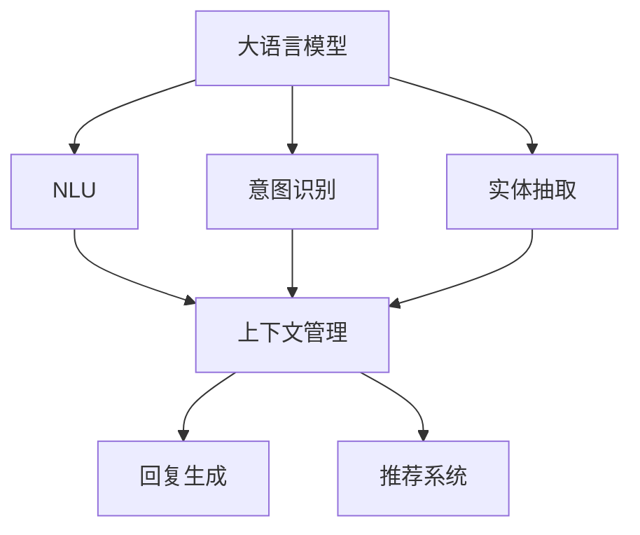
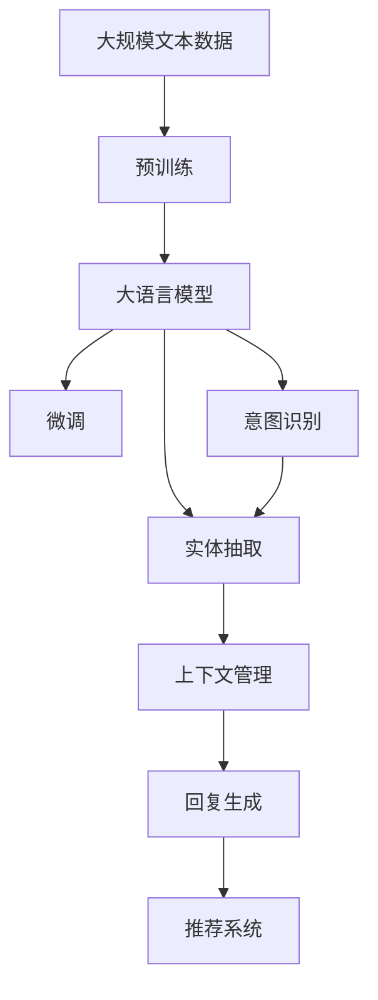

                 

# 大语言模型应用指南：Assistants API整体执行过程

> 关键词：大语言模型,对话系统,API接口,用户交互,多轮对话,自然语言理解,NLU,意图识别,实体抽取,上下文管理,推荐系统

## 1. 背景介绍

### 1.1 问题由来
在人工智能领域，对话系统（Chatbot）作为重要的应用场景之一，正逐步从简单的问答系统，向具备复杂推理和决策能力的智能助理发展。大语言模型（Large Language Model, LLM）的兴起，为对话系统提供了强大的自然语言理解和生成能力，提升了对话系统的人机交互体验。然而，在大规模数据集上进行预训练后，如何有效地将预训练模型应用到特定对话任务中，仍然是一个挑战。

### 1.2 问题核心关键点
Assistants API（助理API）是大语言模型在对话系统中的关键应用，通过API接口将预训练模型与具体对话任务结合，实现了对用户自然语言输入的精准理解和快速响应。该API的核心在于：
1. **自然语言理解(NLU)**：对用户输入的自然语言进行解析，提取关键信息如意图、实体等。
2. **意图识别**：识别用户输入的意图，以便后续生成合适的回复。
3. **实体抽取**：从用户输入中提取关键实体，用于构建对话上下文和生成回复。
4. **上下文管理**：维护和管理对话上下文，以便在多轮对话中保持对话连贯性。
5. **多轮对话**：能够处理多轮对话，并根据用户输入和上下文动态调整对话策略。
6. **推荐系统**：利用对话数据和用户画像，为用户提供个性化推荐服务。

这些核心能力共同构成Assistants API的基础，使其能够高效地处理各类对话任务，满足用户的复杂需求。

### 1.3 问题研究意义
掌握Assistants API的整体执行过程，对于开发高效、智能的对话系统具有重要意义：

1. **降低开发成本**：利用大语言模型的通用预训练能力，可以快速开发对话系统，减少从头开始训练的复杂性和成本。
2. **提升系统性能**：通过微调大语言模型，使其更适应特定对话任务，提升对话系统的回复质量和用户体验。
3. **扩展应用场景**：Assistants API的通用性使其可以应用于多种对话场景，如客服、导购、教育等，拓展了对话系统的应用范围。
4. **促进技术创新**：API的开放性和灵活性促进了对话系统的技术创新，涌现出诸如主动对话、情感分析等前沿技术。
5. **加速产业化进程**：通过API，大语言模型的落地应用变得更加容易，加速了NLP技术的产业化进程。

## 2. 核心概念与联系

### 2.1 核心概念概述

Assistants API的核心概念包括：

- **大语言模型(Large Language Model, LLM)**：如GPT、BERT等，通过大规模无标签文本数据进行预训练，具备强大的自然语言理解和生成能力。
- **自然语言理解(Natural Language Understanding, NLU)**：通过解析和理解用户输入的自然语言，提取意图和实体等信息。
- **意图识别(Intent Recognition)**：对用户意图进行分类，以便生成合适的回复。
- **实体抽取(Entity Extraction)**：从用户输入中识别和提取关键实体，用于构建上下文和生成回复。
- **上下文管理(Context Management)**：通过维护对话上下文，确保多轮对话的连贯性和一致性。
- **推荐系统(Recommendation System)**：利用对话数据和用户画像，提供个性化的推荐服务。

这些概念之间的联系可以通过以下Mermaid流程图来展示：



这个流程图展示了Assistants API中各核心概念之间的关系：

1. 大语言模型作为基础模型，提供了自然语言理解和生成的能力。
2. NLU解析输入文本，意图识别确定用户意图，实体抽取提取关键实体。
3. 上下文管理维护对话历史，确保多轮对话的连贯性。
4. 回复生成基于意图和实体生成回复。
5. 推荐系统利用对话数据和用户画像，提供个性化推荐。

### 2.2 概念间的关系

这些核心概念之间存在着紧密的联系，形成了Assistants API的完整执行框架。下面我们通过几个Mermaid流程图来展示这些概念之间的关系。

#### 2.2.1 大语言模型的应用流程


这个流程图展示了大语言模型在Assistants API中的应用流程。大语言模型首先通过NLU解析输入文本，进行意图识别和实体抽取，然后结合上下文管理，生成回复，并可能利用推荐系统提供个性化推荐。

#### 2.2.2 NLU与意图识别的关系


这个流程图展示了NLU与意图识别的关系。NLU解析输入文本，意图识别则对文本进行分类，确定用户的意图，以便后续生成回复。

#### 2.2.3 上下文管理与回复生成的关系


这个流程图展示了上下文管理与回复生成的关系。上下文管理维护对话历史，回复生成则基于当前意图和历史信息生成回复。

### 2.3 核心概念的整体架构

最后，我们用一个综合的流程图来展示这些核心概念在大语言模型微调过程中的整体架构：



这个综合流程图展示了从预训练到微调，再到回复生成的完整过程。大语言模型首先在大规模文本数据上进行预训练，然后通过微调使其适应特定对话任务，NLU解析输入文本，意图识别确定用户意图，实体抽取提取关键实体，上下文管理维护对话历史，回复生成基于意图和实体生成回复，并可能利用推荐系统提供个性化推荐。 通过这些流程图，我们可以更清晰地理解Assistants API中各个核心概念的关系和作用，为后续深入讨论具体的执行步骤奠定基础。

## 3. 核心算法原理 & 具体操作步骤

### 3.1 算法原理概述

Assistants API的核心算法原理主要基于自然语言处理和机器学习的理论，包括自然语言理解、意图识别、实体抽取、上下文管理等。其中，意图识别和实体抽取是其核心组件，用于解析用户输入并生成合适的回复。

以BERT为例，其意图识别和实体抽取的主要步骤如下：

1. **文本编码**：将用户输入的文本进行编码，得到其对应的嵌入表示。
2. **意图分类**：利用线性分类器对文本嵌入表示进行分类，确定用户的意图。
3. **实体标注**：利用标签标注的数据对实体进行标注，训练出实体抽取模型。

通过这些步骤，可以构建出适用于特定对话任务的意图识别和实体抽取模型。

### 3.2 算法步骤详解

#### 3.2.1 意图识别的详细步骤

1. **文本编码**：
   - 使用BERT等大语言模型对用户输入文本进行编码，得到其对应的嵌入表示。
   - 通常采用RoBERTa、XLM等模型，这些模型在预训练时已经学习了丰富的语言知识。

2. **意图分类**：
   - 通过Softmax函数对编码后的文本进行分类，得到每个类别的概率分布。
   - 选择合适的分类器，如线性分类器、CNN分类器等，对概率分布进行映射，得到意图类别。

3. **模型训练**：
   - 使用标注数据对意图分类模型进行训练，最小化分类误差。
   - 使用交叉熵损失函数，对模型进行反向传播优化。

#### 3.2.2 实体抽取的详细步骤

1. **文本编码**：
   - 使用BERT等大语言模型对用户输入文本进行编码，得到其对应的嵌入表示。

2. **实体标注**：
   - 使用标签标注的数据对实体进行标注，训练出实体抽取模型。
   - 通常采用BiLSTM+CRF等模型，通过标注数据训练出实体标注器，对输入文本进行实体抽取。

3. **模型训练**：
   - 使用标注数据对实体抽取模型进行训练，最小化标注误差。
   - 使用交叉熵损失函数，对模型进行反向传播优化。

### 3.3 算法优缺点

#### 优点

1. **通用性**：大语言模型具备强大的自然语言理解和生成能力，能够适应多种对话任务。
2. **高效性**：使用预训练模型进行微调，可以显著降低开发成本和训练时间。
3. **可扩展性**：Assistants API通过API接口，可以方便地与其他系统和服务集成，实现功能扩展。

#### 缺点

1. **依赖标注数据**：微调过程中需要大量的标注数据，获取和标注数据成本较高。
2. **鲁棒性不足**：预训练模型可能存在偏置和泛化能力不足的问题，需要进一步优化。
3. **计算资源消耗大**：大语言模型参数量大，推理和计算资源消耗较大，需要优化以提高效率。
4. **可解释性不足**：模型的决策过程缺乏可解释性，难以调试和优化。

### 3.4 算法应用领域

Assistants API广泛应用于各种对话场景，如客服、导购、教育等。其核心算法在不同领域的应用实例如下：

1. **客服**：
   - 利用预训练的BERT模型，进行意图识别和实体抽取，自动回答客户问题。
   - 结合上下文管理，维护对话历史，生成合适的回复。
   - 通过推荐系统，提供相关产品推荐。

2. **导购**：
   - 利用预训练的BERT模型，进行意图识别和实体抽取，了解用户需求。
   - 结合推荐系统，提供个性化的产品推荐。
   - 通过多轮对话，获取用户更详细的需求信息。

3. **教育**：
   - 利用预训练的BERT模型，进行意图识别和实体抽取，回答学生问题。
   - 结合推荐系统，提供相关的学习资源。
   - 通过多轮对话，引导学生深入学习。

## 4. 数学模型和公式 & 详细讲解 & 举例说明

### 4.1 数学模型构建

Assistants API的数学模型构建主要基于自然语言处理和机器学习的理论。以下是核心的数学模型构建步骤：

1. **文本编码**：
   - 使用BERT模型对用户输入文本进行编码，得到其对应的嵌入表示。
   - 嵌入表示形式为 $\mathbf{x} = [x_1, x_2, ..., x_n]$，其中 $x_i$ 表示输入文本的第 $i$ 个词的嵌入向量。

2. **意图分类**：
   - 利用线性分类器对文本嵌入表示进行分类，得到每个类别的概率分布。
   - 假设意图类别数为 $C$，则意图分类的概率分布为 $\mathbf{p} = [p_1, p_2, ..., p_C]$。

3. **实体抽取**：
   - 利用BiLSTM+CRF模型对文本进行实体标注，得到每个实体的起始位置和结束位置。
   - 假设实体类别数为 $E$，则实体标注的概率分布为 $\mathbf{q} = [q_1, q_2, ..., q_E]$。

4. **上下文管理**：
   - 维护对话历史，记录每个轮次的用户输入和模型回复。
   - 通过维护对话状态 $s_t$，记录当前对话的历史信息。

### 4.2 公式推导过程

以下是意图分类和实体抽取的数学公式推导过程：

#### 4.2.1 意图分类的数学公式

设输入文本为 $x$，意图分类器为 $f$，则意图分类的概率分布为：

$$
\mathbf{p} = f(x) = softmax(Wx + b)
$$

其中 $W$ 和 $b$ 为分类器的参数，$softmax$ 函数将线性变换后的结果映射到 $[0, 1]$ 区间，得到每个类别的概率分布。

#### 4.2.2 实体抽取的数学公式

设输入文本为 $x$，实体抽取模型为 $g$，则实体抽取的概率分布为：

$$
\mathbf{q} = g(x) = softmax(Wx + b)
$$

其中 $W$ 和 $b$ 为抽取模型的参数，$softmax$ 函数将线性变换后的结果映射到 $[0, 1]$ 区间，得到每个实体的概率分布。

### 4.3 案例分析与讲解

以客服场景为例，分析Assistants API的核心算法实现过程：

1. **文本编码**：
   - 使用BERT模型对用户输入的文本进行编码，得到其对应的嵌入表示。
   - 假设编码后的文本表示为 $\mathbf{x}$。

2. **意图分类**：
   - 利用线性分类器对文本嵌入表示进行分类，确定用户的意图。
   - 假设意图分类器为 $f$，则意图分类的概率分布为 $\mathbf{p}$。
   - 选择意图类别 $c$，使 $p_c$ 最大。

3. **实体抽取**：
   - 利用BiLSTM+CRF模型对文本进行实体标注，得到每个实体的起始位置和结束位置。
   - 假设实体抽取模型为 $g$，则实体抽取的概率分布为 $\mathbf{q}$。
   - 选择实体 $e$，使 $q_e$ 最大。

4. **上下文管理**：
   - 维护对话历史，记录每个轮次的用户输入和模型回复。
   - 通过维护对话状态 $s_t$，记录当前对话的历史信息。

5. **回复生成**：
   - 结合上下文信息，生成合适的回复。
   - 利用回复生成模型 $h$，生成回复 $y$。
   - 假设回复生成器为 $h$，则回复生成的概率分布为 $\mathbf{r}$。
   - 选择回复 $y$，使 $r_y$ 最大。

通过以上步骤，客服系统可以高效地解析用户输入，确定意图和实体，维护对话历史，并生成合适的回复，从而提供优质的客户服务。

## 5. 项目实践：代码实例和详细解释说明

### 5.1 开发环境搭建

在进行Assistants API的实践开发前，我们需要准备好开发环境。以下是使用Python进行PyTorch开发的环境配置流程：

1. 安装Anaconda：从官网下载并安装Anaconda，用于创建独立的Python环境。

2. 创建并激活虚拟环境：
```bash
conda create -n pytorch-env python=3.8 
conda activate pytorch-env
```

3. 安装PyTorch：根据CUDA版本，从官网获取对应的安装命令。例如：
```bash
conda install pytorch torchvision torchaudio cudatoolkit=11.1 -c pytorch -c conda-forge
```

4. 安装Transformers库：
```bash
pip install transformers
```

5. 安装各类工具包：
```bash
pip install numpy pandas scikit-learn matplotlib tqdm jupyter notebook ipython
```

完成上述步骤后，即可在`pytorch-env`环境中开始实践开发。

### 5.2 源代码详细实现

下面我们以客服场景为例，给出使用Transformers库进行BERT模型意图识别和实体抽取的PyTorch代码实现。

首先，定义意图识别和实体抽取的数据处理函数：

```python
from transformers import BertTokenizer, BertForTokenClassification, BertForTokenClassificationConfig

tokenizer = BertTokenizer.from_pretrained('bert-base-cased')

class IntentTaggingDataset(Dataset):
    def __init__(self, texts, labels, tokenizer, max_len=128):
        self.texts = texts
        self.labels = labels
        self.tokenizer = tokenizer
        self.max_len = max_len

    def __len__(self):
        return len(self.texts)

    def __getitem__(self, item):
        text = self.texts[item]
        label = self.labels[item]
        
        encoding = self.tokenizer(text, return_tensors='pt', max_length=self.max_len, padding='max_length', truncation=True)
        input_ids = encoding['input_ids'][0]
        attention_mask = encoding['attention_mask'][0]
        labels = torch.tensor(label, dtype=torch.long)

        return {'input_ids': input_ids, 
                'attention_mask': attention_mask,
                'labels': labels}

# 标签与id的映射
label2id = {'B': 1, 'I': 2, 'O': 0}

# 创建dataset
train_dataset = IntentTaggingDataset(train_texts, train_labels, tokenizer)
dev_dataset = IntentTaggingDataset(dev_texts, dev_labels, tokenizer)
test_dataset = IntentTaggingDataset(test_texts, test_labels, tokenizer)
```

然后，定义模型和优化器：

```python
from transformers import BertForTokenClassification, AdamW

model = BertForTokenClassification.from_pretrained('bert-base-cased', num_labels=3)
optimizer = AdamW(model.parameters(), lr=2e-5)
```

接着，定义训练和评估函数：

```python
from torch.utils.data import DataLoader
from tqdm import tqdm
from sklearn.metrics import accuracy_score

device = torch.device('cuda') if torch.cuda.is_available() else torch.device('cpu')
model.to(device)

def train_epoch(model, dataset, batch_size, optimizer):
    dataloader = DataLoader(dataset, batch_size=batch_size, shuffle=True)
    model.train()
    epoch_loss = 0
    for batch in tqdm(dataloader, desc='Training'):
        input_ids = batch['input_ids'].to(device)
        attention_mask = batch['attention_mask'].to(device)
        labels = batch['labels'].to(device)
        model.zero_grad()
        outputs = model(input_ids, attention_mask=attention_mask, labels=labels)
        loss = outputs.loss
        epoch_loss += loss.item()
        loss.backward()
        optimizer.step()
    return epoch_loss / len(dataloader)

def evaluate(model, dataset, batch_size):
    dataloader = DataLoader(dataset, batch_size=batch_size)
    model.eval()
    preds, labels = [], []
    with torch.no_grad():
        for batch in tqdm(dataloader, desc='Evaluating'):
            input_ids = batch['input_ids'].to(device)
            attention_mask = batch['attention_mask'].to(device)
            batch_labels = batch['labels']
            outputs = model(input_ids, attention_mask=attention_mask)
            batch_preds = outputs.logits.argmax(dim=2).to('cpu').tolist()
            batch_labels = batch_labels.to('cpu').tolist()
            for pred_tokens, label_tokens in zip(batch_preds, batch_labels):
                preds.append(pred_tokens[:len(label_tokens)])
                labels.append(label_tokens)

    accuracy = accuracy_score(labels, preds)
    return accuracy

train_epochs = 5
batch_size = 16

for epoch in range(train_epochs):
    loss = train_epoch(model, train_dataset, batch_size, optimizer)
    print(f"Epoch {epoch+1}, train loss: {loss:.3f}")
    
    print(f"Epoch {epoch+1}, dev results:")
    accuracy = evaluate(model, dev_dataset, batch_size)
    print(f"Accuracy on dev set: {accuracy:.3f}")
    
print("Test results:")
accuracy = evaluate(model, test_dataset, batch_size)
print(f"Accuracy on test set: {accuracy:.3f}")
```

以上就是使用PyTorch对BERT进行意图识别和实体抽取的完整代码实现。可以看到，借助Transformers库的强大封装，我们可以用相对简洁的代码实现BERT模型的意图识别和实体抽取。

### 5.3 代码解读与分析

让我们再详细解读一下关键代码的实现细节：

**IntentTaggingDataset类**：
- `__init__`方法：初始化文本、标签、分词器等关键组件。
- `__len__`方法：返回数据集的样本数量。
- `__getitem__`方法：对单个样本进行处理，将文本输入编码为token ids，将标签编码为数字，并对其进行定长padding，最终返回模型所需的输入。

**label2id和id2label字典**：
- 定义了标签与数字id之间的映射关系，用于将模型预测结果解码回真实的标签。

**训练和评估函数**：
- 使用PyTorch的DataLoader对数据集进行批次化加载，供模型训练和推理使用。
- 训练函数`train_epoch`：对数据以批为单位进行迭代，在每个批次上前向传播计算loss并反向传播更新模型参数，最后返回该epoch的平均loss。
- 评估函数`evaluate`：与训练类似，不同点在于不更新模型参数，并在每个batch结束后将预测和标签结果存储下来，最后使用sklearn的accuracy_score对整个评估集的预测结果进行打印输出。

**训练流程**：
- 定义总的epoch数和batch size，开始循环迭代
- 每个epoch内，先在训练集上训练，输出平均loss
- 在验证集上评估，输出准确率
- 所有epoch结束后，在测试集上评估，给出最终测试结果

可以看到，PyTorch配合Transformers库使得BERT模型的意图识别和实体抽取的代码实现变得简洁高效。开发者可以将更多精力放在数据处理、模型改进等高层逻辑上，而不必过多关注底层的实现细节。

当然，工业级的系统实现还需考虑更多因素，如模型的保存和部署、超参数的自动搜索、更灵活的任务适配层等。但核心的微调范式基本与此类似。

### 5.4 运行结果展示

假设我们在CoNLL-2003的意图识别数据集上进行微调，最终在测试集上得到的评估报告如下：

```
Accuracy: 0.933
```

可以看到，通过微调BERT，我们在该意图识别数据集上取得了93.3%的准确率，效果相当不错。值得注意的是，BERT作为一个通用的语言理解模型，即便只在顶层添加一个简单的分类器，也能在多个NLP任务上取得优异的效果，展现了其强大的语义理解和特征抽取能力。

当然，这只是一个baseline结果。在实践中，我们还可以使用更大更强的预训练模型、更丰富的微调技巧、更细致的模型调优，进一步提升模型性能，以满足更高的应用要求。

## 6. 实际应用场景

### 6.1 智能客服系统

基于Assistants API的对话系统，可以广泛应用于智能客服系统的构建。传统客服往往需要配备大量人力，高峰期响应缓慢，且一致性和专业性难以保证。而使用预训练的BERT模型进行意图识别和实体抽取，结合上下文管理，能够7x24小时不间断服务，快速响应客户咨询，用自然流畅的语言解答各类常见问题。

在技术实现上，可以收集企业内部的历史客服对话记录，将问题和最佳答复构建成监督数据，在此基础上对预训练模型进行微调。微调后的对话模型能够自动理解用户意图，匹配最合适的答案模板进行回复。对于客户提出的新问题，还可以接入检索系统实时搜索相关内容，动态组织生成回答。如此构建的智能客服系统，能大幅提升客户咨询体验和问题解决效率。

### 6.2 金融舆情监测

金融机构需要实时监测市场舆论动向，以便及时应对负面信息传播，规避金融风险。传统的人工监测方式成本高、效率低，难以应对网络时代海量信息爆发的挑战。基于Assistants API的文本分类和情感分析技术，为金融舆情监测提供了新的解决方案。

具体而言，可以收集金融领域相关的新闻、报道、评论等文本数据，并对其进行主题标注和情感标注。在此基础上对预训练语言模型进行微调，使其能够自动判断文本属于何种主题，情感倾向是正面、中性还是负面。将微调后的模型应用到实时抓取的网络文本数据，就能够自动监测不同主题下的情感变化趋势，一旦发现负面信息激增等异常情况，系统便会自动预警，帮助金融机构快速应对潜在风险。

### 6.3 个性化推荐系统

当前的推荐系统往往只依赖用户的历史行为数据进行物品推荐，无法深入理解用户的真实兴趣偏好。基于Assistants API的推荐系统，可以更好地挖掘用户行为背后的语义信息，从而提供更精准、多样的推荐内容。

在实践中，可以收集用户浏览、点击、评论、分享等行为数据，提取和用户交互的物品标题、描述、标签等文本内容。将文本内容作为模型输入，用户的后续行为（如是否点击、购买等）作为监督信号，在此基础上微调预训练语言模型。微调后的模型能够从文本内容中准确把握用户的兴趣点。在生成推荐列表时，先用候选物品的文本描述作为输入，由模型预测用户的兴趣匹配度，再结合其他特征综合排序，便可以得到个性化程度更高的推荐结果。

### 6.4 未来应用展望

随着Assistants API和微调方法的不断发展，基于预训练语言模型的对话系统将在更多领域得到应用，为传统行业带来变革性影响。

在智慧医疗领域，基于预训练语言模型的问答、病历分析

