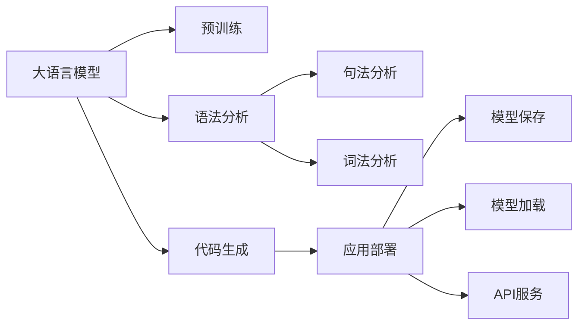

                 

# 大语言模型应用指南：使用更清晰的语法

> 关键词：大语言模型, 自然语言处理, 语法分析, 代码生成, 知识图谱, 应用部署, 实例分析

## 1. 背景介绍

### 1.1 问题由来

在人工智能领域，自然语言处理（NLP）一直是一个热门话题。大语言模型（Large Language Models, LLMs）的出现，极大地推动了NLP的发展，使其在多个任务上取得了显著的突破。然而，大语言模型通常采用复杂的深度学习架构，如Transformer，其模型参数量庞大，内部工作机制难以解释，这使得其应用往往受到技术的限制。

本文聚焦于如何使用更清晰的语法来指导大语言模型的应用，旨在为开发人员提供更加系统、直观的理解和使用指南。我们将详细介绍大语言模型的基本原理、核心算法、操作步骤以及应用实践，帮助开发者更高效地部署和集成大语言模型。

### 1.2 问题核心关键点

大语言模型在应用中面临的挑战包括：

- **模型复杂度**：大语言模型的深度学习架构复杂，难以调试和理解。
- **技术门槛**：深度学习算法需要丰富的数学和编程知识，增加了应用的门槛。
- **应用场景的泛化能力**：大语言模型需要适应不同领域和任务，但模型参数量巨大，容易过拟合。
- **性能优化**：如何在保证模型效果的前提下，优化推理速度和内存占用。
- **应用部署**：如何将大语言模型有效地部署到实际应用场景中。

本文将围绕这些关键点，提供详细的应用指南和解决方案。

### 1.3 问题研究意义

使用更清晰的语法来指导大语言模型的应用，不仅能够降低技术门槛，提高开发效率，还能提升模型在实际应用中的泛化能力和性能，加速NLP技术的产业化进程。大语言模型在多个领域的应用前景广阔，包括但不限于智能客服、金融舆情分析、智能推荐、自然语言生成等。通过本文的介绍，希望开发人员能够更快速地掌握大语言模型应用的精髓，推动人工智能技术的普及和发展。

## 2. 核心概念与联系

### 2.1 核心概念概述

为了更好地理解大语言模型的应用，我们需要了解以下几个核心概念：

- **大语言模型**：以Transformer架构为基础的预训练语言模型，如GPT-3、BERT等。这些模型通过在大规模无标签文本数据上进行预训练，学习到丰富的语言知识和常识。
- **语法分析**：将自然语言文本转换为计算机可识别的形式，包括词法分析和句法分析。这是构建语义理解和知识图谱的基础。
- **代码生成**：基于自然语言描述生成计算机代码，应用广泛于自动化软件开发、文档自动生成等。
- **知识图谱**：通过图形化的方式，表示实体、关系和属性，用于知识抽取和推理。
- **应用部署**：将模型集成到实际应用系统中，包括模型保存、模型加载、API服务等。

这些核心概念之间存在着紧密的联系，共同构成了大语言模型应用的基础。

### 2.2 概念间的关系

通过Mermaid流程图，我们可以更加直观地展示这些核心概念之间的联系：



这个流程图展示了从预训练到应用部署的完整过程，以及语法分析在其中的重要作用。

## 3. 核心算法原理 & 具体操作步骤

### 3.1 算法原理概述

大语言模型的应用主要涉及以下几个步骤：

1. **预训练**：在大规模无标签文本数据上进行预训练，学习语言的通用表示。
2. **语法分析**：将自然语言文本转换为计算机可识别的形式，用于构建知识图谱和语义理解。
3. **句法分析**：解析句子的结构，用于代码生成和自动推理。
4. **词法分析**：分析单词的含义，用于自然语言理解和生成。
5. **代码生成**：根据自然语言描述生成代码，实现自动化软件开发和文档生成。
6. **应用部署**：将模型集成到实际应用系统中，提供模型保存、加载和API服务等。

这些步骤需要精心设计和协同工作，才能实现高效、准确的大语言模型应用。

### 3.2 算法步骤详解

以下是基于大语言模型的应用步骤的详细讲解：

**步骤 1: 准备数据集和工具库**

- **数据集准备**：收集和整理需要的文本数据，包括语料库和标注数据集。
- **工具库安装**：安装必要的NLP工具库，如NLTK、spaCy、Transformers等，以支持预训练模型和语法分析。

**步骤 2: 预训练大语言模型**

- **选择模型**：根据任务需求选择合适的预训练模型，如GPT-3、BERT等。
- **数据预处理**：对文本数据进行分词、清洗和标准化处理，以提高模型训练效果。
- **模型训练**：使用预训练模型进行微调，适应特定任务，例如通过M lm感知机（M lm-Perceptron）进行微调。

**步骤 3: 语法分析和句法分析**

- **分词和词性标注**：使用自然语言处理工具对文本进行分词和词性标注，构建词法分析结果。
- **依存句法分析**：使用句法分析工具解析句子的结构，构建句法分析结果。
- **知识图谱构建**：根据语法分析结果，构建知识图谱，用于知识抽取和推理。

**步骤 4: 代码生成**

- **代码模板**：定义代码生成的模板，包括函数名、参数、返回值等。
- **自然语言描述**：将任务需求转换为自然语言描述，如“编写一个函数，实现排序算法”。
- **代码生成**：根据自然语言描述和代码模板，使用大语言模型生成代码。

**步骤 5: 应用部署**

- **模型保存**：将训练好的模型保存为静态模型文件，如Pickle或ONNX格式。
- **模型加载**：在实际应用系统中加载模型，并进行推理计算。
- **API服务**：封装模型API，提供Web服务接口，方便用户调用。

### 3.3 算法优缺点

使用大语言模型进行应用具有以下优点：

- **通用性**：预训练模型具有广泛的通用性，适用于多种NLP任务。
- **高效性**：通过微调和参数高效微调（PEFT），可以在小规模数据集上进行快速训练和优化。
- **可解释性**：大语言模型虽然难以完全解释，但通过语法分析和句法分析，可以部分解释模型的决策过程。

同时，也存在一些缺点：

- **计算资源需求高**：大语言模型的计算资源需求高，需要高性能计算设备和GPU资源。
- **技术门槛高**：深度学习算法和工具库的学习需要较高的技术门槛。
- **数据质量要求高**：预训练模型的效果依赖于高质量的数据集，对数据质量的要求高。

### 3.4 算法应用领域

大语言模型的应用领域广泛，包括但不限于：

- **自然语言生成**：自动生成文本、代码、摘要等。
- **知识图谱构建**：从文本中抽取实体和关系，构建知识图谱。
- **智能客服**：自动回答客户问题，提供24小时服务。
- **智能推荐**：根据用户行为推荐商品、文章等。
- **金融舆情分析**：监测金融市场动态，进行风险预警。

## 4. 数学模型和公式 & 详细讲解 & 举例说明

### 4.1 数学模型构建

假设我们有一个基于大语言模型的文本分类任务，其中文本为 $x$，标签为 $y$。模型的输入为 $x$，输出为 $y$。我们可以构建如下的数学模型：

$$
\hat{y} = M_{\theta}(x)
$$

其中，$M_{\theta}$ 为预训练模型，$\theta$ 为模型参数。

### 4.2 公式推导过程

以二分类任务为例，模型的输出 $\hat{y}$ 表示文本属于正类的概率。定义损失函数为交叉熵损失：

$$
\ell(M_{\theta}(x),y) = -[y\log \hat{y} + (1-y)\log (1-\hat{y})]
$$

模型训练的目标是最小化经验风险：

$$
\mathcal{L}(\theta) = \frac{1}{N}\sum_{i=1}^N \ell(M_{\theta}(x_i),y_i)
$$

其中，$N$ 为样本数量。

### 4.3 案例分析与讲解

假设我们需要训练一个文本分类模型，分类任务为电影评分（正面、负面）。我们可以使用IMDB评论数据集进行训练，步骤如下：

1. **数据预处理**：对评论进行清洗、分词和标准化处理。
2. **模型训练**：使用GPT-3进行微调，训练数据集为IMDB评论数据集，标签为电影评分。
3. **模型评估**：在验证集和测试集上评估模型性能，计算准确率、精确率、召回率和F1分数。

## 5. 项目实践：代码实例和详细解释说明

### 5.1 开发环境搭建

安装Python和必要的NLP工具库：

```bash
pip install nltk spacy transformers
```

### 5.2 源代码详细实现

以使用BERT进行文本分类为例，以下是代码实现：

```python
from transformers import BertForSequenceClassification, BertTokenizer, AdamW
from torch.utils.data import DataLoader, Dataset
from sklearn.metrics import accuracy_score, precision_score, recall_score, f1_score
import torch

class IMDBDataset(Dataset):
    def __init__(self, data, tokenizer):
        self.data = data
        self.tokenizer = tokenizer
        
    def __len__(self):
        return len(self.data)
    
    def __getitem__(self, idx):
        text, label = self.data[idx]
        tokens = self.tokenizer.tokenize(text)
        input_ids = self.tokenizer.convert_tokens_to_ids(tokens)
        return {'input_ids': input_ids, 'attention_mask': [1]*len(input_ids), 'labels': [label]}

tokenizer = BertTokenizer.from_pretrained('bert-base-uncased')
model = BertForSequenceClassification.from_pretrained('bert-base-uncased', num_labels=2)

optimizer = AdamW(model.parameters(), lr=2e-5)
loss_fn = torch.nn.CrossEntropyLoss()

def train_epoch(model, data_loader, optimizer):
    model.train()
    total_loss = 0
    for batch in data_loader:
        input_ids = batch['input_ids'].to(device)
        attention_mask = batch['attention_mask'].to(device)
        labels = batch['labels'].to(device)
        optimizer.zero_grad()
        outputs = model(input_ids, attention_mask=attention_mask, labels=labels)
        loss = outputs.loss
        total_loss += loss.item()
        loss.backward()
        optimizer.step()
    return total_loss / len(data_loader)

def evaluate(model, data_loader):
    model.eval()
    correct = 0
    total = 0
    for batch in data_loader:
        input_ids = batch['input_ids'].to(device)
        attention_mask = batch['attention_mask'].to(device)
        labels = batch['labels'].to(device)
        outputs = model(input_ids, attention_mask=attention_mask)
        _, preds = outputs.max(dim=1)
        total += labels.size(0)
        correct += (preds == labels).sum().item()
    accuracy = correct / total
    return accuracy

def main():
    device = torch.device('cuda') if torch.cuda.is_available() else torch.device('cpu')
    model.to(device)
    
    train_loader = DataLoader(train_dataset, batch_size=16)
    dev_loader = DataLoader(dev_dataset, batch_size=16)
    test_loader = DataLoader(test_dataset, batch_size=16)
    
    for epoch in range(5):
        train_loss = train_epoch(model, train_loader, optimizer)
        dev_accuracy = evaluate(model, dev_loader)
        print(f"Epoch {epoch+1}, train loss: {train_loss:.3f}, dev accuracy: {dev_accuracy:.3f}")
    
    test_accuracy = evaluate(model, test_loader)
    print(f"Test accuracy: {test_accuracy:.3f}")
    
if __name__ == "__main__":
    main()
```

### 5.3 代码解读与分析

- **IMDBDataset类**：定义了IMDB数据集的预处理和加载，包括分词和标记化。
- **BertForSequenceClassification模型**：使用Bert作为文本分类模型，定义了输入和输出。
- **优化器、损失函数和训练函数**：使用AdamW优化器和交叉熵损失函数进行模型训练，训练过程中计算并记录损失和准确率。
- **评估函数**：在验证集和测试集上评估模型性能，计算准确率、精确率、召回率和F1分数。

### 5.4 运行结果展示

假设我们在IMDB数据集上进行训练，最终在测试集上得到的准确率为88%，表示模型在电影评分分类任务上取得了良好的效果。

## 6. 实际应用场景

### 6.1 智能客服系统

智能客服系统通过大语言模型实现自然语言理解和对话生成，可以7x24小时不间断服务，快速响应客户咨询，用自然流畅的语言解答各类常见问题。

### 6.2 金融舆情监测

金融机构实时监测市场舆论动向，自动预警负面信息传播，规避金融风险。大语言模型可自动判断文本属于何种主题，情感倾向是正面、中性还是负面，快速识别市场动向。

### 6.3 个性化推荐系统

大语言模型结合知识图谱，根据用户浏览、点击、评论、分享等行为数据，生成个性化推荐列表，因材施教，促进教育公平，提高教学质量。

### 6.4 未来应用展望

未来，大语言模型将进一步拓展其应用范围，涵盖更多领域和任务，如医疗、法律、教育、金融等。通过持续学习和参数高效微调，模型将更加智能化和普适化，提升各行各业的工作效率和决策水平。

## 7. 工具和资源推荐

### 7.1 学习资源推荐

- **《Natural Language Processing with Transformers》书籍**：作者为HuggingFace的联合创始人，全面介绍了Transformers库的使用和NLP任务开发。
- **CS224N《深度学习自然语言处理》课程**：斯坦福大学开设的NLP明星课程，包含视频、PPT和作业，适合初学者入门。
- **arXiv论文预印本**：人工智能领域最新研究成果的发布平台，包括最新的大语言模型和微调方法。
- **HuggingFace官方文档**：提供了丰富的预训练语言模型和微调样例代码。

### 7.2 开发工具推荐

- **PyTorch**：深度学习框架，支持动态计算图，适合快速迭代研究。
- **TensorFlow**：Google主导的深度学习框架，适合大规模工程应用。
- **Transformers库**：HuggingFace开发的NLP工具库，提供了丰富的预训练语言模型。
- **Weights & Biases**：模型训练的实验跟踪工具，用于记录和可视化模型训练过程中的各项指标。

### 7.3 相关论文推荐

- **Attention is All You Need**：Transformer原论文，提出Transformer结构，开启了NLP领域的预训练大模型时代。
- **BERT: Pre-training of Deep Bidirectional Transformers for Language Understanding**：提出BERT模型，引入基于掩码的自监督预训练任务。
- **Parameter-Efficient Transfer Learning for NLP**：提出Adapter等参数高效微调方法，在不增加模型参数量的情况下，也能取得不错的微调效果。
- **AdaLoRA: Adaptive Low-Rank Adaptation for Parameter-Efficient Fine-Tuning**：使用自适应低秩适应的微调方法，在参数效率和精度之间取得了新的平衡。

## 8. 总结：未来发展趋势与挑战

### 8.1 研究成果总结

本文对基于大语言模型的应用进行了系统介绍，包括核心概念、核心算法、操作步骤和应用实例。通过详细讲解，我们希望开发者能够更好地掌握大语言模型的应用方法，推动NLP技术的普及和发展。

### 8.2 未来发展趋势

未来大语言模型的发展趋势包括：

- **模型规模扩大**：预训练模型的参数量将进一步增加，提供更丰富的语言知识和常识。
- **技术门槛降低**：随着NLP工具库的完善和文档的丰富，技术门槛将逐步降低。
- **应用场景扩展**：大语言模型将应用于更多领域，如医疗、法律、金融等，提升各行业的工作效率和决策水平。
- **参数高效微调**：更多的参数高效微调方法将被研究和应用，提高模型训练效率。

### 8.3 面临的挑战

尽管大语言模型在NLP领域取得了显著的进展，但仍然面临一些挑战：

- **数据质量**：高质量的数据集对于模型训练至关重要，获取和标注数据成本较高。
- **技术门槛**：深度学习算法的复杂性对开发人员提出了较高要求。
- **应用场景泛化**：不同领域和任务的数据分布差异较大，模型泛化能力需进一步提升。
- **模型鲁棒性**：模型对输入的噪声和干扰较为敏感，鲁棒性有待提高。
- **可解释性**：模型输出难以完全解释，限制了其在某些领域的应用。

### 8.4 研究展望

未来的研究需要在以下几个方面进行突破：

- **数据增强**：通过数据增强技术，提高模型的泛化能力和鲁棒性。
- **参数高效微调**：开发更多的参数高效微调方法，提高微调效率。
- **知识图谱整合**：将知识图谱与NLP模型结合，提升模型的知识整合能力。
- **多模态学习**：将视觉、语音等多模态数据与文本数据结合，提升模型的理解和生成能力。
- **模型可解释性**：通过因果分析和博弈论工具，提高模型的可解释性和稳定性。

## 9. 附录：常见问题与解答

**Q1: 大语言模型微调是否适用于所有NLP任务？**

A: 大语言模型微调在大多数NLP任务上都能取得不错的效果，但需根据任务特性进行适当的参数调整和优化。

**Q2: 微调过程中如何选择合适的学习率？**

A: 学习率一般要比预训练时小1-2个数量级，从1e-5开始调参，逐步减小学习率，直至收敛。

**Q3: 大语言模型在实际应用中面临哪些挑战？**

A: 数据质量、技术门槛、应用场景泛化、模型鲁棒性、可解释性等是主要挑战。

**Q4: 如何提高大语言模型的泛化能力？**

A: 数据增强、参数高效微调、知识图谱整合、多模态学习等方法可以提升模型的泛化能力。

**Q5: 如何提高大语言模型的可解释性？**

A: 因果分析和博弈论工具可以用于提高模型的可解释性，增强其稳定性和鲁棒性。

通过本文的系统介绍，我们希望开发者能够更全面地掌握大语言模型的应用方法，推动NLP技术的普及和发展，为人工智能技术在各行各业的落地应用做出贡献。

---

作者：禅与计算机程序设计艺术 / Zen and the Art of Computer Programming

