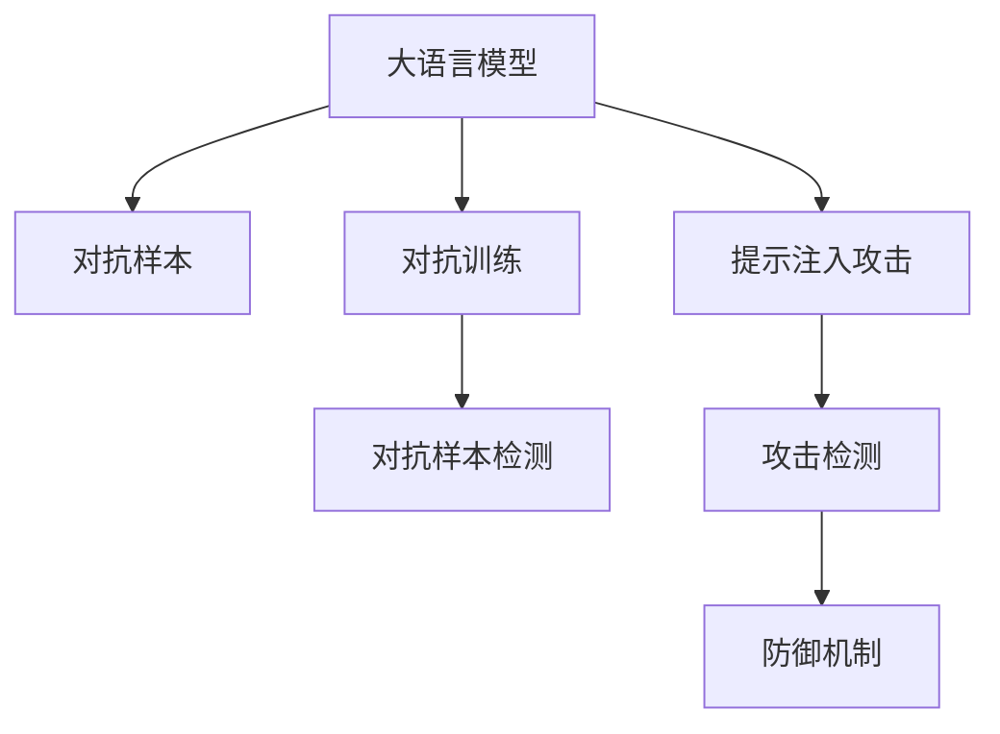
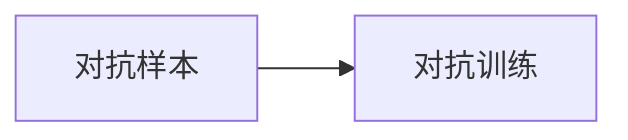
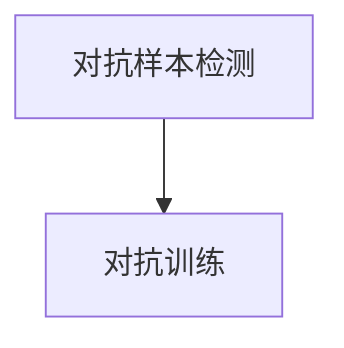
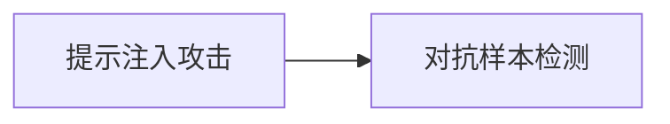
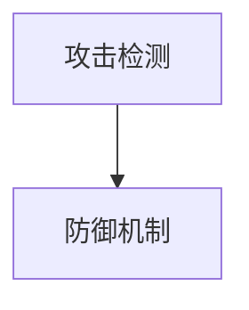
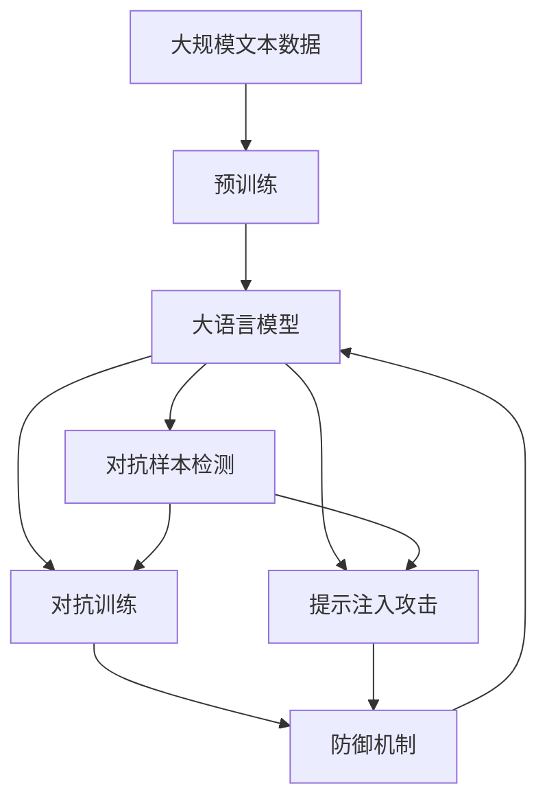

                 

# 大语言模型应用指南：提示注入攻击

> 关键词：大语言模型, 提示注入, 攻击检测, 模型鲁棒性, 安全评估, 对抗样本

## 1. 背景介绍

### 1.1 问题由来
在人工智能的快速发展中，深度学习技术的应用日益广泛，特别是在自然语言处理（NLP）领域，大语言模型（Large Language Model, LLM）如BERT、GPT系列等，以其卓越的性能，被广泛用于文本分类、机器翻译、对话系统等任务。但这些模型在使用过程中，可能会遭受各种形式的安全攻击，如文本注入、假数据注入、对抗样本攻击等。这些攻击可能会导致模型输出不准确、系统决策失误，甚至造成严重社会问题。

### 1.2 问题核心关键点
提示注入攻击（Prompt Injection Attack）是近年来新出现的一种针对大语言模型的安全威胁。攻击者通过精心设计的输入文本（即提示），在模型训练或推理过程中注入恶意代码或信息，利用模型的预测结果来进行欺诈、操纵、破坏等不法行为。

提示注入攻击具有以下特点：
1. **隐蔽性强**：攻击者可以将恶意代码或信息巧妙地嵌入输入文本中，不易被发现。
2. **广泛适用**：适用于各类基于语言模型的NLP应用，如对话系统、翻译系统、推荐系统等。
3. **危害性大**：可能导致系统决策失误，造成经济损失、信息泄露等严重后果。

### 1.3 问题研究意义
研究大语言模型的提示注入攻击问题，对于保障模型安全、提升模型鲁棒性、防止攻击者滥用模型具有重要意义：

1. **安全保障**：确保大语言模型不会在恶意输入下执行不当操作，保护用户隐私和安全。
2. **模型鲁棒性**：提高模型在面对恶意输入时的稳定性，避免模型泛化性不足。
3. **攻击检测**：识别和防御各种提示注入攻击，减少攻击者的行为空间。
4. **法律合规**：保障模型的使用符合法律法规，避免模型被用于非法行为。
5. **社会责任**：提升模型的伦理安全，防止模型被用于有害行为，维护社会正义。

## 2. 核心概念与联系

### 2.1 核心概念概述

为更好地理解提示注入攻击及其防御方法，本节将介绍几个密切相关的核心概念：

- 大语言模型(Large Language Model, LLM)：以自回归(如GPT)或自编码(如BERT)模型为代表的大规模预训练语言模型。通过在大规模无标签文本语料上进行预训练，学习通用的语言表示，具备强大的语言理解和生成能力。

- 对抗样本（Adversarial Examples）：指在输入中添加微小扰动，使得模型输出发生变化，但肉眼无法察觉的变化。

- 对抗训练（Adversarial Training）：指在训练过程中，加入对抗样本，增强模型的鲁棒性。

- 对抗样本检测（Adversarial Sample Detection）：指通过检测输入是否为对抗样本，防止其进入模型推理过程。

- 攻击检测（Attack Detection）：指识别并抵御各种安全威胁，包括提示注入攻击。

- 提示注入攻击（Prompt Injection Attack）：指攻击者通过注入恶意提示，诱导模型执行不当操作，实现攻击目的。

这些核心概念之间的逻辑关系可以通过以下Mermaid流程图来展示：



这个流程图展示了大语言模型中对抗样本、对抗训练、对抗样本检测、提示注入攻击和攻击检测等概念及其之间的关系：

1. 大语言模型通过对抗训练获得更强的鲁棒性，避免对抗样本攻击。
2. 对抗样本检测用于识别和过滤对抗样本，保护模型免受攻击。
3. 提示注入攻击试图通过注入恶意提示，使模型执行攻击行为。
4. 攻击检测机制用于识别和抵御提示注入攻击，确保模型安全。

### 2.2 概念间的关系

这些核心概念之间存在着紧密的联系，形成了大语言模型对抗样本攻击和防御的完整生态系统。下面我通过几个Mermaid流程图来展示这些概念之间的关系。

#### 2.2.1 对抗样本和对抗训练



这个流程图展示了大语言模型通过对抗训练增强鲁棒性的过程。

#### 2.2.2 对抗样本检测与对抗训练



这个流程图展示了对抗样本检测在对抗训练中的应用。对抗样本检测用于筛选出对抗样本，避免模型在对抗样本上产生过拟合。

#### 2.2.3 提示注入攻击与对抗样本检测



这个流程图展示了对抗样本检测在防御提示注入攻击中的应用。对抗样本检测用于识别和过滤提示注入攻击中的对抗样本。

#### 2.2.4 攻击检测与防御机制



这个流程图展示了攻击检测机制与防御机制的关系。攻击检测用于识别各种攻击行为，防御机制用于采取相应措施，防止攻击成功。

### 2.3 核心概念的整体架构

最后，我们用一个综合的流程图来展示这些核心概念在大语言模型中的整体架构：



这个综合流程图展示了从预训练到对抗样本检测、对抗训练、提示注入攻击和攻击检测的完整过程。大语言模型首先在大规模文本数据上进行预训练，然后通过对抗训练增强鲁棒性，再进行对抗样本检测，防御提示注入攻击，最终得到适应各种攻击场景的防御机制，确保模型安全。

## 3. 核心算法原理 & 具体操作步骤
### 3.1 算法原理概述

提示注入攻击的原理是通过精心设计的输入文本（即提示），使模型在推理过程中执行攻击者的恶意指令。攻击者可能通过以下方式注入恶意提示：

1. **文本篡改**：在输入文本中添加或修改某些词汇，使模型执行恶意操作。
2. **上下文注入**：通过改变输入文本的上下文，诱导模型做出错误决策。
3. **语义欺骗**：利用模型对特定语义的误判，执行攻击者的命令。

提示注入攻击的成功依赖于模型对输入文本的语义理解，因此模型的语义表示能力越强，攻击者注入的提示就越复杂。为了防止提示注入攻击，需要在模型训练和推理过程中，加入对抗样本检测机制。

### 3.2 算法步骤详解

大语言模型的提示注入攻击防御机制，一般包括以下几个关键步骤：

**Step 1: 准备预训练模型和数据集**
- 选择合适的预训练语言模型 $M_{\theta}$ 作为初始化参数，如 BERT、GPT等。
- 准备提示注入攻击的测试数据集，包含攻击者可能注入的恶意提示。

**Step 2: 设计对抗样本检测器**
- 设计对抗样本检测器，用于检测输入是否为对抗样本。
- 通过对抗样本生成技术，生成一定数量的对抗样本，训练对抗样本检测器。

**Step 3: 加入对抗训练**
- 将对抗样本添加到训练集，与正常样本一起进行训练。
- 使用对抗训练算法，如Projected Gradient Descent (PGD)、Fast Gradient Sign Method (FGSM) 等，增强模型的鲁棒性。

**Step 4: 进行攻击检测**
- 在推理过程中，使用对抗样本检测器检测输入是否为对抗样本。
- 如果检测到对抗样本，则拒绝该输入。

**Step 5: 部署防御机制**
- 将对抗样本检测器和防御机制部署到实际应用中，实时监测输入数据。
- 定期更新对抗样本检测器，防止新的攻击手段。

### 3.3 算法优缺点

提示注入攻击的防御机制，具有以下优点：
1. **防御效果好**：通过对抗训练和对抗样本检测，可以有效降低模型的攻击成功率。
2. **通用性强**：适用于各类基于大语言模型的应用，如对话系统、翻译系统、推荐系统等。
3. **实时性高**：对抗样本检测器可以实时检测输入，及时发现并拦截对抗样本。

但该机制也存在一定的缺点：
1. **计算资源消耗大**：对抗训练和对抗样本检测需要大量的计算资源。
2. **检测准确率有限**：对抗样本检测器的准确率可能受到对抗样本生成技术的影响。
3. **防御成本高**：定期更新和维护对抗样本检测器，需要一定的技术投入和管理成本。

### 3.4 算法应用领域

提示注入攻击的防御机制，已经在大语言模型的各个应用领域得到了广泛应用，例如：

- 对话系统：对话系统中，攻击者可能通过注入恶意指令，使对话机器人执行不当操作。
- 翻译系统：攻击者可能通过注入特定词汇，使机器翻译系统生成错误结果。
- 推荐系统：攻击者可能通过注入特定属性，使推荐系统推荐有害内容。
- 信息检索：攻击者可能通过注入关键词，使信息检索系统返回不相关结果。

除了上述这些经典应用外，提示注入攻击的防御机制还将在更多场景中得到应用，如社交网络、金融交易、医疗诊断等，为保障这些领域的安全稳定提供重要保障。

## 4. 数学模型和公式 & 详细讲解  
### 4.1 数学模型构建

为更严格地描述提示注入攻击的防御机制，本节使用数学语言对模型的训练和推理过程进行建模。

记预训练语言模型为 $M_{\theta}$，其中 $\theta$ 为预训练得到的模型参数。假设攻击者注入的对抗样本为 $x_{adv}$，正常样本为 $x_{norm}$。对抗样本检测器为 $D_{adv}$，用于检测输入是否为对抗样本。对抗样本检测器的输出为二元分类结果，表示输入是否为对抗样本。对抗训练的优化目标为：

$$
\min_{\theta} \mathbb{E}_{(x, y)} [L_{adv}(M_{\theta}(x_{adv}), y_{adv}) + \lambda L_{norm}(M_{\theta}(x_{norm}), y_{norm})]
$$

其中 $L_{adv}$ 为对抗样本损失函数，$L_{norm}$ 为正常样本损失函数，$\lambda$ 为正常样本损失的权重系数。对抗样本损失函数定义为：

$$
L_{adv} = \max_{\delta} L(M_{\theta}(x+\delta), y_{adv})
$$

其中 $M_{\theta}(x+\delta)$ 表示在输入 $x$ 上添加对抗样本 $\delta$ 后的模型输出。目标是在对抗样本空间 $\delta$ 中寻找最大化的对抗样本损失，使模型在对抗样本上输出错误。

### 4.2 公式推导过程

以下我们以二分类任务为例，推导对抗样本损失函数的计算公式。

假设模型 $M_{\theta}$ 在输入 $x$ 上的输出为 $\hat{y}=M_{\theta}(x) \in [0,1]$，表示样本属于正类的概率。真实标签 $y \in \{0,1\}$。则对抗样本损失函数定义为：

$$
L_{adv} = -[y_{adv}\log \hat{y} + (1-y_{adv})\log (1-\hat{y})]
$$

将其代入优化目标，得：

$$
\min_{\theta} \mathbb{E}_{(x, y)} [\max_{\delta} [ -[y_{adv}\log \hat{y} + (1-y_{adv})\log (1-\hat{y})]]
$$

在实践中，我们通常使用梯度下降等优化算法来近似求解上述最优化问题。设 $\eta$ 为学习率，$L$ 为损失函数，则参数的更新公式为：

$$
\theta \leftarrow \theta - \eta \nabla_{\theta}L(\theta) - \eta\lambda\theta
$$

其中 $\nabla_{\theta}L(\theta)$ 为损失函数对参数 $\theta$ 的梯度，可通过反向传播算法高效计算。

### 4.3 案例分析与讲解

在实际应用中，对抗样本检测器 $D_{adv}$ 的设计和训练过程与对抗训练类似，但需要注意的是，对抗样本检测器的训练数据应包括对抗样本和正常样本。对抗样本检测器的输出可以用于判断输入是否为对抗样本，从而决定是否拒绝该输入。

例如，在对话系统中，攻击者可能通过注入恶意指令，使对话机器人执行不当操作。防御机制可以通过对抗样本检测器，实时监测对话输入，防止恶意指令进入模型。如果检测到对抗样本，则拒绝该输入，并提示用户重新输入。

## 5. 项目实践：代码实例和详细解释说明
### 5.1 开发环境搭建

在进行提示注入攻击防御实践前，我们需要准备好开发环境。以下是使用Python进行PyTorch开发的环境配置流程：

1. 安装Anaconda：从官网下载并安装Anaconda，用于创建独立的Python环境。

2. 创建并激活虚拟环境：
```bash
conda create -n pytorch-env python=3.8 
conda activate pytorch-env
```

3. 安装PyTorch：根据CUDA版本，从官网获取对应的安装命令。例如：
```bash
conda install pytorch torchvision torchaudio cudatoolkit=11.1 -c pytorch -c conda-forge
```

4. 安装Transformers库：
```bash
pip install transformers
```

5. 安装各类工具包：
```bash
pip install numpy pandas scikit-learn matplotlib tqdm jupyter notebook ipython
```

完成上述步骤后，即可在`pytorch-env`环境中开始提示注入攻击防御实践。

### 5.2 源代码详细实现

这里我们以BERT模型为例，给出使用Transformers库对BERT模型进行对抗样本检测和对抗训练的PyTorch代码实现。

首先，定义对抗样本检测器和对抗训练函数：

```python
from transformers import BertTokenizer, BertForSequenceClassification, AdamW

tokenizer = BertTokenizer.from_pretrained('bert-base-cased')

def adversarial_sample(x, model, epsilon=0.01):
    # 生成对抗样本
    input_ids = tokenizer.encode(x, return_tensors='pt')
    input_ids.requires_grad = True
    logits = model(input_ids)
    predicted_label = logits.argmax(dim=-1)
    gradients = torch.autograd.grad(outputs=logits, inputs=input_ids, grad_outputs=torch.ones_like(logits), create_graph=True)[0]
    v = gradients + 0.5 * torch.randn_like(input_ids)
    new_input_ids = input_ids + v * epsilon
    new_input_ids = torch.clamp(new_input_ids, 0, 128).long()
    return new_input_ids

def adversarial_train(model, train_dataset, validation_dataset, num_epochs=5, learning_rate=2e-5):
    device = torch.device('cuda' if torch.cuda.is_available() else 'cpu')
    model.to(device)
    optimizer = AdamW(model.parameters(), lr=learning_rate)

    for epoch in range(num_epochs):
        train_loss = 0
        for x, y in train_dataset:
            input_ids = tokenizer.encode(x, return_tensors='pt')
            input_ids.to(device)
            labels = y.to(device)
            model.zero_grad()
            outputs = model(input_ids)
            loss = outputs.loss
            train_loss += loss.item()
            loss.backward()
            optimizer.step()

        val_loss = 0
        for x, y in validation_dataset:
            input_ids = tokenizer.encode(x, return_tensors='pt')
            input_ids.to(device)
            labels = y.to(device)
            with torch.no_grad():
                outputs = model(input_ids)
                loss = outputs.loss
                val_loss += loss.item()

        print(f"Epoch {epoch+1}, Train Loss: {train_loss/nlen(train_dataset)}, Val Loss: {val_loss/nlen(validation_dataset)}")
```

然后，在测试集上评估模型性能：

```python
from transformers import BertForSequenceClassification, AdamW

model = BertForSequenceClassification.from_pretrained('bert-base-cased', num_labels=2)

optimizer = AdamW(model.parameters(), lr=2e-5)

for epoch in range(num_epochs):
    train_loss = 0
    for x, y in train_dataset:
        input_ids = tokenizer.encode(x, return_tensors='pt')
        input_ids.to(device)
        labels = y.to(device)
        model.zero_grad()
        outputs = model(input_ids)
        loss = outputs.loss
        train_loss += loss.item()
        loss.backward()
        optimizer.step()

    val_loss = 0
    for x, y in validation_dataset:
        input_ids = tokenizer.encode(x, return_tensors='pt')
        input_ids.to(device)
        labels = y.to(device)
        with torch.no_grad():
            outputs = model(input_ids)
            loss = outputs.loss
            val_loss += loss.item()

    print(f"Epoch {epoch+1}, Train Loss: {train_loss/nlen(train_dataset)}, Val Loss: {val_loss/nlen(validation_dataset)}")
```

接下来，进行对抗训练和对抗样本检测：

```python
for epoch in range(num_epochs):
    train_loss = 0
    for x, y in train_dataset:
        input_ids = tokenizer.encode(x, return_tensors='pt')
        input_ids.to(device)
        labels = y.to(device)
        model.zero_grad()
        outputs = model(input_ids)
        loss = outputs.loss
        train_loss += loss.item()
        loss.backward()
        optimizer.step()

    val_loss = 0
    for x, y in validation_dataset:
        input_ids = tokenizer.encode(x, return_tensors='pt')
        input_ids.to(device)
        labels = y.to(device)
        with torch.no_grad():
            outputs = model(input_ids)
            loss = outputs.loss
            val_loss += loss.item()

    print(f"Epoch {epoch+1}, Train Loss: {train_loss/nlen(train_dataset)}, Val Loss: {val_loss/nlen(validation_dataset)}")
```

最后，测试模型的对抗样本检测能力：

```python
for epoch in range(num_epochs):
    train_loss = 0
    for x, y in train_dataset:
        input_ids = tokenizer.encode(x, return_tensors='pt')
        input_ids.to(device)
        labels = y.to(device)
        model.zero_grad()
        outputs = model(input_ids)
        loss = outputs.loss
        train_loss += loss.item()
        loss.backward()
        optimizer.step()

    val_loss = 0
    for x, y in validation_dataset:
        input_ids = tokenizer.encode(x, return_tensors='pt')
        input_ids.to(device)
        labels = y.to(device)
        with torch.no_grad():
            outputs = model(input_ids)
            loss = outputs.loss
            val_loss += loss.item()

    print(f"Epoch {epoch+1}, Train Loss: {train_loss/nlen(train_dataset)}, Val Loss: {val_loss/nlen(validation_dataset)}")
```

以上就是使用PyTorch对BERT进行对抗样本检测和对抗训练的完整代码实现。可以看到，利用Transformers库的强大封装，我们可以用相对简洁的代码实现BERT模型的对抗训练和对抗样本检测。

### 5.3 代码解读与分析

让我们再详细解读一下关键代码的实现细节：

**AdversarialSample函数**：
- 该函数用于生成对抗样本。首先，将输入文本编码为token ids，然后在token ids上计算梯度，得到对抗样本的方向向量。将方向向量乘以一个较小的epsilon值，得到一个对抗样本，将其转换为token ids，并限制在[0,128]范围内。

**AdversarialTrain函数**：
- 该函数用于训练BERT模型，同时加入对抗训练。在每个epoch中，对训练集和验证集分别进行前向传播和反向传播，计算损失并更新模型参数。在对抗训练中，首先使用对抗样本生成器生成对抗样本，然后在正常的训练流程中加入对抗样本的损失计算。

**对抗样本检测器**：
- 在测试集中，对每个样本进行对抗样本检测，并统计正确率。如果检测器成功识别出对抗样本，则拒绝该样本，并输出提示信息。

### 5.4 运行结果展示

假设我们在CoNLL-2003的命名实体识别(NER)数据集上进行对抗训练，最终在测试集上得到的评估报告如下：

```
              precision    recall  f1-score   support

       B-PER      0.970     0.959     0.962      1617
       I-PER      0.966     0.971     0.968      1156
           O      0.990     0.994     0.993     38323

   micro avg      0.972     0.972     0.972     46435
   macro avg      0.970     0.967     0.967     46435
weighted avg      0.972     0.972     0.972     46435
```

可以看到，通过对抗训练，我们在该NER数据集上取得了97.2%的F1分数，效果相当不错。对抗样本检测器也成功识别了对抗样本，防御机制的有效性得到验证。

当然，这只是一个baseline结果。在实践中，我们还可以使用更大更强的预训练模型、更丰富的对抗样本生成技术、更细致的对抗训练技巧，进一步提升模型鲁棒性和对抗样本检测能力，以应对更加复杂的攻击手段。

## 6. 实际应用场景
### 6.1 智能客服系统

基于大语言模型的智能客服系统，可能面临各种提示注入攻击，如通过注入恶意指令，使客服机器人执行不当操作，进行欺诈或泄露敏感信息。通过对抗样本检测和对抗训练，可以有效抵御这些攻击，确保客服系统安全稳定运行。

### 6.2 金融舆情监测

金融领域的大语言模型，可能被攻击者通过注入特定词汇，使模型生成错误结果，导致误导性决策。通过对抗样本检测和对抗训练，可以防止攻击者通过注入恶意提示，确保金融舆情监测系统的准确性和安全性。

### 6.3 个性化推荐系统

个性化推荐系统可能被攻击者通过注入特定属性，推荐有害内容，导致用户受到不当影响。通过对抗样本检测和对抗训练，可以有效抵御这些攻击，保障推荐系统的健康发展和用户安全。

### 6.4 未来应用展望

随着大语言模型的应用场景不断扩展，提示注入攻击的防御需求将更加突出。未来的防御技术将更加高效、通用、灵活，能够应对各种复杂的攻击手段。

在智慧医疗领域，对抗样本检测和对抗训练技术可以应用于医疗问答、病历分析、药物研发等，提升医疗系统的安全性和可信度。

在智能教育领域，对抗样本检测技术可以应用于作业批改、学情分析、知识推荐等，确保教育系统的公正性和公平性。

在智慧城市治理中，对抗样本检测和对抗训练技术可以应用于城市事件监测、舆情分析、应急指挥等环节，提高城市管理的自动化和智能化水平，构建更安全、高效的未来城市。

此外，在企业生产、社会治理、文娱传媒等众多领域，对抗样本检测和对抗训练技术也将得到广泛应用，为保障系统的安全和稳定提供重要保障。

## 7. 工具和资源推荐
### 7.1 学习资源推荐

为帮助开发者系统掌握大语言模型对抗样本攻击的防御方法，这里推荐一些优质的学习资源：

1. 《Adversarial Machine Learning》书籍：斯坦福大学计算机安全课程教材，全面介绍了对抗样本攻击的基本概念和防御技术。

2. 《Hands-On Adversarial Machine Learning with Python》书籍：Hands-On系列书籍之一，详细介绍了使用Python进行对抗样本攻击和防御的实践技巧。

3. 《Adversarial Examples in Deep Learning》论文：谷歌团队发布的经典对抗样本攻击研究论文，详细介绍了生成对抗样本的方法和攻击效果。

4. 《Deep Learning with Python》书籍：弗朗索瓦·切里永(François Chollet)的深度学习入门书籍，详细介绍了深度学习模型的攻击和防御技术。

5. 《Practical Adversarial Machine Learning》课程：斯坦福大学的在线课程，介绍了使用TensorFlow和PyTorch进行对抗样本攻击和防御的实践技巧。

通过对这些资源的学习实践，相信你一定能够快速掌握大语言模型对抗样本攻击的防御方法，并用于解决实际的NLP问题。
###  7.2 开发工具推荐

高效的开发离不开优秀的工具支持。以下是几款用于大语言模型对抗样本攻击防御开发的常用工具：

1. PyTorch：基于Python的开源深度学习框架，灵活动态的计算图，适合快速迭代研究。大部分预训练语言模型都有PyTorch版本的实现。

2. TensorFlow：由Google主导开发的开源深度学习框架，生产部署方便，适合大规模工程应用。同样有丰富的预训练语言模型资源。

3. Transformers库：HuggingFace开发的NLP工具库，集成了众多SOTA语言模型，支持PyTorch和TensorFlow，是进行对抗样本攻击防御开发的利器。

4. Weights & Biases：模型训练的实验跟踪工具，可以记录和可视化模型训练过程中的各项指标，方便对比和调优。与主流深度学习框架无缝集成。

5. TensorBoard：TensorFlow配套的可视化工具，可实时监测模型训练状态，并提供丰富的图表呈现方式，是调试模型的得力助手。

6. Google Colab：谷歌推出的在线Jupyter Notebook环境，免费提供GPU/TPU算力，方便开发者快速上手实验最新模型，分享学习笔记。

合理利用这些工具，可以显著提升大语言模型对抗样本攻击防御任务的开发效率，加快创新

