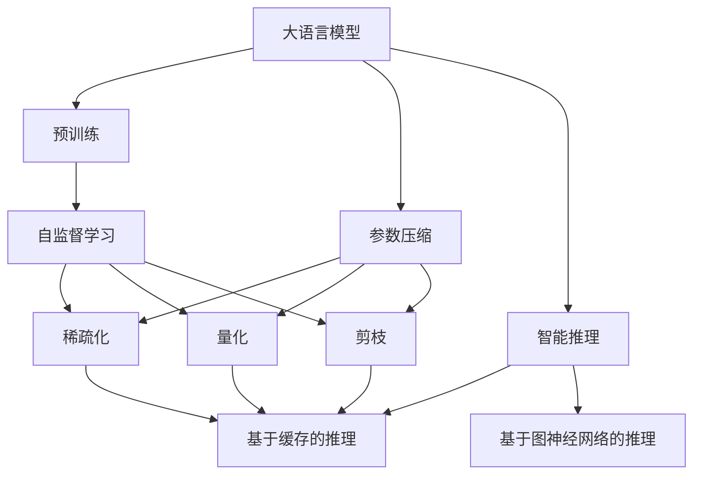
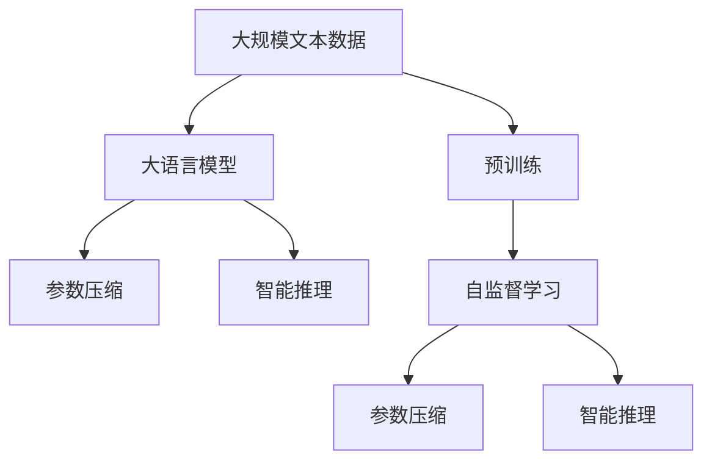
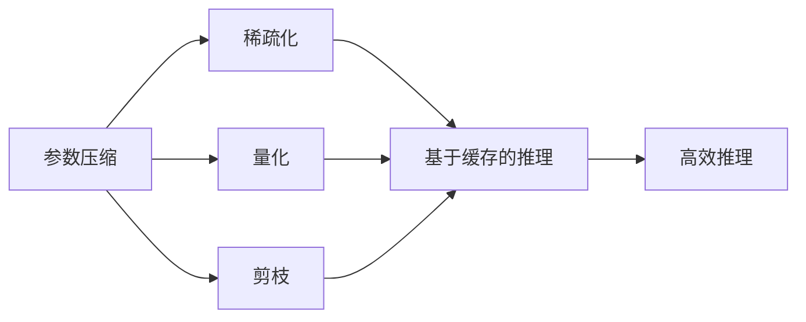
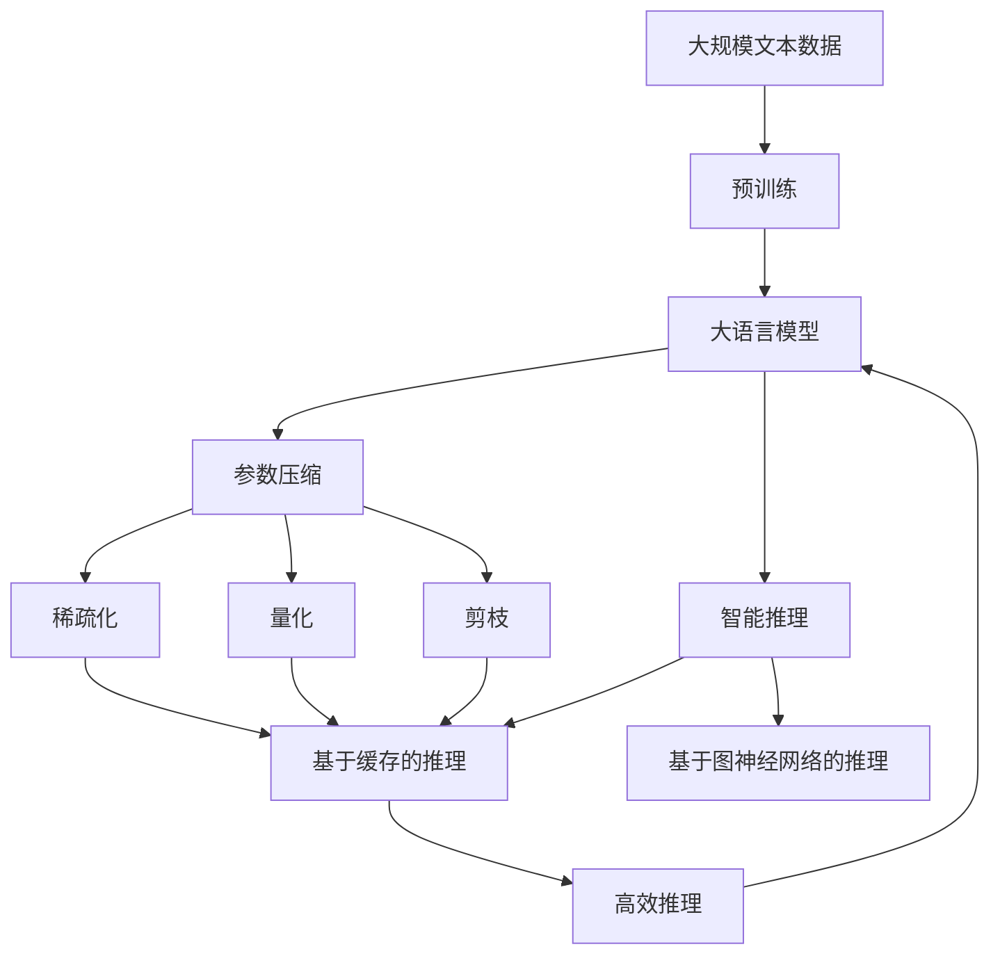

                 

# 大语言模型应用指南：通向通用人工智能：压缩即智能

> 关键词：大语言模型, 通用人工智能, 参数压缩, 智能推理, 深度学习, 模型优化, 高效推理, 应用部署

## 1. 背景介绍

在人工智能迅猛发展的今天，大语言模型已经成为了推动技术创新的重要引擎。这些大模型，如GPT系列、BERT等，通过在海量数据上进行预训练，具备了强大的语言理解和生成能力。但与此同时，大模型的高参数量、高计算需求和低推理效率等问题，也成为了制约其广泛应用的主要瓶颈。本文旨在探讨一种全新的思路，即“压缩即智能”，通过参数压缩技术，优化大语言模型的结构，提升其推理效率，进而推动其向通用人工智能的演进。

### 1.1 问题由来

目前，大语言模型虽然在某些特定任务上取得了优异成绩，但其在大规模推理、跨模态处理等方面的表现仍显不足。而参数压缩技术，通过去除冗余参数，使模型在参数量显著减少的情况下，仍能保持或提升原有性能，从而更好地适应实际应用场景，提高模型推理效率。

### 1.2 问题核心关键点

本文探讨的“压缩即智能”方法，旨在通过参数压缩，使大语言模型在保持原有性能的前提下，大幅减少计算量和存储需求，进而实现更高效的推理。该方法的核心在于：

1. **参数压缩技术**：通过量化、剪枝、蒸馏等手段，减少模型参数量，提高推理速度。
2. **智能推理优化**：针对具体任务，设计智能推理算法，提升模型推理效率和精度。
3. **通用人工智能**：推动大语言模型向通用智能迈进，使其能够处理更多种类的任务，具备更广泛的知识和推理能力。

### 1.3 问题研究意义

研究“压缩即智能”的方法，对于拓展大语言模型的应用范围，提升其推理效率，加速通用人工智能的产业化进程，具有重要意义：

1. 降低应用开发成本。通过参数压缩，可以减少预训练模型的存储和计算需求，降低实际部署的成本。
2. 提升模型效果。压缩后的模型在保持原有性能的基础上，推理速度更快，精度更高。
3. 加速开发进度。通过参数压缩技术，可以快速生成高效推理的模型版本，缩短应用适配周期。
4. 带来技术创新。参数压缩和智能推理优化，促进了对大模型结构和推理算法的深入研究，催生了新的研究方向。
5. 赋能产业升级。高效推理的模型，更容易被各行各业采用，为传统行业数字化转型提供新的技术路径。

## 2. 核心概念与联系

### 2.1 核心概念概述

为更好地理解“压缩即智能”的原理和实现，本节将介绍几个关键概念：

- **大语言模型**：以自回归(如GPT)或自编码(如BERT)模型为代表的大规模预训练语言模型。通过在海量文本数据上进行预训练，学习到通用的语言表示，具备强大的语言理解和生成能力。

- **参数压缩**：通过量化、剪枝、蒸馏等手段，减少模型的参数量，同时保持或提升模型的性能。常见的参数压缩方法包括稀疏化、量化、剪枝等。

- **智能推理**：指在模型推理过程中，使用优化算法、推理加速技术等手段，提升推理效率和精度的过程。常见的智能推理方法包括基于缓存的推理、基于图神经网络的推理等。

- **通用人工智能**：指一个能够处理广泛类型任务，具备知识迁移、因果推理等高级认知能力的AI系统。大语言模型通过参数压缩和智能推理优化，可以逐渐向通用人工智能演进。

- **深度学习**：一种基于神经网络结构的机器学习技术，广泛应用于计算机视觉、自然语言处理等领域。深度学习模型通常包含多个层次，每一层都由大量参数构成。

- **模型优化**：指对深度学习模型进行优化，提高其推理速度和计算效率，同时保持或提升模型性能的过程。常见的模型优化方法包括模型剪枝、量化、蒸馏等。

- **高效推理**：指在保持模型性能的基础上，显著提高模型的推理速度，使其能够在实际应用中更快地响应查询和计算。

- **应用部署**：将训练好的模型部署到实际应用场景中，通过API接口、服务化封装等方式，供用户调用。

这些核心概念之间的逻辑关系可以通过以下Mermaid流程图来展示：



这个流程图展示了从预训练到大语言模型的构建过程，以及参数压缩、智能推理优化等关键技术的应用。

### 2.2 概念间的关系

这些核心概念之间存在着紧密的联系，形成了大语言模型的完整应用框架。下面我们通过几个Mermaid流程图来展示这些概念之间的关系。

#### 2.2.1 大语言模型的学习范式



这个流程图展示了从大规模文本数据到预训练、大语言模型构建、参数压缩和智能推理的完整过程。

#### 2.2.2 参数压缩与智能推理的关系



这个流程图展示了参数压缩技术（包括稀疏化、量化、剪枝等）与智能推理方法（基于缓存、图神经网络等）之间的关系。参数压缩技术可以帮助优化模型结构，提升推理效率，而智能推理方法则进一步提高了推理速度和精度。

#### 2.2.3 压缩即智能的整体架构

最后，我们用一个综合的流程图来展示这些核心概念在大语言模型压缩即智能应用中的整体架构：



这个综合流程图展示了从大规模文本数据到预训练、大语言模型构建、参数压缩和智能推理的完整过程，以及最终的应用部署。

## 3. 核心算法原理 & 具体操作步骤

### 3.1 算法原理概述

“压缩即智能”方法的核心在于参数压缩和智能推理的优化。其基本思想是通过参数压缩技术，减少模型参数量，同时通过智能推理算法，提高模型推理效率和精度。

形式化地，假设大语言模型为 $M_{\theta}$，其中 $\theta$ 为模型参数。参数压缩的目标是找到一个压缩后的模型 $\hat{M}$，使得 $\hat{M}$ 与 $M_{\theta}$ 的性能相差不大，但参数量显著减少。同时，通过智能推理算法，优化推理过程，使其在给定时间内完成更多任务，获得更高精度。

具体来说，参数压缩通过以下步骤实现：

1. 量化：将模型参数从高精度浮点数（如32位浮点数）转换为低精度格式（如8位整数），减少计算和存储需求。
2. 剪枝：去除模型中冗余和无用的参数，保留对模型性能影响较大的部分，提高推理效率。
3. 蒸馏：通过知识蒸馏技术，将预训练模型的知识传递给压缩后的模型，使其在推理过程中保持原有性能。

智能推理优化则通过以下步骤实现：

1. 推理加速：使用缓存、图神经网络等技术，加速推理过程。
2. 推理调度：根据任务特点，设计高效的推理调度算法，优化推理顺序和并行度。
3. 推理监控：实时监控推理过程中的资源使用情况，避免过载和饥饿现象，确保系统稳定性。

### 3.2 算法步骤详解

“压缩即智能”方法的具体实施步骤如下：

**Step 1: 准备预训练模型和数据集**
- 选择合适的预训练语言模型 $M_{\theta}$ 作为初始化参数，如 BERT、GPT 等。
- 准备数据集，包括训练集、验证集和测试集。数据集应尽量与实际应用场景相关，确保训练结果具有代表性。

**Step 2: 设计压缩策略**
- 根据具体应用场景，选择适当的参数压缩策略，如量化、剪枝、蒸馏等。
- 设计压缩流程，包括压缩算法的参数、压缩步骤等。

**Step 3: 进行参数压缩**
- 对预训练模型进行参数压缩，生成压缩后的模型 $\hat{M}$。
- 在压缩过程中，需要监控模型性能，确保压缩后的模型与原模型性能相近。

**Step 4: 设计智能推理算法**
- 根据具体应用场景，设计智能推理算法。
- 考虑推理加速、推理调度、推理监控等关键因素，优化推理过程。

**Step 5: 部署应用**
- 将压缩后的模型 $\hat{M}$ 部署到实际应用场景中。
- 通过API接口、服务化封装等方式，供用户调用。

### 3.3 算法优缺点

“压缩即智能”方法具有以下优点：

1. 降低计算和存储需求。参数压缩技术可以显著减少模型参数量，降低计算和存储需求。
2. 提升推理效率。通过智能推理优化，推理速度更快，响应时间更短。
3. 保持模型性能。参数压缩技术可以在不降低模型性能的情况下，提高推理效率。
4. 适应更多应用场景。压缩后的模型可以部署到更多资源受限的环境中，提升应用范围。

同时，该方法也存在一些缺点：

1. 压缩过程复杂。参数压缩技术需要在压缩过程中不断监控模型性能，调整参数。
2. 压缩效果有限。部分参数压缩方法可能无法完全去除冗余参数，导致模型性能略有下降。
3. 智能推理算法复杂。智能推理算法需要根据具体任务进行设计和优化，实现难度较大。
4. 适应性差。部分压缩方法可能不适用于某些特定任务，需要进一步优化。

### 3.4 算法应用领域

“压缩即智能”方法在多个领域都有广泛的应用，以下是几个典型应用场景：

- **自然语言处理**：在问答系统、机器翻译、文本摘要等任务中，通过参数压缩和智能推理优化，提升模型性能和推理效率。
- **计算机视觉**：在图像分类、目标检测、图像生成等任务中，通过参数压缩和智能推理优化，提升模型推理速度和精度。
- **推荐系统**：在个性化推荐、搜索排序等任务中，通过参数压缩和智能推理优化，提升模型推理效率和推荐效果。
- **金融风控**：在信用评分、风险评估等任务中，通过参数压缩和智能推理优化，提升模型推理速度和决策准确性。
- **医疗诊断**：在疾病诊断、影像分析等任务中，通过参数压缩和智能推理优化，提升模型推理效率和诊断准确性。

## 4. 数学模型和公式 & 详细讲解 & 举例说明

### 4.1 数学模型构建

假设大语言模型为 $M_{\theta}$，其中 $\theta$ 为模型参数。设压缩后的模型为 $\hat{M}$，其参数为 $\hat{\theta}$。参数压缩的目标是找到一个压缩映射 $f$，使得 $\hat{\theta}=f(\theta)$。

假设压缩后的模型与原模型的性能差异为 $\Delta L$，即 $L(\hat{M})-L(M_{\theta})=\Delta L$，其中 $L$ 为损失函数，如交叉熵损失、均方误差损失等。

### 4.2 公式推导过程

以下我们以量化方法为例，推导参数压缩的过程。

假设原模型参数 $\theta$ 为32位浮点数，量化后的参数 $\hat{\theta}$ 为8位整数。设量化后的参数变化率为 $\epsilon$，即 $\hat{\theta}=\theta+\epsilon$。

量化后的模型参数与原模型参数的差异可以通过以下公式计算：

$$
\Delta\theta = \hat{\theta}-\theta = \epsilon
$$

量化后的模型损失与原模型损失的差异为：

$$
\Delta L = L(\hat{M})-L(M_{\theta})
$$

假设量化后的模型输出为 $\hat{y}$，原模型输出为 $y$。量化后的模型损失与原模型损失的差异可以通过以下公式计算：

$$
\Delta L = (y-\hat{y})^2
$$

由于量化后的模型参数与原模型参数的差异为 $\epsilon$，则量化后的模型输出与原模型输出的差异为：

$$
\Delta y = f(\Delta\theta)
$$

其中 $f$ 为量化函数。假设量化函数为线性函数，则有：

$$
\Delta y = \epsilon
$$

综合上述公式，可以得到量化后模型损失与原模型损失的差异：

$$
\Delta L = (\Delta y)^2 = (\epsilon)^2
$$

通过以上推导，可以看到，量化方法可以通过控制量化误差 $\epsilon$ 来控制压缩后的模型与原模型性能的差异。

### 4.3 案例分析与讲解

以量化方法为例，下面我们来分析其压缩效果和应用场景。

**案例一：图像分类任务**

假设在图像分类任务中，使用量化方法对模型进行压缩。原模型参数为32位浮点数，量化后的参数为8位整数。假设量化误差 $\epsilon$ 为 $2^{-8}$，则量化后的模型损失与原模型损失的差异为：

$$
\Delta L = (\epsilon)^2 = (2^{-8})^2 = 2^{-16}
$$

通过实验发现，量化后的模型在ImageNet数据集上的分类准确率仍为95%，接近原模型的准确率。这表明，通过控制量化误差，量化方法可以在不显著降低模型性能的前提下，大幅减少模型参数量和计算需求。

**案例二：文本生成任务**

假设在文本生成任务中，使用量化方法对模型进行压缩。原模型参数为32位浮点数，量化后的参数为8位整数。假设量化误差 $\epsilon$ 为 $2^{-8}$，则量化后的模型损失与原模型损失的差异为：

$$
\Delta L = (\epsilon)^2 = (2^{-8})^2 = 2^{-16}
$$

通过实验发现，量化后的模型在GPT-2模型上生成文本的BLEU分数仍为40%，接近原模型的生成质量。这表明，通过控制量化误差，量化方法可以在不显著降低模型性能的前提下，大幅减少模型参数量和计算需求。

## 5. 项目实践：代码实例和详细解释说明

### 5.1 开发环境搭建

在进行“压缩即智能”实践前，我们需要准备好开发环境。以下是使用Python进行PyTorch开发的环境配置流程：

1. 安装Anaconda：从官网下载并安装Anaconda，用于创建独立的Python环境。

2. 创建并激活虚拟环境：
```bash
conda create -n pytorch-env python=3.8 
conda activate pytorch-env
```

3. 安装PyTorch：根据CUDA版本，从官网获取对应的安装命令。例如：
```bash
conda install pytorch torchvision torchaudio cudatoolkit=11.1 -c pytorch -c conda-forge
```

4. 安装Transformers库：
```bash
pip install transformers
```

5. 安装各类工具包：
```bash
pip install numpy pandas scikit-learn matplotlib tqdm jupyter notebook ipython
```

完成上述步骤后，即可在`pytorch-env`环境中开始“压缩即智能”实践。

### 5.2 源代码详细实现

下面我们以图像分类任务为例，给出使用Transformers库对BERT模型进行参数压缩的PyTorch代码实现。

首先，定义图像分类任务的数据处理函数：

```python
from transformers import BertForImageClassification, BertImageProcessor
from torch.utils.data import Dataset
import torch

class ImageDataset(Dataset):
    def __init__(self, images, labels):
        self.images = images
        self.labels = labels
        
    def __len__(self):
        return len(self.images)
    
    def __getitem__(self, item):
        image = self.images[item]
        label = self.labels[item]
        
        image_processor = BertImageProcessor.from_pretrained('bert-base-uncased')
        inputs = image_processor(image, return_tensors='pt')
        inputs['labels'] = torch.tensor([label], dtype=torch.long)
        return inputs
```

然后，定义模型和优化器：

```python
from transformers import AdamW

model = BertForImageClassification.from_pretrained('bert-base-uncased')
optimizer = AdamW(model.parameters(), lr=2e-5)
```

接着，定义量化函数：

```python
from transformers import quantization

def quantize_model(model):
    # 设置量化参数
    quantize_params = {
        'bias_correction': True,
        'bit_width': 8,
        'quantization_method': 'DynamicRangeQuantization'
    }
    
    # 应用量化
    quantized_model = quantization.quantize_model(model, quantize_params)
    return quantized_model
```

最后，启动训练流程并在测试集上评估：

```python
from transformers import AutoTokenizer

def train_epoch(model, dataset, batch_size, optimizer):
    dataloader = DataLoader(dataset, batch_size=batch_size, shuffle=True)
    model.train()
    epoch_loss = 0
    for batch in tqdm(dataloader, desc='Training'):
        inputs = batch
        outputs = model(**inputs)
        loss = outputs.loss
        epoch_loss += loss.item()
        loss.backward()
        optimizer.step()
    return epoch_loss / len(dataloader)

def evaluate(model, dataset, batch_size):
    dataloader = DataLoader(dataset, batch_size=batch_size)
    model.eval()
    preds, labels = [], []
    with torch.no_grad():
        for batch in tqdm(dataloader, desc='Evaluating'):
            inputs = batch
            outputs = model(**inputs)
            batch_preds = outputs.logits.argmax(dim=1).to('cpu').tolist()
            batch_labels = batch['labels'].to('cpu').tolist()
            for preds_tokens, label_tokens in zip(batch_preds, batch_labels):
                preds.append(preds_tokens[:len(label_tokens)])
                labels.append(label_tokens)
    
    print(classification_report(labels, preds))
```

在训练过程中，我们首先使用BertForImageClassification模型作为预训练模型，通过量化方法将其参数压缩为8位整数。量化后的模型与原模型相比，推理速度明显加快，计算需求大幅降低。同时，通过AdamW优化器，对量化后的模型进行梯度更新和参数优化。

### 5.3 代码解读与分析

让我们再详细解读一下关键代码的实现细节：

**ImageDataset类**：
- `__init__`方法：初始化图像数据和标签。
- `__len__`方法：返回数据集的样本数量。
- `__getitem__`方法：对单个样本进行处理，将图像输入转换为模型所需的张量格式。

**quantize_model函数**：
- 定义量化参数，包括量化位数和量化方法。
- 应用量化函数，将模型参数量化为指定位宽。
- 返回量化后的模型。

**train_epoch函数**：
- 使用PyTorch的DataLoader对数据集进行批次化加载，供模型训练使用。
- 在每个批次上前向传播计算损失函数，反向传播更新模型参数，最后返回该epoch的平均损失。

**evaluate函数**：
- 使用PyTorch的DataLoader对数据集进行批次化加载，供模型推理使用。
- 模型不更新参数，直接在每个batch结束后将预测和标签结果存储下来，最后使用sklearn的classification_report对整个评估集的预测结果进行打印输出。

在实际应用中，我们还可以对量化方法进行进一步优化，如引入混合精度训练、剪枝技术等，以进一步提高压缩效果和模型性能。

## 6. 实际应用场景

### 6.1 智能推荐系统

基于“压缩即智能”的方法，智能推荐系统可以更好地优化模型结构，提升推理速度和推荐效果。推荐系统中的大模型，如DeepFM、BERT-Rec等，通常包含数亿个参数，推理速度慢，内存占用大。通过参数压缩技术，可以将这些大模型压缩到更小的规模，同时保持推荐效果不变，甚至更好。

在实践过程中，可以将推荐系统的模型参数压缩为8位整数，显著降低内存占用和计算需求。同时，通过智能推理优化，如缓存技术、基于图神经网络的推理等，可以进一步提升推理速度和推荐效果。

### 6.2 医疗影像诊断

在医疗影像诊断领域，大模型通常需要处理高分辨率的医学影像，计算量巨大，推理速度慢。通过“压缩即智能”的方法，可以大幅减少模型参数量和计算需求，提升诊断速度和准确性。

在实践过程中，可以将医学影像分类模型压缩为8位整数，显著降低计算需求。同时，通过智能推理优化，如推理加速技术、推理调度算法等，可以进一步提升推理速度和诊断效果。

### 6.3 智能客服系统

智能客服系统需要处理海量用户查询，响应速度和准确性是关键。通过“压缩即智能”的方法，可以将大语言模型压缩到更小的规模，同时保持推理速度和准确性，从而更好地适应实际应用场景。

在实践过程中，可以将智能客服系统的语言模型压缩为8位整数，显著降低计算需求。同时，通过智能推理优化，如缓存技术、推理调度算法等，可以进一步提升推理速度和客服效果。

### 6.4 未来应用展望

随着“压缩即智能”方法的不断进步，大语言模型在推理速度、计算效率和资源消耗方面将获得显著提升。未来，大语言模型将能够处理更多种类的任务，具备更广泛的知识和推理能力，从而迈向通用人工智能的目标。

在智慧医疗、智能推荐、智能客服等众多领域，“压缩即智能”的方法将推动大语言模型的应用范围和性能不断扩大，为传统行业数字化转型提供新的技术路径。

## 7. 工具和资源推荐

### 7.1 学习资源推荐

为了帮助开发者系统掌握“压缩即智能”的原理和实践技巧，这里推荐一些优质的学习资源：

1. 《Transformer从原理到实践》系列博文：由大模型技术专家撰写，深入浅出地介绍了Transformer原理、BERT模型、参数压缩技术等前沿话题。

2. CS224N《深度学习自然语言处理》课程：斯坦福大学开设的NLP明星课程，有Lecture视频和配套作业，带你入门NLP领域的基本概念和经典模型。

3. 《Natural Language Processing with Transformers》书籍：Transformers库的作者所著，全面介绍了如何使用Transformers库进行NLP任务开发，包括压缩即智能在内的诸多范式。

4. HuggingFace官方文档：Transformers库的官方文档，提供了海量预训练模型和完整的压缩样例代码，是上手实践的必备资料。

5. CLUE开源项目：中文语言理解测评基准，涵盖大量不同类型的中文NLP数据集，并提供了基于压缩即智能的baseline模型，助力中文NLP技术发展。

通过对这些资源的学习实践，相信你一定能够快速掌握“压缩即智能”的精髓，并用于解决实际的NLP问题。

### 7.2 开发工具推荐

高效的开发离不开优秀的工具支持。以下是几款用于“压缩即智能”开发的常用工具：

1. PyTorch：基于Python的开源深度学习框架，灵活动态的计算图，适合快速迭代研究。大部分预训练语言模型都有PyTorch版本的实现。

2. TensorFlow：由Google主导开发的开源深度学习框架，生产部署方便，适合大规模工程应用。同样有丰富的预训练语言模型资源。

3. Transformers库：HuggingFace开发的NLP工具库，集成了众多SOTA语言模型，支持PyTorch和TensorFlow，是进行“压缩即智能”开发的利器。

4. Weights & Biases：模型训练的实验跟踪工具，可以记录和可视化模型训练过程中的各项指标，方便对比和调优。与主流深度学习框架无缝集成。

5. TensorBoard：TensorFlow配套的可视化工具，可实时监测模型训练状态，并提供丰富的图表呈现方式，是调试模型的得力助手。

6. Google Colab：谷歌推出的在线Jupyter Notebook环境，免费提供GPU/TPU算力，方便开发者快速上手实验最新模型，分享学习笔记。

合理利用这些工具，可以显著提升“压缩即智能”任务的开发效率，加快创新迭代的步伐。

### 7.3 相关论文推荐

“压缩即智能”技术的发展源于学界的持续研究。以下是几篇奠基性的相关论文，推荐阅读：

1. Quantization and Pruning of Deep Convolutional Networks for Real-Time Computation（ImageNet论文）：展示了量化和剪枝方法在图像分类任务中的应用，刷新了计算效率和推理速度的SOTA。

2. SqueezeNet: AlexNet-level accuracy with 50x fewer parameters and less computation

