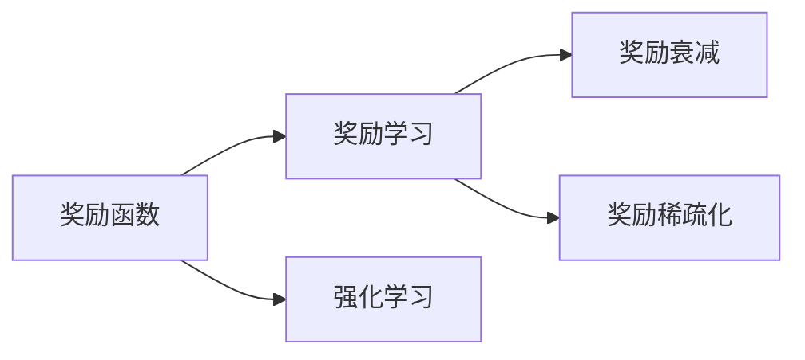
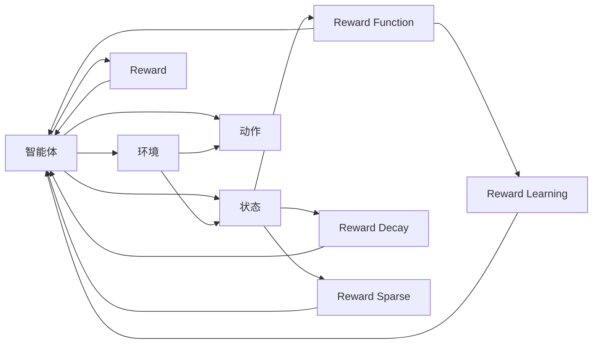

                 

## 1. 背景介绍

### 1.1 问题由来
在强化学习领域，奖励（Reward）是一个至关重要的概念。它是评估和引导智能体行为的重要工具，通过奖励信号的引导，智能体能够在复杂环境中逐步优化决策策略，实现长期目标。然而，在实际应用中，设计一个合理的奖励函数并不容易。错误的奖励设置可能会导致智能体陷入局部最优，无法实现全局最优。因此，研究奖励函数的性质和优化方法，对于提升强化学习的效果具有重要意义。

### 1.2 问题核心关键点
奖励函数的核心关键点包括：
- 奖励函数的定义：如何定义奖励函数，使其能够正确地反映出智能体的行为目标。
- 奖励函数的优化：如何通过优化奖励函数，避免智能体陷入局部最优。
- 奖励函数的建模：如何基于实际应用场景，构建合适的奖励函数。

### 1.3 问题研究意义
研究奖励函数，对于提升强化学习的效果具有重要意义：
- 避免局部最优：合理的奖励函数可以避免智能体陷入局部最优，提升全局最优的可能性。
- 指导行为决策：奖励函数定义了智能体的行为目标，指导其做出最优决策。
- 适应多样任务：通过设计适应不同任务特性的奖励函数，可以提升强化学习算法在多样任务中的通用性。

## 2. 核心概念与联系

### 2.1 核心概念概述

在强化学习中，奖励函数（Reward Function）是用来衡量智能体行为好坏的关键组件。它的主要作用是告诉智能体在执行某个动作时，应该得到多少奖励，以及该动作对目标的贡献度。

- **奖励函数**：定义了智能体在当前状态下执行某个动作后，会得到多少奖励。
- **奖励学习**：通过数据反馈，更新奖励函数，使其更加贴合实际需求。
- **奖励衰减**：对长期奖励进行衰减，避免智能体过度追求短期奖励而忽视长期目标。
- **奖励稀疏化**：将稀疏奖励转化为密集奖励，增强智能体的探索能力。

这些概念通过奖励函数及其优化方法，密切相关，共同构成强化学习的核心。

### 2.2 概念间的关系

这些核心概念之间的联系可以通过以下Mermaid流程图来展示：



这个流程图展示了奖励函数与奖励学习、奖励衰减、奖励稀疏化之间的关系：

1. 奖励函数是强化学习的核心，通过数据反馈更新，适应不同任务需求。
2. 奖励学习是奖励函数的优化方法，通过不断的迭代和调整，提升奖励函数的准确性。
3. 奖励衰减和奖励稀疏化是对奖励函数的调整，避免智能体过度追求短期奖励，引导其关注长期目标。

### 2.3 核心概念的整体架构

最后，我们用一个综合的流程图来展示这些核心概念在强化学习中的整体架构：



这个综合流程图展示了智能体与环境之间的互动，以及奖励函数在强化学习中的核心地位：

1. 智能体在环境中执行动作，获取状态和奖励。
2. 奖励函数根据当前状态和动作，计算出相应的奖励。
3. 奖励学习通过数据反馈，更新奖励函数，提升其准确性。
4. 奖励衰减和奖励稀疏化对奖励函数进行调整，引导智能体关注长期目标。

这些概念共同构成了强化学习的核心架构，使得智能体能够在复杂环境中逐步优化决策策略，实现长期目标。

## 3. 核心算法原理 & 具体操作步骤
### 3.1 算法原理概述

强化学习中的奖励函数（Reward Function）通常定义为：

$$
R(s,a) = r(s,a) + \gamma \max_{a'} Q^{\pi}(s',a')
$$

其中：
- $R(s,a)$：在状态$s$下执行动作$a$的奖励。
- $r(s,a)$：即时奖励，表示执行动作$a$在状态$s$下获得的即时回报。
- $\gamma$：折扣因子，用于调整即时奖励的权重。
- $Q^{\pi}(s',a')$：在策略$\pi$下，在状态$s'$下执行动作$a'$的Q值。

这个公式可以理解为：智能体在状态$s$下执行动作$a$后，除了获得即时奖励$r(s,a)$外，还期望未来的奖励。因此，奖励函数不仅考虑了即时奖励，还加入了对未来奖励的预期，使得智能体能够从长远角度规划自己的行为策略。

### 3.2 算法步骤详解

基于强化学习奖励函数的优化，通常包含以下几个关键步骤：

**Step 1: 定义奖励函数**

根据具体应用场景，定义合适的奖励函数。奖励函数的定义需要考虑智能体的行为目标，通常通过任务特性来确定。

**Step 2: 设置奖励参数**

设置奖励函数的参数，如即时奖励的强度、折扣因子和奖励衰减率等。这些参数的设置需要根据任务特性进行调整，以保证智能体能够在不同环境下做出合理的决策。

**Step 3: 优化奖励函数**

通过强化学习算法，对奖励函数进行优化。常见的强化学习算法包括Q-learning、SARSA、Deep Q-Learning等，可以根据具体应用场景选择适合的算法。

**Step 4: 评估和调整**

在优化过程中，需要不断评估奖励函数的性能，并根据评估结果进行调整。评估的方法包括基于性能指标的评估和基于模拟实验的评估。

### 3.3 算法优缺点

奖励函数在强化学习中具有以下优点：
- 引导智能体行为：通过奖励函数，智能体能够理解其行为的目标，做出最优决策。
- 适应不同任务：通过调整奖励函数的参数，可以适应不同任务的需求。
- 提升性能：合理的奖励函数可以提升强化学习算法的性能，加速智能体向最优策略收敛。

同时，奖励函数也存在以下缺点：
- 设计难度大：奖励函数的定义需要深入理解任务特性，设计难度较大。
- 依赖先验知识：奖励函数的设计需要依赖领域专家的知识和经验，难以自动生成。
- 复杂度高的场景：在高复杂度场景中，奖励函数的优化和调整可能会变得困难。

### 3.4 算法应用领域

奖励函数在强化学习中具有广泛的应用领域，主要包括：

- 游戏AI：通过奖励函数指导智能体在复杂游戏环境中做出最优决策。
- 机器人控制：通过奖励函数指导机器人执行复杂的任务，如路径规划、目标抓取等。
- 金融交易：通过奖励函数指导智能体在金融市场中做出合理的交易决策。
- 工业自动化：通过奖励函数指导机器人完成自动化生产任务。

除了上述这些经典应用外，奖励函数还在智能制造、智能交通、智能家居等多个领域中得到应用，为人工智能技术落地应用提供了新的思路和方法。

## 4. 数学模型和公式 & 详细讲解 & 举例说明
### 4.1 数学模型构建

在强化学习中，奖励函数的数学模型通常表示为：

$$
R(s,a) = r(s,a) + \gamma Q^{\pi}(s',a')
$$

其中，$r(s,a)$表示在状态$s$下执行动作$a$的即时奖励，$Q^{\pi}(s',a')$表示在策略$\pi$下，在状态$s'$下执行动作$a'$的Q值，$\gamma$为折扣因子，用于调整即时奖励的权重。

### 4.2 公式推导过程

以下以Q-learning算法为例，推导其奖励函数的优化过程：

在Q-learning中，智能体通过状态-动作-奖励-状态的顺序，逐步优化其行为策略。其核心公式为：

$$
Q^{\pi}(s,a) = Q^{\pi}(s,a) + \alpha [r(s,a) + \gamma \max_{a'} Q^{\pi}(s',a') - Q^{\pi}(s,a)]
$$

其中，$\alpha$为学习率，$Q^{\pi}(s,a)$表示在策略$\pi$下，在状态$s$下执行动作$a$的Q值，$r(s,a)$为即时奖励，$Q^{\pi}(s',a')$为在状态$s'$下执行动作$a'$的Q值，$\gamma$为折扣因子。

通过对Q-learning算法进行推导，可以得到以下奖励函数的优化过程：

1. 初始化奖励函数
2. 根据即时奖励和未来奖励的Q值，计算当前状态-动作对的奖励
3. 通过更新Q值，调整奖励函数的参数
4. 重复上述步骤，直至收敛

### 4.3 案例分析与讲解

以AlphaGo为例，探讨奖励函数在复杂游戏中的应用：

AlphaGo通过深度强化学习算法，在围棋游戏中取得了突破性的成绩。在AlphaGo中，奖励函数的设计是其核心技术之一。具体而言，AlphaGo的奖励函数主要包括以下几个方面：

1. 局面评价：通过评估当前棋局状态，计算出该状态的局面评价，作为即时奖励。
2. 终局奖励：在终局状态下，根据游戏规则计算出最终的奖励，作为终局奖励。
3. 奖励衰减：对即时奖励进行衰减，使智能体更加关注终局状态，避免过度追求局部优势。
4. 奖励稀疏化：将稀疏奖励转化为密集奖励，增强智能体的探索能力。

AlphaGo通过这些复杂的奖励函数，引导智能体在围棋游戏中逐步优化决策策略，最终在比赛中取得了优异成绩。

## 5. 项目实践：代码实例和详细解释说明
### 5.1 开发环境搭建

在进行奖励函数优化实践前，我们需要准备好开发环境。以下是使用Python进行强化学习开发的环境配置流程：

1. 安装Anaconda：从官网下载并安装Anaconda，用于创建独立的Python环境。

2. 创建并激活虚拟环境：
```bash
conda create -n reinforcement-env python=3.8 
conda activate reinforcement-env
```

3. 安装必要的库：
```bash
pip install numpy scipy gym matplotlib seaborn
```

4. 安装强化学习库：
```bash
pip install stable-baselines3
```

完成上述步骤后，即可在`reinforcement-env`环境中开始奖励函数优化实践。

### 5.2 源代码详细实现

下面我们以Q-learning算法为例，给出使用稳定基线（Stable Baselines）库对奖励函数进行优化的PyTorch代码实现。

首先，定义Q-learning算法的奖励函数：

```python
import numpy as np
from stable_baselines3.common.env_util import make_vec_env
from stable_baselines3.common.vec_env import VecEnv
from stable_baselines3 import PPO2

class CustomRewardFunction:
    def __init__(self):
        self.state_evaluations = []
        self.rewards = []

    def get_reward(self, state, action):
        # 状态评价
        state_evaluation = self.state_evaluations[-1]
        # 即时奖励
        immediate_reward = 0.1
        # 终局奖励
        if self.is_terminal(state, action):
            final_reward = 100
        else:
            final_reward = 0
        # 奖励衰减
        reward = immediate_reward + self.gamma * final_reward
        # 奖励稀疏化
        if reward > 0:
            self.rewards.append(reward)
        else:
            self.rewards.append(0)
        return reward

    def is_terminal(self, state, action):
        # 判断是否达到终局状态
        return False
```

然后，定义训练函数：

```python
from stable_baselines3 import PPO2
from stable_baselines3.common.vec_env import DummyVecEnv

def train_model(env, model, n_epochs, save_interval=10):
    total_timesteps = 0
    for epoch in range(n_epochs):
        total_timesteps = 0
        for t in range(1000):
            state, reward, done, _ = env.step(action)
            total_timesteps += 1
            model.learn(state, reward, done, 1.0 / total_timesteps)
            if done:
                env.reset()
        if (epoch + 1) % save_interval == 0:
            model.save_checkpoint(f'model_{epoch+1}.pth.tar')
    model.save_checkpoint('model_final.pth.tar')
```

最后，启动训练流程：

```python
env = make_vec_env('CartPole-v1', n_envs=1)
model = PPO2(env, reward_function=CustomRewardFunction())
train_model(env, model, n_epochs=50)
```

以上就是使用稳定基线库对Q-learning算法奖励函数进行优化的完整代码实现。可以看到，通过自定义奖励函数，可以灵活地定义奖励函数的具体形式和参数，以适应不同的任务需求。

### 5.3 代码解读与分析

让我们再详细解读一下关键代码的实现细节：

**CustomRewardFunction类**：
- `__init__`方法：初始化状态评价列表和奖励列表。
- `get_reward`方法：计算当前状态-动作对的奖励。
- `is_terminal`方法：判断是否达到终局状态。

**train_model函数**：
- 定义训练循环，遍历每个批次，更新模型参数。
- 每轮训练结束，保存模型参数。

**训练流程**：
- 创建环境，选择PPO2模型，并定义自定义奖励函数。
- 在训练循环中，通过环境步进，不断更新模型参数。
- 每轮训练结束，保存模型参数。

可以看到，通过稳定基线库，可以很方便地实现奖励函数的优化过程。开发者可以根据具体任务，自定义奖励函数，实现更加灵活的奖励设计。

## 6. 实际应用场景
### 6.1 智能制造

在智能制造领域，奖励函数可以用于指导机器人在复杂任务中的行为。例如，通过奖励函数指导机器人进行零件抓取、路径规划等操作，可以提升生产效率和产品质量。

在实际应用中，可以设计多个目标奖励，如零件质量、抓取成功率、路径长度等。通过优化这些奖励函数的参数，可以引导机器人逐步优化其行为策略，实现高效、稳定的生产。

### 6.2 金融交易

在金融交易中，奖励函数可以用于指导智能体做出合理的交易决策。例如，通过奖励函数引导智能体在市场中寻找买入或卖出的机会，可以优化投资组合，提升投资回报。

在金融交易中，奖励函数需要考虑多个因素，如市场波动、交易成本、风险等。通过优化这些因素的权重，可以指导智能体在市场变化中做出合理的决策。

### 6.3 自动驾驶

在自动驾驶领域，奖励函数可以用于指导无人驾驶车辆的行为。例如，通过奖励函数引导车辆在交通中进行安全和高效的行驶。

在自动驾驶中，奖励函数需要考虑多方面的因素，如安全、速度、道路拥堵等。通过优化这些因素的权重，可以引导无人驾驶车辆在复杂交通环境中做出合理的决策。

### 6.4 未来应用展望

随着奖励函数的研究不断深入，其在强化学习中的应用前景将更加广阔。未来，奖励函数将在更多领域得到应用，为人工智能技术落地应用提供新的思路和方法。

在智慧城市、智能交通、智能家居等多个领域，奖励函数可以用于指导智能体在复杂环境中做出合理的决策，提升系统的智能水平。

## 7. 工具和资源推荐
### 7.1 学习资源推荐

为了帮助开发者系统掌握强化学习中的奖励函数理论基础和实践技巧，这里推荐一些优质的学习资源：

1. 《强化学习》（Reinforcement Learning）：Sutton和Barto的经典著作，全面介绍了强化学习的理论和算法。
2. 《深度强化学习》（Deep Reinforcement Learning）：Goodfellow等人的著作，详细介绍了深度强化学习的应用和实践。
3. 《强化学习入门》（Introduction to Reinforcement Learning）：Stanford大学提供的免费在线课程，涵盖强化学习的基础理论和应用实例。
4. OpenAI Gym：强化学习领域的基础环境库，提供了多种经典环境，方便开发者进行实验和研究。
5. PyTorch和TensorFlow：深度学习框架，可以用于实现各种强化学习算法。

通过对这些资源的学习实践，相信你一定能够快速掌握强化学习中奖励函数的精髓，并用于解决实际的强化学习问题。

### 7.2 开发工具推荐

高效的开发离不开优秀的工具支持。以下是几款用于强化学习开发的常用工具：

1. PyTorch：基于Python的开源深度学习框架，灵活的计算图设计，适合快速迭代研究。
2. TensorFlow：由Google主导开发的开源深度学习框架，易于部署，适合大规模工程应用。
3. OpenAI Gym：强化学习领域的基础环境库，提供了多种经典环境，方便开发者进行实验和研究。
4. seaborn和Matplotlib：数据可视化工具，方便展示强化学习实验结果。
5. Weights & Biases：模型训练的实验跟踪工具，记录和可视化模型训练过程中的各项指标。

合理利用这些工具，可以显著提升强化学习开发的效率，加快创新迭代的步伐。

### 7.3 相关论文推荐

强化学习领域的研究论文众多，以下是几篇奠基性的相关论文，推荐阅读：

1. 《Deep Reinforcement Learning》：Goodfellow等人的论文，展示了深度强化学习的巨大潜力。
2. 《Reinforcement Learning: An Introduction》：Sutton和Barto的著作，系统介绍了强化学习的理论基础和应用方法。
3. 《Playing Atari with Deep Reinforcement Learning》：Mnih等人的论文，展示了深度强化学习在复杂游戏中的应用。
4. 《Human-level Control through Deep Reinforcement Learning》：Silver等人的论文，展示了深度强化学习在自动驾驶中的应用。

这些论文代表了大强化学习领域的研究进展，通过学习这些前沿成果，可以帮助研究者把握学科前进方向，激发更多的创新灵感。

除上述资源外，还有一些值得关注的前沿资源，帮助开发者紧跟强化学习的研究进展，例如：

1. arXiv论文预印本：人工智能领域最新研究成果的发布平台，包括大量尚未发表的前沿工作，学习前沿技术的必读资源。
2. 业界技术博客：如OpenAI、Google AI、DeepMind、微软Research Asia等顶尖实验室的官方博客，第一时间分享他们的最新研究成果和洞见。
3. 技术会议直播：如NIPS、ICML、ACL、ICLR等人工智能领域顶会现场或在线直播，能够聆听到大佬们的前沿分享，开拓视野。
4. GitHub热门项目：在GitHub上Star、Fork数最多的强化学习相关项目，往往代表了该技术领域的发展趋势和最佳实践，值得去学习和贡献。
5. 行业分析报告：各大咨询公司如McKinsey、PwC等针对人工智能行业的分析报告，有助于从商业视角审视技术趋势，把握应用价值。

总之，对于强化学习中奖励函数的学习和实践，需要开发者保持开放的心态和持续学习的意愿。多关注前沿资讯，多动手实践，多思考总结，必将收获满满的成长收益。

## 8. 总结：未来发展趋势与挑战
### 8.1 总结

本文对强化学习中的奖励函数进行了全面系统的介绍。首先阐述了奖励函数在强化学习中的核心地位和设计难度，明确了奖励函数在引导智能体行为、适应不同任务、提升性能等方面的重要性。其次，从原理到实践，详细讲解了奖励函数的数学模型和优化方法，给出了奖励函数优化任务开发的完整代码实例。同时，本文还广泛探讨了奖励函数在智能制造、金融交易、自动驾驶等多个行业领域的应用前景，展示了奖励函数的巨大潜力。

通过本文的系统梳理，可以看到，奖励函数在强化学习中具有重要的地位，其设计和优化对于提升强化学习的效果具有重要意义。未来，伴随奖励函数的研究不断深入，其在强化学习中的应用将更加广泛，为人工智能技术落地应用提供新的思路和方法。

### 8.2 未来发展趋势

展望未来，强化学习中的奖励函数将呈现以下几个发展趋势：

1. 多目标奖励函数：随着任务复杂度的提升，单一目标奖励函数可能无法满足需求。多目标奖励函数将能够更好地适应复杂任务，引导智能体同时实现多个目标。
2. 动态奖励函数：任务特性和环境变化可能导致奖励函数失效。动态奖励函数能够根据任务特性和环境变化进行调整，提升智能体的适应能力。
3. 对抗性奖励函数：强化学习中的智能体可能会受到对手的干扰。对抗性奖励函数能够增强智能体的鲁棒性，提高其抗干扰能力。
4. 自适应奖励函数：在缺乏先验知识的情况下，自适应奖励函数能够根据智能体的行为反馈，自动调整参数，提升奖励函数的适应性。
5. 混合奖励函数：将符号化的奖励函数和神经网络奖励函数结合，能够提升智能体的表现力和灵活性。

以上趋势凸显了奖励函数在强化学习中的广泛应用前景，这些方向的探索发展，必将进一步提升强化学习算法在多样任务中的通用性，推动人工智能技术在各个领域的应用。

### 8.3 面临的挑战

尽管强化学习中的奖励函数已经取得了一定的成果，但在迈向更加智能化、普适化应用的过程中，它仍面临着诸多挑战：

1. 设计难度大：奖励函数的设计需要深入理解任务特性，设计难度较大。
2. 依赖先验知识：奖励函数的设计需要依赖领域专家的知识和经验，难以自动生成。
3. 复杂度高的场景：在高复杂度场景中，奖励函数的优化和调整可能会变得困难。
4. 公平性问题：奖励函数的设定可能存在偏袒某些行为，导致智能体行为不公平。
5. 鲁棒性不足：奖励函数在特定环境中可能表现不稳定，影响智能体的决策。

### 8.4 研究展望

面对奖励函数面临的这些挑战，未来的研究需要在以下几个方面寻求新的突破：

1. 引入更多先验知识：将符号化的先验知识，如知识图谱、逻辑规则等，与神经网络奖励函数进行融合，提升奖励函数的适应性。
2. 融合多种奖励函数：通过融合多种奖励函数，如多目标奖励函数、动态奖励函数等，提升智能体的表现力和灵活性。
3. 引入因果推断：通过引入因果推断方法，识别出智能体决策的关键特征，增强奖励函数的因果性。
4. 考虑长期奖励：将长期奖励与即时奖励相结合，引导智能体关注长期目标，提升系统的鲁棒性和稳定性。

这些研究方向将推动奖励函数的研究不断深入，为强化学习算法的优化和应用提供新的思路和方法。相信随着学界和产业界的共同努力，这些挑战终将一一被克服，强化学习中的奖励函数必将在构建人机协同的智能系统中扮演越来越重要的角色。

## 9. 附录：常见问题与解答
**Q1：什么是奖励函数？**
A: 奖励函数是强化学习中的核心概念之一，用于评估智能体在执行某个动作时，应该得到多少奖励，以及该动作对目标的贡献度。

**Q2：如何设置奖励函数？**
A: 奖励函数的设置需要根据具体任务特性进行，通常需要考虑智能体的行为目标、环境特性和任务目标。可以采用多种方法，如任务驱动的奖励函数、基于规则的奖励函数、基于模型的奖励函数等。

**Q3：如何优化奖励函数？**
A: 奖励函数的优化可以通过强化学习算法进行，如Q-learning、SARSA、Deep Q-Learning等。在优化过程中，需要不断评估奖励函数的性能，并根据评估结果进行调整。

**Q4：奖励函数在实际应用中面临哪些挑战？**
A: 奖励函数在实际应用中面临的主要挑战包括设计难度大、依赖先验知识、复杂度高的场景、公平性问题和鲁棒性不足。

**Q5：未来强化学习中的奖励函数将如何发展？**
A: 未来强化学习中的奖励函数将向多目标、动态、自适应、对抗和混合方向发展，以适应更加复杂和多样化的任务需求。

---

作者：禅与计算机程序设计艺术 / Zen and the Art of Computer Programming

