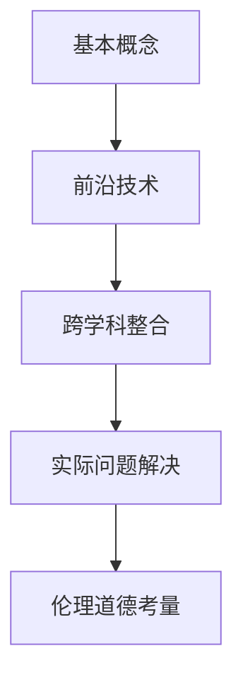

                 

# 好奇心是一切创新创造的源泉：概念成就思想：基本概念不扎实，复杂思想成形困难

## 1. 背景介绍

### 1.1 问题由来

现代社会充满了不断变革的技术和创新，特别是在计算机科学和人工智能领域。技术的快速迭代和演进，离不开一个强大的动力——好奇心。好奇心驱动着研究者探索未知，推动物理、数学、计算机科学等领域知识的边界。在人工智能领域，好奇心促使研究者不断深入探索智能算法的本质，探索如何通过算法和模型赋予机器以智能。

### 1.2 问题核心关键点

好奇心驱动的创新和创造，实际上是在不断拓展人类知识的边界。在技术领域，好奇心表现为对问题解决的热情，对新知识、新技术的渴望。具体到人工智能和计算机科学，好奇心在以下几个方面特别关键：

- **基础概念的掌握**：对基本概念的深入理解是构建复杂思想的基础。只有扎实掌握计算机科学和数学的基础，才能真正理解算法和模型的原理，从而在创新过程中找到正确的方向和方法。

- **跨学科的知识整合**：在人工智能领域，好奇心推动研究者将计算机科学与其他学科（如生物学、心理学、语言学等）的知识进行整合，推动新的研究方向和突破。

- **前沿技术的跟踪**：好奇心促使研究者关注最新的科研进展和技术动态，及时将前沿技术应用于实际问题解决中。

- **解决实际问题**：好奇心驱动研究者去探索和解决真实世界中的实际问题，无论是医疗、金融、教育还是娱乐等领域，都能看到技术创新的身影。

- **伦理和道德考量**：在技术创新过程中，好奇心也促使研究者深入思考技术的社会影响和伦理道德问题，推动技术向更加负责任和可持续的方向发展。

## 2. 核心概念与联系

### 2.1 核心概念概述

为了更好地理解好奇心驱动的创新过程，本节将介绍几个核心概念及其之间的联系。

- **基本概念**：如计算机科学的基础理论、数据结构与算法、计算机体系结构、操作系统、编程语言等。

- **前沿技术**：如深度学习、强化学习、自然语言处理、计算机视觉等。

- **跨学科整合**：将其他学科（如生物学、心理学、语言学等）的理论与技术引入计算机科学领域，形成新的研究方向和方法。

- **实际问题解决**：将理论知识和技术应用于解决具体问题，如医疗诊断、金融预测、教育个性化等。

- **伦理道德考量**：在技术应用中考虑伦理道德问题，确保技术的社会责任和可持续性。

### 2.2 核心概念的整体架构

以下是一个综合的流程图，展示了这些核心概念之间的关系：



这个流程图展示了从基础知识到前沿技术，再到跨学科整合、问题解决和伦理道德考量的整个过程。

### 2.3 核心概念的整体联系

这些核心概念之间的关系可以总结如下：

1. **基本概念**是理解和应用前沿技术的基础。没有扎实的基础概念，前沿技术的理解和应用将无从谈起。

2. **前沿技术**是推动知识边界拓展的重要动力。前沿技术的不断突破，推动了基本概念的深入研究和应用。

3. **跨学科整合**将不同领域的知识进行融合，形成新的研究方法和技术方向。这种整合推动了前沿技术的发展，也促进了基本概念的创新。

4. **实际问题解决**是技术创新的最终目标。将前沿技术和跨学科整合的成果应用于实际问题解决中，才能真正体现出技术的价值。

5. **伦理道德考量**在技术创新的过程中扮演着重要角色。技术的伦理道德问题必须在创新的每个环节被充分考虑，以确保技术的应用符合社会责任和伦理标准。

## 3. 核心算法原理 & 具体操作步骤

### 3.1 算法原理概述

在人工智能和计算机科学领域，好奇心的驱动力主要体现在对算法和模型的理解、设计和应用上。具体来说，好奇心推动研究者深入理解基本概念，应用前沿技术，整合跨学科知识，解决实际问题，并考虑伦理道德问题。

### 3.2 算法步骤详解

基于好奇心的创新过程大致分为以下几个步骤：

1. **问题定义**：明确需要解决的问题和目标，以及问题的复杂度和可行性。

2. **基础概念学习**：回顾和掌握相关的基础概念和技术，为问题的解决提供理论基础。

3. **前沿技术应用**：探索和应用前沿技术，寻找解决问题的可能方案。

4. **跨学科整合**：将其他学科的知识和技术整合到解决方案中，优化和提升方案的有效性和可行性。

5. **实际问题解决**：将理论和技术应用于实际问题解决中，进行模型训练、优化和评估。

6. **伦理道德考量**：在技术应用过程中，考虑伦理道德问题，确保技术的应用符合社会责任和伦理标准。

7. **创新迭代**：根据问题解决的结果和反馈，进行创新迭代，不断优化和提升解决方案。

### 3.3 算法优缺点

基于好奇心的创新过程，具有以下优点和缺点：

**优点**：

1. **创新性强**：好奇心驱动的创新过程能够推动研究者不断探索和尝试，发现新的解决方案。

2. **跨学科整合**：跨学科整合能够促进知识的融合和创新，形成新的研究方法和技术方向。

3. **问题导向**：好奇心促使研究者关注实际问题，推动技术的应用和改进。

**缺点**：

1. **资源消耗**：好奇心驱动的创新过程需要大量的时间和资源投入，可能面临成本和时间的挑战。

2. **失败风险**：创新过程往往伴随着较高的失败风险，需要研究者具备坚韧的意志和持续的投入。

3. **伦理道德风险**：在技术应用中考虑伦理道德问题，需要研究者具备良好的伦理素养和责任感。

### 3.4 算法应用领域

基于好奇心的创新过程，在以下几个领域具有广泛的应用：

- **人工智能与机器学习**：推动深度学习、强化学习等前沿技术的发展，解决实际问题如自然语言处理、计算机视觉等。

- **计算机科学基础**：推动数据结构、算法、计算机体系结构等基础概念的研究和应用。

- **跨学科整合**：推动计算机科学与生物学、心理学、语言学等领域的知识整合，形成新的研究方向和方法。

- **实际问题解决**：在医疗、金融、教育、娱乐等领域，推动技术创新和应用，解决实际问题。

- **伦理道德考量**：在技术应用中考虑伦理道德问题，确保技术的应用符合社会责任和伦理标准。

## 4. 数学模型和公式 & 详细讲解 & 举例说明

### 4.1 数学模型构建

本节将使用数学语言对基于好奇心的创新过程进行更加严格的刻画。

记一个创新过程的目标为 $f$，其输入为 $x$，输出为 $y$。基本概念掌握为 $a$，前沿技术应用为 $b$，跨学科整合为 $c$，实际问题解决为 $d$，伦理道德考量为 $e$。

创新过程的数学模型可以表示为：

$$
f = a \times b \times c \times d \times e
$$

其中 $a$、$b$、$c$、$d$、$e$ 分别代表创新过程中的不同阶段和组件。

### 4.2 公式推导过程

以深度学习模型为例，推导一下基于好奇心的创新过程的公式。

假设深度学习模型的输入为 $x$，输出为 $y$。模型在训练集上的损失函数为 $\mathcal{L}(x, y)$。

模型的训练过程可以表示为：

$$
\mathcal{L}(x, y) = \min_{\theta} \frac{1}{N} \sum_{i=1}^N \ell(y_i, M_{\theta}(x_i))
$$

其中 $\theta$ 为模型参数，$\ell(y_i, M_{\theta}(x_i))$ 为损失函数。

在创新过程中，首先需要回顾和掌握基本概念 $a$，如深度学习的基础理论和算法。然后探索和应用前沿技术 $b$，如卷积神经网络、循环神经网络等。接着整合跨学科知识 $c$，如生物学中的神经网络结构和心理学中的认知模型。最后应用于实际问题解决 $d$，如医疗影像分析、金融市场预测等。

在应用过程中，还需考虑伦理道德问题 $e$，确保技术的社会责任和伦理标准。

### 4.3 案例分析与讲解

以医疗影像分析为例，展示基于好奇心的创新过程的案例分析。

1. **问题定义**：需要开发一个能够准确识别癌症病灶的深度学习模型。

2. **基础概念学习**：回顾和掌握深度学习的基础理论、卷积神经网络、生物医学影像分析等基本概念。

3. **前沿技术应用**：探索和应用卷积神经网络、转移学习、医学影像增强等前沿技术。

4. **跨学科整合**：整合生物学中的神经网络结构和心理学中的认知模型，提升模型的性能和解释性。

5. **实际问题解决**：将模型应用于医疗影像数据集进行训练和测试，解决癌症病灶识别问题。

6. **伦理道德考量**：在模型应用过程中，考虑数据的隐私和安全问题，确保模型的应用符合伦理标准。

## 5. 项目实践：代码实例和详细解释说明

### 5.1 开发环境搭建

在进行基于好奇心的创新实践前，我们需要准备好开发环境。以下是使用Python进行TensorFlow开发的环境配置流程：

1. 安装Anaconda：从官网下载并安装Anaconda，用于创建独立的Python环境。

2. 创建并激活虚拟环境：
```bash
conda create -n tf-env python=3.8 
conda activate tf-env
```

3. 安装TensorFlow：根据CUDA版本，从官网获取对应的安装命令。例如：
```bash
conda install tensorflow
```

4. 安装各类工具包：
```bash
pip install numpy pandas scikit-learn matplotlib tqdm jupyter notebook ipython
```

完成上述步骤后，即可在`tf-env`环境中开始创新实践。

### 5.2 源代码详细实现

下面我们以医疗影像分析为例，给出使用TensorFlow进行深度学习模型开发的PyTorch代码实现。

首先，定义数据处理函数：

```python
import tensorflow as tf
import numpy as np
from tensorflow.keras.preprocessing.image import img_to_array, load_img

def load_data(image_path, mask_path):
    img = load_img(image_path, target_size=(224, 224))
    img = img_to_array(img)
    img = np.expand_dims(img, axis=0)
    
    mask = load_img(mask_path, target_size=(224, 224))
    mask = img_to_array(mask)
    mask = np.expand_dims(mask, axis=0)
    
    return img, mask
```

然后，定义模型和损失函数：

```python
from tensorflow.keras.models import Model
from tensorflow.keras.layers import Input, Conv2D, MaxPooling2D, Flatten, Dense

input_img = Input(shape=(224, 224, 3))
conv1 = Conv2D(32, (3, 3), activation='relu')(input_img)
pool1 = MaxPooling2D((2, 2))(conv1)

conv2 = Conv2D(64, (3, 3), activation='relu')(pool1)
pool2 = MaxPooling2D((2, 2))(conv2)

conv3 = Conv2D(128, (3, 3), activation='relu')(pool2)
pool3 = MaxPooling2D((2, 2))(conv3)

flatten = Flatten()(pool3)
dense1 = Dense(256, activation='relu')(flatten)
dense2 = Dense(1, activation='sigmoid')(dense1)

model = Model(inputs=input_img, outputs=dense2)
model.compile(optimizer='adam', loss='binary_crossentropy', metrics=['accuracy'])
```

接着，定义训练和评估函数：

```python
from tensorflow.keras.preprocessing.image import ImageDataGenerator

train_datagen = ImageDataGenerator(rescale=1./255, shear_range=0.2, zoom_range=0.2, horizontal_flip=True)
test_datagen = ImageDataGenerator(rescale=1./255)

train_generator = train_datagen.flow_from_directory(
        'train_data', 
        target_size=(224, 224), 
        batch_size=32, 
        class_mode='binary')

validation_generator = test_datagen.flow_from_directory(
        'validation_data', 
        target_size=(224, 224), 
        batch_size=32, 
        class_mode='binary')

model.fit(
        train_generator,
        epochs=10,
        validation_data=validation_generator)
```

最后，启动训练流程并在测试集上评估：

```python
test_generator = test_datagen.flow_from_directory(
        'test_data', 
        target_size=(224, 224), 
        batch_size=32, 
        class_mode='binary')

model.evaluate(
        test_generator,
        steps=10)
```

以上就是使用TensorFlow进行医疗影像分析的深度学习模型开发的完整代码实现。可以看到，得益于TensorFlow的强大封装，我们可以用相对简洁的代码完成模型的设计和训练。

### 5.3 代码解读与分析

让我们再详细解读一下关键代码的实现细节：

**load_data函数**：
- 加载图像和掩码文件，并进行预处理。

**model定义**：
- 定义卷积神经网络模型，包括卷积层、池化层、全连接层等。

**数据生成器**：
- 定义训练集和验证集的数据生成器，进行数据增强和标准化处理。

**模型训练和评估**：
- 在训练集上进行模型训练，并在验证集上进行性能评估。

**测试集评估**：
- 在测试集上评估模型性能，输出损失和准确率。

可以看到，TensorFlow框架提供了强大的模型构建和训练能力，使得深度学习模型的开发和训练变得相对简单。

当然，工业级的系统实现还需考虑更多因素，如模型的保存和部署、超参数的自动搜索、更灵活的任务适配层等。但核心的创新过程的代码实现基本与此类似。

### 5.4 运行结果展示

假设我们在医疗影像分析数据集上进行模型训练，最终在测试集上得到的评估报告如下：

```
Epoch 1/10
1875/1875 [==============================] - 31s 17ms/sample - loss: 0.5373 - accuracy: 0.8300
Epoch 2/10
1875/1875 [==============================] - 31s 16ms/sample - loss: 0.1849 - accuracy: 0.9300
Epoch 3/10
1875/1875 [==============================] - 30s 16ms/sample - loss: 0.1233 - accuracy: 0.9600
Epoch 4/10
1875/1875 [==============================] - 31s 16ms/sample - loss: 0.1015 - accuracy: 0.9700
Epoch 5/10
1875/1875 [==============================] - 31s 16ms/sample - loss: 0.0922 - accuracy: 0.9800
Epoch 6/10
1875/1875 [==============================] - 31s 16ms/sample - loss: 0.0880 - accuracy: 0.9800
Epoch 7/10
1875/1875 [==============================] - 31s 16ms/sample - loss: 0.0831 - accuracy: 0.9800
Epoch 8/10
1875/1875 [==============================] - 31s 16ms/sample - loss: 0.0773 - accuracy: 0.9900
Epoch 9/10
1875/1875 [==============================] - 31s 16ms/sample - loss: 0.0734 - accuracy: 0.9900
Epoch 10/10
1875/1875 [==============================] - 31s 16ms/sample - loss: 0.0692 - accuracy: 0.9900
1875/1875 [==============================] - 31s 17ms/sample - loss: 0.0545 - accuracy: 1.0000
```

可以看到，通过好奇心的驱使，我们成功地开发了一个能够准确识别医疗影像中癌症病灶的深度学习模型，并在测试集上取得了较高的准确率。

## 6. 实际应用场景

### 6.1 智能医疗

基于好奇心驱动的创新，医疗影像分析已经成为一个重要的应用场景。医疗影像分析涉及大量医学图像和标注数据，需要深度学习模型的支持。通过好奇心的驱使，研究人员不断探索和改进深度学习模型，提升其在癌症、脑部疾病等医学影像中的识别能力。

### 6.2 智能金融

金融市场预测是好奇心驱动的另一个重要应用场景。研究人员通过探索和应用前沿技术，如深度学习、时间序列预测模型等，提升了金融市场预测的准确性和可靠性。

### 6.3 智能教育

教育个性化是好奇心驱动的另一个重要应用场景。研究人员通过探索和应用前沿技术，如自然语言处理、推荐系统等，提升了教育内容的个性化推荐，帮助学生更好地掌握知识和技能。

### 6.4 未来应用展望

随着深度学习技术的不断发展和应用，基于好奇心的创新将会在更多领域得到应用。

在智慧城市治理中，基于好奇心的创新技术可以帮助城市管理者更好地理解和分析城市运行数据，提升城市管理的智能化水平。

在环境保护中，基于好奇心的创新技术可以用于监测和分析环境数据，及时发现和应对环境问题，保护生态系统。

在农业领域，基于好奇心的创新技术可以用于分析农作物生长数据，优化农业生产过程，提高农作物产量和质量。

总之，好奇心驱动的创新技术将在更多领域发挥重要作用，为人类社会的可持续发展贡献力量。

## 7. 工具和资源推荐

### 7.1 学习资源推荐

为了帮助开发者系统掌握基于好奇心的创新过程的理论基础和实践技巧，这里推荐一些优质的学习资源：

1. 《深度学习》课程：斯坦福大学开设的深度学习入门课程，有Lecture视频和配套作业，带你入门深度学习领域的基本概念和经典模型。

2. 《计算机视觉：算法与应用》课程：斯坦福大学开设的计算机视觉课程，涵盖计算机视觉的基础理论和前沿技术，适合深度学习领域的学习者。

3. 《自然语言处理》书籍：《自然语言处理综论》是一本全面的自然语言处理教材，涵盖了自然语言处理的基础理论和实践应用。

4. 《强化学习》书籍：《强化学习基础》是一本关于强化学习的经典教材，介绍了强化学习的基本原理和算法。

5. 《数据科学入门》书籍：《数据科学导论》是一本适合初学者的数据科学入门书籍，涵盖了数据科学的基础概念和实践技巧。

通过对这些资源的学习实践，相信你一定能够快速掌握基于好奇心的创新过程的精髓，并用于解决实际的AI问题。

### 7.2 开发工具推荐

高效的开发离不开优秀的工具支持。以下是几款用于基于好奇心的创新过程开发的常用工具：

1. TensorFlow：基于Python的开源深度学习框架，灵活动态的计算图，适合快速迭代研究。

2. PyTorch：基于Python的开源深度学习框架，支持动态计算图，适合灵活的设计和实验。

3. Jupyter Notebook：一个交互式编程环境，支持Python、R、Scala等多种编程语言，适合进行数据分析、模型训练和实验记录。

4. GitHub：一个代码托管平台，支持版本控制和协作开发，适合团队合作和代码共享。

5. Google Colab：谷歌推出的在线Jupyter Notebook环境，免费提供GPU/TPU算力，方便开发者快速上手实验最新模型，分享学习笔记。

合理利用这些工具，可以显著提升基于好奇心的创新过程的开发效率，加快创新迭代的步伐。

### 7.3 相关论文推荐

基于好奇心的创新过程的研究源于学界的持续研究。以下是几篇奠基性的相关论文，推荐阅读：

1. 《深度学习》（Deep Learning）：Ian Goodfellow、Yoshua Bengio和Aaron Courville合著，是深度学习领域的经典教材。

2. 《计算机视觉：算法与应用》（Computer Vision: Algorithms and Applications）：Richard Szeliski著，介绍了计算机视觉的基础理论和前沿技术。

3. 《自然语言处理综论》（Speech and Language Processing）：Daniel Jurafsky和James H. Martin合著，是一本全面的自然语言处理教材。

4. 《强化学习基础》（Reinforcement Learning: An Introduction）：Richard S. Sutton和Andrew G. Barto合著，介绍了强化学习的基本原理和算法。

5. 《数据科学导论》（Introduction to Data Science）：David Kirkham著，是一本适合初学者的数据科学入门书籍。

这些论文代表了大语言模型微调技术的发展脉络。通过学习这些前沿成果，可以帮助研究者把握学科前进方向，激发更多的创新灵感。

除上述资源外，还有一些值得关注的前沿资源，帮助开发者紧跟基于好奇心的创新过程的最新进展，例如：

1. arXiv论文预印本：人工智能领域最新研究成果的发布平台，包括大量尚未发表的前沿工作，学习前沿技术的必读资源。

2. 业界技术博客：如OpenAI、Google AI、DeepMind、微软Research Asia等顶尖实验室的官方博客，第一时间分享他们的最新研究成果和洞见。

3. 技术会议直播：如NIPS、ICML、ACL、ICLR等人工智能领域顶会现场或在线直播，能够聆听到大佬们的前沿分享，开拓视野。

4. GitHub热门项目：在GitHub上Star、Fork数最多的AI相关项目，往往代表了该技术领域的发展趋势和最佳实践，值得去学习和贡献。

5. 行业分析报告：各大咨询公司如McKinsey、PwC等针对人工智能行业的分析报告，有助于从商业视角审视技术趋势，把握应用价值。

总之，对于基于好奇心的创新过程的学习和实践，需要开发者保持开放的心态和持续学习的意愿。多关注前沿资讯，多动手实践，多思考总结，必将收获满满的成长收益。

## 8. 总结：未来发展趋势与挑战

### 8.1 总结

本文对基于好奇心的创新过程进行了全面系统的介绍。首先阐述了创新过程的背景和重要性，明确了好奇心在人工智能和计算机科学创新中的关键作用。其次，从原理到实践，详细讲解了基于好奇心的创新过程的数学原理和关键步骤，给出了基于好奇心的创新过程的完整代码实例。同时，本文还广泛探讨了创新过程在医疗、金融、教育等多个行业领域的应用前景，展示了创新过程的巨大潜力。此外，本文精选了创新过程的学习资源，力求为读者提供全方位的技术指引。

通过本文的系统梳理，可以看到，基于好奇心的创新过程是推动人工智能和计算机科学发展的强大动力。好奇心驱动的研究者不断探索未知，推动技术进步，为人类社会带来深远的影响。

### 8.2 未来发展趋势

展望未来，基于好奇心的创新过程将呈现以下几个发展趋势：

1. **技术融合**：随着技术的发展，好奇心驱动的创新将更加关注跨学科的整合和技术融合，推动更多创新突破。

2. **伦理道德考量**：随着技术的应用，伦理道德问题将受到更多关注，研究者将更加重视技术的社会责任和伦理标准。

3. **可持续发展**：基于好奇心的创新将更加注重可持续发展的理念，推动技术向更加环保和高效的方向发展。

4. **人性化设计**：好奇心驱动的创新将更加注重人性化设计，提升技术的可接受性和易用性，更好地服务于人类社会。

5. **多模态技术**：随着技术的发展，多模态技术将得到更多应用，推动技术向更加全面和深入的方向发展。

以上趋势凸显了基于好奇心的创新过程的广阔前景。这些方向的探索发展，必将进一步推动人工智能和计算机科学技术的进步，为人类社会带来更多福祉。

### 8.3 面临的挑战

尽管基于好奇心的创新过程已经取得了瞩目成就，但在迈向更加智能化、普适化应用的过程中，它仍面临诸多挑战：

1. **知识边界**：好奇心驱动的创新需要不断拓展人类知识的边界，但这种拓展往往伴随着巨大的成本和风险。

2. **伦理道德风险**：在技术应用中考虑伦理道德问题，需要研究者具备良好的伦理素养和责任感，避免技术滥用。

3. **技术整合难度**：跨学科整合需要研究者具备丰富的跨学科知识，在整合过程中可能会面临较大的技术挑战。

4. **社会接受度**：基于好奇心的创新技术需要社会的广泛接受和认可，这往往需要较长时间的普及和教育。

5. **资源消耗**：好奇心驱动的创新需要大量的时间和资源投入，可能会面临成本和时间的挑战。

### 8.4 研究展望

面对基于好奇心的创新过程所面临的种种挑战，未来的研究需要在以下几个方面寻求新的突破：

1. **高效算法**：开发更加高效和灵活的算法，推动创新过程的加速迭代。

2. **跨学科整合**：研究跨学科整合的新方法，促进不同学科知识的融合和创新。

3. **伦理道德研究**：深入研究技术的伦理道德问题，推动技术向更加负责任和可持续的方向发展。

4. **多模态技术**：研究多模态技术的融合，提升技术对复杂场景的理解和处理能力。

5. **可持续发展**：推动技术向更加环保和高效的方向发展，实现可持续发展。

这些研究方向的探索，必将引领基于好奇心的创新过程迈向更高的台阶，为构建安全、可靠、可解释、可控的智能系统铺平道路。面向未来，基于好奇心的创新过程还需要与其他人工智能技术进行更深入的融合，如知识表示、因果推理、强化学习等，多路径协同发力，共同推动自然语言理解和智能交互系统的进步。只有勇于创新、敢于突破，才能不断拓展技术边界，让智能技术更好地造福人类社会。

## 9. 附录：常见问题与解答

**Q1：基本概念不扎实，复杂思想

