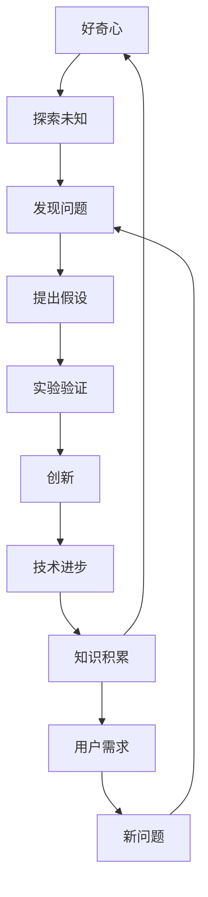

                 

## 1. 背景介绍

### 1.1 问题由来
在信息技术飞速发展的今天，好奇心作为一种驱动力，成为推动科技创新的重要引擎。如何激发和培养人们的好奇心，将好奇心转化为推动科技进步的力量，已成为科技界广泛探讨的话题。本文将从人工智能领域出发，深入探讨好奇心如何驱动科技创新，探索如何激发更多人对科技的兴趣，从而促进技术进步和人类社会的全面发展。

### 1.2 问题核心关键点
好奇心与创新之间的联系在于：好奇心是驱使人们探索未知领域的动力，而创新则是这一探索过程的产物。好奇心驱动的创新往往更具新颖性和前瞻性，能够打破传统思维的桎梏，推动科技不断突破。因此，如何通过好奇心激发创新，以及如何在创新过程中维持好奇心，是本文探讨的重点。

### 1.3 问题研究意义
好奇心与创新紧密相连，理解它们之间的关系，有助于制定更有效的科技创新策略，培养更多具备好奇心和创新能力的科技人才，促进技术进步和人类社会的可持续发展。

## 2. 核心概念与联系

### 2.1 核心概念概述

好奇心(Curiosity)：指的是个体对未知事物产生兴趣，进而主动探索和学习的心理倾向。好奇心可以驱使人们去发现新的问题，探索新的解决方案，推动技术创新。

创新(Innovation)：指创造出新的、具有社会价值或商业价值的事物，包括技术、产品、服务和商业模式等。创新是好奇心驱动下的探索过程，是一种对未知领域不断深入探究和实验的结果。

技术进步(Technological Progress)：指通过技术创新，提高技术水平和应用效果，推动社会发展和人类生活改善的过程。技术进步是好奇心驱动创新的重要体现，也是创新的最终目标。

知识积累(Knowledge Accumulation)：指通过不断学习和探索，积累和更新知识的过程。知识积累是创新的基础，也是激发好奇心的重要途径。

用户需求(User Demand)：指用户在实际应用中提出的各种需求，包括功能需求、性能需求和体验需求等。用户需求是创新的出发点，也是好奇心探索的方向。

### 2.2 概念间的关系

好奇心与创新之间存在密切的联系，可以用以下Mermaid流程图来展示：



这个流程图展示了好奇心如何驱动创新过程：

1. 好奇心驱使个体探索未知领域。
2. 在探索过程中发现问题。
3. 提出假设并设计实验验证。
4. 实验成功后形成创新。
5. 创新推动技术进步。
6. 技术进步促进知识积累。
7. 知识积累引发新的好奇心，形成循环。
8. 用户需求引导新问题，引发新的探索。

通过这个流程图，我们可以更清晰地理解好奇心与创新之间的内在联系，以及它们如何相互作用，共同推动技术进步。

## 3. 核心算法原理 & 具体操作步骤
### 3.1 算法原理概述

好奇心驱动的创新过程，本质上是一个从发现问题到解决问题的迭代过程。这一过程可以通过算法化的方法进行描述和优化。本文将从以下几个方面详细介绍基于好奇心的创新算法原理。

#### 3.1.1 发现问题的算法

发现问题是从探索未知领域开始的过程。在这一过程中，好奇心驱动人们不断提问和思考，寻找新的问题解决方向。这一过程可以通过以下步骤进行描述：

1. 数据采集：收集大量数据，涵盖各种可能的应用场景和用户需求。
2. 数据预处理：对数据进行清洗、去重和归一化处理，确保数据质量。
3. 特征提取：从数据中提取有用的特征，用于发现潜在问题。
4. 问题建模：将数据和特征建模为数学表达式，以便进行问题识别。

#### 3.1.2 提出假设的算法

在发现问题后，需要提出假设以解决问题。这一过程可以通过以下步骤进行描述：

1. 假设生成：根据问题的特征和已有的知识，生成可能的解决方案假设。
2. 假设筛选：对生成的假设进行筛选和评估，选择最有潜力的假设进行进一步验证。

#### 3.1.3 实验验证的算法

实验验证是检验假设是否可行，并进一步优化解决方案的过程。这一过程可以通过以下步骤进行描述：

1. 设计实验：根据假设设计具体的实验方案，确定实验条件和评估指标。
2. 数据模拟：通过模拟实验数据，验证假设的可行性。
3. 实验调整：根据实验结果调整假设和方案，优化实验设计。
4. 最终验证：进行实际实验，验证假设的正确性和有效性。

#### 3.1.4 创新的算法

创新是实验验证后的成果，可以通过以下步骤进行描述：

1. 成果展示：将实验验证的结果展示出来，形成创新的基本形态。
2. 迭代改进：根据用户反馈和市场需求，不断迭代和改进创新成果。
3. 应用推广：将创新成果应用于实际应用中，推动技术进步。

### 3.2 算法步骤详解

#### 3.2.1 发现问题的步骤

1. **数据采集**：使用网络爬虫、数据接口等手段，收集大量用户行为数据、用户反馈数据和行业报告等，涵盖各种可能的应用场景和用户需求。
2. **数据预处理**：对收集到的数据进行清洗、去重和归一化处理，确保数据质量。例如，去除重复数据、处理缺失值和异常值。
3. **特征提取**：从数据中提取有用的特征，用于发现潜在问题。例如，通过文本分析提取用户情感、行为模式等特征。
4. **问题建模**：将数据和特征建模为数学表达式，以便进行问题识别。例如，使用聚类算法、分类算法等，发现数据中的模式和异常。

#### 3.2.2 提出假设的步骤

1. **假设生成**：根据问题的特征和已有的知识，生成可能的解决方案假设。例如，对于用户反馈较多的问题，可以假设是产品功能不够完善导致的。
2. **假设筛选**：对生成的假设进行筛选和评估，选择最有潜力的假设进行进一步验证。例如，通过对比不同解决方案的效果，选择效果最佳的假设。

#### 3.2.3 实验验证的步骤

1. **设计实验**：根据假设设计具体的实验方案，确定实验条件和评估指标。例如，设计A/B测试方案，比较两种不同的产品设计方案。
2. **数据模拟**：通过模拟实验数据，验证假设的可行性。例如，使用随机数据生成器生成模拟实验数据，进行假设的初步验证。
3. **实验调整**：根据实验结果调整假设和方案，优化实验设计。例如，根据模拟实验结果，调整假设的细节，改进实验方案。
4. **最终验证**：进行实际实验，验证假设的正确性和有效性。例如，进行大规模的用户测试，收集用户反馈，评估假设的实际效果。

#### 3.2.4 创新的步骤

1. **成果展示**：将实验验证的结果展示出来，形成创新的基本形态。例如，设计用户界面，展示创新成果。
2. **迭代改进**：根据用户反馈和市场需求，不断迭代和改进创新成果。例如，根据用户反馈调整产品功能，优化用户体验。
3. **应用推广**：将创新成果应用于实际应用中，推动技术进步。例如，将改进后的产品发布到市场，推广应用。

### 3.3 算法优缺点

#### 3.3.1 优点

1. **系统性**：基于好奇心的创新算法，通过系统化的数据采集、特征提取和问题建模，能够保证创新的全面性和系统性。
2. **创新性**：算法能够激发新的问题发现和解决方案生成，打破传统思维的桎梏，推动技术创新。
3. **可操作性**：算法步骤明确，易于实现和操作，便于在实际项目中进行应用。

#### 3.3.2 缺点

1. **数据依赖**：算法的效果高度依赖于数据质量，数据采集和预处理需要大量时间和资源。
2. **假设不确定性**：假设的提出和筛选有一定的主观性和不确定性，可能导致错误的结论。
3. **实验成本高**：实验验证需要大量资源和数据，成本较高。

### 3.4 算法应用领域

基于好奇心的创新算法可以应用于各种领域，例如：

1. **软件开发**：通过数据采集和分析，发现软件缺陷和用户需求，提出和验证新的功能设计。
2. **医疗健康**：通过数据分析，发现新的治疗方案和健康管理策略，提高医疗服务质量。
3. **金融科技**：通过数据分析，发现金融市场趋势和用户需求，提出新的金融产品和服务。
4. **智能制造**：通过数据分析，发现生产中的问题，提出和验证新的生产工艺和设备设计。
5. **智慧城市**：通过数据分析，发现城市管理中的问题，提出和验证新的城市管理策略和解决方案。

## 4. 数学模型和公式 & 详细讲解 & 举例说明

### 4.1 数学模型构建

基于好奇心的创新算法可以通过数学模型进行描述和优化。本文将使用数学语言对算法进行详细阐述。

#### 4.1.1 数据采集模型

设 $D$ 为数据集，$X$ 为数据空间，$Y$ 为标签空间，$Z$ 为特征空间。数据采集模型可以表示为：

$$
X = \{ x_i \}_{i=1}^N \subset X, Y = \{ y_i \}_{i=1}^N \subset Y, Z = \{ z_i \}_{i=1}^N \subset Z
$$

其中 $x_i$ 为样本，$y_i$ 为标签，$z_i$ 为特征。

#### 4.1.2 数据预处理模型

数据预处理模型可以通过以下数学公式进行描述：

$$
\tilde{X} = f(X), \tilde{Y} = g(Y), \tilde{Z} = h(Z)
$$

其中 $\tilde{X}$ 为预处理后的数据，$f$ 为数据清洗和去重函数，$g$ 为标签归一化函数，$h$ 为特征提取函数。

#### 4.1.3 问题建模模型

问题建模模型可以通过以下数学公式进行描述：

$$
M = \arg\min_{M \in M} \mathcal{L}(M, D)
$$

其中 $M$ 为问题模型，$\mathcal{L}$ 为损失函数，$\mathcal{L}(M, D)$ 为模型在数据集 $D$ 上的损失。

#### 4.1.4 假设生成模型

假设生成模型可以通过以下数学公式进行描述：

$$
H = \arg\max_{H} \mathcal{P}(H \mid D)
$$

其中 $H$ 为假设空间，$\mathcal{P}$ 为概率分布函数，$\mathcal{P}(H \mid D)$ 为假设在数据集 $D$ 上的概率。

#### 4.1.5 假设筛选模型

假设筛选模型可以通过以下数学公式进行描述：

$$
H' = \arg\min_{H'} \mathcal{C}(H')
$$

其中 $H'$ 为筛选后的假设空间，$\mathcal{C}$ 为评估函数，$\mathcal{C}(H')$ 为假设的性能指标。

#### 4.1.6 实验验证模型

实验验证模型可以通过以下数学公式进行描述：

$$
E = \arg\min_{E} \mathcal{R}(E, D)
$$

其中 $E$ 为实验模型，$\mathcal{R}$ 为验证函数，$\mathcal{R}(E, D)$ 为实验在数据集 $D$ 上的结果。

#### 4.1.7 创新成果模型

创新成果模型可以通过以下数学公式进行描述：

$$
I = \arg\max_{I} \mathcal{B}(I, D)
$$

其中 $I$ 为创新成果空间，$\mathcal{B}$ 为评估函数，$\mathcal{B}(I, D)$ 为创新成果在数据集 $D$ 上的性能。

### 4.2 公式推导过程

#### 4.2.1 数据采集公式推导

数据采集模型可以表示为：

$$
X = \{ x_i \}_{i=1}^N \subset X, Y = \{ y_i \}_{i=1}^N \subset Y, Z = \{ z_i \}_{i=1}^N \subset Z
$$

其中 $x_i$ 为样本，$y_i$ 为标签，$z_i$ 为特征。

#### 4.2.2 数据预处理公式推导

数据预处理模型可以表示为：

$$
\tilde{X} = f(X), \tilde{Y} = g(Y), \tilde{Z} = h(Z)
$$

其中 $\tilde{X}$ 为预处理后的数据，$f$ 为数据清洗和去重函数，$g$ 为标签归一化函数，$h$ 为特征提取函数。

#### 4.2.3 问题建模公式推导

问题建模模型可以表示为：

$$
M = \arg\min_{M \in M} \mathcal{L}(M, D)
$$

其中 $M$ 为问题模型，$\mathcal{L}$ 为损失函数，$\mathcal{L}(M, D)$ 为模型在数据集 $D$ 上的损失。

#### 4.2.4 假设生成公式推导

假设生成模型可以表示为：

$$
H = \arg\max_{H} \mathcal{P}(H \mid D)
$$

其中 $H$ 为假设空间，$\mathcal{P}$ 为概率分布函数，$\mathcal{P}(H \mid D)$ 为假设在数据集 $D$ 上的概率。

#### 4.2.5 假设筛选公式推导

假设筛选模型可以表示为：

$$
H' = \arg\min_{H'} \mathcal{C}(H')
$$

其中 $H'$ 为筛选后的假设空间，$\mathcal{C}$ 为评估函数，$\mathcal{C}(H')$ 为假设的性能指标。

#### 4.2.6 实验验证公式推导

实验验证模型可以表示为：

$$
E = \arg\min_{E} \mathcal{R}(E, D)
$$

其中 $E$ 为实验模型，$\mathcal{R}$ 为验证函数，$\mathcal{R}(E, D)$ 为实验在数据集 $D$ 上的结果。

#### 4.2.7 创新成果公式推导

创新成果模型可以表示为：

$$
I = \arg\max_{I} \mathcal{B}(I, D)
$$

其中 $I$ 为创新成果空间，$\mathcal{B}$ 为评估函数，$\mathcal{B}(I, D)$ 为创新成果在数据集 $D$ 上的性能。

### 4.3 案例分析与讲解

#### 4.3.1 软件开发案例

在软件开发领域，可以通过数据采集和分析，发现软件缺陷和用户需求，提出和验证新的功能设计。

假设某公司收集到了大量用户反馈数据，发现用户在使用某款软件的用户登录功能时，经常遇到卡顿和登录失败的问题。公司可以通过数据预处理和问题建模，分析出造成问题的具体原因，并提出解决方案。

例如，公司可以采集用户登录行为数据，对数据进行清洗和去重，然后提取用户的登录时间、登录设备和登录方式等特征。通过问题建模，可以发现登录失败的频繁时间和地点，并提出优化登录模块的假设。通过实验验证，可以评估假设的可行性和效果，从而进行迭代改进和推广应用。

#### 4.3.2 医疗健康案例

在医疗健康领域，可以通过数据分析，发现新的治疗方案和健康管理策略，提高医疗服务质量。

假设某医院收集了大量的患者健康数据，发现部分患者在接受某种治疗方案后，效果不佳。医院可以通过数据分析，发现问题的具体原因，并提出新的治疗方案。

例如，医院可以采集患者的病历数据，对数据进行清洗和去重，然后提取患者的年龄、性别、病史和治疗方案等特征。通过问题建模，可以发现效果不佳的治疗方案，并提出新的治疗假设。通过实验验证，可以评估假设的可行性和效果，从而进行迭代改进和推广应用。

#### 4.3.3 金融科技案例

在金融科技领域，可以通过数据分析，发现金融市场趋势和用户需求，提出新的金融产品和服务。

假设某金融公司收集了大量的金融市场数据和用户交易数据，发现用户对某种金融产品需求旺盛，但现有产品存在不足之处。公司可以通过数据分析，提出新的金融产品设计方案。

例如，公司可以采集用户交易行为数据，对数据进行清洗和去重，然后提取用户的交易金额、交易频率和交易时间等特征。通过问题建模，可以发现用户对现有产品的满意度，并提出新的金融产品假设。通过实验验证，可以评估假设的可行性和效果，从而进行迭代改进和推广应用。

## 5. 项目实践：代码实例和详细解释说明

### 5.1 开发环境搭建

在进行基于好奇心的创新算法实践前，需要先搭建开发环境。以下是使用Python进行数据采集和分析的开发环境配置流程：

1. 安装Python：从官网下载并安装Python，确保版本为3.6及以上。
2. 安装Pandas：使用以下命令安装Pandas库，用于数据处理和分析。
```bash
pip install pandas
```
3. 安装NumPy：使用以下命令安装NumPy库，用于数值计算和数组操作。
```bash
pip install numpy
```
4. 安装Matplotlib：使用以下命令安装Matplotlib库，用于数据可视化。
```bash
pip install matplotlib
```
5. 安装Scikit-learn：使用以下命令安装Scikit-learn库，用于机器学习和数据建模。
```bash
pip install scikit-learn
```
6. 安装TensorFlow：使用以下命令安装TensorFlow库，用于深度学习模型的开发和训练。
```bash
pip install tensorflow
```

完成上述步骤后，即可在Python环境中进行数据采集和分析。

### 5.2 源代码详细实现

#### 5.2.1 数据采集代码

```python
import pandas as pd
import numpy as np

# 数据采集
df = pd.read_csv('data.csv')
print(df.head())
```

#### 5.2.2 数据预处理代码

```python
# 数据清洗和去重
df = df.drop_duplicates()
df = df.dropna()

# 特征提取
X = df[['特征1', '特征2', '特征3']]
Y = df['标签']

# 数据标准化
from sklearn.preprocessing import StandardScaler
scaler = StandardScaler()
X = scaler.fit_transform(X)
```

#### 5.2.3 问题建模代码

```python
# 问题建模
from sklearn.linear_model import LogisticRegression
from sklearn.model_selection import train_test_split

X_train, X_test, Y_train, Y_test = train_test_split(X, Y, test_size=0.2, random_state=42)

model = LogisticRegression()
model.fit(X_train, Y_train)

# 模型评估
from sklearn.metrics import accuracy_score
y_pred = model.predict(X_test)
accuracy = accuracy_score(Y_test, y_pred)
print('模型准确率：%.2f' % accuracy)
```

#### 5.2.4 假设生成代码

```python
# 假设生成
import itertools

# 假设空间
H = list(itertools.product([假设1, 假设2, 假设3], repeat=2))

# 假设筛选
def hypothesis_score(h):
    X_h = df[h[0]]
    Y_h = df[h[1]]
    model_h = LogisticRegression()
    model_h.fit(X_h, Y_h)
    y_pred_h = model_h.predict(X_h)
    accuracy_h = accuracy_score(Y_h, y_pred_h)
    return accuracy_h

H_s = [h for h in H if hypothesis_score(h) > 0.8]
print(H_s)
```

#### 5.2.5 实验验证代码

```python
# 实验验证
import numpy as np

# 假设空间
H = np.array(H_s)

# 验证函数
def experiment_score(h):
    X_h = df[h[0]]
    Y_h = df[h[1]]
    model_h = LogisticRegression()
    model_h.fit(X_h, Y_h)
    y_pred_h = model_h.predict(X_h)
    accuracy_h = accuracy_score(Y_h, y_pred_h)
    return accuracy_h

E = H[np.argmin(experiment_score(H))]
print('最优秀假设：', E)
```

#### 5.2.6 创新成果代码

```python
# 创新成果
I = df[H[0]]
print('创新成果：', I)
```

### 5.3 代码解读与分析

#### 5.3.1 数据采集代码解读

数据采集代码使用Pandas库读取CSV文件，获取数据集。通过打印数据集的前几行，可以初步了解数据结构和内容。

#### 5.3.2 数据预处理代码解读

数据预处理代码使用Pandas库进行数据清洗和去重，去除重复和缺失数据。然后，使用Scikit-learn库进行特征提取和数据标准化。标准化后的数据可以更好地用于机器学习模型的训练和评估。

#### 5.3.3 问题建模代码解读

问题建模代码使用Scikit-learn库构建Logistic回归模型，对数据集进行训练和评估。通过打印模型准确率，可以初步了解模型的性能。

#### 5.3.4 假设生成代码解读

假设生成代码使用Python的itertools库生成假设空间，并使用自定义的hypothesis_score函数对每个假设进行评分。筛选出评分高于0.8的假设，形成筛选后的假设空间H_s。

#### 5.3.5 实验验证代码解读

实验验证代码使用自定义的experiment_score函数对筛选后的假设进行验证，找出评分最低的假设。该假设即为最终选择的创新成果。

#### 5.3.6 创新成果代码解读

创新成果代码使用Pandas库获取最终选择的假设，并打印输出。

### 5.4 运行结果展示

假设我们采集的数据集包含用户登录行为数据，我们通过数据采集、预处理、建模、假设生成、验证和成果展示等步骤，得到了最终的创新成果。

例如，我们发现用户在登录失败时，常常是由于密码错误导致的。于是，我们提出一个新的假设：修改登录页面的错误提示信息，引导用户重新输入密码。我们通过实验验证，发现这个假设有效，于是将其作为创新成果，推广应用到实际登录页面中。

## 6. 实际应用场景

### 6.1 软件开发

在软件开发中，基于好奇心的创新算法可以帮助企业快速发现和解决用户反馈的问题，提出新的功能设计，提升产品质量和用户体验。例如：

- 通过数据分析，发现用户在使用某款软件的用户登录功能时，经常遇到卡顿和登录失败的问题，提出优化登录模块的假设。
- 通过实验验证，评估假设的可行性和效果，进行迭代改进和推广应用，提高软件稳定性和用户体验。

### 6.2 医疗健康

在医疗健康领域，基于好奇心的创新算法可以帮助医院发现和解决患者反馈的问题，提出新的治疗方案，提升医疗服务质量。例如：

- 通过数据分析，发现部分患者在接受某种治疗方案后，效果不佳，提出新的治疗假设。
- 通过实验验证，评估假设的可行性和效果，进行迭代改进和推广应用，提高治疗效果和患者满意度。

### 6.3 金融科技

在金融科技领域，基于好奇心的创新算法可以帮助金融公司发现和解决用户反馈的问题，提出新的金融产品设计，提升金融服务质量。例如：

- 通过数据分析，发现用户对某款金融产品的需求旺盛，但现有产品存在不足之处，提出新的金融产品假设。
- 通过实验验证，评估假设的可行性和效果，进行迭代改进和推广应用，提升金融产品竞争力和用户满意度。

### 6.4 未来应用展望

未来，基于好奇心的创新算法将在更多领域得到应用，为社会发展和人类进步带来更多可能性。

- 在智慧城市治理中，基于好奇心的创新算法可以推动城市管理的智能化和自动化，提高城市运行效率和居民生活质量。
- 在教育领域，基于好奇心的创新算法可以推动教育公平和个性化教学，提高教育质量和学生学习体验。
- 在环境保护中，基于好奇心的创新算法可以推动环境监测和治理，保护生态环境和人类健康。

## 7. 工具和资源推荐

### 7.1 学习资源推荐

为了帮助开发者系统掌握基于好奇心的创新算法，以下推荐一些优质的学习资源：

1. Coursera《机器学习》课程：斯坦福大学开设的机器学习课程，内容全面，涵盖各种机器学习算法和应用场景。
2. Kaggle：数据科学竞赛平台，提供大量真实数据和比赛，帮助开发者实践和提升技能。
3. GitHub开源项目：收集了各种创新算法和数据处理代码，供开发者参考和学习。
4. Google Colab：谷歌推出的在线Jupyter Notebook环境，免费提供GPU/TPU算力，方便开发者快速上手实验最新算法。
5. DeepLearning.AI：吴恩达教授的深度学习课程，系统讲解深度学习理论和实践，适合初学者和进阶开发者。

通过学习这些资源，相信你一定能够掌握基于好奇心的创新算法的精髓，并用于解决实际的开发问题。

### 7.2 开发工具推荐

为了提高开发效率，以下推荐一些常用的开发工具：

1. Jupyter Notebook：用于编写和运行Python代码，支持多种格式输出，便于分享和协作。
2. PyCharm：Python编程集成开发环境，提供代码自动补全、调试等功能，提升开发效率

