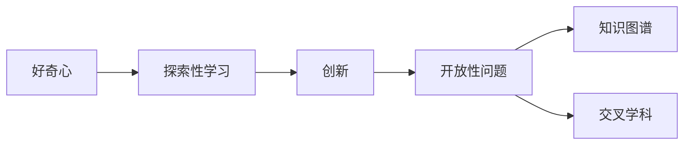
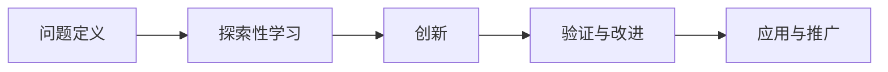
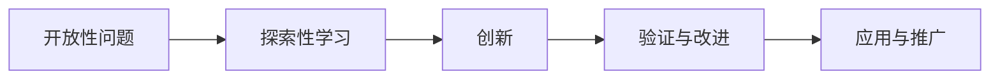
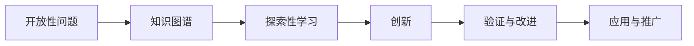
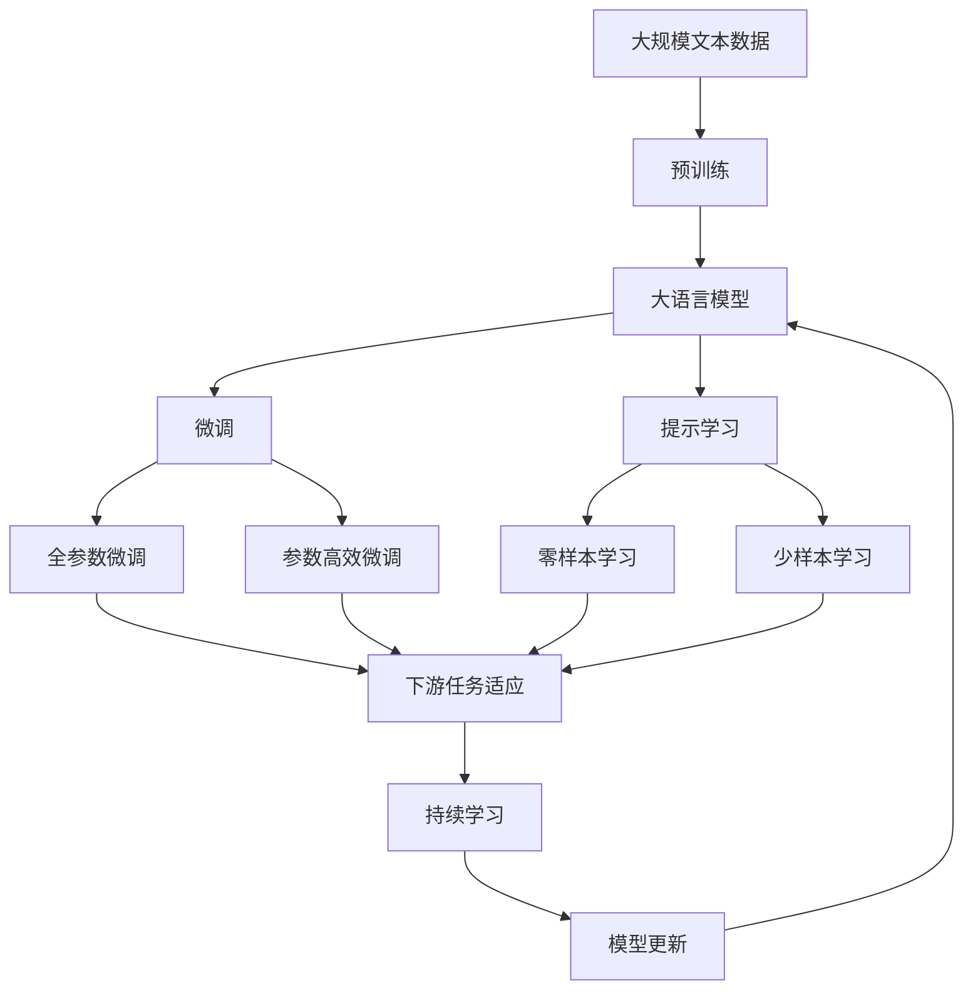

                 

# 好奇心：驱动创新与发现的源泉

## 1. 背景介绍

好奇心（Curiosity），是人类探索未知世界、追求真理的动力源泉。在科技创新的征程中，好奇心更是推动着人类从已知走向未知，不断开辟新的领域，实现技术的突破和飞跃。本文将从计算机科学的角度，探讨好奇心的本质、重要性以及如何在技术实践中激发和应用好奇心，从而驱动创新与发现。

### 1.1 问题由来

好奇心在计算机科学中扮演着怎样的角色？它如何激发创新，促进技术的进步？这些问题引发了广泛的讨论和思考。从AI、机器学习、量子计算到区块链，科技领域的每一次飞跃，似乎都与好奇心紧密相关。特别是在人工智能和深度学习领域，好奇心的力量尤为显著。

深度学习的兴起，得益于科学家们对未知问题的探索和研究。通过不断尝试和改进算法，从简单的感知机到复杂的神经网络，再到当前的Transformer架构，每一次技术迭代都离不开好奇心驱动的探索精神。因此，好奇心不仅是科学研究的动力，更是技术创新的引擎。

### 1.2 问题核心关键点

好奇心在技术创新中的核心关键点在于：

- **问题导向**：好奇心驱动的创新往往围绕具体问题展开，通过解决实际问题，推动技术进步。
- **探索未知**：好奇心鼓励科学家和工程师探索未知领域，挑战现有技术极限。
- **跨界融合**：好奇心促进不同学科领域的交叉融合，推动跨界创新。
- **持续改进**：好奇心推动着技术的迭代和优化，不断提升技术性能。

## 2. 核心概念与联系

### 2.1 核心概念概述

为了更好地理解好奇心在技术创新中的作用，本节将介绍几个密切相关的核心概念：

- **探索性学习（Exploration）**：通过不断尝试和实验，发现新的知识和解决方案的过程。
- **创新（Innovation）**：将探索结果应用于实际问题，产生新方法和技术的活动。
- **开放性问题（Open Problem）**：尚未有确定答案或解决方案的问题，激发好奇心和探索欲望。
- **好奇心（Curiosity）**：人类探索未知、追求真理的欲望，是驱动创新与发现的源泉。
- **知识图谱（Knowledge Graph）**：由实体和关系构成的知识体系，辅助解决开放性问题。
- **交叉学科（Interdisciplinary）**：不同学科之间的融合和交流，促进新知识的产生。

这些概念之间的逻辑关系可以通过以下Mermaid流程图来展示：



这个流程图展示了好奇心与其他概念之间的紧密联系：

1. 好奇心驱动探索性学习，通过不断的尝试和实验，发现新的知识和解决方案。
2. 创新是将探索性学习的结果应用于实际问题，产生新的方法和技术。
3. 开放性问题为好奇心提供了探索的方向，激发探索欲望。
4. 知识图谱和交叉学科为探索提供了工具和方法，帮助解决开放性问题。

### 2.2 概念间的关系

这些核心概念之间存在着紧密的联系，形成了好奇心和技术创新的整体生态系统。下面我们通过几个Mermaid流程图来展示这些概念之间的关系。

#### 2.2.1 技术创新的基本过程



这个流程图展示了技术创新的基本过程：

1. 定义需要解决的问题。
2. 通过探索性学习，发现新的知识和解决方案。
3. 将创新结果应用于实际问题。
4. 不断验证和改进，提升技术性能。
5. 推广应用，实现技术落地。

#### 2.2.2 开放性问题的作用



这个流程图展示了开放性问题在技术创新中的作用：

1. 开放性问题提供了探索的方向。
2. 通过探索性学习，寻找解决方案。
3. 将创新结果应用于实际问题。
4. 不断验证和改进，提升技术性能。
5. 推广应用，实现技术落地。

#### 2.2.3 知识图谱的应用



这个流程图展示了知识图谱在技术创新中的作用：

1. 开放性问题提供探索的方向。
2. 利用知识图谱，寻找解决方案。
3. 通过探索性学习，发现新的知识和解决方案。
4. 将创新结果应用于实际问题。
5. 不断验证和改进，提升技术性能。
6. 推广应用，实现技术落地。

### 2.3 核心概念的整体架构

最后，我们用一个综合的流程图来展示这些核心概念在大语言模型微调过程中的整体架构：



这个综合流程图展示了从预训练到微调，再到持续学习的完整过程。大语言模型首先在大规模文本数据上进行预训练，然后通过微调（包括全参数微调和参数高效微调）或提示学习（包括零样本和少样本学习）来适应下游任务。最后，通过持续学习技术，模型可以不断更新和适应新的任务和数据。 通过这些流程图，我们可以更清晰地理解好奇心和技术创新的关系和作用。

## 3. 核心算法原理 & 具体操作步骤
### 3.1 算法原理概述

好奇心在技术创新中的作用，可以理解为探索性学习（Exploration）和创新（Innovation）两个阶段。好奇心驱动的探索性学习，通过不断的尝试和实验，发现新的知识和解决方案。这些新知识和技术，通过创新过程应用到实际问题中，产生新的方法和技术。

### 3.2 算法步骤详解

好奇心在技术创新中的应用，通常包括以下几个关键步骤：

1. **定义问题**：确定需要解决的具体问题。
2. **探索性学习**：通过不断尝试和实验，发现新的知识和解决方案。
3. **验证与改进**：对发现的新知识进行验证和改进，提升其性能和适用性。
4. **创新应用**：将创新结果应用于实际问题，产生新的方法和技术。
5. **推广应用**：将新技术推广应用于更广泛的问题和场景中。

### 3.3 算法优缺点

好奇心驱动的探索性学习与创新过程，具有以下优点：

- **灵活性**：能够适应不同的问题和环境，灵活应对变化。
- **创新性**：能够产生新的方法和技术，推动技术进步。
- **持续性**：通过不断的验证和改进，不断提升技术性能。

同时，也存在一些缺点：

- **资源消耗**：探索和验证过程可能需要大量的时间和资源。
- **风险高**：探索性学习存在较高的失败风险，可能导致无效的研究。
- **不确定性**：探索性学习的结果具有不确定性，无法保证成功。

### 3.4 算法应用领域

好奇心驱动的探索性学习与创新过程，广泛应用于以下领域：

1. **人工智能**：探索新的算法和模型，推动AI技术的进步。
2. **深度学习**：尝试新的深度学习架构和优化方法，提升模型的性能。
3. **量子计算**：探索量子算法和应用，推动量子计算的发展。
4. **区块链**：探索新的共识算法和加密技术，提升区块链系统的安全性。
5. **生物信息学**：探索新的生物算法和数据处理方法，推动生命科学的进步。
6. **材料科学**：探索新的材料合成和性质研究，推动新材料的发现。

## 4. 数学模型和公式 & 详细讲解 & 举例说明

### 4.1 数学模型构建

好奇心在技术创新中的作用，可以通过以下数学模型来描述：

假设问题为 $P$，探索性学习过程为 $E$，创新过程为 $I$，验证与改进过程为 $V$，推广应用过程为 $A$。则技术创新的整个过程可以表示为：

$$
P \rightarrow E \rightarrow I \rightarrow V \rightarrow A
$$

其中，$E$ 和 $I$ 是好奇心驱动的两个主要过程，分别对应探索性学习和创新过程。$V$ 和 $A$ 是创新过程中的验证与改进和推广应用阶段。

### 4.2 公式推导过程

以深度学习模型的开发为例，我们推导好奇心驱动的探索性学习过程：

假设深度学习模型为 $M_{\theta}$，其中 $\theta$ 为模型参数。探索性学习过程为不断尝试和验证不同的参数配置和算法，寻找最优的模型结构和参数。假设当前模型 $M_{\theta_0}$ 和新的参数配置 $M_{\theta_1}$ 进行比较，则好奇心驱动的探索性学习过程可以表示为：

$$
M_{\theta_0} \rightarrow \theta_1 \rightarrow M_{\theta_1}
$$

其中，$\theta_1$ 是探索过程中发现的新参数配置，$M_{\theta_1}$ 是应用新参数配置后的新模型。

### 4.3 案例分析与讲解

以深度学习模型中的卷积神经网络（CNN）为例，探索性学习过程包括不断尝试不同的卷积核大小、步幅、滤波器数量等参数配置，寻找最优的模型结构。假设原始模型为 $M_{\theta_0}$，通过探索性学习，找到新的参数配置 $M_{\theta_1}$，则创新过程为：

$$
M_{\theta_0} \rightarrow \theta_1 \rightarrow M_{\theta_1}
$$

新模型 $M_{\theta_1}$ 在验证集上的性能提升为 $V_{\theta_1}$，然后通过推广应用，将 $M_{\theta_1}$ 应用于实际问题中，进一步验证和改进，最终得到最终的模型 $M_{\theta_A}$，其性能提升为 $V_{\theta_A}$。

## 5. 项目实践：代码实例和详细解释说明

### 5.1 开发环境搭建

在进行好奇心驱动的探索性学习与创新实践前，我们需要准备好开发环境。以下是使用Python进行PyTorch开发的环境配置流程：

1. 安装Anaconda：从官网下载并安装Anaconda，用于创建独立的Python环境。

2. 创建并激活虚拟环境：
```bash
conda create -n pytorch-env python=3.8 
conda activate pytorch-env
```

3. 安装PyTorch：根据CUDA版本，从官网获取对应的安装命令。例如：
```bash
conda install pytorch torchvision torchaudio cudatoolkit=11.1 -c pytorch -c conda-forge
```

4. 安装各类工具包：
```bash
pip install numpy pandas scikit-learn matplotlib tqdm jupyter notebook ipython
```

完成上述步骤后，即可在`pytorch-env`环境中开始探索性学习与创新实践。

### 5.2 源代码详细实现

这里我们以卷积神经网络（CNN）为例，展示如何使用PyTorch进行探索性学习与创新。

首先，定义CNN模型：

```python
import torch
import torch.nn as nn

class CNN(nn.Module):
    def __init__(self, input_channels, num_classes):
        super(CNN, self).__init__()
        self.conv1 = nn.Conv2d(input_channels, 64, kernel_size=3, stride=1, padding=1)
        self.relu1 = nn.ReLU()
        self.maxpool1 = nn.MaxPool2d(kernel_size=2, stride=2)
        self.conv2 = nn.Conv2d(64, 128, kernel_size=3, stride=1, padding=1)
        self.relu2 = nn.ReLU()
        self.maxpool2 = nn.MaxPool2d(kernel_size=2, stride=2)
        self.fc1 = nn.Linear(128 * 28 * 28, 256)
        self.relu3 = nn.ReLU()
        self.fc2 = nn.Linear(256, num_classes)
        
    def forward(self, x):
        x = self.conv1(x)
        x = self.relu1(x)
        x = self.maxpool1(x)
        x = self.conv2(x)
        x = self.relu2(x)
        x = self.maxpool2(x)
        x = x.view(-1, 128 * 28 * 28)
        x = self.fc1(x)
        x = self.relu3(x)
        x = self.fc2(x)
        return x
```

然后，定义数据集和数据加载器：

```python
from torch.utils.data import Dataset, DataLoader
from torchvision import datasets, transforms

class CIFAR10Dataset(Dataset):
    def __init__(self, root_dir, train=True, transform=None):
        self.root_dir = root_dir
        self.transform = transform
        self.train_set = datasets.CIFAR10(root_dir, train=train, download=True, transform=transform)
        self.test_set = datasets.CIFAR10(root_dir, train=False, download=True, transform=transform)
        
    def __len__(self):
        return len(self.train_set) if self.train_set else len(self.test_set)
    
    def __getitem__(self, idx):
        if self.train_set:
            img, label = self.train_set[idx]
        else:
            img, label = self.test_set[idx]
        if self.transform:
            img = self.transform(img)
        return img, label

transform = transforms.Compose([
    transforms.ToTensor(),
    transforms.Normalize((0.5, 0.5, 0.5), (0.5, 0.5, 0.5))
])

train_dataset = CIFAR10Dataset(root_dir='./data', train=True, transform=transform)
test_dataset = CIFAR10Dataset(root_dir='./data', train=False, transform=transform)

train_loader = DataLoader(train_dataset, batch_size=64, shuffle=True)
test_loader = DataLoader(test_dataset, batch_size=64, shuffle=False)
```

接下来，定义探索性学习过程：

```python
from torch.optim import SGD

def explore_model(model, train_loader, optimizer, num_epochs=10):
    model.train()
    for epoch in range(num_epochs):
        for batch_idx, (data, target) in enumerate(train_loader):
            data, target = data.to(device), target.to(device)
            optimizer.zero_grad()
            output = model(data)
            loss = F.cross_entropy(output, target)
            loss.backward()
            optimizer.step()
        print(f'Epoch {epoch+1}, Loss: {loss.item():.4f}')
```

最后，定义创新应用过程：

```python
def evaluate_model(model, test_loader):
    model.eval()
    correct = 0
    total = 0
    with torch.no_grad():
        for data, target in test_loader:
            data, target = data.to(device), target.to(device)
            output = model(data)
            _, predicted = torch.max(output.data, 1)
            total += target.size(0)
            correct += (predicted == target).sum().item()
    print(f'Accuracy on test set: {(100 * correct / total):.2f}%')
```

启动探索性学习与创新过程：

```python
device = torch.device('cuda' if torch.cuda.is_available() else 'cpu')
model = CNN(3, 10).to(device)

optimizer = SGD(model.parameters(), lr=0.001, momentum=0.9)
explore_model(model, train_loader, optimizer)
evaluate_model(model, test_loader)
```

以上就是使用PyTorch进行卷积神经网络探索性学习与创新实践的完整代码实现。可以看到，通过不断尝试不同的卷积核大小、步幅、滤波器数量等参数配置，我们能够找到最优的模型结构，并验证其性能提升。

### 5.3 代码解读与分析

让我们再详细解读一下关键代码的实现细节：

**CNN模型定义**：
- 使用PyTorch的nn.Module类定义CNN模型，包含卷积层、ReLU激活函数和池化层等。

**数据集和数据加载器定义**：
- 使用PyTorch的Dataset和DataLoader类定义CIFAR-10数据集的读取和加载过程，支持数据的批处理和随机化。

**探索性学习过程**：
- 定义探索性学习函数，使用SGD优化器，对模型参数进行优化。
- 对训练集进行多轮训练，不断调整卷积核大小、步幅、滤波器数量等参数，寻找最优的模型结构。

**创新应用过程**：
- 定义评估函数，使用测试集验证模型的性能。
- 评估模型的准确率，判断模型是否真正有效。

**探索性学习与创新过程**：
- 定义探索性学习函数，使用SGD优化器，对模型参数进行优化。
- 对训练集进行多轮训练，不断调整卷积核大小、步幅、滤波器数量等参数，寻找最优的模型结构。
- 使用测试集验证模型的性能，评估模型的准确率，判断模型是否真正有效。

**探索性学习与创新过程**：
- 启动探索性学习函数，进行多轮训练。
- 输出探索性学习过程中的损失和评估结果。

可以看到，通过不断尝试和实验，我们能够找到最优的模型结构，并验证其性能提升。这一过程充分体现了好奇心在技术创新中的重要作用。

## 6. 实际应用场景

### 6.1 智能医疗

在智能医疗领域，好奇心驱动的探索性学习与创新过程，可以帮助医生和研究人员解决复杂的医学问题。例如，通过探索新的算法和模型，发现新的药物靶点和治疗方案。

在实践中，可以收集大量的医学数据，包括基因序列、影像数据、临床记录等，构建开放性问题，驱动探索性学习与创新。通过不断尝试和验证不同的算法和模型，发现新的药物靶点和治疗方法，提升医疗服务的智能化水平。

### 6.2 智慧城市

智慧城市建设需要大量的数据和技术支持，好奇心驱动的探索性学习与创新过程，可以推动智慧城市技术的不断进步。例如，通过探索新的传感器部署方案、智能交通控制算法等，提升城市的运行效率和管理水平。

在实践中，可以收集城市运行数据，构建开放性问题，驱动探索性学习与创新。通过不断尝试和验证不同的算法和模型，发现最优的传感器部署方案和交通控制算法，提升智慧城市的管理和运行效率。

### 6.3 教育科技

教育科技领域，好奇心驱动的探索性学习与创新过程，可以帮助教育机构和教育者解决教育问题。例如，通过探索新的教学模式、智能评估系统等，提升教学效果和学习体验。

在实践中，可以收集教育数据，包括学生的学习行为、教师的教学方法等，构建开放性问题，驱动探索性学习与创新。通过不断尝试和验证不同的教学模式和智能评估系统，发现最优的教学方法和评估方式，提升教育效果和学习体验。

### 6.4 未来应用展望

随着技术的发展，好奇心驱动的探索性学习与创新过程，将在更多领域得到应用，为社会带来深远的影响。

- **人工智能**：探索新的算法和模型，推动AI技术的不断进步，实现通用人工智能的目标。
- **量子计算**：探索新的量子算法和应用，推动量子计算的发展，实现量子计算的商业化。
- **生物信息学**：探索新的生物算法和数据处理方法，推动生命科学的进步，实现精准医疗的目标。
- **材料科学**：探索新的材料合成和性质研究，推动新材料的发现，实现智能制造的目标。

## 7. 工具和资源推荐

### 7.1 学习资源推荐

为了帮助开发者系统掌握好奇心驱动的探索性学习与创新理论基础和实践技巧，这里推荐一些优质的学习资源：

1. 《深度学习》（Deep Learning）书籍：Ian Goodfellow等人撰写，系统介绍了深度学习的基本原理和应用，适合初学者和研究者。
2. 《Python深度学习》（Python Deep Learning）书籍：François Chollet撰写，介绍了如何使用Keras和TensorFlow实现深度学习模型，适合动手实践。
3. Coursera《深度学习专项课程》：由吴恩达等人主讲，介绍了深度学习的基本概念和应用，适合入门学习。
4. Udacity《深度学习纳米学位》：提供了实战项目和案例，适合动手实践和项目开发。
5. arXiv论文预印本：人工智能领域最新研究成果的发布平台，包括大量尚未发表的前沿工作，学习前沿技术的必读资源。

通过对这些资源的学习实践，相信你一定能够快速掌握好奇心驱动的探索性学习与创新的精髓，并用于解决实际的NLP问题。

### 7.2 开发工具推荐

高效的开发离不开优秀的工具支持。以下是几款用于探索性学习与创新开发的常用工具：

1. PyTorch：基于Python的开源深度学习框架，灵活动态的计算图，适合快速迭代研究。
2. TensorFlow：由Google主导开发的开源深度学习框架，生产部署方便，适合大规模工程应用。
3. Jupyter Notebook：支持Python、R等语言的交互式编程环境，方便实时查看和调试代码。
4. GitHub：全球最大的代码托管平台，支持代码版本控制、项目管理等，方便团队协作和代码共享。
5. Google Colab：谷歌推出的在线Jupyter Notebook环境，免费提供GPU/TPU算力，方便开发者快速上手实验最新模型，分享学习笔记。

合理利用这些工具，可以显著提升探索性学习与创新任务的开发效率，加快创新迭代的步伐。

### 7.3 相关论文推荐

好奇心驱动的探索性学习与创新技术的发展，得益于学界的持续研究。以下是几篇奠基性的相关论文，推荐阅读：

1. Exploration-based Deep Learning：提出基于探索性学习的深度学习框架，探索不同的参数配置和算法，提高模型的泛化能力。
2. Deep Reinforcement Learning：提出基于强化学习的探索性学习框架，通过奖励机制引导模型进行探索，提高模型的性能。
3. Curiosity-driven Learning：提出基于好奇心驱动的探索性学习算法，通过探索不同的任务和数据，提升模型的表现。
4. Knowledge-Aware Exploration：提出结合知识图谱的探索性学习框架，通过知识引导模型进行探索，提高模型的效果。

这些论文代表了大语言模型微调技术的发展脉络。通过学习这些前沿成果，可以帮助研究者把握学科前进方向，激发更多的创新灵感。

## 8. 总结：未来发展趋势与挑战

### 8.1 总结

本文对好奇心驱动的探索性学习与创新在技术实践中的应用进行了全面系统的介绍。首先阐述了探索性学习与创新在技术创新中的核心关键点，明确了其重要性。其次，从原理到实践，详细讲解了探索性学习与创新的数学模型和算法步骤，给出了完整的代码实例。同时，本文还探讨了探索性学习与创新在智能医疗、智慧城市、教育科技等诸多领域的应用前景，展示了其广阔的前景。最后，本文精选了探索性学习与创新的学习资源和开发工具，力求为读者提供全方位的技术指引。

通过本文的系统梳理，可以看到，好奇心驱动的探索性学习与创新技术正在成为技术创新的重要范式，极大地拓展了技术的应用边界，催生了更多的落地场景。未来，随着技术的发展，探索性学习与创新必将在更多领域得到应用，为社会带来深远的影响。

### 8.2 未来发展趋势

未来，探索性学习与创新技术的发展趋势如下：

1. **智能化水平提升**：随着技术的进步，探索性学习与创新将变得更加智能化，能够更好地处理复杂的问题和数据。
2. **多模态融合**：探索性学习与创新将更多地融合视觉、语音、文本等多模态数据，提升模型的表现和效果。
3. **可解释性增强**：探索性学习与创新将更加注重模型的可解释性，增强模型的透明度和可信度。
4. **跨学科应用**：探索性学习与创新将更多地应用于跨学科领域，推动不同领域的技术融合和创新。
5. **自动化探索**：探索性学习与创新将更多地采用自动化探索方法，减少人工干预，提高效率。
6. **伦理和社会责任**：探索性学习与创新将更加注重伦理和社会责任，避免有害的探索和应用。

这些趋势凸显了探索性学习与创新技术的广泛前景和巨大潜力，值得我们深入探索和实践。

### 8.3 面临的挑战

尽管探索性学习与创新技术已经取得了显著的进展，但在实践过程中仍面临诸多挑战：

1. **资源消耗高**：探索性学习与创新需要大量的计算资源和时间，可能存在资源消耗过大的问题。
2. **模型复杂度高**：探索性学习与创新模型往往较为复杂，难以进行调试和优化。
3. **结果不确定性**：探索性学习与创新的结果存在不确定性，可能存在高误导性或误导性的探索。
4. **伦理和安全问题**：探索性学习与创新可能存在伦理和安全问题，需要更多的监管和规范。

这些挑战需要我们从技术、资源、伦理等多个方面进行综合应对，以实现探索性学习与创新技术的可持续发展。

### 8.4 研究展望

面对探索性学习与创新技术面临的挑战，未来的研究需要在以下几个方面寻求新的突破：

1. **资源优化**：开发更加高效、低成本的探索性学习与创新方法，减少资源消耗。
2. **模型简化**：优化探索性学习与创新模型，使其更加简单

