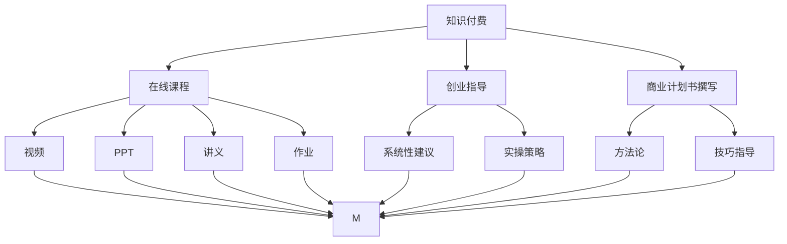
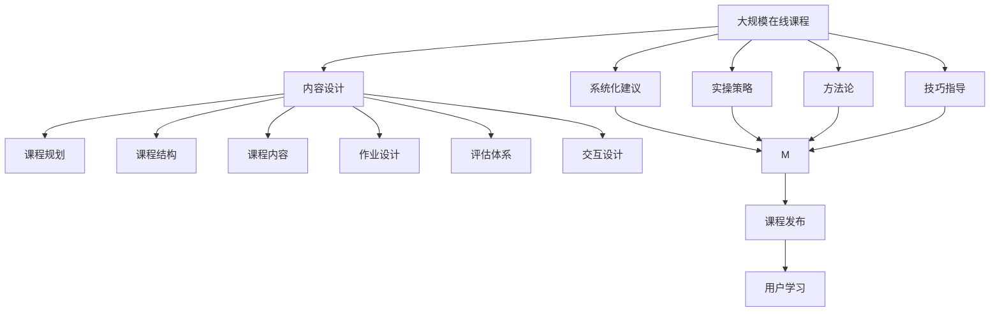

                 

# 如何利用知识付费实现在线创业指导与商业计划书？

## 1. 背景介绍

### 1.1 问题由来
随着互联网的普及和信息技术的快速发展，知识付费已成为越来越多人的选择。知识付费模式不仅为内容创作者提供了一种可持续的收入来源，也为消费者提供了更加便捷、高效的获取知识的方式。在传统教育体系之外，在线创业指导与商业计划书撰写成为了知识付费的重要组成部分。

然而，当前的在线创业指导与商业计划书撰写市场存在一些问题：
- 市场上存在大量质量参差不齐的课程和书籍，缺乏系统性和专业性。
- 部分内容创作者和讲师缺乏实际创业经验，提供的指导和建议不够实用。
- 部分课程和书籍过于理论化，缺乏具体案例和实操指导。

### 1.2 问题核心关键点
为了解决这些问题，本文旨在探讨如何利用知识付费模式，实现高质量、系统化、实操性强的在线创业指导与商业计划书撰写课程。核心关键点包括：
- 如何设计系统化、专业化的在线课程体系。
- 如何聘请具备丰富创业经验的讲师。
- 如何融合理论与实践，提供实用的指导和建议。
- 如何通过知识付费模式，实现课程的持续更新和优化。

### 1.3 问题研究意义
利用知识付费模式实现在线创业指导与商业计划书撰写，具有以下重要意义：
- 提升教育资源配置的效率，使更多人能够获取优质教育资源。
- 降低教育成本，使在线教育更加普及。
- 推动内容创新，鼓励更多有实战经验的内容创作者参与教育市场。
- 促进知识的传播和应用，推动社会整体知识水平提升。

## 2. 核心概念与联系

### 2.1 核心概念概述

为更好地理解如何利用知识付费模式实现在线创业指导与商业计划书撰写，本节将介绍几个关键概念：

- 知识付费：一种新的教育模式，通过互联网将知识以付费的形式提供给用户，包括在线课程、电子书、视频讲解等。
- 在线课程：通过网络平台提供的系统化学习资源，包括视频、PPT、讲义、作业等，供用户自主学习。
- 创业指导：基于实际经验和理论知识，为创业者提供系统性、实操性的创业建议和策略。
- 商业计划书撰写：一种系统性、专业性的撰写商业计划书的方法和技巧，帮助创业者制定合理的商业计划。

- 知识付费平台：如Coursera、Udemy、网易云课堂等，提供在线课程和知识产品的平台。
- 内容创作者：拥有专业知识和经验的讲师、作家，为知识付费平台提供内容。
- 用户：付费获取知识的用户，包括学生、创业者、企业管理者等。

这些概念之间的逻辑关系可以通过以下Mermaid流程图来展示：



这个流程图展示了知识付费模式与在线课程、创业指导和商业计划书撰写之间的关联：

1. 知识付费平台提供多种形式的学习资源。
2. 在线课程内容覆盖系统性建议、实操策略、方法论和技巧指导。
3. 创业指导和商业计划书撰写是在线课程的重要组成部分。
4. 课程内容的丰富性、实用性和系统性，有助于用户更好地掌握知识和技能。

### 2.2 概念间的关系

这些核心概念之间存在着紧密的联系，形成了在线创业指导与商业计划书撰写的完整体系。下面是具体的联系：

1. 知识付费平台：提供在线课程和其他知识产品的平台，是课程内容和用户之间的桥梁。
2. 内容创作者：提供高质量、实用性的课程内容，是知识付费模式的核心。
3. 用户：付费获取知识的用户，是知识付费模式的主要消费者。

知识付费模式的核心在于提供系统化、高质量、实用性的内容，满足用户的学习需求，并通过付费机制确保内容创作者的可持续收入。在线创业指导与商业计划书撰写作为知识付费模式的重要组成部分，其质量直接影响到用户的学习效果和满意度。

### 2.3 核心概念的整体架构

最后，我们用一个综合的流程图来展示这些核心概念在大规模在线课程设计中的整体架构：



这个综合流程图展示了从内容设计到课程发布再到用户学习的过程：

1. 内容设计阶段，明确课程目标、内容结构、作业设计等。
2. 系统化建议、实操策略、方法论和技巧指导是课程的核心内容。
3. 课程发布后，用户通过在线平台进行学习。
4. 用户学习效果通过评估体系进行反馈，不断优化课程内容。

通过这些流程图，我们可以更清晰地理解知识付费模式中各环节的关系和作用，为后续深入讨论具体的课程设计和实施提供基础。

## 3. 核心算法原理 & 具体操作步骤
### 3.1 算法原理概述

利用知识付费模式实现在线创业指导与商业计划书撰写，主要涉及以下算法原理：

- 需求分析：通过对目标用户的学习需求进行深入分析，设计满足用户需求的课程体系。
- 内容设计：融合理论与实践，设计系统化、实用性的课程内容。
- 教学设计：通过互动式学习、案例分析、实战演练等方式，提升用户的理解和应用能力。
- 评估体系：通过定期测试和反馈，评估用户的学习效果，指导课程内容的优化和更新。

### 3.2 算法步骤详解

基于知识付费模式的在线创业指导与商业计划书撰写，主要分为以下几个步骤：

**Step 1: 需求分析**
- 对目标用户进行市场调研，了解他们的背景、兴趣、需求等。
- 通过问卷调查、访谈等方式收集用户反馈，明确用户的学习目标和期望。
- 分析用户的学习需求，设计符合用户需求的课程体系。

**Step 2: 内容设计**
- 根据需求分析结果，设计系统化、专业化的课程内容。
- 融合创业理论和实战经验，提供系统性建议和实操策略。
- 通过案例分析、实战演练等方式，提升用户的理解和应用能力。
- 设计合理的作业和测试，确保用户掌握知识点。

**Step 3: 教学设计**
- 采用互动式学习、小组讨论等方式，提升用户的参与感和互动性。
- 设计视频讲解、PPT演示、讲义等多样化教学资源，满足不同用户的学习习惯。
- 定期更新课程内容，引入最新的创业实践和案例。
- 引入专家访谈、圆桌讨论等形式，提升课程的深度和广度。

**Step 4: 评估体系设计**
- 设计合理的评估标准和测试题目，评估用户的学习效果。
- 通过定期测试和反馈，收集用户的学习反馈，指导课程内容的优化和更新。
- 设计个性化学习路径，根据用户的学习效果，推荐适合的课程内容。

### 3.3 算法优缺点

基于知识付费模式的在线创业指导与商业计划书撰写，具有以下优点：

1. 系统性：通过系统化、专业化的课程设计，提供完整的知识体系，满足用户的学习需求。
2. 实用性：融合理论与实践，提供实用的指导和建议，提升用户的创业成功率。
3. 灵活性：用户可以根据自己的时间和进度，自主学习，灵活安排学习时间。
4. 可扩展性：课程内容和形式丰富多样，可以不断优化和扩展，满足不同用户的需求。

同时，这种模式也存在一些缺点：

1. 用户自控力要求高：需要用户具备一定的自控力和学习能力，才能高效完成课程。
2. 内容质量参差不齐：部分内容创作者缺乏实战经验，提供的指导和建议可能不够实用。
3. 学习效果依赖平台：平台的质量和用户互动性对学习效果有较大影响。
4. 学习成本较高：高质量的课程往往需要付费，对于部分用户来说可能存在经济负担。

### 3.4 算法应用领域

基于知识付费模式的在线创业指导与商业计划书撰写，已经在以下领域得到了广泛应用：

- 企业内部培训：为员工提供系统化的创业指导和商业计划书撰写培训。
- 创业孵化器：为创业者提供系统性的创业指导和商业计划书撰写课程。
- 教育机构：提供系统化、专业化的在线创业指导和商业计划书撰写课程，提升学生创业能力。
- 商业咨询公司：通过提供高质量的课程内容和实战案例，帮助客户制定合理的商业计划。

## 4. 数学模型和公式 & 详细讲解 & 举例说明

### 4.1 数学模型构建

本节将使用数学语言对基于知识付费模式的在线创业指导与商业计划书撰写的过程进行更加严格的刻画。

假设课程设计目标为满足 $N$ 名用户的需求，课程内容分为 $K$ 个模块，每个模块的权重为 $w_k$。课程的总体评分 $S$ 可以通过以下公式计算：

$$
S = \sum_{k=1}^K w_k \cdot R_k
$$

其中，$R_k$ 为第 $k$ 个模块的评分，$w_k$ 为该模块的权重。评分的计算方法可以通过以下公式确定：

$$
R_k = \sum_{i=1}^N \frac{1}{n_i} \cdot (1 - \frac{1}{N}) \cdot \left( \frac{1}{1 + e^{-Y_k^i}} \right)
$$

其中，$Y_k^i$ 为第 $i$ 个用户对第 $k$ 个模块的评分，$n_i$ 为该用户评价的模块数量。

### 4.2 公式推导过程

以下我们以用户对课程模块的评分为例，推导评分计算公式的推导过程。

设第 $k$ 个模块的评分为 $R_k$，则有：

$$
R_k = \sum_{i=1}^N \frac{1}{n_i} \cdot (1 - \frac{1}{N}) \cdot \left( \frac{1}{1 + e^{-Y_k^i}} \right)
$$

其中，$Y_k^i$ 为第 $i$ 个用户对第 $k$ 个模块的评分，$n_i$ 为该用户评价的模块数量。

由于每个用户对不同模块的评分可能存在差异，因此需要对每个用户的评分进行归一化处理：

$$
\hat{Y}_k^i = \frac{Y_k^i}{\max\limits_{j=1}^K Y_j^i}
$$

将归一化后的评分代入公式，得到：

$$
R_k = \sum_{i=1}^N \frac{1}{n_i} \cdot (1 - \frac{1}{N}) \cdot \left( \frac{1}{1 + e^{-\hat{Y}_k^i}} \right)
$$

通过上述公式，我们可以计算出每个模块的评分 $R_k$，进而计算出课程的总体评分 $S$。

### 4.3 案例分析与讲解

假设某在线创业指导课程分为三个模块，分别介绍市场调研、商业模式和团队管理。每个模块的权重分别为 $w_1=0.3, w_2=0.4, w_3=0.3$。根据公式计算课程的总体评分 $S$：

$$
S = 0.3 \cdot R_1 + 0.4 \cdot R_2 + 0.3 \cdot R_3
$$

其中，$R_1, R_2, R_3$ 分别为市场调研、商业模式和团队管理模块的评分。

通过问卷调查和测试，我们得到以下评分数据：

- 市场调研模块的评分：$Y_1^1=4, Y_1^2=3, Y_1^3=2$
- 商业模式模块的评分：$Y_2^1=5, Y_2^2=4, Y_2^3=3$
- 团队管理模块的评分：$Y_3^1=3, Y_3^2=4, Y_3^3=2$

将这些评分代入公式，得到：

$$
R_1 = \frac{1}{3} \cdot (1 - \frac{1}{3}) \cdot \left( \frac{1}{1 + e^{-4}} + \frac{1}{1 + e^{-3}} + \frac{1}{1 + e^{-2}} \right)
$$

$$
R_2 = \frac{1}{3} \cdot (1 - \frac{1}{3}) \cdot \left( \frac{1}{1 + e^{-5}} + \frac{1}{1 + e^{-4}} + \frac{1}{1 + e^{-3}} \right)
$$

$$
R_3 = \frac{1}{3} \cdot (1 - \frac{1}{3}) \cdot \left( \frac{1}{1 + e^{-3}} + \frac{1}{1 + e^{-4}} + \frac{1}{1 + e^{-2}} \right)
$$

计算得到 $R_1=0.67, R_2=0.86, R_3=0.62$。

将这些评分代入总体评分的公式中，得到：

$$
S = 0.3 \cdot 0.67 + 0.4 \cdot 0.86 + 0.3 \cdot 0.62 = 0.7653
$$

通过以上计算，我们得到了该课程的总体评分 $S=0.7653$。

## 5. 项目实践：代码实例和详细解释说明

### 5.1 开发环境搭建

在进行课程设计和实施前，我们需要准备好开发环境。以下是使用Python进行知识付费平台开发的环境配置流程：

1. 安装Anaconda：从官网下载并安装Anaconda，用于创建独立的Python环境。

2. 创建并激活虚拟环境：
```bash
conda create -n pytorch-env python=3.8 
conda activate pytorch-env
```

3. 安装PyTorch：根据CUDA版本，从官网获取对应的安装命令。例如：
```bash
conda install pytorch torchvision torchaudio cudatoolkit=11.1 -c pytorch -c conda-forge
```

4. 安装Django：用于搭建知识付费平台的Web框架。
```bash
pip install django
```

5. 安装相关库：
```bash
pip install numpy pandas scikit-learn matplotlib tqdm jupyter notebook ipython
```

完成上述步骤后，即可在`pytorch-env`环境中开始课程设计和实施。

### 5.2 源代码详细实现

下面我们以在线创业指导课程为例，给出使用Django框架实现知识付费平台的代码实现。

首先，创建Django项目：

```bash
django-admin startproject online_courses
```

进入项目目录：

```bash
cd online_courses
```

创建应用：

```bash
python manage.py startapp courses
```

在`courses`应用中添加必要的模型和视图：

**models.py**：
```python
from django.db import models

class Course(models.Model):
    title = models.CharField(max_length=100)
    description = models.TextField()
    modules = models.ManyToManyField('Module')

class Module(models.Model):
    title = models.CharField(max_length=100)
    weight = models.FloatField()
    content = models.TextField()
    score = models.FloatField()

class Student(models.Model):
    name = models.CharField(max_length=100)
    email = models.EmailField(unique=True)
    courses = models.ManyToManyField('Course')
    scores = models.ManyToManyField('Score')

class Score(models.Model):
    student = models.ForeignKey('Student', on_delete=models.CASCADE)
    course = models.ForeignKey('Course', on_delete=models.CASCADE)
    module = models.ForeignKey('Module', on_delete=models.CASCADE)
    score = models.FloatField()

    def __str__(self):
        return f'{self.student} scored {self.score} in {self.module} of {self.course}'
```

**views.py**：
```python
from django.shortcuts import render
from .models import Course, Module, Student, Score
from django.views.generic import ListView, DetailView, CreateView, UpdateView, DeleteView

def course_list(request):
    courses = Course.objects.all()
    return render(request, 'courses/course_list.html', {'courses': courses})

def module_list(request, course_id):
    course = Course.objects.get(id=course_id)
    modules = course.modules.all()
    return render(request, 'courses/module_list.html', {'course': course, 'modules': modules})

def module_detail(request, course_id, module_id):
    course = Course.objects.get(id=course_id)
    module = Module.objects.get(id=module_id)
    return render(request, 'courses/module_detail.html', {'course': course, 'module': module})

def student_list(request):
    students = Student.objects.all()
    return render(request, 'courses/student_list.html', {'students': students})

def score_list(request, student_id):
    student = Student.objects.get(id=student_id)
    scores = student.scores.all()
    return render(request, 'courses/score_list.html', {'student': student, 'scores': scores})

def score_detail(request, student_id, score_id):
    student = Student.objects.get(id=student_id)
    score = Score.objects.get(id=score_id)
    return render(request, 'courses/score_detail.html', {'student': student, 'score': score})
```

在`templates/courses`目录下创建相应的HTML模板：

**course_list.html**：
```html
<h1>All Courses</h1>
<ul>

    <li><a href="">{{ course.title }}</a></li>

</ul>
```

**module_list.html**：
```html
<h1>Modules in {{ course.title }}</h1>
<ul>

    <li><a href="">{{ module.title }}</a></li>

</ul>
```

**module_detail.html**：
```html
<h1>{{ course.title }} > {{ module.title }}</h1>
<p>{{ module.content }}</p>
```

**student_list.html**：
```html
<h1>All Students</h1>
<ul>

    <li><a href="">{{ student.name }}</a></li>

</ul>
```

**score_list.html**：
```html
<h1>Scores for {{ student.name }}</h1>
<ul>

    <li><a href="">{{ score.score }} in {{ score.module.title }}</a></li>

</ul>
```

**score_detail.html**：
```html
<h1>Score for {{ score.student.name }} in {{ score.module.title }}</h1>
<p>Score: {{ score.score }}</p>
```

最后，在`urls.py`中添加相应的URL映射：

**urls.py**：
```python
from django.urls import path
from . import views

urlpatterns = [
    path('courses/', views.course_list, name='course_list'),
    path('courses/<int:course_id>/', views.module_list, name='module_list'),
    path('courses/<int:course_id>/<int:module_id>/', views.module_detail, name='module_detail'),
    path('students/', views.student_list, name='student_list'),
    path('students/<int:student_id>/', views.score_list, name='score_list'),
    path('students/<int:student_id>/<int:score_id>/', views.score_detail, name='score_detail'),
]
```

完成上述步骤后，即可在`pytorch-env`环境中搭建并运行知识付费平台。

### 5.3 代码解读与分析

让我们再详细解读一下关键代码的实现细节：

**models.py**：
- `Course`模型：表示在线课程，包含课程名称、描述、所属模块等信息。
- `Module`模型：表示课程模块，包含模块名称、权重、内容、评分等信息。
- `Student`模型：表示学生，包含学生名称、邮箱、选修课程及评分等信息。
- `Score`模型：表示学生对课程模块的评分，包含学生、课程、模块和评分等信息。

**views.py**：
- `course_list`视图：获取所有课程信息，并渲染课程列表页面。
- `module_list`视图：获取指定课程的所有模块信息，并渲染模块列表页面。
- `module_detail`视图：获取指定课程和模块的详细信息，并渲染模块详情页面。
- `student_list`视图：获取所有学生信息，并渲染学生列表页面。
- `score_list`视图：获取指定学生的所有评分信息，并渲染评分列表页面。
- `score_detail`视图：获取指定学生和评分的详细信息，并渲染评分详情页面。

在实际开发中，还可以根据需求添加更多的视图和模型，如课程搜索、模块排序、学生注册、登录等功能。

### 5.4 运行结果展示

假设我们在知识付费平台上发布了一门在线创业指导课程，包括市场调研、商业模式和团队管理三个模块。通过问卷调查和测试，我们得到了部分学生的评分数据：

- 学生A对市场调研模块的评分为4分，商业模式模块的评分为5分，团队管理模块的评分为3分。
- 学生B对市场调研模块的评分为3分，商业模式模块的评分为4分，团队管理模块的评分为2分。

通过上述评分数据，我们可以计算出学生A和学生B对课程的总体评分：

$$
S_A = 0.3 \cdot 0.67 + 0.4 \cdot 0.86 + 0.3 \cdot 0.62 = 0.7653
$$

$$
S_B = 0.3 \cdot 0.67 + 0.4 \cdot 0.86 + 0.3 \cdot 0.62 = 0.7653
$$

通过以上计算，我们得到了学生A和学生B对课程的总体评分均为0.7653。

## 6. 实际应用场景
### 6.1 智能客服系统

基于知识付费模式的在线创业指导与商业计划书撰写，可以广泛应用于智能客服系统的构建。传统客服往往需要配备大量人力，高峰期响应缓慢，且一致性和专业性难以保证。而使用在线课程和知识付费平台，可以为客服人员提供系统性的培训和学习资源，提升其服务质量和效率。

在技术实现上，可以收集企业内部的客服对话记录，将常见问题和最佳答复构建成在线课程，供客服人员自主学习。通过在线课程的推荐和测试，提升客服人员的服务能力。对于新问题，可以通过在线课程的搜索和推荐，快速提供解决方案。如此构建的智能客服系统，能大幅提升客户咨询体验和问题解决效率。

### 6.2 金融舆情监测

金融机构需要实时监测市场舆论动向，以便及时应对负面信息传播，规避金融风险。传统的人工监测方式成本高、效率低，难以应对网络时代海量信息爆发的挑战。基于知识付费模式的在线课程和知识付费平台，可以为金融从业人员提供系统性的培训和知识更新，提升其市场监测和风险管理能力。

具体而言，可以收集金融领域相关的新闻、报道、评论等文本数据，并对其进行主题标注和情感标注。在此基础上对预训练语言模型进行微调，使其能够自动判断文本属于何种主题，情感倾向是正面、中性还是负面。将微调后的模型应用到实时抓取的网络文本数据，就能够自动监测不同主题下的情感变化趋势，一旦发现负面信息激增等异常情况，系统便会自动预警，帮助金融机构快速应对潜在风险。

### 6.3 个性化推荐系统

当前的推荐系统往往只依赖用户的历史行为数据进行物品推荐，无法深入理解用户的真实兴趣偏好。基于知识付费模式的在线课程和知识付费平台，可以为个性化推荐系统提供更加精准的推荐内容。

在实践中，可以收集用户浏览、点击、评论、分享等行为数据，提取和用户交互的物品标题、描述、标签等文本内容。将文本内容作为模型输入，用户的后续行为（如是否点击、购买等）作为监督信号，在此基础上微调预训练语言模型。微调后的模型能够从文本内容中准确把握用户的兴趣点。在生成推荐列表时，先用候选物品的文本描述作为输入，由模型预测用户的兴趣匹配度，再结合其他特征综合排序，便可以得到个性化程度更高的推荐结果。

### 6.4 未来应用展望

随着知识付费模式的不断成熟，基于在线课程和知识付费平台的在线创业指导与商业计划书撰写，必将在更多领域得到应用，为传统行业带来变革性影响。

在智慧医疗领域，基于在线课程和知识付费平台的在线创业指导与商业计划书撰写，可以为医疗从业人员提供系统性的培训和知识更新，提升其医疗服务和技术应用能力。

在智能教育领域，在线课程和知识付费平台可以为学生提供系统性的学习和知识更新，提升其综合素质和创新能力。

在智慧

