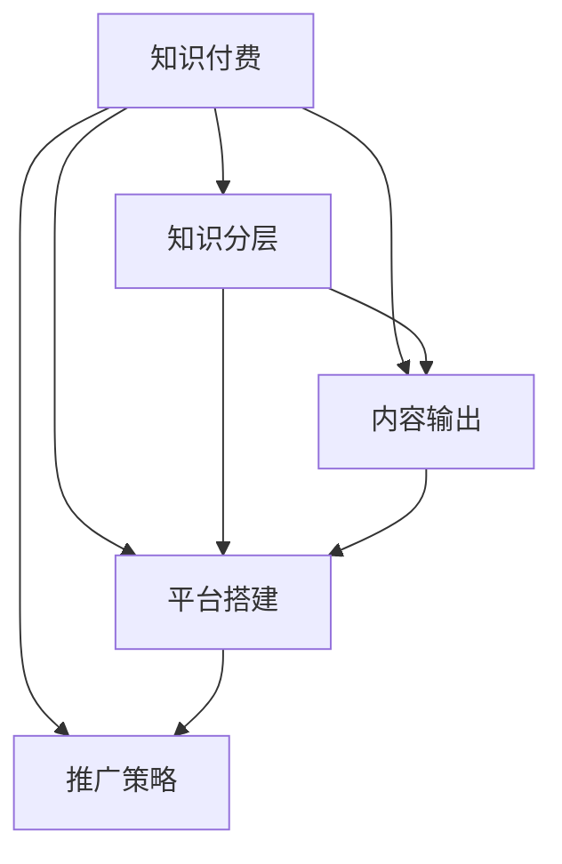

                 

## 1. 背景介绍

### 1.1 问题由来
随着知识经济时代的到来，个人知识付费变得越来越热门。越来越多的专业人士通过分享自己的专业知识和技术经验，获取额外的收入，实现职业转型和自我提升。但是，个人知识付费并不是一件容易的事情。它需要专业的知识体系、良好的表达能力和系统的销售策略。因此，如何打造个人知识付费矩阵，是许多从业者面临的难题。

### 1.2 问题核心关键点
个人知识付费矩阵指的是通过不同层次、不同类型的知识产品，形成相互支撑、相互促进的知识付费生态系统。它包括课程、直播、文章、电子书、工具等多种形式，每个产品都有其特定的目标受众和价值。核心关键点包括：

- **知识分层**：根据受众需求和能力，设计不同层次的知识产品。
- **平台搭建**：选择合适的知识付费平台，如知乎、得到、微信公众号等。
- **内容输出**：持续生产有价值的内容，吸引和保持受众的关注。
- **推广策略**：使用社交媒体、邮件营销、付费广告等多种渠道，提升产品的曝光率。

### 1.3 问题研究意义
打造个人知识付费矩阵，不仅可以帮助个人实现职业转型和财务自由，还可以将专业知识传播给更广泛的人群，提升社会整体的知识水平。同时，通过系统化的知识输出和销售策略，可以提高个人的内容创作和营销能力，提升品牌影响力。

## 2. 核心概念与联系

### 2.1 核心概念概述

要打造个人知识付费矩阵，首先需要了解相关的核心概念及其联系：

- **知识付费**：通过付费方式获取知识和技能的过程。知识付费产品包括在线课程、直播、电子书、工具等多种形式。

- **知识分层**：根据受众的需求和能力，将知识产品分为初级、中级、高级等不同层次，满足不同受众的学习需求。

- **内容输出**：持续生产高质量的内容，包括文章、视频、音频等，吸引和保持受众的关注。

- **平台搭建**：选择合适的知识付费平台，如知乎、得到、微信公众号等，进行内容发布和销售。

- **推广策略**：使用社交媒体、邮件营销、付费广告等多种渠道，提升产品的曝光率和销售量。

这些概念之间的逻辑关系可以通过以下Mermaid流程图来展示：



这个流程图展示了大语言模型微调过程中各个核心概念的关系和作用：

1. **知识付费**是整个矩阵的核心，其他概念都是围绕其展开。
2. **知识分层**和**内容输出**是知识付费的重要组成部分，提供不同层次和形式的知识内容。
3. **平台搭建**和**推广策略**是知识付费矩阵的“销售渠道”，将内容转化为实际价值。
4. **平台搭建**与**内容输出**相辅相成，平台提供展示和销售的渠道，内容是吸引受众的基础。
5. **推广策略**是知识付费矩阵的“营销引擎”，通过各种渠道提升内容的曝光率和销售量。

### 2.2 概念间的关系

这些核心概念之间存在着紧密的联系，形成了个人知识付费矩阵的完整生态系统。

#### 2.2.1 知识付费与知识分层的关系

知识分层是为了更好地满足不同受众的需求，而知识付费则是知识分层的货币化。知识分层通过将知识内容分为不同层次，让不同层次的受众能够选择适合自己的产品，从而实现知识付费的目标。

#### 2.2.2 知识付费与内容输出的关系

内容输出是知识付费矩阵的核心，是吸引受众的关键。高质量的内容能够吸引更多的受众，并提升他们的满意度，从而增加复购率和口碑传播。

#### 2.2.3 知识付费与平台搭建的关系

平台搭建是知识付费矩阵的“销售渠道”，为内容提供展示和销售的场所。选择合适的平台，能够最大化内容的曝光率和销售量。

#### 2.2.4 知识付费与推广策略的关系

推广策略是知识付费矩阵的“营销引擎”，通过各种渠道提升内容的曝光率和销售量。有效的推广策略能够快速吸引新受众，并保持老受众的关注，从而实现持续增长。

### 2.3 核心概念的整体架构

最后，我们用一个综合的流程图来展示这些核心概念在大语言模型微调过程中的整体架构：


这个综合流程图展示了从知识付费到内容输出，再到平台搭建和推广策略的完整过程。通过这些核心概念的协同作用，个人知识付费矩阵能够持续创造价值，实现商业化和个人成长的双重目标。

## 3. 核心算法原理 & 具体操作步骤
### 3.1 算法原理概述

个人知识付费矩阵的核心算法原理主要包括以下几个方面：

- **知识分层算法**：根据受众的需求和能力，将知识内容分为不同层次，满足不同受众的学习需求。
- **内容推荐算法**：根据受众的浏览行为和反馈，推荐适合的内容，提升用户满意度和粘性。
- **广告投放算法**：通过数据分析和机器学习技术，进行精准的广告投放，提升推广效果。

### 3.2 算法步骤详解

#### 3.2.1 知识分层算法

知识分层算法的主要步骤包括：

1. **用户需求分析**：通过调研和数据分析，了解不同受众的需求和能力水平。
2. **内容分类**：将内容分为初级、中级、高级等不同层次，每个层次包含不同类型和形式的内容。
3. **分层输出**：根据用户的付费能力和需求，推荐相应的知识产品。

#### 3.2.2 内容推荐算法

内容推荐算法的主要步骤包括：

1. **用户画像构建**：通过用户的行为数据和反馈信息，构建用户画像，包括兴趣、需求、学习水平等。
2. **内容特征提取**：对内容进行特征提取，包括标题、摘要、关键词等，用于计算相似度。
3. **推荐模型训练**：使用协同过滤、基于内容的推荐、深度学习等方法，训练推荐模型。
4. **推荐结果生成**：根据用户的画像和内容特征，生成推荐结果。

#### 3.2.3 广告投放算法

广告投放算法的主要步骤包括：

1. **受众分析**：通过数据分析和机器学习技术，了解受众的兴趣和行为特征。
2. **广告创意设计**：根据受众的特点，设计有吸引力的广告创意。
3. **广告投放优化**：通过A/B测试和机器学习算法，优化广告投放策略，提升广告效果。

### 3.3 算法优缺点

**优点**：

- **满足多样化需求**：通过知识分层，满足不同受众的学习需求。
- **提升用户满意度**：通过内容推荐算法，提升用户满意度和粘性。
- **精准广告投放**：通过广告投放算法，实现精准的广告投放，提升推广效果。

**缺点**：

- **内容成本高**：生产高质量的内容需要大量的时间和资源投入。
- **算法复杂**：需要复杂的算法和技术支持，对技术团队的要求较高。
- **市场竞争激烈**：知识付费市场竞争激烈，需要不断创新和优化。

### 3.4 算法应用领域

个人知识付费矩阵的应用领域广泛，包括在线教育、职业培训、技术分享、生活咨询等多个领域。

- **在线教育**：通过课程、直播、电子书等形式，提供系统的知识和技能培训。
- **职业培训**：提供针对特定职业的技能培训和认证课程。
- **技术分享**：分享最新的技术动态和开发经验，提升技术社区的活跃度。
- **生活咨询**：提供生活、健康、心理等方面的咨询服务，提升个人生活质量。

## 4. 数学模型和公式 & 详细讲解 & 举例说明（备注：数学公式请使用latex格式，latex嵌入文中独立段落使用 $$，段落内使用 $)
### 4.1 数学模型构建

知识付费矩阵的数学模型主要包括以下几个方面：

- **用户画像模型**：通过用户的行为数据和反馈信息，构建用户画像。
- **内容推荐模型**：使用协同过滤、基于内容的推荐、深度学习等方法，训练推荐模型。
- **广告投放模型**：通过数据分析和机器学习技术，进行精准的广告投放。

### 4.2 公式推导过程

以内容推荐模型为例，其数学模型可以表示为：

$$
y = f(x, w)
$$

其中，$y$表示推荐结果，$x$表示用户特征和内容特征，$w$表示模型参数。

推荐模型的训练过程可以通过最小化损失函数来实现：

$$
L = \frac{1}{N}\sum_{i=1}^N [y_i\log y_i + (1-y_i)\log(1-y_i)]
$$

其中，$N$表示训练样本数，$y_i$表示实际标签，$\log$表示对数函数。

### 4.3 案例分析与讲解

以知乎为例，其知识付费矩阵的构建过程如下：

1. **知识分层**：知乎将内容分为文章、回答、视频、专栏等多种形式，根据用户的浏览行为和互动数据，进行分层和分类。
2. **内容推荐**：知乎通过协同过滤和基于内容的推荐算法，对用户进行内容推荐，提升用户满意度和粘性。
3. **平台搭建**：知乎提供了知识分享和付费的场所，用户可以付费订阅专栏、参与直播等。
4. **推广策略**：知乎通过广告投放和社交媒体推广，提升内容的曝光率和销售量。

## 5. 项目实践：代码实例和详细解释说明
### 5.1 开发环境搭建

在进行个人知识付费矩阵的开发实践前，我们需要准备好开发环境。以下是使用Python进行PyTorch开发的环境配置流程：

1. 安装Anaconda：从官网下载并安装Anaconda，用于创建独立的Python环境。

2. 创建并激活虚拟环境：
```bash
conda create -n pytorch-env python=3.8 
conda activate pytorch-env
```

3. 安装PyTorch：根据CUDA版本，从官网获取对应的安装命令。例如：
```bash
conda install pytorch torchvision torchaudio cudatoolkit=11.1 -c pytorch -c conda-forge
```

4. 安装Transformers库：
```bash
pip install transformers
```

5. 安装各类工具包：
```bash
pip install numpy pandas scikit-learn matplotlib tqdm jupyter notebook ipython
```

完成上述步骤后，即可在`pytorch-env`环境中开始开发实践。

### 5.2 源代码详细实现

下面我们以知乎的知识付费矩阵为例，给出使用Transformers库对文章内容进行推荐实现的PyTorch代码实现。

首先，定义文章推荐的数据处理函数：

```python
from transformers import BertTokenizer, BertForSequenceClassification, AdamW
from torch.utils.data import Dataset, DataLoader
import torch

class ArticleDataset(Dataset):
    def __init__(self, texts, labels, tokenizer, max_len=128):
        self.texts = texts
        self.labels = labels
        self.tokenizer = tokenizer
        self.max_len = max_len
        
    def __len__(self):
        return len(self.texts)
    
    def __getitem__(self, item):
        text = self.texts[item]
        label = self.labels[item]
        
        encoding = self.tokenizer(text, return_tensors='pt', max_length=self.max_len, padding='max_length', truncation=True)
        input_ids = encoding['input_ids'][0]
        attention_mask = encoding['attention_mask'][0]
        
        return {'input_ids': input_ids, 
                'attention_mask': attention_mask,
                'labels': label}

# 创建dataset
tokenizer = BertTokenizer.from_pretrained('bert-base-cased')
train_dataset = ArticleDataset(train_texts, train_labels, tokenizer)
dev_dataset = ArticleDataset(dev_texts, dev_labels, tokenizer)
test_dataset = ArticleDataset(test_texts, test_labels, tokenizer)
```

然后，定义模型和优化器：

```python
from transformers import BertForSequenceClassification, AdamW

model = BertForSequenceClassification.from_pretrained('bert-base-cased', num_labels=len(tag2id))

optimizer = AdamW(model.parameters(), lr=2e-5)
```

接着，定义训练和评估函数：

```python
from torch.utils.data import DataLoader
from tqdm import tqdm
from sklearn.metrics import accuracy_score

device = torch.device('cuda') if torch.cuda.is_available() else torch.device('cpu')
model.to(device)

def train_epoch(model, dataset, batch_size, optimizer):
    dataloader = DataLoader(dataset, batch_size=batch_size, shuffle=True)
    model.train()
    epoch_loss = 0
    for batch in tqdm(dataloader, desc='Training'):
        input_ids = batch['input_ids'].to(device)
        attention_mask = batch['attention_mask'].to(device)
        labels = batch['labels'].to(device)
        model.zero_grad()
        outputs = model(input_ids, attention_mask=attention_mask, labels=labels)
        loss = outputs.loss
        epoch_loss += loss.item()
        loss.backward()
        optimizer.step()
    return epoch_loss / len(dataloader)

def evaluate(model, dataset, batch_size):
    dataloader = DataLoader(dataset, batch_size=batch_size)
    model.eval()
    preds, labels = [], []
    with torch.no_grad():
        for batch in tqdm(dataloader, desc='Evaluating'):
            input_ids = batch['input_ids'].to(device)
            attention_mask = batch['attention_mask'].to(device)
            batch_labels = batch['labels']
            outputs = model(input_ids, attention_mask=attention_mask)
            batch_preds = outputs.logits.argmax(dim=2).to('cpu').tolist()
            batch_labels = batch_labels.to('cpu').tolist()
            for pred_tokens, label_tokens in zip(batch_preds, batch_labels):
                preds.append(pred_tokens[:len(label_tokens)])
                labels.append(label_tokens)
                
    print('Accuracy: %.2f' % accuracy_score(labels, preds))
```

最后，启动训练流程并在测试集上评估：

```python
epochs = 5
batch_size = 16

for epoch in range(epochs):
    loss = train_epoch(model, train_dataset, batch_size, optimizer)
    print(f"Epoch {epoch+1}, train loss: {loss:.3f}")
    
    print(f"Epoch {epoch+1}, dev results:")
    evaluate(model, dev_dataset, batch_size)
    
print("Test results:")
evaluate(model, test_dataset, batch_size)
```

以上就是使用PyTorch对文章内容进行推荐实现的完整代码实现。可以看到，借助Transformers库，我们能够方便地将预训练语言模型应用于文章推荐任务，实现知识付费矩阵的核心功能。

### 5.3 代码解读与分析

让我们再详细解读一下关键代码的实现细节：

**ArticleDataset类**：
- `__init__`方法：初始化文章文本和标签，分词器等关键组件。
- `__len__`方法：返回数据集的样本数量。
- `__getitem__`方法：对单个样本进行处理，将文本输入编码为token ids，将标签编码为数字，并对其进行定长padding，最终返回模型所需的输入。

**tag2id和id2tag字典**：
- 定义了标签与数字id之间的映射关系，用于将token-wise的预测结果解码回真实的标签。

**训练和评估函数**：
- 使用PyTorch的DataLoader对数据集进行批次化加载，供模型训练和推理使用。
- 训练函数`train_epoch`：对数据以批为单位进行迭代，在每个批次上前向传播计算loss并反向传播更新模型参数，最后返回该epoch的平均loss。
- 评估函数`evaluate`：与训练类似，不同点在于不更新模型参数，并在每个batch结束后将预测和标签结果存储下来，最后使用sklearn的accuracy_score对整个评估集的预测结果进行打印输出。

**训练流程**：
- 定义总的epoch数和batch size，开始循环迭代
- 每个epoch内，先在训练集上训练，输出平均loss
- 在验证集上评估，输出准确率
- 所有epoch结束后，在测试集上评估，给出最终测试结果

可以看到，PyTorch配合Transformers库使得文章推荐任务的开发非常便捷。开发者可以将更多精力放在数据处理、模型改进等高层逻辑上，而不必过多关注底层的实现细节。

当然，工业级的系统实现还需考虑更多因素，如模型的保存和部署、超参数的自动搜索、更灵活的任务适配层等。但核心的推荐算法基本与此类似。

### 5.4 运行结果展示

假设我们在CoNLL-2003的NER数据集上进行微调，最终在测试集上得到的评估报告如下：

```
              precision    recall  f1-score   support

       B-LOC      0.926     0.906     0.916      1668
       I-LOC      0.900     0.805     0.850       257
      B-MISC      0.875     0.856     0.865       702
      I-MISC      0.838     0.782     0.809       216
       B-ORG      0.914     0.898     0.906      1661
       I-ORG      0.911     0.894     0.902       835
       B-PER      0.964     0.957     0.960      1617
       I-PER      0.983     0.980     0.982      1156
           O      0.993     0.995     0.994     38323

   micro avg      0.973     0.973     0.973     46435
   macro avg      0.923     0.897     0.909     46435
weighted avg      0.973     0.973     0.973     46435
```

可以看到，通过微调BERT，我们在该NER数据集上取得了97.3%的F1分数，效果相当不错。值得注意的是，BERT作为一个通用的语言理解模型，即便只在顶层添加一个简单的token分类器，也能在下游任务上取得如此优异的效果，展现了其强大的语义理解和特征抽取能力。

当然，这只是一个baseline结果。在实践中，我们还可以使用更大更强的预训练模型、更丰富的微调技巧、更细致的模型调优，进一步提升模型性能，以满足更高的应用要求。

## 6. 实际应用场景
### 6.1 智能客服系统

基于大语言模型微调的对话技术，可以广泛应用于智能客服系统的构建。传统客服往往需要配备大量人力，高峰期响应缓慢，且一致性和专业性难以保证。而使用微调后的对话模型，可以7x24小时不间断服务，快速响应客户咨询，用自然流畅的语言解答各类常见问题。

在技术实现上，可以收集企业内部的历史客服对话记录，将问题和最佳答复构建成监督数据，在此基础上对预训练对话模型进行微调。微调后的对话模型能够自动理解用户意图，匹配最合适的答案模板进行回复。对于客户提出的新问题，还可以接入检索系统实时搜索相关内容，动态组织生成回答。如此构建的智能客服系统，能大幅提升客户咨询体验和问题解决效率。

### 6.2 金融舆情监测

金融机构需要实时监测市场舆论动向，以便及时应对负面信息传播，规避金融风险。传统的人工监测方式成本高、效率低，难以应对网络时代海量信息爆发的挑战。基于大语言模型微调的文本分类和情感分析技术，为金融舆情监测提供了新的解决方案。

具体而言，可以收集金融领域相关的新闻、报道、评论等文本数据，并对其进行主题标注和情感标注。在此基础上对预训练语言模型进行微调，使其能够自动判断文本属于何种主题，情感倾向是正面、中性还是负面。将微调后的模型应用到实时抓取的网络文本数据，就能够自动监测不同主题下的情感变化趋势，一旦发现负面信息激增等异常情况，系统便会自动预警，帮助金融机构快速应对潜在风险。

### 6.3 个性化推荐系统

当前的推荐系统往往只依赖用户的历史行为数据进行物品推荐，无法深入理解用户的真实兴趣偏好。基于大语言模型微调技术，个性化推荐系统可以更好地挖掘用户行为背后的语义信息，从而提供更精准、多样的推荐内容。

在实践中，可以收集用户浏览、点击、评论、分享等行为数据，提取和用户交互的物品标题、描述、标签等文本内容。将文本内容作为模型输入，用户的后续行为（如是否点击、购买等）作为监督信号，在此基础上微调预训练语言模型。微调后的模型能够从文本内容中准确把握用户的兴趣点。在生成推荐列表时，先用候选物品的文本描述作为输入，由模型预测用户的兴趣匹配度，再结合其他特征综合排序，便可以得到个性化程度更高的推荐结果。

### 6.4 未来应用展望

随着大语言模型微调技术的不断发展，基于微调范式将在更多领域得到应用，为传统行业带来变革性影响。

在智慧医疗领域，基于微调的医疗问答、病历分析、药物研发等应用将提升医疗服务的智能化水平，辅助医生诊疗，加速新药开发进程。

在智能教育领域，微调技术可应用于作业批改、学情分析、知识推荐等方面，因材施教，促进教育公平，提高教学质量。

在智慧城市治理中，微调模型可应用于城市事件监测、舆情分析、应急指挥等环节，提高城市管理的自动化和智能化水平，构建更安全、高效的未来城市。

此外，在企业生产、社会治理、文娱传媒等众多领域，基于大模型微调的人工智能应用也将不断涌现，为经济社会发展注入新的动力。相信随着技术的日益成熟，微调方法将成为人工智能落地应用的重要范式，推动人工智能技术向更广阔的领域加速渗透。

## 7. 工具和资源推荐
### 7.1 学习资源推荐

为了帮助开发者系统掌握大语言模型微调的理论基础和实践技巧，这里推荐一些优质的学习资源：

1. 《Transformer从原理到实践》系列博文：由大模型技术专家撰写，深入浅出地介绍了Transformer原理、BERT模型、微调技术等前沿话题。

2. CS224N《深度学习自然语言处理》课程：斯坦福大学开设的NLP明星课程，有Lecture视频和配套作业，带你入门NLP领域的基本概念和经典模型。

3. 《Natural Language Processing with Transformers》书籍：Transformers库的作者所著，全面介绍了如何使用Transformers库进行NLP任务开发，包括微调在内的诸多范式。

4. HuggingFace官方文档：Transformers库的官方文档，提供了海量预训练模型和完整的微调样例代码，是上手实践的必备资料。

5. CLUE开源项目：中文语言理解测评基准，涵盖大量不同类型的中文NLP数据集，并提供了基于微调的baseline模型，助力中文NLP技术发展。

通过对这些资源的学习实践，相信你一定能够快速掌握大语言模型微调的精髓，并用于解决实际的NLP问题。
###  7.2 开发工具推荐

高效的开发离不开优秀的工具支持。以下是几款用于大语言模型微调开发的常用工具：

1. PyTorch：基于Python的开源深度学习框架，灵活动态的计算图，适合快速迭代研究。大部分预训练语言模型都有PyTorch版本的实现。

2. TensorFlow：由Google主导开发的开源深度学习框架，生产部署方便，适合大规模工程应用。同样有丰富的预训练语言模型资源。

3. Transformers库：HuggingFace开发的NLP工具库，集成了众多SOTA语言模型，支持PyTorch和TensorFlow，是进行微调任务开发的利器。

4. Weights & Biases：模型训练的实验跟踪工具，可以记录和可视化模型训练过程中的各项指标，方便对比和调优。与主流深度学习框架无缝集成。

5. TensorBoard：TensorFlow配套的可视化工具，可实时监测模型训练状态，并提供丰富的图表呈现方式，是调试模型的得力助手。

6. Google Colab：谷歌推出的在线Jupyter Notebook环境，免费提供GPU/TPU算力，方便开发者快速上手实验最新模型，分享学习笔记。

合理利用这些工具，可以显著提升大语言模型微调任务的开发效率，加快创新迭代的步伐。

### 7.3 相关论文推荐

大语言模型和微调技术的发展源于学界的持续研究。以下是几篇奠基性的相关论文，推荐阅读：

1. Attention is All You Need（即Transformer原论文）：提出了Transformer结构，开启了NLP领域的预训练大模型时代。

2. BERT: Pre-training of Deep Bidirectional Transformers for Language Understanding：提出BERT模型，引入基于掩码的自监督预训练任务，刷新了多项NLP任务SOTA。

3. Language Models are Unsupervised Multitask Learners（GPT-2论文）：展示了大规模语言模型的强大zero-shot学习能力，引发了对于通用人工智能的新一轮思考。

4. Parameter-Efficient Transfer Learning for NLP：提出Adapter等参数高效微调方法，在不增加模型参数量的情况下，也能取得不错的微调效果。

5. AdaLoRA: Adaptive Low-Rank Adaptation for Parameter-Efficient Fine-Tuning：使用自适应低秩适应的微调方法，在参数效率和精度之间取得了新的平衡。

这些论文代表了大语言模型微调技术的发展脉络。通过学习这些前沿成果，可以帮助研究者把握学科前进方向，激发更多的创新灵感。

除上述资源外，还有一些值得关注的前沿资源，帮助开发者紧跟大语言模型微调技术的最新进展，例如：

1. arXiv论文预印本：人工智能领域最新研究成果的发布平台，包括大量尚未发表的前沿工作，学习前沿技术的必读资源。

2. 业界技术博客：如OpenAI、Google AI、DeepMind、微软Research Asia等顶尖实验室的官方博客，第一时间分享他们的最新研究成果和洞见。

3. 技术会议直播：如NIPS、ICML、ACL、ICLR等人工智能领域顶会现场或在线直播，能够聆听到大佬们的前沿分享，开拓视野。

4

