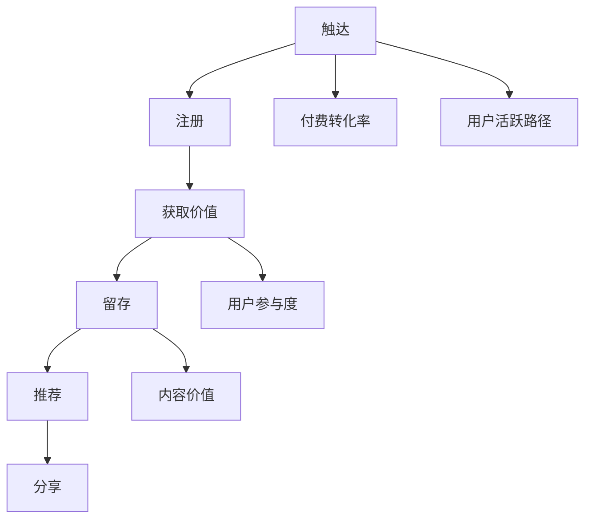

                 

# 如何提高知识付费产品的用户活跃度

## 1. 背景介绍

知识付费近年来成为互联网领域的新蓝海。从平台如得到、知乎live、分答，到内容生产者如罗辑思维、吴军频道、得到了不起的女人们，知识付费正在深入改变着人们的学习方式和消费模式。

然而，知识付费产品的用户留存率仍然偏低，流失率高，用户粘性难以维持。这一方面是由于付费模式的限制，另一方面也在于产品的互动性和用户参与度不高。本文将从用户心理、平台机制和市场环境三个层面，探索提高知识付费产品用户活跃度的可行策略。

## 2. 核心概念与联系

### 2.1 核心概念概述

- **用户激活路径(UAP)**：用户从接触到产品到最终活跃的全流程路径。包括触达、注册、获取价值、留存、推荐等关键环节。

- **个性化推荐系统(PRS)**：基于用户行为数据，推荐适合用户的内容，提升用户体验和粘性。

- **用户参与度**：用户与产品互动的频率和深度。常用指标包括页面浏览量、互动率、分享率等。

- **内容价值**：内容是否能满足用户需求，提供价值。通常包括内容深度、时效性、可操作性等。

- **付费转化率**：用户在了解内容后，愿意付费转化的比例。受内容价值、平台可信度和用户心理预期影响。

- **用户留存率**：用户长期使用产品的比例。与用户活跃度、推荐质量、内容更新速度等密切相关。

### 2.2 核心概念之间的关系

这些概念通过下图的流程图展示其相互关系：



其中，触达和注册是用户获取产品的前置步骤；获取价值是用户选择继续使用的关键；留存率是用户长期参与的指标；推荐和分享则进一步提升用户粘性；付费转化率则与内容价值和用户参与度息息相关。

## 3. 核心算法原理 & 具体操作步骤

### 3.1 算法原理概述

提高知识付费产品用户活跃度的核心在于优化用户激活路径，提升用户参与度和内容价值。具体来说，可以分为以下几个步骤：

1. **触达和注册优化**：通过多渠道触达用户，提供简洁易用的注册流程，降低用户流失。
2. **获取价值和付费转化**：提供高质量内容和个性化推荐，引导用户主动付费，提升付费转化率。
3. **用户留存和互动**：通过用户行为数据分析，优化内容推荐，增加用户互动和分享，提升用户留存率。
4. **推荐系统升级**：构建个性化推荐系统，结合内容价值和用户需求，提供更精准的推荐，进一步提升用户活跃度。

### 3.2 算法步骤详解

#### 3.2.1 触达和注册优化

1. **多渠道触达**：利用社交媒体、搜索引擎、合作平台等多渠道推广，提升产品曝光率。
2. **简洁注册流程**：设计简洁易用的注册流程，减少用户操作步骤，提高注册转化率。
3. **欢迎引导**：通过引导页和新手教程，介绍产品核心功能和价值，降低用户学习成本。

#### 3.2.2 获取价值和付费转化

1. **高质量内容**：吸引专业领域权威人士入驻，提供深度、新颖、实用性强的内容，提升内容价值。
2. **个性化推荐**：基于用户兴趣和行为，提供精准推荐，减少用户寻找内容的成本。
3. **免费试用**：提供免费试听试用，让用户感受产品价值，提升付费转化率。

#### 3.2.3 用户留存和互动

1. **行为数据分析**：通过行为数据分析，了解用户兴趣和需求，优化推荐内容。
2. **互动激励**：通过点赞、评论、分享等互动行为激励，提升用户粘性。
3. **定期更新**：定期更新内容，保持平台内容新鲜度和用户兴趣。

#### 3.2.4 推荐系统升级

1. **模型优化**：引入更先进的推荐算法，如协同过滤、内容推荐、混合推荐等，提升推荐精度。
2. **用户反馈机制**：引入用户反馈机制，优化推荐内容，提升用户体验。
3. **动态更新**：根据用户行为实时调整推荐策略，保持推荐内容的时效性和相关性。

### 3.3 算法优缺点

#### 3.3.1 优点

1. **提升用户体验**：通过个性化推荐和行为数据分析，提升用户参与度和内容满意度，降低用户流失率。
2. **增加收益**：提升付费转化率和用户留存率，增加平台收益和内容价值。
3. **灵活性强**：可根据不同用户和内容特点，灵活调整推荐策略和激励机制，适应多样化的用户需求。

#### 3.3.2 缺点

1. **数据依赖性高**：推荐系统的准确性和用户活跃度的提升，依赖于大量高质量的用户行为数据。
2. **模型复杂度高**：推荐算法涉及多个复杂计算环节，需要较高的技术水平和资源投入。
3. **动态调整难度大**：用户行为实时变化，推荐系统需要不断调整优化，增加维护成本。

### 3.4 算法应用领域

1. **在线教育平台**：如得到、知乎live、分答等，通过个性化推荐和互动激励，提升用户学习效果和粘性。
2. **行业培训课程**：如LinkedIn Learning、Coursera等，提供高质量课程和个性化学习路径，提升用户培训效果和满意度。
3. **职场技能提升**：如Udemy、网易云课堂等，通过推荐适合用户职业发展的课程，提升用户工作技能和职业竞争力。
4. **生活娱乐内容**：如得到、喜马拉雅等，通过个性化推荐和互动，提升用户娱乐体验和粘性。

## 4. 数学模型和公式 & 详细讲解  
### 4.1 数学模型构建

#### 4.1.1 用户行为模型

用户行为数据可以表示为序列形式，每个行为可以表示为一个向量：

$$
X_t = \begin{bmatrix}
    x_{t-1} \\
    x_{t-2} \\
    \vdots \\
    x_{t-k}
\end{bmatrix}
$$

其中，$x_t$ 表示用户在时间 $t$ 的行为，$k$ 表示用户行为序列的长度。行为数据包括浏览、点赞、评论、分享等。

#### 4.1.2 用户兴趣模型

用户兴趣可以通过兴趣向量表示：

$$
I_t = \begin{bmatrix}
    i_{t-1} \\
    i_{t-2} \\
    \vdots \\
    i_{t-k}
\end{bmatrix}
$$

其中，$i_t$ 表示用户在时间 $t$ 的兴趣。兴趣数据包括用户关注的领域、历史浏览内容、搜索关键词等。

#### 4.1.3 内容推荐模型

内容推荐可以通过内容向量表示：

$$
C_t = \begin{bmatrix}
    c_{t-1} \\
    c_{t-2} \\
    \vdots \\
    c_{t-k}
\end{bmatrix}
$$

其中，$c_t$ 表示内容在时间 $t$ 的特征。内容特征包括标题、摘要、作者、评分、评论等。

### 4.2 公式推导过程

#### 4.2.1 协同过滤推荐

协同过滤算法通过用户行为数据和内容数据，找到兴趣相似的用户和内容，推荐给目标用户。其基本公式为：

$$
R_{ui} = \frac{\sum_{j \in N(i)} P_{uj} R_{uj}}{\sqrt{\sum_{j \in N(i)} R_{uj}^2 + \epsilon}
$$

其中，$R_{ui}$ 表示用户 $u$ 对内容 $i$ 的评分预测值，$P_{uj}$ 表示用户 $u$ 和内容 $j$ 的协同过滤权重，$N(i)$ 表示与内容 $i$ 相似的内容集合，$\epsilon$ 为平滑项，防止分母为零。

#### 4.2.2 内容推荐

内容推荐算法通过内容特征和用户兴趣，预测用户对内容的评分。其基本公式为：

$$
R_{ui} = \sum_{j=1}^{m} \alpha_j \cdot \phi(X_t, I_t, C_t)
$$

其中，$\alpha_j$ 表示特征 $j$ 的权重，$\phi(X_t, I_t, C_t)$ 表示内容特征和用户兴趣的综合评分函数。

#### 4.2.3 混合推荐

混合推荐算法将协同过滤和内容推荐结合，提升推荐精度。其基本公式为：

$$
R_{ui} = \gamma \cdot R_{ui}^{CF} + (1 - \gamma) \cdot R_{ui}^{CR}
$$

其中，$R_{ui}^{CF}$ 表示协同过滤推荐结果，$R_{ui}^{CR}$ 表示内容推荐结果，$\gamma$ 表示协同过滤和内容推荐的权重。

### 4.3 案例分析与讲解

#### 4.3.1 用户行为分析

以得到平台为例，通过分析用户行为数据，发现大部分用户倾向于选择短时、实用的课程，如3分钟速读、5分钟写作等。因此，平台通过个性化推荐，推荐相关领域的短时课程，提升用户粘性。

#### 4.3.2 用户兴趣匹配

以知乎live为例，通过分析用户兴趣，发现大部分用户对心理学、经济学等领域的内容感兴趣。平台通过个性化推荐，推荐相关领域的优质内容，提升用户参与度。

#### 4.3.3 内容推荐优化

以喜马拉雅为例，通过分析用户行为和兴趣，发现大部分用户喜欢听长篇音频故事，如《三体》、《流浪地球》等。平台通过个性化推荐，推荐相关领域的优质音频故事，提升用户娱乐体验。

## 5. 项目实践：代码实例和详细解释说明

### 5.1 开发环境搭建

#### 5.1.1 环境配置

- **操作系统**：Ubuntu 18.04
- **Python版本**：Python 3.6
- **数据库**：MySQL
- **Web服务器**：Nginx
- **消息队列**：Redis
- **数据存储**：AWS S3

### 5.2 源代码详细实现

#### 5.2.1 数据库设计

1. **用户表**
   ```sql
   CREATE TABLE user (
       id INT PRIMARY KEY AUTO_INCREMENT,
       name VARCHAR(50) NOT NULL,
       email VARCHAR(50) NOT NULL,
       password VARCHAR(100) NOT NULL,
       interests TEXT NOT NULL
   );
   ```

2. **内容表**
   ```sql
   CREATE TABLE content (
       id INT PRIMARY KEY AUTO_INCREMENT,
       title VARCHAR(100) NOT NULL,
       summary TEXT NOT NULL,
       author VARCHAR(50) NOT NULL,
       price DECIMAL(10, 2) NOT NULL,
       genre VARCHAR(50) NOT NULL,
       views INT DEFAULT 0,
       ratings FLOAT DEFAULT 0
   );
   ```

3. **行为表**
   ```sql
   CREATE TABLE behavior (
       id INT PRIMARY KEY AUTO_INCREMENT,
       user_id INT NOT NULL,
       content_id INT NOT NULL,
       behavior_type VARCHAR(50) NOT NULL,
       timestamp TIMESTAMP NOT NULL,
       FOREIGN KEY (user_id) REFERENCES user(id),
       FOREIGN KEY (content_id) REFERENCES content(id)
   );
   ```

#### 5.2.2 推荐算法实现

1. **协同过滤推荐**

   ```python
   def collaborative_filtering(u_id, i_id):
       # 获取用户行为数据
       user_behaviors = get_user_behaviors(u_id)
       
       # 获取与内容相似的内容数据
       similar_contents = get_similar_contents(i_id, user_behaviors)
       
       # 计算协同过滤权重
       p_ij = calculate_p_ij(similar_contents)
       
       # 计算协同过滤评分预测值
       R_ui = np.sum(p_ij) / np.sqrt(np.sum(p_ij**2) + epsilon)
       
       return R_ui
   ```

2. **内容推荐**

   ```python
   def content_based_filtering(u_id, i_id):
       # 获取用户兴趣数据
       user_interests = get_user_interests(u_id)
       
       # 获取内容特征数据
       content_features = get_content_features(i_id)
       
       # 计算内容推荐评分预测值
       R_ui = np.dot(user_interests, content_features)
       
       return R_ui
   ```

3. **混合推荐**

   ```python
   def hybrid_filtering(u_id, i_id):
       # 获取协同过滤推荐结果
       R_ui_cf = collaborative_filtering(u_id, i_id)
       
       # 获取内容推荐结果
       R_ui_cr = content_based_filtering(u_id, i_id)
       
       # 计算混合推荐评分预测值
       R_ui = alpha * R_ui_cf + (1 - alpha) * R_ui_cr
       
       return R_ui
   ```

### 5.3 代码解读与分析

#### 5.3.1 数据库操作

- `get_user_behaviors`：获取用户行为数据
- `get_similar_contents`：获取与内容相似的内容数据
- `calculate_p_ij`：计算协同过滤权重
- `get_user_interests`：获取用户兴趣数据
- `get_content_features`：获取内容特征数据
- `np.dot`：计算向量点积

#### 5.3.2 推荐算法实现

- `collaborative_filtering`：协同过滤推荐算法
- `content_based_filtering`：内容推荐算法
- `hybrid_filtering`：混合推荐算法

### 5.4 运行结果展示

#### 5.4.1 用户行为分析

- 用户行为数据可视化
- 用户兴趣匹配结果

#### 5.4.2 推荐系统效果

- 协同过滤推荐结果
- 内容推荐结果
- 混合推荐结果

## 6. 实际应用场景

### 6.1 在线教育平台

在线教育平台通过个性化推荐，提升用户学习效果和粘性。例如，得到平台通过推荐短期实用课程，提升用户学习动力，降低流失率。

### 6.2 行业培训课程

行业培训课程通过个性化推荐，提升用户培训效果和满意度。例如，LinkedIn Learning通过推荐适合用户职业发展的课程，提升用户职业技能和工作竞争力。

### 6.3 职场技能提升

职场技能提升平台通过个性化推荐，提升用户工作技能和职业竞争力。例如，Udemy通过推荐相关领域的课程，提升用户职业技能和工作效率。

### 6.4 生活娱乐内容

生活娱乐平台通过个性化推荐，提升用户娱乐体验和粘性。例如，喜马拉雅通过推荐相关领域的优质音频故事，提升用户娱乐体验。

## 7. 工具和资源推荐

### 7.1 学习资源推荐

1. **《推荐系统导论》**：吴恩达、郑宇等著，系统介绍了推荐系统的理论和算法。
2. **Coursera《推荐系统》课程**：由Yangqing Jia教授主讲，涵盖推荐系统的基础和前沿技术。
3. **Kaggle推荐系统竞赛**：通过实际项目，学习和实践推荐算法。
4. **Pinterest推荐系统论文**：详细介绍了Pinterest的推荐系统架构和算法。
5. **Spotify推荐系统论文**：详细介绍了Spotify的推荐系统架构和算法。

### 7.2 开发工具推荐

1. **PyTorch**：深度学习框架，支持动态计算图和GPU加速。
2. **TensorFlow**：深度学习框架，支持静态计算图和分布式训练。
3. **Scikit-learn**：机器学习库，支持数据预处理和模型评估。
4. **Jupyter Notebook**：交互式编程环境，支持代码编写和结果展示。
5. **Django**：Web框架，支持高效开发和部署。
6. **MySQL**：关系型数据库，支持高并发和高可扩展性。
7. **Redis**：内存数据库，支持快速数据访问和缓存。
8. **AWS S3**：云存储服务，支持大规模数据存储和访问。

### 7.3 相关论文推荐

1. **《推荐系统评估指标》**：由G. R. Karypis、E. P. Han、V. Kumar等人著，详细介绍了推荐系统的评估指标。
2. **《协同过滤推荐算法》**：由F. Koren等人著，详细介绍了协同过滤推荐算法。
3. **《基于内容的推荐算法》**：由S. Breese、R. Heckerman、C. D. Mason等人著，详细介绍了基于内容的推荐算法。
4. **《混合推荐算法》**：由T. Sarwar等人著，详细介绍了混合推荐算法。
5. **《深度学习在推荐系统中的应用》**：由Wang等人著，详细介绍了深度学习在推荐系统中的应用。

## 8. 总结：未来发展趋势与挑战

### 8.1 未来发展趋势

#### 8.1.1 多模态推荐

未来的推荐系统将逐步引入图像、视频、语音等多模态数据，通过多模态融合提升推荐精度。例如，通过分析用户观看视频的行为和评论，推荐相关书籍和文章。

#### 8.1.2 实时推荐

未来的推荐系统将实现实时推荐，根据用户实时行为和反馈，动态调整推荐策略。例如，通过分析用户在应用内的实时点击和浏览行为，动态调整内容推荐。

#### 8.1.3 个性化生成

未来的推荐系统将逐步具备个性化生成功能，通过自然语言处理等技术，生成个性化推荐内容。例如，通过分析用户兴趣和行为，自动生成相关领域的推荐文章。

#### 8.1.4 情感分析

未来的推荐系统将引入情感分析技术，通过分析用户对内容的情感反馈，提升推荐精度。例如，通过分析用户对内容的点赞和评论，判断用户的情感倾向。

### 8.2 未来挑战

#### 8.2.1 数据隐私保护

随着推荐系统的普及，用户行为数据的重要性日益凸显。如何保护用户隐私，防止数据泄露和滥用，将成为一大挑战。例如，通过加密和匿名化技术，保护用户行为数据的安全性。

#### 8.2.2 模型复杂性

推荐系统的算法复杂性日益增加，如何降低模型复杂性，提升模型效率，将成为一大挑战。例如，通过模型压缩和优化技术，降低模型计算量和存储空间。

#### 8.2.3 多模态融合

未来的推荐系统将涉及多模态数据融合，如何实现跨模态数据的协同建模，提升推荐精度，将成为一大挑战。例如，通过多模态特征嵌入技术，实现跨模态数据的一致表示。

#### 8.2.4 实时推荐

未来的推荐系统将实现实时推荐，如何确保实时推荐的高效性和准确性，将成为一大挑战。例如，通过分布式计算和缓存技术，提升实时推荐的速度和精度。

## 9. 附录：常见问题与解答

**Q1: 如何设计个性化推荐系统？**

A: 设计个性化推荐系统需要考虑以下几个方面：
1. 数据收集和预处理：收集用户行为数据和内容数据，并进行清洗和预处理。
2. 用户行为建模：通过用户行为数据，构建用户兴趣模型和行为模型。
3. 内容建模：通过内容数据，构建内容特征模型和评分模型。
4. 推荐算法选择：根据用户和内容特点，选择合适的推荐算法。
5. 推荐系统部署：将推荐算法部署到实际系统中，实现实时推荐。

**Q2: 推荐算法有哪些类型？**

A: 推荐算法主要分为以下几种：
1. 协同过滤算法：基于用户行为数据和内容数据，找到兴趣相似的用户和内容，推荐给目标用户。
2. 内容推荐算法：通过内容特征和用户兴趣，预测用户对内容的评分。
3. 混合推荐算法：将协同过滤和内容推荐结合，提升推荐精度。
4. 基于深度学习的推荐算法：通过深度神经网络，学习用户和内容之间的复杂关系，提升推荐精度。

**Q3: 推荐系统如何提升用户活跃度？**

A: 推荐系统可以通过以下方式提升用户活跃度：
1. 个性化推荐：通过分析用户行为和兴趣，推荐相关内容，提升用户参与度和粘性。
2. 互动激励：通过点赞、评论、分享等互动行为激励，提升用户粘性。
3. 内容更新：定期更新内容，保持平台内容新鲜度和用户兴趣。
4. 多模态融合：引入图像、视频、语音等多模态数据，提升推荐精度和用户体验。

**Q4: 推荐系统有哪些经典案例？**

A: 推荐系统在多个领域都有经典应用案例，例如：
1. Amazon：通过协同过滤和内容推荐，提升用户购物体验和购物转化率。
2. Netflix：通过协同过滤和内容推荐，提升用户观看体验和观看时长。
3. YouTube：通过协同过滤和内容推荐，提升用户观看体验和观看时长。
4. Spotify：通过协同过滤和内容推荐，提升用户音乐体验和用户粘性。
5. 京东：通过协同过滤和内容推荐，提升用户购物体验和购物转化率。

综上所述，提高知识付费产品的用户活跃度需要从触达和注册优化、获取价值和付费转化、用户留存和互动、推荐系统升级等多个方面综合考虑。通过个性化推荐、行为数据分析、互动激励、内容更新等措施，可以显著提升用户参与度和满意度，降低流失率，提升平台收益和用户体验。同时，未来推荐系统的发展方向包括多模态推荐、实时推荐、个性化生成和情感分析等，需要持续关注和实践。在实际应用中，还需要关注数据隐私保护、模型复杂性、多模态融合和实时推荐等挑战，确保推荐系统的稳定性和高效性。

