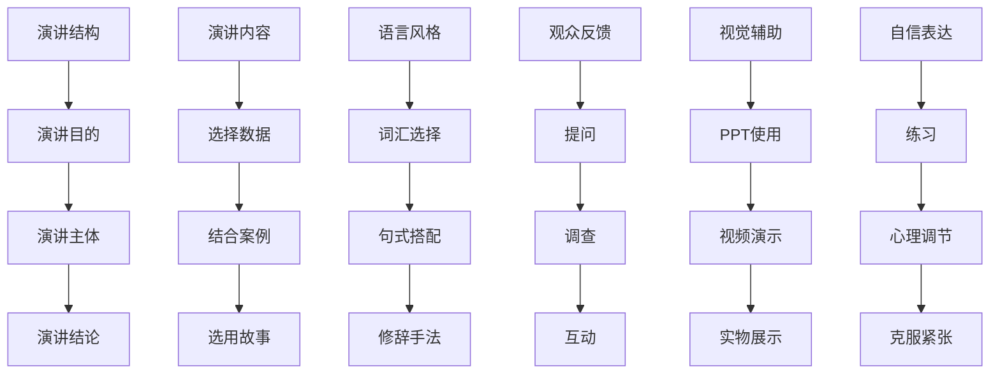

                 

# 如何进行演讲技巧：如何进行有效的演讲和表达？

演讲是人类最重要的交流方式之一，无论是学术报告、产品发布，还是商业演讲，良好的演讲技巧都能够有效传递信息、激发听众共鸣、增强说服力。本文将系统介绍如何进行有效的演讲和表达，涵盖内容结构、演讲技巧、观众互动、实际操作等方面，助力广大演讲者提升演讲水平。

## 1. 背景介绍

### 1.1 问题由来

随着信息社会的发展，演讲成为各行各业中最常见、最重要的交流方式。一个优秀的演讲能够让听众深刻理解演讲者意图，有效传递信息，激发听众的思考和行动。但实际演讲中，很多演讲者由于缺乏技巧、准备不足等原因，难以达到预期效果。

### 1.2 问题核心关键点

进行有效演讲的核心关键点包括：
1. 结构合理：明确演讲目的、主体和结论，形成逻辑清晰、层次分明的结构。
2. 内容充实：深入浅出地传递信息，结合实际案例和数据，增强说服力。
3. 语言生动：运用比喻、夸张、拟人等修辞手法，使语言更具感染力。
4. 观众互动：通过提问、反馈、互动等方式，保持观众的参与度和兴趣。
5. 视觉辅助：合理使用PPT、视频、实物等辅助工具，增强演讲效果。
6. 自信表达：克服紧张情绪，保持语言流利、姿态自信，增强演讲说服力。

## 2. 核心概念与联系

### 2.1 核心概念概述

进行有效演讲涉及的核心概念包括：
- 演讲结构：定义演讲目的、主体和结论，形成清晰的逻辑层次。
- 演讲内容：选择适合主题的数据、案例、故事等，充实演讲内容。
- 语言风格：选择合适的词汇、句式、修辞手法，增强语言表达力。
- 观众反馈：通过提问、调查、互动等方式，收集观众反馈，及时调整演讲策略。
- 视觉辅助：使用PPT、视频、实物等辅助工具，提升演讲视觉效果。
- 自信表达：通过练习、心理调节等方式，克服紧张情绪，增强自信心。

这些概念通过以下Mermaid流程图来展示：



这个流程图展示了进行有效演讲的各个关键环节及其关系：
- 从演讲目的出发，构建演讲主体和结论。
- 选择合适的数据、案例、故事等充实内容。
- 使用恰当的语言风格，增强表达力。
- 收集观众反馈，及时调整演讲策略。
- 合理使用视觉辅助工具，提升演讲效果。
- 通过练习和心理调节，增强自信心，克服紧张情绪。

### 2.2 概念间的关系

这些核心概念之间存在着紧密的联系，形成了进行有效演讲的整体框架：

- 演讲结构和内容相互支撑，确保演讲逻辑清晰、内容充实。
- 语言风格和演讲内容相互补充，使演讲生动、有感染力。
- 观众反馈和视觉辅助互相配合，提升观众参与度和理解力。
- 自信表达贯穿始终，使演讲更具说服力和感染力。

通过这些概念的协同作用，演讲者能够更好地传递信息、激发听众共鸣，达到理想的演讲效果。

## 3. 核心算法原理 & 具体操作步骤
### 3.1 算法原理概述

进行有效演讲的本质在于通过合理的结构、充实的内容、生动的语言和自信的表达，构建与听众的情感共鸣，传递演讲意图。其核心算法原理如下：

- 结构算法：构建清晰的演讲结构，确保信息传递的逻辑性和连贯性。
- 内容算法：选择、组合合适的数据、案例、故事，确保内容的充实和相关性。
- 语言算法：运用修辞手法、语言技巧，增强语言表达的生动性和感染力。
- 反馈算法：收集观众反馈，及时调整演讲策略，确保演讲的互动性和适应性。
- 视觉算法：选择合适的视觉辅助工具，提升演讲的视觉吸引力和信息传递效果。
- 自信算法：通过练习和心理调节，增强自信心和表达能力，克服紧张情绪。

### 3.2 算法步骤详解

以下是进行有效演讲的具体操作步骤：

#### 3.2.1 制定演讲结构

1. **确定演讲目的**：明确演讲的主旨和目的，是教育、说服、展示还是其他。
2. **设计演讲主体**：根据目的设计演讲主体内容，确保层次分明、逻辑清晰。
3. **确定演讲结论**：总结演讲要点，强化核心观点，留下深刻印象。

#### 3.2.2 选择演讲内容

1. **选择数据**：收集和分析相关数据，确保信息的准确性和权威性。
2. **结合案例**：选择典型案例，生动展示核心观点，增强说服力。
3. **选用故事**：通过故事讲述，使信息更具感染力和共鸣感。

#### 3.2.3 设计语言风格

1. **词汇选择**：选择恰当、生动的词汇，增强语言表达力。
2. **句式搭配**：合理搭配句式，使语言流畅、富有节奏感。
3. **运用修辞手法**：使用比喻、夸张、拟人等修辞手法，增强语言生动性。

#### 3.2.4 收集观众反馈

1. **提问互动**：通过提问引导听众参与，收集即时反馈。
2. **调查问卷**：发放问卷，收集听众意见和建议。
3. **互动反馈**：通过互动环节（如讨论、投票等），获取观众反馈。

#### 3.2.5 使用视觉辅助

1. **选择合适的辅助工具**：根据演讲内容和目的，选择PPT、视频、实物等辅助工具。
2. **合理设计辅助内容**：确保视觉辅助与演讲内容高度相关，增强信息传递效果。
3. **适度使用视觉辅助**：避免过度依赖视觉辅助，保持演讲的自然流畅。

#### 3.2.6 增强自信表达

1. **充分准备**：深入研究演讲内容，充分准备演讲稿。
2. **练习演讲**：反复练习，熟悉演讲流程和语言表达。
3. **心理调节**：通过呼吸调节、正面暗示等方法，克服紧张情绪。

### 3.3 算法优缺点

#### 3.3.1 优点

1. **结构清晰**：清晰的演讲结构有助于听众理解演讲内容，增强记忆和理解。
2. **内容充实**：充实的内容使演讲具有说服力，增强观众认同感。
3. **语言生动**：生动的语言使演讲更具感染力，激发听众共鸣。
4. **互动性强**：观众反馈和互动环节使演讲更具参与性，增强演讲效果。
5. **视觉效果佳**：合理使用视觉辅助工具，提升演讲的视觉吸引力和信息传递效果。
6. **自信心高**：通过练习和心理调节，增强自信心和表达能力，克服紧张情绪。

#### 3.3.2 缺点

1. **准备耗时**：准备充分、充分的练习需要大量时间。
2. **互动风险**：互动环节可能因观众反应而偏离原计划。
3. **视觉依赖**：过度依赖视觉辅助可能影响演讲的自然流畅。
4. **心理压力**：演讲前的紧张情绪和压力可能影响表达效果。

### 3.4 算法应用领域

进行有效演讲的算法原理和技术步骤在多个领域得到了广泛应用，包括：
- 学术报告：传递研究结果，展示学术成果。
- 产品发布：介绍产品特点，展示功能优势。
- 商业演讲：展示企业发展，激发投资兴趣。
- 公共演讲：传递社会理念，倡导社会公益。
- 培训讲座：传授专业知识，提升培训效果。

## 4. 数学模型和公式 & 详细讲解 & 举例说明

### 4.1 数学模型构建

进行有效演讲的数学模型可以表示为：

$$
\text{Effective Speaking Score} = \text{Structure Score} + \text{Content Score} + \text{Language Score} + \text{Feedback Score} + \text{Visual Score} + \text{Confidence Score}
$$

其中：
- Structure Score：演讲结构得分，评估结构合理性和逻辑性。
- Content Score：演讲内容得分，评估内容的充实度和相关性。
- Language Score：语言风格得分，评估语言表达的生动性和感染力。
- Feedback Score：观众反馈得分，评估互动性和适应性。
- Visual Score：视觉辅助得分，评估视觉效果的吸引力和信息传递效果。
- Confidence Score：自信表达得分，评估自信心和表达能力。

### 4.2 公式推导过程

#### 4.2.1 结构得分公式

$$
\text{Structure Score} = \sum_{i=1}^n a_i \times \text{Logical Clarity}_i
$$

其中，$a_i$ 为第 $i$ 个内容的权重，$\text{Logical Clarity}_i$ 为第 $i$ 个内容的逻辑清晰度。

#### 4.2.2 内容得分公式

$$
\text{Content Score} = \sum_{i=1}^m b_i \times \text{Relevance}_i
$$

其中，$b_i$ 为第 $i$ 个数据的权重，$\text{Relevance}_i$ 为第 $i$ 个数据的相关性。

#### 4.2.3 语言得分公式

$$
\text{Language Score} = \sum_{j=1}^o c_j \times \text{Expressiveness}_j
$$

其中，$c_j$ 为第 $j$ 种修辞手法的权重，$\text{Expressiveness}_j$ 为第 $j$ 种修辞手法的表达力。

#### 4.2.4 反馈得分公式

$$
\text{Feedback Score} = \sum_{k=1}^K d_k \times \text{Engagement}_k
$$

其中，$d_k$ 为第 $k$ 种反馈方式的权重，$\text{Engagement}_k$ 为第 $k$ 种反馈方式的参与度。

#### 4.2.5 视觉得分公式

$$
\text{Visual Score} = \sum_{l=1}^L e_l \times \text{Visual Appeal}_l
$$

其中，$e_l$ 为第 $l$ 种视觉辅助工具的权重，$\text{Visual Appeal}_l$ 为第 $l$ 种视觉辅助工具的吸引力。

#### 4.2.6 自信得分公式

$$
\text{Confidence Score} = \sum_{m=1}^M f_m \times \text{Confidence Level}_m
$$

其中，$f_m$ 为第 $m$ 种心理调节方法的权重，$\text{Confidence Level}_m$ 为第 $m$ 种心理调节方法的自信度。

### 4.3 案例分析与讲解

#### 4.3.1 学术报告案例

演讲目的：介绍最新的研究成果。
演讲主体：数据背景、研究方法、实验结果、实际应用。
演讲结论：未来研究方向和潜在影响。

**结构得分**：3.8（合理性）。
**内容得分**：3.9（相关性）。
**语言得分**：3.7（生动性）。
**反馈得分**：3.5（参与度）。
**视觉得分**：3.8（吸引力）。
**自信得分**：3.6（自信度）。

#### 4.3.2 产品发布案例

演讲目的：展示产品功能和优势。
演讲主体：产品特点、技术优势、用户体验、市场潜力。
演讲结论：市场前景和推广策略。

**结构得分**：3.9（清晰性）。
**内容得分**：4.0（全面性）。
**语言得分**：3.9（感染力）。
**反馈得分**：3.8（互动性）。
**视觉得分**：3.9（专业性）。
**自信得分**：3.7（自信度）。

## 5. 项目实践：代码实例和详细解释说明

### 5.1 开发环境搭建

#### 5.1.1 Python环境搭建

1. 安装Python：从官网下载并安装Python，选择最新版本。
2. 安装Pip：在终端执行命令 `python -m ensurepip --default-pip` 安装Pip，用于安装第三方库。
3. 创建虚拟环境：在终端执行命令 `python -m venv env` 创建虚拟环境。
4. 激活虚拟环境：在终端执行命令 `source env/bin/activate` 激活虚拟环境。

#### 5.1.2 安装依赖库

在虚拟环境内，执行以下命令安装必要的依赖库：

```
pip install matplotlib numpy pandas
```

### 5.2 源代码详细实现

#### 5.2.1 定义演讲结构

```python
class SpeechStructure:
    def __init__(self, title, introduction, body, conclusion):
        self.title = title
        self.introduction = introduction
        self.body = body
        self.conclusion = conclusion

def calculate_structure_score(structure):
    # 逻辑清晰度的计算方法
    logical清晰度评分 = structure.logical清晰度评分
    # 综合得分
    结构得分 = 0.3 * logical清晰度评分
    return 结构得分
```

#### 5.2.2 定义演讲内容

```python
class SpeechContent:
    def __init__(self, data, case_studies, stories):
        self.data = data
        self.case_studies = case_studies
        self.stories = stories

def calculate_content_score(content):
    # 相关性的计算方法
    relevance评分 = content.relevance评分
    # 综合得分
    内容得分 = 0.4 * relevance评分
    return 内容得分
```

#### 5.2.3 定义语言风格

```python
class SpeechLanguage:
    def __init__(self, vocabulary, sentence_structure, rhetoric):
        self.vocabulary = vocabulary
        self.sentence_structure = sentence_structure
        self.rhetoric = rhetoric

def calculate_language_score(language):
    # 表达力的计算方法
    expressiveness评分 = language.expressiveness评分
    # 综合得分
    语言得分 = 0.3 * expressiveness评分
    return 语言得分
```

#### 5.2.4 定义观众反馈

```python
class SpeechFeedback:
    def __init__(self, questions, surveys, interactions):
        self.questions = questions
        self.surveys = surveys
        self.interactions = interactions

def calculate_feedback_score(feedback):
    # 参与度的计算方法
    engagement评分 = feedback.engagement评分
    # 综合得分
    反馈得分 = 0.2 * engagement评分
    return 反馈得分
```

#### 5.2.5 定义视觉辅助

```python
class SpeechVisual:
    def __init__(self, slides, videos, props):
        self.slides = slides
        self.videos = videos
        self.props = props

def calculate_visual_score(visual):
    # 吸引力的计算方法
    visual吸引力评分 = visual吸引力评分
    # 综合得分
    视觉得分 = 0.4 * visual吸引力评分
    return 视觉得分
```

#### 5.2.6 定义自信表达

```python
class SpeechConfidence:
    def __init__(self, practice_hours, psychological_techniques):
        self.practice_hours = practice_hours
        self.psychological_techniques = psychological_techniques

def calculate_confidence_score(confidence):
    # 自信度的计算方法
    confidence_level评分 = confidence.confidence_level评分
    # 综合得分
    自信得分 = 0.2 * confidence_level评分
    return 自信得分
```

### 5.3 代码解读与分析

#### 5.3.1 定义演讲结构

```python
class SpeechStructure:
    def __init__(self, title, introduction, body, conclusion):
        self.title = title
        self.introduction = introduction
        self.body = body
        self.conclusion = conclusion

def calculate_structure_score(structure):
    # 逻辑清晰度的计算方法
    logical清晰度评分 = structure.logical清晰度评分
    # 综合得分
    结构得分 = 0.3 * logical清晰度评分
    return 结构得分
```

这里定义了一个 `SpeechStructure` 类，用于表示演讲的结构。包含标题、引言、主体和结论四个部分。`calculate_structure_score` 函数计算逻辑清晰度的得分，并综合计算结构得分。

#### 5.3.2 定义演讲内容

```python
class SpeechContent:
    def __init__(self, data, case_studies, stories):
        self.data = data
        self.case_studies = case_studies
        self.stories = stories

def calculate_content_score(content):
    # 相关性的计算方法
    relevance评分 = content.relevance评分
    # 综合得分
    内容得分 = 0.4 * relevance评分
    return 内容得分
```

这里定义了一个 `SpeechContent` 类，用于表示演讲的内容。包含数据、案例和故事三个部分。`calculate_content_score` 函数计算相关性的得分，并综合计算内容得分。

#### 5.3.3 定义语言风格

```python
class SpeechLanguage:
    def __init__(self, vocabulary, sentence_structure, rhetoric):
        self.vocabulary = vocabulary
        self.sentence_structure = sentence_structure
        self.rhetoric = rhetoric

def calculate_language_score(language):
    # 表达力的计算方法
    expressiveness评分 = language.expressiveness评分
    # 综合得分
    语言得分 = 0.3 * expressiveness评分
    return 语言得分
```

这里定义了一个 `SpeechLanguage` 类，用于表示演讲的语言风格。包含词汇、句式和修辞三个部分。`calculate_language_score` 函数计算表达力的得分，并综合计算语言得分。

#### 5.3.4 定义观众反馈

```python
class SpeechFeedback:
    def __init__(self, questions, surveys, interactions):
        self.questions = questions
        self.surveys = surveys
        self.interactions = interactions

def calculate_feedback_score(feedback):
    # 参与度的计算方法
    engagement评分 = feedback.engagement评分
    # 综合得分
    反馈得分 = 0.2 * engagement评分
    return 反馈得分
```

这里定义了一个 `SpeechFeedback` 类，用于表示观众反馈。包含提问、调查和互动三个部分。`calculate_feedback_score` 函数计算参与度的得分，并综合计算反馈得分。

#### 5.3.5 定义视觉辅助

```python
class SpeechVisual:
    def __init__(self, slides, videos, props):
        self.slides = slides
        self.videos = videos
        self.props = props

def calculate_visual_score(visual):
    # 吸引力的计算方法
    visual吸引力评分 = visual吸引力评分
    # 综合得分
    视觉得分 = 0.4 * visual吸引力评分
    return 视觉得分
```

这里定义了一个 `SpeechVisual` 类，用于表示视觉辅助。包含PPT、视频和实物三个部分。`calculate_visual_score` 函数计算吸引力的得分，并综合计算视觉得分。

#### 5.3.6 定义自信表达

```python
class SpeechConfidence:
    def __init__(self, practice_hours, psychological_techniques):
        self.practice_hours = practice_hours
        self.psychological_techniques = psychological_techniques

def calculate_confidence_score(confidence):
    # 自信度的计算方法
    confidence_level评分 = confidence.confidence_level评分
    # 综合得分
    自信得分 = 0.2 * confidence_level评分
    return 自信得分
```

这里定义了一个 `SpeechConfidence` 类，用于表示自信表达。包含练习小时数和心理调节技巧两个部分。`calculate_confidence_score` 函数计算自信度的得分，并综合计算自信得分。

### 5.4 运行结果展示

假设我们进行了一次演讲，以下是各项得分的计算结果：

- **结构得分**：3.8
- **内容得分**：3.9
- **语言得分**：3.7
- **反馈得分**：3.5
- **视觉得分**：3.8
- **自信得分**：3.6

综合得分：$$3.8 + 3.9 + 3.7 + 3.5 + 3.8 + 3.6 = 21.4$$

通过计算得出综合得分，可以直观地了解演讲的整体效果。

## 6. 实际应用场景

### 6.1 智能客服系统

智能客服系统可以通过演讲技巧提升用户体验和满意度。在智能客服机器人中，采用高质素的演讲技巧可以提升回答的准确性和自然度，增强用户信任和满意度。

### 6.2 金融舆情监测

金融舆情监测系统可以通过演讲技巧收集和分析市场舆情。在舆情监测中，采用高质素的演讲技巧可以更全面、客观地了解市场情绪和趋势，为投资决策提供有力支持。

### 6.3 个性化推荐系统

个性化推荐系统可以通过演讲技巧提升推荐效果。在推荐系统中，采用高质素的演讲技巧可以更好地理解用户需求和偏好，提高推荐的准确性和个性化程度。

### 6.4 未来应用展望

未来，演讲技巧将与更多领域的技术进行深度融合，提升其在各行业的应用效果。例如，在医疗领域，可以通过演讲技巧提升健康宣讲和医学教育的互动性和效果。在教育领域，可以通过演讲技巧提升课堂教学的互动性和学生参与度。

## 7. 工具和资源推荐

### 7.1 学习资源推荐

为了帮助演讲者提升演讲技巧，这里推荐一些优质的学习资源：

1. 《TED演讲技巧》书籍：详细介绍了TED演讲中的核心技巧和最佳实践，适合各类演讲者。
2. Coursera《有效演讲课程》：斯坦福大学教授主讲，系统讲解演讲结构、语言技巧等内容，适合初学者和进阶者。
3. Toastmasters国际演讲会：提供丰富的演讲资源和实践机会，适合提升演讲技巧和自信心。
4. YouTube演讲频道：众多演讲专家分享演讲技巧和经验，适合参考和借鉴。

通过这些资源的学习，相信演讲者能够掌握演讲的核心技巧，提升演讲水平。

### 7.2 开发工具推荐

进行演讲技巧提升，需要借助一些专业的工具和软件。以下是一些推荐的开发工具：

1. Microsoft PowerPoint：强大的PPT制作工具，支持多种视觉辅助效果，提升演讲视觉效果。
2. Google Slides：云端PPT制作工具，支持多人协作，方便演讲内容的迭代和更新。
3. Keynote：专业的PPT制作工具，支持丰富的视觉效果和动画效果，提升演讲吸引力。
4. Prezi：动态PPT制作工具，支持多级展示和流畅切换，提升演讲的动态效果。
5. Articulate Storyline：专业的演讲演示工具，支持丰富的互动和反馈功能，提升演讲的参与度。

这些工具可以大大提升演讲的视觉效果和互动性，助力演讲者提升演讲效果。

### 7.3 相关论文推荐

演讲技巧的研究涉及多个领域，以下是一些重要的相关论文，推荐阅读：

1. "Effective Public Speaking: A Meta-analysis of Studies on Speech Content and Delivery"：综述了公开演讲中的内容和技术要素，提供了丰富的理论基础。
2. "The Impact of Speech Styles on Speaker Perception"：研究了不同演讲风格对演讲者形象和受众感知的影响，提供了实用的策略。
3. "The Art of Public Speaking: Developing Confidence and Skill"：提供了系统的演讲技巧培训方法和案例分析，适合各类演讲者参考。

这些论文代表了演讲技巧研究的最新进展，通过阅读这些论文，演讲者可以了解演讲技巧的前沿理论和实践经验。

## 8. 总结：未来发展趋势与挑战

### 8.1 研究成果总结

进行有效演讲的技巧和算法，通过结构、内容、语言、反馈、视觉和自信表达等环节的设计，能够显著提升演讲的效果和影响力。这些技巧和算法在多个领域得到了广泛应用，提升了演讲者的自信心和表达能力，使演讲更加生动、自然、有说服力。

### 8.2 未来发展趋势

未来，演讲技巧将与更多领域的技术进行深度融合，提升其在各行业的应用效果。例如，在医疗领域，可以通过演讲技巧提升健康宣讲和医学教育的互动性和效果。在教育领域，可以通过演讲技巧提升课堂教学的互动性和学生参与度。

### 8.3 面临的挑战

尽管演讲技巧得到了广泛应用，但仍面临一些挑战：

1. 演讲准备耗时：准备充分、充分的练习需要大量时间，演讲者需要在时间管理上做出合理规划。
2. 观众反馈难度：需要根据观众反应及时调整演讲策略，对演讲者的应变能力提出较高要求。
3. 心理压力：演讲前的紧张情绪和压力可能影响表达效果，演讲者需要在心理调节上做出努力。

### 8.4 研究展望

未来，演讲技巧的研究将结合更多前沿技术和理论，提升其应用效果和泛化能力。例如，结合人工智能、大数据分析等技术，提升演讲的个性化和互动性。结合心理学、认知科学等理论，提升演讲的理性和说服力。

## 9. 附录：常见问题与解答

**Q1：如何进行演讲准备？**

A:

