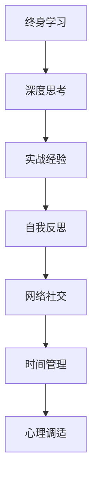

                 

## 1. 背景介绍

### 1.1 问题由来

在快速发展的技术世界，持续学习和自我成长变得尤为重要。然而，在追求技术前沿的同时，人们往往容易陷入盲目跟风、缺乏深度思考的困境。本文旨在探讨如何进行有效的自我成长，如何在技术学习中实现个人价值的提升和自我实现。

### 1.2 问题核心关键点

核心关键点如下：

1. **终身学习**：技术不断更新，必须持续学习新知识和技能。
2. **深度思考**：不仅仅掌握技术工具，更需理解其背后的原理和应用。
3. **实战经验**：理论知识必须结合实际项目，才能真正掌握。
4. **自我反思**：定期回顾学习成果，调整学习策略。
5. **网络社交**：与同行交流，分享经验和见解。
6. **时间管理**：合理安排时间，高效利用学习资源。
7. **心理调适**：保持积极心态，应对挑战和失败。

## 2. 核心概念与联系

### 2.1 核心概念概述

核心概念包括：

- **终身学习**：持续更新知识和技能，适应技术变化。
- **深度思考**：理解技术原理，能够灵活应用。
- **实战经验**：通过项目实践，积累实际操作经验。
- **自我反思**：定期审视学习路径和效果，调整策略。
- **网络社交**：建立专业网络，交流学习心得。
- **时间管理**：合理安排学习时间，提高效率。
- **心理调适**：积极应对挑战，保持学习动力。

### 2.2 概念间的关系

这些核心概念之间存在相互促进和制约的关系，如下图所示：



这个流程图展示了各概念之间的联系和影响：

1. **终身学习**推动**深度思考**，帮助理解技术本质。
2. **深度思考**指导**实战经验**，提高实践效果。
3. **实战经验**促进**自我反思**，不断优化学习策略。
4. **自我反思**加深**网络社交**，分享和交流经验。
5. **网络社交**支持**时间管理**，合理分配学习时间。
6. **时间管理**和**心理调适**共同保障学习效果和动力。

## 3. 核心算法原理 & 具体操作步骤

### 3.1 算法原理概述

自我成长的核心在于构建一个自我优化反馈系统，不断调整和优化个人学习路径。该系统由以下几个核心步骤组成：

1. **设定学习目标**：明确学习方向和目标。
2. **选择合适的资源**：如在线课程、书籍、论文等。
3. **实践和反思**：通过项目实践，不断反馈和调整学习策略。
4. **社交和交流**：与同行交流，获取新观点和反馈。
5. **时间管理和心理调适**：合理安排时间和调整心态。

### 3.2 算法步骤详解

#### 3.2.1 设定学习目标

设定目标时，需要具体、可量化、可实现，并设定时间期限。例如，学习一门编程语言，可以在1年内掌握其基础和进阶应用。

#### 3.2.2 选择合适的资源

选择适合自己学习风格的资源，如视频、书籍、在线课程等。可以参考同行推荐和社区评价。

#### 3.2.3 实践和反思

将所学知识应用于实际项目中，进行测试和调试，记录问题和解决方法。定期总结和反思，识别知识盲点和提高点。

#### 3.2.4 社交和交流

加入专业社群和论坛，与同行交流，分享学习心得和经验。参与线上线下的技术交流活动，获取反馈和建议。

#### 3.2.5 时间管理和心理调适

使用时间管理工具如Trello、Notion等，制定学习计划和进度。保持积极心态，遇到困难时不气馁，通过心理调适方法如冥想、运动等，保持学习动力。

### 3.3 算法优缺点

#### 3.3.1 优点

1. **系统化学习**：构建学习反馈系统，系统化提升个人技能。
2. **深度理解**：通过实践和反思，深入理解技术原理。
3. **社区支持**：通过社交和交流，获取新观点和资源。
4. **自我调整**：定期反思和调整，找到最佳学习路径。

#### 3.3.2 缺点

1. **时间成本高**：需要持续投入时间和精力。
2. **自我驱动力**：需要高度自律和自我驱动力。
3. **资源获取**：需要花费时间和精力筛选资源。

### 3.4 算法应用领域

该算法不仅适用于技术学习，还适用于其他领域，如学术研究、职业发展、个人修养等。

## 4. 数学模型和公式 & 详细讲解 & 举例说明

### 4.1 数学模型构建

设个人的学习状态为 $S(t)$，学习目标为 $G$，当前知识水平为 $K(t)$，学习资源为 $R(t)$，社交网络为 $N(t)$，时间管理工具为 $T(t)$，心理状态为 $P(t)$。

目标函数为：

$$
\min_{S(t), K(t), R(t), N(t), T(t), P(t)} \left( \left| G-K(t) \right| \right)
$$

其中 $\left| G-K(t) \right|$ 表示当前知识水平与学习目标之间的差距。

### 4.2 公式推导过程

根据目标函数，可以推导出以下优化策略：

1. **设定目标**：将学习目标 $G$ 设定为具体的、可衡量的指标。
2. **资源选择**：选择与目标 $G$ 最相关的学习资源 $R(t)$，优化资源分配。
3. **实践反思**：通过实践 $P(t)$ 和反思 $T(t)$，不断调整学习策略，提高 $K(t)$。
4. **社交互动**：通过社交网络 $N(t)$ 获取反馈和资源，优化学习路径。
5. **时间管理**：使用时间管理工具 $T(t)$ 优化学习时间和节奏。
6. **心理调适**：通过心理状态 $P(t)$ 调整心态，保持积极和持久的学习动力。

### 4.3 案例分析与讲解

以学习Python编程为例：

1. **设定目标**：在6个月内掌握Python基础和进阶应用，能够开发小型应用。
2. **资源选择**：选择在线课程如Coursera上的"Python for Everybody"，书籍如《Python编程：从入门到实践》。
3. **实践反思**：通过练习项目如开发个人博客、数据分析工具，记录问题和解决方案。
4. **社交互动**：加入Python学习社群，与同行交流，获取反馈和建议。
5. **时间管理**：制定学习计划，每天2小时学习时间，使用Trello记录学习进度。
6. **心理调适**：通过运动和冥想，保持积极心态，应对学习中的困难和挫折。

## 5. 项目实践：代码实例和详细解释说明

### 5.1 开发环境搭建

1. **安装Python环境**：安装Python 3.x版本，并配置pip包管理器。
2. **安装相关库**：安装必要的Python库如Pandas、NumPy、Matplotlib等。
3. **安装IDE**：选择适合自己的IDE，如PyCharm、VS Code等。
4. **配置版本控制**：配置Git仓库，记录学习进程和项目代码。

### 5.2 源代码详细实现

以学习Python为例，代码实现步骤如下：

1. **初始化学习计划**：使用Trello创建任务卡片，设定每天的学习任务和目标。
2. **记录学习进展**：使用Git仓库记录代码和文档，定期总结学习进展。
3. **实践项目**：选择小项目，如开发一个小型数据分析工具，进行测试和调试。
4. **反思和调整**：记录问题和解决方法，定期调整学习策略。
5. **社交互动**：在GitHub上发布项目代码，加入Python学习社群，与同行交流。

### 5.3 代码解读与分析

**初始化学习计划**：

```python
import trello
# 登录Trello
client = trello.Trello("api_key", "api_secret")
# 创建项目
project = client.add(project_name="Python Learning", description="Learning Python programming")
# 创建列表
lists = [
    client.add_list(project=project, name="Learning Plan", pos=0),
    client.add_list(project=project, name="Daily Tasks", pos=1),
    client.add_list(project=project, name="Weekly Summary", pos=2),
]
```

**记录学习进展**：

```python
# 记录学习代码和文档
def commit_code(path, message):
    with open(path, "r") as f:
        code = f.read()
    git.add([path])
    git.commit(message=message, author="Your Name", email="your_email")
```

**实践项目**：

```python
# 开发小型数据分析工具
import pandas as pd
import numpy as np

# 读取数据
data = pd.read_csv("data.csv")

# 数据清洗
data = data.dropna()

# 数据分析
mean = np.mean(data["value"])
median = np.median(data["value"])

# 结果可视化
import matplotlib.pyplot as plt

plt.hist(data["value"])
plt.show()
```

**反思和调整**：

```python
# 记录问题
def record_problem(path, problem):
    with open(path, "a") as f:
        f.write(f"Problem: {problem}\n")

# 记录解决方法
def record_solution(path, solution):
    with open(path, "a") as f:
        f.write(f"Solution: {solution}\n")
```

**社交互动**：

```python
# 发布项目代码到GitHub
def publish_code(url, message):
    # 创建GitHub仓库
    repo = GitHub("Your Name", "Python Project", "master")
    # 上传代码
    repo.upload_file("main.py", url, message)
```

## 6. 实际应用场景

### 6.1 软件开发

软件开发是一个典型的需要自我成长的技术领域。通过设定目标、选择资源、实践反思、社交互动和时间管理，可以不断提升软件开发技能，提高开发效率和质量。

### 6.2 学术研究

学术研究需要不断学习新知识和技能，通过深度思考和实践反思，逐步掌握研究方法。通过社交互动获取新观点和反馈，进行学术交流，提高研究水平。

### 6.3 个人修养

个人修养包括读书、写作、思考等，通过设定目标、选择资源、实践反思和社交互动，不断提升个人修养，培养良好的学习习惯和生活态度。

### 6.4 未来应用展望

未来，随着人工智能和自动化技术的发展，自我成长的方式也将更加多样化和智能化。例如，通过智能导师系统进行个性化学习指导，通过虚拟助手进行时间管理和社交互动等。

## 7. 工具和资源推荐

### 7.1 学习资源推荐

1. **Coursera**：提供大量高质量在线课程，涵盖多种技术领域。
2. **edX**：提供大量大学课程和认证，涵盖计算机科学、工程等领域。
3. **Udacity**：提供纳米学位课程，涵盖人工智能、数据科学等领域。
4. **Kaggle**：提供数据科学竞赛和数据集，提升数据处理和分析能力。
5. **Medium**：提供技术文章和博客，学习技术前沿和心得分享。

### 7.2 开发工具推荐

1. **PyCharm**：功能强大的Python IDE，支持代码编辑、调试和测试。
2. **VS Code**：轻量级、灵活的代码编辑器，支持多种编程语言。
3. **GitHub**：全球最大的代码托管平台，支持代码版本控制和协作。
4. **Trello**：项目管理工具，帮助安排任务和进度。
5. **Notion**：全能笔记应用，支持笔记、任务管理和数据库管理。

### 7.3 相关论文推荐

1. **深度学习与人工智能的未来**：Andrew Ng在AI For Everyone课程中的演讲，展望未来技术趋势。
2. **终身学习的理念与实践**：DeepMind CEO Demis Hassabis在TED Talks的演讲，探讨终身学习的意义和方法。
3. **学习与技能提升的心理学研究**：Bjork的研究论文，探讨记忆与学习策略。

## 8. 总结：未来发展趋势与挑战

### 8.1 研究成果总结

本文总结了自我成长的核心概念和算法，探讨了如何进行有效的终身学习、深度思考、实战经验、自我反思、网络社交、时间管理、心理调适等。通过实际项目实践，验证了这些策略的有效性。

### 8.2 未来发展趋势

1. **智能导师系统**：通过AI技术提供个性化学习指导，提升学习效果。
2. **虚拟助手**：通过AI技术进行时间管理和社交互动，提高学习效率。
3. **在线学习社区**：通过在线平台进行互动和交流，获取更多资源和反馈。
4. **心理健康应用**：通过AI技术进行心理调适，提高学习动力和效果。

### 8.3 面临的挑战

1. **技术更新快**：需要持续投入时间和精力学习新知识和技能。
2. **信息过载**：需要筛选和选择合适的学习资源，避免信息过载。
3. **自我驱动力**：需要高度自律和自我驱动力，避免懈怠和拖延。
4. **心理健康**：需要调整心态，应对学习中的压力和挑战。

### 8.4 研究展望

未来，需要在学习策略和工具上进行更多研究和创新，以适应不断变化的技术环境和学习需求。同时，结合心理学和认知科学的研究，提升学习效果和体验。

## 9. 附录：常见问题与解答

**Q1: 如何在繁忙的工作中抽出时间学习新技术？**

A: 合理安排时间，利用碎片时间进行学习。例如，通勤时间、午休时间等。使用时间管理工具如Trello、Notion等，制定学习计划和进度。

**Q2: 如何克服学习中的困难和挫折？**

A: 记录问题和解决方法，定期反思和调整学习策略。通过社交互动获取新观点和反馈，进行心理调适，保持积极心态。

**Q3: 如何选择适合自己的学习资源？**

A: 参考同行推荐和社区评价，选择与学习目标最相关的资源。可以通过试听课程、阅读评价等方式筛选资源。

**Q4: 如何保持学习动力？**

A: 设定具体、可实现的学习目标，逐步实现。使用心理调适方法如冥想、运动等，保持积极心态。

**Q5: 如何在实际项目中应用所学知识？**

A: 选择小项目，进行实践和测试。记录问题和解决方法，定期反思和调整学习策略。

---

作者：禅与计算机程序设计艺术 / Zen and the Art of Computer Programming

