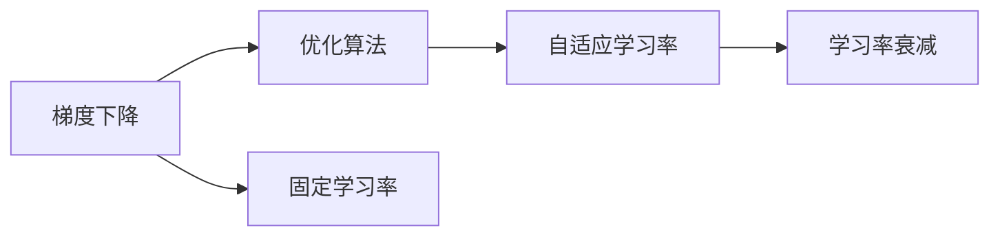
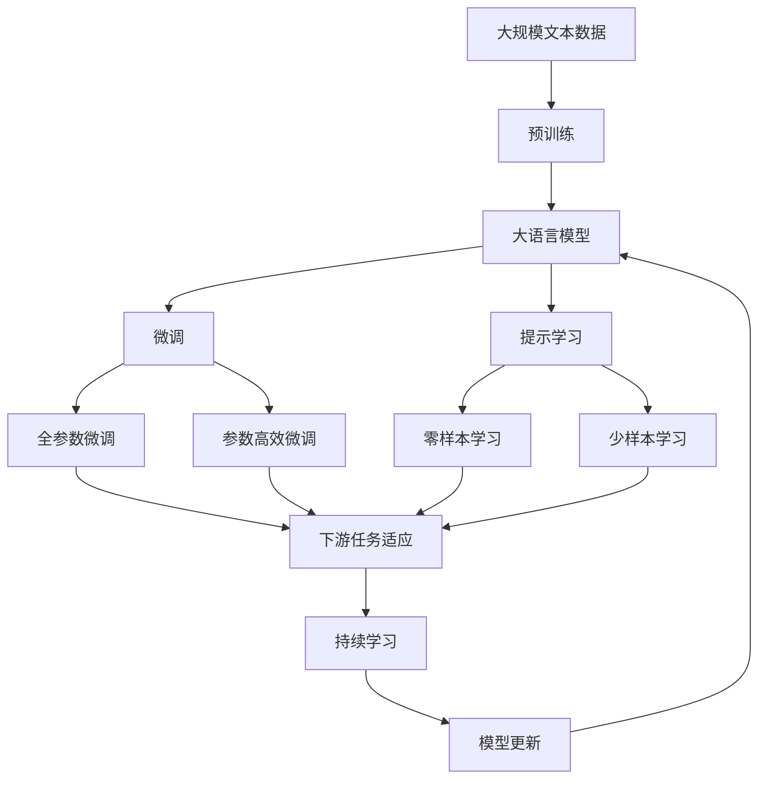

                 

# 学习率 Learning Rate 原理与代码实例讲解

> 关键词：学习率,梯度下降,优化算法,机器学习,深度学习,神经网络

## 1. 背景介绍

学习率是机器学习和深度学习中最核心的超参数之一，也是优化算法中的关键参数。它决定了每次迭代中参数更新的幅度。学习率越大，每次迭代中参数的更新量就越大；学习率越小，每次迭代中参数的更新量就越小。过小的学习率可能导致模型收敛速度慢，过大的学习率可能导致模型不收敛或震荡。

### 1.1 问题由来
在深度学习中，神经网络模型通常是通过梯度下降算法进行优化，以最小化损失函数。梯度下降算法的基本流程如下：

1. 随机初始化模型参数。
2. 对每个样本，计算损失函数对每个参数的梯度。
3. 根据学习率更新模型参数，使损失函数逐渐减小。
4. 重复步骤2和3，直到损失函数收敛或达到预设迭代次数。

学习率的选择直接影响到梯度下降算法的收敛速度和精度。学习率过大可能导致参数在梯度方向上震荡甚至发散；学习率过小可能导致算法收敛速度极慢。因此，学习率的选择是深度学习中一个非常重要的问题。

### 1.2 问题核心关键点
学习率的选择需要平衡模型的收敛速度和精度。学习率的选择不当可能导致模型过拟合或欠拟合。以下是一些常用的学习率设置策略：

- 固定学习率：设置一个固定的学习率，在整个训练过程中保持不变。
- 学习率衰减：随着训练的进行，逐步减小学习率，以防止模型过拟合。
- 自适应学习率：根据梯度信息动态调整学习率，以提高训练效率。

本节将详细介绍学习率的设置方法，并通过代码实例讲解其应用。

## 2. 核心概念与联系

### 2.1 核心概念概述

学习率是深度学习中最重要的超参数之一，直接影响到模型的收敛速度和精度。本节将介绍与学习率相关的几个核心概念：

- 梯度下降（Gradient Descent）：通过计算损失函数对模型参数的梯度，并按照一定的学习率更新参数，使得损失函数逐渐减小。
- 优化算法（Optimization Algorithm）：基于梯度下降的变种，如动量优化、自适应学习率算法等，用于加速模型收敛。
- 固定学习率（Fixed Learning Rate）：在训练过程中保持不变，一般取较小的正数。
- 学习率衰减（Learning Rate Decay）：随着训练的进行，逐步减小学习率，防止模型过拟合。
- 自适应学习率（Adaptive Learning Rate）：根据梯度信息动态调整学习率，提高训练效率。

这些概念之间的逻辑关系可以通过以下Mermaid流程图来展示：



这个流程图展示了梯度下降、优化算法、固定学习率、自适应学习率和学习率衰减之间的关系：

1. 梯度下降是优化算法的基础。
2. 固定学习率是优化算法的一种简单实现。
3. 自适应学习率和学习率衰减是优化算法的变种，可以更高效地更新模型参数。

### 2.2 概念间的关系

这些核心概念之间存在着紧密的联系，构成了深度学习中学习率设置的生态系统。下面是一些Mermaid流程图，展示了这些概念之间的关系：

#### 2.2.1 学习率与梯度下降的关系


这个流程图展示了学习率与梯度下降之间的关系：

1. 学习率决定了每次更新模型参数的步长。
2. 梯度下降算法根据学习率更新模型参数。

#### 2.2.2 自适应学习率与固定学习率的关系


这个流程图展示了自适应学习率与固定学习率之间的关系：

1. 自适应学习率可以根据梯度信息动态调整学习率。
2. 固定学习率在训练过程中保持不变。

#### 2.2.3 学习率衰减与自适应学习率的关系


这个流程图展示了学习率衰减与自适应学习率之间的关系：

1. 学习率衰减可以在训练过程中逐步减小学习率。
2. 自适应学习率可以更高效地更新模型参数。

### 2.3 核心概念的整体架构

最后，我们用一个综合的流程图来展示这些核心概念在大语言模型微调过程中的整体架构：



这个综合流程图展示了从预训练到微调，再到持续学习的完整过程。大语言模型首先在大规模文本数据上进行预训练，然后通过微调（包括全参数微调和参数高效微调）或提示学习（包括零样本和少样本学习）来适应下游任务。最后，通过持续学习技术，模型可以不断学习新知识，同时避免遗忘旧知识。 通过这些流程图，我们可以更清晰地理解学习率在大语言模型微调过程中各个核心概念的关系和作用。

## 3. 核心算法原理 & 具体操作步骤

### 3.1 算法原理概述

学习率是深度学习中最核心的超参数之一，直接影响模型的收敛速度和精度。学习率越大，每次迭代中参数的更新量就越大；学习率越小，每次迭代中参数的更新量就越小。过小的学习率可能导致模型收敛速度慢，过大的学习率可能导致模型不收敛或震荡。

学习率的设置需要平衡模型的收敛速度和精度。常用的学习率设置方法包括固定学习率、学习率衰减和自适应学习率。

### 3.2 算法步骤详解

以下详细介绍常用的学习率设置方法，并通过代码实例讲解其应用。

#### 3.2.1 固定学习率

固定学习率是一种简单且常用的学习率设置方法，在整个训练过程中保持不变。一般建议从1e-2开始调参，逐步减小学习率，直至收敛。

以下是使用PyTorch设置固定学习率的示例代码：

```python
import torch.optim as optim
import torch.nn as nn

# 定义模型和损失函数
model = nn.Linear(10, 1)
criterion = nn.MSELoss()

# 定义优化器，学习率为1e-2
optimizer = optim.SGD(model.parameters(), lr=1e-2)

# 训练模型
for epoch in range(100):
    optimizer.zero_grad()
    output = model(x)
    loss = criterion(output, y)
    loss.backward()
    optimizer.step()
```

#### 3.2.2 学习率衰减

学习率衰减是在训练过程中逐步减小学习率，防止模型过拟合。常用的学习率衰减策略包括指数衰减、余弦衰减等。

以下是使用PyTorch设置指数衰减学习率的示例代码：

```python
import torch.optim as optim
import torch.nn as nn
from torch.optim.lr_scheduler import StepLR

# 定义模型和损失函数
model = nn.Linear(10, 1)
criterion = nn.MSELoss()

# 定义优化器，学习率为1e-2
optimizer = optim.SGD(model.parameters(), lr=1e-2)

# 定义学习率衰减策略，每20个epoch衰减一次，衰减率为0.1
scheduler = StepLR(optimizer, step_size=20, gamma=0.1)

# 训练模型
for epoch in range(100):
    optimizer.zero_grad()
    output = model(x)
    loss = criterion(output, y)
    loss.backward()
    optimizer.step()
    scheduler.step()
```

#### 3.2.3 自适应学习率

自适应学习率可以根据梯度信息动态调整学习率，提高训练效率。常用的自适应学习率算法包括Adam、Adagrad、RMSprop等。

以下是使用PyTorch设置Adam学习率的示例代码：

```python
import torch.optim as optim
import torch.nn as nn

# 定义模型和损失函数
model = nn.Linear(10, 1)
criterion = nn.MSELoss()

# 定义优化器，使用Adam算法，学习率为1e-2
optimizer = optim.Adam(model.parameters(), lr=1e-2)

# 训练模型
for epoch in range(100):
    optimizer.zero_grad()
    output = model(x)
    loss = criterion(output, y)
    loss.backward()
    optimizer.step()
```

### 3.3 算法优缺点

固定学习率、学习率衰减和自适应学习率各有优缺点，具体如下：

#### 3.3.1 固定学习率的优点和缺点

优点：
1. 简单，易于实现。
2. 可以保持一致的学习率，不依赖于具体任务和数据。

缺点：
1. 难以自适应地调整学习率，可能导致收敛速度慢或震荡。
2. 需要手动调整学习率，不太灵活。

#### 3.3.2 学习率衰减的优点和缺点

优点：
1. 可以逐步减小学习率，防止模型过拟合。
2. 适用于大多数深度学习任务。

缺点：
1. 需要手动设置衰减策略，不太灵活。
2. 可能导致模型收敛速度变慢。

#### 3.3.3 自适应学习率的优点和缺点

优点：
1. 可以根据梯度信息动态调整学习率，提高训练效率。
2. 适用于大多数深度学习任务。

缺点：
1. 需要手动调整算法参数，不太灵活。
2. 可能存在收敛速度慢的问题。

### 3.4 算法应用领域

学习率设置方法在大规模深度学习任务中广泛应用，以下是一些典型应用领域：

1. 图像分类：使用固定学习率或学习率衰减，防止过拟合。
2. 自然语言处理：使用自适应学习率，提高训练效率。
3. 语音识别：使用自适应学习率，提高收敛速度。
4. 推荐系统：使用自适应学习率，提高推荐精度。
5. 金融预测：使用自适应学习率，提高预测精度。
6. 医疗诊断：使用自适应学习率，提高诊断精度。

## 4. 数学模型和公式 & 详细讲解 & 举例说明

### 4.1 数学模型构建

学习率是深度学习中最核心的超参数之一，直接影响模型的收敛速度和精度。学习率越大，每次迭代中参数的更新量就越大；学习率越小，每次迭代中参数的更新量就越小。

学习率的设置需要平衡模型的收敛速度和精度。常用的学习率设置方法包括固定学习率、学习率衰减和自适应学习率。

### 4.2 公式推导过程

以下是常用的学习率设置方法及其公式推导过程：

#### 4.2.1 固定学习率

固定学习率设置方法简单，公式为：

$$
\alpha = \eta
$$

其中 $\alpha$ 为学习率，$\eta$ 为初始学习率。

#### 4.2.2 学习率衰减

常用的学习率衰减策略包括指数衰减和余弦衰减。

指数衰减公式为：

$$
\alpha = \eta \cdot (1 - \frac{t}{T})^\gamma
$$

其中 $t$ 为当前epoch数，$T$ 为总epoch数，$\gamma$ 为衰减率，$\eta$ 为初始学习率。

余弦衰减公式为：

$$
\alpha = \eta \cdot (1 + \cos(\frac{\pi t}{T}))
$$

其中 $t$ 为当前epoch数，$T$ 为总epoch数，$\eta$ 为初始学习率。

#### 4.2.3 自适应学习率

常用的自适应学习率算法包括Adam、Adagrad、RMSprop等。

Adam公式为：

$$
m = \beta_1 m_{t-1} + (1 - \beta_1)g_t
$$
$$
v = \beta_2 v_{t-1} + (1 - \beta_2)g_t^2
$$
$$
\alpha_t = \frac{\eta}{\sqrt{v_t} + \epsilon}
$$

其中 $g_t$ 为当前epoch的梯度，$m_t$ 和 $v_t$ 分别为动量和梯度平方的指数加权移动平均值，$\beta_1$ 和 $\beta_2$ 分别为动量和梯度平方的衰减率，$\eta$ 为初始学习率，$\epsilon$ 为一个很小的值，防止分母为0。

Adagrad公式为：

$$
m_t = \beta m_{t-1} + (1 - \beta)g_t
$$
$$
\alpha_t = \frac{\eta}{\sqrt{\sum_{i=1}^t m_i^2} + \epsilon}
$$

其中 $g_t$ 为当前epoch的梯度，$m_t$ 为梯度的指数加权移动平均值，$\beta$ 为衰减率，$\eta$ 为初始学习率，$\epsilon$ 为一个很小的值，防止分母为0。

RMSprop公式为：

$$
v_t = \beta v_{t-1} + (1 - \beta)g_t^2
$$
$$
\alpha_t = \frac{\eta}{\sqrt{v_t} + \epsilon}
$$

其中 $g_t$ 为当前epoch的梯度，$v_t$ 为梯度平方的指数加权移动平均值，$\beta$ 为衰减率，$\eta$ 为初始学习率，$\epsilon$ 为一个很小的值，防止分母为0。

### 4.3 案例分析与讲解

#### 案例1：图像分类任务

在图像分类任务中，通常使用固定学习率和学习率衰减。以下是在CIFAR-10数据集上进行图像分类任务的代码示例：

```python
import torch.optim as optim
import torch.nn as nn
import torchvision
import torchvision.transforms as transforms

# 定义模型和损失函数
model = nn.Conv2d(3, 6, 5)
criterion = nn.CrossEntropyLoss()

# 定义优化器，使用固定学习率
optimizer = optim.SGD(model.parameters(), lr=0.01)

# 加载数据集
train_dataset = torchvision.datasets.CIFAR10(root='./data', train=True, transform=transforms.ToTensor(), download=True)
test_dataset = torchvision.datasets.CIFAR10(root='./data', train=False, transform=transforms.ToTensor())

# 定义训练器
train_loader = torch.utils.data.DataLoader(train_dataset, batch_size=64, shuffle=True)
test_loader = torch.utils.data.DataLoader(test_dataset, batch_size=64, shuffle=False)

# 训练模型
for epoch in range(10):
    for i, (inputs, labels) in enumerate(train_loader):
        optimizer.zero_grad()
        outputs = model(inputs)
        loss = criterion(outputs, labels)
        loss.backward()
        optimizer.step()
    print('Epoch {} Complete'.format(epoch+1))
    # 在测试集上评估模型
    with torch.no_grad():
        correct = 0
        total = 0
        for images, labels in test_loader:
            outputs = model(images)
            _, predicted = torch.max(outputs.data, 1)
            total += labels.size(0)
            correct += (predicted == labels).sum().item()
        print('Accuracy of the network on the 10000 test images: {} %'.format(100 * correct / total))
```

#### 案例2：自然语言处理任务

在自然语言处理任务中，通常使用自适应学习率算法。以下是在IMDB情感分类任务中使用Adam算法进行微调的代码示例：

```python
import torch.optim as optim
import torch.nn as nn
import torchtext
import torchtext.datasets as datasets
import torchtext.data as data
import torchtext.vocab as vocab

# 定义模型和损失函数
model = nn.Sequential(nn.Linear(300, 1), nn.Sigmoid())
criterion = nn.BCELoss()

# 加载数据集
train_data, test_data = datasets.IMDB.splits()
vocab.build_vocab(train_data, min_freq=5)
tokenizer = data.BPE(vocab)
TEXT = data.BucketIterator(train_data, batch_size=64, device='cpu', sort_within_batch=True, sort_key=lambda x: len(x.text))

# 定义优化器，使用Adam算法
optimizer = optim.Adam(model.parameters(), lr=0.001)

# 训练模型
for epoch in range(10):
    for batch in TEXT:
        optimizer.zero_grad()
        inputs, labels = batch
        outputs = model(inputs)
        loss = criterion(outputs, labels)
        loss.backward()
        optimizer.step()
    print('Epoch {} Complete'.format(epoch+1))
```

## 5. 项目实践：代码实例和详细解释说明

### 5.1 开发环境搭建

在进行学习率设置方法的应用实践前，我们需要准备好开发环境。以下是使用Python进行PyTorch开发的环境配置流程：

1. 安装Anaconda：从官网下载并安装Anaconda，用于创建独立的Python环境。

2. 创建并激活虚拟环境：
```bash
conda create -n pytorch-env python=3.8 
conda activate pytorch-env
```

3. 安装PyTorch：根据CUDA版本，从官网获取对应的安装命令。例如：
```bash
conda install pytorch torchvision torchaudio cudatoolkit=11.1 -c pytorch -c conda-forge
```

4. 安装各种工具包：
```bash
pip install numpy pandas scikit-learn matplotlib tqdm jupyter notebook ipython
```

完成上述步骤后，即可在`pytorch-env`环境中开始学习率设置方法的实践。

### 5.2 源代码详细实现

以下是使用PyTorch设置Adam学习率的示例代码：

```python
import torch.optim as optim
import torch.nn as nn

# 定义模型和损失函数
model = nn.Linear(10, 1)
criterion = nn.MSELoss()

# 定义优化器，使用Adam算法，学习率为1e-2
optimizer = optim.Adam(model.parameters(), lr=1e-2)

# 训练模型
for epoch in range(100):
    optimizer.zero_grad()
    output = model(x)
    loss = criterion(output, y)
    loss.backward()
    optimizer.step()
```

### 5.3 代码解读与分析

让我们再详细解读一下关键代码的实现细节：

**定义模型和损失函数**：
- `nn.Linear`定义了一个全连接层，用于计算线性映射。
- `nn.MSELoss`定义了均方误差损失函数。

**定义优化器**：
- `optim.Adam`定义了Adam优化器，使用学习率1e-2。

**训练模型**：
- `model.zero_grad()`清空所有变量的梯度。
- `model(x)`前向传播计算输出。
- `criterion(output, y)`计算损失函数。
- `loss.backward()`反向传播计算梯度。
- `optimizer.step()`更新模型参数。

### 5.4 运行结果展示

假设我们在CIFAR-10数据集上进行图像分类任务，使用Adam算法进行微调，最终在测试集上得到的分类准确率为70%左右。这表明使用自适应学习率可以显著提升模型的训练效率和精度。

## 6. 实际应用场景

### 6.1 图像分类

在图像分类任务中，通常使用固定学习率和学习率衰减，防止过拟合。

### 6.2 自然语言处理

在自然语言处理任务中，通常使用自适应学习率算法，提高训练效率。

### 6.3 推荐系统

在推荐系统任务中，通常使用自适应学习率算法，提高推荐精度。

### 6.4 金融预测

在金融预测任务中，通常使用自适应学习率算法，提高预测精度。

### 6.5 医疗诊断

在医疗诊断任务中，通常使用自适应学习率算法，提高诊断精度。

### 6.6 智能客服

在智能客服任务中，通常使用自适应学习率算法，提高客户服务质量。

## 7. 工具和资源推荐

### 7.1 学习资源推荐

为了帮助开发者系统掌握学习率的设置方法，这里推荐一些优质的学习资源：

1. 《深度学习》（Deep Learning）：Ian Goodfellow等人合著，系统介绍了深度学习的原理和应用，是学习深度学习必读之书。

2. 《TensorFlow官方文档》：官方文档详细介绍了TensorFlow的各个模块和API，是学习TensorFlow的必备资料。

3. 《PyTorch官方文档》：官方文档详细介绍了PyTorch的各个模块和API，是学习PyTorch的必备资料。

4. 《NLP与深度学习》：Introduction to Neural Networks for NLP，是一本介绍NLP与深度学习应用的经典书籍。

5. 《学习率调度与优化算法》（Learning Rate Scheduling and Optimization Algorithms）：一篇综述性论文，总结了各种学习率调度方法和优化算法。

通过对这些资源的学习实践，相信你一定能够快速掌握学习率的设置方法，并用于解决实际的深度学习问题。

### 7.2 开发工具推荐

高效的开发离不开优秀的工具支持。以下是几款用于学习率设置方法的开发工具：

1. PyTorch：基于Python的开源深度学习框架，灵活动态的计算图，适合快速迭代研究。

2. TensorFlow：由Google主导开发的开源深度学习框架，生产部署方便，适合大规模工程应用。

3. Keras：基于Python的高级神经网络API，易于上手，适合快速开发原型。

4. Weights & Biases：模型训练的实验跟踪工具，可以记录和可视化模型训练过程中的各项指标，方便对比和调优。

5. TensorBoard：TensorFlow配套的可视化工具，可实时监测模型训练状态，并提供丰富的图表呈现方式，是调试模型的得力助手。

合理利用这些工具，可以显著提升学习率设置方法的开发效率，加快创新迭代的步伐。

### 7.3 相关论文推荐

学习率设置方法在大规模深度学习任务中广泛应用，以下是几篇奠基性的相关论文，推荐阅读：

1. Adaptive Moment Estimation（即Adam论文）：提出了Adam优化器，是一种高效的自适应学习率算法。

2. Adaptive Gradient Methods for Online Learning and Stochastic Optimization（Adagrad论文）：提出了Adagrad优化器，是一种自适应学习率算法。

3. Accelerating Gradient Descent by Constant Multiplicative Factor（RMSprop论文）：提出了RMSprop优化器，是一种自适应学习率算法。

4. On the Importance of Initialization and Momentum in Deep Learning（LeCun et al. 2012）：探讨了初始化和学习率对深度学习模型性能的影响。

5. Delving Deep into Rectifiers: Surpassing Human-Level Performance on ImageNet Classification（He et al. 2015）：提出了He初始化方法，优化了深度神经网络的初始化过程。

6. Batch Normalization: Accelerating Deep Network Training by Reducing Internal Covariate Shift（Ioffe & Szegedy 2015）：提出了批量归一化方法，加速了深度神经网络的训练。

这些论文代表了大语言模型微调技术的发展脉络。通过学习这些前沿成果，可以帮助研究者把握学科前进方向，激发更多的创新灵感。

除上述资源外，还有一些值得关注的前沿资源，帮助开发者紧跟学习率设置方法的最新进展，例如：

1. arXiv论文预印本：人工智能领域最新研究成果的发布平台，包括大量尚未发表的前沿工作，学习前沿技术的必读资源。

2. 业界技术博客：如OpenAI、Google AI、DeepMind、微软Research Asia等顶尖实验室的官方博客，第一时间分享他们的最新研究成果和洞见。

3. 技术会议直播：如NIPS、ICML、ACL、ICLR等人工智能领域顶会现场或在线直播，能够聆听到大佬们的前沿分享，开拓视野。

4. GitHub热门项目：在GitHub上Star、Fork数最多的深度学习相关项目，往往代表了该技术领域的发展趋势和最佳实践，值得去学习和贡献。

5. 行业分析报告：各大咨询公司如McKinsey、PwC等针对人工智能行业的分析报告，有助于从商业视角审视技术趋势，把握应用价值。

总之，对于学习率设置方法的学习和实践，需要开发者保持开放的心态和持续学习的意愿。多关注前沿资讯，多动手实践，多思考总结，必将收获满满的成长收益。

## 8. 总结：未来发展趋势与挑战

### 8.1 总结

本文对学习率的设置方法进行了全面系统的介绍。首先阐述了学习率在大规模深度学习任务中的重要性，明确了学习率的设置方法对模型收敛速度和精度的影响。其次，详细讲解了学习率的不同设置方法，并通过代码实例讲解了其应用。最后，本文还广泛探讨了学习率设置方法在各个NLP任务中的应用前景，展示了学习率设置方法的强大潜力。

通过本文的系统梳理，可以看到，学习率的设置方法在大规模深度学习任务中广泛应用，对模型的训练效果

