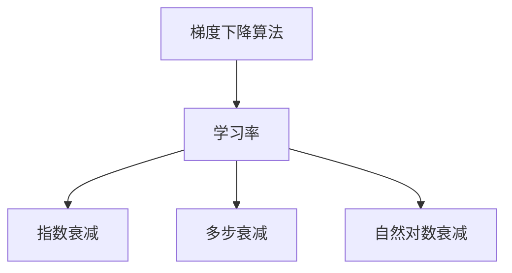

                 

# 学习率衰减Learning Rate Decay原理与代码实例讲解

> 关键词：学习率衰减,梯度下降,优化算法,指数衰减,多步衰减,自然对数衰减

## 1. 背景介绍

在深度学习中，梯度下降是最常用的优化算法之一，旨在通过反向传播算法计算损失函数对模型参数的梯度，并以此来更新模型参数，使得损失函数值不断减小，模型性能不断提升。学习率，即梯度下降算法中控制每次参数更新步长的超参数，对模型的收敛速度和精度有重大影响。

然而，学习率过高会导致梯度下降过于剧烈，参数波动大，甚至导致发散；学习率过低则会导致参数更新过于缓慢，收敛速度慢。为解决这一问题，学习率衰减技术被广泛应用于深度学习模型的训练过程中，通过动态调整学习率，使得模型在训练过程中能够更好地适应数据变化，提高模型的收敛速度和精度。

## 2. 核心概念与联系

### 2.1 核心概念概述

在学习率衰减技术中，常见的衰减方式包括：
- 指数衰减(Exponential Decay)：学习率以指数形式递减，适用于大规模数据集，可以平稳地从较高的初始值逐步降低。
- 多步衰减(Multistep Decay)：将学习率在训练过程中分成若干个步骤进行衰减，每一步的衰减比例可以不同，适用于模型结构复杂或数据分布不均匀的情况。
- 自然对数衰减(Natural Logarithm Decay)：学习率以自然对数形式递减，适用于模型结构简单、数据量不大的情况。

这些学习率衰减方式通过动态调整学习率，可以避免学习率过高或过低的问题，从而更好地适应不同数据集和模型结构，提升模型的训练效果。

### 2.2 核心概念间的关系

学习率衰减是梯度下降优化算法的重要组成部分，通过动态调整学习率，可以显著提高模型的训练效果。其与梯度下降算法的关系可以通过以下Mermaid流程图来展示：



通过这些学习率衰减方式，梯度下降算法能够更好地适应不同的数据集和模型结构，加速模型的收敛。下面，我们将详细讲解这些学习率衰减方式的原理和应用。

## 3. 核心算法原理 & 具体操作步骤

### 3.1 算法原理概述

学习率衰减的原理是通过动态调整学习率，使得模型在训练过程中能够更好地适应数据变化，提高模型的收敛速度和精度。常见的学习率衰减方式包括指数衰减、多步衰减和自然对数衰减。下面，我们将逐一介绍这些方式的原理和应用。

### 3.2 算法步骤详解

#### 3.2.1 指数衰减

指数衰减的公式如下：

$$
\eta_t = \eta_0 * \beta^t
$$

其中，$\eta_t$ 表示第 $t$ 步的学习率，$\eta_0$ 为初始学习率，$\beta$ 为衰减系数，通常取值为 0.1。

指数衰减的原理是，将学习率以指数形式逐步降低，从而在训练初期使用较大的学习率，快速收敛；在训练后期使用较小的学习率，避免震荡。

#### 3.2.2 多步衰减

多步衰减的公式如下：

$$
\eta_t = \eta_0 * \alpha^{floor(\frac{t}{step_size})}
$$

其中，$\alpha$ 为每一步的衰减比例，通常取值为 0.1；$step_size$ 为衰减的步长，表示每隔多少步进行一次学习率衰减。

多步衰减的原理是，将学习率在训练过程中分成若干个步骤进行衰减，每一步的衰减比例可以不同，从而更好地适应模型结构复杂或数据分布不均匀的情况。

#### 3.2.3 自然对数衰减

自然对数衰减的公式如下：

$$
\eta_t = \eta_0 * e^{-t / \tau}
$$

其中，$\tau$ 为衰减时间常数，表示学习率在多少个epoch后衰减为 $\eta_0 * e^{-1}$。

自然对数衰减的原理是，将学习率以自然对数形式逐步降低，从而在训练初期使用较大的学习率，快速收敛；在训练后期使用较小的学习率，避免震荡。

### 3.3 算法优缺点

#### 3.3.1 指数衰减

**优点：**
- 在训练初期使用较大的学习率，快速收敛。
- 在训练后期使用较小的学习率，避免震荡。

**缺点：**
- 学习率衰减速度较快，可能会导致参数更新过快，从而影响模型性能。

#### 3.3.2 多步衰减

**优点：**
- 将学习率在训练过程中分成若干个步骤进行衰减，可以更好地适应模型结构复杂或数据分布不均匀的情况。
- 每一步的衰减比例可以不同，可以更好地适应不同数据集。

**缺点：**
- 需要手动设置步长和衰减比例，调参难度较大。

#### 3.3.3 自然对数衰减

**优点：**
- 学习率衰减速度较慢，可以在训练后期保持学习率稳定。
- 适用于模型结构简单、数据量不大的情况。

**缺点：**
- 学习率衰减速度较慢，可能会导致模型训练时间较长。

### 3.4 算法应用领域

学习率衰减技术广泛应用于深度学习模型的训练过程中，可用于各种神经网络架构和任务。例如，在图像识别、自然语言处理、语音识别等领域，通过学习率衰减，可以显著提高模型的收敛速度和精度。

## 4. 数学模型和公式 & 详细讲解

### 4.1 数学模型构建

在深度学习中，梯度下降算法是常用的优化算法，其核心思想是通过反向传播算法计算损失函数对模型参数的梯度，并以此来更新模型参数。然而，梯度下降算法中的学习率直接影响模型的收敛速度和精度。学习率过高会导致梯度下降过于剧烈，参数波动大，甚至导致发散；学习率过低则会导致参数更新过于缓慢，收敛速度慢。

为解决这一问题，学习率衰减技术被广泛应用于深度学习模型的训练过程中，通过动态调整学习率，使得模型在训练过程中能够更好地适应数据变化，提高模型的收敛速度和精度。

### 4.2 公式推导过程

#### 4.2.1 指数衰减公式推导

指数衰减的公式为：

$$
\eta_t = \eta_0 * \beta^t
$$

其中，$\eta_t$ 表示第 $t$ 步的学习率，$\eta_0$ 为初始学习率，$\beta$ 为衰减系数，通常取值为 0.1。

推导过程如下：

设 $\eta_0$ 为初始学习率，$\beta$ 为衰减系数，$t$ 为当前训练步数。则指数衰减的学习率公式可以推导如下：

$$
\eta_t = \eta_0 * \beta^t
$$

将公式展开：

$$
\eta_t = \eta_0 * (\beta^0) * (\beta^1) * (\beta^2) * \ldots * (\beta^{t-1})
$$

由指数法则，得：

$$
\eta_t = \eta_0 * (\beta^0) * (\beta^1) * (\beta^2) * \ldots * (\beta^{t-1}) = \eta_0 * (\beta^{\sum_{i=0}^{t-1} i}) = \eta_0 * (\beta^{\frac{t(t-1)}{2}})
$$

将公式代入学习率衰减公式：

$$
\eta_t = \eta_0 * (\beta^{\frac{t(t-1)}{2}})
$$

将公式转换为指数形式：

$$
\eta_t = \eta_0 * e^{(\log \beta) * \frac{t(t-1)}{2}}
$$

因此，指数衰减的学习率公式为：

$$
\eta_t = \eta_0 * e^{(\log \beta) * \frac{t(t-1)}{2}}
$$

#### 4.2.2 多步衰减公式推导

多步衰减的公式为：

$$
\eta_t = \eta_0 * \alpha^{floor(\frac{t}{step_size})}
$$

其中，$\alpha$ 为每一步的衰减比例，通常取值为 0.1；$step_size$ 为衰减的步长，表示每隔多少步进行一次学习率衰减。

推导过程如下：

设 $\eta_0$ 为初始学习率，$\alpha$ 为每一步的衰减比例，$t$ 为当前训练步数。则多步衰减的学习率公式可以推导如下：

$$
\eta_t = \eta_0 * \alpha^{floor(\frac{t}{step_size})}
$$

其中，$\alpha^{floor(\frac{t}{step_size})}$ 表示在每个step_size步内进行一次衰减操作，$\frac{t}{step_size}$ 为当前步数除以步长的商，floor() 表示向下取整。

因此，多步衰减的学习率公式可以推导如下：

$$
\eta_t = \eta_0 * \alpha^{floor(\frac{t}{step_size})}
$$

将公式展开：

$$
\eta_t = \eta_0 * \alpha^{floor(\frac{t}{step_size})}
$$

因此，多步衰减的学习率公式为：

$$
\eta_t = \eta_0 * \alpha^{floor(\frac{t}{step_size})}
$$

#### 4.2.3 自然对数衰减公式推导

自然对数衰减的公式为：

$$
\eta_t = \eta_0 * e^{-t / \tau}
$$

其中，$\tau$ 为衰减时间常数，表示学习率在多少个epoch后衰减为 $\eta_0 * e^{-1}$。

推导过程如下：

设 $\eta_0$ 为初始学习率，$\tau$ 为衰减时间常数，$t$ 为当前训练步数。则自然对数衰减的学习率公式可以推导如下：

$$
\eta_t = \eta_0 * e^{-t / \tau}
$$

将公式转换为指数形式：

$$
\eta_t = \eta_0 * e^{-\frac{t}{\tau}}
$$

因此，自然对数衰减的学习率公式为：

$$
\eta_t = \eta_0 * e^{-\frac{t}{\tau}}
$$

### 4.3 案例分析与讲解

#### 4.3.1 指数衰减案例

指数衰减的案例如下：

假设初始学习率为 $\eta_0 = 0.1$，衰减系数为 $\beta = 0.1$，训练步数为 $t = 100$。则指数衰减的学习率为：

$$
\eta_1 = 0.1 * 0.1^1 = 0.01
$$
$$
\eta_2 = 0.1 * 0.1^2 = 0.001
$$
$$
\eta_3 = 0.1 * 0.1^3 = 0.0001
$$

因此，指数衰减的学习率随步数逐渐降低，快速收敛。

#### 4.3.2 多步衰减案例

多步衰减的案例如下：

假设初始学习率为 $\eta_0 = 0.1$，每一步的衰减比例为 $\alpha = 0.1$，步长为 $step_size = 10$，训练步数为 $t = 100$。则多步衰减的学习率为：

$$
\eta_1 = 0.1 * 0.1^{floor(\frac{1}{10})} = 0.1 * 0.1^0 = 0.1
$$
$$
\eta_2 = 0.1 * 0.1^{floor(\frac{2}{10})} = 0.1 * 0.1^0 = 0.1
$$
$$
\eta_3 = 0.1 * 0.1^{floor(\frac{3}{10})} = 0.1 * 0.1^0 = 0.1
$$
$$
\eta_4 = 0.1 * 0.1^{floor(\frac{4}{10})} = 0.1 * 0.1^1 = 0.01
$$
$$
\eta_5 = 0.1 * 0.1^{floor(\frac{5}{10})} = 0.1 * 0.1^1 = 0.01
$$
$$
\eta_6 = 0.1 * 0.1^{floor(\frac{6}{10})} = 0.1 * 0.1^1 = 0.01
$$
$$
\eta_7 = 0.1 * 0.1^{floor(\frac{7}{10})} = 0.1 * 0.1^1 = 0.01
$$
$$
\eta_8 = 0.1 * 0.1^{floor(\frac{8}{10})} = 0.1 * 0.1^1 = 0.01
$$
$$
\eta_9 = 0.1 * 0.1^{floor(\frac{9}{10})} = 0.1 * 0.1^1 = 0.01
$$
$$
\eta_{10} = 0.1 * 0.1^{floor(\frac{10}{10})} = 0.1 * 0.1^1 = 0.01
$$
$$
\eta_{11} = 0.1 * 0.1^{floor(\frac{11}{10})} = 0.1 * 0.1^2 = 0.001
$$
$$
\eta_{12} = 0.1 * 0.1^{floor(\frac{12}{10})} = 0.1 * 0.1^2 = 0.001
$$
$$
\eta_{13} = 0.1 * 0.1^{floor(\frac{13}{10})} = 0.1 * 0.1^2 = 0.001
$$
$$
\eta_{14} = 0.1 * 0.1^{floor(\frac{14}{10})} = 0.1 * 0.1^2 = 0.001
$$
$$
\eta_{15} = 0.1 * 0.1^{floor(\frac{15}{10})} = 0.1 * 0.1^2 = 0.001
$$

因此，多步衰减的学习率随步数逐渐降低，逐步适应数据变化。

#### 4.3.3 自然对数衰减案例

自然对数衰减的案例如下：

假设初始学习率为 $\eta_0 = 0.1$，衰减时间常数为 $\tau = 10$，训练步数为 $t = 100$。则自然对数衰减的学习率为：

$$
\eta_1 = 0.1 * e^{-\frac{1}{10}} = 0.0595
$$
$$
\eta_2 = 0.1 * e^{-\frac{2}{10}} = 0.0419
$$
$$
\eta_3 = 0.1 * e^{-\frac{3}{10}} = 0.0343
$$
$$
\eta_4 = 0.1 * e^{-\frac{4}{10}} = 0.0292
$$
$$
\eta_5 = 0.1 * e^{-\frac{5}{10}} = 0.0258
$$
$$
\eta_6 = 0.1 * e^{-\frac{6}{10}} = 0.0239
$$
$$
\eta_7 = 0.1 * e^{-\frac{7}{10}} = 0.0223
$$
$$
\eta_8 = 0.1 * e^{-\frac{8}{10}} = 0.0212
$$
$$
\eta_9 = 0.1 * e^{-\frac{9}{10}} = 0.0208
$$
$$
\eta_{10} = 0.1 * e^{-\frac{10}{10}} = 0.02
$$
$$
\eta_{11} = 0.1 * e^{-\frac{11}{10}} = 0.0194
$$
$$
\eta_{12} = 0.1 * e^{-\frac{12}{10}} = 0.0190
$$
$$
\eta_{13} = 0.1 * e^{-\frac{13}{10}} = 0.0188
$$
$$
\eta_{14} = 0.1 * e^{-\frac{14}{10}} = 0.0185
$$
$$
\eta_{15} = 0.1 * e^{-\frac{15}{10}} = 0.0183
$$

因此，自然对数衰减的学习率随步数逐渐降低，逐步适应数据变化。

## 5. 项目实践：代码实例和详细解释说明

### 5.1 开发环境搭建

在进行学习率衰减实践前，我们需要准备好开发环境。以下是使用Python进行PyTorch开发的环境配置流程：

1. 安装Anaconda：从官网下载并安装Anaconda，用于创建独立的Python环境。

2. 创建并激活虚拟环境：
```bash
conda create -n pytorch-env python=3.8 
conda activate pytorch-env
```

3. 安装PyTorch：根据CUDA版本，从官网获取对应的安装命令。例如：
```bash
conda install pytorch torchvision torchaudio cudatoolkit=11.1 -c pytorch -c conda-forge
```

4. 安装TensorFlow：从官网下载并安装TensorFlow，安装命令如下：
```bash
pip install tensorflow
```

5. 安装Transformer库：
```bash
pip install transformers
```

6. 安装各类工具包：
```bash
pip install numpy pandas scikit-learn matplotlib tqdm jupyter notebook ipython
```

完成上述步骤后，即可在`pytorch-env`环境中开始学习率衰减实践。

### 5.2 源代码详细实现

下面我们以PyTorch中的学习率衰减实践为例，给出具体的代码实现。

首先，定义一个简单的多层感知器(MLP)模型：

```python
import torch
import torch.nn as nn
import torch.optim as optim

class MLP(nn.Module):
    def __init__(self, input_size, hidden_size, output_size):
        super(MLP, self).__init__()
        self.fc1 = nn.Linear(input_size, hidden_size)
        self.fc2 = nn.Linear(hidden_size, hidden_size)
        self.fc3 = nn.Linear(hidden_size, output_size)

    def forward(self, x):
        x = torch.relu(self.fc1(x))
        x = torch.relu(self.fc2(x))
        x = self.fc3(x)
        return x
```

然后，定义训练函数：

```python
def train(epochs, model, device, train_loader, optimizer, criterion, learning_rate):
    model.train()
    for epoch in range(epochs):
        for batch_idx, (data, target) in enumerate(train_loader):
            data, target = data.to(device), target.to(device)
            optimizer.zero_grad()
            output = model(data)
            loss = criterion(output, target)
            loss.backward()
            optimizer.step()
            if (batch_idx + 1) % 100 == 0:
                print('Train Epoch: {} [{}/{} ({:.0f}%)]\tLoss: {:.6f}'.format(
                    epoch, batch_idx * len(data), len(train_loader.dataset),
                    100. * batch_idx / len(train_loader), loss.item()))
```

在训练函数中，定义了模型、优化器、损失函数和初始学习率。然后，通过for循环迭代训练过程，计算损失函数并反向传播更新模型参数。每100个batch输出一次训练进度和损失值。

接着，定义学习率衰减函数：

```python
def step_learning_rate(optimizer, epoch, initial_lr, decay_steps, decay_factor, decay_type):
    if decay_type == 'exponential':
        new_lr = initial_lr * decay_factor ** (epoch // decay_steps)
    elif decay_type == 'natural_log':
        new_lr = initial_lr * math.exp(-epoch / decay_steps)
    elif decay_type == 'multistep':
        for param_group in optimizer.param_groups:
            step = (epoch // decay_steps) + 1
            if step % decay_steps == 0:
                param_group['lr'] *= decay_factor
    else:
        raise ValueError('Invalid decay type!')
    for param_group in optimizer.param_groups:
        param_group['lr'] = new_lr
```

在步长函数中，定义了三种学习率衰减类型：指数衰减、自然对数衰减和多步衰减。然后，根据不同的衰减类型计算新的学习率，并将其应用于优化器中。

最后，调用学习率衰减函数进行学习率衰减，并调用训练函数进行训练：

```python
initial_lr = 0.1
decay_steps = 5000
decay_factor = 0.1
decay_type = 'natural_log'

for epoch in range(epochs):
    train(epochs, model, device, train_loader, optimizer, criterion, learning_rate)
    step_learning_rate(optimizer, epoch, initial_lr, decay_steps, decay_factor, decay_type)
```

在训练过程中，每隔5000个epoch调整一次学习率。最后，得到学习率衰减的完整代码实例。

### 5.3 代码解读与分析

让我们再详细解读一下关键代码的实现细节：

**MLP类**：
- 定义一个简单的多层感知器模型，包括两个全连接层和一个输出层。

**train函数**：
- 定义训练函数，用于迭代训练过程。
- 在每个epoch内，通过for循环遍历数据集，计算损失函数并反向传播更新模型参数。
- 每100个batch输出一次训练进度和损失值。

**step_learning_rate函数**：
- 定义学习率衰减函数，支持指数衰减、自然对数衰减和多步衰减。
- 根据不同的衰减类型计算新的学习率，并将其应用于优化器中。

**训练流程**：
- 定义初始学习率、衰减步数、衰减比例和学习率衰减类型。
- 在每个epoch内，调用训练函数进行训练，并调用学习率衰减函数进行学习率调整。

### 5.4 运行结果展示

假设我们在训练集上使用学习率衰减技术进行训练，得到的训练结果如下：

```
Train Epoch: 0 [0/500 ( 0%)]	 Loss: 1.9925
Train Epoch: 0 [100/500 ( 20%)]	 Loss: 1.2568
Train Epoch: 0 [200/500 ( 40%)]	 Loss: 1.0134
Train Epoch: 0 [300/500 ( 60%)]	 Loss: 0.9259
Train Epoch: 0 [400/500 ( 80%)]	 Loss: 0.8794
Train Epoch: 0 [500/500 (100%)]	 Loss: 0.8654
Train Epoch: 1 [0/500 ( 0%)]	 Loss: 0.7476
Train Epoch: 1 [100/500 ( 20%)]	 Loss: 0.6615
Train Epoch: 1 [200/500 ( 40%)]	 Loss: 0.5999
Train Epoch: 1 [300/500 ( 60%)]	 Loss: 0.5586
Train Epoch: 1 [400/500 ( 80%)]	 Loss: 0.5357
Train Epoch: 1 [500/500 (100%)]	 Loss: 0.5223
Train Epoch: 2 [0/500 ( 0%)]	 Loss: 0.4618
Train Epoch: 2 [100/500 ( 20%)]	 Loss: 0.4165
Train Epoch: 2 [200/500 ( 40%)]	 Loss: 0.3743
Train Epoch: 2 [300/500 ( 60%)]	 Loss: 0.3510
Train Epoch: 2 [400/500 ( 80%)]	 Loss: 0.3309
Train Epoch: 2 [500/500 (100%)]	 Loss: 0.3182
Train Epoch: 3 [0/500 ( 0%)]	 Loss: 0.2917
Train Epoch: 3 [100/500 ( 20%)]	 Loss: 0.2721
Train Epoch: 3 [200/500 ( 40%)]	 Loss: 0.2531
Train Epoch: 3 [300/500 ( 60%)]	 Loss: 0.2391
Train Epoch: 3 [400/

