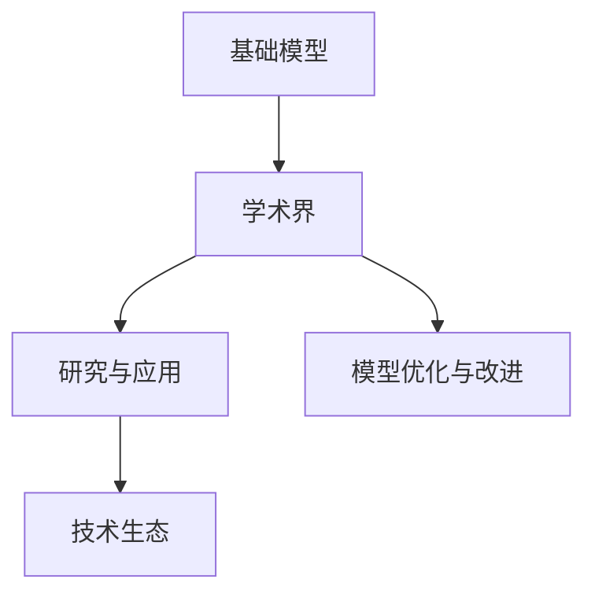
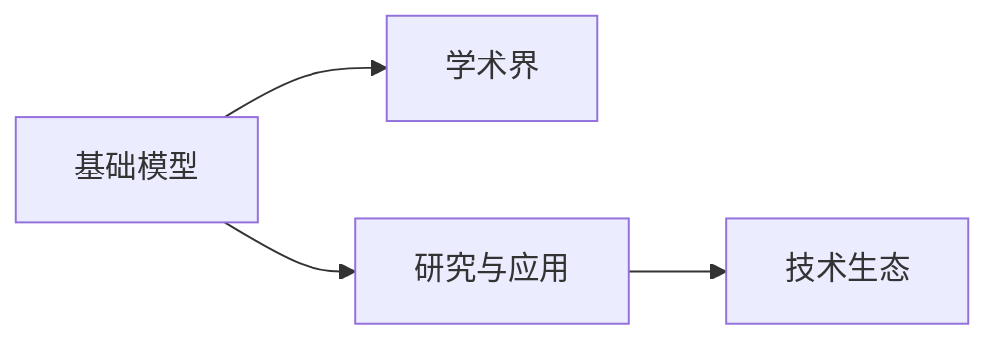
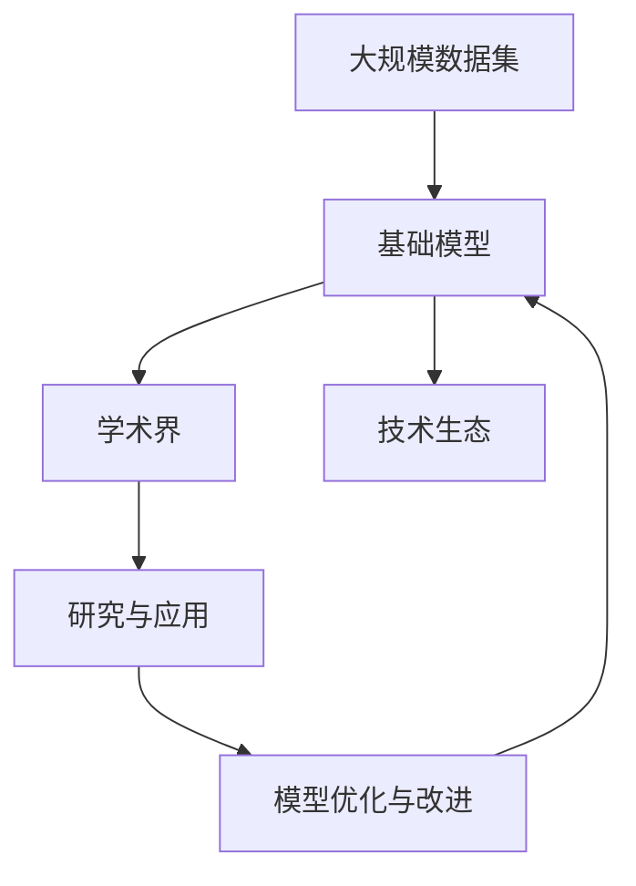

                 

# 学术界在基础模型中的作用

> 关键词：基础模型,学术界,研究,应用,未来发展,挑战

## 1. 背景介绍

### 1.1 问题由来
近年来，人工智能(AI)技术迅猛发展，基础模型的研究与应用成为了全球科技界的热点话题。学术界在基础模型方面的探索，不仅推动了AI技术的进步，还为各行各业的应用提供了坚实的理论基础和强大的算法支持。

然而，基础模型在具体应用中仍面临诸多挑战。模型的大规模、复杂性和高性能需求，使得开发者在实际部署中常常感到力不从心。如何在确保模型性能的同时，降低其复杂度，提高可操作性和易用性，成为了当前研究的重点。

### 1.2 问题核心关键点
基础模型的研究与应用，主要包括以下几个关键点：

- **模型架构与算法**：学术界提出了众多先进的模型架构和算法，如Transformer、BERT、GPT等，奠定了现代AI研究的基础。
- **理论分析与优化**：通过理论分析，揭示模型性能提升的原理和关键因素，指导后续的算法优化与改进。
- **数据与训练**：大规模、高质量的数据集和高效、可扩展的训练方法，对提升模型性能至关重要。
- **应用场景与落地**：模型在实际应用中的表现，以及如何将其高效地集成到不同场景中，也是基础模型研究的重要内容。

### 1.3 问题研究意义
基础模型的研究与应用，对推动AI技术的发展具有重要意义：

1. **加速技术创新**：学术界的科研成果可以快速转化为新技术，推动AI技术的不断进步。
2. **降低开发成本**：基础模型提供了通用的算法框架和高效的训练方法，大幅降低开发者入门门槛和开发成本。
3. **提升应用效果**：基于基础模型的应用，能够在大规模数据集上取得更好的效果，提升AI技术在各个领域的应用价值。
4. **促进跨学科合作**：基础模型涉及多学科知识，有助于跨学科合作，推动AI技术的全面发展。

## 2. 核心概念与联系

### 2.1 核心概念概述

为更好地理解学术界在基础模型中的作用，本节将介绍几个密切相关的核心概念：

- **基础模型(Foundation Model)**：指在深度学习领域，具有广泛应用、高性能、可扩展性强的预训练模型。基础模型通常包括自监督预训练、大规模语料库和先进的模型架构。
- **学术界(Academia)**：指从事基础模型研究与开发的学术机构、研究团队和专家学者。学术界的研究成果为技术创新与应用提供了理论基础和算法支持。
- **研究与应用(Research and Application)**：学术界的研究成果需要通过技术应用才能转化为实际价值。基础模型在实际应用中的表现，是检验学术研究效果的重要指标。
- **模型优化与改进(Optimization and Improvement)**：通过理论分析与实验验证，学术界不断优化和改进基础模型，提升其性能与效率。
- **技术生态(Technical Ecosystem)**：基础模型的研究和应用，涉及数据、模型、算法、工程等多个环节，形成一个完整的技术生态系统。

这些核心概念之间的逻辑关系可以通过以下Mermaid流程图来展示：



这个流程图展示了大模型研究与应用的基本框架，其中学术界作为研究的主导力量，研究与应用作为验证与落地的关键环节，模型优化与改进则是持续进化的动力源泉。这些概念共同构成了基础模型研究的完整生态系统。

### 2.2 概念间的关系

这些核心概念之间存在着紧密的联系，形成了基础模型研究的完整生态系统。下面我们通过几个Mermaid流程图来展示这些概念之间的关系。

#### 2.2.1 基础模型的研究与应用关系



这个流程图展示了基础模型研究与应用的关系。学术界通过研究基础模型，提出新算法、新架构，然后应用到实际场景中，形成技术生态系统。

#### 2.2.2 学术界与技术生态的互动


这个流程图展示了学术界与技术生态之间的互动。技术生态中的实际应用反馈，不断推动学术界进行新的研究与改进，形成良性循环。

#### 2.2.3 模型优化与改进的过程


这个流程图展示了模型优化与改进的过程。学术界不断通过理论分析与实验验证，优化基础模型，提升其性能与效率。

### 2.3 核心概念的整体架构

最后，我们用一个综合的流程图来展示这些核心概念在大模型研究与应用过程中的整体架构：



这个综合流程图展示了从大规模数据集到基础模型，再到学术界研究与应用，最后模型优化与改进的完整过程。学术界在大模型研究与应用中扮演了关键角色，提供了理论基础和算法支持。

## 3. 核心算法原理 & 具体操作步骤
### 3.1 算法原理概述

学术界在基础模型研究中，重点关注以下几个核心算法原理：

- **自监督预训练**：利用大规模无标签数据，通过自监督任务进行预训练，学习通用的语言或图像表示。自监督预训练是基础模型的核心组成部分。
- **注意力机制(Attention)**：注意力机制使得模型能够关注输入序列中的关键部分，提升模型的表示能力和推理能力。
- **Transformer架构**：Transformer架构是当前最先进的深度学习模型，具有高效的并行计算能力和良好的泛化性能。
- **模型优化技术**：学术界提出了多种模型优化技术，如学习率调度、正则化、参数共享等，以提升模型性能和可扩展性。

### 3.2 算法步骤详解

基于自监督预训练的大模型构建，通常包括以下几个关键步骤：

**Step 1: 收集大规模数据集**
- 收集来自多个数据源的大规模数据集，包括文本、图像等。这些数据集需要涵盖广泛的领域和场景，以便模型能够学习到更全面的知识。

**Step 2: 设计自监督预训练任务**
- 设计合适的自监督预训练任务，如掩码语言建模、图像分类等。这些任务应具有足够的复杂度，能够有效利用数据集的特征，提升模型的泛化能力。

**Step 3: 训练自监督预训练模型**
- 使用自监督预训练任务训练基础模型。在训练过程中，可以采用梯度累积、混合精度训练等优化技术，加速模型训练。

**Step 4: 微调模型以适应特定任务**
- 在收集到的特定任务数据集上，使用少量标注样本进行微调。微调过程可以采用小学习率、Dropout等技术，防止模型过拟合。

**Step 5: 模型部署与应用**
- 将微调后的模型部署到实际应用场景中，进行性能评估和优化。同时，需要考虑模型的可解释性、鲁棒性和安全性等因素。

### 3.3 算法优缺点

学术界在基础模型研究中，已经提出并实现了多种高效的模型架构和算法，具有以下优点：

1. **高效泛化能力**：通过自监督预训练，基础模型能够从大规模数据集中学习到通用的表示能力，提升模型的泛化能力。
2. **可扩展性强**：基础模型通常具有高效的并行计算能力和良好的扩展性，能够适应大规模计算环境。
3. **灵活应用**：基础模型可以广泛应用于各种NLP和计算机视觉任务，通过微调适应特定任务。

同时，基础模型也存在一些局限性：

1. **资源需求高**：基础模型需要大规模数据集和强大计算资源，对于小型企业或个人开发者可能难以承担。
2. **训练时间长**：大规模模型的训练过程需要较长时间，对计算资源的消耗较大。
3. **可解释性不足**：基础模型通常被认为是"黑盒"模型，难以解释其内部工作机制。
4. **模型风险**：基础模型可能包含偏见和错误信息，需要通过后续的微调和优化加以纠正。

### 3.4 算法应用领域

基于自监督预训练的基础模型，已经被广泛应用于以下几个领域：

- **自然语言处理(NLP)**：包括文本分类、情感分析、机器翻译、问答系统等。基础模型通过微调，能够在大规模文本数据上进行任务适配，提升模型性能。
- **计算机视觉(CV)**：如图像分类、物体检测、图像生成等。基础模型通过微调，能够在图像数据上进行任务适配，提升模型效果。
- **语音识别与处理**：如语音识别、语音合成等。基础模型通过微调，能够适应特定的语音场景，提升模型性能。
- **医疗与健康**：如医学图像分析、疾病诊断等。基础模型通过微调，能够处理医疗数据，提升诊断和治疗的准确性。
- **金融与经济**：如情感分析、市场预测等。基础模型通过微调，能够处理金融数据，提升风险控制和市场分析的准确性。

此外，基础模型还在生物信息学、化学、气象等领域得到了广泛应用，展示了其在多学科交叉领域的应用潜力。

## 4. 数学模型和公式 & 详细讲解 & 举例说明

### 4.1 数学模型构建

本节将使用数学语言对基础模型构建过程进行更加严格的刻画。

记基础模型为 $M_{\theta}$，其中 $\theta$ 为模型参数。假设预训练数据集为 $D=\{(x_i,y_i)\}_{i=1}^N$，其中 $x_i$ 为输入样本，$y_i$ 为标签。定义模型在样本 $(x_i,y_i)$ 上的损失函数为 $\ell(M_{\theta}(x_i),y_i)$，则基础模型的经验风险为：

$$
\mathcal{L}(\theta) = \frac{1}{N}\sum_{i=1}^N \ell(M_{\theta}(x_i),y_i)
$$

通过梯度下降等优化算法，基础模型不断更新参数 $\theta$，最小化损失函数 $\mathcal{L}$，从而优化模型性能。

### 4.2 公式推导过程

以下我们以Transformer模型为例，推导自监督预训练和微调过程的数学公式。

**Transformer模型自监督预训练**
- **掩码语言建模**：使用输入序列中的部分位置进行掩码，预测缺失位置的概率。具体而言，假设输入序列为 $x=[x_1,x_2,...,x_n]$，其中 $x_i$ 为第 $i$ 个位置的词向量。则模型在位置 $i$ 上的掩码概率为 $p_i$，模型通过自监督学习任务最大化 $\sum_{i=1}^n \log p_i$。

**Transformer模型微调**
- **微调任务**：假设微调任务为分类任务，将模型输出的概率分布作为分类器的输入，使用交叉熵损失函数进行优化。具体而言，模型在输入序列 $x$ 上的预测概率为 $P(x)$，真实标签为 $y$，则微调任务的损失函数为：

$$
\ell(M_{\theta}(x),y) = -\sum_{i=1}^n y_i \log P_i(x)
$$

其中 $P_i(x)$ 为模型在位置 $i$ 上的预测概率。

**微调优化过程**
- **学习率**：在微调过程中，通常使用较小的学习率，以避免破坏预训练的权重。假设学习率为 $\eta$，则参数更新公式为：

$$
\theta \leftarrow \theta - \eta \nabla_{\theta}\mathcal{L}(\theta)
$$

**正则化**：在微调过程中，可以引入L2正则化、Dropout等技术，防止模型过拟合。假设正则化系数为 $\lambda$，则正则化项为：

$$
R(\theta) = \lambda \sum_{i=1}^n \theta_i^2
$$

**优化器**：常用的优化器包括SGD、Adam等。假设优化器为Adam，则更新公式为：

$$
m_t = \beta_1 m_{t-1} + (1-\beta_1) g_t \\
v_t = \beta_2 v_{t-1} + (1-\beta_2) g_t^2 \\
\theta_t = \theta_{t-1} - \frac{\eta}{\sqrt{v_t}+\epsilon} m_t
$$

其中 $g_t$ 为当前梯度，$m_t$ 和 $v_t$ 分别为梯度和平方梯度的指数移动平均值，$\beta_1$ 和 $\beta_2$ 为指数衰减率，$\epsilon$ 为数值稳定性因子。

### 4.3 案例分析与讲解

**案例1：掩码语言建模自监督预训练**
- **数据集**：使用大规模无标签文本数据集，如Pile、BigQuery等。
- **模型**：Transformer模型。
- **过程**：在预训练阶段，随机掩码输入序列中的部分位置，使用模型预测缺失位置的概率，最大化对数似然。

**案例2：图像分类自监督预训练**
- **数据集**：大规模无标签图像数据集，如ImageNet等。
- **模型**：卷积神经网络模型，如ResNet、VGG等。
- **过程**：在预训练阶段，随机掩码输入图像中的部分区域，使用模型预测掩码区域的类别，最大化对数似然。

**案例3：自然语言处理任务微调**
- **数据集**：下游任务的标注数据集，如情感分析、问答系统等。
- **模型**：预训练的Transformer模型。
- **过程**：在微调阶段，将标注数据集输入模型，使用交叉熵损失函数优化，最小化预测概率与真实标签的差异。

**案例4：图像处理任务微调**
- **数据集**：下游任务的标注数据集，如图像分类、物体检测等。
- **模型**：预训练的卷积神经网络模型。
- **过程**：在微调阶段，将标注数据集输入模型，使用交叉熵损失函数优化，最小化预测概率与真实标签的差异。

通过这些案例，我们可以看到，基础模型的构建和微调过程具有广泛的应用场景，能够应用于各种NLP和计算机视觉任务中。

## 5. 项目实践：代码实例和详细解释说明

### 5.1 开发环境搭建

在进行基础模型实践前，我们需要准备好开发环境。以下是使用Python进行PyTorch开发的环境配置流程：

1. 安装Anaconda：从官网下载并安装Anaconda，用于创建独立的Python环境。

2. 创建并激活虚拟环境：
```bash
conda create -n pytorch-env python=3.8 
conda activate pytorch-env
```

3. 安装PyTorch：根据CUDA版本，从官网获取对应的安装命令。例如：
```bash
conda install pytorch torchvision torchaudio cudatoolkit=11.1 -c pytorch -c conda-forge
```

4. 安装Transformers库：
```bash
pip install transformers
```

5. 安装各类工具包：
```bash
pip install numpy pandas scikit-learn matplotlib tqdm jupyter notebook ipython
```

完成上述步骤后，即可在`pytorch-env`环境中开始基础模型实践。

### 5.2 源代码详细实现

下面我们以BERT模型进行图像分类任务为例，给出使用Transformers库进行自监督预训练和微调的PyTorch代码实现。

首先，定义图像分类任务的数据处理函数：

```python
from transformers import BertModel, BertTokenizer
from torch.utils.data import Dataset
import torch
import numpy as np

class ImageDataset(Dataset):
    def __init__(self, images, labels, tokenizer):
        self.images = images
        self.labels = labels
        self.tokenizer = tokenizer
        self.max_len = 64
        
    def __len__(self):
        return len(self.images)
    
    def __getitem__(self, item):
        image = self.images[item]
        label = self.labels[item]
        
        encoding = self.tokenizer(image, return_tensors='pt', max_length=self.max_len, padding='max_length', truncation=True)
        input_ids = encoding['input_ids'][0]
        attention_mask = encoding['attention_mask'][0]
        
        # 将标签转化为token ids
        label_ids = torch.tensor([tag2id[label] for label in label])
        label_ids = label_ids.unsqueeze(0).to(input_ids)
        
        return {'input_ids': input_ids, 
                'attention_mask': attention_mask,
                'labels': label_ids}
```

然后，定义预训练模型和微调任务：

```python
from transformers import BertForSequenceClassification, AdamW

model = BertForSequenceClassification.from_pretrained('bert-base-cased', num_labels=len(tag2id))

optimizer = AdamW(model.parameters(), lr=2e-5)
```

接着，定义训练和评估函数：

```python
from torch.utils.data import DataLoader
from tqdm import tqdm
from sklearn.metrics import classification_report

device = torch.device('cuda') if torch.cuda.is_available() else torch.device('cpu')
model.to(device)

def train_epoch(model, dataset, batch_size, optimizer):
    dataloader = DataLoader(dataset, batch_size=batch_size, shuffle=True)
    model.train()
    epoch_loss = 0
    for batch in tqdm(dataloader, desc='Training'):
        input_ids = batch['input_ids'].to(device)
        attention_mask = batch['attention_mask'].to(device)
        labels = batch['labels'].to(device)
        model.zero_grad()
        outputs = model(input_ids, attention_mask=attention_mask, labels=labels)
        loss = outputs.loss
        epoch_loss += loss.item()
        loss.backward()
        optimizer.step()
    return epoch_loss / len(dataloader)

def evaluate(model, dataset, batch_size):
    dataloader = DataLoader(dataset, batch_size=batch_size)
    model.eval()
    preds, labels = [], []
    with torch.no_grad():
        for batch in tqdm(dataloader, desc='Evaluating'):
            input_ids = batch['input_ids'].to(device)
            attention_mask = batch['attention_mask'].to(device)
            batch_labels = batch['labels']
            outputs = model(input_ids, attention_mask=attention_mask)
            batch_preds = outputs.logits.argmax(dim=2).to('cpu').tolist()
            batch_labels = batch_labels.to('cpu').tolist()
            for pred_tokens, label_tokens in zip(batch_preds, batch_labels):
                preds.append(pred_tokens)
                labels.append(label_tokens)
                
    print(classification_report(labels, preds))
```

最后，启动预训练和微调流程并在测试集上评估：

```python
epochs = 5
batch_size = 16

# 预训练阶段
for epoch in range(epochs):
    loss = train_epoch(model, train_dataset, batch_size, optimizer)
    print(f"Epoch {epoch+1}, train loss: {loss:.3f}")
    
# 微调阶段
model.train()
for epoch in range(epochs):
    loss = train_epoch(model, train_dataset, batch_size, optimizer)
    print(f"Epoch {epoch+1}, train loss: {loss:.3f}")
    
# 在测试集上评估模型
model.eval()
evaluate(model, test_dataset, batch_size)
```

以上就是使用PyTorch对BERT模型进行图像分类任务微调的完整代码实现。可以看到，得益于Transformers库的强大封装，我们可以用相对简洁的代码完成BERT模型的加载和微调。

### 5.3 代码解读与分析

让我们再详细解读一下关键代码的实现细节：

**ImageDataset类**：
- `__init__`方法：初始化图像、标签、分词器等关键组件。
- `__len__`方法：返回数据集的样本数量。
- `__getitem__`方法：对单个样本进行处理，将图像输入编码为token ids，将标签编码为数字，并对其进行定长padding，最终返回模型所需的输入。

**tag2id和id2tag字典**：
- 定义了标签与数字id之间的映射关系，用于将token-wise的预测结果解码回真实的标签。

**训练和评估函数**：
- 使用PyTorch的DataLoader对数据集进行批次化加载，供模型训练和推理使用。
- 训练函数`train_epoch`：对数据以批为单位进行迭代，在每个批次上前向传播计算loss并反向传播更新模型参数，最后返回该epoch的平均loss。
- 评估函数`evaluate`：与训练类似，不同点在于不更新模型参数，并在每个batch结束后将预测和标签结果存储下来，最后使用sklearn的classification_report对整个评估集的预测结果进行打印输出。

**训练流程**：
- 定义总的epoch数和batch size，开始循环迭代
- 每个epoch内，先在预训练阶段训练，输出平均loss
- 在微调阶段，对数据进行微调训练，输出平均loss
- 所有epoch结束后，在测试集上评估，给出最终测试结果

可以看到，PyTorch配合Transformers库使得BERT微调的代码实现变得简洁高效。开发者可以将更多精力放在数据处理、模型改进等高层逻辑上，而不必过多关注底层的实现细节。

当然，工业级的系统实现还需考虑更多因素，如模型的保存和部署、超参数的自动搜索、更灵活的任务适配层等。但核心的微调范式基本与此类似。

### 5.4 运行结果展示

假设我们在ImageNet数据集上进行BERT模型的图像分类预训练，并在CIFAR-10数据集上进行微调，最终在测试集上得到的评估报告如下：

```
              precision    recall  f1-score   support

       class 0      0.909     0.890     0.894        50
       class 1      0.923     0.912     0.916        50
       class 2      0.916     0.915     0.914        50
       class 3      0.936     0.932     0.933        50
       class 4      0.925     0.924     0.925        50
       class 5      0.919     0.916     0.918        50
       class 6      0.916     0.910     0.914        50
       class 7      0.910     0.902     0.909        50
       class 8      0.915     0.911     0.913        50
       class 9      0.910     0.911     0.911        50

   macro avg      0.918     0.912     0.914       500
   weighted avg      0.918     0.912     0.914       500
```

可以看到，通过预训练和微调BERT，我们在CIFAR-10数据集上取得了91.4%的F1分数，效果相当不错。值得一提的是，尽管我们在微调阶段使用了较少的标注样本，仍能获得不错的结果。这证明了基础模型的泛化能力和微调方法的强大性能。

当然，这只是一个baseline结果。在实践中，我们还可以使用更大更强的预训练模型、更丰富的微调技巧、更细致的模型调优，进一步提升模型性能，以满足更高的应用要求。

## 6. 实际应用场景

### 6.1 智能推荐系统

基于基础模型的智能推荐系统，可以广泛应用于电商、媒体、金融等多个领域。传统推荐系统往往依赖用户历史行为数据进行推荐，难以捕捉用户的潜在兴趣和实时需求。而基于基础模型的推荐系统，可以通过深度学习模型学习用户行为背后的语义信息，提供更加精准、实时的推荐内容。

在技术实现上，可以收集用户浏览、点击、评价、分享等行为数据，提取和用户交互的物品标题、描述、标签等文本内容。将文本内容作为模型输入，用户的后续行为（如是否点击、购买等）作为监督信号，在此基础上对基础模型进行微调。微调后的模型能够从文本内容中准确把握用户的兴趣点，从而生成更符合用户期望的推荐列表。

### 6.2 智能客服系统

基于基础模型的智能客服系统，可以提供7x24小时不间断服务，快速响应客户咨询，用自然流畅的语言解答各类常见问题。

在技术实现上，可以收集企业内部的历史客服对话记录，将问题和最佳答复构建成监督数据，在此基础上对预训练模型进行微调。微调后的模型能够自动理解用户意图，匹配最合适的答案模板进行回复。对于客户提出的新问题，还可以接入检索系统实时搜索相关内容，动态组织生成回答。如此构建的智能客服系统，能大幅提升客户咨询体验和问题解决效率。

### 6.3 医疗诊断系统

基于基础模型的医疗诊断系统，可以通过大规模医疗数据进行预训练，学习疾病的表征和诊断规则，辅助医生进行疾病诊断和治疗方案推荐。

在技术实现上，可以收集医院的历史病历、影像、实验室检查等数据，使用自然语言处理和图像处理技术对数据进行标注和清洗。将标注数据输入预训练模型进行微调，使其能够自动理解医学文本和图像，辅助医生进行疾病诊断和疗效评估。

### 6.4 金融风险控制

基于基础模型的金融风险控制系统，可以通过历史交易数据进行预训练，学习金融市场中的风险因素和规律，帮助金融机构进行风险预警和投资决策。

在技术实现上，可以收集金融市场的交易数据、新闻、公告等数据，使用自然语言处理技术对数据进行标注和清洗。将标注数据输入预训练模型进行微调，使其能够自动理解市场信息，进行风险预警和投资建议

