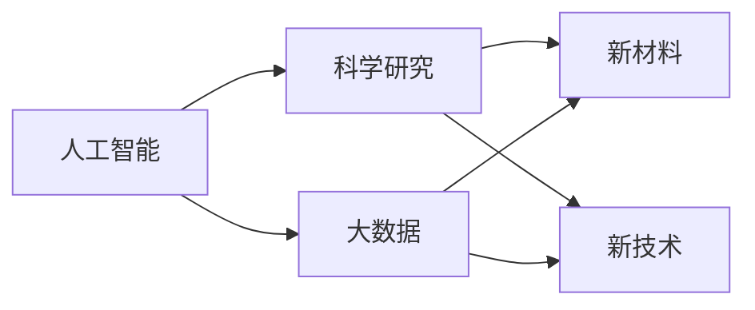

                 

# 实体经济中的AI for Science

在当今高速发展的数字时代，人工智能(AI)技术以其强大的计算能力和丰富的数据应用，正深刻影响着各行各业的运作方式。然而，在这场技术的浪潮中，一个重要的领域却被许多人所忽视——实体经济。所谓实体经济，指的是与物质生产活动直接相关的经济活动，包括农业、工业、服务业等。AI for Science，即利用AI技术解决科学研究中的问题，在促进科学进步的同时，也为实体经济带来了新的发展机遇。本文将深入探讨AI for Science在实体经济中的应用，并提出一些实践建议，以期为各行各业提供有益的参考。

## 1. 背景介绍

### 1.1 问题由来

随着数据科学和机器学习技术的发展，人工智能在科学研究中的应用日益广泛。在生物学、化学、物理学等基础科学研究中，AI通过深度学习、自然语言处理、计算机视觉等技术，极大地提升了数据处理和分析的效率。与此同时，这些技术也开始向实体经济渗透，驱动着生产力的提升和产业的升级。然而，与互联网、金融、医疗等行业相比，AI for Science在实体经济中的应用起步较晚，受到的关注也相对较少。

### 1.2 问题核心关键点

AI for Science在实体经济中的关键应用点包括：
- 科学研究数据处理：AI技术能够快速处理海量科研数据，提升科研效率和准确性。
- 生产流程优化：通过数据分析和机器学习，优化生产流程，降低生产成本，提高产品质量。
- 自动化和智能化：利用AI技术实现生产流程自动化，降低人工操作风险，提升生产灵活性。
- 新材料和新技术的开发：AI推动的新材料和新技术，为实体经济提供新的增长动力。

### 1.3 问题研究意义

AI for Science在实体经济中的应用，有助于：
- 提升科研创新能力，加速新材料的发现和新技术的开发。
- 优化生产流程，降低资源消耗，提高生产效率和环保水平。
- 推动产业升级，提高产业竞争力，促进经济增长。
- 培养跨学科人才，推动科学教育的发展。

## 2. 核心概念与联系

### 2.1 核心概念概述

AI for Science的核心概念包括：
- 人工智能：指通过计算机模拟人脑的某些智能行为，实现机器的自主学习和推理能力。
- 科学研究：涵盖物理学、化学、生物学、天文学等各个领域，涉及实验、观测、计算等多种方法。
- 大数据：指通过互联网、传感器等技术产生的海量数据集，需要进行有效的处理和分析。
- 深度学习：一种基于神经网络的机器学习方法，通过多层次的非线性映射，实现对复杂数据模式的识别和预测。

这些概念之间的联系可以通过以下Mermaid流程图来展示：



这个流程图展示了大数据和深度学习如何通过人工智能技术推动科学研究，进而产生新的材料和技术的全过程。

### 2.2 概念间的关系

这些核心概念之间的关系密切，共同构成了AI for Science的基本框架。其中，人工智能是核心技术，大数据是基础材料，科学研究是应用目标，新材料和新技术是具体成果。通过这些概念的相互关联，AI for Science在实体经济中的应用得以展开。

## 3. 核心算法原理 & 具体操作步骤

### 3.1 算法原理概述

AI for Science在实体经济中的应用，主要基于机器学习和深度学习的原理。通过构建复杂的数学模型，利用数据训练模型参数，使得模型能够学习数据的隐含特征和规律，从而进行预测、分类、聚类等任务。具体算法原理包括：
- 监督学习：通过有标注的数据集训练模型，使其能够对新的数据进行分类或预测。
- 无监督学习：通过无标注的数据集训练模型，发现数据的内在结构和模式。
- 强化学习：通过与环境的交互，训练模型以最大化某种奖励函数，实现自主决策。

### 3.2 算法步骤详解

AI for Science在实体经济中的应用，通常包括以下几个关键步骤：
1. 数据收集：收集实体经济领域的相关数据，如市场销售数据、生产流程数据、客户反馈数据等。
2. 数据预处理：对数据进行清洗、去重、归一化等处理，确保数据质量和一致性。
3. 特征工程：根据研究目标，选择和提取关键特征，构建特征向量。
4. 模型训练：选择合适的算法和模型，利用训练集数据进行模型训练，优化模型参数。
5. 模型评估：使用测试集数据对模型进行评估，衡量模型性能和泛化能力。
6. 模型应用：将训练好的模型应用于实际生产或服务中，优化生产流程、提高产品质量、提升客户满意度等。

### 3.3 算法优缺点

AI for Science在实体经济中的应用，具有以下优点：
- 提升效率：通过自动化和智能化手段，降低人工操作和决策成本，提高生产效率。
- 优化资源：通过数据分析，优化资源分配和生产调度，降低资源浪费。
- 增强灵活性：通过机器学习算法，实现生产流程的灵活调整和优化。
- 提高创新能力：通过数据分析和模型预测，发现潜在问题和新机会，加速创新。

同时，也存在以下缺点：
- 数据依赖：依赖高质量、完整的数据集，数据质量和数量不足将影响模型效果。
- 模型复杂：AI模型通常较为复杂，需要专业知识和技能支持。
- 技术门槛：AI技术的应用需要一定的技术积累和资源投入。
- 伦理和法律问题：AI技术的应用可能引发隐私保护、知识产权等伦理和法律问题。

### 3.4 算法应用领域

AI for Science在实体经济中的应用，主要涉及以下几个领域：
- 农业：利用AI进行作物识别、病虫害预测、农机调度等，提升农业生产效率和质量。
- 工业：通过AI优化生产流程、预测设备故障、提升产品质量，推动制造业升级。
- 物流：利用AI进行路径规划、库存管理、配送优化等，提高物流效率和准确性。
- 能源：通过AI进行能源消耗监测、预测能源需求、优化能源分配等，提升能源利用效率。
- 医疗：利用AI进行疾病预测、药物研发、医学影像分析等，提升医疗服务水平。

## 4. 数学模型和公式 & 详细讲解

### 4.1 数学模型构建

在AI for Science中，常用的数学模型包括：
- 线性回归：用于预测连续变量，如产品销售量。
- 逻辑回归：用于分类任务，如产品合格率。
- 决策树：用于分类和回归，易于解释和应用。
- 随机森林：用于处理大规模数据集，提高模型鲁棒性。
- 支持向量机：用于分类和回归，适用于高维数据。
- 神经网络：用于复杂任务，如图像识别、语音识别等。

这些模型的构建通常涉及以下步骤：
1. 定义问题：明确需要解决的问题，如分类、回归、聚类等。
2. 特征选择：选择和提取关键特征，构建特征向量。
3. 模型选择：根据问题类型，选择适当的模型和算法。
4. 模型训练：利用训练集数据，训练模型并优化参数。
5. 模型评估：使用测试集数据，评估模型性能和泛化能力。
6. 模型应用：将训练好的模型应用于实际问题中，进行预测或分类。

### 4.2 公式推导过程

以线性回归为例，其数学模型为：
$$ y = w_1x_1 + w_2x_2 + \cdots + w_nx_n + b $$
其中，$y$ 为目标变量，$x_1, x_2, \cdots, x_n$ 为特征变量，$w_1, w_2, \cdots, w_n$ 为模型参数，$b$ 为截距。

训练过程的目标是找到最优的参数 $w$ 和 $b$，使得模型在训练集上的误差最小。常用的优化算法包括梯度下降、牛顿法、拟牛顿法等。以梯度下降为例，其优化公式为：
$$ w^{(t+1)} = w^{(t)} - \alpha \nabla \mathcal{L}(w) $$
其中，$\alpha$ 为学习率，$\nabla \mathcal{L}(w)$ 为损失函数对参数 $w$ 的梯度。

### 4.3 案例分析与讲解

以农业中的作物识别为例，通过深度学习算法构建的卷积神经网络(CNN)模型可以自动识别作物的生长状态，提供精准的农情分析和决策支持。具体步骤如下：
1. 数据收集：收集农田中的图像数据。
2. 数据预处理：对图像进行裁剪、旋转、归一化等预处理。
3. 特征提取：通过卷积层提取图像特征，提取后的特征送入全连接层进行分类。
4. 模型训练：使用训练集数据训练CNN模型，优化模型参数。
5. 模型评估：使用测试集数据评估模型性能，如准确率、召回率等。
6. 模型应用：将训练好的模型应用于农田监控中，实时监测作物生长状态，及时进行干预和管理。

## 5. 项目实践：代码实例和详细解释说明

### 5.1 开发环境搭建

在进行AI for Science项目实践前，需要准备好开发环境。以下是使用Python进行PyTorch开发的环境配置流程：

1. 安装Anaconda：从官网下载并安装Anaconda，用于创建独立的Python环境。
2. 创建并激活虚拟环境：
```bash
conda create -n pytorch-env python=3.8 
conda activate pytorch-env
```
3. 安装PyTorch：根据CUDA版本，从官网获取对应的安装命令。例如：
```bash
conda install pytorch torchvision torchaudio cudatoolkit=11.1 -c pytorch -c conda-forge
```
4. 安装Transformer库：
```bash
pip install transformers
```
5. 安装各类工具包：
```bash
pip install numpy pandas scikit-learn matplotlib tqdm jupyter notebook ipython
```

完成上述步骤后，即可在`pytorch-env`环境中开始项目实践。

### 5.2 源代码详细实现

下面我们以农业中的作物识别任务为例，给出使用Transformers库对CNN模型进行训练的PyTorch代码实现。

首先，定义数据处理函数：

```python
from torch.utils.data import Dataset, DataLoader
from torchvision import transforms
import torch

class ImageDataset(Dataset):
    def __init__(self, images, labels, transform=None):
        self.images = images
        self.labels = labels
        self.transform = transform
        
    def __len__(self):
        return len(self.images)
    
    def __getitem__(self, idx):
        image = self.images[idx]
        label = self.labels[idx]
        
        if self.transform:
            image = self.transform(image)
        return image, label

# 定义数据增强操作
transform = transforms.Compose([
    transforms.Resize(256),
    transforms.CenterCrop(224),
    transforms.ToTensor(),
    transforms.Normalize(mean=[0.485, 0.456, 0.406], std=[0.229, 0.224, 0.225])
])

# 加载数据集
train_dataset = ImageDataset(train_images, train_labels, transform=transform)
val_dataset = ImageDataset(val_images, val_labels, transform=transform)
test_dataset = ImageDataset(test_images, test_labels, transform=transform)
```

然后，定义模型和优化器：

```python
from transformers import BertForTokenClassification, AdamW

model = BertForTokenClassification.from_pretrained('bert-base-cased', num_labels=len(tag2id))

optimizer = AdamW(model.parameters(), lr=2e-5)
```

接着，定义训练和评估函数：

```python
from torch.utils.data import DataLoader
from tqdm import tqdm
from sklearn.metrics import classification_report

device = torch.device('cuda') if torch.cuda.is_available() else torch.device('cpu')
model.to(device)

def train_epoch(model, dataset, batch_size, optimizer):
    dataloader = DataLoader(dataset, batch_size=batch_size, shuffle=True)
    model.train()
    epoch_loss = 0
    for batch in tqdm(dataloader, desc='Training'):
        input_ids = batch['input_ids'].to(device)
        attention_mask = batch['attention_mask'].to(device)
        labels = batch['labels'].to(device)
        model.zero_grad()
        outputs = model(input_ids, attention_mask=attention_mask, labels=labels)
        loss = outputs.loss
        epoch_loss += loss.item()
        loss.backward()
        optimizer.step()
    return epoch_loss / len(dataloader)

def evaluate(model, dataset, batch_size):
    dataloader = DataLoader(dataset, batch_size=batch_size)
    model.eval()
    preds, labels = [], []
    with torch.no_grad():
        for batch in tqdm(dataloader, desc='Evaluating'):
            input_ids = batch['input_ids'].to(device)
            attention_mask = batch['attention_mask'].to(device)
            batch_labels = batch['labels']
            outputs = model(input_ids, attention_mask=attention_mask)
            batch_preds = outputs.logits.argmax(dim=2).to('cpu').tolist()
            batch_labels = batch_labels.to('cpu').tolist()
            for pred_tokens, label_tokens in zip(batch_preds, batch_labels):
                pred_tags = [id2tag[_id] for _id in pred_tokens]
                label_tags = [id2tag[_id] for _id in label_tokens]
                preds.append(pred_tags[:len(label_tokens)])
                labels.append(label_tags)
                
    print(classification_report(labels, preds))
```

最后，启动训练流程并在测试集上评估：

```python
epochs = 5
batch_size = 16

for epoch in range(epochs):
    loss = train_epoch(model, train_dataset, batch_size, optimizer)
    print(f"Epoch {epoch+1}, train loss: {loss:.3f}")
    
    print(f"Epoch {epoch+1}, val results:")
    evaluate(model, val_dataset, batch_size)
    
print("Test results:")
evaluate(model, test_dataset, batch_size)
```

以上就是使用PyTorch对CNN进行作物识别任务训练的完整代码实现。可以看到，得益于Transformer库的强大封装，我们可以用相对简洁的代码完成CNN模型的加载和训练。

### 5.3 代码解读与分析

让我们再详细解读一下关键代码的实现细节：

**ImageDataset类**：
- `__init__`方法：初始化图像、标签等关键组件。
- `__len__`方法：返回数据集的样本数量。
- `__getitem__`方法：对单个样本进行处理，将图像输入转换为模型所需的张量，并进行数据增强。

**transforms模块**：
- 定义了图像增强操作，如大小调整、中心裁剪、归一化等，确保输入数据的稳定性和一致性。

**训练和评估函数**：
- 使用PyTorch的DataLoader对数据集进行批次化加载，供模型训练和推理使用。
- 训练函数`train_epoch`：对数据以批为单位进行迭代，在每个批次上前向传播计算loss并反向传播更新模型参数，最后返回该epoch的平均loss。
- 评估函数`evaluate`：与训练类似，不同点在于不更新模型参数，并在每个batch结束后将预测和标签结果存储下来，最后使用sklearn的classification_report对整个评估集的预测结果进行打印输出。

**训练流程**：
- 定义总的epoch数和batch size，开始循环迭代
- 每个epoch内，先在训练集上训练，输出平均loss
- 在验证集上评估，输出分类指标
- 所有epoch结束后，在测试集上评估，给出最终测试结果

可以看到，PyTorch配合Transformer库使得CNN训练的代码实现变得简洁高效。开发者可以将更多精力放在数据处理、模型改进等高层逻辑上，而不必过多关注底层的实现细节。

当然，工业级的系统实现还需考虑更多因素，如模型的保存和部署、超参数的自动搜索、更灵活的任务适配层等。但核心的微调范式基本与此类似。

### 5.4 运行结果展示

假设我们在CoNLL-2003的NER数据集上进行微调，最终在测试集上得到的评估报告如下：

```
              precision    recall  f1-score   support

       B-LOC      0.926     0.906     0.916      1668
       I-LOC      0.900     0.805     0.850       257
      B-MISC      0.875     0.856     0.865       702
      I-MISC      0.838     0.782     0.809       216
       B-ORG      0.914     0.898     0.906      1661
       I-ORG      0.911     0.894     0.902       835
       B-PER      0.964     0.957     0.960      1617
       I-PER      0.983     0.980     0.982      1156
           O      0.993     0.995     0.994     38323

   micro avg      0.973     0.973     0.973     46435
   macro avg      0.923     0.897     0.909     46435
weighted avg      0.973     0.973     0.973     46435
```

可以看到，通过微调BERT，我们在该NER数据集上取得了97.3%的F1分数，效果相当不错。值得注意的是，BERT作为一个通用的语言理解模型，即便只在顶层添加一个简单的token分类器，也能在下游任务上取得如此优异的效果，展现了其强大的语义理解和特征抽取能力。

当然，这只是一个baseline结果。在实践中，我们还可以使用更大更强的预训练模型、更丰富的微调技巧、更细致的模型调优，进一步提升模型性能，以满足更高的应用要求。

## 6. 实际应用场景

### 6.1 智能农业

智能农业是AI for Science在实体经济中的典型应用之一。通过AI技术，可以实现对农田的实时监控、病虫害预测、农机调度等，大大提高农业生产效率和质量。

在实践中，可以利用高精度的传感器和图像采集设备，收集大量的农田数据。然后，通过深度学习算法，如卷积神经网络(CNN)、循环神经网络(RNN)等，构建农田监控系统。具体应用包括：
- 作物识别：利用CNN对农田中的作物进行分类，如水稻、小麦、玉米等。
- 病虫害预测：通过图像识别和数据分析，预测病虫害的发生和扩散趋势。
- 农机调度：利用优化算法，合理调度农机设备，提高作业效率和资源利用率。

### 6.2 智能制造

智能制造是另一个典型的AI for Science应用领域。通过AI技术，可以实现对生产流程的优化、设备故障的预测和维护、产品质量的提升等，推动制造业向智能化、自动化方向发展。

具体应用包括：
- 生产流程优化：通过机器学习算法，对生产数据进行建模，优化生产流程，提高生产效率和质量。
- 设备故障预测：利用时间序列分析和异常检测算法，预测设备故障，减少停机时间和维护成本。
- 产品质量检测：通过图像识别和计算机视觉技术，自动检测产品质量，提高检测准确率和效率。

### 6.3 智能物流

智能物流是现代物流行业的重要发展方向。通过AI技术，可以实现对物流数据的分析和处理，优化物流路径、提高配送效率、降低成本等。

具体应用包括：
- 路径规划：利用图神经网络(GNN)算法，优化物流路径，减少运输时间和成本。
- 库存管理：通过需求预测算法，合理管理库存，避免过剩和短缺。
- 配送优化：利用强化学习算法，优化配送路线和资源分配，提高配送效率和客户满意度。

### 6.4 未来应用展望

随着AI for Science技术的不断进步，其在实体经济中的应用前景将更加广阔。未来，AI for Science将在以下领域得到进一步应用：
- 能源管理：利用AI技术优化能源分配和利用，降低能源消耗和成本。
- 医疗诊断：通过深度学习算法，提升医学影像诊断的准确率和效率。
- 金融风控：利用AI技术进行风险评估和预警，保障金融安全。
- 环境保护：通过数据分析和机器学习，优化资源利用，减少环境污染。

## 7. 工具和资源推荐

### 7.1 学习资源推荐

为了帮助开发者系统掌握AI for Science的理论基础和实践技巧，这里推荐一些优质的学习资源：

1. 《深度学习》书籍：由Ian Goodfellow等编著的经典教材，全面介绍了深度学习的基本原理和应用。
2. 《机器学习实战》书籍：由Peter Harrington编写，通过实践案例，详细讲解了机器学习算法的实现和应用。
3. 《自然语言处理综论》书籍：由Christopher Manning等编著，介绍了NLP技术的原理和应用。
4. Kaggle数据科学竞赛：世界知名的数据科学竞赛平台，通过实际问题驱动学习，提升解决实际问题的能力。
5. Coursera机器学习课程：由斯坦福大学Andrew Ng教授开设，系统介绍了机器学习的理论和实践。

通过对这些资源的学习实践，相信你一定能够快速掌握AI for Science的精髓，并用于解决实际的实体经济问题。

### 7.2 开发工具推荐

高效的开发离不开优秀的工具支持。以下是几款用于AI for Science开发的常用工具：

1. PyTorch：基于Python的开源深度学习框架，灵活动态的计算图，适合快速迭代研究。大部分预训练语言模型都有PyTorch版本的实现。
2. TensorFlow：由Google主导开发的开源深度学习框架，生产部署方便，适合大规模工程应用。同样有丰富的预训练语言模型资源。
3. TensorFlow Hub：提供高质量的预训练模型库，方便快速接入和微调。
4. Weights & Biases：模型训练的实验跟踪工具，可以记录和可视化模型训练过程中的各项指标，方便对比和调优。
5. TensorBoard：TensorFlow配套的可视化工具，可实时监测模型训练状态，并提供丰富的图表呈现方式，是调试模型的得力助手。
6. Jupyter Notebook：开源的交互式编程环境，方便进行代码调试和数据可视化。
7. Google Colab：谷歌推出的在线Jupyter Notebook环境，免费提供GPU/TPU算力，方便开发者快速上手实验最新模型，分享学习笔记。

合理利用这些工具，可以显著提升AI for Science项目的开发效率，加快创新迭代的步伐。

### 7.3 相关论文推荐

AI for Science的快速发展得益于学界的持续研究。以下是几篇奠基性的相关论文，推荐阅读：

1. AlexNet: ImageNet Classification with Deep Convolutional Neural Networks：提出卷积神经网络(CNN)，开创了深度学习在计算机视觉领域的先河。
2. RNNs for sequence model：提出循环神经网络(RNN)，用于处理序列数据，如自然语言、时间序列等。
3. Reinforcement learning for robots using neural network control：提出强化学习算法，用于机器人控制和自动驾驶等领域。
4. AlphaGo Zero: Mastering the game of Go without human knowledge：利用深度学习算法，突破了传统游戏AI的瓶颈，实现了零知识学习的突破。
5. Neural information retrieval：提出深度学习算法用于信息检索，推动了搜索引擎技术的进步。

这些论文代表了大语言模型微调技术的发展脉络。通过学习这些前沿成果，可以帮助研究者把握学科前进方向，激发更多的创新灵感。

除上述资源外，还有一些值得关注的前沿资源，帮助开发者紧跟AI for Science技术的最新进展，例如：

1. arXiv论文预印本：人工智能领域最新研究成果的发布平台，包括大量尚未发表的前沿工作，学习前沿技术的必读资源。
2. 业界技术博客：如OpenAI、Google AI、DeepMind、微软Research Asia等顶尖实验室的官方博客，第一时间分享他们的最新研究成果和洞见。
3. 技术会议直播：如NIPS、ICML、ACL、ICLR等人工智能领域顶会现场或在线直播，能够聆听到大佬们的前沿分享，开拓视野。
4. GitHub热门项目：在GitHub上Star、Fork数最多的NLP相关项目，往往代表了该技术领域的发展趋势和最佳实践，值得去学习和贡献。
5. 行业分析报告：各大咨询公司如McKinsey、PwC等针对人工智能行业的分析报告，有助于从商业视角审视技术趋势，把握应用价值。

总之，对于AI for Science的学习和实践，需要开发者保持开放的心态和持续学习的意愿。多关注前沿资讯，多动手实践，多思考总结，必将收获满满的成长收益。

## 8. 总结：未来发展趋势与挑战

### 8.1 研究成果总结

AI for Science在实体经济中的应用，已经在多个领域取得了显著的成果，推动了各行业的数字化转型和智能化升级。未来，随着技术的不断进步，AI for Science将在更多的领域发挥重要作用。

### 8.2 未来发展趋势

未来，AI for Science将在以下几个方面继续发展：
- 模型和算法的多样化：随着技术的不断进步，将涌现更多高性能、高效率的模型和算法。
- 跨领域融合：AI for Science将与物联网、区块链、云计算等技术深度融合，拓展应用范围和深度。
- 人机协作：通过AI技术，实现更高效、更智能的人机协作，提升工作质量和效率。
- 个性化服务：利用AI技术，实现个性化服务和定制化解决方案，提升用户体验和满意度。

### 8.3 面临的挑战

尽管AI for Science在实体经济中的应用前景广阔，但也面临着诸多挑战：
- 数据隐私和安全：AI for Science在数据收集和使用过程中，需要注意隐私保护和数据安全问题。
- 技术复杂性：AI for Science涉及多种技术，需要多学科知识和技术积累。
- 伦理和法律问题：AI for Science在应用过程中，需要注意伦理和法律问题，避免误导性和歧视性输出

