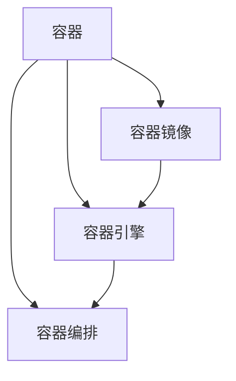
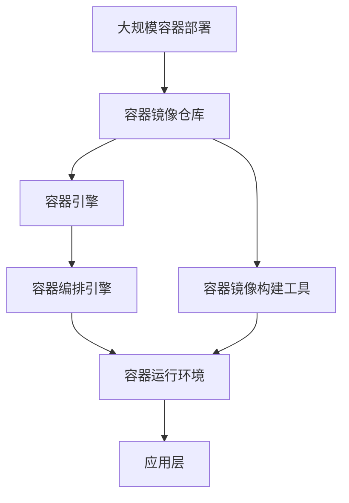

                 

## 1. 背景介绍

### 1.1 问题由来

容器技术作为一种将软件及其依赖打包到标准、可移植格式中，以便于在多种不同环境中可靠运行的技术，在现代软件开发和部署中扮演着越来越重要的角色。它不仅能够解决传统的软件打包和分发问题，还提供了强大的隔离和抽象能力，使得开发者和运维人员能够更加灵活地管理软件资源。

容器技术最早起源于20世纪90年代，主要用于在不同的操作系统上运行相同的软件包。然而，随着云计算和微服务架构的兴起，容器技术逐渐演变成了现代应用程序的部署标准。如今，Kubernetes、Docker等容器编排和运行平台已经成为了企业级IT基础设施不可或缺的组成部分。

### 1.2 问题核心关键点

容器技术的核心在于其提供的隔离和抽象能力，使得不同应用程序的依赖和资源可以被独立管理和调度。这一特性使得容器技术在微服务架构和DevOps文化中得到了广泛应用。

容器技术的关键在于以下几点：

- **隔离**：每个容器都拥有自己独立的操作系统和内核空间，可以有效隔离不同应用之间的资源和依赖。
- **沙箱化**：容器内部的进程和文件系统是相互独立的，保证了应用的安全性和稳定性。
- **可移植性**：容器可以在任何支持Docker引擎的环境上运行，实现了跨平台部署。
- **镜像管理**：容器镜像包含应用程序的所有依赖和配置，简化了部署和维护过程。

这些特性使得容器技术能够灵活地应对现代软件开发和部署的需求，同时减少了操作系统的复杂性和资源消耗。

### 1.3 问题研究意义

容器技术不仅改变了软件开发和部署的方式，还推动了DevOps文化的普及。它使得开发者和运维人员能够更加快速地交付软件，同时减少了配置和错误的风险。容器技术已经成为云计算和微服务架构的基础设施，对于提升软件交付的速度和质量具有重要意义。

通过深入理解容器的原理和实现，开发者可以更好地设计和管理微服务架构，实现持续交付和自动化运维。同时，容器技术的应用还推动了开源社区的发展，促进了云计算技术的普及和落地。

## 2. 核心概念与联系

### 2.1 核心概念概述

为了更好地理解容器技术的原理和应用，本节将介绍几个关键概念：

- **容器**：一个运行中的隔离软件环境，包含了应用程序及其依赖。
- **容器镜像**：一个静态文件系统，包含了容器的完整部署信息。
- **容器引擎**：一个负责管理容器的工具，如Docker、Kubernetes等。
- **容器编排**：通过容器引擎管理多个容器，实现资源的自动化部署、扩展和管理。

这些概念共同构成了容器技术的核心架构，使得容器能够在不同的环境中可靠运行。

### 2.2 概念间的关系

这些核心概念之间的关系可以通过以下Mermaid流程图来展示：



这个流程图展示了容器技术的核心组件及其之间的关系：

1. 容器是容器镜像的运行实例。
2. 容器镜像包含了容器的所有部署信息。
3. 容器引擎负责管理和调度容器。
4. 容器编排通过容器引擎管理多个容器，实现资源的自动化部署和扩展。

这些概念共同构成了容器技术的生态系统，使得容器能够在不同的环境中可靠运行。

### 2.3 核心概念的整体架构

最后，我们用一个综合的流程图来展示这些核心概念在大规模容器部署中的整体架构：



这个综合流程图展示了从容器镜像构建、部署到运行的全过程：

1. 容器镜像构建工具从应用层生成容器镜像。
2. 容器镜像存储在容器镜像仓库中。
3. 容器引擎从镜像仓库中拉取镜像，并将其部署到容器运行环境中。
4. 容器编排引擎管理多个容器，实现资源的自动化部署和扩展。
5. 应用层运行在容器内部，实现了应用程序的隔离和隔离。

通过这个架构，我们可以看到容器技术如何通过隔离、抽象和管理，实现了软件的高效部署和运维。

## 3. 核心算法原理 & 具体操作步骤
### 3.1 算法原理概述

容器的核心算法原理主要涉及容器的隔离、资源管理、镜像管理等方面。其核心在于通过抽象和隔离技术，使得不同应用程序的依赖和资源可以被独立管理和调度。

容器技术的核心算法包括：

- **命名空间和控制组**：容器通过命名空间和控制组实现资源隔离和限制。
- **控制组（cgroups）**：控制组用于限制容器的资源使用，如CPU、内存等。
- **命名空间（namespace）**：命名空间用于隔离容器的进程、文件系统等。

### 3.2 算法步骤详解

容器技术的实现过程主要包括以下几个关键步骤：

1. **创建容器镜像**：通过编写Dockerfile脚本，指定应用程序及其依赖的打包过程，生成容器镜像。
2. **拉取镜像**：通过容器引擎从镜像仓库中拉取所需的容器镜像。
3. **创建容器实例**：使用容器引擎创建容器实例，并将容器镜像部署到容器运行环境中。
4. **容器编排**：通过容器编排引擎管理多个容器，实现资源的自动化部署、扩展和管理。

### 3.3 算法优缺点

容器技术具有以下优点：

- **隔离和抽象**：通过命名空间和控制组实现资源隔离和限制，使得不同应用程序的依赖和资源可以被独立管理和调度。
- **简化部署**：容器镜像包含了应用程序的所有依赖和配置，简化了部署和维护过程。
- **可移植性**：容器可以在任何支持Docker引擎的环境上运行，实现了跨平台部署。

同时，容器技术也存在一些缺点：

- **资源消耗**：容器虽然实现了隔离，但每个容器都需要独立的进程和内核空间，增加了系统的资源消耗。
- **性能瓶颈**：由于容器内部的进程和文件系统是相互独立的，可能导致性能瓶颈。
- **复杂性**：容器技术的实现需要一定的技术基础，增加了开发和运维的复杂性。

### 3.4 算法应用领域

容器技术在现代软件开发和部署中得到了广泛应用，适用于以下领域：

- **微服务架构**：容器技术使得微服务架构的部署和扩展更加灵活和高效。
- **云原生应用**：容器技术是云原生应用的基础设施，使得应用能够快速部署和扩展。
- **DevOps文化**：容器技术推动了DevOps文化的普及，实现了持续交付和自动化运维。
- **容器编排**：Kubernetes等容器编排工具为大规模容器部署提供了强有力的支持。

这些应用场景展示了容器技术在现代软件开发和部署中的重要性和广泛性。

## 4. 数学模型和公式 & 详细讲解  
### 4.1 数学模型构建

容器技术的数学模型主要涉及资源管理和调度，以下是主要的数学模型和公式：

- **CPU资源管理**：假设容器的CPU需求为C，当前可用CPU为T，则容器的CPU资源占比为：
  $$
  \text{Resource Ratio} = \frac{C}{T}
  $$
  如果容器资源占比超过预设阈值，则会被限制或拒绝启动。

- **内存资源管理**：假设容器的内存需求为M，当前可用内存为T，则容器的内存资源占比为：
  $$
  \text{Resource Ratio} = \frac{M}{T}
  $$
  如果容器资源占比超过预设阈值，则会被限制或拒绝启动。

### 4.2 公式推导过程

以下是上述公式的推导过程：

1. CPU资源管理：假设容器的CPU需求为C，当前可用CPU为T，则容器的CPU资源占比为：
  $$
  \text{Resource Ratio} = \frac{C}{T}
  $$
  如果容器资源占比超过预设阈值，则会被限制或拒绝启动。

2. 内存资源管理：假设容器的内存需求为M，当前可用内存为T，则容器的内存资源占比为：
  $$
  \text{Resource Ratio} = \frac{M}{T}
  $$
  如果容器资源占比超过预设阈值，则会被限制或拒绝启动。

### 4.3 案例分析与讲解

假设我们有两个容器A和B，它们的CPU需求分别为C_A和C_B，内存需求分别为M_A和M_B，当前可用CPU和内存分别为T_C和T_M。根据上述公式，我们可以计算出每个容器的资源占比：

1. CPU资源占比：
  $$
  \text{Resource Ratio}_A = \frac{C_A}{T_C}
  $$
  $$
  \text{Resource Ratio}_B = \frac{C_B}{T_C}
  $$
  如果资源占比超过预设阈值，则会被限制或拒绝启动。

2. 内存资源占比：
  $$
  \text{Resource Ratio}_A = \frac{M_A}{T_M}
  $$
  $$
  \text{Resource Ratio}_B = \frac{M_B}{T_M}
  $$
  如果资源占比超过预设阈值，则会被限制或拒绝启动。

通过这些计算，我们可以控制容器的资源使用，保证系统的稳定性和可靠性。

## 5. 项目实践：代码实例和详细解释说明
### 5.1 开发环境搭建

在进行容器技术开发前，我们需要准备好开发环境。以下是使用Docker进行容器开发的简单配置流程：

1. 安装Docker：从官网下载并安装Docker引擎。
2. 创建Docker用户：创建并配置Docker用户，用于管理容器镜像和容器实例。
3. 构建容器镜像：编写Dockerfile脚本，指定应用程序及其依赖的打包过程，并使用docker build命令生成容器镜像。
4. 运行容器实例：使用docker run命令创建容器实例，并将容器镜像部署到容器运行环境中。

完成上述步骤后，即可在Docker环境中进行容器技术的开发和实践。

### 5.2 源代码详细实现

这里我们以构建一个简单的Web应用为例，使用Docker进行容器开发。具体步骤如下：

1. 编写Dockerfile脚本：
```Dockerfile
# 基础镜像
FROM ubuntu:18.04

# 安装依赖
RUN apt-get update && apt-get install -y \
    nginx \
    python3 \
    python3-pip \
    && rm -rf /var/lib/apt/lists/*

# 复制代码
COPY app /usr/local/app

# 设置工作目录
WORKDIR /usr/local/app

# 安装Python依赖
RUN pip3 install -r requirements.txt

# 设置环境变量
ENV PORT 8000

# 启动Nginx
CMD ["nginx", "-g", "daemon off;"]
```

2. 构建容器镜像：
```bash
docker build -t myapp .
```

3. 运行容器实例：
```bash
docker run -d --name myapp -p 8000:80 myapp
```

完成上述步骤后，即可在本地启动一个运行中的Web应用容器。通过访问`http://localhost:8000`，可以访问应用程序的首页。

### 5.3 代码解读与分析

这里我们详细解读一下Dockerfile脚本中的关键命令：

1. `FROM ubuntu:18.04`：指定基础镜像为Ubuntu 18.04。
2. `RUN apt-get update && apt-get install -y ...`：在基础镜像上安装依赖，如Nginx、Python、pip等。
3. `COPY app /usr/local/app`：将应用程序代码复制到容器的`/usr/local/app`目录中。
4. `WORKDIR /usr/local/app`：设置容器的工作目录为`/usr/local/app`。
5. `RUN pip3 install -r requirements.txt`：在应用程序目录中安装Python依赖。
6. `ENV PORT 8000`：设置容器内部服务的监听端口为8000。
7. `CMD ["nginx", "-g", "daemon off;"]`：设置容器的启动命令为Nginx，并关闭守护进程。

通过这些命令，我们可以将应用程序及其依赖打包成一个容器镜像，并在任何支持Docker的环境中运行。

### 5.4 运行结果展示

假设我们启动了一个Nginx容器实例，并在浏览器中访问`http://localhost:8000`，可以看到默认的Nginx欢迎页面。这意味着我们的Web应用容器已经成功启动并运行。

## 6. 实际应用场景
### 6.1 智能运维系统

容器技术在智能运维系统中得到了广泛应用，用于实现应用的自动化部署、监控和管理。通过容器编排工具（如Kubernetes），智能运维系统能够自动化调度容器实例，实现资源的灵活管理和扩展。

在智能运维系统中，容器技术能够实现以下功能：

1. **自动化部署**：通过容器编排引擎，智能运维系统可以自动化部署应用程序，快速响应用户需求。
2. **弹性扩展**：容器编排引擎能够根据系统负载动态调整容器实例的数量，实现资源的弹性扩展。
3. **故障恢复**：容器编排引擎能够自动检测和恢复容器的故障，保证系统的稳定性和可靠性。
4. **监控告警**：容器编排引擎能够实时监控容器的运行状态，并根据预设的告警规则发送告警信息。

这些功能使得智能运维系统能够更加高效地管理和维护应用，提高系统的稳定性和可靠性。

### 6.2 云计算平台

容器技术是云计算平台的基础设施，使得应用能够在云环境中快速部署和扩展。通过容器编排工具（如Kubernetes），云计算平台能够实现应用的自动化部署、扩展和运维。

在云计算平台上，容器技术能够实现以下功能：

1. **快速部署**：容器技术使得应用能够在云环境中快速部署，支持多版本管理和回滚。
2. **自动扩展**：容器编排引擎能够根据负载动态调整容器实例的数量，实现资源的自动扩展。
3. **弹性伸缩**：容器编排引擎能够根据负载动态调整容器实例的数量，实现资源的弹性伸缩。
4. **高可用性**：容器编排引擎能够自动检测和恢复容器的故障，保证系统的高可用性。

这些功能使得云计算平台能够更加高效地管理和维护应用，提高系统的稳定性和可靠性。

### 6.3 微服务架构

容器技术在微服务架构中得到了广泛应用，用于实现微服务的自动化部署、扩展和管理。通过容器编排工具（如Kubernetes），微服务架构能够实现微服务的自动化部署、扩展和运维。

在微服务架构中，容器技术能够实现以下功能：

1. **快速部署**：容器技术使得微服务能够在云环境中快速部署，支持多版本管理和回滚。
2. **自动扩展**：容器编排引擎能够根据负载动态调整微服务实例的数量，实现资源的自动扩展。
3. **弹性伸缩**：容器编排引擎能够根据负载动态调整微服务实例的数量，实现资源的弹性伸缩。
4. **高可用性**：容器编排引擎能够自动检测和恢复微服务实例的故障，保证系统的高可用性。

这些功能使得微服务架构能够更加高效地管理和维护应用，提高系统的稳定性和可靠性。

### 6.4 未来应用展望

未来，容器技术将呈现以下几个发展趋势：

1. **云原生生态**：容器技术将成为云原生生态的核心，推动云原生应用的发展。
2. **边缘计算**：容器技术将支持边缘计算，使得应用能够在更广泛的环境中部署和运行。
3. **多云集成**：容器技术将支持多云集成，实现应用的跨云部署和运维。
4. **智能编排**：容器编排工具将引入智能编排技术，提高资源的自动化管理和调度。
5. **混合云部署**：容器技术将支持混合云部署，实现云环境和本地环境的无缝集成。

这些趋势将推动容器技术的发展，使得其在更广泛的应用场景中发挥更大的作用。

## 7. 工具和资源推荐
### 7.1 学习资源推荐

为了帮助开发者系统掌握容器技术的理论基础和实践技巧，这里推荐一些优质的学习资源：

1. **Docker官方文档**：Docker官方提供的文档和教程，涵盖容器的安装、使用和配置。
2. **Kubernetes官方文档**：Kubernetes官方提供的文档和教程，涵盖容器的编排和管理。
3. **《Docker实战指南》**：一本详细介绍Docker技术和实践的书籍，适合初学者和中级开发者。
4. **《Kubernetes实战指南》**：一本详细介绍Kubernetes技术和实践的书籍，适合中级和高级开发者。
5. **《容器化基础设施》**：一本系统介绍容器化基础设施的书籍，涵盖Docker、Kubernetes、Docker Compose等技术。

通过这些资源的学习，相信你一定能够快速掌握容器技术的精髓，并用于解决实际的容器部署和运维问题。

### 7.2 开发工具推荐

高效的开发离不开优秀的工具支持。以下是几款用于容器开发的常用工具：

1. **Docker**：一个开源的容器引擎，用于管理和运行容器。
2. **Kubernetes**：一个开源的容器编排引擎，用于管理多个容器的部署和扩展。
3. **Docker Compose**：一个用于定义和运行多容器应用程序的工具。
4. **Jenkins**：一个开源的自动化服务器，用于自动化构建、测试和部署容器应用。
5. **Helm**：一个用于包管理和部署Kubernetes应用的工具。

合理利用这些工具，可以显著提升容器技术的开发和部署效率，加快创新迭代的步伐。

### 7.3 相关论文推荐

容器技术的研究源于学界的持续探索。以下是几篇奠基性的相关论文，推荐阅读：

1. **Docker：用于自动化软件开发和交付的容器**：Docker的创始人撰写，介绍了Docker技术的核心思想和实现原理。
2. **Kubernetes：自动化部署、扩展和运维容器化的应用程序**：Kubernetes的开发者撰写，介绍了Kubernetes技术的核心思想和实现原理。
3. **Docker与Kubernetes的结合**：探讨了Docker和Kubernetes的结合应用，如何实现更高效、更可靠的容器部署和运维。
4. **容器编排技术综述**：一篇综述性质的论文，总结了当前容器编排技术的最新进展。
5. **云原生架构与容器技术**：探讨了云原生架构和容器技术的结合应用，如何实现更高效、更可靠的云原生应用部署和运维。

这些论文代表了大容器技术的发展脉络。通过学习这些前沿成果，可以帮助研究者把握学科前进方向，激发更多的创新灵感。

除上述资源外，还有一些值得关注的前沿资源，帮助开发者紧跟容器技术最新进展，例如：

1. **arXiv论文预印本**：人工智能领域最新研究成果的发布平台，包括大量尚未发表的前沿工作，学习前沿技术的必读资源。
2. **业界技术博客**：如Docker、Kubernetes等官方博客，第一时间分享他们的最新研究成果和洞见。
3. **技术会议直播**：如KubeCon、DockerCon等容器技术领域的顶级会议现场或在线直播，能够聆听到大佬们的前沿分享，开拓视野。
4. **GitHub热门项目**：在GitHub上Star、Fork数最多的容器相关项目，往往代表了该技术领域的发展趋势和最佳实践，值得去学习和贡献。
5. **行业分析报告**：各大咨询公司如McKinsey、PwC等针对容器技术的分析报告，有助于从商业视角审视技术趋势，把握应用价值。

总之，对于容器技术的学习和实践，需要开发者保持开放的心态和持续学习的意愿。多关注前沿资讯，多动手实践，多思考总结，必将收获满满的成长收益。

## 8. 总结：未来发展趋势与挑战
### 8.1 总结

本文对容器技术的原理和实现进行了全面系统的介绍。首先阐述了容器技术的背景和应用意义，明确了容器技术在现代软件开发和部署中的重要性和广泛性。其次，从原理到实践，详细讲解了容器技术的核心算法和操作步骤，提供了完整的代码实例和详细解释。同时，本文还广泛探讨了容器技术在智能运维、云计算、微服务架构等多个领域的应用前景，展示了容器技术的巨大潜力。此外，本文精选了容器技术的各类学习资源，力求为读者提供全方位的技术指引。

通过本文的系统梳理，可以看到，容器技术已经深入渗透到现代软件开发和部署的各个环节，为云原生应用的部署和管理提供了强有力的支持。伴随容器技术的不断发展，未来在更广泛的应用场景中，容器技术必将继续发挥重要作用，推动软件工程和IT基础设施的进步。

### 8.2 未来发展趋势

展望未来，容器技术将呈现以下几个发展趋势：

1. **云原生生态**：容器技术将成为云原生生态的核心，推动云原生应用的发展。
2. **边缘计算**：容器技术将支持边缘计算，使得应用能够在更广泛的环境中部署和运行。
3. **多云集成**：容器技术将支持多云集成，实现应用的跨云部署和运维。
4. **智能编排**：容器编排工具将引入智能编排技术，提高资源的自动化管理和调度。
5. **混合云部署**：容器技术将支持混合云部署，实现云环境和本地环境的无缝集成。

这些趋势将推动容器技术的发展，使得其在更广泛的应用场景中发挥更大的作用。

### 8.3 面临的挑战

尽管容器技术已经取得了瞩目成就，但在迈向更加智能化、普适化应用的过程中，它仍面临着诸多挑战：

1. **资源消耗**：容器虽然实现了隔离，但每个容器都需要独立的进程和内核空间，增加了系统的资源消耗。
2. **性能瓶颈**：由于容器内部的进程和文件系统是相互独立的，可能导致性能瓶颈。
3. **复杂性**：容器技术的实现需要一定的技术基础，增加了开发和运维的复杂性。
4. **安全性**：容器编排工具需要考虑容器实例之间的隔离和安全性，避免安全漏洞。
5. **容器编排的稳定性**：容器编排工具需要保证容器的稳定性和可靠性，避免单点故障。

正视容器技术面临的这些挑战，积极应对并寻求突破，将使得容器技术在未来的应用中更加成熟和可靠。

### 8.4 研究展望

面对容器技术面临的挑战，未来的研究需要在以下几个方面寻求新的突破：

1. **容器优化技术**：开发更加优化和高效的容器引擎，减少资源消耗和性能瓶颈。
2. **智能容器编排**：引入智能编排技术，提高资源的自动化管理和调度。
3. **容器安全性**：引入安全性机制，保证容器实例之间的隔离和安全性。
4. **容器编排的稳定性**：开发更加稳定和可靠的容器编排工具，避免单点故障。
5. **容器编排的可扩展性**：开发更加可扩展和灵活的容器编排工具，支持大规模应用部署。

这些研究方向将引领容器技术迈向更高的台阶，为构建高效、安全、可靠的软件系统铺平道路。面向未来，容器技术还需要与其他人工智能技术进行更深入的融合，如人工智能、机器学习等，多路径协同发力，共同推动软件工程和IT基础设施的进步。

总之，容器技术已经深入渗透到现代软件开发和部署的各个环节，为云原生应用的部署和管理提供了强有力的支持。伴随容器技术的不断发展，未来在更广泛的应用场景中，容器技术必将继续发挥重要作用，推动软件工程和IT基础设施的进步。

## 9. 附录：常见问题与解答

**Q1：容器技术是否适用于所有应用场景？**

A: 容器技术适用于大部分应用场景，特别是那些需要快速部署、高可用性、高性能和可扩展性的应用。然而，对于一些需要高度定制化配置和高性能计算的应用，可能需要考虑其他技术。

**Q2：容器技术是否可以与虚拟机（VM）技术并存？**

A: 容器技术与虚拟机（VM）技术可以并存，但它们的适用场景略有不同。容器技术适用于应用层面的隔离和资源管理，而虚拟机技术适用于系统层面的隔离和资源管理。容器技术更适合在云原生环境中使用，而虚拟机技术则适用于传统的企业级应用环境。

**Q3：容器技术是否可以跨云环境部署？**

A: 容器技术本身是跨平台和跨云环境的，但跨云部署涉及到容器编排工具的选择和配置。需要确保不同云环境中的容器编排工具兼容，并且容器镜像能够在不同云平台之间无缝迁移。

**Q4：如何优化容器的性能？**

A: 容器性能优化可以从以下几个方面入手：

1. **资源限制**：使用控制组（cgroups）和命名空间（namespace）限制容器的资源使用。
2. **优化镜像**：使用Docker构建小而精简的容器镜像，减少容器启动时的资源消耗。
3. **缓存和预加载**：使用缓存和预加载机制，减少容器的启动时间。
4. **负载均衡**：使用负载均衡器将容器实例分散到多个节点上，提高系统的并发处理能力。

**Q5：如何确保容器的安全性？**

A: 容器安全性可以通过以下几个方面进行保障：

1. **隔离和限制**：使用命名空间和控制组限制容器的资源使用，避免容器间的恶意攻击。
2. **访问控制**：使用访问控制列表（ACL）和网络策略，限制容器间的通信和访问。
3. **镜像签名**：使用容器镜像签名技术，确保容器镜像的完整性和可信度。
4. **安全审计**：定期审计容器的安全配置和日志，发现和修复潜在的安全漏洞。

通过这些措施，可以确保容器的安全性，防止恶意攻击和数据泄露。

总之，容器技术已经深入渗透到现代软件开发和部署的各个环节，为云原生应用的部署和管理提供了强有力的支持。伴随容器技术的不断发展，未来在更广泛的应用场景中，容器技术必将继续发挥重要作用，推动软件工程和IT基础设施的进步。

