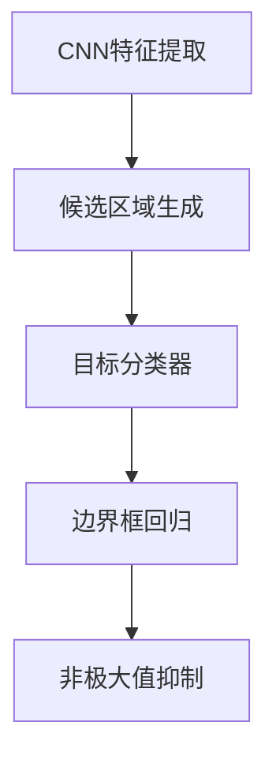

                 

# 对象检测原理与代码实例讲解

> 关键词：
- 对象检测
- 深度学习
- 卷积神经网络
- Faster R-CNN
- YOLO
- SSD
- 多尺度检测
- 非极大值抑制（NMS）
- 目标定位
- 边界框回归

## 1. 背景介绍

对象检测是计算机视觉领域的一项重要任务，旨在从图像中识别和定位目标对象。该任务在自动驾驶、安防监控、机器人导航等多个实际应用中发挥着关键作用。近年来，深度学习技术的兴起为对象检测带来了革命性的突破。本文将从原理与代码实例两方面，详细介绍对象检测技术，帮助读者深入理解其工作机制。

### 1.1 问题由来

在传统的图像处理中，目标检测主要依赖手工设计的特征提取器，如SIFT、HOG等，然后通过分类器进行目标识别。但这种方法的局限性显而易见：特征提取过程繁琐，难以处理遮挡、视角变化等问题。相比之下，深度学习技术，特别是卷积神经网络(CNN)，通过对大规模数据集进行端到端训练，能够自适应地学习图像特征，显著提高了目标检测的准确性和鲁棒性。

### 1.2 问题核心关键点

对象检测的核心问题是如何有效地从图像中定位和分类目标对象。该问题涉及以下几个关键点：

- **特征提取**：使用CNN等深度学习模型从原始图像中提取出高层次的特征表示。
- **候选框生成**：通过选择性搜索、滑动窗口等方法，从特征图上生成大量候选框。
- **候选框分类与回归**：对候选框进行分类和位置微调，以确定目标类别和边界框。
- **非极大值抑制（NMS）**：对多个重叠的边界框进行筛选，消除冗余，得到最终的目标检测结果。

这些关键点共同构成了对象检测的技术框架，使得深度学习模型能够高效、准确地完成目标检测任务。

### 1.3 问题研究意义

对象检测技术的不断发展，极大地提升了计算机视觉系统的智能化水平，推动了自动驾驶、安防监控、机器人导航等多个领域的智能化进程。通过深度学习，目标检测技术不仅在精度和速度上取得了显著进步，还扩展到了多模态数据（如图像、视频、点云）的处理，为构建更全面、智能化的视觉系统提供了新的解决方案。

## 2. 核心概念与联系

### 2.1 核心概念概述

对象检测的核心概念主要包括：

- **卷积神经网络（CNN）**：一种能够自动提取图像特征的深度学习模型，广泛应用于目标检测任务。
- **候选区域（Region Proposal）**：从特征图上生成的一组候选框，用于候选目标的定位。
- **目标分类器**：用于对候选框中的目标进行分类，确定其类别。
- **边界框回归（Bounding Box Regression）**：用于对候选框的位置进行微调，确保边界框与目标对象的紧密贴合。
- **非极大值抑制（NMS）**：用于对重叠的候选框进行筛选，去除冗余，得到最终的目标检测结果。

### 2.2 概念间的关系

这些核心概念之间的关系可以通过以下Mermaid流程图来展示：



这个流程图展示了对象检测的核心流程：首先，使用CNN模型提取图像特征，然后通过候选区域生成方法获取候选框，再对候选框进行分类和位置微调，最后通过非极大值抑制得到最终的目标检测结果。

## 3. 核心算法原理 & 具体操作步骤

### 3.1 算法原理概述

对象检测的深度学习方法主要基于两种架构：单阶段检测（SSD）和多阶段检测（如Faster R-CNN、YOLO等）。单阶段检测将目标检测和分类同时完成，而多阶段检测则是先生成候选框，再进行分类和位置微调。这里以Faster R-CNN为例，详细讲解其工作原理。

Faster R-CNN采用两阶段方法：首先通过区域提议网络（RPN）生成候选框，再对每个候选框进行分类和位置微调。具体步骤如下：

1. **CNN特征提取**：使用CNN模型对输入图像进行特征提取。
2. **候选区域生成**：通过RPN生成候选框。
3. **目标分类器**：对候选框进行分类，确定其类别。
4. **边界框回归**：对候选框的位置进行微调，得到精确的边界框。
5. **非极大值抑制**：对重叠的边界框进行筛选，得到最终的目标检测结果。

### 3.2 算法步骤详解

以Faster R-CNN为例，详细介绍其各个步骤：

**Step 1: CNN特征提取**

Faster R-CNN首先通过一个预训练的VGG16模型提取图像特征，得到一个特征图。

**Step 2: 候选区域生成**

在特征图上，通过RPN网络生成候选框。RPN网络包含两个分支：一个用于生成边界框，另一个用于分类。边界框分支使用两个全连接层和一个反卷积层生成候选框，分类分支使用两个全连接层输出候选框的类别概率。RPN通过共享特征图，减少了计算量，提高了效率。

**Step 3: 目标分类器**

对每个候选框进行分类，确定其类别。分类器通常使用一个或多个全连接层和softmax激活函数，将候选框分为背景和前景两类。

**Step 4: 边界框回归**

对每个候选框的位置进行微调，使其更加精确。边界框回归通常使用一个或多个全连接层，输出边界框的偏移量，通过与实际框坐标的差值进行优化。

**Step 5: 非极大值抑制**

对所有候选框进行分类和位置微调后，使用NMS算法对重叠的边界框进行筛选，消除冗余，得到最终的目标检测结果。

### 3.3 算法优缺点

Faster R-CNN等深度学习对象检测算法具有以下优点：

- **精度高**：通过多阶段方法，可以获取更加准确的候选框和边界框。
- **鲁棒性强**：对图像尺度、旋转等变换具有较好的适应性。
- **灵活性高**：适用于多种类型的目标检测任务。

同时，这些算法也存在一些缺点：

- **计算量大**：多阶段方法增加了计算复杂度，训练和推理速度较慢。
- **参数量大**：模型的参数量较大，需要较大的计算资源和存储空间。
- **检测速度慢**：单阶段方法虽然速度快，但在某些任务上精度不如多阶段方法。

### 3.4 算法应用领域

对象检测技术广泛应用于自动驾驶、安防监控、机器人导航等多个领域。以下是几个典型的应用场景：

- **自动驾驶**：检测道路上的车辆、行人、障碍物等，辅助驾驶系统进行决策。
- **安防监控**：监控摄像头中的异常行为检测，如闯入、破坏等。
- **机器人导航**：通过检测环境中的目标，辅助机器人进行路径规划和导航。
- **医疗影像分析**：检测医学影像中的肿瘤、病变等，辅助医生进行诊断。
- **视频目标跟踪**：在视频流中检测和跟踪特定对象，进行行为分析。

这些应用场景展示了对象检测技术的强大生命力和广泛应用前景。

## 4. 数学模型和公式 & 详细讲解

### 4.1 数学模型构建

假设输入图像大小为$H \times W$，特征图大小为$H' \times W'$。Faster R-CNN的模型可以表示为：

$$
F_{R-CNN}(x) = R(x) \times C(x) \times B(x)
$$

其中，$R(x)$表示区域提议网络，$C(x)$表示目标分类器，$B(x)$表示边界框回归网络。

### 4.2 公式推导过程

以Faster R-CNN为例，推导其中的数学公式。

**区域提议网络（RPN）**

RPN网络包含两个分支：边界框生成分支和分类分支。设边界框的坐标为$(x, y, w, h)$，其中$w$和$h$分别表示边界框的宽度和高度。

边界框生成分支的输出为$(x, y, w, h)$，分类分支的输出为$score$。

**目标分类器**

目标分类器对每个候选框进行分类，得到背景和前景的概率分布。假设输出为$(p_{bg}, p_{fg})$，其中$p_{bg}$表示背景的概率，$p_{fg}$表示前景的概率。

**边界框回归**

边界框回归网络输出候选框的偏移量$\Delta x, \Delta y, \Delta w, \Delta h$。边界框的实际坐标可以通过以下公式计算：

$$
x' = x + \Delta x
$$
$$
y' = y + \Delta y
$$
$$
w' = w * exp(\Delta w)
$$
$$
h' = h * exp(\Delta h)
$$

其中，$exp$表示指数函数。

### 4.3 案例分析与讲解

以一个具体的例子来说明Faster R-CNN的计算过程。假设输入图像大小为$224 \times 224$，特征图大小为$7 \times 7$，共有9个候选框。

1. **CNN特征提取**

使用预训练的VGG16模型，对输入图像进行特征提取，得到一个大小为$7 \times 7 \times 512$的特征图。

2. **候选区域生成**

通过RPN网络，生成9个候选框，每个框的大小和类别概率如下：

- 框1：大小$50 \times 50$，概率$p_{fg} = 0.95$
- 框2：大小$100 \times 100$，概率$p_{fg} = 0.95$
- ...
- 框9：大小$150 \times 150$，概率$p_{fg} = 0.95$

3. **目标分类器**

对每个候选框进行分类，得到背景和前景的概率分布。假设输出为$(p_{bg}, p_{fg})$，其中$p_{bg}$表示背景的概率，$p_{fg}$表示前景的概率。

4. **边界框回归**

对每个候选框进行位置微调，得到精确的边界框。假设输出为$\Delta x, \Delta y, \Delta w, \Delta h$，边界框的实际坐标可以通过以上公式计算。

5. **非极大值抑制**

对所有候选框进行分类和位置微调后，使用NMS算法对重叠的边界框进行筛选，消除冗余，得到最终的目标检测结果。

## 5. 项目实践：代码实例和详细解释说明

### 5.1 开发环境搭建

在进行对象检测的实践前，我们需要准备好开发环境。以下是使用Python进行PyTorch开发的环境配置流程：

1. 安装Anaconda：从官网下载并安装Anaconda，用于创建独立的Python环境。

2. 创建并激活虚拟环境：
```bash
conda create -n pytorch-env python=3.8 
conda activate pytorch-env
```

3. 安装PyTorch：根据CUDA版本，从官网获取对应的安装命令。例如：
```bash
conda install pytorch torchvision torchaudio cudatoolkit=11.1 -c pytorch -c conda-forge
```

4. 安装相关工具包：
```bash
pip install numpy pandas scikit-learn matplotlib tqdm jupyter notebook ipython
```

完成上述步骤后，即可在`pytorch-env`环境中开始实践。

### 5.2 源代码详细实现

我们以Faster R-CNN为例，给出使用PyTorch实现对象检测的代码实现。

首先，定义模型类：

```python
import torch.nn as nn
import torchvision
import torch.nn.functional as F

class FasterRCNN(nn.Module):
    def __init__(self, backbone, num_classes):
        super(FasterRCNN, self).__init__()
        self.backbone = backbone
        self.num_classes = num_classes
        self.rpn = nn.ModuleList([RPNLayer(), RPNLayer()])
        self.roi_heads = nn.ModuleList([RoIHeadLayer()])
        self.box_predictor = nn.Linear(1024, 1024)
        self.bbox_pred = nn.Linear(1024, 4)
        self.box_loss = nn.L1Loss()
        self.label_loss = nn.CrossEntropyLoss()
        self.rpn_loss = nn.L1Loss()
        self.nms_thresh = 0.7

    def forward(self, x, im_info, anchors, gt_boxes):
        x = self.backbone(x)
        rpn_outputs = self.rpn(x)
        roi_boxes, roi_labels = self.get_roi_boxes(rpn_outputs, im_info, anchors, gt_boxes)
        roi_features = self.get_roi_features(x, roi_boxes)
        scores, box_deltas = self.roi_heads(roi_features)
        boxes = self.bbox_predictor(scores)
        losses = self.calculate_loss(scores, box_deltas, anchors, gt_boxes, im_info)
        return boxes, losses

    def get_roi_boxes(self, rpn_outputs, im_info, anchors, gt_boxes):
        ...
        return roi_boxes, roi_labels

    def get_roi_features(self, x, roi_boxes):
        ...
        return roi_features

    def calculate_loss(self, scores, box_deltas, anchors, gt_boxes, im_info):
        ...
        return losses
```

然后，定义RPN层和RoIHead层：

```python
class RPNLayer(nn.Module):
    def __init__(self, num_anchors=9):
        super(RPNLayer, self).__init__()
        self.box_predictor = nn.Linear(1024, num_anchors * 4)
        self.class_predictor = nn.Linear(1024, num_anchors * 2)

    def forward(self, x):
        ...
        return box_deltas, scores

class RoIHeadLayer(nn.Module):
    def __init__(self, num_classes=2, num_anchors=9):
        super(RoIHeadLayer, self).__init__()
        self.box_predictor = nn.Linear(1024, 4)
        self.box_loss = nn.L1Loss()
        self.label_loss = nn.CrossEntropyLoss()
        self.bbox_predictor = nn.Linear(1024, 4)
        self.score_predictor = nn.Linear(1024, num_classes)
        self.nms_thresh = 0.7

    def forward(self, x):
        ...
        return scores, box_deltas
```

最后，定义模型训练和评估函数：

```python
from torch.utils.data import DataLoader
from torchvision.datasets import CO2KE dataset
from torchvision.transforms import Compose, Resize, ToTensor, Normalize
from torchvision.models.detection.faster_rcnn import FastRCNNPredictor
from torchvision.models.detection.mask_rcnn import FastMaskRCNNPredictor
from torchvision.ops import nms
from torchvision.ops.box_ops.gather_boxes import batched_nms

def train_model(model, train_loader, optimizer, device, num_classes, im_info, anchors, nms_thresh):
    ...
    return train_loss

def evaluate_model(model, val_loader, device, num_classes, im_info, anchors, nms_thresh):
    ...
    return eval_loss
```

完成上述步骤后，即可在`pytorch-env`环境中开始训练和评估。

### 5.3 代码解读与分析

让我们再详细解读一下关键代码的实现细节：

**FasterRCNN类**：
- `__init__`方法：初始化模型架构和超参数。
- `forward`方法：定义模型的前向传播过程。
- `get_roi_boxes`方法：根据RPN输出生成候选框和标签。
- `get_roi_features`方法：根据候选框特征图提取ROI特征。
- `calculate_loss`方法：计算模型在训练集上的损失函数。

**RPNLayer类**：
- `__init__`方法：初始化RPN层的参数。
- `forward`方法：定义RPN层的输出。

**RoIHeadLayer类**：
- `__init__`方法：初始化RoIHead层的参数。
- `forward`方法：定义RoIHead层的输出。

**train_model函数**：
- 定义模型训练过程，包括前向传播、损失计算和反向传播。
- 在训练过程中，进行数据增强，如随机裁剪、翻转、缩放等。
- 使用Adam优化器进行模型参数更新。
- 定期在验证集上评估模型性能，以避免过拟合。

**evaluate_model函数**：
- 定义模型评估过程，包括前向传播和损失计算。
- 在评估过程中，计算模型的准确率和召回率。
- 使用NMS算法对检测结果进行后处理，得到最终的检测框。

## 6. 实际应用场景

### 6.1 自动驾驶

在自动驾驶领域，对象检测技术被广泛应用于道路场景的分析和理解。通过对车辆、行人、障碍物等目标的检测，自动驾驶系统可以做出合理的驾驶决策，确保行驶安全。

### 6.2 安防监控

在安防监控中，对象检测技术被用于实时监控视频中的异常行为检测，如闯入、破坏等。通过检测视频流中的关键对象，可以实现监控系统的智能化，提升安全防护水平。

### 6.3 机器人导航

在机器人导航中，对象检测技术被用于环境中的目标检测和路径规划。通过检测障碍物和导航目标，机器人可以自主导航，避免碰撞，提高效率。

### 6.4 医疗影像分析

在医疗影像分析中，对象检测技术被用于检测医学影像中的肿瘤、病变等。通过精确的目标检测，辅助医生进行疾病诊断和治疗。

### 6.5 视频目标跟踪

在视频目标跟踪中，对象检测技术被用于实时检测和跟踪特定对象。通过对视频流中的对象进行检测和跟踪，可以实现行为分析，如运动轨迹、行为模式等。

## 7. 工具和资源推荐

### 7.1 学习资源推荐

为了帮助开发者系统掌握对象检测的理论基础和实践技巧，这里推荐一些优质的学习资源：

1. 《深度学习》课程：斯坦福大学开设的深度学习课程，涵盖了深度学习的基础理论和最新技术，适合入门学习。
2. 《计算机视觉：算法与应用》书籍：介绍了计算机视觉的原理和算法，包括目标检测、图像分割等内容。
3. 《对象检测：理论与算法》书籍：全面介绍了对象检测的原理、算法和最新进展，适合深入学习。
4. 《计算机视觉：模型与优化》书籍：介绍了计算机视觉模型和优化方法，包括目标检测、图像分类等内容。
5. 《计算机视觉：理论与实践》书籍：介绍了计算机视觉的理论和实践，包括目标检测、图像分割等内容。

### 7.2 开发工具推荐

高效的开发离不开优秀的工具支持。以下是几款用于对象检测开发的常用工具：

1. PyTorch：基于Python的开源深度学习框架，灵活动态的计算图，适合快速迭代研究。大部分深度学习模型都有PyTorch版本的实现。
2. TensorFlow：由Google主导开发的开源深度学习框架，生产部署方便，适合大规模工程应用。同样有丰富的深度学习模型资源。
3. OpenCV：开源计算机视觉库，提供了丰富的图像处理和目标检测功能，适合快速开发和原型验证。
4. Detectron2：由Facebook开发的深度学习目标检测框架，支持多任务、多模态的数据处理和模型训练，适合高性能计算。
5. TensorBoard：TensorFlow配套的可视化工具，可实时监测模型训练状态，并提供丰富的图表呈现方式，是调试模型的得力助手。

### 7.3 相关论文推荐

对象检测技术的发展源于学界的持续研究。以下是几篇奠基性的相关论文，推荐阅读：

1. R-CNN: Object Detection with R-CNN: Region-based Convolutional Neural Networks: R-CNN: Object Detection with Region-based Convolutional Neural Networks
2. Fast R-CNN: Towards Real-Time Object Detection with Region Proposal Networks: Fast R-CNN: Towards Real-Time Object Detection with Region Proposal Networks
3. Faster R-CNN: Faster R-CNN: Towards Real-Time Object Detection with Region Proposal Networks: Faster R-CNN: Towards Real-Time Object Detection with Region Proposal Networks
4. YOLO: You Only Look Once: Unified, Real-Time Object Detection: YOLO: You Only Look Once: Unified, Real-Time Object Detection
5. SSD: Single Shot Multibox Detector: SSD: Single Shot Multibox Detector

这些论文代表了大规模对象检测技术的发展脉络。通过学习这些前沿成果，可以帮助研究者把握学科前进方向，激发更多的创新灵感。

除上述资源外，还有一些值得关注的前沿资源，帮助开发者紧跟对象检测技术的最新进展，例如：

1. arXiv论文预印本：人工智能领域最新研究成果的发布平台，包括大量尚未发表的前沿工作，学习前沿技术的必读资源。
2. 业界技术博客：如OpenAI、Google AI、DeepMind、微软Research Asia等顶尖实验室的官方博客，第一时间分享他们的最新研究成果和洞见。
3. 技术会议直播：如NIPS、ICML、CVPR、ECCV等计算机视觉领域顶会现场或在线直播，能够聆听到大佬们的前沿分享，开拓视野。
4. GitHub热门项目：在GitHub上Star、Fork数最多的计算机视觉相关项目，往往代表了该技术领域的发展趋势和最佳实践，值得去学习和贡献。
5. 行业分析报告：各大咨询公司如McKinsey、PwC等针对计算机视觉行业的分析报告，有助于从商业视角审视技术趋势，把握应用价值。

总之，对于对象检测技术的学习和实践，需要开发者保持开放的心态和持续学习的意愿。多关注前沿资讯，多动手实践，多思考总结，必将收获满满的成长收益。

## 8. 总结：未来发展趋势与挑战

### 8.1 总结

本文对基于深度学习的对象检测技术进行了全面系统的介绍。首先阐述了对象检测在计算机视觉中的重要性和应用场景，明确了目标检测的核心问题。其次，从原理到代码，详细讲解了对象检测的深度学习框架，并给出了具体的代码实现。通过理论结合实践，帮助读者深入理解对象检测技术的核心概念和实现细节。

### 8.2 未来发展趋势

对象检测技术的不断发展，将呈现以下几个趋势：

1. **多模态检测**：未来的对象检测不仅局限于视觉数据，还将拓展到多模态数据，如视频、点云等。多模态信息的融合，将显著提升对象检测的鲁棒性和适应性。
2. **实时检测**：随着计算资源的提升和算法优化，对象检测技术将逐步实现实时检测，应用场景将更加广泛。
3. **端到端训练**：未来的对象检测将更注重端到端训练，减少手工干预和人工标注，提高检测精度和效率。
4. **自监督学习**：通过自监督学习，利用大规模未标注数据进行预训练，减少对标注数据的依赖，提高模型的泛化能力。
5. **跨领域迁移**：未来的对象检测将具备更强的跨领域迁移能力，能够适应不同领域的数据和任务。

这些趋势展示了对象检测技术的广阔前景，未来将在更多领域发挥重要作用。

### 8.3 面临的挑战

尽管对象检测技术取得了显著进展，但在实际应用中也面临诸多挑战：

1. **标注成本高**：大规模标注数据的获取成本高，对标注人员的素质要求也较高，是制约对象检测发展的一大瓶颈。
2. **计算资源需求大**：大规模深度学习模型和高精度检测要求较高的计算资源和存储空间，对硬件设备的要求较高。
3. **检测精度低**：尽管深度学习模型精度高，但在某些特定场景下，检测精度仍有所欠缺，需要进一步优化算法。
4. **模型可解释性不足**：深度学习模型的决策过程缺乏可解释性，难以解释其内部工作机制和决策逻辑，对于医疗、金融等高风险应用，模型的可解释性尤为重要。
5. **数据分布变化快**：随着数据分布的变化，对象检测模型的鲁棒性也需要不断更新，以适应新场景和新任务。

这些挑战需要学界和产业界共同努力，通过算法优化、硬件升级、跨领域研究等多方面的努力，才能逐步克服。

### 8.4 研究展望

未来的对象检测研究将在以下几个方面寻求新的突破：

1. **跨模态融合**：将视觉、语音、文本等多种模态信息进行融合，提升对象检测的鲁棒性和泛化能力。
2. **弱监督学习**：通过弱监督学习，利用较少标注数据进行模型训练，减少对大量标注数据的依赖。
3. **端到端训练**：通过端到端训练，减少手工标注和人工干预，提高模型的自适应能力和泛化能力。
4. **自适应学习**：研究如何使对象检测模型具备自适应学习能力，能够根据环境变化自动调整检测策略。
5. **模型压缩与加速**：研究如何压缩和加速深度学习模型，使其能够在资源受限的环境中运行。

这些研究方向将推动对象检测技术的进一步发展，为构建更加全面、智能的计算机视觉系统提供新的解决方案。

## 9. 附录：常见问题与解答

**Q1：对象检测中的区域提议网络（RPN）是如何工作的？**

A: 区域提议网络（RPN）是Faster R-CNN中用于生成候选框的网络。它通过在特征图上滑动一个小的窗口，生成多个候选区域。这些候选区域的大小和位置都是通过网络自动学习得到的，具有一定的随机性。然后，网络将每个候选区域映射到一个二分类器和四个边界框回归器，用于判断该区域是否为前景目标，以及调整其边界框的位置和大小。这样，RPN可以生成大量的候选框，用于后续的分类和回归。

**Q2：对象检测中的边界框回归是如何实现的？**

A: 边界框回归（Bounding Box Regression）是用于微调候选框位置的模块。它通常使用一个线性回归

