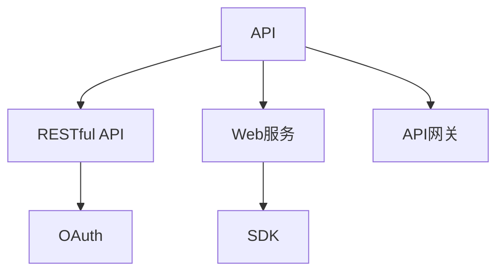
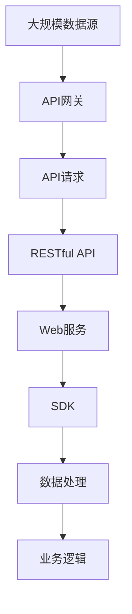

                 

# 工具：调用外部 API 获取额外信息

> 关键词：API调用, 数据获取, 信息检索, 实时数据, 网络爬虫

## 1. 背景介绍

### 1.1 问题由来

在数据驱动的智能系统中，获取准确、及时、全面的数据信息至关重要。然而，数据通常分散在不同的数据源和格式中，手动收集和整理不仅耗时耗力，还容易引入数据偏差和缺失。为了提高数据获取的效率和质量，现代系统越来越多地采用自动化手段，如数据爬虫和 API 调用，来快速获取和整合信息。

API（Application Programming Interface）是应用程序间交互的标准接口，使得不同的软件系统能够透明地交换信息。通过调用外部 API，系统可以轻松获取结构化数据、服务接口等附加信息，实现数据的无缝集成和应用。

### 1.2 问题核心关键点

API调用是数据获取的常用方式，其核心在于以下几点：

- **API选择**：根据具体需求选择合适的API接口，确保数据来源可靠、数据格式符合需求。
- **参数设置**：正确设置API参数，包括查询条件、返回字段、分页大小等，以获得最相关和有用的数据。
- **异常处理**：合理处理API调用中可能出现的错误和异常，确保系统稳定运行。
- **效率优化**：通过并行调用、缓存机制、负载均衡等策略提升API调用的效率，减少延迟。
- **数据整合**：将不同API获取的数据进行有效的整合和分析，为后续应用提供坚实的数据基础。

### 1.3 问题研究意义

API调用技术在现代数据驱动系统中扮演着越来越重要的角色。通过API调用，系统可以快速访问外部数据源，实现数据的实时更新和动态获取，支持复杂的业务逻辑和智能决策。具体而言：

- 节省人力成本。自动化数据收集减少了人工操作，提高工作效率。
- 提升数据质量。通过API调用获取的数据通常结构化、标准化，更可靠和准确。
- 加速应用开发。API接口提供的数据可直接用于系统开发，减少数据预处理和清洗的工作量。
- 扩展应用场景。API调用支持跨地域、跨系统的数据交换，拓展应用范围和功能。

## 2. 核心概念与联系

### 2.1 核心概念概述

为了更好地理解API调用的原理和应用，本节将介绍几个密切相关的核心概念：

- **API（Application Programming Interface）**：应用程序接口，定义了应用程序如何交互的方式。
- **RESTful API**：基于REST架构风格的API，使用HTTP协议，通过URL和HTTP方法（GET、POST、PUT、DELETE等）进行通信。
- **Web服务（Web Service）**：一种部署在Web上的服务，通过标准协议和接口访问。
- **SDK（Software Development Kit）**：软件开发工具包，提供了一组API和工具，用于快速开发应用程序。
- **OAuth**：开放授权协议，用于授权第三方应用程序访问用户数据。
- **API网关**：集中管理和路由API请求的服务，提高API调用的安全性和可靠性。

这些概念之间通过一个简单的Mermaid流程图来展示它们的关系：



这个流程图展示了API调用中的关键组件及其相互关系：

1. **API**：定义了应用程序的交互规则。
2. **RESTful API**：基于HTTP协议的API，具有可扩展性和灵活性。
3. **Web服务**：部署在Web上的服务，通过标准协议和接口提供数据和功能。
4. **SDK**：开发工具包，提供API访问和管理。
5. **OAuth**：授权协议，确保数据访问的安全性。
6. **API网关**：管理和路由API请求，提升系统可靠性。

### 2.2 概念间的关系

这些核心概念之间存在着紧密的联系，形成了API调用的完整生态系统。

- **API和RESTful API**：API定义了接口规范，而RESTful API则具体实现了这些规范，通过HTTP协议进行通信。
- **Web服务和API**：Web服务提供数据和服务，API提供对数据和服务的高效访问。
- **SDK和API**：SDK封装了API的调用和操作，提供便捷的开发接口。
- **OAuth和API**：OAuth提供授权机制，保护API调用的安全性。
- **API网关和API**：API网关集中管理和路由API请求，提高API调用的效率和安全性。

### 2.3 核心概念的整体架构

最后，我们用一个综合的流程图来展示这些核心概念在大规模API调用中的整体架构：



这个综合流程图展示了API调用的完整流程：

1. **大规模数据源**：API调用所需的数据来源。
2. **API网关**：集中管理和路由API请求。
3. **API请求**：系统向API网关发送的请求。
4. **RESTful API**：响应API请求的数据接口。
5. **Web服务**：提供数据和服务的服务端。
6. **SDK**：封装API调用的开发工具包。
7. **数据处理**：对获取的数据进行处理和清洗。
8. **业务逻辑**：基于处理后的数据进行业务计算和决策。

## 3. 核心算法原理 & 具体操作步骤
### 3.1 算法原理概述

API调用是基于HTTP协议的数据获取技术，其核心在于通过URL和HTTP方法进行数据请求和响应。API调用的过程包括：

1. **构建请求URL**：根据API文档，构建包含所有必要参数的URL。
2. **发送HTTP请求**：使用HTTP客户端发送GET或POST请求，请求数据。
3. **处理响应数据**：解析HTTP响应，获取数据。
4. **数据整合与处理**：将获取的数据进行整合和处理，形成有用信息。

API调用的关键在于选择合适的API接口，正确设置参数，处理异常和错误，以及优化效率。

### 3.2 算法步骤详解

#### 3.2.1 构建请求URL

API请求的第一步是构建请求URL。URL通常包含以下几个部分：

- **API基地址**：API调用的主要地址，如`https://api.example.com`。
- **路径和资源**：具体请求的API资源路径，如`/users`、`/products`等。
- **查询参数**：传递的附加参数，如`?limit=10`、`&sort=asc`等。
- **请求体（请求参数）**：包含请求的具体数据，通常用于POST请求。

构建请求URL的一般步骤如下：

1. 确定API基地址和资源路径。
2. 添加必要的查询参数和请求体。
3. 格式化URL，确保符合API文档的规范。

#### 3.2.2 发送HTTP请求

API请求的第二步是发送HTTP请求。常见的HTTP请求方法包括GET、POST、PUT、DELETE等。

发送HTTP请求的基本步骤如下：

1. 使用HTTP客户端库（如requests）发送请求。
2. 设置请求头，包括Content-Type、Authorization等。
3. 发送请求并获取响应。

#### 3.2.3 处理响应数据

API请求的第三步是处理响应数据。HTTP响应通常包含以下几个部分：

- **响应状态码**：HTTP状态码，如200表示成功，404表示未找到资源。
- **响应头**：HTTP头部信息，包含API版本、内容类型等。
- **响应体**：API返回的具体数据，通常是JSON或XML格式。

处理响应数据的基本步骤如下：

1. 解析HTTP响应状态码和头部信息。
2. 解析响应体，获取具体的数据。
3. 处理异常和错误，如超时、网络错误等。

#### 3.2.4 数据整合与处理

API请求的第四步是数据整合与处理。获取的数据通常需要进一步清洗和处理，形成有用的信息。

数据整合与处理的基本步骤如下：

1. 将多个API获取的数据合并。
2. 清洗和处理数据，去除重复和无效数据。
3. 进行数据转换和格式化，为后续应用提供合适的数据格式。

### 3.3 算法优缺点

API调用技术具有以下优点：

- **高效性**：通过网络请求快速获取数据，避免手动收集和整理数据。
- **灵活性**：支持多种数据格式和多种HTTP方法，适用于不同场景和需求。
- **可扩展性**：支持跨地域、跨系统的数据交换，支持大规模数据获取。

同时，API调用也存在一些缺点：

- **依赖外部服务**：API调用需要依赖外部服务，服务不可用或故障时会影响系统。
- **数据隐私和安全**：API调用可能涉及敏感数据，需要合理设置权限和授权机制。
- **延迟和网络问题**：网络延迟和网络问题可能导致API调用失败或数据延迟。

### 3.4 算法应用领域

API调用技术广泛应用于各种数据驱动的智能系统中，具体包括：

- **金融系统**：获取实时市场数据、交易记录等，支持金融分析和决策。
- **电商系统**：获取商品信息、用户评价等，支持商品推荐和用户画像。
- **社交媒体**：获取用户动态、评论等，支持舆情分析和情感分析。
- **物流系统**：获取货物追踪、配送状态等，支持物流监控和路径规划。
- **智慧城市**：获取交通流量、环境数据等，支持城市管理和公共服务。

API调用技术的应用领域非常广泛，涵盖金融、电商、社交、物流、城市管理等多个领域，为智能系统的构建提供了强大的数据支持。

## 4. 数学模型和公式 & 详细讲解 & 举例说明

### 4.1 数学模型构建

API调用技术不需要构建复杂的数学模型，其主要依赖于HTTP协议和API文档的规范。然而，为了更好地理解API调用的效率和性能，我们可以使用简单的数学模型来描述API调用的过程。

假设API调用的总时间由以下几个部分组成：

- **构建请求URL的时间**：设为 $t_{url}$。
- **发送HTTP请求的时间**：设为 $t_{request}$。
- **处理响应数据的时间**：设为 $t_{response}$。
- **数据整合与处理的时间**：设为 $t_{data}$。

则API调用的总时间 $T$ 可以表示为：

$$
T = t_{url} + t_{request} + t_{response} + t_{data}
$$

### 4.2 公式推导过程

API调用的效率优化可以通过以下几个步骤进行推导：

1. **最小化构建请求URL的时间**：确保URL构建简洁明了，避免不必要的参数。
2. **最小化发送HTTP请求的时间**：使用缓存、并发请求等技术减少延迟。
3. **最小化处理响应数据的时间**：优化数据解析和处理算法，减少处理时间。
4. **最小化数据整合与处理的时间**：使用高效的数据清洗和处理工具，减少处理时间。

优化API调用的总时间 $T$，通常需要通过以下策略：

- **URL简化**：去除冗余的参数和路径，减少构建URL的时间。
- **请求缓存**：使用缓存技术，重复利用已请求的数据。
- **并发请求**：使用并行请求技术，同时获取多个API数据。
- **数据压缩**：使用压缩技术减少数据传输量，提升数据传输速度。
- **数据标准化**：使用标准化的数据格式，减少数据处理时间。

### 4.3 案例分析与讲解

以获取实时股票价格数据为例，分析API调用的效率优化。

假设API的基地址为 `https://api.example.com`，资源路径为 `/ticker`，查询参数为 `?symbol=AAPL`，请求体为空。

构建请求URL的时间为 $t_{url} = 0.1$ 秒。

发送HTTP请求的时间为 $t_{request} = 0.5$ 秒。

处理响应数据的时间为 $t_{response} = 0.2$ 秒。

数据整合与处理的时间为 $t_{data} = 0.3$ 秒。

则API调用的总时间为：

$$
T = 0.1 + 0.5 + 0.2 + 0.3 = 1.1 \text{秒}
$$

为了提升效率，可以采取以下优化策略：

- **URL简化**：去掉查询参数，简化URL构建。
- **请求缓存**：对已请求的数据进行缓存，重复利用。
- **并发请求**：同时请求多个股票的数据，减少等待时间。
- **数据压缩**：使用压缩技术减少数据传输量。
- **数据标准化**：使用标准化的数据格式，减少处理时间。

通过以上优化策略，可以显著提升API调用的效率，减少总时间 $T$。

## 5. 项目实践：代码实例和详细解释说明

### 5.1 开发环境搭建

为了进行API调用实践，我们需要准备好开发环境。以下是使用Python进行API调用的环境配置流程：

1. 安装Anaconda：从官网下载并安装Anaconda，用于创建独立的Python环境。

2. 创建并激活虚拟环境：
```bash
conda create -n api-env python=3.8 
conda activate api-env
```

3. 安装requests库：
```bash
pip install requests
```

完成上述步骤后，即可在`api-env`环境中开始API调用实践。

### 5.2 源代码详细实现

下面以获取实时股票价格数据为例，给出使用Python进行API调用的完整代码实现。

首先，定义API请求函数：

```python
import requests

def get_stock_price(symbol, api_key):
    url = f'https://api.example.com/ticker?symbol={symbol}&api_key={api_key}'
    response = requests.get(url)
    if response.status_code == 200:
        return response.json()
    else:
        return None
```

然后，使用该函数获取指定股票的实时价格：

```python
api_key = 'YOUR_API_KEY'
symbol = 'AAPL'

response = get_stock_price(symbol, api_key)
if response:
    print(f'The current price of {symbol} is {response["price"]}')
else:
    print(f'Failed to get the stock price of {symbol}')
```

这段代码首先定义了一个名为`get_stock_price`的函数，该函数接受股票代码和API密钥作为参数，构建请求URL并发送HTTP GET请求。如果请求成功，返回JSON格式的数据；否则返回None。

接下来，使用该函数获取指定股票的实时价格。如果获取成功，打印股票的当前价格；否则打印获取失败的信息。

### 5.3 代码解读与分析

让我们再详细解读一下关键代码的实现细节：

**get_stock_price函数**：
- 该函数接受两个参数：股票代码（symbol）和API密钥（api_key）。
- 构建API请求URL，包括股票代码、API密钥等参数。
- 使用requests库发送HTTP GET请求，获取响应数据。
- 检查响应状态码是否为200，表示请求成功。
- 如果请求成功，返回JSON格式的数据；否则返回None。

**API调用实践代码**：
- 使用API密钥和股票代码调用`get_stock_price`函数，获取股票的实时价格。
- 如果获取成功，打印股票的当前价格；否则打印获取失败的信息。

**代码分析**：
- 该代码实现了一个基本的API调用功能，通过构建请求URL和发送HTTP GET请求获取数据。
- 使用requests库简化了API调用的过程，支持多种HTTP方法。
- 通过检查响应状态码，确保API调用的稳定性。
- 数据获取后直接打印输出，处理过程简单明了。

### 5.4 运行结果展示

假设我们在获取AAPL股票的实时价格时，API调用成功，得到如下JSON格式的数据：

```json
{
    "symbol": "AAPL",
    "price": 157.42
}
```

则打印输出为：

```
The current price of AAPL is 157.42
```

这表示AAPL股票的当前价格为157.42美元。

可以看到，通过使用API调用技术，我们可以快速获取实时股票价格数据，为金融分析、投资决策等提供实时支持。

## 6. 实际应用场景

### 6.1 智能推荐系统

智能推荐系统需要获取大量的用户行为数据和商品信息，通过分析这些数据为用户推荐个性化的商品。API调用技术可以高效获取这些数据，为推荐系统提供坚实的数据基础。

具体而言，推荐系统可以通过API调用获取：

- **用户行为数据**：如浏览记录、点击记录、购买记录等。
- **商品信息**：如商品名称、价格、类别、评价等。
- **用户画像**：如年龄、性别、兴趣爱好等。

通过API调用，推荐系统可以实时获取最新的数据信息，动态更新推荐结果，提升推荐的准确性和个性化程度。

### 6.2 自然语言处理系统

自然语言处理系统需要获取大量的文本数据，通过分析这些数据进行文本分类、情感分析、意图识别等任务。API调用技术可以高效获取这些数据，为NLP系统提供实时支持。

具体而言，NLP系统可以通过API调用获取：

- **文本数据**：如新闻、评论、社交媒体等。
- **实体识别**：如人名、地名、机构名等。
- **情感分析**：如文本的正负情感、情感极性等。
- **意图识别**：如用户输入的意图和需求。

通过API调用，NLP系统可以实时获取最新的文本数据，动态更新模型参数，提升处理效果和系统效率。

### 6.3 智能客服系统

智能客服系统需要获取大量的用户咨询记录和FAQ库，通过分析这些数据为用户提供准确的回复。API调用技术可以高效获取这些数据，为客服系统提供实时支持。

具体而言，客服系统可以通过API调用获取：

- **用户咨询记录**：如历史咨询记录、用户画像等。
- **FAQ库**：如常见问题、解答模板等。
- **实时数据**：如市场热点、政策变化等。

通过API调用，客服系统可以实时获取最新的数据信息，动态更新知识库和回复策略，提升服务的准确性和效率。

### 6.4 未来应用展望

随着API调用技术的不断进步，未来API调用的应用场景将更加广泛，功能将更加强大。

- **实时数据处理**：API调用技术可以实时处理海量数据，支持实时分析和决策。
- **跨平台数据集成**：API调用技术支持跨平台数据集成，实现不同系统之间的数据共享。
- **智能自动化**：API调用技术可以与智能自动化工具结合，实现数据的自动化处理和优化。
- **边缘计算**：API调用技术可以与边缘计算结合，实现数据处理和分析的本地化。

总之，API调用技术将在智能系统中的应用前景广阔，为各种数据驱动的应用场景提供强大的数据支持。

## 7. 工具和资源推荐
### 7.1 学习资源推荐

为了帮助开发者系统掌握API调用的理论基础和实践技巧，这里推荐一些优质的学习资源：

1. **《API接口设计与开发》**：详细介绍了API接口的设计规范、开发实践和应用场景。
2. **《RESTful API设计指南》**：介绍了RESTful API的设计原则和最佳实践，提升API调用的效率和可维护性。
3. **《API网关设计》**：介绍了API网关的功能和应用场景，提升API调用的可靠性和安全性。
4. **《Web服务开发与测试》**：介绍了Web服务的设计、开发和测试技术，提升API调用的开发效率和测试质量。
5. **《Python requests库使用手册》**：详细介绍了requests库的使用方法，提升API调用的便捷性和可扩展性。

通过对这些资源的学习实践，相信你一定能够快速掌握API调用的精髓，并用于解决实际的API调用问题。

### 7.2 开发工具推荐

高效的开发离不开优秀的工具支持。以下是几款用于API调用开发的常用工具：

1. **Postman**：功能强大的API开发和测试工具，支持多种HTTP方法和API文档生成。
2. **Swagger**：基于OpenAPI标准的API设计和文档工具，支持API接口的设计和文档生成。
3. **Fiddler**：HTTP请求捕获和调试工具，支持API请求的截获和分析。
4. **JMeter**：基于Java的性能测试工具，支持API调用的性能测试和负载测试。
5. **Kafkacat**：命令行工具，支持Kafka消息队列的API调用和数据流处理。
6. **Prometheus和Grafana**：监控和可视化工具，支持API调用的监控和数据分析。

合理利用这些工具，可以显著提升API调用的开发效率和质量，确保系统的稳定性和可靠性。

### 7.3 相关论文推荐

API调用技术的发展源于学界的持续研究。以下是几篇奠基性的相关论文，推荐阅读：

1. **《RESTful Web服务：架构和演化》**：详细介绍了RESTful Web服务的架构和演变过程，为API调用的设计提供了理论基础。
2. **《API接口设计和实现指南》**：介绍了API接口的设计和实现技术，提升API调用的可扩展性和可维护性。
3. **《Web服务的自动化测试》**：介绍了Web服务的自动化测试技术，提升API调用的测试效率和质量。
4. **《基于API的服务组合》**：介绍了API服务组合的技术和应用场景，提升API调用的灵活性和可扩展性。
5. **《API安全设计》**：介绍了API安全的最佳实践和设计策略，提升API调用的安全性。

这些论文代表了大规模API调用技术的发展脉络。通过学习这些前沿成果，可以帮助研究者把握学科前进方向，激发更多的创新灵感。

除上述资源外，还有一些值得关注的前沿资源，帮助开发者紧跟API调用技术的最新进展，例如：

1. **arXiv论文预印本**：人工智能领域最新研究成果的发布平台，包括大量尚未发表的前沿工作，学习前沿技术的必读资源。
2. **业界技术博客**：如OpenAPI、API网关等领域的顶尖实验室的官方博客，第一时间分享他们的最新研究成果和洞见。
3. **技术会议直播**：如RESTconf、API Stackathon等会议直播，能够聆听到专家们的最新分享，开拓视野。
4. **GitHub热门项目**：在GitHub上Star、Fork数最多的API调用相关项目，往往代表了该技术领域的发展趋势和最佳实践，值得去学习和贡献。
5. **行业分析报告**：各大咨询公司如McKinsey、PwC等针对API调用领域的分析报告，有助于从商业视角审视技术趋势，把握应用价值。

总之，对于API调用技术的学习和实践，需要开发者保持开放的心态和持续学习的意愿。多关注前沿资讯，多动手实践，多思考总结，必将收获满满的成长收益。

## 8. 总结：未来发展趋势与挑战

### 8.1 总结

本文对API调用技术进行了全面系统的介绍。首先阐述了API调用的背景和意义，明确了API调用的核心在于高效获取和整合数据。其次，从原理到实践，详细讲解了API调用的数学模型、算法步骤和实际应用，提供了完整的代码实例。同时，本文还广泛探讨了API调用的实际应用场景和未来展望，展示了API调用技术在智能系统中的应用前景。

通过本文的系统梳理，可以看到，API调用技术在现代数据驱动系统中扮演着越来越重要的角色。API调用的高效性、灵活性和可扩展性使其成为数据获取的首选手段，为智能系统的构建提供了强大的数据支持。

### 8.2 未来发展趋势

展望未来，API调用技术将呈现以下几个发展趋势：

1. **自动化水平提升**：随着智能自动化技术的发展，API调用将更加自动化、智能化，减少人工干预。
2. **边缘计算结合**：API调用将与边缘计算技术结合，实现数据处理的本地化和实时化。
3. **跨平台集成**：API调用将支持跨平台数据集成，实现不同系统之间的数据共享和协同。
4. **微服务架构**：API调用将与微服务架构结合，提升系统的可扩展性和可维护性。
5. **API网关优化**：API网关将更加高效、可靠，支持更多的API协议和数据格式。

以上趋势凸显了API调用技术的广阔前景。这些方向的探索发展，将进一步提升API调用的效率和质量，为智能系统的构建提供更加坚实的技术基础。

### 8.3 面临的挑战

尽管API调用技术已经取得了显著进展，但在迈向更加智能化、普适化应用的过程中，它仍面临诸多挑战：

1. **API接口的复杂性**：随着API接口的复杂度增加，API调用变得更加困难。需要合理设计API接口，简化调用过程。
2. **数据隐私和安全**：API调用可能涉及敏感数据，需要合理设置权限和授权机制。
3. **网络延迟和故障**：网络延迟和故障可能导致API调用失败或数据延迟。需要优化网络传输和错误处理机制。
4. **API调用量的管理**：API调用量的增加可能导致系统负载过高，影响系统性能。需要合理设置调用频率和并发限制。
5. **数据格式的多样性**：不同API的数据格式可能不同，需要合理解析和转换数据格式。

这些挑战需要通过持续的技术改进和优化来解决，确保API调用的稳定性和可靠性。

### 8.4 研究展望

面对API调用所面临的种种挑战，未来的研究需要在以下几个方面寻求新的突破：

1. **API接口的标准化**：制定API接口的标准化规范，简化API调用的设计和实现。
2. **API调用的自动化**：开发自动化工具和框架，提升API调用的自动化水平。
3. **API调用的缓存**：使用缓存

