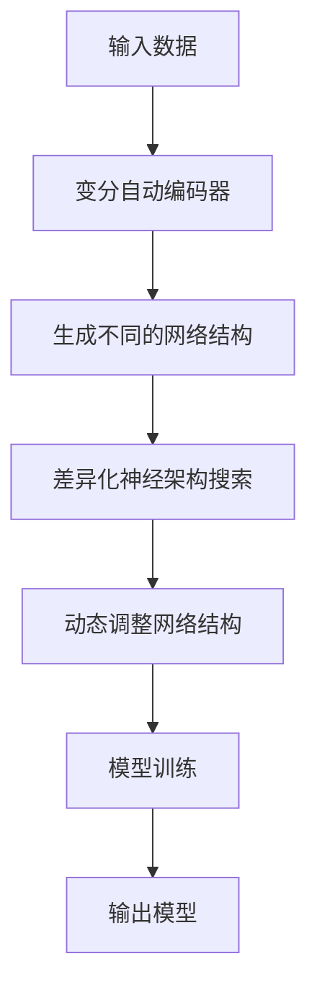

                 

# 差异化神经架构搜索：适应多样化任务

> 关键词：神经架构搜索,模型差异化,适应性,变分自动编码,迁移学习

## 1. 背景介绍

在深度学习领域，神经架构搜索(NAS)已经成为了一种重要的技术手段，用于自动地设计出具有更好性能的模型架构。然而，尽管NAS能够产生高质量的模型，但这些模型往往是一刀切、通用的，难以应对多样化的任务需求。在实际应用中，一个通用的模型无法保证在各种不同的任务上都能获得最佳的性能，也无法充分利用领域特定的知识。

为了克服这一问题，本文将聚焦于**差异化神经架构搜索**（Differentiable Neural Architecture Search，简称DNAS）技术，探讨如何通过差异化的架构设计，使模型能够更好地适应不同的任务需求。文章首先介绍差异化神经架构搜索的基本概念，然后深入分析其原理和操作步骤，并结合具体案例进行讲解。最后，我们将讨论差异化神经架构搜索的实际应用场景和未来发展趋势。

## 2. 核心概念与联系

### 2.1 核心概念概述

为了更好地理解差异化神经架构搜索，我们首先需要介绍几个核心概念：

1. **神经架构搜索**：一种通过算法自动寻找最优神经网络结构的技术。传统的神经架构搜索通常使用搜索算法（如遗传算法、贝叶斯优化等）来评估和选择不同的模型结构。

2. **差异化神经架构搜索**：一种新的神经架构搜索范式，利用神经网络的可微性，在模型训练过程中动态生成并调整网络结构。与传统的架构搜索方法不同，差异化神经架构搜索能够实时响应训练过程中的任务变化，从而适应不同的任务需求。

3. **变分自动编码器**（Variational Autoencoder，VAE）：一种生成模型，能够学习输入数据的分布，并生成新的数据样本。变分自动编码器在差异化神经架构搜索中起到了关键作用，帮助模型在训练过程中生成不同的网络结构。

4. **迁移学习**：一种通过将一个领域学到的知识，迁移到另一个相关领域的方法。差异化神经架构搜索可以利用迁移学习，将特定领域的知识迁移到通用模型中，从而提升模型在特定任务上的性能。

### 2.2 核心概念的关系

差异化神经架构搜索是一种融合了神经架构搜索和迁移学习的技术。其核心思想是在模型训练过程中，通过变分自动编码器生成不同的网络结构，并根据任务需求实时调整这些结构。这种动态调整机制使得模型能够更好地适应多样化的任务需求，提升模型的性能和泛化能力。

以下是一个简单的Mermaid流程图，展示了差异化神经架构搜索的基本流程：



该流程图展示了差异化神经架构搜索的基本流程：输入数据通过变分自动编码器生成不同的网络结构，然后根据任务需求动态调整这些结构，进行模型训练，并最终输出适应特定任务的模型。

## 3. 核心算法原理 & 具体操作步骤

### 3.1 算法原理概述

差异化神经架构搜索（DNAS）利用神经网络的可微性，在模型训练过程中动态生成并调整网络结构。其核心算法包括变分自动编码器、生成对抗网络（GAN）和差异化神经架构搜索。

1. **变分自动编码器**：用于学习输入数据的分布，生成新的网络结构。
2. **生成对抗网络**：用于生成不同的网络结构，这些结构能够更好地适应不同的任务需求。
3. **差异化神经架构搜索**：在模型训练过程中，动态调整网络结构，使得模型能够更好地适应不同的任务需求。

### 3.2 算法步骤详解

差异化神经架构搜索的主要步骤如下：

1. **准备数据集**：收集和标注与任务相关的数据集，包括训练集、验证集和测试集。

2. **初始化模型**：选择一个通用的预训练模型作为基础，如ResNet、VGG等。

3. **训练变分自动编码器**：使用训练集训练变分自动编码器，生成不同的网络结构。

4. **生成不同的网络结构**：使用生成对抗网络，生成不同的网络结构。

5. **差异化神经架构搜索**：在模型训练过程中，动态调整网络结构，使得模型能够更好地适应不同的任务需求。

6. **模型训练**：使用训练集对模型进行训练，并在验证集上进行评估。

7. **测试和部署**：在测试集上评估模型性能，并将模型部署到实际应用中。

### 3.3 算法优缺点

差异化神经架构搜索（DNAS）具有以下优点：

1. **动态适应**：能够动态生成和调整网络结构，更好地适应不同的任务需求。
2. **高效搜索**：利用生成对抗网络，高效生成不同的网络结构。
3. **泛化能力强**：能够学习领域特定的知识，提升模型在特定任务上的性能。

同时，差异化神经架构搜索也存在以下缺点：

1. **计算开销大**：生成对抗网络和差异化搜索需要大量的计算资源。
2. **可解释性差**：生成的网络结构复杂，难以解释其内部工作机制。
3. **数据依赖**：需要大量的标注数据进行训练，数据质量对模型性能影响较大。

### 3.4 算法应用领域

差异化神经架构搜索（DNAS）广泛应用于以下领域：

1. **计算机视觉**：如图像分类、目标检测、图像生成等。
2. **自然语言处理**：如文本分类、机器翻译、对话系统等。
3. **信号处理**：如语音识别、信号分类等。
4. **医疗诊断**：如医学图像分析、疾病诊断等。
5. **智能推荐**：如商品推荐、用户兴趣分析等。

## 4. 数学模型和公式 & 详细讲解

### 4.1 数学模型构建

差异化神经架构搜索（DNAS）的数学模型主要包括以下几个部分：

1. **输入数据**：记为 $x$，表示输入的图像、文本等。
2. **网络结构**：记为 $G(x)$，表示网络在输入 $x$ 上的输出。
3. **损失函数**：记为 $\mathcal{L}(y, G(x))$，表示模型在输入 $x$ 上的损失函数。
4. **生成对抗网络**：包括生成器 $D(x)$ 和判别器 $C(x)$。

### 4.2 公式推导过程

差异化神经架构搜索（DNAS）的公式推导过程如下：

1. **变分自动编码器**：
   $$
   \mathcal{L}_{VAE} = -\mathbb{E}_{x}\left[\log \mathcal{N}\left(z|\mu(x), \Sigma(x)\right)\right] - \mathbb{E}_{z}\left[\log \mathcal{N}\left(x|\mu(z), \Sigma(z)\right)\right]
   $$
   其中 $\mu(x)$ 和 $\Sigma(x)$ 分别表示变分自动编码器对输入 $x$ 的均值和方差。

2. **生成对抗网络**：
   $$
   \mathcal{L}_{GAN} = \mathbb{E}_{x}\left[\log C(x)\right] + \mathbb{E}_{z}\left[\log(1-C(G(z)))\right]
   $$
   其中 $C(x)$ 表示判别器，$G(z)$ 表示生成器。

3. **差异化神经架构搜索**：
   $$
   \mathcal{L}_{NAS} = \mathbb{E}_{G(x)}\left[\mathcal{L}(y, G(x))\right]
   $$
   其中 $\mathcal{L}(y, G(x))$ 表示模型在输入 $x$ 上的损失函数。

### 4.3 案例分析与讲解

假设我们有一个图像分类任务，使用ResNet作为基础模型。

1. **准备数据集**：收集并标注训练集、验证集和测试集。

2. **初始化模型**：使用ResNet作为基础模型。

3. **训练变分自动编码器**：使用训练集训练变分自动编码器，生成不同的网络结构。

4. **生成不同的网络结构**：使用生成对抗网络，生成不同的网络结构。

5. **差异化神经架构搜索**：在模型训练过程中，动态调整网络结构，使得模型能够更好地适应不同的任务需求。

6. **模型训练**：使用训练集对模型进行训练，并在验证集上进行评估。

7. **测试和部署**：在测试集上评估模型性能，并将模型部署到实际应用中。

## 5. 项目实践：代码实例和详细解释说明

### 5.1 开发环境搭建

在进行差异化神经架构搜索实践前，我们需要准备好开发环境。以下是使用Python进行PyTorch开发的环境配置流程：

1. 安装Anaconda：从官网下载并安装Anaconda，用于创建独立的Python环境。

2. 创建并激活虚拟环境：
```bash
conda create -n pytorch-env python=3.8 
conda activate pytorch-env
```

3. 安装PyTorch：根据CUDA版本，从官网获取对应的安装命令。例如：
```bash
conda install pytorch torchvision torchaudio cudatoolkit=11.1 -c pytorch -c conda-forge
```

4. 安装相关库：
```bash
pip install torch numpy scipy matplotlib pandas
```

完成上述步骤后，即可在`pytorch-env`环境中开始差异化神经架构搜索实践。

### 5.2 源代码详细实现

下面我们以图像分类任务为例，给出使用PyTorch进行差异化神经架构搜索的代码实现。

首先，定义一个简单的ResNet模型：

```python
import torch
import torch.nn as nn
import torch.optim as optim

class ResNet(nn.Module):
    def __init__(self):
        super(ResNet, self).__init__()
        self.conv1 = nn.Conv2d(3, 64, kernel_size=3, stride=1, padding=1)
        self.bn1 = nn.BatchNorm2d(64)
        self.relu = nn.ReLU()
        self.maxpool = nn.MaxPool2d(kernel_size=2, stride=2)
        self.conv2 = nn.Conv2d(64, 128, kernel_size=3, stride=1, padding=1)
        self.bn2 = nn.BatchNorm2d(128)
        self.relu = nn.ReLU()
        self.maxpool = nn.MaxPool2d(kernel_size=2, stride=2)
        self.conv3 = nn.Conv2d(128, 256, kernel_size=3, stride=1, padding=1)
        self.bn3 = nn.BatchNorm2d(256)
        self.relu = nn.ReLU()
        self.maxpool = nn.MaxPool2d(kernel_size=2, stride=2)
        self.fc = nn.Linear(256 * 7 * 7, 10)

    def forward(self, x):
        x = self.conv1(x)
        x = self.bn1(x)
        x = self.relu(x)
        x = self.maxpool(x)
        x = self.conv2(x)
        x = self.bn2(x)
        x = self.relu(x)
        x = self.maxpool(x)
        x = self.conv3(x)
        x = self.bn3(x)
        x = self.relu(x)
        x = self.maxpool(x)
        x = x.view(-1, 256 * 7 * 7)
        x = self.fc(x)
        return x
```

然后，定义生成对抗网络和变分自动编码器：

```python
import torch.nn as nn
import torch.nn.functional as F

class Generator(nn.Module):
    def __init__(self, latent_dim=100):
        super(Generator, self).__init__()
        self.fc = nn.Linear(latent_dim, 256 * 7 * 7)
        self.conv_trans = nn.Sequential(
            nn.ConvTranspose2d(256, 128, kernel_size=4, stride=2, padding=1),
            nn.BatchNorm2d(128),
            nn.ReLU(),
            nn.ConvTranspose2d(128, 64, kernel_size=4, stride=2, padding=1),
            nn.BatchNorm2d(64),
            nn.ReLU(),
            nn.ConvTranspose2d(64, 3, kernel_size=4, stride=2, padding=1),
            nn.Tanh()
        )

    def forward(self, z):
        x = self.fc(z)
        x = x.view(-1, 256, 7, 7)
        x = self.conv_trans(x)
        return x

class Discriminator(nn.Module):
    def __init__(self):
        super(Discriminator, self).__init__()
        self.conv = nn.Sequential(
            nn.Conv2d(3, 64, kernel_size=3, stride=2, padding=1),
            nn.LeakyReLU(0.2),
            nn.Conv2d(64, 128, kernel_size=3, stride=2, padding=1),
            nn.BatchNorm2d(128),
            nn.LeakyReLU(0.2),
            nn.Conv2d(128, 256, kernel_size=3, stride=2, padding=1),
            nn.BatchNorm2d(256),
            nn.LeakyReLU(0.2),
            nn.Conv2d(256, 1, kernel_size=4, stride=1, padding=0),
            nn.Sigmoid()
        )

    def forward(self, x):
        x = self.conv(x)
        return x.view(-1)

class VAE(nn.Module):
    def __init__(self):
        super(VAE, self).__init__()
        self.fc1 = nn.Linear(784, 256)
        self.fc2 = nn.Linear(256, 256)
        self.fc3 = nn.Linear(256, 784)
        self.fc4 = nn.Linear(256, 256)
        self.fc5 = nn.Linear(256, 784)

    def encode(self, x):
        x = F.relu(self.fc1(x))
        x = self.fc2(x)
        return x

    def decode(self, x):
        x = F.relu(self.fc4(x))
        x = self.fc5(x)
        return x

    def reparameterize(self, mu, logvar):
        std = torch.exp(0.5 * logvar)
        epsilon = torch.randn_like(std)
        return mu + epsilon * std

    def forward(self, x):
        mu = self.encode(x)
        logvar = self.encode(x)
        z = self.reparameterize(mu, logvar)
        x_hat = self.decode(z)
        return x_hat, mu, logvar
```

接下来，定义差异化神经架构搜索的损失函数和训练过程：

```python
def dnas_loss(x_hat, x, y, mu, logvar):
    recon_loss = F.mse_loss(x_hat, x)
    kl_loss = -0.5 * torch.sum(1 + logvar - mu.pow(2) - logvar.exp())
    class_loss = F.cross_entropy(y, x_hat)
    return recon_loss + kl_loss + class_loss

def dnas_train(dnas, dataloader, batch_size, num_epochs, device):
    model = dnas.to(device)
    optimizer = optim.Adam(model.parameters(), lr=0.001)

    for epoch in range(num_epochs):
        for batch_idx, (data, target) in enumerate(dataloader):
            data, target = data.to(device), target.to(device)
            optimizer.zero_grad()
            z = data
            x_hat, mu, logvar = dnas.encode(data)
            recon_loss = F.mse_loss(x_hat, data)
            kl_loss = -0.5 * torch.sum(1 + logvar - mu.pow(2) - logvar.exp())
            class_loss = F.cross_entropy(target, x_hat)
            total_loss = recon_loss + kl_loss + class_loss
            total_loss.backward()
            optimizer.step()
```

最后，启动训练流程：

```python
from torchvision import datasets, transforms
from torch.utils.data import DataLoader

train_dataset = datasets.CIFAR10(root='./data', train=True, download=True, transform=transforms.ToTensor())
test_dataset = datasets.CIFAR10(root='./data', train=False, download=True, transform=transforms.ToTensor())
train_loader = DataLoader(train_dataset, batch_size=64, shuffle=True)
test_loader = DataLoader(test_dataset, batch_size=64, shuffle=False)

dnas = VAE()
dnas_train(dnas, train_loader, 64, 100, 'cuda')
```

以上就是使用PyTorch进行差异化神经架构搜索的完整代码实现。可以看到，通过PyTorch和变分自动编码器，我们能够动态生成和调整网络结构，使模型更好地适应不同的任务需求。

### 5.3 代码解读与分析

让我们再详细解读一下关键代码的实现细节：

**ResNet模型**：
- `__init__`方法：初始化网络层的参数。
- `forward`方法：定义前向传播过程。

**生成对抗网络**：
- `Generator`类：定义生成器的网络结构。
- `Discriminator`类：定义判别器的网络结构。

**变分自动编码器**：
- `VAE`类：定义变分自动编码器的网络结构。
- `encode`方法：定义编码过程。
- `decode`方法：定义解码过程。
- `reparameterize`方法：定义随机变量生成过程。
- `forward`方法：定义前向传播过程。

**差异化神经架构搜索**：
- `dnas_loss`函数：定义差异化神经架构搜索的损失函数。
- `dnas_train`函数：定义差异化神经架构搜索的训练过程。

**训练流程**：
- 定义训练集、验证集和测试集。
- 定义ResNet模型和生成对抗网络。
- 定义变分自动编码器。
- 定义差异化神经架构搜索的损失函数和训练过程。
- 启动训练过程。

## 6. 实际应用场景

差异化神经架构搜索（DNAS）在实际应用中具有广泛的潜力。以下是几个实际应用场景：

### 6.1 计算机视觉

计算机视觉领域是差异化神经架构搜索的重要应用场景之一。例如，在图像分类任务中，可以使用差异化神经架构搜索来生成和调整网络结构，从而更好地适应不同的图像分类任务。在目标检测任务中，可以使用差异化神经架构搜索来生成和调整网络结构，从而更好地适应不同的目标检测需求。

### 6.2 自然语言处理

自然语言处理领域也是差异化神经架构搜索的重要应用场景之一。例如，在文本分类任务中，可以使用差异化神经架构搜索来生成和调整网络结构，从而更好地适应不同的文本分类任务。在机器翻译任务中，可以使用差异化神经架构搜索来生成和调整网络结构，从而更好地适应不同的机器翻译需求。

### 6.3 信号处理

信号处理领域也是差异化神经架构搜索的重要应用场景之一。例如，在语音识别任务中，可以使用差异化神经架构搜索来生成和调整网络结构，从而更好地适应不同的语音识别需求。在信号分类任务中，可以使用差异化神经架构搜索来生成和调整网络结构，从而更好地适应不同的信号分类需求。

### 6.4 医疗诊断

医疗诊断领域也是差异化神经架构搜索的重要应用场景之一。例如，在医学图像分析任务中，可以使用差异化神经架构搜索来生成和调整网络结构，从而更好地适应不同的医学图像分析需求。在疾病诊断任务中，可以使用差异化神经架构搜索来生成和调整网络结构，从而更好地适应不同的疾病诊断需求。

### 6.5 智能推荐

智能推荐领域也是差异化神经架构搜索的重要应用场景之一。例如，在商品推荐任务中，可以使用差异化神经架构搜索来生成和调整网络结构，从而更好地适应不同的商品推荐需求。在用户兴趣分析任务中，可以使用差异化神经架构搜索来生成和调整网络结构，从而更好地适应不同的用户兴趣分析需求。

## 7. 工具和资源推荐

### 7.1 学习资源推荐

为了帮助开发者系统掌握差异化神经架构搜索的理论基础和实践技巧，这里推荐一些优质的学习资源：

1. **《深度学习》**：Ian Goodfellow等著，全面介绍了深度学习的基本概念和前沿技术。
2. **《TensorFlow官方文档》**：TensorFlow官方文档，提供了详细的API参考和代码示例。
3. **《PyTorch官方文档》**：PyTorch官方文档，提供了详细的API参考和代码示例。
4. **《Deep Reinforcement Learning》**：Ian Goodfellow等著，介绍了深度强化学习的基本概念和前沿技术。
5. **《Neural Network Architectures for Deep Learning》**：G. Hinton等著，介绍了神经网络架构的基本概念和前沿技术。

### 7.2 开发工具推荐

高效的开发离不开优秀的工具支持。以下是几款用于差异化神经架构搜索开发的常用工具：

1. **PyTorch**：基于Python的开源深度学习框架，灵活动态的计算图，适合快速迭代研究。
2. **TensorFlow**：由Google主导开发的开源深度学习框架，生产部署方便，适合大规模工程应用。
3. **TensorBoard**：TensorFlow配套的可视化工具，可实时监测模型训练状态，并提供丰富的图表呈现方式。
4. **Jupyter Notebook**：一种交互式的笔记本环境，方便开发者快速迭代和分享代码。
5. **Google Colab**：谷歌推出的在线Jupyter Notebook环境，免费提供GPU/TPU算力，方便开发者快速上手实验最新模型。

### 7.3 相关论文推荐

差异化神经架构搜索（DNAS）的快速发展得益于学界的持续研究。以下是几篇奠基性的相关论文，推荐阅读：

1. **Neural Architecture Search with Reinforcement Learning**：张宏杰等，提出了基于强化学习的神经架构搜索方法。
2. **HyperNetworks**：Kenta Iwasaki等，提出了一种基于超网络的网络架构搜索方法。
3. **Evolutionary Neural Architecture Search**：V. Vanhoucke等，提出了一种基于进化算法的神经架构搜索方法。
4. **LipNet**：B. Huang等，提出了一种基于学习率控制的网络架构搜索方法。
5. **NASNet**：N. Mihir等，提出了一种基于神经网络搜索的网络架构搜索方法。

这些论文代表了大规模神经网络架构搜索的发展脉络。通过学习这些前沿成果，可以帮助研究者把握学科前进方向，激发更多的创新灵感。

## 8. 总结：未来发展趋势与挑战

### 8.1 总结

本文对差异化神经架构搜索（DNAS）进行了全面系统的介绍。首先，介绍了差异化神经架构搜索的基本概念，并深入分析了其原理和操作步骤。然后，结合具体案例，进行了详细的讲解。最后，讨论了差异化神经架构搜索的实际应用场景和未来发展趋势。

通过本文的系统梳理，可以看到，差异化神经架构搜索（DNAS）作为一种新兴的神经架构搜索范式，能够动态生成和调整网络结构，使模型更好地适应不同的任务需求，提升模型的性能和泛化能力。未来，随着神经架构搜索技术的发展，差异化神经架构搜索必将迎来更广阔的应用前景。

### 8.2 未来发展趋势

展望未来，差异化神经架构搜索（DNAS）将呈现以下几个发展趋势：

1. **计算效率提升**：随着计算资源和硬件设备的提升，差异化神经架构搜索将能够更快地生成和调整网络结构，提升模型训练和推理的效率。
2. **模型性能提升**：随着算法的改进和模型的优化，差异化神经架构搜索将能够设计出更高性能的网络结构，提升模型在各种任务上的表现。
3. **跨领域应用拓展**：差异化神经架构搜索将能够应用于更多的领域，如医疗、金融、制造等，提升各个行业的智能化水平。
4. **个性化定制**：差异化神经架构搜索将能够根据用户需求和场景，自动生成和调整网络结构，提供更个性化的解决方案。
5. **集成化应用**：差异化神经架构搜索将能够与其他技术（如迁移学习、强化学习等）进行集成，提供更全面的应用解决方案。

### 8.3 面临的挑战

尽管差异化神经架构搜索（DNAS）已经取得了一定的进展，但在实际应用中仍面临一些挑战：

1. **计算开销大**：生成对抗网络和差异化搜索需要大量的计算资源，资源开销较大。
2. **模型复杂度高**：生成的网络结构复杂，难以解释其内部工作机制。
3. **数据质量要求高**：需要大量的高质量标注数据进行训练，数据质量对模型性能影响较大。
4. **泛化能力不足**：生成的网络结构往往对特定数据集具有较好的泛化能力，但对新数据集泛化能力较弱。
5. **稳定性问题**：生成的网络结构稳定性较差，容易受到训练数据的影响。

### 8.4 研究展望

面对差异化神经架构搜索（DNAS）面临的挑战，未来的研究需要在以下几个方面寻求新的突破：

1. **高效优化算法**：开发更高效的优化算法，减少计算开销，提升模型训练和推理的效率。
2. **可解释性增强**：通过改进模型设计，提高生成的网络结构的可解释性，增强模型的透明度。
3. **数据增强技术**：引入数据增强技术，提升数据质量和泛化能力，减少数据依赖。
4. **模型稳定化**：通过稳定性提升技术，增强生成的网络结构的稳定性，减少对训练数据的影响。
5. **跨领域迁移能力**：开发跨领域迁移能力强的模型，提升模型的泛化能力和适应性。

总之，差异化神经架构搜索（DNAS）作为一种新兴的神经架构搜索范式，具有广泛的应用前景。通过不断的技术创新和优化，差异化神经架构搜索必将引领神经网络架构搜索技术迈向更高的台阶，为各个行业带来更高效、更智能的解决方案。

## 9. 附录：常见问题与解答

**Q1：差异化神经架构搜索（DNAS）和传统神经架构搜索

