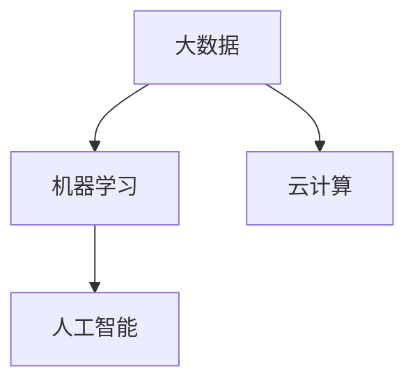

                 

# 平台经济的数据化：数据驱动平台的运营和发展

在当今数字经济时代，平台经济成为了驱动经济增长的重要引擎。作为连接生产者和消费者的桥梁，平台不仅需要提供高质量的商品和服务，还需要依靠数据驱动的智能运营策略，实现高效的市场匹配、精准的用户定位、动态的流量管理等，从而不断提升用户满意度和业务增长。本文将深入探讨平台经济的数据化原理与实践，阐述数据在平台运营和发展中的核心作用，以及如何利用数据驱动平台迈向更广阔的未来。

## 1. 背景介绍

### 1.1 平台经济的兴起与特征

平台经济，是指以互联网技术为支撑，以数据为核心资产，通过撮合供需双方实现价值交换的商业模式。典型的平台包括电子商务、社交媒体、在线教育、共享经济等。平台经济的特点在于其网络效应显著，用户越多，平台的价值就越大。因此，平台需要通过有效的运营策略，不断吸引用户，并优化用户体验，从而实现规模化的增长。

平台经济的特征包括：

- **双边市场**：平台同时连接买家和卖家，实现双向价值交换。
- **网络效应**：用户越多，平台价值越大。
- **动态定价**：根据供需关系，动态调整价格。
- **实时数据**：基于用户行为数据，实现动态匹配和个性化推荐。

### 1.2 数据驱动运营的重要性

数据驱动的运营是指通过收集、分析和利用数据，实现平台的高效管理和决策。在平台经济中，数据不仅是连接供需双方的桥梁，更是平台运营和发展的核心驱动力。平台通过数据驱动的运营策略，可以：

- **提升用户体验**：通过分析用户行为数据，平台可以优化产品和服务，提高用户满意度。
- **实现精准营销**：基于用户兴趣和行为数据，平台可以开展个性化的广告和推荐，提高转化率。
- **优化资源配置**：平台通过实时数据分析，动态调整资源配置，实现高效的供需匹配。
- **预测市场趋势**：利用历史数据和模型，平台可以预测市场变化，制定相应的运营策略。

## 2. 核心概念与联系

### 2.1 核心概念概述

为更好地理解平台经济的数据化，本文将介绍几个核心概念：

- **大数据（Big Data）**：指规模大、速度快、种类多、价值密度低的数据集合。大数据分析是平台数据驱动运营的基础。
- **机器学习（Machine Learning）**：指利用算法和模型，从数据中学习规律，预测未来，优化决策。机器学习是平台智能化运营的关键技术。
- **云计算（Cloud Computing）**：指通过互联网提供按需服务，实现数据存储和计算的高效化和可扩展性。云计算为平台数据驱动运营提供了技术支撑。
- **人工智能（Artificial Intelligence）**：指利用算法和模型，让计算机具备人类智能。人工智能是平台智能化运营的最高目标。

这些概念之间存在紧密的联系，共同构成了平台经济的数据化生态系统。大数据提供了丰富的数据源，机器学习利用数据进行智能分析，云计算为数据存储和计算提供了强大的支持，而人工智能则推动了平台运营的智能化升级。

### 2.2 概念间的关系

以下是一个简化的Mermaid流程图，展示了核心概念之间的关系：



这个流程图展示了大数据、机器学习、云计算和人工智能在平台经济数据化过程中的作用和相互关系。

## 3. 核心算法原理 & 具体操作步骤

### 3.1 算法原理概述

平台经济的数据化过程，本质上是基于数据驱动的智能运营和决策优化。其核心算法包括大数据处理、机器学习模型训练和人工智能应用。

**3.1.1 大数据处理**

大数据处理包括数据收集、数据清洗、数据存储和数据查询等环节。平台通过爬虫、API接口等方式收集用户行为数据、交易数据、社交数据等，利用ETL（Extract, Transform, Load）技术清洗和转换数据，然后存储在云平台（如AWS、阿里云等），并利用SQL、NoSQL等技术实现高效查询。

**3.1.2 机器学习模型训练**

机器学习模型训练分为数据准备、特征工程、模型选择、模型训练和模型评估等环节。平台根据具体业务需求，选择合适的模型（如回归模型、分类模型、聚类模型等），利用历史数据训练模型，并通过交叉验证等方法评估模型性能。

**3.1.3 人工智能应用**

人工智能应用包括自然语言处理（NLP）、计算机视觉（CV）、语音识别等技术，帮助平台实现智能化运营。例如，平台可以使用NLP技术分析用户评论，进行情感分析；使用CV技术进行商品图像识别，实现智能推荐；使用语音识别技术，实现语音搜索和交互。

### 3.2 算法步骤详解

以下是平台经济数据化的一般步骤：

**Step 1: 数据收集**

平台通过各种方式收集用户行为数据、交易数据、社交数据等。例如，电商平台可以通过订单、支付、浏览记录等数据，获取用户的购物行为；社交平台可以通过点赞、评论、分享等数据，获取用户的社交行为。

**Step 2: 数据处理**

收集到的数据需要经过清洗、转换和存储等处理。例如，需要对数据进行去重、填补缺失值、处理异常值等操作，以确保数据的完整性和准确性。平台可以使用ETL工具，如Apache Nifi、Apache Airflow等，实现自动化数据处理。

**Step 3: 特征工程**

特征工程是将原始数据转换为模型可接受的形式，包括特征选择、特征提取、特征编码等。例如，可以选择用户的浏览时间、购物频率、消费金额等特征，作为模型输入。平台可以使用Scikit-learn、TensorFlow等库进行特征工程。

**Step 4: 模型训练**

选择合适的机器学习模型，利用历史数据进行训练。例如，可以使用线性回归模型进行价格预测，使用决策树模型进行用户分类。平台可以使用TensorFlow、PyTorch等框架进行模型训练。

**Step 5: 模型评估**

使用验证集或测试集对模型进行评估，判断模型的性能。例如，可以使用准确率、召回率、F1分数等指标评估模型的分类效果。平台可以使用Scikit-learn、TensorBoard等工具进行模型评估。

**Step 6: 模型应用**

将训练好的模型部署到生产环境，实现实时预测和推荐。例如，可以使用模型对新订单进行价格预测，或对新用户进行分类推荐。平台可以使用AWS Lambda、Kubernetes等容器化技术实现模型部署。

### 3.3 算法优缺点

**3.3.1 优点**

- **提升运营效率**：通过数据驱动的运营策略，平台可以实现高效的资源配置和精准的用户定位，提高运营效率。
- **降低运营成本**：数据驱动的决策优化可以减少人工干预，降低运营成本。
- **增强用户满意度**：基于用户行为数据的分析和优化，可以提升用户满意度，提高用户粘性。
- **实现业务增长**：通过个性化推荐、动态定价等策略，平台可以实现精准营销和流量优化，推动业务增长。

**3.3.2 缺点**

- **数据质量问题**：平台需要收集和处理大量数据，数据质量（如准确性、完整性、一致性等）问题可能影响运营决策。
- **隐私和合规风险**：平台需要处理大量的用户数据，可能涉及隐私和合规问题，需要严格的监管和保护。
- **技术复杂性**：数据驱动运营涉及多个环节，技术实现复杂，需要跨学科的复合技能。
- **模型解释性不足**：机器学习模型通常是"黑盒"模型，难以解释其决策过程，可能影响用户信任。

### 3.4 算法应用领域

平台经济的数据化技术在多个领域得到广泛应用，包括：

- **电商**：通过数据驱动的运营策略，电商可以实现个性化推荐、动态定价、库存优化等，提升用户满意度和运营效率。
- **社交**：社交平台可以通过数据驱动的运营策略，实现内容推荐、广告投放、用户行为分析等，提升用户粘性和商业价值。
- **金融**：金融平台可以通过数据驱动的运营策略，实现信用评估、风险控制、智能投顾等，提升服务质量和盈利能力。
- **医疗**：医疗平台可以通过数据驱动的运营策略，实现精准诊疗、个性化健康管理等，提升医疗服务的质量和效率。
- **教育**：教育平台可以通过数据驱动的运营策略，实现学习推荐、智能答疑、教育效果评估等，提升教育质量和用户体验。

## 4. 数学模型和公式 & 详细讲解 & 举例说明

### 4.1 数学模型构建

平台经济的数据化涉及多个数学模型，包括回归模型、分类模型、聚类模型等。这里以线性回归模型为例，阐述其数学模型构建过程。

假设平台收集到 $N$ 个样本 $(x_1, y_1), (x_2, y_2), ..., (x_N, y_N)$，其中 $x_i$ 是输入特征，$y_i$ 是输出变量。平台希望构建一个线性回归模型，以预测输出变量的值。线性回归模型的数学模型可以表示为：

$$
y = \theta_0 + \sum_{i=1}^{n} \theta_i x_i + \epsilon
$$

其中，$\theta_0, \theta_1, ..., \theta_n$ 是模型参数，$\epsilon$ 是误差项。模型的目标是找到最优的参数 $\theta$，使得模型在训练集上的损失函数最小。

### 4.2 公式推导过程

线性回归模型的损失函数通常采用均方误差（MSE）或均方根误差（RMSE）作为评估指标。均方误差定义为：

$$
L(\theta) = \frac{1}{N} \sum_{i=1}^{N} (y_i - \theta_0 - \sum_{i=1}^{n} \theta_i x_i)^2
$$

为了最小化损失函数，平台需要求解模型参数 $\theta$，通常采用梯度下降法进行求解。梯度下降法的公式为：

$$
\theta_j = \theta_j - \eta \frac{\partial L(\theta)}{\partial \theta_j}
$$

其中，$\eta$ 是学习率，$\frac{\partial L(\theta)}{\partial \theta_j}$ 是损失函数对参数 $\theta_j$ 的梯度。

### 4.3 案例分析与讲解

以电商平台的个性化推荐为例，平台收集到 $N$ 个用户的历史浏览记录和购买记录，每个记录包含若干特征（如浏览时间、浏览次数、消费金额等）。平台希望通过线性回归模型，预测用户对未购买商品的购买概率。

假设平台有 $m$ 个商品，每个商品有 $n$ 个特征。平台可以将商品特征和用户特征拼接为一个特征向量 $x_i$，表示用户对第 $i$ 个商品的兴趣度。模型的预测输出 $y_i$ 为用户购买商品的概率。

平台使用均方误差作为损失函数，利用历史数据训练模型，找到最优的模型参数 $\theta$，然后将模型应用于新用户，预测其对未购买商品的购买概率。平台可以实时调整推荐策略，实现个性化推荐。

## 5. 项目实践：代码实例和详细解释说明

### 5.1 开发环境搭建

平台经济的数据化项目通常涉及大规模数据处理和复杂算法实现，需要使用高性能的开发环境。以下是Python开发环境的搭建步骤：

1. 安装Anaconda：从官网下载并安装Anaconda，用于创建独立的Python环境。

2. 创建并激活虚拟环境：
```bash
conda create -n pytorch-env python=3.8 
conda activate pytorch-env
```

3. 安装PyTorch：根据CUDA版本，从官网获取对应的安装命令。例如：
```bash
conda install pytorch torchvision torchaudio cudatoolkit=11.1 -c pytorch -c conda-forge
```

4. 安装TensorFlow：
```bash
pip install tensorflow
```

5. 安装TensorBoard：
```bash
pip install tensorboard
```

6. 安装其他库：
```bash
pip install pandas numpy sklearn jupyter notebook
```

### 5.2 源代码详细实现

以下是使用PyTorch进行线性回归模型训练的代码实现。

首先，定义数据集：

```python
import pandas as pd
import torch
from torch.utils.data import Dataset

class DataLoader(Dataset):
    def __init__(self, data, target, batch_size=64):
        self.data = data
        self.target = target
        self.batch_size = batch_size

    def __len__(self):
        return len(self.data) // self.batch_size

    def __getitem__(self, idx):
        start_idx = idx * self.batch_size
        end_idx = (idx + 1) * self.batch_size
        data_batch = self.data[start_idx:end_idx]
        target_batch = self.target[start_idx:end_idx]
        return torch.tensor(data_batch), torch.tensor(target_batch)

# 加载数据集
train_data = pd.read_csv('train.csv')
test_data = pd.read_csv('test.csv')
train_data = train_data.drop(['user_id'], axis=1)
test_data = test_data.drop(['user_id'], axis=1)

# 划分数据集
train_data = train_data.values
test_data = test_data.values

# 数据标准化
from sklearn.preprocessing import StandardScaler
scaler = StandardScaler()
train_data = scaler.fit_transform(train_data)
test_data = scaler.transform(test_data)

# 将数据转化为Tensor
train_data = torch.tensor(train_data)
train_target = torch.tensor(train_data[:, -1])
test_data = torch.tensor(test_data)
test_target = torch.tensor(test_data[:, -1])

# 创建数据集
train_dataset = DataLoader(train_data, train_target)
test_dataset = DataLoader(test_data, test_target)
```

然后，定义模型和优化器：

```python
from torch import nn
from torch.optim import SGD

# 定义模型
class LinearRegression(nn.Module):
    def __init__(self, n_features):
        super(LinearRegression, self).__init__()
        self.linear = nn.Linear(n_features, 1)

    def forward(self, x):
        return self.linear(x)

# 初始化模型参数
model = LinearRegression(train_data.shape[1] - 1)

# 定义优化器和损失函数
optimizer = SGD(model.parameters(), lr=0.01)
criterion = nn.MSELoss()
```

接着，定义训练和评估函数：

```python
import torch
import numpy as np
from sklearn.metrics import mean_squared_error
import tensorboard as tb

# 定义训练函数
def train(model, train_dataset, optimizer, criterion, num_epochs=100):
    for epoch in range(num_epochs):
        total_loss = 0
        for batch_idx, (data, target) in enumerate(train_dataset):
            optimizer.zero_grad()
            output = model(data)
            loss = criterion(output, target)
            loss.backward()
            optimizer.step()
            total_loss += loss.item()
        print('Epoch {}: Loss = {:.6f}'.format(epoch+1, total_loss / len(train_dataset)))

# 定义评估函数
def evaluate(model, test_dataset):
    mse = mean_squared_error(test_target.numpy(), model(test_data.numpy()).detach().numpy())
    print('MSE = {:.6f}'.format(mse))
```

最后，启动训练流程并在测试集上评估：

```python
# 训练模型
train(model, train_dataset, optimizer, criterion)

# 评估模型
evaluate(model, test_dataset)
```

### 5.3 代码解读与分析

代码实现中，我们首先定义了数据集，使用Pandas库读取CSV文件，并进行了数据标准化和特征转换。接着，我们定义了线性回归模型，并使用SGD优化器和均方误差损失函数进行训练。最后，我们定义了训练和评估函数，并在测试集上评估模型的均方误差。

代码中，我们使用了PyTorch的Tensor和nn.Module等核心类，实现了模型的定义、前向传播、损失计算、反向传播和参数更新。同时，我们使用了TensorBoard库进行模型训练的可视化，帮助理解模型的收敛情况和性能表现。

## 6. 实际应用场景

### 6.1 电商平台个性化推荐

电商平台利用数据驱动的运营策略，可以实现个性化推荐、动态定价、库存优化等。例如，电商平台可以使用用户的历史浏览记录和购买记录，构建用户兴趣模型，进行个性化推荐。平台还可以实时分析库存数据和用户需求，进行动态定价，优化库存管理。

### 6.2 社交平台的精准广告投放

社交平台可以通过数据分析，实现精准的广告投放。例如，平台可以根据用户的兴趣和行为数据，选择合适的广告位和广告内容，进行定向投放。平台还可以实时分析广告效果，调整投放策略，提升广告转化率。

### 6.3 金融平台的信用评估

金融平台可以通过数据分析，进行信用评估和风险控制。例如，平台可以利用用户的交易记录和信用历史，构建信用评分模型，进行贷款审批和信用评估。平台还可以实时分析用户行为数据，进行风险预警和控制，降低贷款风险。

### 6.4 教育平台的个性化学习推荐

教育平台可以通过数据分析，实现个性化学习推荐。例如，平台可以根据学生的学习行为和成绩数据，推荐合适的学习资源和课程。平台还可以实时分析学习效果，调整推荐策略，提高学习效率。

### 6.5 医疗平台的精准诊疗

医疗平台可以通过数据分析，实现精准诊疗和个性化健康管理。例如，平台可以利用患者的病历和健康数据，构建疾病预测模型，进行精准诊疗。平台还可以实时分析健康数据，进行个性化健康管理，提高治疗效果。

## 7. 工具和资源推荐

### 7.1 学习资源推荐

为帮助开发者系统掌握平台经济的数据化原理与实践，本文推荐以下学习资源：

1. 《大数据技术与应用》系列博文：深入浅出地介绍了大数据处理、数据清洗、数据存储等基础知识，适合初学者入门。

2. 《机器学习实战》课程：由清华大学开设的机器学习课程，讲解了回归、分类、聚类等基础算法，适合巩固理论基础。

3. 《深度学习与人工智能》书籍：讲解了深度学习算法和应用，包括TensorFlow、PyTorch等主流框架的使用，适合进一步提升技术水平。

4. 《TensorFlow实战》书籍：由Google官方编写，详细介绍了TensorFlow的使用方法和实践案例，适合动手实践。

5. TensorFlow官网文档：提供了丰富的TensorFlow学习资源和API文档，适合深入学习。

### 7.2 开发工具推荐

高效的开发离不开优秀的工具支持。以下是几款用于平台经济数据化开发的常用工具：

1. PyTorch：基于Python的开源深度学习框架，灵活动态的计算图，适合快速迭代研究。

2. TensorFlow：由Google主导开发的开源深度学习框架，生产部署方便，适合大规模工程应用。

3. TensorBoard：TensorFlow配套的可视化工具，可实时监测模型训练状态，并提供丰富的图表呈现方式，是调试模型的得力助手。

4. Scikit-learn：Python机器学习库，提供了丰富的机器学习算法和工具，适合快速实现模型。

5. Pandas：Python数据分析库，提供了丰富的数据处理和清洗功能，适合处理大规模数据。

### 7.3 相关论文推荐

平台经济的数据化技术发展源于学界的持续研究。以下是几篇奠基性的相关论文，推荐阅读：

1. "Feature Engineering and Selection for Machine Learning"：讨论了特征工程的重要性，并介绍了常用的特征提取方法和技巧。

2. "Deep Learning for Large-Scale Music Recommendation"：介绍了深度学习在音乐推荐中的应用，并讨论了特征工程和模型选择等问题。

3. "A Survey on Predictive Modeling with Online and Big Data"：综述了在线和大数据下的预测建模方法，并讨论了模型训练和性能评估等问题。

4. "Towards Personalized Healthcare: Challenges and Opportunities"：讨论了个性化医疗数据化的挑战和机遇，并提出了一些解决方案。

5. "Machine Learning in Finance: Current State and Future Directions"：综述了机器学习在金融领域的应用，并讨论了模型训练和性能评估等问题。

这些论文代表了大数据和机器学习在平台经济数据化过程中的最新进展，适合深入学习和理解。

## 8. 总结：未来发展趋势与挑战

### 8.1 研究成果总结

本文详细探讨了平台经济的数据化原理与实践，阐述了大数据、机器学习、云计算和人工智能在平台运营和发展中的核心作用。通过案例分析，展示了数据驱动的个性化推荐、精准广告投放、信用评估、健康管理等典型应用场景，揭示了数据驱动运营的巨大潜力。通过实践示例，介绍了如何使用PyTorch和TensorBoard进行数据驱动的模型训练和可视化，演示了平台经济数据化项目的实现过程。

### 8.2 未来发展趋势

展望未来，平台经济的数据化将呈现以下几个发展趋势：

1. **数据驱动的全面运营**：平台将更加依赖数据驱动的运营策略，实现全流程的智能化管理。

2. **多模态数据的融合**：平台将实现文本、图像、语音等多模态数据的融合，提升数据驱动决策的全面性。

3. **实时数据流处理**：平台将实现实时数据流处理，提升数据驱动决策的及时性。

4. **联邦学习和隐私保护**：平台将通过联邦学习等技术，保护用户隐私，实现数据驱动决策的隐私保护。

5. **人工智能的深度融合**：平台将实现人工智能技术与数据驱动运营的深度融合，推动平台向智能化、智慧化发展。

6. **跨平台协同**：平台将实现跨平台的数据共享和协同，提升整体数据驱动决策的效率。

### 8.3 面临的挑战

尽管平台经济的数据化技术已经取得了瞩目成就，但在迈向更加智能化、普适化应用的过程中，它仍面临诸多挑战：

1. **数据质量问题**：平台需要收集和处理大量数据，数据质量问题可能影响运营决策。

2. **隐私和合规风险**：平台需要处理大量的用户数据，涉及隐私和合规问题，需要严格的监管和保护。

3. **技术复杂性**：平台需要处理多个环节，技术实现复杂，需要跨学科的复合技能。

4. **模型解释性不足**：机器学习模型通常是"黑盒"模型，难以解释其决策过程，可能影响用户信任。

5. **数据安全问题**：平台需要保护数据安全，避免数据泄露和攻击。

### 8.4 研究展望

面对平台经济数据化所面临的挑战，未来的研究需要在以下几个方面寻求新的突破：

1. **数据质量提升**：改进数据收集和处理技术，提升数据质量，确保数据驱动决策的准确性。

2. **隐私保护机制**：研究隐私保护机制，如联邦学习、差分隐私等，确保数据驱动决策的隐私保护。

3. **模型解释性增强**：研究可解释性强的模型，如LIME、SHAP等，增强模型决策的可解释性。

4. **跨平台协同技术**：研究跨平台数据共享和协同技术，提升数据驱动决策的效率和全面性。

5. **实时数据处理技术**：研究实时数据流处理技术，提升数据驱动决策的及时性。

6. **多模态融合技术**：研究多模态数据融合技术，提升数据驱动决策的全面性。

7. **联邦学习机制**：研究联邦学习机制，保护用户隐私，确保数据驱动决策的隐私保护。

这些研究方向将推动平台经济的数据化技术迈向更高的台阶，为平台运营提供更智能、更安全、更高效的决策支持。相信通过不断探索和创新，平台经济的数据化技术必将迎来更加辉煌的未来。

---

作者：禅与计算机程序设计艺术 / Zen and the Art of Computer Programming

