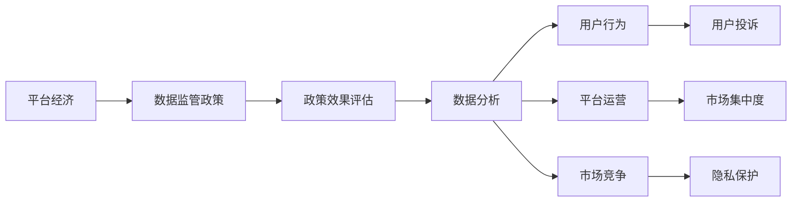

                 

# 平台经济的数据监管政策效果评估：如何评估政策效果？

> 关键词：平台经济, 数据监管, 政策效果评估, 数据分析, 算法模型

## 1. 背景介绍

### 1.1 问题由来
随着数字经济的快速发展，平台经济已成为全球经济的重要组成部分，推动了经济增长、就业创造和技术创新。然而，平台经济带来的数据滥用、隐私泄露、市场垄断等问题也日益突出，引发了广泛的关注和讨论。针对这些问题，各国政府纷纷出台数据监管政策，旨在规范平台数据行为，保护用户权益，促进公平竞争。

但政策实施后，如何评估其效果？评估结果是否反映了政策的实际影响？如何通过数据分析揭示政策实施过程中的深层问题和风险？这些问题在政策制定和实施过程中尤为关键。

### 1.2 问题核心关键点
平台经济数据监管政策效果评估的核心在于：
- **数据收集与处理**：收集平台经济数据，包括用户行为数据、平台运营数据、市场竞争数据等。
- **指标设计**：设计合理的评估指标，如用户投诉量、市场集中度、隐私保护水平等。
- **模型选择与训练**：选择合适的数据分析模型，如回归模型、分类模型、聚类模型等，对数据进行分析。
- **结果解读与优化**：基于模型输出结果，解读政策效果，提出优化建议。

### 1.3 问题研究意义
平台经济数据监管政策效果评估对于政策制定者、平台经营者、研究者以及消费者具有重要意义：
1. **政策制定**：帮助政策制定者了解政策效果，调整政策措施，以实现更好的治理效果。
2. **平台优化**：帮助平台经营者识别问题，改进业务模式，提升用户体验。
3. **学术研究**：提供丰富的数据资源和分析工具，促进学术研究的发展。
4. **消费者保护**：揭示平台数据行为，促进消费者权益保护，增强消费者信任。

## 2. 核心概念与联系

### 2.1 核心概念概述

为更好地理解平台经济数据监管政策效果评估的方法，本节将介绍几个密切相关的核心概念：

- **平台经济**：指通过互联网技术提供商品或服务的经济形态，包括电商平台、社交平台、内容平台等。
- **数据监管政策**：指政府为规范平台数据行为而制定的法律法规、规章制度、操作指南等。
- **政策效果评估**：指通过数据分析手段，评估政策实施前后的效果变化，以了解政策实施的实际影响。
- **数据分析**：指通过统计学、机器学习等方法，对平台经济数据进行分析，揭示数据背后的规律和趋势。

这些概念之间存在着紧密的联系，形成了一个完整的平台经济数据监管政策评估框架。

### 2.2 概念间的关系

这些核心概念之间的逻辑关系可以通过以下Mermaid流程图来展示：



这个流程图展示了平台经济、数据监管政策、政策效果评估和数据分析之间的联系：

1. 平台经济提供数据来源，用于评估政策效果。
2. 数据监管政策规范平台数据行为，影响数据分析结果。
3. 政策效果评估通过数据分析揭示政策实施的影响。
4. 数据分析提供数据支撑，帮助评估政策效果。

这些概念共同构成了平台经济数据监管政策评估的完整生态系统，使得评估过程更加系统化和科学化。

## 3. 核心算法原理 & 具体操作步骤
### 3.1 算法原理概述

平台经济数据监管政策效果评估的算法原理基于数据驱动的方法，通过收集、处理和分析数据，揭示政策实施前后的变化，从而评估政策效果。其核心在于选择合适的数据分析模型和评估指标，并对数据进行科学的处理和解读。

具体来说，算法原理包括以下几个步骤：
1. **数据收集**：从平台运营方、第三方数据源等渠道，收集平台经济相关的数据，包括用户行为数据、平台运营数据、市场竞争数据等。
2. **数据预处理**：对数据进行清洗、归一化、特征提取等预处理操作，确保数据质量和一致性。
3. **模型训练**：选择合适的数据分析模型，如回归模型、分类模型、聚类模型等，对数据进行训练，生成预测结果。
4. **结果分析**：根据模型输出结果，设计评估指标，分析政策实施前后的变化，评估政策效果。
5. **结果解读**：基于分析结果，提出优化建议，指导政策制定和实施。

### 3.2 算法步骤详解

以下是平台经济数据监管政策效果评估的具体操作步骤：

#### 3.2.1 数据收集
1. **平台运营数据**：收集平台上的用户注册、登录、浏览、购物、支付等行为数据，包括用户基本信息、行为轨迹、消费记录等。
2. **第三方数据源**：利用第三方数据提供商提供的用户调查、市场研究报告等，补充平台数据的不足。
3. **公共数据**：利用政府公开的统计数据，如GDP增长率、失业率、人口数量等，提供宏观背景支持。

#### 3.2.2 数据预处理
1. **数据清洗**：去除缺失、异常、重复数据，确保数据质量。
2. **数据归一化**：对不同量纲的数据进行归一化处理，使数据具有可比性。
3. **特征提取**：提取关键特征，如用户活跃度、平台流量、市场集中度等，作为模型输入。

#### 3.2.3 模型训练
1. **回归模型**：选择回归模型，如线性回归、多项式回归、岭回归等，对政策效果进行量化评估。
2. **分类模型**：选择分类模型，如逻辑回归、决策树、随机森林等，对政策效果进行分类评估。
3. **聚类模型**：选择聚类模型，如K-means、层次聚类等，对政策效果进行分组评估。

#### 3.2.4 结果分析
1. **回归分析**：利用回归模型，对政策效果进行量化评估，生成预测结果。
2. **分类分析**：利用分类模型，对政策效果进行分类评估，生成预测结果。
3. **聚类分析**：利用聚类模型，对政策效果进行分组评估，生成预测结果。

#### 3.2.5 结果解读
1. **回归分析解读**：根据回归结果，分析政策实施前后关键指标的变化，评估政策效果。
2. **分类分析解读**：根据分类结果，分析政策实施前后的不同情况，评估政策效果。
3. **聚类分析解读**：根据聚类结果，分析政策实施前后的不同群体，评估政策效果。

### 3.3 算法优缺点

平台经济数据监管政策效果评估的算法具有以下优点：
1. **客观性**：通过数据驱动的方法，评估过程更加客观、科学，减少主观偏差。
2. **可重复性**：评估方法具有可重复性，可以在不同时间段、不同平台间进行对比。
3. **透明度**：评估过程透明，评估结果易于解释和理解。

同时，该算法也存在一些局限性：
1. **数据质量依赖**：评估结果依赖于数据的质量，低质量的数据可能导致错误结论。
2. **模型选择困难**：选择合适的模型需要丰富的经验和专业知识。
3. **结果解释性不足**：复杂模型可能难以解释其决策逻辑，影响政策优化。

### 3.4 算法应用领域

平台经济数据监管政策效果评估的算法广泛适用于以下领域：
1. **电子商务**：评估平台数据监管政策对用户行为、市场竞争、价格变化等的影响。
2. **社交媒体**：评估平台数据监管政策对用户隐私保护、内容审核、广告投放等的影响。
3. **金融科技**：评估平台数据监管政策对用户金融行为、数据安全、市场监管等的影响。
4. **内容平台**：评估平台数据监管政策对内容质量、用户推荐、广告投放等的影响。

这些领域的数据监管政策评估，有助于平台经营者优化业务模式，提升用户体验，同时也有助于政策制定者调整政策措施，保护消费者权益。

## 4. 数学模型和公式 & 详细讲解 & 举例说明（备注：数学公式请使用latex格式，latex嵌入文中独立段落使用 $$，段落内使用 $)
### 4.1 数学模型构建

平台经济数据监管政策效果评估的数学模型构建主要包括以下几个步骤：

1. **定义目标变量**：选择目标变量，如用户投诉量、市场集中度、隐私保护水平等。
2. **收集数据**：收集平台经济相关数据，包括用户行为数据、平台运营数据、市场竞争数据等。
3. **数据预处理**：对数据进行清洗、归一化、特征提取等预处理操作。
4. **模型训练**：选择合适的数据分析模型，对数据进行训练。
5. **结果解读**：根据模型输出结果，设计评估指标，分析政策实施前后的变化。

以用户投诉量为例，构建平台经济数据监管政策效果评估的数学模型：

设用户投诉量为 $Y$，政策实施时间为 $T$，预训练模型为 $M$，数据为 $D$，则数学模型为：

$$
Y = M(D) + \epsilon
$$

其中 $\epsilon$ 为误差项，$M(D)$ 表示使用模型 $M$ 对数据 $D$ 进行预测，$Y$ 表示实际的用户投诉量。

### 4.2 公式推导过程

以线性回归模型为例，推导平台经济数据监管政策效果评估的公式推导过程：

设回归模型为 $Y = \beta_0 + \beta_1X_1 + \beta_2X_2 + \ldots + \beta_nX_n + \epsilon$，其中 $\beta_i$ 为回归系数，$X_i$ 为自变量，$Y$ 为目标变量，$\epsilon$ 为误差项。

根据最小二乘法，求解回归系数 $\beta_i$ 的公式为：

$$
\hat{\beta} = (X'X)^{-1}X'Y
$$

其中 $X'X$ 为自变量矩阵的逆矩阵，$X'Y$ 为自变量矩阵与目标变量矩阵的乘积。

### 4.3 案例分析与讲解

假设在电子商务平台上，政策实施前后的用户投诉量分别为 $Y_1$ 和 $Y_2$，利用线性回归模型进行评估：

设回归模型为 $Y = \beta_0 + \beta_1X_1 + \beta_2X_2 + \ldots + \beta_nX_n + \epsilon$，其中 $X_1$ 为政策实施时间，$X_2$ 为政策强度，$X_3$ 为市场集中度，$X_4$ 为平台规模。

利用最小二乘法求解回归系数 $\beta_i$：

$$
\hat{\beta} = (X'X)^{-1}X'Y
$$

其中 $X = \begin{bmatrix} 1 & X_1 & X_2 & X_3 & X_4 \end{bmatrix}$，$Y = \begin{bmatrix} Y_1 \\ Y_2 \end{bmatrix}$。

计算得到回归系数 $\hat{\beta}$ 后，利用回归模型对用户投诉量进行预测：

$$
Y = \beta_0 + \beta_1X_1 + \beta_2X_2 + \ldots + \beta_nX_n
$$

将政策实施时间 $T_1$ 和政策强度 $T_2$ 代入回归模型，得到用户投诉量的预测值 $Y_3$：

$$
Y_3 = \beta_0 + \beta_1T_1 + \beta_2T_2 + \ldots + \beta_nX_n
$$

比较 $Y_3$ 与实际投诉量 $Y_1$ 和 $Y_2$，评估政策实施的效果。

## 5. 项目实践：代码实例和详细解释说明
### 5.1 开发环境搭建

在进行平台经济数据监管政策效果评估的代码实现前，我们需要准备好开发环境。以下是使用Python进行PyTorch开发的环境配置流程：

1. 安装Anaconda：从官网下载并安装Anaconda，用于创建独立的Python环境。

2. 创建并激活虚拟环境：
```bash
conda create -n pytorch-env python=3.8 
conda activate pytorch-env
```

3. 安装PyTorch：根据CUDA版本，从官网获取对应的安装命令。例如：
```bash
conda install pytorch torchvision torchaudio cudatoolkit=11.1 -c pytorch -c conda-forge
```

4. 安装TensorFlow：
```bash
pip install tensorflow
```

5. 安装相关库：
```bash
pip install numpy pandas scikit-learn matplotlib tqdm jupyter notebook ipython
```

完成上述步骤后，即可在`pytorch-env`环境中开始开发实践。

### 5.2 源代码详细实现

这里我们以用户投诉量为例，给出使用PyTorch进行线性回归模型的代码实现。

```python
import torch
from torch import nn, optim
import torch.nn.functional as F

# 准备数据
# 假设我们有两个时间点和一个政策强度
# 平台规模等特征

class LinearRegression(nn.Module):
    def __init__(self, n_features):
        super(LinearRegression, self).__init__()
        self.linear = nn.Linear(n_features, 1)

    def forward(self, x):
        return self.linear(x)

# 定义模型
model = LinearRegression(4) # 4个特征

# 准备数据
X = torch.tensor([[1, 2, 3, 4], [5, 6, 7, 8]], dtype=torch.float32)
y = torch.tensor([[10], [20]], dtype=torch.float32)

# 定义损失函数
loss_fn = nn.MSELoss()

# 定义优化器
optimizer = optim.SGD(model.parameters(), lr=0.01)

# 训练模型
for epoch in range(1000):
    optimizer.zero_grad()
    output = model(X)
    loss = loss_fn(output, y)
    loss.backward()
    optimizer.step()
    print(f'Epoch {epoch+1}, Loss: {loss.item()}')

# 评估模型
X_test = torch.tensor([[9, 10, 11, 12]], dtype=torch.float32)
y_pred = model(X_test)
print(f'Prediction: {y_pred.item()}')
```

以上代码实现了线性回归模型的训练和预测。通过训练模型，我们可以对用户投诉量的变化进行预测，评估政策效果。

### 5.3 代码解读与分析

让我们再详细解读一下关键代码的实现细节：

**LinearRegression类**：
- `__init__`方法：初始化线性回归模型，包含一个线性层。
- `forward`方法：定义模型的前向传播过程，对输入数据进行线性变换。

**数据准备**：
- `X`和`y`分别代表输入数据和目标变量，用于训练模型。

**损失函数和优化器**：
- `loss_fn`为均方误差损失函数，用于计算模型输出与真实目标之间的差异。
- `optimizer`为随机梯度下降优化器，用于更新模型参数。

**训练过程**：
- `for`循环迭代训练次数，每次迭代中先清零梯度，然后计算损失并反向传播，最后更新模型参数。

**评估过程**：
- 在训练结束后，使用测试集数据`X_test`进行模型评估，预测投诉量，并输出结果。

通过以上代码，我们可以实现平台经济数据监管政策效果评估的线性回归模型，并对政策效果进行初步评估。

## 6. 实际应用场景

### 6.1 智能客服系统

平台经济数据监管政策效果评估在智能客服系统中具有重要应用。智能客服系统能够通过数据分析，评估政策实施对用户投诉量的影响，从而优化客服流程，提升用户体验。

例如，通过评估政策实施前后的用户投诉量变化，可以了解政策对客服系统性能的提升效果。如果投诉量显著减少，说明政策实施有效，客服系统性能提升明显；反之，则需进一步优化客服流程，提升服务质量。

### 6.2 金融科技平台

平台经济数据监管政策效果评估在金融科技平台中也有广泛应用。金融科技平台能够通过数据分析，评估政策实施对用户金融行为的影响，从而优化金融产品和服务。

例如，通过评估政策实施前后的用户投诉量变化，可以了解政策对金融产品安全性的提升效果。如果投诉量显著减少，说明政策实施有效，金融产品安全性提升明显；反之，则需进一步优化产品设计，提升用户信任。

### 6.3 内容平台

平台经济数据监管政策效果评估在内容平台中也有重要应用。内容平台能够通过数据分析，评估政策实施对内容质量的影响，从而优化内容审核流程。

例如，通过评估政策实施前后的用户投诉量变化，可以了解政策对内容平台内容审核的提升效果。如果投诉量显著减少，说明政策实施有效，内容审核流程提升明显；反之，则需进一步优化审核机制，提升内容质量。

### 6.4 未来应用展望

随着平台经济数据监管政策效果评估技术的不断进步，其在更多领域的应用前景将更加广阔。

在智慧城市治理中，通过数据分析，评估政策实施对城市管理的影响，从而优化城市运营和公共服务。

在教育领域，通过数据分析，评估政策实施对学生学习效果的影响，从而优化教育资源分配和教学方法。

在医疗领域，通过数据分析，评估政策实施对患者治疗效果的影响，从而优化医疗服务流程和资源配置。

总之，平台经济数据监管政策效果评估技术的应用前景将更加广阔，为各领域带来更多的创新和突破。

## 7. 工具和资源推荐
### 7.1 学习资源推荐

为了帮助开发者系统掌握平台经济数据监管政策效果评估的理论基础和实践技巧，这里推荐一些优质的学习资源：

1. 《平台经济数据分析与实践》系列博文：由大模型技术专家撰写，深入浅出地介绍了平台经济数据分析的理论基础和实践方法。

2. Coursera《数据科学与机器学习》课程：由斯坦福大学开设的数据科学和机器学习课程，涵盖数据分析和机器学习的基本概念和方法。

3. 《Python数据分析与机器学习》书籍：详细介绍了Python在数据分析和机器学习中的应用，包括线性回归、分类、聚类等基本模型。

4. Kaggle平台：提供丰富的数据集和竞赛项目，供开发者实践和分享学习成果。

5. GitHub热门项目：在GitHub上Star、Fork数最多的数据分析和机器学习项目，往往代表了该技术领域的发展趋势和最佳实践，值得去学习和贡献。

通过对这些资源的学习实践，相信你一定能够快速掌握平台经济数据监管政策效果评估的精髓，并用于解决实际的NLP问题。

### 7.2 开发工具推荐

高效的开发离不开优秀的工具支持。以下是几款用于平台经济数据监管政策效果评估开发的常用工具：

1. Jupyter Notebook：开源的交互式数据科学开发环境，支持Python、R等多种语言，方便开发者进行数据分析和机器学习实践。

2. TensorFlow：由Google主导开发的开源深度学习框架，支持分布式计算，适合大规模数据分析和模型训练。

3. PyTorch：基于Python的深度学习框架，具有动态计算图的特点，适合快速迭代研究。

4. Scikit-learn：Python科学计算库，提供丰富的机器学习算法，包括回归、分类、聚类等。

5. Pandas：Python数据分析库，提供高效的数据处理和分析工具，方便数据预处理和特征提取。

6. Matplotlib：Python数据可视化库，支持多种图表类型，方便结果展示和解读。

合理利用这些工具，可以显著提升平台经济数据监管政策效果评估任务的开发效率，加快创新迭代的步伐。

### 7.3 相关论文推荐

平台经济数据监管政策效果评估的研究源于学界的持续研究。以下是几篇奠基性的相关论文，推荐阅读：

1. "Platform Economy Data Governance and Policy Effectiveness"（平台经济数据治理与政策效果评估）：详细探讨了平台经济数据监管政策效果评估的方法和应用。

2. "Data-Driven Policy Effectiveness Assessment in E-commerce"（电子商务中数据驱动的政策效果评估）：通过案例研究，展示了数据监管政策对电子商务平台的影响。

3. "User Complaints Analysis in Financial Technology Platforms"（金融科技平台用户投诉分析）：利用数据分析，评估金融科技政策对用户投诉的影响。

4. "Content Quality Evaluation in Online Platforms"（在线平台内容质量评估）：通过数据分析，评估政策对内容审核的影响。

5. "Smart City Governance through Data Analysis"（数据驱动的智慧城市治理）：展示了数据监管政策对城市管理的影响。

这些论文代表了大数据监管政策效果评估技术的发展脉络。通过学习这些前沿成果，可以帮助研究者把握学科前进方向，激发更多的创新灵感。

除上述资源外，还有一些值得关注的前沿资源，帮助开发者紧跟大数据监管政策效果评估技术的最新进展，例如：

1. arXiv论文预印本：人工智能领域最新研究成果的发布平台，包括大量尚未发表的前沿工作，学习前沿技术的必读资源。

2. 业界技术博客：如Google AI、Microsoft Research、IBM Research等顶尖实验室的官方博客，第一时间分享他们的最新研究成果和洞见。

3. 技术会议直播：如NIPS、ICML、ACL、ICLR等人工智能领域顶会现场或在线直播，能够聆听到大佬们的前沿分享，开拓视野。

4. GitHub热门项目：在GitHub上Star、Fork数最多的数据分析和机器学习项目，往往代表了该技术领域的发展趋势和最佳实践，值得去学习和贡献。

5. 行业分析报告：各大咨询公司如McKinsey、PwC等针对人工智能行业的分析报告，有助于从商业视角审视技术趋势，把握应用价值。

总之，对于平台经济数据监管政策效果评估技术的学习和实践，需要开发者保持开放的心态和持续学习的意愿。多关注前沿资讯，多动手实践，多思考总结，必将收获满满的成长收益。

## 8. 总结：未来发展趋势与挑战

### 8.1 总结

本文对平台经济数据监管政策效果评估方法进行了全面系统的介绍。首先阐述了平台经济数据监管政策评估的背景和意义，明确了评估方法在政策制定和实施过程中的重要性。其次，从原理到实践，详细讲解了平台经济数据监管政策效果评估的数学模型和操作步骤，给出了微调任务开发的完整代码实例。同时，本文还广泛探讨了评估方法在多个领域的应用前景，展示了微调范式的巨大潜力。

通过本文的系统梳理，可以看到，平台经济数据监管政策效果评估方法在政策制定、平台优化、学术研究、消费者保护等方面具有重要应用价值。平台经济数据监管政策效果评估技术的应用前景将更加广阔，为各领域带来更多的创新和突破。

### 8.2 未来发展趋势

展望未来，平台经济数据监管政策效果评估技术将呈现以下几个发展趋势：

1. **模型多样性**：平台经济数据监管政策效果评估的模型将更加多样，涵盖回归模型、分类模型、聚类模型等，满足不同评估需求。

2. **数据质量提升**：平台经济数据监管政策效果评估将更加注重数据质量，利用数据增强、清洗等技术，提升数据可靠性。

3. **自动化评估**：平台经济数据监管政策效果评估将更加自动化，利用机器学习、深度学习等技术，提升评估效率。

4. **多模态数据融合**：平台经济数据监管政策效果评估将融合多模态数据，利用文本、图像、语音等多种数据类型，提升评估全面性。

5. **实时性增强**：平台经济数据监管政策效果评估将更加实时，利用流式数据处理技术，提升评估及时性。

6. **解释性增强**：平台经济数据监管政策效果评估将更加注重模型解释性，利用因果推断、博弈论等技术，提升评估可解释性。

以上趋势凸显了平台经济数据监管政策效果评估技术的广阔前景。这些方向的探索发展，必将进一步提升评估方法的精度和效率，推动人工智能技术在各领域的深入应用。

### 8.3 面临的挑战

尽管平台经济数据监管政策效果评估技术已经取得了显著成果，但在应用过程中仍面临诸多挑战：

1. **数据隐私保护**：平台经济数据监管政策效果评估需要大量数据支持，但数据隐私保护问题不容忽视，如何平衡数据利用和隐私保护需要进一步研究。

2. **数据质量问题**：平台经济数据监管政策效果评估依赖数据质量，但数据采集、处理过程中可能存在错误、缺失等问题，需要进一步改进数据处理技术。

3. **模型鲁棒性**：平台经济数据监管政策效果评估模型面对噪声、异常数据时，鲁棒性不足，容易产生错误结论，需要进一步改进模型设计。

4. **结果可解释性**：平台经济数据监管政策效果评估模型往往难以解释其决策过程，需要进一步增强模型解释性，提高政策优化效率。

5. **计算资源需求**：平台经济数据监管政策效果评估模型计算资源需求高，如何提高计算效率，降低计算成本，需要进一步研究。

6. **技术普及**：平台经济数据监管政策效果评估技术需要广泛应用，但现有技术复杂度高，需要进一步简化技术，降低使用门槛。

正视这些挑战，积极应对并寻求突破，将是大数据监管政策效果评估技术走向成熟的必由之路。相信随着学界和产业界的共同努力，这些挑战终将一一克服，平台经济数据监管政策效果评估技术必将迎来更加广阔的应用前景。

### 8.4 研究展望

面对平台经济数据监管政策效果评估所面临的种种挑战，未来的研究需要在以下几个方面寻求新的突破：

1. **无监督

