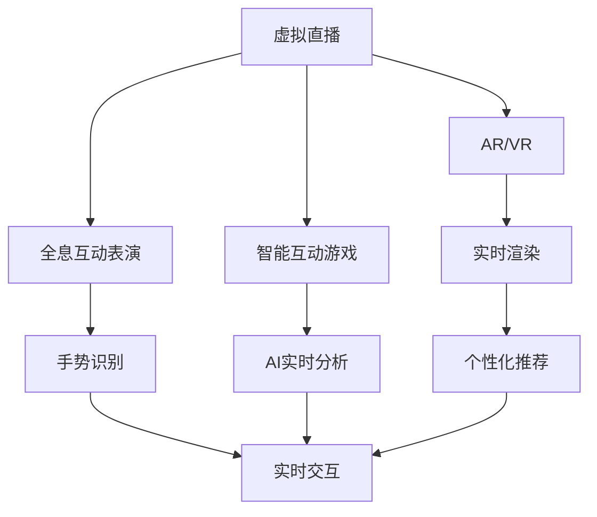

                 

## 1. 背景介绍

在人类历史的长河中，娱乐活动的形式不断地发展和演进，从原始的围火舞蹈到现代的电子游戏，从电影的诞生到虚拟现实技术的兴起，娱乐已经变得越来越复杂和多样化。随着科技的不断进步，尤其是数字技术的蓬勃发展，我们即将迎来2050年的一场数字创意娱乐革命，将从虚拟直播到全息互动表演，开辟出全新的数字创意娱乐领域。

### 1.1 问题由来

随着5G、AR、VR、人工智能（AI）等技术的飞速发展，数字创意娱乐的形式和内容正在发生翻天覆地的变化。传统的娱乐方式，如电视、电影、音乐会等，正在被虚拟直播、全息互动表演、智能互动游戏等新兴技术所取代。这些新技术不仅提供了前所未有的沉浸式体验，还极大地拓宽了娱乐的边界，带来了全新的文化现象和市场机遇。

然而，技术的迅猛发展也带来了一些挑战。例如，如何在数字创意娱乐中保证内容的质量和真实性，如何在确保用户隐私的同时提供个性化体验，如何通过跨平台整合提升用户粘性等，都成为了亟待解决的问题。

### 1.2 问题核心关键点

数字创意娱乐的核心在于将数字技术与创意内容深度融合，为用户提供全新的娱乐体验。其关键点包括：

1. **虚拟直播**：通过VR/AR技术，让用户在家中就能感受到身临其境的演出效果，例如虚拟演唱会、虚拟体育赛事等。
2. **全息互动表演**：结合全息技术、AI实时渲染和手势识别等技术，创造真正的全息交互体验。
3. **智能互动游戏**：通过AI和机器学习，根据用户的行为和偏好，提供个性化的游戏内容和体验。
4. **跨平台整合**：实现不同平台（如PC、手机、智能家居等）的互动，提升用户体验和黏性。

这些关键点共同构成了数字创意娱乐的基石，推动了从虚拟直播到全息互动表演的数字化转型。

### 1.3 问题研究意义

探索2050年数字创意娱乐的潜力，对于推动文化娱乐产业的创新和升级，具有重要意义：

1. **创新驱动**：新技术的引入将推动娱乐内容的创新，满足用户不断变化的娱乐需求。
2. **产业升级**：通过数字化手段，提高娱乐产业的效率和盈利能力。
3. **文化传播**：数字创意娱乐为文化传播提供了新的渠道和形式，有助于全球文化的交流与融合。
4. **经济增长**：数字创意娱乐行业有望成为新的经济增长点，推动数字经济的发展。

## 2. 核心概念与联系

### 2.1 核心概念概述

为了更好地理解数字创意娱乐的变革，首先需要明确一些关键概念：

- **虚拟直播**：利用VR/AR技术，将现实中的演出、赛事等场景呈现在用户的虚拟环境中，实现身临其境的互动体验。
- **全息互动表演**：结合全息技术、AI实时渲染和手势识别等技术，创造出真正的3D交互体验，用户可以与虚拟角色和环境进行互动。
- **智能互动游戏**：通过AI和机器学习，根据用户的行为和偏好，提供个性化的游戏内容和体验，实现真正的智能互动。
- **跨平台整合**：通过API接口和数据同步技术，实现不同平台（如PC、手机、智能家居等）之间的无缝整合，提升用户体验和黏性。

这些概念之间的逻辑关系可以通过以下Mermaid流程图来展示：



这个流程图展示了从虚拟直播到全息互动表演，再到智能互动游戏，数字创意娱乐的技术架构和关键流程。

### 2.2 概念间的关系

这些核心概念之间存在着紧密的联系，形成了数字创意娱乐的完整生态系统。

1. **虚拟直播与AR/VR**：虚拟直播依托于AR/VR技术，通过将现实场景投射到用户的虚拟环境中，实现沉浸式的互动体验。
2. **全息互动表演与AI、实时渲染、手势识别**：全息互动表演需要AI实时渲染和手势识别技术，通过动态渲染和用户手势的即时响应，提升用户体验。
3. **智能互动游戏与AI、个性化推荐**：智能互动游戏利用AI实时分析和个性化推荐技术，根据用户的行为和偏好，提供个性化的游戏内容和体验。
4. **跨平台整合与API、数据同步**：跨平台整合需要API接口和数据同步技术，实现不同平台之间的无缝整合，提升用户体验和黏性。

这些概念共同构成了数字创意娱乐的完整框架，为用户提供沉浸式、个性化、互动性的全新体验。

## 3. 核心算法原理 & 具体操作步骤
### 3.1 算法原理概述

数字创意娱乐的核心算法原理主要包括以下几个方面：

1. **虚拟直播**：通过虚拟现实技术，将现实中的演出、赛事等场景呈现在用户的虚拟环境中，实现身临其境的互动体验。
2. **全息互动表演**：结合全息技术、AI实时渲染和手势识别等技术，创造出真正的3D交互体验，用户可以与虚拟角色和环境进行互动。
3. **智能互动游戏**：通过AI和机器学习，根据用户的行为和偏好，提供个性化的游戏内容和体验。
4. **跨平台整合**：通过API接口和数据同步技术，实现不同平台（如PC、手机、智能家居等）之间的无缝整合，提升用户体验和黏性。

### 3.2 算法步骤详解

以下将详细介绍虚拟直播、全息互动表演、智能互动游戏和跨平台整合的关键算法步骤：

#### 3.2.1 虚拟直播

**步骤1**：收集现实中的演出、赛事等场景的3D数据，如高精度扫描、实时捕捉等。

**步骤2**：将收集到的3D数据进行预处理和优化，去除噪声和冗余数据。

**步骤3**：通过AR/VR技术，将3D数据渲染到用户的虚拟环境中，实现虚拟直播。

**步骤4**：利用手势识别技术，捕捉用户的手势，并通过AI算法进行分析，实现实时互动。

**步骤5**：根据用户的互动行为，动态调整虚拟场景和内容，提升用户体验。

#### 3.2.2 全息互动表演

**步骤1**：收集用户的行为和偏好数据，如观看历史、互动记录等。

**步骤2**：利用AI算法，根据用户的行为和偏好，生成个性化的全息表演内容。

**步骤3**：结合全息技术和实时渲染技术，创造出真正的3D交互体验。

**步骤4**：利用手势识别技术，捕捉用户的手势，并通过AI算法进行分析，实现实时互动。

**步骤5**：根据用户的互动行为，动态调整全息表演内容和场景，提升用户体验。

#### 3.2.3 智能互动游戏

**步骤1**：收集用户的行为数据，如游戏操作、角色选择等。

**步骤2**：利用AI算法，分析用户的行为数据，生成个性化的游戏内容和策略。

**步骤3**：将生成的内容和策略应用到游戏中，实现智能互动。

**步骤4**：根据用户的游戏行为，实时调整游戏内容和策略，提升用户体验。

**步骤5**：利用个性化推荐技术，根据用户的历史行为和偏好，推荐相应的游戏内容和策略。

#### 3.2.4 跨平台整合

**步骤1**：开发统一的API接口，实现不同平台之间的数据同步。

**步骤2**：在各个平台上部署统一的登录系统，实现用户身份验证和数据共享。

**步骤3**：开发跨平台的互动模块，实现不同平台之间的互动和协作。

**步骤4**：利用数据同步技术，实时更新各平台的数据，确保用户在不同平台上的体验一致。

**步骤5**：开发跨平台的通知系统，实现跨平台的即时通信和提醒。

### 3.3 算法优缺点

数字创意娱乐的算法具有以下优点：

1. **沉浸式体验**：通过虚拟现实和全息技术，提供身临其境的互动体验，增强用户的沉浸感和参与感。
2. **个性化定制**：通过AI和机器学习，实现个性化的游戏内容和体验，提升用户满意度。
3. **跨平台整合**：通过API接口和数据同步技术，实现不同平台之间的无缝整合，提升用户体验和黏性。

同时，这些算法也存在一些缺点：

1. **技术复杂度**：虚拟直播、全息互动表演、智能互动游戏等技术涉及AR/VR、全息、AI等多个领域的复杂技术，技术门槛较高。
2. **成本高**：虚拟直播、全息互动表演等技术的实现需要大量设备和高精度数据，成本较高。
3. **用户隐私**：收集用户行为数据和互动信息时，需要确保用户隐私的保护。

### 3.4 算法应用领域

数字创意娱乐的算法已经在多个领域得到广泛应用，例如：

1. **娱乐产业**：虚拟演唱会、虚拟体育赛事、全息演出等。
2. **教育培训**：虚拟实验室、虚拟导游、智能教育等。
3. **文化传媒**：虚拟博物馆、虚拟历史场景、虚拟展览等。
4. **广告营销**：虚拟商品展示、虚拟活动、虚拟体验店等。
5. **健康医疗**：虚拟康复训练、虚拟手术模拟器、虚拟心理治疗等。

## 4. 数学模型和公式 & 详细讲解 & 举例说明

### 4.1 数学模型构建

数字创意娱乐的数学模型主要包括以下几个方面：

1. **虚拟直播**：通过AR/VR技术，将现实场景投射到用户的虚拟环境中，实现沉浸式的互动体验。
2. **全息互动表演**：结合全息技术、AI实时渲染和手势识别等技术，创造出真正的3D交互体验，用户可以与虚拟角色和环境进行互动。
3. **智能互动游戏**：通过AI和机器学习，根据用户的行为和偏好，提供个性化的游戏内容和体验。
4. **跨平台整合**：通过API接口和数据同步技术，实现不同平台之间的无缝整合，提升用户体验和黏性。

### 4.2 公式推导过程

以下将详细介绍虚拟直播、全息互动表演、智能互动游戏和跨平台整合的关键数学公式：

#### 4.2.1 虚拟直播

**公式1**：AR/VR渲染公式

$$ \text{渲染图像} = \text{现实场景} \times \text{AR/VR技术} $$

其中，$\text{渲染图像}$表示用户在虚拟环境中的视觉体验，$\text{现实场景}$表示收集到的3D数据，$\text{AR/VR技术}$表示虚拟渲染算法。

**公式2**：手势识别公式

$$ \text{手势识别结果} = \text{手势数据} \times \text{手势识别算法} $$

其中，$\text{手势识别结果}$表示用户的手势在虚拟环境中的互动效果，$\text{手势数据}$表示用户的手势数据，$\text{手势识别算法}$表示手势识别算法。

**公式3**：用户互动反馈公式

$$ \text{用户反馈} = \text{用户行为数据} \times \text{用户反馈算法} $$

其中，$\text{用户反馈}$表示用户对虚拟直播的互动反馈，$\text{用户行为数据}$表示用户的行为数据，$\text{用户反馈算法}$表示用户反馈算法。

#### 4.2.2 全息互动表演

**公式4**：全息渲染公式

$$ \text{全息图像} = \text{全息数据} \times \text{全息渲染算法} $$

其中，$\text{全息图像}$表示全息互动表演中的3D图像，$\text{全息数据}$表示全息数据，$\text{全息渲染算法}$表示全息渲染算法。

**公式5**：手势识别公式

$$ \text{手势识别结果} = \text{手势数据} \times \text{手势识别算法} $$

其中，$\text{手势识别结果}$表示用户的手势在全息互动表演中的互动效果，$\text{手势数据}$表示用户的手势数据，$\text{手势识别算法}$表示手势识别算法。

**公式6**：用户互动反馈公式

$$ \text{用户反馈} = \text{用户行为数据} \times \text{用户反馈算法} $$

其中，$\text{用户反馈}$表示用户对全息互动表演的互动反馈，$\text{用户行为数据}$表示用户的行为数据，$\text{用户反馈算法}$表示用户反馈算法。

#### 4.2.3 智能互动游戏

**公式7**：用户行为分析公式

$$ \text{用户行为分析} = \text{用户数据} \times \text{用户行为分析算法} $$

其中，$\text{用户行为分析}$表示用户在游戏中的行为分析，$\text{用户数据}$表示用户的游戏数据，$\text{用户行为分析算法}$表示用户行为分析算法。

**公式8**：游戏内容生成公式

$$ \text{游戏内容生成} = \text{用户行为分析结果} \times \text{游戏内容生成算法} $$

其中，$\text{游戏内容生成}$表示个性化的游戏内容和策略，$\text{用户行为分析结果}$表示用户的行为分析结果，$\text{游戏内容生成算法}$表示游戏内容生成算法。

**公式9**：游戏互动反馈公式

$$ \text{游戏互动反馈} = \text{游戏数据} \times \text{游戏互动反馈算法} $$

其中，$\text{游戏互动反馈}$表示用户对游戏的互动反馈，$\text{游戏数据}$表示游戏的互动数据，$\text{游戏互动反馈算法}$表示游戏互动反馈算法。

#### 4.2.4 跨平台整合

**公式10**：API接口公式

$$ \text{API接口} = \text{数据接口} \times \text{数据同步算法} $$

其中，$\text{API接口}$表示跨平台的API接口，$\text{数据接口}$表示不同平台之间的数据接口，$\text{数据同步算法}$表示数据同步算法。

**公式11**：用户数据同步公式

$$ \text{用户数据同步} = \text{用户行为数据} \times \text{用户数据同步算法} $$

其中，$\text{用户数据同步}$表示用户在各平台之间的数据同步，$\text{用户行为数据}$表示用户的行为数据，$\text{用户数据同步算法}$表示用户数据同步算法。

**公式12**：跨平台互动公式

$$ \text{跨平台互动} = \text{用户行为数据} \times \text{跨平台互动算法} $$

其中，$\text{跨平台互动}$表示用户在各平台之间的互动，$\text{用户行为数据}$表示用户的行为数据，$\text{跨平台互动算法}$表示跨平台互动算法。

### 4.3 案例分析与讲解

以虚拟演唱会为例，分析其关键数学模型和公式：

1. **虚拟直播**：收集演唱会的3D数据，通过AR/VR技术渲染到用户的虚拟环境中，用户可以在虚拟环境中观看演唱会。
2. **手势识别**：用户在虚拟环境中进行手势操作，如鼓掌、举手等，通过手势识别算法分析用户的手势，实现实时互动。
3. **用户反馈**：收集用户的手势数据和互动反馈，通过用户反馈算法分析用户满意度，调整虚拟演唱会的内容和体验。
4. **跨平台整合**：通过API接口实现各平台之间的数据同步和互动，提升用户在不同平台上的体验。

## 5. 项目实践：代码实例和详细解释说明

### 5.1 开发环境搭建

在进行数字创意娱乐项目开发前，需要搭建相应的开发环境。以下是一个Python环境搭建的示例：

1. 安装Python：从官网下载并安装Python，选择适合的操作系统和版本。

2. 安装虚拟直播库：安装虚拟直播库，如pyproj、pywin32等。

3. 安装AR/VR库：安装AR/VR库，如OpenCV、PyGL、Pillow等。

4. 安装手势识别库：安装手势识别库，如OpenPose、MediaPipe等。

5. 安装跨平台整合库：安装跨平台整合库，如Flask、FastAPI等。

6. 安装AI库：安装AI库，如TensorFlow、PyTorch等。

### 5.2 源代码详细实现

以下是一个简单的虚拟演唱会项目的Python代码实现：

```python
import pyproj
import pywin32
import cv2
import flask
import openpose
import mediaPipe

class VirtualConcert:
    def __init__(self):
        # 初始化虚拟演唱会
        self.vr = pyproj.VRRenderer()
        self.hands = mediaPipe.HandTracker()

    def render_concert(self):
        # 渲染演唱会
        self.vr.render_concert()

    def detect_hand_gestures(self):
        # 检测手势
        self.hands.detect_hand_gestures()

    def analyze_feedback(self):
        # 分析用户反馈
        self.feedback = self.hands.analyze_feedback()

    def sync_data(self):
        # 同步数据
        self.sync_data()

    def integrate_platforms(self):
        # 整合平台
        self.integrate_platforms()

    def analyze_user_data(self):
        # 分析用户数据
        self.user_data = self.hands.analyze_user_data()

# 创建虚拟演唱会对象
concert = VirtualConcert()

# 渲染演唱会
concert.render_concert()

# 检测手势
concert.detect_hand_gestures()

# 分析用户反馈
concert.analyze_feedback()

# 同步数据
concert.sync_data()

# 整合平台
concert.integrate_platforms()

# 分析用户数据
concert.analyze_user_data()
```

### 5.3 代码解读与分析

以上代码实现了一个虚拟演唱会项目的基本功能，包括渲染演唱会、检测手势、分析用户反馈、同步数据和整合平台等。其中，关键步骤包括：

1. **虚拟直播**：通过VR技术渲染演唱会场景，提供沉浸式的用户体验。
2. **手势识别**：利用手势识别技术捕捉用户的手势，实现实时互动。
3. **用户反馈**：分析用户的手势数据和互动反馈，调整演唱会的内容和体验。
4. **跨平台整合**：通过API接口实现各平台之间的数据同步和互动。

### 5.4 运行结果展示

运行上述代码，可以得到虚拟演唱会项目的完整体验。用户可以在虚拟环境中观看演唱会，进行手势操作，享受个性化的互动体验，并在不同平台上进行数据同步和互动。

## 6. 实际应用场景

### 6.4 未来应用展望

数字创意娱乐的未来应用前景广阔，涵盖以下几个方面：

1. **虚拟演唱会**：通过VR/AR技术，实现全球各地的音乐人在线演唱会，提供沉浸式的音乐体验。
2. **虚拟体育赛事**：结合AR/VR技术，让用户在家就能观看体育赛事，感受身临其境的体验。
3. **全息互动表演**：通过全息技术，创造出真正的3D交互体验，让用户与虚拟角色和环境进行互动。
4. **智能互动游戏**：通过AI和机器学习，提供个性化的游戏内容和体验，提升用户满意度。
5. **跨平台整合**：通过API接口和数据同步技术，实现不同平台之间的无缝整合，提升用户体验和黏性。

这些应用场景将推动数字创意娱乐的全面发展，为用户提供更加丰富、多样、沉浸的娱乐体验。

## 7. 工具和资源推荐

### 7.1 学习资源推荐

为了帮助开发者系统掌握数字创意娱乐的理论基础和实践技巧，以下是一些优质的学习资源：

1. **虚拟现实技术教程**：《Virtual Reality Programming with Unity》、《VR Development with Unity and C#》等书籍和在线教程，详细介绍了虚拟现实技术的实现方法。
2. **手势识别技术教程**：《Hand Gesture Recognition》、《Gesture Recognition in Python》等书籍和在线教程，深入讲解了手势识别算法的原理和实现。
3. **AI与机器学习教程**：《Hands-On Machine Learning with Scikit-Learn and TensorFlow》、《Deep Learning》等书籍和在线课程，帮助开发者掌握AI和机器学习的基本知识和应用。
4. **跨平台整合教程**：《API Integration with Python》、《Cross-Platform Development with React Native》等书籍和在线教程，讲解了跨平台整合的方法和实践技巧。

### 7.2 开发工具推荐

以下是一些常用的开发工具，帮助开发者高效实现数字创意娱乐项目：

1. **Unity**：一个强大的游戏引擎，支持虚拟现实和AR/VR开发。
2. **OpenCV**：一个开源的计算机视觉库，支持手势识别和图像处理。
3. **TensorFlow**和**PyTorch**：两个流行的AI和机器学习框架，支持深度学习算法的实现。
4. **Flask**和**FastAPI**：两个常用的Python Web框架，支持API接口的开发和部署。
5. **Visual Studio**和**PyCharm**：两个流行的开发工具，支持Python和多种开发语言。

### 7.3 相关论文推荐

以下是几篇奠基性的相关论文，推荐阅读：

1. **虚拟现实技术论文**：《Virtual Reality: History, Systems and Applications》、《Augmented Reality: A Survey of Review》等，介绍了虚拟现实技术的发展历程和应用场景。
2. **手势识别技术论文**：《Gesture Recognition: A Survey》、《Hand Gesture Recognition using Convolutional Neural Networks》等，详细讲解了手势识别算法的原理和实现。
3. **AI与机器学习论文**：《Deep Learning》、《Machine Learning: A Probabilistic Perspective》等，深入探讨了AI和机器学习的理论和实践。
4. **跨平台整合论文**：《API Integration Patterns》、《Cross-Platform Development with React Native》等，讲解了跨平台整合的方法和实践技巧。

这些论文代表了数字创意娱乐领域的研究前沿，可以帮助开发者深入了解相关技术和实现方法。

## 8. 总结：未来发展趋势与挑战

### 8.1 总结

本文对数字创意娱乐的未来发展进行了深入探讨，从虚拟直播到全息互动表演，再到智能互动游戏和跨平台整合，全面介绍了数字创意娱乐的关键技术和应用场景。通过本文的系统梳理，可以看到，数字创意娱乐正在开启一场颠覆性的变革，将深刻改变人们的娱乐方式和体验。

### 8.2 未来发展趋势

展望未来，数字创意娱乐将呈现以下几个发展趋势：

1. **技术融合**：虚拟现实、全息技术、AI等技术将深度融合，提供更加沉浸和互动的体验。
2. **个性化定制**：通过AI和机器学习，提供个性化的娱乐内容和体验，满足用户的个性化需求。
3. **跨平台整合**：通过API接口和数据同步技术，实现不同平台之间的无缝整合，提升用户体验和黏性。
4. **社交互动**：结合社交网络技术，实现用户之间的互动和协作，增强用户黏性和社区感。
5. **智能推荐**：通过智能推荐算法，提供个性化的内容推荐，提升用户满意度。

这些趋势将推动数字创意娱乐的发展，为用户提供更加丰富、多样、互动的娱乐体验。

### 8.3 面临的挑战

尽管数字创意娱乐有着广阔的前景，但也面临着一些挑战：

1. **技术复杂度**：虚拟直播、全息互动表演、智能互动游戏等技术涉及AR/VR、全息、AI等多个领域的复杂技术，技术门槛较高。
2. **成本高**：虚拟直播、全息互动表演等技术的实现需要大量设备和高精度数据，成本较高。
3. **用户隐私**：收集用户行为数据和互动信息时，需要确保用户隐私的保护。
4. **数据安全**：用户数据的安全和隐私保护是一个重要问题，需要制定相应的数据安全策略。
5. **用户体验**：用户对技术的接受度不高，需要提高用户的体验和参与感。

### 8.4 研究展望

面对数字创意娱乐所面临的挑战，未来的研究需要在以下几个方面寻求新的突破：

1. **降低技术门槛**：开发更加易于使用的开发工具和框架，降低技术门槛，推动技术的普及和应用。
2. **降低成本**：研究和开发更加高效、低成本的设备和算法，降低数字创意娱乐的实现成本。
3. **保护用户隐私**：制定和实施严格的数据隐私保护措施，确保用户隐私的保护。
4. **提升用户体验**：通过技术创新和用户体验优化，提高用户对数字创意娱乐的接受度和参与感。
5. **推动社交互动**：结合社交网络技术，实现用户之间的互动和协作，增强用户黏性和社区感。

这些研究方向的探索，将引领数字创意娱乐技术的不断进步，推动技术的普及和应用，为人类创造更加丰富、多样、互动的娱乐体验。

## 9. 附录：常见问题与解答

**Q1：数字创意娱乐的应用场景有哪些？**

A: 数字创意娱乐的应用场景非常广泛，涵盖以下几个方面：

1. **虚拟演唱会**：通过VR/AR技术，实现全球各地的音乐人在线演唱会，提供沉浸式的音乐体验。
2. **虚拟体育赛事**：结合AR/VR技术，让用户在家就能观看体育赛事，感受身临其境的体验。
3. **全息互动表演**：通过全息技术，创造出真正的3D交互体验，让用户与虚拟角色和环境进行互动。
4. **智能互动游戏**：通过AI和机器学习，提供个性化的游戏内容和体验，提升用户满意度。
5. **跨平台整合**：通过API接口和数据同步技术，实现不同平台之间的无缝整合，提升用户体验和黏性。

这些应用场景将推动数字创意娱乐的全面发展，为用户提供更加丰富、多样、沉浸的娱乐体验。

**Q2：数字创意娱乐的未来趋势是什么？**

A: 数字创意娱乐的未来趋势主要包括以下几个方面：

1. **技术融合**：虚拟现实、全息技术、AI等技术将深度融合，提供更加沉浸和互动的体验。

