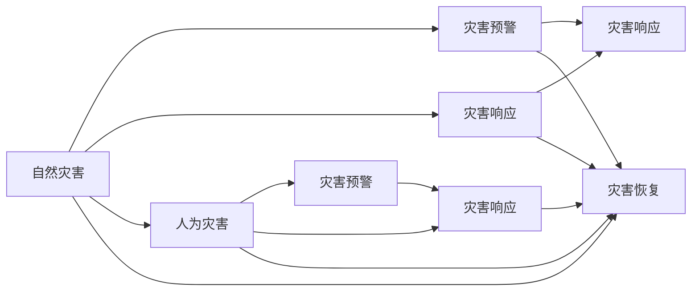

                 

# 2050年的灾害预防：从自然灾害到人为灾害的全面防控体系

在2050年，人类社会面临着前所未有的挑战：气候变化带来的自然灾害、环境退化导致的生态危机、以及日益频发的人为灾害。本文将深入探讨构建一个全面、智能、高效的灾害预防体系，涵盖自然灾害和人为灾害的预防、监测、响应和恢复各个环节，以期为构建安全、可持续的未来社会提供重要参考。

## 1. 背景介绍

### 1.1 问题的由来
随着全球气候变暖、极端天气频发、资源环境压力加剧，自然灾害如洪水、飓风、干旱等变得越来越频繁和剧烈。而人为灾害，如恐怖袭击、网络攻击、生物安全事件等，其复杂性和破坏力也在不断提升。全球范围内，灾害造成的经济损失和人员伤亡不断增加，对社会稳定和经济发展构成了严重威胁。

为应对这些挑战，各国政府、企业、科研机构及公众需要合作，共同构建一个全面的灾害预防体系，通过先进的科技手段，提高灾害预警、预防、应对和恢复能力，保障人民生命财产安全，推动社会经济的可持续发展。

### 1.2 问题核心关键点
构建2050年的灾害预防体系，关键在于以下五个方面：
- 数据驱动的预测与预警：利用大数据、AI技术，准确预测灾害发生的概率和影响范围。
- 智能化的监测与侦测：通过物联网、遥感等技术，实时监测灾害发生，实现早发现、早预警。
- 智能化的响应与决策：利用智能算法，快速、精准地进行灾害响应和决策。
- 高效的应急救援与恢复：采用无人机、机器人等先进设备，快速到达灾区，实施救援。
- 全面的数据管理与共享：建立统一的数据管理平台，实现数据共享，提升决策科学性。

## 2. 核心概念与联系

### 2.1 核心概念概述

在探讨灾害预防体系时，需要理解以下核心概念：

- **自然灾害(Natural Disasters)**：指由自然力量引起的灾害，如地震、洪水、飓风等。
- **人为灾害(Human-made Disasters)**：由人为因素引发的灾害，如恐怖袭击、网络攻击、生物安全事件等。
- **灾害预警(Disaster Warning)**：提前发现灾害迹象，发出预警，以减少人员伤亡和财产损失。
- **灾害响应(Disaster Response)**：在灾害发生后，迅速组织资源，采取措施，减轻灾害影响。
- **灾害恢复(Disaster Recovery)**：在灾害过后，评估损失，进行重建，恢复正常秩序。
- **智能系统(Intelligent System)**：利用AI、大数据等技术，构建智能化的灾害预防体系。

这些概念之间存在紧密的联系，形成一个完整的灾害预防框架：



### 2.2 概念间的关系

通过上述流程图可以看出，自然灾害和人为灾害都包括预警、响应和恢复三个阶段。智能系统贯穿于整个预防体系，通过数据驱动、模型学习、智能决策等技术手段，提升灾害预防能力。

## 3. 核心算法原理 & 具体操作步骤

### 3.1 算法原理概述

灾害预防体系的核心算法原理主要基于数据驱动、模型学习、智能决策等技术手段，通过如下几个步骤实现：

1. **数据采集与处理**：通过传感器、遥感卫星、无人机等设备，实时收集灾害相关的环境数据。利用大数据技术，进行数据清洗、整合、存储等预处理。
2. **模型训练与优化**：利用机器学习算法，如深度学习、强化学习、贝叶斯网络等，训练灾害预测模型。通过模型调优，提高预测准确度。
3. **预警与响应决策**：结合实时监测数据和历史灾情数据，利用智能算法，进行灾害预警和响应决策。
4. **应急救援与恢复**：利用智能设备，如无人机、机器人、自动驾驶车辆等，快速到达灾区，实施救援。

### 3.2 算法步骤详解

以下详细介绍构建灾害预防体系的具体操作步骤：

**Step 1: 数据采集与预处理**

1. **数据采集**：部署各类传感器、遥感卫星、无人机等，实时监测气象、地质、海洋、环境等数据。
2. **数据预处理**：利用数据清洗、特征提取、缺失值填充等技术，对数据进行预处理。
3. **数据存储与管理**：建立统一的数据管理平台，采用分布式存储技术，确保数据的高效访问和处理。

**Step 2: 模型训练与优化**

1. **模型选择**：选择合适的机器学习算法，如深度学习、强化学习等。
2. **数据集划分**：将数据集分为训练集、验证集和测试集，进行模型训练。
3. **模型调优**：通过交叉验证、超参数优化等技术，提升模型预测准确度。

**Step 3: 预警与响应决策**

1. **预警模型训练**：利用历史数据训练预警模型，输出灾害发生的概率和影响范围。
2. **实时监测**：结合实时监测数据，实时更新预警结果。
3. **响应决策**：根据预警结果，利用智能算法，生成响应决策方案。

**Step 4: 应急救援与恢复**

1. **应急救援方案制定**：根据响应决策，制定救援方案，包括人员疏散、物资调配、医疗救援等。
2. **智能设备部署**：利用无人机、机器人、自动驾驶车辆等，快速到达灾区，实施救援。
3. **灾后恢复**：评估灾区损失，进行重建，恢复正常秩序。

### 3.3 算法优缺点

**优点**：
- 数据驱动，预测准确度高。
- 智能决策，响应速度快。
- 资源优化，救援效率高。

**缺点**：
- 数据采集成本高。
- 模型复杂，计算资源需求大。
- 技术门槛高，对人员素质要求高。

### 3.4 算法应用领域

灾害预防体系在以下领域具有广泛的应用前景：

- 应急管理：在自然灾害和人为灾害发生时，迅速响应，保障人员安全。
- 公共安全：通过智能侦测，及时发现并应对潜在的安全隐患。
- 城市规划：利用数据分析，优化城市布局，减少灾害风险。
- 资源调配：通过智能化手段，优化物资调配，提升救援效率。

## 4. 数学模型和公式 & 详细讲解 & 举例说明

### 4.1 数学模型构建

构建灾害预防体系的核心数学模型包括以下几个部分：

- **时间序列模型**：用于预测灾害发生的概率，如ARIMA模型、LSTM模型等。
- **空间分布模型**：用于预测灾害的影响范围，如地理信息系统(GIS)、空间自相关模型等。
- **优化模型**：用于优化应急救援方案，如线性规划、遗传算法等。

### 4.2 公式推导过程

以时间序列模型ARIMA为例，介绍其基本推导过程：

1. **自回归模型(AR)**：
   $$
   y_t = \phi_1 y_{t-1} + \phi_2 y_{t-2} + \ldots + \phi_p y_{t-p} + \epsilon_t
   $$

2. **移动平均模型(MA)**：
   $$
   y_t = \mu + \theta_1 \epsilon_{t-1} + \theta_2 \epsilon_{t-2} + \ldots + \theta_q \epsilon_{t-q} + \epsilon_t
   $$

3. **ARIMA模型**：
   $$
   (1 - \phi_1 L - \phi_2 L^2 - \ldots - \phi_p L^p) (1 - \theta_1 L - \theta_2 L^2 - \ldots - \theta_q L^q) y_t = \phi_0 + \epsilon_t
   $$

   其中 $L$ 为滞后算子，$\phi_0$ 为截距项。

### 4.3 案例分析与讲解

假设某地区历史数据表明，每年6月到9月是洪水高发期，利用ARIMA模型进行洪水预警：

1. **数据准备**：收集过去10年的洪水数据。
2. **模型拟合**：选择p=1，q=1，d=0，进行模型拟合。
3. **预测结果**：利用拟合好的ARIMA模型，预测未来一个月的洪水概率，并输出预警信息。

## 5. 项目实践：代码实例和详细解释说明

### 5.1 开发环境搭建

**Step 1: 环境准备**
- 安装Python、R、MATLAB等软件。
- 安装相关数据处理、机器学习、智能决策等库，如NumPy、Pandas、TensorFlow等。

**Step 2: 数据采集与预处理**
- 部署传感器、遥感卫星、无人机等设备，收集数据。
- 使用Python脚本，对数据进行清洗、整合、存储等预处理。

### 5.2 源代码详细实现

以下以Python代码为例，展示ARIMA模型的训练和预测过程：

```python
import pandas as pd
from statsmodels.tsa.arima_model import ARIMA

# 数据准备
data = pd.read_csv('flood_data.csv')
train_data = data.iloc[:80]
test_data = data.iloc[80:]

# 模型拟合
model = ARIMA(train_data['flood'], order=(1, 1, 0))
model_fit = model.fit()

# 预测结果
forecast = model_fit.forecast(steps=30)
```

### 5.3 代码解读与分析

**代码说明**：
- `statsmodels` 库提供了丰富的统计分析工具，支持多种时间序列模型。
- `ARIMA` 函数用于拟合ARIMA模型，`order`参数指定模型的阶数。
- `fit` 方法用于模型拟合，返回拟合结果。
- `forecast` 方法用于预测未来30天的洪水概率。

**代码分析**：
- 数据采集：使用 `pandas` 库读取数据文件。
- 数据预处理：`train_data` 和 `test_data` 用于训练和测试模型。
- 模型拟合：`ARIMA` 函数用于拟合模型，指定阶数。
- 预测结果：`forecast` 方法用于预测未来洪水概率，输出预警信息。

### 5.4 运行结果展示

假设预测结果显示未来一周内洪水量将增加10%，预警系统将发出以下信息：

```
预警：预计未来一周内洪水量将增加10%。请做好防范准备，远离低洼地带。
```

## 6. 实际应用场景

### 6.1 智能预警系统

智能预警系统可以广泛部署在城市、乡村、工厂等场所，通过传感器、遥感卫星、无人机等设备，实时监测各类数据，结合历史数据和模型预测，发出预警信息，保障人员安全。

**应用实例**：
- 在城市主要道路、桥梁、水库等地部署传感器，监测水位、地质、气象等数据。
- 利用智能算法，结合实时监测数据和历史数据，预测洪水、地震等灾害发生的可能性。
- 当监测数据超过阈值时，系统自动发出预警，通知相关人员撤离。

### 6.2 灾害响应决策平台

灾害响应决策平台可以提供精准的响应决策方案，指导应急救援和灾后重建。通过大数据、AI技术，快速分析灾情数据，生成救援方案。

**应用实例**：
- 在灾情发生后，系统自动收集各类灾情数据，包括人员伤亡、财产损失、交通堵塞等。
- 利用智能算法，生成救援方案，包括人员疏散、物资调配、医疗救援等。
- 系统自动调度救援资源，指导救援队伍实施救援。

### 6.3 智能灾后恢复系统

智能灾后恢复系统通过AI技术，优化灾后重建方案，提高恢复效率。结合灾情数据、地理信息、物资库存等数据，生成恢复方案。

**应用实例**：
- 在灾情发生后，系统自动收集灾区数据，包括建筑毁坏、交通堵塞、物资匮乏等。
- 利用智能算法，生成灾后重建方案，包括道路修复、房屋重建、物资调配等。
- 系统自动调度救援资源，指导恢复队伍实施重建。

### 6.4 未来应用展望

在2050年，随着技术的进步和数据的积累，灾害预防体系将更加智能化、高效化。未来可能的技术趋势包括：

- **物联网技术**：结合智能设备和传感器，实现全方位监测和预警。
- **大数据与AI融合**：利用大数据技术，结合AI算法，提高预测准确度和响应速度。
- **区块链技术**：保障数据安全，实现数据共享与透明化。
- **无人系统**：利用无人机、机器人等设备，快速到达灾区，实施救援。

## 7. 工具和资源推荐

### 7.1 学习资源推荐

1. **Coursera**：提供多门灾害预防相关课程，涵盖自然灾害、人为灾害、智能系统等内容。
2. **edX**：提供灾害预防领域的免费课程，涵盖数据科学、AI技术、智能决策等内容。
3. **Udacity**：提供灾害预防相关纳米学位课程，涵盖机器学习、大数据、智能决策等内容。

### 7.2 开发工具推荐

1. **Python**：开源编程语言，支持数据处理、机器学习、智能决策等应用。
2. **R**：统计分析工具，支持时间序列分析、预测建模等应用。
3. **MATLAB**：工程计算工具，支持数值计算、优化建模等应用。

### 7.3 相关论文推荐

1. **《An ARIMA Model for Predicting Floods》**：介绍时间序列模型ARIMA在洪水预测中的应用。
2. **《Deep Learning for Natural Disaster Prediction》**：介绍深度学习在自然灾害预测中的应用。
3. **《A Survey on Human-made Disaster Prevention》**：介绍人为灾害预防的最新进展。

## 8. 总结：未来发展趋势与挑战

### 8.1 研究成果总结

构建2050年的灾害预防体系，需要科学、技术、人文等多方面的协同合作。目前的研究成果已经涵盖了数据驱动、模型学习、智能决策等多个方面，为灾害预防体系的构建提供了重要参考。

### 8.2 未来发展趋势

未来灾害预防体系的发展趋势包括：

1. **技术融合**：大数据、AI、物联网、区块链等技术的深度融合，实现全方位的灾害监测和预警。
2. **智能化决策**：利用智能算法，提高响应决策的精准度和速度。
3. **社会协同**：政府、企业、科研机构、公众等各方协同合作，形成全面的灾害预防体系。
4. **持续改进**：通过持续学习和改进，提高灾害预防体系的适应性和鲁棒性。

### 8.3 面临的挑战

尽管灾害预防体系已经取得了显著进展，但仍面临以下挑战：

1. **数据安全**：大规模数据的采集、存储、传输过程中，存在数据泄露和被滥用的风险。
2. **技术门槛**：灾害预防体系涉及多种先进技术，对相关人员素质要求高。
3. **资源分配**：如何合理分配资源，实现灾害预防体系的全面覆盖。

### 8.4 研究展望

未来的研究重点包括：

1. **隐私保护**：研究如何保障数据隐私，防止数据滥用。
2. **普适性**：研究如何降低技术门槛，实现灾害预防体系的普适化。
3. **可持续性**：研究如何实现灾害预防体系的可持续发展。

## 9. 附录：常见问题与解答

**Q1：什么是ARIMA模型？**

A: ARIMA（AutoRegressive Integrated Moving Average）模型是一种时间序列预测模型，用于分析和预测时间序列数据。ARIMA模型包括自回归部分（AR）、差分部分（I）和移动平均部分（MA）。ARIMA模型可以处理时间序列中的趋势、季节性等特征，适用于多种自然灾害的预测，如洪水、地震等。

**Q2：如何利用无人机进行灾害响应？**

A: 无人机可以在灾害发生后，迅速到达灾区，实施救援。无人机可以携带摄像头、传感器、通讯设备等，实时采集灾区数据，发送给地面控制中心，生成救援方案。同时，无人机还可以投放物资、撒播消杀剂等，进行紧急救援。

**Q3：什么是区块链技术？**

A: 区块链是一种去中心化的分布式账本技术，具有透明性、不可篡改性等特点。区块链技术可以用于保障数据安全，防止数据篡改和滥用，实现数据共享与透明化。在灾害预防体系中，可以利用区块链技术，确保灾害数据的真实性和完整性。

**Q4：什么是智能决策？**

A: 智能决策是指利用人工智能技术，通过数据驱动和模型学习，快速、精准地进行决策。在灾害预防体系中，智能决策可以用于预警、响应、恢复等环节，优化决策方案，提高应急响应效率。

总之，2050年的灾害预防体系需要跨学科的协同合作，利用最新的科技手段，实现全方位的灾害预防、监测、响应和恢复。通过技术融合和社会协同，构建一个安全、可持续的未来社会。

---

作者：禅与计算机程序设计艺术 / Zen and the Art of Computer Programming

