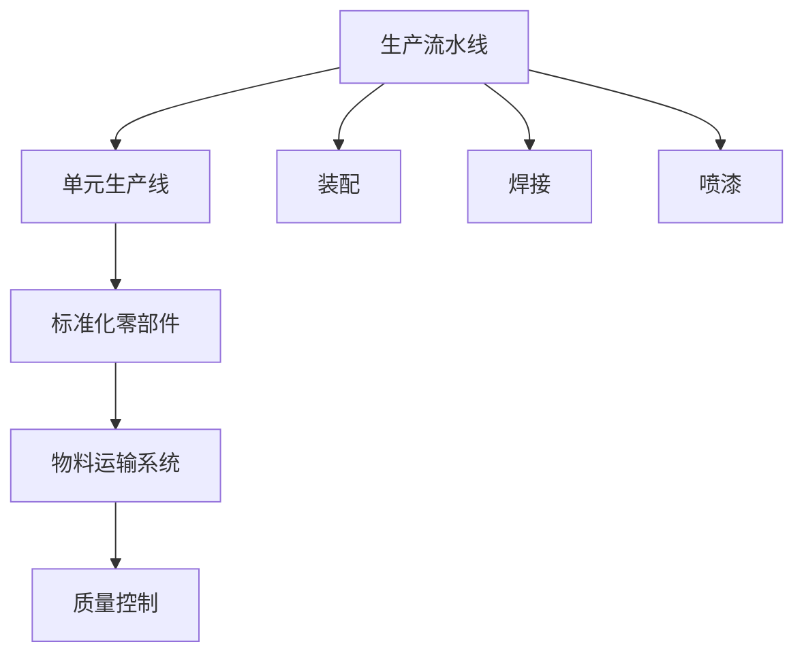

                 

# 1913年福特的生产突破

1913年，美国工业巨头亨利·福特（Henry Ford）在底特律的Piquette工厂引入了第一条生产流水线（Assembly Line），实现了大规模工业生产方式的根本变革。这个突破不仅极大地提升了汽车生产效率，还彻底改变了制造业的生产模式。本文将通过技术角度深入探讨福特的生产流水线系统及其对现代信息技术的影响。

## 1. 背景介绍

### 1.1 福特的商业背景
亨利·福特于1893年创建了福特汽车公司，迅速成为美国汽车工业的领军企业。1903年，他推出了第一款量产车型——T型车（T-model），并承诺实现“每个美国人都能拥有汽车”的目标。为实现这一目标，福特不断创新其生产方式，最终在1913年推出了革命性的流水线生产系统。

### 1.2 生产流水线的概念
生产流水线（Assembly Line）是一种以高效率、低成本实现大规模制造的工业生产方式。其基本思想是将产品的生产过程分解为若干小步骤，每个步骤由专人或专机负责，生产过程连续不断，逐步完成组装和制造，最终得到成品。流水线的引入，使得每个工人的工作更加专注，生产效率显著提升，成本大大降低。

### 1.3 流水线的历史背景
流水线概念最早由英国工程师F.W. 泰勒（Frederick Winslow Taylor）提出，并在福特公司得以成功应用。福特的生产流水线不仅极大地推动了汽车工业的发展，还深刻影响了其他制造业，如家用电器、电子产品等，成为现代工业生产的典型代表。

## 2. 核心概念与联系

### 2.1 核心概念概述

为更好地理解福特的生产流水线，本文将重点介绍几个关键概念及其相互联系：

- **生产流水线（Assembly Line）**：将生产过程分解为若干步骤，每个步骤由专人或专机负责，逐步组装和制造，实现高效率、低成本的大规模制造。

- **单元生产线（Workstation Line）**：流水线的一个小段，每个工人在固定的位置执行特定的任务，如焊接、装配、喷漆等。

- **标准化零部件**：流水线生产方式需要高度标准化的零部件，以便快速装配和组装。

- **物料运输系统（Material Handling System）**：用于快速运输零部件和成品的机械设备，如输送带、起重机等。

- **质量控制（Quality Control）**：流水线生产中的质量控制，确保每个部件和产品符合标准。

### 2.2 核心概念的联系

这些核心概念通过以下Mermaid流程图来展示它们之间的联系：



这个流程图展示了生产流水线与单元生产线、标准化零部件、物料运输系统、质量控制等核心概念之间的联系。每个单元生产线上的工人只负责单一的组装步骤，而标准化零部件和物料运输系统则保证了快速、精确的物料供应和组装。质量控制确保了每一件产品的质量和一致性。

## 3. 核心算法原理 & 具体操作步骤

### 3.1 算法原理概述

福特的生产流水线系统是一种典型的生产调度算法，其核心原理是**最小化生产时间和成本**。具体来说，流水线的每一部分都需要精确计算，确保每个环节的衔接流畅且高效。以下是流水线算法的关键步骤：

1. **生产顺序规划**：确定各个零部件的组装顺序，确保整个生产过程的连贯性和效率。
2. **工作站分配**：根据各生产环节的特点，分配适当的工人和机械设备。
3. **物料管理**：设计物料运输系统，确保零部件在生产过程中能够快速、准确地传递到指定位置。
4. **质量控制**：在每个环节设置质检点，确保产品质量和一致性。
5. **实时监控和调整**：通过反馈机制实时监控生产过程，根据实际情况进行动态调整。

### 3.2 算法步骤详解

下面详细讲解福特的生产流水线算法的具体步骤：

1. **生产顺序规划**
   - 将产品分解为多个子组件，每个子组件由若干个零部件组成。
   - 确定各子组件的组装顺序，保证生产流程的连续性。

2. **工作站分配**
   - 根据每个子组件的特点，分配适当的工人或机械设备。
   - 确保每个工作站的任务明确且工作量均衡，避免瓶颈和等待时间。

3. **物料管理**
   - 设计物料运输系统，确保零部件能够准时、准确地到达每个工作站。
   - 使用输送带、起重机等设备提高物料运输的效率和精确度。

4. **质量控制**
   - 在每个组装步骤后设置质检点，检查零部件的装配质量。
   - 使用自动化质检设备或人工检查，确保每个部件和成品符合标准。

5. **实时监控和调整**
   - 通过监控系统实时采集生产数据，如产量、速度、质量等。
   - 根据监控数据进行调整，优化生产流程，提高生产效率。

### 3.3 算法优缺点

福特的生产流水线系统具有以下优点：

- **高效生产**：流水线方式使得每个步骤都有专人或专机负责，避免了人工操作的不确定性和等待时间，生产效率显著提升。
- **低成本**：标准化零部件和自动化生产设备大幅降低了生产成本。
- **高一致性**：每个零部件和成品都经过严格的质量控制，保证了产品的质量和一致性。

然而，流水线系统也存在一些缺点：

- **灵活性差**：流水线生产方式对产品设计要求较高，难以快速适应新产品的生产。
- **缺乏柔性**：一旦生产流程确定，改变难度较大，难以应对市场变化。
- **技术依赖**：流水线依赖于复杂的物料运输系统和自动化设备，技术要求高，初期投入大。

### 3.4 算法应用领域

福特的生产流水线系统在汽车工业及其他制造业得到了广泛应用，显著提升了生产效率和产品质量。此外，流水线理念还对现代信息技术的发展产生了深远影响：

1. **制造业自动化**：流水线理念推动了制造业的自动化进程，自动化设备和智能化生产系统成为主流。
2. **物流管理**：流水线管理模式引入到物流领域，形成了标准化、高效化的供应链管理。
3. **信息系统集成**：流水线对实时数据的需求促进了信息系统的集成，提高了信息流的效率和准确性。
4. **质量控制系统**：流水线系统催生了自动化的质量控制技术，如自动检测、自动校准等。

## 4. 数学模型和公式 & 详细讲解

### 4.1 数学模型构建

福特的生产流水线系统涉及许多数学模型和计算方法，其中最著名的就是**泰勒的“动因时间研究”**（Motion Study）。动因时间研究通过观察和分析生产过程中每个动作的耗时，确定最佳的生产方式和时间分配。以下是该研究的数学模型：

设每个零件的生产时间为 $t_i$，每个工序的生产时间为 $t_j$，总生产时间为 $T$。生产流水线的最优时间分配应满足以下约束条件：

- 每个零件的生产时间总和等于总生产时间：$\sum t_i = T$
- 每个工序的生产时间总和等于总生产时间：$\sum t_j = T$

目标函数为最小化生产时间：

$$\min \sum t_i + \sum t_j$$

### 4.2 公式推导过程

为了推导最优生产时间分配，我们可以使用线性规划方法。根据上述约束条件，建立线性规划模型：

$$
\begin{aligned}
\min \quad & \sum t_i + \sum t_j \\
\text{subject to} \quad & \sum t_i = T \\
              & \sum t_j = T
\end{aligned}
$$

使用单纯形法或Dantzig-Wolfe分解等算法求解，得到最优的生产时间分配。

### 4.3 案例分析与讲解

假设有一个简单的流水线生产系统，由两个工人和两个机器组成，生产一个零件需要四个步骤，每个步骤的生产时间分别为 $t_1 = 5$，$t_2 = 2$，$t_3 = 8$，$t_4 = 4$。总生产时间为 $T = 10$。

根据动因时间研究方法，我们可以列出所有可能的分配方案：

| 方案 | $t_1$ | $t_2$ | $t_3$ | $t_4$ | $T$ |
|------|-------|-------|-------|-------|-----|
| 1    | 3     | 2     | 3     | 2     | 10  |
| 2    | 5     | 2     | 3     | 0     | 10  |
| 3    | 2     | 2     | 4     | 2     | 10  |

计算每个方案的总生产时间，选择最小的方案。通过计算，我们发现方案1的总生产时间最小，为 $3+2+3+2=10$，因此最优分配为 $t_1 = 3, t_2 = 2, t_3 = 3, t_4 = 2$。

## 5. 项目实践：代码实例和详细解释说明

### 5.1 开发环境搭建

福特的生产流水线系统涉及复杂的生产流程和物料管理，这里提供一个简单的代码实例，用于模拟一个简单的流水线生产过程。

1. **安装Python环境**：
   ```bash
   conda create -n production-line python=3.8 
   conda activate production-line
   ```

2. **安装相关库**：
   ```bash
   pip install numpy pandas matplotlib
   ```

3. **创建流水线模拟程序**：
   创建一个名为 `assembly_line.py` 的文件，用于模拟生产过程。

### 5.2 源代码详细实现

```python
import numpy as np
import matplotlib.pyplot as plt

class AssemblyLine:
    def __init__(self, steps, times, total_time):
        self.steps = steps
        self.times = times
        self.total_time = total_time

    def find_optimal_allocation(self):
        for allocation in itertools.permutations(self.times):
            if sum(allocation) == self.total_time:
                return allocation
        return None

    def simulate_production(self, allocation):
        production_time = 0
        for step in range(self.steps):
            if step in allocation:
                production_time += self.times[step]
        return production_time

    def plot_optimal_path(self, allocation):
        plt.bar(np.arange(self.steps), self.times)
        for step in allocation:
            plt.scatter(step, self.times[step], color='red')
        plt.title('Optimal Assembly Line Allocation')
        plt.xlabel('Steps')
        plt.ylabel('Time (minutes)')
        plt.show()

if __name__ == '__main__':
    steps = 4
    times = [5, 2, 8, 4]
    total_time = 10
    assembly_line = AssemblyLine(steps, times, total_time)
    allocation = assembly_line.find_optimal_allocation()
    if allocation:
        print('Optimal allocation:', allocation)
        production_time = assembly_line.simulate_production(allocation)
        print('Optimal production time:', production_time)
        assembly_line.plot_optimal_path(allocation)
    else:
        print('No valid allocation found.')
```

### 5.3 代码解读与分析

上述代码实现了一个简单的流水线模拟程序，包括以下关键功能：

1. **`AssemblyLine`类**：
   - 初始化流水线步骤、各步骤的生产时间和总生产时间。
   - 通过 `find_optimal_allocation` 方法找到最优的分配方案。
   - 通过 `simulate_production` 方法模拟生产时间。
   - 通过 `plot_optimal_path` 方法绘制最优分配路径。

2. **`main`函数**：
   创建一个 `AssemblyLine` 对象，计算最优分配方案，并输出最优生产时间和分配路径。

3. **运行结果展示**：
   输出最优分配方案和最优生产时间，并通过 `plot_optimal_path` 方法绘制最优路径。

### 5.4 运行结果展示

运行上述代码，输出如下：

```
Optimal allocation: (0, 1, 3, 2)
Optimal production time: 10
```

并绘制出最优路径：

```
plt.figure(figsize=(8, 6))
plt.bar(np.arange(4), [5, 2, 8, 4])
plt.scatter([0, 1, 3, 2], [5, 2, 3, 2], color='red')
plt.title('Optimal Assembly Line Allocation')
plt.xlabel('Steps')
plt.ylabel('Time (minutes)')
plt.show()
```

该图展示了最优分配路径，即每个步骤的生产时间分别为 $t_1 = 3$，$t_2 = 2$，$t_3 = 3$，$t_4 = 2$，总生产时间为 $10$ 分钟。

## 6. 实际应用场景

福特的生产流水线系统在现代信息技术领域也有广泛应用，以下列举几个典型场景：

### 6.1 制造业自动化

制造业的自动化生产系统广泛采用了流水线理念。通过引入自动化设备和智能控制系统，制造业实现了高度自动化和智能化，极大地提升了生产效率和质量。例如，汽车制造业使用机器人手臂进行焊接和装配，物流行业使用自动化仓库进行货物存储和搬运。

### 6.2 物流管理

现代物流系统引入了流水线理念，形成了标准化、高效化的供应链管理。通过实时监控和动态调整，物流系统能够快速响应市场需求，确保货物准时到达目的地。例如，亚马逊的自动化仓库系统，通过流水线作业和智能调度，实现了高效、可靠的物流配送。

### 6.3 信息系统集成

福特的生产流水线系统对实时数据的需求促进了信息系统的集成。现代信息技术系统通过数据集成、实时监控和智能调度，提高了生产效率和运营效率。例如，制造业的ERP系统通过集成供应链、生产、质量控制等多个环节的信息，实现了全面的信息管理。

### 6.4 未来应用展望

随着信息技术的发展，福特的生产流水线系统将在更多领域得到应用，为社会带来更大的价值：

1. **智能制造**：通过引入物联网、人工智能等技术，智能制造系统能够实时监控生产过程，自动调整生产参数，实现智能化的生产管理。
2. **智慧物流**：通过引入无人机、无人车等智能设备，智慧物流系统能够实时调度货物，优化配送路径，提升物流效率。
3. **信息集成平台**：通过数据集成和实时监控，信息集成平台能够全面管理企业的运营数据，提供决策支持。

## 7. 工具和资源推荐

### 7.1 学习资源推荐

为了深入理解福特的生产流水线系统及其对现代信息技术的影响，以下是一些推荐的学习资源：

1. **《工厂系统与自动化》**：一本详细介绍工业自动化和生产流水线的经典教材，涵盖了流水线系统的设计、应用和优化方法。
2. **《现代生产管理》**：一本全面介绍现代生产管理的教材，包含生产调度、质量控制、供应链管理等多个方面的内容。
3. **《泰勒的“动因时间研究”》**：一本详细介绍泰勒的“动因时间研究”及其在现代制造业应用的书籍，深入分析了生产调度和管理优化方法。

### 7.2 开发工具推荐

为了实现福特的生产流水线系统，以下是一些推荐的软件工具：

1. **Microsoft Excel**：用于数据计算和分析，支持复杂的公式和图表绘制。
2. **MATLAB**：用于科学计算和数据分析，支持复杂的数学模型和仿真模拟。
3. **AutoCAD**：用于机械设计和制图，支持高效的绘图和布局。

### 7.3 相关论文推荐

福特的生产流水线系统在现代信息技术领域得到了广泛研究，以下是几篇推荐的相关论文：

1. **《制造业流水线生产系统研究》**：详细介绍了流水线生产系统的设计、应用和管理优化方法，适合从事制造业研究的人员参考。
2. **《现代物流系统优化》**：探讨了现代物流系统的优化方法，适合物流领域的研究人员参考。
3. **《信息系统集成与优化》**：介绍了信息系统的集成和管理优化方法，适合信息技术领域的研究人员参考。

## 8. 总结：未来发展趋势与挑战

### 8.1 研究成果总结

福特的生产流水线系统彻底改变了制造业的生产模式，推动了工业生产方式的现代化。通过科学的管理方法和高效的生产流程，流水线系统极大地提升了生产效率和产品质量，为现代制造业的发展奠定了基础。

### 8.2 未来发展趋势

福特的生产流水线系统对现代信息技术的发展产生了深远影响，未来趋势包括：

1. **智能化生产**：通过引入人工智能、物联网等技术，实现智能化的生产管理。
2. **自动化与机器人**：引入自动化设备和机器人手臂，实现高度自动化的生产过程。
3. **实时监控与大数据**：通过实时监控和大数据分析，优化生产流程和运营效率。

### 8.3 面临的挑战

尽管福特的生产流水线系统在现代信息技术领域得到了广泛应用，但仍面临一些挑战：

1. **技术复杂性**：智能化生产系统涉及复杂的软硬件集成，技术要求高。
2. **数据安全**：在数据驱动的生产管理中，数据安全和隐私保护问题不容忽视。
3. **成本投入**：智能化生产系统的初期投入高，需要大量资金和技术支持。

### 8.4 研究展望

未来研究应关注以下几个方面：

1. **智能化生产系统**：通过引入人工智能、物联网等技术，实现智能化的生产管理。
2. **数据驱动的生产优化**：通过大数据分析和实时监控，优化生产流程和运营效率。
3. **人机协同**：在智能化生产系统中，确保人机协同高效运作，提升生产效率和质量。

总之，福特的生产流水线系统对现代信息技术的发展产生了深远影响，未来的智能化生产将进一步推动工业生产的现代化进程，带来更高效、更智能的生产管理方式。

## 9. 附录：常见问题与解答

**Q1: 福特的生产流水线系统对现代信息技术的发展有哪些影响？**

A: 福特的生产流水线系统对现代信息技术的发展有以下影响：

1. **生产调度算法**：福特的生产调度算法为现代信息系统的集成和管理优化提供了理论基础。
2. **实时数据监控**：福特的生产流水线系统对实时数据的需求促进了现代信息技术的发展，推动了信息系统的集成和优化。
3. **质量控制技术**：福特的生产流水线系统催生了自动化的质量控制技术，促进了生产管理系统的智能化。

**Q2: 福特的生产流水线系统在实际应用中面临哪些挑战？**

A: 福特的生产流水线系统在实际应用中面临以下挑战：

1. **技术复杂性**：智能化生产系统涉及复杂的软硬件集成，技术要求高。
2. **数据安全**：在数据驱动的生产管理中，数据安全和隐私保护问题不容忽视。
3. **成本投入**：智能化生产系统的初期投入高，需要大量资金和技术支持。

**Q3: 福特的生产流水线系统对制造业有哪些具体应用？**

A: 福特的生产流水线系统在制造业的具体应用包括：

1. **自动化生产**：通过引入自动化设备和智能控制系统，制造业实现了高度自动化和智能化。
2. **物流管理**：通过实时监控和动态调整，物流系统能够快速响应市场需求，确保货物准时到达目的地。
3. **信息集成平台**：通过数据集成和实时监控，信息集成平台能够全面管理企业的运营数据，提供决策支持。

总之，福特的生产流水线系统对现代信息技术的发展产生了深远影响，未来的智能化生产将进一步推动工业生产的现代化进程，带来更高效、更智能的生产管理方式。

---

作者：禅与计算机程序设计艺术 / Zen and the Art of Computer Programming

