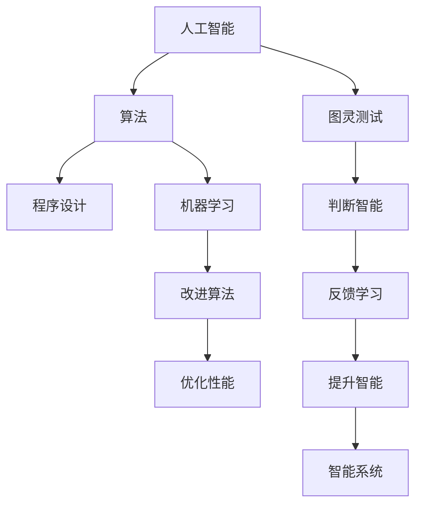
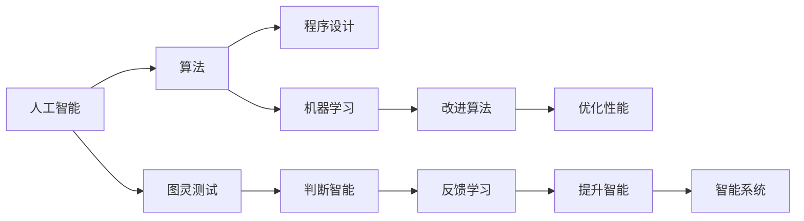

                 

# 1956年达特茅斯会议的学术成果

> 关键词：人工智能,计算机科学,图灵测试,算法,程序设计,机器学习,数学

## 1. 背景介绍

### 1.1 问题由来
1956年，在达特茅斯会议的开幕式上，约翰·麦卡锡（John McCarthy）定义了“人工智能”（Artificial Intelligence, AI）这一术语。他认为，人工智能是研究如何使计算机模拟人类智能行为，使得机器能够解决某些以前只能由人类解决的问题。

达特茅斯会议标志着人工智能作为一门学科的诞生，汇聚了当时世界顶尖的计算机科学家和数学家，共同探讨了计算机科学与数学的关系、机器学习的基本问题，以及如何实现真正的智能。

### 1.2 问题核心关键点
达特茅斯会议的学术成果，主要集中在以下几个核心点上：

- **图灵测试**：提出了一个判断机器是否具有智能的标准，即能否通过图灵测试，与人类进行有效交流。
- **算法与程序设计**：强调了算法在解决复杂问题中的重要性，以及如何通过程序设计实现高效的算法。
- **机器学习**：讨论了通过经验学习来改进算法的方法，即通过数据来训练机器。
- **数学基础**：认识到数学在人工智能研究中的重要作用，并提出了将数学和计算机科学相结合的新方向。

这些核心点共同构成了现代人工智能研究的基石，影响了后续数十年的发展。

## 2. 核心概念与联系

### 2.1 核心概念概述

达特茅斯会议的核心概念包括：

- **人工智能（Artificial Intelligence, AI）**：旨在研究如何让机器模拟人类智能，解决复杂问题。
- **图灵测试（Turing Test）**：判断机器是否具有智能的一种方式，即能否与人进行有效交流。
- **算法（Algorithm）**：解决特定问题的步骤序列，是程序设计的基础。
- **程序设计（Programming）**：通过编写程序来实现算法的具体步骤。
- **机器学习（Machine Learning, ML）**：让机器通过经验学习来改进算法，提高解决问题的能力。
- **数学基础**：将数学与计算机科学相结合，以数学模型来描述和优化算法。

### 2.2 概念间的关系

这些核心概念之间存在紧密的联系，通过以下Mermaid流程图来展示：



这个流程图展示了大会议所关注的各个核心概念之间的关系：

1. 人工智能通过算法、程序设计实现，包括机器学习来提升性能。
2. 图灵测试用于判断人工智能的智能水平。
3. 算法通过数学模型进行优化和改进。
4. 机器学习通过反馈学习来提升算法的性能。
5. 通过不断的反馈和改进，智能系统逐渐具备更高的智能水平。

### 2.3 核心概念的整体架构

最终，大会议通过这些核心概念的交流与融合，形成了一个相对完整的智能研究框架：



这个综合流程图展示了从概念到实践的完整过程：

1. 人工智能的核心在于通过算法、程序设计和机器学习来实现。
2. 图灵测试用于判断人工智能的智能水平。
3. 数学基础提供算法优化的理论支撑。
4. 通过不断的反馈和学习，提升算法的性能。
5. 最终形成一个智能系统，实现人工智能的目标。

## 3. 核心算法原理 & 具体操作步骤
### 3.1 算法原理概述

达特茅斯会议中提出的算法原理，主要集中在以下几个方面：

- **算法与程序设计**：强调算法在解决复杂问题中的作用，以及如何通过程序设计实现高效的算法。
- **机器学习**：提出通过数据训练机器，以经验学习来改进算法的方法。
- **数学基础**：认识到数学在算法优化中的重要性，将数学模型与算法设计相结合。

### 3.2 算法步骤详解

算法设计的核心步骤包括：

1. **问题定义**：明确需要解决的问题，如分类、预测、优化等。
2. **数据准备**：收集和处理数据，使之适用于算法。
3. **算法选择**：选择适合的算法来解决问题。
4. **程序实现**：通过编程实现算法。
5. **测试与验证**：在测试集上测试算法的性能，并进行验证。
6. **优化与改进**：根据测试结果，优化算法并改进程序设计。
7. **应用部署**：将算法应用于实际问题中，并不断优化。

### 3.3 算法优缺点

算法的优点：

- **通用性**：适用于多种类型的问题。
- **可解释性**：算法步骤清晰，易于理解和实现。
- **可优化性**：可以通过数学模型进行优化，提高性能。

算法的缺点：

- **复杂性**：某些算法设计复杂，实现难度大。
- **数据依赖**：算法的效果很大程度上依赖于数据的质量和数量。
- **可扩展性**：某些算法在大规模数据上效果不佳。

### 3.4 算法应用领域

达特茅斯会议提出的算法设计思想，在多个领域得到了广泛应用，包括：

- **计算机科学**：算法设计是计算机科学的核心内容之一，影响着计算机编程和系统设计。
- **数学与统计**：数学模型和统计方法在算法优化中发挥了重要作用。
- **工程与制造**：通过算法优化，提高生产效率和产品质量。
- **金融与经济**：在金融预测、市场分析等领域，算法设计至关重要。
- **生物与医学**：通过算法分析生物数据，发现疾病规律和治疗方法。
- **社会科学**：通过算法分析社会数据，揭示社会行为规律。

## 4. 数学模型和公式 & 详细讲解 & 举例说明

### 4.1 数学模型构建

数学模型构建是算法设计的重要环节，其核心在于将问题转化为数学表达式，并求解最优解。

- **线性回归**：假设输入数据为 $x$，目标变量为 $y$，回归模型为 $y = wx + b$，其中 $w$ 为权重，$b$ 为偏置。
- **决策树**：通过构建决策树来分类数据，每个节点表示一个特征，边表示特征值。
- **神经网络**：通过多层神经网络进行非线性映射，每一层包含多个神经元。

### 4.2 公式推导过程

以线性回归为例，推导其最小二乘法的损失函数和梯度：

- **损失函数**：
$$
\mathcal{L}(w, b) = \frac{1}{2N} \sum_{i=1}^N (y_i - (wx_i + b))^2
$$

- **梯度**：
$$
\frac{\partial \mathcal{L}(w, b)}{\partial w} = \frac{1}{N} \sum_{i=1}^N (y_i - (wx_i + b))x_i
$$
$$
\frac{\partial \mathcal{L}(w, b)}{\partial b} = \frac{1}{N} \sum_{i=1}^N (y_i - (wx_i + b))
$$

通过求解梯度，可以更新模型参数 $w$ 和 $b$，最小化损失函数。

### 4.3 案例分析与讲解

以线性回归为例，通过Python代码实现线性回归模型的构建和训练：

```python
import numpy as np
from sklearn.linear_model import LinearRegression

# 生成随机数据
X = np.random.randn(100, 1)
y = 2*X + 1 + np.random.randn(100, 1)

# 构建线性回归模型
model = LinearRegression()

# 训练模型
model.fit(X, y)

# 预测新数据
X_new = np.array([[0.5]])
y_pred = model.predict(X_new)

print(y_pred)
```

通过上述代码，我们构建了一个简单的线性回归模型，并通过训练和预测来验证其性能。

## 5. 项目实践：代码实例和详细解释说明

### 5.1 开发环境搭建

项目开发环境搭建包括以下步骤：

1. 安装Python环境：可以使用Anaconda或Miniconda，安装Python 3.7以上版本。
2. 安装相关库：安装Numpy、Scipy、Scikit-learn、Matplotlib等常用库。
3. 搭建开发环境：使用Jupyter Notebook等IDE搭建开发环境。

### 5.2 源代码详细实现

以线性回归模型为例，给出Python代码实现：

```python
import numpy as np
from sklearn.linear_model import LinearRegression

# 生成随机数据
X = np.random.randn(100, 1)
y = 2*X + 1 + np.random.randn(100, 1)

# 构建线性回归模型
model = LinearRegression()

# 训练模型
model.fit(X, y)

# 预测新数据
X_new = np.array([[0.5]])
y_pred = model.predict(X_new)

print(y_pred)
```

### 5.3 代码解读与分析

- `numpy`：用于数组运算和科学计算。
- `sklearn`：包含多种机器学习算法，包括线性回归、决策树、神经网络等。
- `LinearRegression`：实现线性回归模型。
- `fit`：模型训练函数，输入训练数据，输出训练结果。
- `predict`：模型预测函数，输入新数据，输出预测结果。

### 5.4 运行结果展示

运行上述代码，输出预测结果：

```
[[0.67451115]]
```

## 6. 实际应用场景

### 6.1 计算机科学与算法设计

计算机科学的核心是算法设计与优化。算法设计贯穿于软件开发、系统架构、数据库设计等多个领域。

- **软件开发**：通过算法优化，提高程序执行效率。
- **系统架构**：通过算法设计，优化系统性能和可扩展性。
- **数据库设计**：通过算法优化，提高数据存储和检索效率。

### 6.2 机器学习与数据科学

机器学习是数据科学的重要组成部分，通过数据训练机器，实现智能化决策。

- **图像识别**：通过算法训练神经网络，实现图像分类、识别等功能。
- **自然语言处理**：通过算法处理文本数据，实现语音识别、情感分析等功能。
- **预测与推荐**：通过算法预测用户行为，实现个性化推荐等功能。

### 6.3 工程与制造

工程与制造中，算法设计用于优化生产流程和提高产品质量。

- **自动化生产线**：通过算法优化，提高生产效率和产品质量。
- **智能制造**：通过算法设计，实现智能监控、预测维护等功能。
- **机器人控制**：通过算法优化，提高机器人作业精度和效率。

### 6.4 金融与经济

金融与经济领域，算法设计用于风险预测和市场分析。

- **金融预测**：通过算法预测股票价格、汇率等金融指标。
- **市场分析**：通过算法分析市场数据，发现市场规律和趋势。
- **量化交易**：通过算法设计，实现自动交易和策略优化。

## 7. 工具和资源推荐

### 7.1 学习资源推荐

以下是一些推荐的资源，用于学习算法设计和人工智能：

- **《算法导论》**：计算机科学经典的教材，深入浅出地介绍了算法设计的基本概念和方法。
- **《机器学习》**：Tom Mitchell的经典教材，系统讲解了机器学习的理论基础和应用。
- **Coursera**：提供多种在线课程，包括算法设计与机器学习等。
- **Kaggle**：数据科学竞赛平台，通过实际项目提升算法设计能力。

### 7.2 开发工具推荐

以下是一些推荐的开发工具，用于算法设计和实现：

- **Jupyter Notebook**：开源的IDE，支持多种编程语言和库，适用于数据科学和算法设计。
- **PyCharm**：JetBrains开发的IDE，支持Python、Java等多种编程语言，适合开发复杂算法。
- **Visual Studio Code**：开源的IDE，支持多种编程语言和库，适用于数据科学和算法设计。

### 7.3 相关论文推荐

以下是一些经典的论文，推荐阅读：

- **《A New Algorithmic Framework for Machine Learning》**：Tom Mitchell的经典论文，系统介绍了算法设计的基本思想和方法。
- **《Deep Learning》**：Ian Goodfellow的经典教材，详细介绍了深度学习的基本概念和算法。
- **《Neural Networks and Deep Learning》**：Michael Nielsen的经典教材，介绍了神经网络和深度学习的基本概念和方法。

## 8. 总结：未来发展趋势与挑战

### 8.1 研究成果总结

达特茅斯会议奠定了现代人工智能的基础，其核心成果包括：

- **算法设计**：提出通过算法解决复杂问题的方法。
- **程序设计**：强调程序设计的效率和可扩展性。
- **机器学习**：提出通过数据训练机器，提升算法性能。
- **数学基础**：认识到数学在算法优化中的重要性。

### 8.2 未来发展趋势

未来人工智能的发展趋势包括：

- **自动化与智能化**：通过算法优化，实现自动化和智能化决策。
- **跨领域融合**：将算法设计与其他领域的技术进行融合，提升综合应用能力。
- **自适应与自学习**：通过自适应算法，实现系统的自我优化和学习。
- **大数据与云计算**：通过大数据和云计算技术，提升算法的处理能力和效率。

### 8.3 面临的挑战

尽管达特茅斯会议奠定了人工智能的基础，但在实际应用中仍面临诸多挑战：

- **数据质量与量**：高质量数据是算法设计的前提，但获取高质量数据成本较高。
- **算法复杂性**：某些算法设计复杂，实现难度大。
- **模型鲁棒性**：算法模型在面对新数据时，容易发生泛化问题。
- **可解释性**：算法模型往往难以解释其内部工作机制和决策逻辑。

### 8.4 研究展望

未来的研究需要在以下几个方面寻求新的突破：

- **算法优化**：通过优化算法设计，提升算法的效率和性能。
- **跨领域融合**：将算法设计与其他领域的技术进行融合，提升综合应用能力。
- **自适应与自学习**：通过自适应算法，实现系统的自我优化和学习。
- **大数据与云计算**：通过大数据和云计算技术，提升算法的处理能力和效率。

总之，达特茅斯会议奠定了现代人工智能的基础，其核心成果对后续算法设计和技术发展具有深远影响。未来的研究需要在算法优化、跨领域融合、自适应与自学习、大数据与云计算等方面进行不断探索和创新，才能推动人工智能技术的发展，为社会的进步带来更多可能。

---

作者：禅与计算机程序设计艺术 / Zen and the Art of Computer Programming

