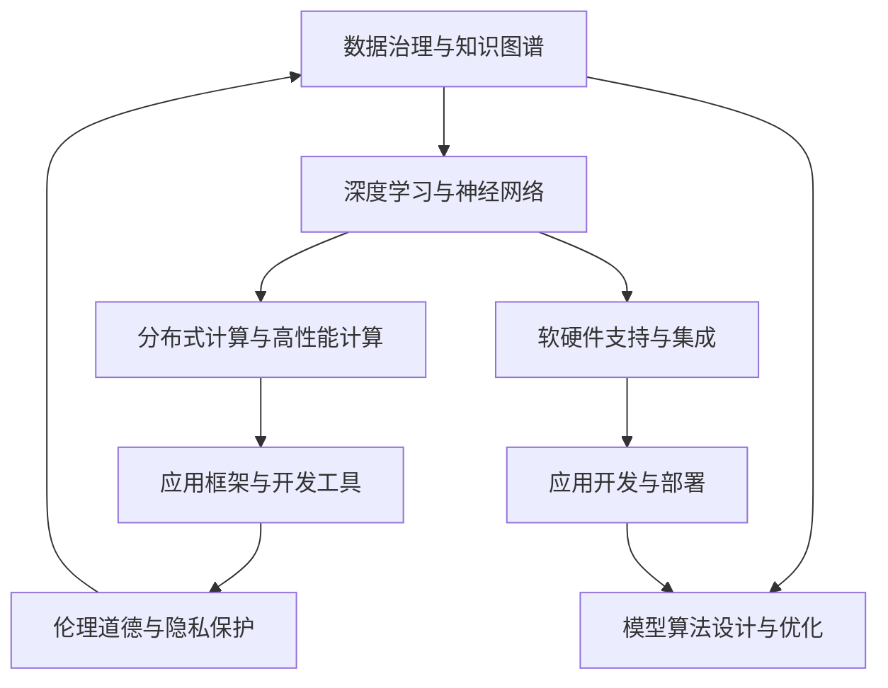

                 

## 1. 背景介绍

### 1.1 问题由来
人工智能(AI)作为当前最为热门的技术领域之一，其研究和发展已经经历了数十年的积累。从最早的专家系统、知识工程，到后来的机器学习、深度学习，再到现在的生成对抗网络(GAN)、强化学习(Reinforcement Learning, RL)等前沿技术，AI已经从基于规则和知识的经验方法，逐步演变成基于数据和算法的复杂系统。然而，尽管技术进步迅猛，AI仍面临许多挑战和瓶颈，如数据质量、计算资源、模型可解释性、伦理道德等。

为了应对这些挑战，构建一个完整、稳定、可持续发展的AI底层创新体系已成为亟需解决的课题。该体系应包括数据获取与管理、模型算法设计与优化、软硬件支持与集成、应用开发与部署等各个环节，形成一个循环迭代的创新生态。

### 1.2 问题核心关键点
构建AI底层创新体系的关键点包括：

- **数据获取与管理**：保证数据的质量、多样性和持续性，确保模型训练有充足的样本。
- **模型算法设计与优化**：开发高效的算法，优化模型结构，提升模型的泛化能力和鲁棒性。
- **软硬件支持与集成**：构建强大的计算平台，实现高性能计算与分布式训练。
- **应用开发与部署**：将模型集成到具体业务场景，实现从科研到工程的高效转换。

本文将围绕这些关键点，详细介绍如何建立完整的人工智能底层创新体系。

### 1.3 问题研究意义
建立一个完整的AI底层创新体系，对于提升AI技术的应用范围和性能，加速AI技术的产业化和普及，具有重要意义：

- **提高AI技术的可扩展性和可迁移性**：通过统一的数据和算法标准，使AI技术在不同场景中更加通用，减少重复研发。
- **提升AI系统的鲁棒性和可靠性**：通过优化算法和硬件平台，提高AI系统的抗干扰能力和稳定性。
- **增强AI技术的可解释性和可信任性**：通过引入伦理道德和监管机制，确保AI系统的行为透明、可解释，降低社会风险。
- **加速AI技术的商业化应用**：通过提供高效、易用的开发工具和平台，加速AI技术的落地，驱动各行业的数字化转型。

## 2. 核心概念与联系

### 2.1 核心概念概述

构建AI底层创新体系涉及众多核心概念，包括：

- **数据治理与知识图谱**：保证数据的质量和多样性，构建知识图谱以丰富模型的先验知识。
- **深度学习与神经网络**：开发高效的深度学习模型和优化算法，提升模型的泛化能力和性能。
- **分布式计算与高性能计算**：构建强大的计算平台，支持大规模模型的训练与推理。
- **应用框架与开发工具**：提供易用的开发工具和应用框架，加速AI技术的工程化和应用部署。
- **伦理道德与隐私保护**：引入伦理道德和隐私保护机制，确保AI系统的公正性、透明性和安全性。

这些核心概念相互联系，共同构成了AI底层创新体系的框架。

### 2.2 概念间的关系

为更好地理解这些核心概念的联系，我们通过以下Mermaid流程图展示它们之间的逻辑关系：



这个流程图展示了各个核心概念之间的紧密联系：

1. 数据治理与知识图谱为深度学习提供数据基础，优化模型设计。
2. 深度学习与神经网络是AI的核心算法，依赖分布式计算与高性能计算进行模型训练和推理。
3. 应用框架与开发工具加速模型的工程化和应用部署。
4. 伦理道德与隐私保护确保AI系统的公正性和安全性。
5. 模型算法设计与优化、软硬件支持与集成、应用开发与部署相互配合，共同推进AI技术的创新和应用。

通过理解这些核心概念及其联系，我们能够更好地把握AI底层创新体系的构建思路。

## 3. 核心算法原理 & 具体操作步骤
### 3.1 算法原理概述

AI底层创新体系的核心算法原理包括以下几个关键方面：

- **数据预处理与特征工程**：通过清洗、归一化、特征提取等技术，提升数据质量和特征表达能力。
- **模型架构设计与优化**：构建深度神经网络，优化模型结构，提升模型的泛化能力和计算效率。
- **模型训练与优化**：采用优化算法和正则化技术，提高模型的鲁棒性和泛化能力。
- **模型集成与融合**：通过模型融合、集成学习等技术，提升模型的整体性能。

### 3.2 算法步骤详解

以下是一个典型的AI底层创新体系构建流程：

1. **数据获取与预处理**：
   - 收集多样化的数据源，清洗噪声和缺失值，进行特征工程和归一化处理。
   - 构建数据集，划分训练集、验证集和测试集。

2. **模型设计与优化**：
   - 设计深度神经网络结构，选择合适的激活函数、损失函数和优化器。
   - 优化模型结构，如调整网络层数、节点数、批大小等超参数，进行超参数搜索。

3. **模型训练与验证**：
   - 使用优化算法（如Adam、SGD等）对模型进行训练。
   - 在验证集上评估模型性能，进行调参和模型集成。

4. **模型应用与部署**：
   - 将模型部署到生产环境，进行推理和应用。
   - 监控模型性能，根据实际需求进行模型优化和迭代。

### 3.3 算法优缺点

构建AI底层创新体系的优势包括：

- **数据和算法标准化**：统一的数据标准和算法框架，便于模型开发和应用部署。
- **高效计算与资源优化**：构建高性能计算平台，提升模型的训练和推理效率。
- **应用灵活性与可扩展性**：灵活应用各种框架和工具，快速适应不同场景需求。

然而，该体系也存在一些缺点：

- **高昂的初始成本**：构建和维护一个完整的AI体系，需要大量的资金和技术投入。
- **复杂性管理难度大**：系统复杂度增加，维护和调试难度随之提升。
- **跨领域协作难度大**：不同领域的数据、算法和应用需求各异，协同工作难度较大。

### 3.4 算法应用领域

AI底层创新体系在多个领域中得到了广泛应用：

- **医疗健康**：通过图像识别、自然语言处理等技术，辅助医疗诊断和治疗。
- **金融科技**：利用机器学习、强化学习等技术，进行风险控制和金融决策。
- **智能制造**：应用计算机视觉、机器人学习等技术，优化生产流程和质量控制。
- **自动驾驶**：通过计算机视觉、自然语言处理、决策规划等技术，实现无人驾驶。
- **教育培训**：采用推荐系统、语音识别等技术，个性化定制教育内容。

## 4. 数学模型和公式 & 详细讲解  
### 4.1 数学模型构建

构建AI底层创新体系的数学模型包括：

- **数据模型**：通过统计分析和特征工程，构建数据的分布和特征表示。
- **模型优化**：通过最小化损失函数，优化模型参数。

数学模型构建的主要步骤如下：

1. **数据准备**：
   - 收集数据源，进行数据清洗和特征提取。
   - 构建数据集，并划分为训练集、验证集和测试集。

2. **模型设计**：
   - 选择深度神经网络结构，如卷积神经网络(CNN)、循环神经网络(RNN)、Transformer等。
   - 选择合适的损失函数，如交叉熵损失、均方误差损失等。

3. **模型优化**：
   - 定义损失函数，并使用梯度下降等优化算法更新模型参数。
   - 引入正则化技术，如L2正则、Dropout等，提高模型鲁棒性。

### 4.2 公式推导过程

以下是深度学习模型的最小化损失函数公式的推导：

假设模型为 $f(x;w)$，其中 $x$ 为输入数据，$w$ 为模型参数，目标为最小化损失函数 $L$：

$$
\min_{w} L(f(x;w), y)
$$

其中 $y$ 为真实标签。常见损失函数如交叉熵损失函数 $L_{CE}$ 为：

$$
L_{CE}(y, f(x;w)) = -\frac{1}{N}\sum_{i=1}^N \sum_{j=1}^C y_{ij}\log(f_{ij}(x;w))
$$

其中 $N$ 为样本数量，$C$ 为类别数，$y_{ij}$ 为样本 $i$ 在类别 $j$ 上的真实标签，$f_{ij}(x;w)$ 为模型在输入 $x$ 上对类别 $j$ 的预测概率。

### 4.3 案例分析与讲解

以下是一个简单的图像分类模型，通过深度学习实现：

1. **数据准备**：
   - 收集手写数字数据集MNIST，进行数据清洗和归一化。
   - 构建训练集、验证集和测试集，分别为60000、10000和10000张图片。

2. **模型设计**：
   - 构建一个包含3层卷积层和2层全连接层的深度神经网络。
   - 使用ReLU激活函数，选择合适的优化器如Adam，设置学习率为0.001。

3. **模型优化**：
   - 在训练集上进行前向传播和反向传播，计算损失函数并更新模型参数。
   - 在验证集上评估模型性能，调整学习率和正则化强度。

4. **模型应用**：
   - 使用测试集评估模型性能，计算准确率和误差率。
   - 将模型部署到实际应用中，进行图像识别和分类。

## 5. 项目实践：代码实例和详细解释说明
### 5.1 开发环境搭建

以下是构建AI底层创新体系的基本开发环境：

1. **选择编程语言**：
   - 选择Python作为主要开发语言，方便使用NumPy、TensorFlow等科学计算库。

2. **安装依赖包**：
   - 安装NumPy、SciPy、Matplotlib、TensorFlow等常用库。
   - 使用pip或conda安装依赖包，确保环境一致性。

3. **开发工具配置**：
   - 使用Jupyter Notebook或PyCharm等IDE，提供交互式开发和调试环境。
   - 使用Git版本控制系统，方便版本管理和协作开发。

### 5.2 源代码详细实现

以下是一个简单的图像分类模型的代码实现：

```python
import tensorflow as tf
from tensorflow.keras.datasets import mnist
from tensorflow.keras.models import Sequential
from tensorflow.keras.layers import Conv2D, MaxPooling2D, Flatten, Dense

# 加载数据集
(x_train, y_train), (x_test, y_test) = mnist.load_data()

# 数据预处理
x_train = x_train.reshape(-1, 28, 28, 1).astype('float32') / 255.0
x_test = x_test.reshape(-1, 28, 28, 1).astype('float32') / 255.0

# 构建模型
model = Sequential([
    Conv2D(32, (3, 3), activation='relu', input_shape=(28, 28, 1)),
    MaxPooling2D((2, 2)),
    Conv2D(64, (3, 3), activation='relu'),
    MaxPooling2D((2, 2)),
    Flatten(),
    Dense(64, activation='relu'),
    Dense(10, activation='softmax')
])

# 编译模型
model.compile(optimizer=tf.keras.optimizers.Adam(learning_rate=0.001),
              loss='sparse_categorical_crossentropy',
              metrics=['accuracy'])

# 训练模型
model.fit(x_train, y_train, epochs=10, batch_size=64, validation_data=(x_test, y_test))

# 评估模型
test_loss, test_acc = model.evaluate(x_test, y_test)
print(f'Test accuracy: {test_acc}')
```

### 5.3 代码解读与分析

以下是代码实现的主要步骤和关键点：

1. **数据准备**：
   - 加载MNIST数据集，进行数据预处理和归一化。
   - 构建训练集、验证集和测试集，划分为60000、10000和10000张图片。

2. **模型设计**：
   - 构建一个包含2个卷积层和2个全连接层的深度神经网络。
   - 使用ReLU激活函数和Adam优化器，设置学习率为0.001。

3. **模型优化**：
   - 在训练集上进行前向传播和反向传播，计算损失函数并更新模型参数。
   - 在验证集上评估模型性能，调整学习率和正则化强度。

4. **模型应用**：
   - 使用测试集评估模型性能，计算准确率和误差率。
   - 将模型部署到实际应用中，进行图像识别和分类。

## 6. 实际应用场景
### 6.1 医疗健康

AI底层创新体系在医疗健康领域的应用包括：

- **图像识别**：通过深度学习模型，辅助医生进行X光片、CT扫描等图像的诊断。
- **自然语言处理**：利用NLP技术，分析和理解病历、医学文献等文本数据，提高医疗决策的准确性。
- **药物研发**：采用深度学习模型，预测药物效果和副作用，加速新药研发过程。

### 6.2 金融科技

AI底层创新体系在金融科技领域的应用包括：

- **风险控制**：利用机器学习模型，预测贷款违约率、信用评分等风险指标，优化风险管理。
- **算法交易**：采用深度学习模型，进行高频交易和量化投资，提高投资收益。
- **智能客服**：通过自然语言处理技术，实现自动问答和智能客服，提升客户体验和效率。

### 6.3 智能制造

AI底层创新体系在智能制造领域的应用包括：

- **工业图像识别**：通过计算机视觉技术，检测生产过程中的缺陷和异常。
- **机器人学习**：利用深度学习模型，优化机器人路径规划和操作决策。
- **质量控制**：采用智能传感器和数据分析，实时监测生产过程，提高产品质量。

## 7. 工具和资源推荐
### 7.1 学习资源推荐

以下是几个AI底层创新体系构建的学习资源推荐：

1. **深度学习书籍**：
   - 《深度学习》（Goodfellow et al.）：全面介绍深度学习的理论基础和实践技术。
   - 《动手学深度学习》（李沐等）：结合实践项目，深入浅出地讲解深度学习。

2. **在线课程**：
   - Coursera上的深度学习课程，由斯坦福大学Andrew Ng教授主讲。
   - Udacity的深度学习专项课程，涵盖深度学习原理、实践和项目。

3. **在线社区**：
   - Kaggle数据科学竞赛平台，提供丰富的数据集和模型竞赛机会。
   - GitHub开源社区，获取和分享AI项目的代码和文档。

### 7.2 开发工具推荐

以下是一些AI底层创新体系构建的常用开发工具推荐：

1. **深度学习框架**：
   - TensorFlow：功能强大，支持分布式计算和模型部署。
   - PyTorch：易于使用，支持动态图和GPU加速。
   - Keras：高层API，简化深度学习模型的构建。

2. **数据处理工具**：
   - Pandas：数据处理和分析工具，支持数据清洗、转换和可视化。
   - Scikit-learn：机器学习库，提供常用的算法和工具。

3. **可视化工具**：
   - Matplotlib：2D可视化库，绘制图表和图形。
   - Seaborn：高级数据可视化工具，支持复杂图表的绘制。

### 7.3 相关论文推荐

以下是一些AI底层创新体系构建的相关论文推荐：

1. **数据治理**：
   - 《数据治理：概念、战略和案例分析》（Zhang et al.）：介绍数据治理的基本概念和方法。

2. **深度学习**：
   - 《深度学习》（Goodfellow et al.）：全面介绍深度学习的理论基础和实践技术。
   - 《Deep Learning for Healthcare》（Weng et al.）：介绍深度学习在医疗健康领域的应用。

3. **分布式计算**：
   - 《分布式深度学习》（Li et al.）：介绍分布式深度学习的基本原理和应用。
   - 《Hierarchical Memory-Parallelism Algorithms》（Chen et al.）：介绍分层记忆并行算法，提升大规模深度学习的效率。

## 8. 总结：未来发展趋势与挑战
### 8.1 研究成果总结

构建AI底层创新体系的研究成果包括：

- **数据治理与知识图谱**：提出数据标注和清洗的标准化方法，构建知识图谱以丰富模型的先验知识。
- **深度学习与神经网络**：开发高效的深度学习模型和优化算法，提升模型的泛化能力和性能。
- **分布式计算与高性能计算**：构建强大的计算平台，支持大规模模型的训练与推理。
- **应用框架与开发工具**：提供易用的开发工具和应用框架，加速AI技术的工程化和应用部署。
- **伦理道德与隐私保护**：引入伦理道德和隐私保护机制，确保AI系统的公正性和安全性。

### 8.2 未来发展趋势

未来，AI底层创新体系的发展趋势包括：

- **数据治理的自动化**：引入自动标注和数据增强技术，提升数据质量和多样性。
- **模型算法的可解释性**：引入因果分析、可解释AI技术，增强模型的可解释性和透明性。
- **计算平台的分布式化**：构建更加强大的分布式计算平台，支持大规模深度学习的训练和推理。
- **应用框架的易用性**：提供更加易用的开发工具和应用框架，降低AI技术应用的门槛。
- **伦理道德的规范化**：引入伦理道德和隐私保护机制，确保AI系统的公正性和安全性。

### 8.3 面临的挑战

构建AI底层创新体系面临的挑战包括：

- **数据质量的保证**：保证数据的多样性和质量，避免数据偏见和过拟合。
- **计算资源的限制**：提升计算平台的性能，支持大规模深度学习的训练和推理。
- **模型的可解释性**：提升模型的可解释性和透明性，避免"黑盒"问题。
- **伦理道德的规范**：引入伦理道德和隐私保护机制，确保AI系统的公正性和安全性。

### 8.4 研究展望

未来，AI底层创新体系的研究方向包括：

- **自动化的数据治理**：引入自动标注和数据增强技术，提升数据质量和多样性。
- **可解释的深度学习**：引入因果分析、可解释AI技术，增强模型的可解释性和透明性。
- **分布式计算平台**：构建更加强大的分布式计算平台，支持大规模深度学习的训练和推理。
- **易用的应用框架**：提供更加易用的开发工具和应用框架，降低AI技术应用的门槛。
- **伦理道德规范**：引入伦理道德和隐私保护机制，确保AI系统的公正性和安全性。

总之，建立完整的人工智能底层创新体系，需要跨学科、跨领域的协同努力，才能实现技术、社会和伦理的全面进步。通过不断优化和创新，AI底层创新体系将为我们构建更加智能化、普适化的未来提供坚实的基础。

