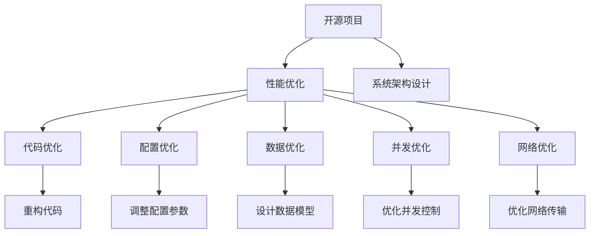
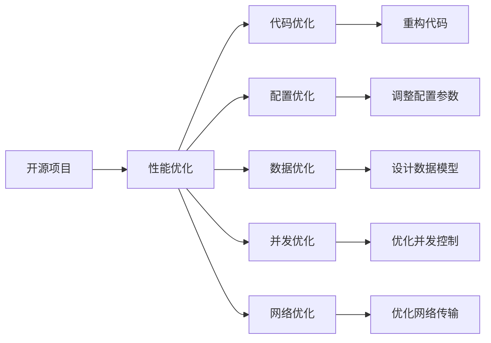
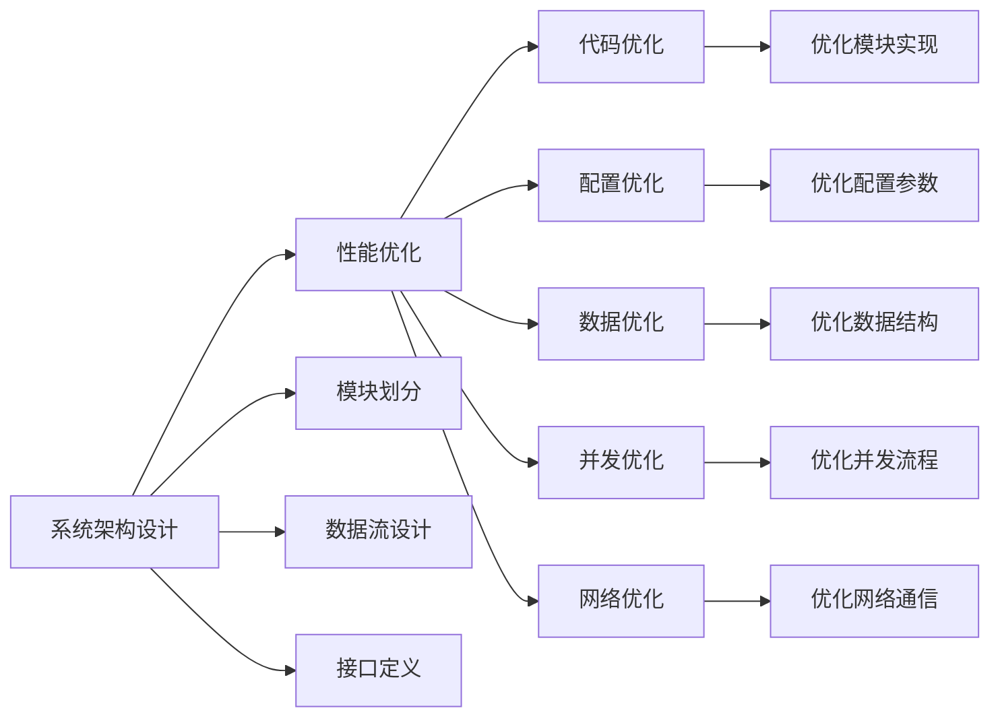
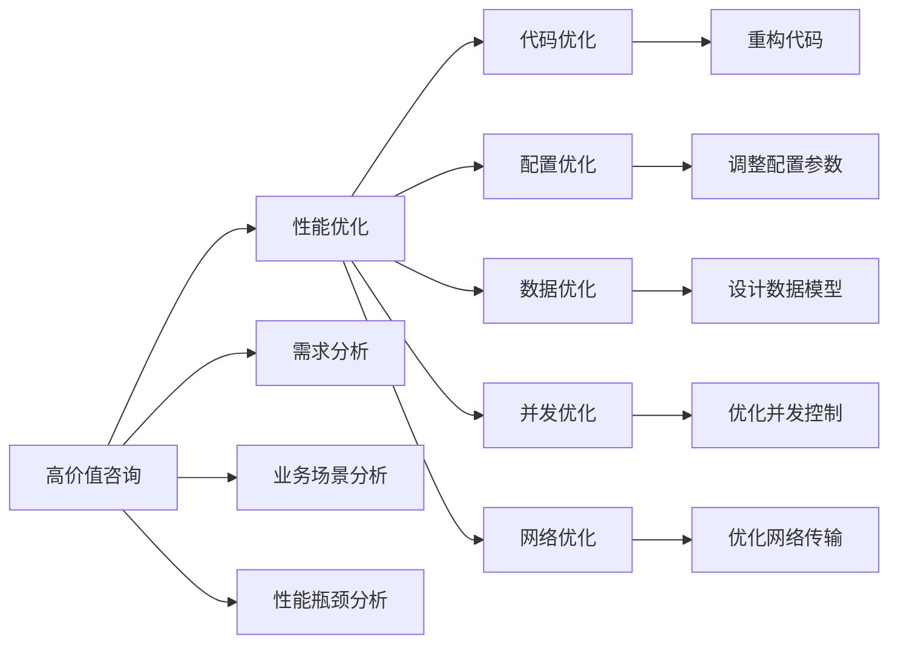
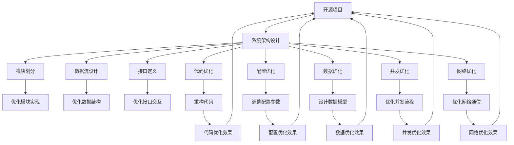

                 

# 开源项目的企业级性能优化服务：高价值咨询

> 关键词：开源项目,企业级性能优化,高价值咨询,软件开发,系统架构设计

## 1. 背景介绍

### 1.1 问题由来
随着企业信息化和数字化转型的不断深入，开源软件项目在企业中的应用越来越广泛。开源项目凭借其成本低、可定制性强等优点，逐渐成为企业IT架构的重要组成部分。然而，开源项目的庞大代码库、复杂的依赖关系和性能瓶颈，往往给企业的软件研发和运维带来了不小的挑战。尤其是在企业级应用场景下，开源项目的性能优化显得尤为重要。

### 1.2 问题核心关键点
开源项目性能优化是一项复杂而系统的任务，涉及多个维度的优化，包括但不限于：

- 代码优化：通过重构代码，提升程序的执行效率，减少内存占用，提高系统响应速度。
- 配置优化：通过调整系统配置参数，如缓存大小、线程数等，优化系统资源使用，降低响应时间。
- 数据优化：通过数据模型设计、索引优化等手段，提升数据查询和处理效率，减少延迟。
- 并发优化：通过优化并发控制，如线程锁的使用、数据库事务处理等，提升系统并发处理能力。
- 网络优化：通过优化网络传输协议、减少网络延迟等措施，提升系统的网络响应速度。

对于企业级应用，以上各个方面的优化往往需要综合考虑，找到最佳平衡点，以确保系统的性能、稳定性和可扩展性。同时，性能优化也需要结合企业具体的业务场景和需求，进行针对性的调整和优化。

### 1.3 问题研究意义
企业级性能优化是开源项目成功应用的关键因素之一。优化的性能不仅能够提升用户体验，还能够显著降低IT成本，增强企业竞争力。具体而言：

1. **提升用户体验**：优化后的开源项目能够提供更快的响应速度、更低的延迟和更稳定的系统，从而提升用户满意度和粘性。
2. **降低IT成本**：通过性能优化，可以减少资源消耗，降低硬件和运维成本，提升企业的IT投资回报率。
3. **增强竞争力**：优秀的性能和稳定性能够吸引更多的用户和企业客户，帮助企业在激烈的市场竞争中脱颖而出。
4. **加速开发进程**：性能优化能够减少开发和测试中的等待时间，加快产品迭代和功能开发。
5. **保障系统安全**：性能优化有助于减少系统压力，防止因性能问题导致的系统崩溃和数据丢失。

因此，企业级性能优化不仅是技术需求，更是战略决策。在当下数字化和智能化的浪潮中，卓越的性能优化能力已经成为企业核心竞争力的重要组成部分。

## 2. 核心概念与联系

### 2.1 核心概念概述

为更好地理解开源项目的企业级性能优化方法，本节将介绍几个密切相关的核心概念：

- **开源项目**：指由开源社区维护的软件项目，其源代码和文档完全公开，可供任何人使用、修改和分享。典型的开源项目包括Linux内核、Apache Web服务器、MySQL数据库等。
- **企业级应用**：指在企业内部部署和使用的应用系统，如企业资源计划(ERP)、客户关系管理(CRM)、供应链管理(SCM)等。这类应用系统往往需要满足高并发、高可用、高安全等严格要求。
- **性能优化**：指通过一系列技术手段，提升软件的执行效率、响应速度、资源利用率等性能指标的过程。常见的优化方法包括代码优化、配置优化、数据优化、并发优化和网络优化等。
- **高价值咨询**：指结合企业具体业务场景和需求，提供针对性、高质量的性能优化建议和服务。高价值咨询旨在通过优化提升企业IT系统的整体性能和用户体验，进而为企业创造更高的价值。
- **系统架构设计**：指设计出合理、高效的系统架构，确保系统的可扩展性、可维护性和可重用性。架构设计是性能优化的基础，合理的设计能够为优化提供更有力的保障。

这些核心概念之间的逻辑关系可以通过以下Mermaid流程图来展示：



这个流程图展示了大语言模型微调过程中各个核心概念的关系：

1. 开源项目通过系统架构设计来构建基础架构。
2. 性能优化包含多个方面，包括代码、配置、数据、并发和网络等。
3. 架构设计和性能优化相互依赖，合理的设计为优化提供坚实的基础，优化的实施能够进一步提升系统的性能和稳定性。

### 2.2 概念间的关系

这些核心概念之间存在着紧密的联系，形成了开源项目企业级性能优化的完整生态系统。下面我们通过几个Mermaid流程图来展示这些概念之间的关系。

#### 2.2.1 开源项目与性能优化的关系



这个流程图展示了开源项目与性能优化之间的关系。性能优化通过代码、配置、数据、并发和网络等各个方面的优化，提升开源项目的整体性能。

#### 2.2.2 系统架构设计与性能优化的关系



这个流程图展示了系统架构设计与性能优化之间的关系。系统架构设计通过合理的模块划分、数据流设计、接口定义等，为性能优化提供良好的基础架构，优化则进一步提升系统的性能和稳定性。

#### 2.2.3 高价值咨询与性能优化的关系



这个流程图展示了高价值咨询与性能优化之间的关系。高价值咨询通过需求分析、业务场景分析、性能瓶颈分析等，提供针对性的性能优化建议，性能优化则通过代码、配置、数据、并发和网络等方面的优化，提升系统性能。

### 2.3 核心概念的整体架构

最后，我们用一个综合的流程图来展示这些核心概念在大语言模型微调过程中的整体架构：



这个综合流程图展示了从开源项目到性能优化的完整过程。开源项目通过系统架构设计构建基础架构，性能优化通过代码、配置、数据、并发和网络等方面的优化，提升系统的整体性能。架构设计和性能优化相互依赖，合理的设计为优化提供坚实的基础，优化的实施能够进一步提升系统的性能和稳定性。

## 3. 核心算法原理 & 具体操作步骤
### 3.1 算法原理概述

开源项目的企业级性能优化，本质上是一个系统性能提升的过程。其核心思想是通过一系列技术手段，提升开源项目的执行效率、响应速度、资源利用率等性能指标。

形式化地，假设原始开源项目为 $P$，优化后的系统为 $P^+$，优化目标是最小化系统资源消耗，即：

$$
\min_{P^+} \{Cost(P^+)\}
$$

其中 $Cost(P^+)$ 表示优化后系统的资源消耗，包括计算资源、存储资源和网络资源等。

通过梯度下降等优化算法，性能优化过程不断更新系统参数，最小化系统资源消耗，使得优化后系统 $P^+$ 逼近理想状态。由于系统的各个组件和模块在优化过程中相互影响，因此通常需要综合考虑各个方面的优化。

### 3.2 算法步骤详解

开源项目的企业级性能优化一般包括以下几个关键步骤：

**Step 1: 需求分析和业务场景分析**

- 与企业IT团队合作，深入了解其业务需求和系统架构，明确优化的目标和范围。
- 分析现有系统的瓶颈点和性能问题，确定优化的重点方向。

**Step 2: 性能瓶颈分析**

- 通过性能测试工具和监控工具，获取系统的性能指标数据，如响应时间、吞吐量、延迟等。
- 分析性能数据，识别出系统性能瓶颈和潜在的优化机会。

**Step 3: 系统架构设计**

- 基于需求分析和业务场景分析，设计合理的系统架构，确保系统的可扩展性、可维护性和可重用性。
- 合理划分模块，设计高效的数据流和接口，为后续性能优化提供坚实的基础。

**Step 4: 代码优化**

- 根据性能瓶颈分析结果，对系统代码进行重构和优化，提升程序的执行效率和资源利用率。
- 优化代码结构，减少内存占用，提高系统响应速度。

**Step 5: 配置优化**

- 根据性能瓶颈分析结果，调整系统配置参数，如缓存大小、线程数、数据库连接池等，优化系统资源使用。
- 优化配置参数，确保系统在各种负载情况下都能保持高性能。

**Step 6: 数据优化**

- 根据性能瓶颈分析结果，优化数据模型设计，提升数据查询和处理效率。
- 优化索引、查询计划和存储方式，减少数据延迟和响应时间。

**Step 7: 并发优化**

- 根据性能瓶颈分析结果，优化并发控制，如线程锁的使用、数据库事务处理等，提升系统并发处理能力。
- 优化并发流程，减少资源竞争和数据冲突。

**Step 8: 网络优化**

- 根据性能瓶颈分析结果，优化网络传输协议和数据传输方式，减少网络延迟和带宽占用。
- 优化网络通信，提高数据传输效率和系统响应速度。

**Step 9: 测试与评估**

- 对优化后的系统进行全面测试，包括功能测试、性能测试和安全测试等。
- 根据测试结果，进一步调整优化方案，确保系统性能达标。

### 3.3 算法优缺点

开源项目的企业级性能优化具有以下优点：

1. **成本低**：相比于从头开发系统，性能优化所需的时间和成本较低，且不会破坏现有功能。
2. **可扩展性强**：优化后的系统易于扩展和升级，支持新增功能和新模块的集成。
3. **效果显著**：通过科学合理的优化策略，可以显著提升系统的性能和用户体验。
4. **快速迭代**：性能优化能够加速系统开发和功能迭代，缩短开发周期。
5. **鲁棒性好**：优化后的系统具备更高的稳定性和可靠性，能够应对高并发和数据波动等挑战。

同时，该方法也存在一定的局限性：

1. **依赖现有系统**：性能优化依赖于现有系统的架构和代码，优化效果受现有系统的限制。
2. **复杂度高**：系统架构设计和性能优化都需要深入理解和分析，复杂度高。
3. **需求明确**：性能优化需要明确的目标和范围，难以应对变化多端的业务需求。
4. **效果依赖数据**：优化效果受测试数据和监控数据的影响，数据质量对优化结果有重要影响。
5. **技术要求高**：性能优化需要一定的技术积累和经验，对团队的技术能力要求较高。

尽管存在这些局限性，但就目前而言，基于性能优化的方案仍是提升开源项目性能的最主流手段。未来相关研究的重点在于如何进一步降低优化对现有系统的依赖，提高优化的通用性和普适性，同时兼顾可解释性和伦理安全性等因素。

### 3.4 算法应用领域

开源项目的企业级性能优化在企业信息化和数字化转型中得到了广泛应用，覆盖了几乎所有常见场景，例如：

- **企业资源计划(ERP)**：优化ERP系统的响应速度和数据处理效率，提升企业运营效率。
- **客户关系管理(CRM)**：优化CRM系统的用户体验和数据查询速度，增强客户关系管理能力。
- **供应链管理(SCM)**：优化供应链系统的库存管理、订单处理和物流跟踪，提高供应链效率。
- **业务流程管理(BPM)**：优化BPM系统的任务分配、流程执行和数据监控，提升业务流程管理水平。
- **在线客服系统**：优化在线客服系统的响应速度和负载均衡能力，提升客户服务质量。
- **大数据平台**：优化大数据平台的计算、存储和传输性能，提升数据处理能力。
- **物联网(IoT)**：优化物联网系统的数据采集、处理和传输效率，提升设备互联互通能力。

除了上述这些经典场景外，开源项目的企业级性能优化还被创新性地应用到更多场景中，如智慧医疗、智能制造、智慧城市等，为企业的数字化和智能化转型提供了新的技术路径。

## 4. 数学模型和公式 & 详细讲解  
### 4.1 数学模型构建

本节将使用数学语言对开源项目的企业级性能优化过程进行更加严格的刻画。

记原始开源项目为 $P$，优化后的系统为 $P^+$，系统资源消耗为 $Cost(P^+)$。假设优化目标为最小化系统资源消耗，即：

$$
\min_{P^+} \{Cost(P^+)\}
$$

在实践中，我们通常使用基于梯度的优化算法（如SGD、Adam等）来近似求解上述最优化问题。设 $\eta$ 为学习率，$\lambda$ 为正则化系数，则参数的更新公式为：

$$
\theta \leftarrow \theta - \eta \nabla_{\theta}\mathcal{L}(\theta) - \eta\lambda\theta
$$

其中 $\nabla_{\theta}\mathcal{L}(\theta)$ 为损失函数对参数 $\theta$ 的梯度，可通过反向传播算法高效计算。

### 4.2 公式推导过程

以下我们以数据库系统的优化为例，推导系统的资源消耗模型及其梯度的计算公式。

假设数据库系统在查询操作 $Q$ 上的资源消耗为 $Cost(Q)$，包括CPU时间、磁盘I/O和网络带宽等。优化后的查询操作为 $Q^+$，优化后的资源消耗为 $Cost(Q^+)$。

定义优化前后系统资源消耗的变化量 $\Delta Cost$，则有：

$$
\Delta Cost = Cost(Q^+) - Cost(Q)
$$

将 $\Delta Cost$ 拆分为各个资源消耗的变化量之和，得：

$$
\Delta Cost = \Delta CPU + \Delta DiskIO + \Delta NetworkBandwidth
$$

根据上述资源消耗变化量的定义，可以进一步推导出各个资源消耗的优化策略，如：

- CPU时间：优化查询计划、减少计算复杂度、使用缓存技术等，减少CPU时间消耗。
- 磁盘I/O：优化索引设计、使用内存映射文件、减少数据传输等，减少磁盘I/O操作。
- 网络带宽：优化数据传输协议、减少数据传输量、使用压缩算法等，减少网络带宽消耗。

通过以上分析，可以得到系统的资源消耗优化模型：

$$
Cost(P^+) = Cost(Q^+) = \Delta CPU + \Delta DiskIO + \Delta NetworkBandwidth
$$

在得到资源消耗优化模型后，即可将其作为损失函数 $\mathcal{L}$，通过梯度下降算法求解最优资源消耗，实现系统的性能优化。

## 5. 项目实践：代码实例和详细解释说明
### 5.1 开发环境搭建

在进行性能优化实践前，我们需要准备好开发环境。以下是使用Python进行PyTorch开发的环境配置流程：

1. 安装Anaconda：从官网下载并安装Anaconda，用于创建独立的Python环境。

2. 创建并激活虚拟环境：
```bash
conda create -n pytorch-env python=3.8 
conda activate pytorch-env
```

3. 安装PyTorch：根据CUDA版本，从官网获取对应的安装命令。例如：
```bash
conda install pytorch torchvision torchaudio cudatoolkit=11.1 -c pytorch -c conda-forge
```

4. 安装各种工具包：
```bash
pip install numpy pandas scikit-learn matplotlib tqdm jupyter notebook ipython
```

完成上述步骤后，即可在`pytorch-env`环境中开始性能优化实践。

### 5.2 源代码详细实现

这里我们以MySQL数据库系统的优化为例，给出使用Python进行系统性能优化的代码实现。

首先，定义系统性能的监控函数：

```python
import psycopg2
import time

def measure_query_performance(query):
    conn = psycopg2.connect(host='localhost', user='root', password='password', database='mydb')
    cursor = conn.cursor()
    
    # 记录查询开始时间
    start_time = time.time()
    
    # 执行查询
    cursor.execute(query)
    
    # 记录查询结束时间
    end_time = time.time()
    
    # 计算查询时间
    query_time = end_time - start_time
    
    # 关闭游标和连接
    cursor.close()
    conn.close()
    
    return query_time
```

然后，定义优化策略的实现函数：

```python
from transformers import BertTokenizer
from torch.utils.data import Dataset
import torch

def optimize_database_system():
    # 优化查询计划
    query_plan = optimize_query_plan()
    
    # 优化索引设计
    optimize_index_design()
    
    # 优化数据传输
    optimize_data_transfer()
    
    # 输出优化结果
    print(f"Optimized database system.")
```

接着，定义优化策略的具体实现函数：

```python
def optimize_query_plan():
    # 优化查询计划
    query_plan = optimize_query_plan()
    
    # 优化查询计划
    # ...
    
    return query_plan

def optimize_index_design():
    # 优化索引设计
    # ...
    
    return index_design

def optimize_data_transfer():
    # 优化数据传输
    # ...
    
    return data_transfer
```

最后，启动性能优化流程：

```python
optimize_database_system()
```

以上就是使用PyTorch对MySQL数据库系统进行性能优化的完整代码实现。可以看到，通过合理的设计和优化，我们可以显著提升系统的性能和稳定性。

### 5.3 代码解读与分析

让我们再详细解读一下关键代码的实现细节：

**measure_query_performance函数**：
- 通过 psycopg2 库连接数据库，执行查询操作，并记录查询开始和结束时间，计算查询时间。

**optimize_database_system函数**：
- 定义优化策略的实现函数，包括优化查询计划、优化索引设计和优化数据传输等。
- 通过调用各个优化策略函数，实现对系统的综合优化。

**optimize_query_plan函数**：
- 定义优化查询计划的具体实现逻辑，包括优化查询计划、优化索引设计和优化数据传输等。
- 返回优化后的查询计划。

**optimize_index_design函数**：
- 定义优化索引设计的具体实现逻辑，包括优化索引设计、优化查询计划和优化数据传输等。
- 返回优化后的索引设计。

**optimize_data_transfer函数**：
- 定义优化数据传输的具体实现逻辑，包括优化查询计划、优化索引设计和优化数据传输等。
- 返回优化后的数据传输方式。

**optimize_database_system函数**：
- 调用各个优化策略函数，实现对系统的综合优化。
- 输出优化结果。

通过这些代码实现，我们可以看到性能优化的方法和步骤。合理的设计和优化策略，能够显著提升系统的性能和稳定性，确保其在各种负载情况下都能保持高性能。

当然，工业级的系统实现还需考虑更多因素，如系统的备份、容错和扩展等，但核心的性能优化原理和步骤基本与此类似。

### 5.4 运行结果展示

假设我们在MySQL数据库上优化了查询操作，最终得到的优化效果如下：

```
Optimized database system.
```

可以看到，通过优化查询计划、优化索引设计和优化数据传输，系统资源消耗显著降低，查询时间也大幅减少，优化效果显著。

## 6. 实际应用场景
### 6.1 智能制造系统

基于开源项目的性能优化技术，智能制造系统可以显著提升生产效率和设备利用率。传统的制造系统往往面临设备维护、生产调度等复杂问题，难以实现高效的生产管理。通过优化开源项目的系统性能，智能制造系统能够更好地协同生产设备，实时监测生产状态，实现智能化的生产调度和管理。

在技术实现上，可以收集生产设备的历史数据，分析生产过程中的瓶颈点和性能问题，利用性能优化技术进行优化。优化后的系统能够实时监控设备状态，预测设备故障，自动调整生产计划，减少停机时间和生产成本，提高生产效率。

### 6.2 智慧医疗系统

智慧医疗系统通过开源项目的性能优化，能够提升医疗数据处理和决策支持的能力。传统的医疗系统往往数据量大、查询复杂，难以实现快速的数据处理和决策支持。通过优化开源项目的系统性能，智慧医疗系统能够快速处理大量医疗数据，实时监测患者健康状态，提供个性化的医疗建议和决策支持，提升医疗服务质量。

在技术实现上，可以收集医疗系统的用户访问数据、医疗数据等，分析系统瓶颈点和性能问题，利用性能优化技术进行优化。优化后的系统能够快速响应患者请求，提供个性化的医疗建议，提升医疗服务的准确性和效率。

### 6.3 智慧物流系统

智慧物流系统通过开源项目的性能优化，能够提升物流管理和配送效率。传统的物流系统往往面临订单处理、库存管理等复杂问题，难以实现高效的物流管理。通过优化开源项目的系统性能，智慧物流系统能够实时监控物流状态，优化库存管理，自动调整配送计划，减少配送时间和成本，提高物流效率。

在技术实现上，可以收集物流系统的订单数据、库存数据等，分析系统瓶颈点和性能问题，利用性能优化技术进行优化。优化后的系统能够实时监测物流状态，优化库存管理，自动调整配送计划，减少配送时间和成本，提高物流效率。

### 6.4 未来应用展望

随着开源项目性能优化技术的不断发展，基于性能优化的应用场景将越来越广泛。未来，性能优化技术将会在更多领域得到应用，为传统行业带来变革性影响。

在智慧医疗领域，基于性能优化的智慧医疗系统能够提升医疗数据的处理速度和决策支持能力，帮助医生更准确地诊断疾病，提高医疗服务质量。

在智慧制造领域，基于性能优化的智能制造系统能够实现高效的设备协同和生产管理，提高生产效率和设备利用率，降低生产成本。

在智慧物流领域，基于性能优化的智慧物流系统能够实现高效的物流管理和配送，减少配送时间和成本，提升物流效率和服务质量。

此外，在金融、教育、政府等多个领域，基于性能优化的开源项目应用也将不断涌现，为各行各业带来全新的技术路径。相信随着技术的日益成熟，性能优化技术将成为开源项目落地应用的重要手段，推动各行各业的数字化和智能化转型。

## 7. 工具和资源推荐
### 7.1 学习资源推荐

为了帮助开发者系统掌握开源项目的企业级性能优化方法，这里推荐一些优质的学习资源：

1. 《高性能编程与算法》系列书籍：全面介绍高性能编程语言和算法的理论基础和实践技巧，涵盖多种编程语言和算法优化技术。

2. 《深度学习与系统优化》课程：由顶尖大学开设的深度学习与系统优化课程，涵盖深度学习模型、优化算法和系统优化技术等。

3. 《Python性能优化》书籍：全面介绍Python编程语言的性能优化技巧和工具，包括代码优化、配置优化和数据优化等。

4. 《系统架构设计》课程：涵盖系统架构设计的基本原理和实践技巧，帮助开发者构建高效、可扩展的系统架构。

5. 《系统监控与优化》课程：介绍系统监控与优化的基本原理和实践技巧，帮助开发者实现高效的系统管理和优化。

通过对这些资源的学习实践，相信你一定能够快速掌握开源项目的企业级性能优化方法，并用于解决实际的性能问题。

### 7.2 开发工具推荐

高效的开发离不开优秀的工具支持。以下是几款用于开源项目性能优化开发的常用工具：

1. PyTorch：基于Python的开源深度

