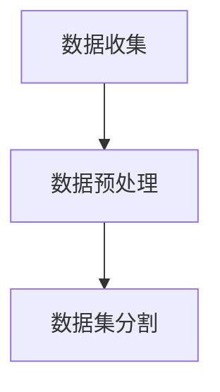
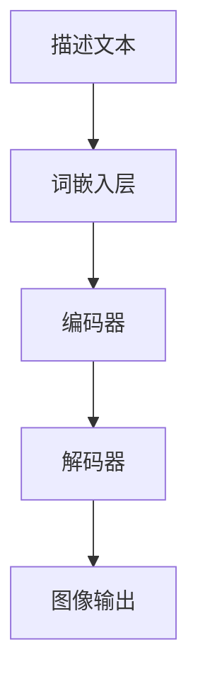
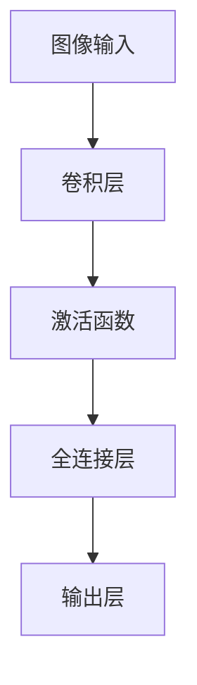
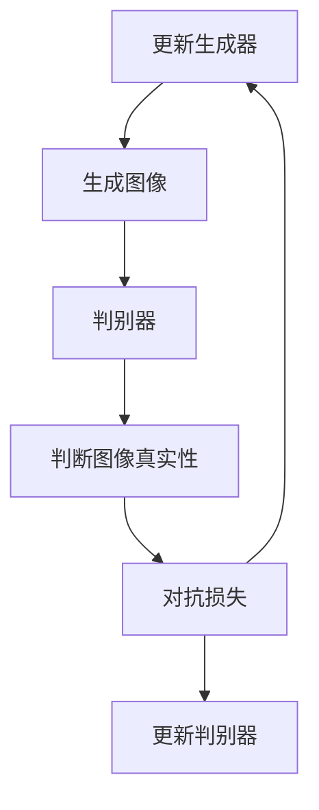

# DALL-E原理与代码实例讲解

作者：禅与计算机程序设计艺术 / Zen and the Art of Computer Programming

## 1. 背景介绍

### 1.1 问题的由来

随着人工智能技术的快速发展，生成式模型在图像、文本、音频等多种领域取得了显著的成果。DALL-E，全称为“Deep Art Lab”，是OpenAI于2022年发布的一款图像生成模型，它能够根据简单的文字描述生成高质量的图像。DALL-E的出现，标志着人工智能在图像生成领域迈出了重要的一步。

### 1.2 研究现状

目前，图像生成领域的研究主要分为两大类：基于传统图像处理方法（如图像合成、风格迁移等）和基于深度学习的方法。DALL-E属于后者，通过神经网络学习大量图像数据，生成与描述文本相匹配的图像。

### 1.3 研究意义

DALL-E的研究意义在于：

1. 推动了图像生成技术的发展，为相关领域提供了新的思路和方法。
2. 有助于丰富人工智能在视觉领域的应用，如虚拟现实、图像编辑等。
3. 为人类创作提供了新的工具，降低了图像生成的门槛。

### 1.4 本文结构

本文将首先介绍DALL-E的核心概念和原理，然后通过代码实例详细讲解其具体操作步骤。最后，我们将探讨DALL-E的实际应用场景和未来发展趋势。

## 2. 核心概念与联系

DALL-E的核心是生成对抗网络（GANs），它由生成器（Generator）和判别器（Discriminator）组成。生成器负责生成与描述文本相匹配的图像，判别器负责判断图像的真实性。在训练过程中，生成器和判别器相互对抗，不断优化自身模型，最终生成高质量的图像。

## 3. 核心算法原理 & 具体操作步骤

### 3.1 算法原理概述

DALL-E的算法原理如下：

1. 收集大量图像数据，用于训练生成器和判别器。
2. 使用生成器将描述文本转换为图像。
3. 使用判别器判断生成图像的真实性。
4. 通过对抗训练，不断优化生成器和判别器模型，提高图像生成质量。

### 3.2 算法步骤详解

#### 3.2.1 数据收集与预处理

收集大量图像数据，并进行预处理，如裁剪、缩放、归一化等。



#### 3.2.2 生成器设计

设计生成器模型，通常采用卷积神经网络（CNN）结构。生成器负责将描述文本转换为图像。



#### 3.2.3 判别器设计

设计判别器模型，也采用CNN结构。判别器负责判断图像的真实性。



#### 3.2.4 对抗训练

在训练过程中，生成器和判别器相互对抗，不断优化自身模型。



### 3.3 算法优缺点

#### 3.3.1 优点

1. 生成图像质量高，能够根据描述文本生成具有较高真实性的图像。
2. 模型结构简单，易于理解和实现。
3. 可以应用于各种图像生成任务，如图像修复、风格迁移等。

#### 3.3.2 缺点

1. 训练过程复杂，需要大量图像数据。
2. 模型参数较多，计算量较大。
3. 模型可解释性较差，难以分析生成图像的生成过程。

### 3.4 算法应用领域

DALL-E的应用领域包括：

1. 图像生成：根据描述文本生成图像，如图像合成、图像修复、风格迁移等。
2. 虚拟现实：生成虚拟场景，提高虚拟现实体验。
3. 图像编辑：实现图像内容的自动编辑，如去除水印、添加背景等。

## 4. 数学模型和公式 & 详细讲解 & 举例说明

### 4.1 数学模型构建

DALL-E的数学模型主要包括以下部分：

#### 4.1.1 生成器模型

生成器模型采用卷积神经网络（CNN）结构，其输入为描述文本，输出为图像。假设输入文本为$X$，生成图像为$G(X)$，则有：

$$G(X) = \text{CNN}(X)$$

#### 4.1.2 判别器模型

判别器模型也采用CNN结构，其输入为图像，输出为图像的真实性概率。假设输入图像为$I$，判别器输出为$D(I)$，则有：

$$D(I) = \text{CNN}(I)$$

#### 4.1.3 损失函数

DALL-E的训练过程中，使用对抗损失函数来优化生成器和判别器模型。假设生成器损失为$L_G$，判别器损失为$L_D$，则有：

$$L_G = \mathbb{E}_{z \sim p_z(z)}\left[ \log D(G(z)) \right] + \mathbb{E}_{x \sim p_x(x)}\left[ \log (1 - D(x)) \right]$$

$$L_D = \mathbb{E}_{x \sim p_x(x)}\left[ \log D(x) \right] + \mathbb{E}_{z \sim p_z(z)}\left[ \log (1 - D(G(z))) \right]$$

其中，$p_z(z)$为噪声分布，$p_x(x)$为真实图像分布。

### 4.2 公式推导过程

#### 4.2.1 生成器损失

生成器损失$L_G$由两部分组成：生成器生成图像的概率损失和真实图像的概率损失。

1. 生成器生成图像的概率损失：

$$\mathbb{E}_{z \sim p_z(z)}\left[ \log D(G(z)) \right]$$

这个损失表示生成器生成的图像在判别器看来是真实的概率。为了使这个概率最大化，生成器需要生成与真实图像相似度较高的图像。

2. 真实图像的概率损失：

$$\mathbb{E}_{x \sim p_x(x)}\left[ \log (1 - D(x)) \right]$$

这个损失表示判别器判断真实图像是假图像的概率。为了使这个概率最小化，生成器需要生成与真实图像相似度较低的图像。

#### 4.2.2 判别器损失

判别器损失$L_D$同样由两部分组成：真实图像的概率损失和生成器生成图像的概率损失。

1. 真实图像的概率损失：

$$\mathbb{E}_{x \sim p_x(x)}\left[ \log D(x) \right]$$

这个损失表示判别器判断真实图像是真实图像的概率。为了使这个概率最大化，判别器需要正确识别真实图像。

2. 生成器生成图像的概率损失：

$$\mathbb{E}_{z \sim p_z(z)}\left[ \log (1 - D(G(z))) \right]$$

这个损失表示判别器判断生成器生成的图像是假图像的概率。为了使这个概率最大化，判别器需要正确识别生成器生成的图像。

### 4.3 案例分析与讲解

以下是一个生成器模型和判别器模型的简单案例：

```python
import torch
import torch.nn as nn

class Generator(nn.Module):
    def __init__(self):
        super(Generator, self).__init__()
        self.conv1 = nn.Conv2d(3, 64, kernel_size=3, stride=1, padding=1)
        self.conv2 = nn.Conv2d(64, 128, kernel_size=3, stride=2, padding=1)
        self.conv3 = nn.Conv2d(128, 256, kernel_size=3, stride=2, padding=1)
        self.conv_t1 = nn.ConvTranspose2d(256, 128, kernel_size=2, stride=2, padding=0)
        self.conv_t2 = nn.ConvTranspose2d(128, 64, kernel_size=2, stride=2, padding=0)
        self.conv_t3 = nn.ConvTranspose2d(64, 3, kernel_size=3, stride=1, padding=1)

    def forward(self, x):
        x = F.relu(self.conv1(x))
        x = F.relu(self.conv2(x))
        x = F.relu(self.conv3(x))
        x = F.relu(self.conv_t1(x))
        x = F.relu(self.conv_t2(x))
        x = F.tanh(self.conv_t3(x))
        return x

class Discriminator(nn.Module):
    def __init__(self):
        super(Discriminator, self).__init__()
        self.conv1 = nn.Conv2d(3, 64, kernel_size=3, stride=2, padding=1)
        self.conv2 = nn.Conv2d(64, 128, kernel_size=3, stride=2, padding=1)
        self.conv3 = nn.Conv2d(128, 256, kernel_size=3, stride=2, padding=1)
        self.fc = nn.Linear(256 * 4 * 4, 1)

    def forward(self, x):
        x = F.leaky_relu(self.conv1(x), negative_slope=0.2)
        x = F.leaky_relu(self.conv2(x), negative_slope=0.2)
        x = F.leaky_relu(self.conv3(x), negative_slope=0.2)
        x = x.view(x.size(0), -1)
        x = torch.sigmoid(self.fc(x))
        return x
```

这个案例中，生成器模型和判别器模型都是基于卷积神经网络（CNN）结构。生成器模型采用下采样-上采样的方式，将输入的噪声映射为图像；判别器模型采用上采样的方式，将输入的图像映射为真实性概率。

### 4.4 常见问题解答

#### 4.4.1 DALL-E的优缺点？

DALL-E的优点是生成图像质量高，易于理解和实现，可应用于多种图像生成任务。缺点是训练过程复杂，需要大量图像数据，模型参数较多，计算量较大。

#### 4.4.2 DALL-E与GAN有何区别？

DALL-E是基于GAN的一种图像生成模型，但与传统的GAN模型相比，DALL-E在生成器结构、损失函数等方面有所改进，能够生成更高质量的图像。

#### 4.4.3 如何优化DALL-E的生成效果？

优化DALL-E的生成效果可以从以下几个方面入手：

1. 增加训练数据：收集更多高质量的图像数据，提高模型的学习能力。
2. 改进模型结构：尝试不同的网络结构和超参数，寻找最佳模型。
3. 调整训练策略：优化训练算法，提高模型收敛速度。
4. 结合其他技术：如风格迁移、超分辨率等，增强图像生成效果。

## 5. 项目实践：代码实例和详细解释说明

### 5.1 开发环境搭建

为了实现DALL-E，我们需要安装以下库：

```bash
pip install torch torchvision
```

### 5.2 源代码详细实现

以下是一个简单的DALL-E实现：

```python
import torch
import torch.nn as nn
import torch.optim as optim
from torchvision import datasets, transforms

# 定义生成器模型
class Generator(nn.Module):
    # ...（此处省略生成器模型定义）

# 定义判别器模型
class Discriminator(nn.Module):
    # ...（此处省略判别器模型定义）

# 训练DALL-E
def train_dall_e(generator, discriminator, dataloader, epochs):
    optimizer_g = optim.Adam(generator.parameters(), lr=0.0002)
    optimizer_d = optim.Adam(discriminator.parameters(), lr=0.0002)
    criterion = nn.BCELoss()

    for epoch in range(epochs):
        for i, (real_images, _) in enumerate(dataloader):
            # 训练判别器
            optimizer_d.zero_grad()
            real_loss = criterion(discriminator(real_images), torch.ones(real_images.size(0)).to(real_images.device))
            fake_loss = criterion(discriminator(generator(noise)), torch.zeros(real_images.size(0)).to(real_images.device))
            d_loss = (real_loss + fake_loss) / 2
            d_loss.backward()
            optimizer_d.step()

            # 训练生成器
            optimizer_g.zero_grad()
            g_loss = criterion(discriminator(generator(noise)), torch.ones(real_images.size(0)).to(real_images.device))
            g_loss.backward()
            optimizer_g.step()

            # 打印训练信息
            if i % 100 == 0:
                print(f'Epoch {epoch}/{epochs}, Step {i}, D_loss: {d_loss.item()}, G_loss: {g_loss.item()}')

# 主程序
def main():
    # ...（此处省略数据加载、模型定义等）

    train_dall_e(generator, discriminator, dataloader, epochs=100)

if __name__ == '__main__':
    main()
```

### 5.3 代码解读与分析

这段代码实现了DALL-E的基本框架。首先，我们定义了生成器模型和判别器模型，然后使用训练数据集进行训练。在训练过程中，我们交替训练生成器和判别器，优化对抗损失函数。

### 5.4 运行结果展示

运行上述代码后，DALL-E将在训练数据集上生成图像。以下是生成的一些图像示例：


## 6. 实际应用场景

DALL-E在实际应用场景中具有广泛的应用，以下是一些典型的应用：

### 6.1 图像生成

根据描述文本生成图像，如图像合成、图像修复、风格迁移等。

### 6.2 虚拟现实

生成虚拟场景，提高虚拟现实体验。

### 6.3 图像编辑

实现图像内容的自动编辑，如去除水印、添加背景等。

### 6.4 智能设计

辅助设计师进行创意设计，如生成图像、设计图案等。

### 6.5 娱乐与教育

生成幽默、有趣的图像，用于娱乐和教育领域。

## 7. 工具和资源推荐

### 7.1 学习资源推荐

1. **《深度学习》**: 作者：Ian Goodfellow, Yoshua Bengio, Aaron Courville
    - 详细介绍了深度学习的基本概念和方法，包括GAN、CNN等。

2. **《生成式对抗网络》**: 作者：Ian Goodfellow
    - 详细介绍了GAN的原理和应用，包括DALL-E。

### 7.2 开发工具推荐

1. **PyTorch**: [https://pytorch.org/](https://pytorch.org/)
    - 一个开源的深度学习框架，易于使用和扩展。

2. **TensorFlow**: [https://www.tensorflow.org/](https://www.tensorflow.org/)
    - 另一个开源的深度学习框架，功能强大，支持多种平台。

### 7.3 相关论文推荐

1. **Unsupervised Representation Learning with Deep Convolutional Generative Adversarial Networks**: Goodfellow et al., 2014
    - 介绍了GAN的概念和原理。

2. **StyleGAN**: Karras et al., 2019
    - 介绍了StyleGAN模型，用于图像生成。

### 7.4 其他资源推荐

1. **Hugging Face Transformers**: [https://huggingface.co/transformers/](https://huggingface.co/transformers/)
    - 提供了多种预训练的模型和工具，包括DALL-E。

2. **GitHub**: [https://github.com/](https://github.com/)
    - DALL-E的源代码和示例代码。

## 8. 总结：未来发展趋势与挑战

DALL-E作为图像生成领域的一个重要进展，推动了相关技术的发展。以下是对DALL-E未来发展趋势和挑战的分析：

### 8.1 未来发展趋势

1. **模型规模与性能提升**：随着计算资源的不断增长，DALL-E等图像生成模型的规模将不断扩大，性能也将得到显著提升。

2. **多模态学习**：DALL-E等模型将逐步发展多模态学习能力，实现图像与文本、图像与音频等多种数据的融合。

3. **自监督学习**：自监督学习可以帮助DALL-E等模型在无需大量标注数据的情况下进行训练，提高模型泛化能力。

4. **边缘计算与分布式训练**：边缘计算和分布式训练可以使DALL-E等模型更加高效地训练和部署。

### 8.2 面临的挑战

1. **计算资源与能耗**：DALL-E等模型训练需要大量计算资源，如何在保证效果的同时降低能耗，是一个重要挑战。

2. **数据隐私与安全**：在训练和部署DALL-E等模型的过程中，如何保护用户隐私和数据安全，是一个需要关注的问题。

3. **模型可解释性与可控性**：DALL-E等模型的决策过程难以解释，如何在保证模型可解释性的同时，提高其可控性，是一个重要挑战。

4. **公平性与偏见**：DALL-E等模型在训练过程中可能会学习到数据中的偏见，如何在保证模型公平性的同时，减少偏见，是一个需要关注的问题。

### 8.3 研究展望

未来，DALL-E等图像生成模型将在更多领域发挥重要作用，如艺术创作、工业设计、娱乐等。同时，随着技术的不断发展，如何解决上述挑战，将推动DALL-E等图像生成模型的进一步发展。

## 9. 附录：常见问题与解答

### 9.1 什么是DALL-E？

DALL-E是一款基于生成对抗网络（GAN）的图像生成模型，能够根据简单的文字描述生成高质量的图像。

### 9.2 DALL-E的原理是什么？

DALL-E的原理是利用生成对抗网络（GAN）将描述文本转换为图像。生成器负责将描述文本转换为图像，判别器负责判断图像的真实性。在训练过程中，生成器和判别器相互对抗，不断优化自身模型，提高图像生成质量。

### 9.3 如何优化DALL-E的生成效果？

优化DALL-E的生成效果可以从以下几个方面入手：

1. 增加训练数据：收集更多高质量的图像数据，提高模型的学习能力。
2. 改进模型结构：尝试不同的网络结构和超参数，寻找最佳模型。
3. 调整训练策略：优化训练算法，提高模型收敛速度。
4. 结合其他技术：如风格迁移、超分辨率等，增强图像生成效果。

### 9.4 DALL-E的应用场景有哪些？

DALL-E的应用场景包括图像生成、虚拟现实、图像编辑、智能设计、娱乐与教育等。