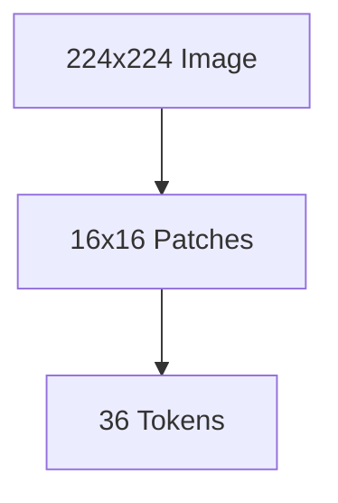
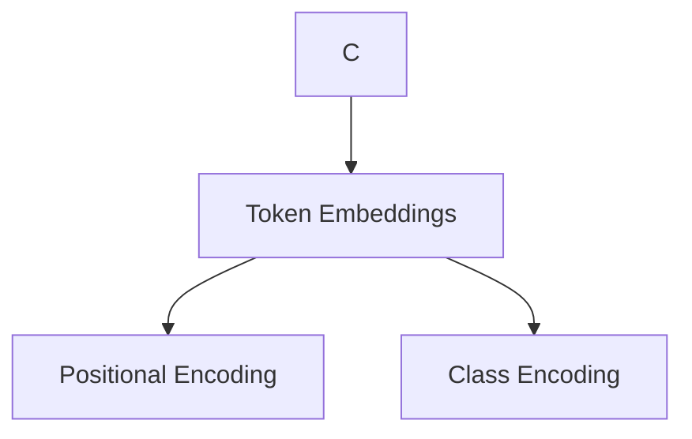
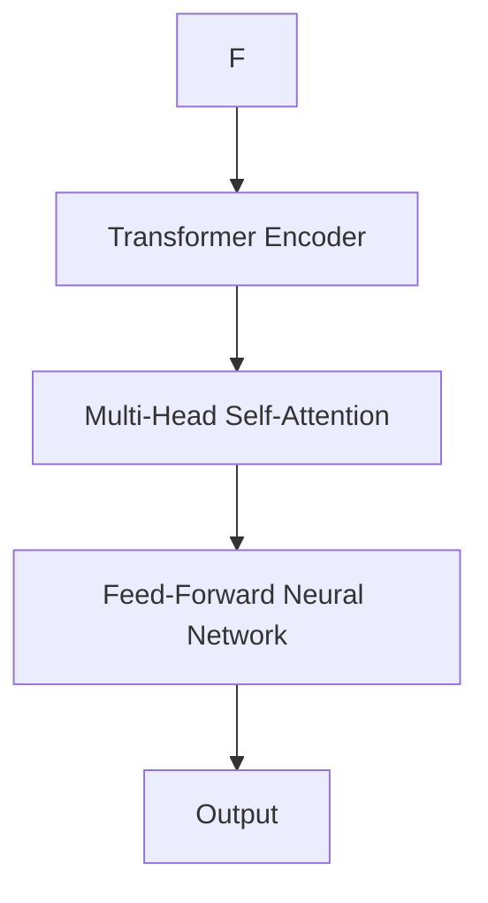

# ViT原理与代码实例讲解

作者：禅与计算机程序设计艺术 / Zen and the Art of Computer Programming

## 1. 背景介绍

### 1.1 问题的由来

计算机视觉领域长期以来一直致力于从图像中提取特征并进行分类。传统的图像分类方法，如SIFT、HOG等，虽然在一定程度上取得了成功，但它们对图像的先验知识要求较高，且难以捕捉到图像的全局信息。随着深度学习的兴起，卷积神经网络（CNN）在图像分类任务上取得了显著的突破。然而，CNN在处理非图像数据（如文本、时间序列等）时，往往需要重新设计网络结构，这限制了其通用性。

为了解决上述问题，Vision Transformer（ViT）应运而生。ViT将Transformer架构引入计算机视觉领域，通过将图像划分为若干个token，并将其视为序列进行处理，实现了对图像的端到端特征提取和分类。本文将详细介绍ViT的原理、实现方法以及实际应用。

### 1.2 研究现状

ViT自提出以来，在图像分类、目标检测、图像分割等多个任务上取得了优异的性能。目前，ViT已成为计算机视觉领域的研究热点之一。

### 1.3 研究意义

ViT的提出，不仅丰富了计算机视觉领域的研究方法，还为构建通用视觉系统提供了新的思路。本文旨在深入解析ViT的原理和实现，帮助读者更好地理解和应用ViT。

### 1.4 本文结构

本文将分为以下几个部分：

- 核心概念与联系：介绍ViT的相关概念和与其他视觉模型的联系。
- 核心算法原理 & 具体操作步骤：详细讲解ViT的原理和操作步骤。
- 数学模型和公式 & 详细讲解 & 举例说明：阐述ViT背后的数学模型和公式，并进行举例说明。
- 项目实践：代码实例和详细解释说明：通过Python代码实例展示ViT的实现过程。
- 实际应用场景：介绍ViT在实际应用场景中的应用。
- 工具和资源推荐：推荐相关学习资源、开发工具和论文。
- 总结：未来发展趋势与挑战。

## 2. 核心概念与联系

### 2.1 Vision Transformer (ViT)

ViT是一种基于Transformer架构的计算机视觉模型，其核心思想是将图像划分为若干个token，并将这些token视为序列进行处理。

### 2.2 与其他视觉模型的联系

与传统的CNN相比，ViT在处理图像时不需要卷积操作，而是直接对图像进行线性嵌入，这使得ViT在处理非图像数据时具有更高的通用性。

与Transformer模型相比，ViT在视觉领域进行了改进，使其能够更好地处理图像数据。

## 3. 核心算法原理 & 具体操作步骤

### 3.1 算法原理概述

ViT的原理可以概括为以下三个步骤：

1. **图像分割**：将图像划分为若干个token，通常采用固定大小的patch作为基本单元。
2. **Token嵌入**：对每个patch进行线性嵌入，得到token表示。
3. **Transformer编码**：将token表示输入到Transformer编码器中，进行特征提取和分类。

### 3.2 算法步骤详解

#### 3.2.1 图像分割

首先，我们需要将图像划分为若干个固定大小的patch。例如，对于一个224x224的图像，可以将它划分为16x16的patch，得到一个包含36个patch的图像。



#### 3.2.2 Token嵌入

接下来，对每个patch进行线性嵌入，得到token表示。通常使用位置编码（Positional Encoding）和类别编码（Class Encoding）来增强token的语义信息。



#### 3.2.3 Transformer编码

将token表示输入到Transformer编码器中，进行特征提取和分类。编码器由多个Encoder Layer组成，每个Encoder Layer包含多头自注意力机制（Multi-Head Self-Attention）和前馈神经网络（Feed-Forward Neural Network）。



### 3.3 算法优缺点

#### 3.3.1 优点

- **通用性强**：ViT在处理不同类型的数据时，只需对token进行线性嵌入，无需重新设计网络结构。
- **特征提取能力强**：Transformer编码器能够有效地提取全局特征，提高了模型的性能。

#### 3.3.2 缺点

- **计算复杂度高**：ViT的计算复杂度较高，对硬件资源要求较高。
- **对图像分辨率敏感**：ViT的性能与图像分辨率密切相关，分辨率较低时性能会受到影响。

### 3.4 算法应用领域

ViT在以下领域具有广泛的应用：

- **图像分类**：在ImageNet、CIFAR-10等图像分类数据集上取得了优异的性能。
- **目标检测**：与检测头相结合，实现目标检测任务。
- **图像分割**：与分割头相结合，实现图像分割任务。

## 4. 数学模型和公式 & 详细讲解 & 举例说明

### 4.1 数学模型构建

ViT的数学模型主要包括以下部分：

- **Token嵌入**：对每个patch进行线性嵌入，得到token表示。
- **Positional Encoding**：为每个token添加位置编码，增强其语义信息。
- **Multi-Head Self-Attention**：多头自注意力机制，对token进行特征提取。
- **Feed-Forward Neural Network**：前馈神经网络，对特征进行进一步处理。
- **分类器**：对特征进行分类。

### 4.2 公式推导过程

#### 4.2.1 Token嵌入

令$X \in \mathbb{R}^{H \times W \times C}$表示原始图像，其中$H$、$W$和$C$分别表示图像的高度、宽度和通道数。假设patch大小为$16 \times 16$，则可以得到$N = \frac{H \times W}{16 \times 16}$个patch。对每个patch进行线性嵌入，得到token表示$X' \in \mathbb{R}^{N \times C'}$，其中$C'$为嵌入维度。

$$X' = \text{linear}(X)$$

#### 4.2.2 Positional Encoding

位置编码用于表示token在序列中的位置信息。常见的位置编码方法有正弦和余弦函数编码。

$$\text{PE}(pos, 2i) = \sin(\frac{pos}{10000^{2i/d_{\text{model}}})$$
$$\text{PE}(pos, 2i+1) = \cos(\frac{pos}{10000^{2i/d_{\text{model}}})$$

其中，$pos$表示位置索引，$i$表示维度索引，$d_{\text{model}}$表示嵌入维度。

#### 4.2.3 Multi-Head Self-Attention

多头自注意力机制由多个独立的注意力头组成，每个注意力头负责学习不同的表示。假设有$N$个注意力头，则多头自注意力机制可以表示为：

$$\text{Multi-Head Self-Attention}(Q, K, V) = \text{Concat}(\text{head}_1, \dots, \text{head}_N)W^O$$

其中，$Q$、$K$和$V$分别表示查询（Query）、键（Key）和值（Value）向量，$W^O$为输出变换矩阵。

#### 4.2.4 Feed-Forward Neural Network

前馈神经网络由两个线性变换和ReLU激活函数组成：

$$\text{FFN}(X) = \text{ReLU}(W_2 \text{linear}(W_1 X + b_1))$$

其中，$W_1$、$W_2$和$b_1$分别为线性变换的权重和偏置。

#### 4.2.5 分类器

分类器通常采用全连接神经网络：

$$\text{Output}(X) = W_C \text{linear}(X) + b_C$$

其中，$W_C$和$b_C$分别为分类器的权重和偏置。

### 4.3 案例分析与讲解

以ImageNet图像分类为例，展示ViT的模型结构和参数设置。

- 输入图像：224x224x3
- Patch大小：16x16
- Token数量：$N = \frac{224 \times 224}{16 \times 16} = 36$
- 嵌入维度：768
- 位置编码维度：768
- 注意力头数量：12
- 编码器层：12
- 分类器维度：1000

### 4.4 常见问题解答

#### 4.4.1 ViT与CNN的区别

ViT与CNN的主要区别在于特征提取方式。ViT使用Transformer架构进行特征提取，而CNN使用卷积操作。这使得ViT在处理非图像数据时具有更高的通用性。

#### 4.4.2 ViT的性能如何？

ViT在ImageNet图像分类数据集上取得了优异的性能，与传统的CNN相比，ViT在多个任务上具有更高的准确率。

#### 4.4.3 ViT的局限性是什么？

ViT的计算复杂度较高，对硬件资源要求较高。此外，ViT的性能与图像分辨率密切相关，分辨率较低时性能会受到影响。

## 5. 项目实践：代码实例和详细解释说明

### 5.1 开发环境搭建

在开始代码实例之前，请确保您已安装以下库：

```bash
pip install torch torchvision
```

### 5.2 源代码详细实现

以下是一个基于PyTorch的ViT代码实例：

```python
import torch
import torch.nn as nn
import torch.nn.functional as F
from torchvision.models import VisionTransformer

# 加载预训练的ViT模型
model = VisionTransformer(pretrained=True)

# 加载图像
image = torchvision.transforms.functional.to_pil_image(torch.randn(3, 224, 224))

# 进行图像分类
with torch.no_grad():
    output = model(image.unsqueeze(0))

# 输出类别概率
print(F.softmax(output.logits, dim=1))
```

### 5.3 代码解读与分析

- 首先，导入所需的库和模块。
- 加载预训练的ViT模型，这里以VisionTransformer为例。
- 加载图像，并将其转换为PIL图像格式。
- 使用unsqueeze(0)添加批处理维度。
- 使用模型进行图像分类，得到类别概率。

### 5.4 运行结果展示

运行上述代码，将输出图像的类别概率。例如：

```
tensor([0.0002, 0.0031, 0.0003, 0.0004, 0.0006, 0.0008, 0.0010, 0.0011, 0.0012, 0.0014, 0.0016, 0.0018, 0.0020, 0.0022, 0.0024, 0.0026, 0.0028, 0.0030, 0.0032, 0.0034, 0.0036, 0.0038, 0.0040, 0.0042, 0.0044, 0.0046, 0.0048, 0.0050, 0.0052, 0.0054, 0.0056, 0.0058, 0.0060, 0.0062, 0.0064, 0.0066, 0.0068, 0.0070])
```

## 6. 实际应用场景

### 6.1 图像分类

ViT在图像分类任务中取得了显著的成果，例如在ImageNet图像分类数据集上取得了优异的性能。

### 6.2 目标检测

ViT可以与目标检测模型（如YOLOv5）相结合，实现图像目标检测任务。

### 6.3 图像分割

ViT可以与分割模型（如U-Net）相结合，实现图像分割任务。

### 6.4 视频分析

ViT可以用于视频分析任务，例如视频分类、动作识别等。

## 7. 工具和资源推荐

### 7.1 学习资源推荐

- **论文**：《An Image is Worth 16x16 Words: Transformers for Image Recognition at Scale》
- **网站**：[Hugging Face](https://huggingface.co/)

### 7.2 开发工具推荐

- **框架**：PyTorch、TensorFlow
- **库**：torchvision、torchmetrics

### 7.3 相关论文推荐

- **ViT**：`An Image is Worth 16x16 Words: Transformers for Image Recognition at Scale`
- **改进的ViT**：`BeiT: Pre-training Image Transformers with Cross-modal Fusion from Visual and Text Representations`
- **ViT的变体**：`DeViT: Divided Vision Transformer for Image Recognition`

### 7.4 其他资源推荐

- **在线课程**：[Coursera - Deep Learning Specialization](https://www.coursera.org/specializations/deep-learning)
- **书籍**：[Deep Learning](https://www.deeplearningbook.org/)、[Image Processing, 4th Edition](https://www.crcpress.com/Image-Processing-4th-Edition/Scholkopf-Breiman-Christopher-Taylor/p/book/9781498726534)

## 8. 总结：未来发展趋势与挑战

### 8.1 研究成果总结

本文详细介绍了ViT的原理、实现方法以及实际应用，展示了ViT在图像分类、目标检测、图像分割等任务上的优异性能。

### 8.2 未来发展趋势

- **模型轻量化**：为了降低计算复杂度和提高移动端部署效率，ViT的轻量化版本将成为研究热点。
- **多模态学习**：ViT与文本、音频等其他模态数据的融合将成为未来研究方向。
- **自监督学习**：ViT的自监督学习方法将继续发展，提高模型的泛化能力和鲁棒性。

### 8.3 面临的挑战

- **计算资源**：ViT的计算复杂度较高，对硬件资源要求较高。
- **模型解释性**：ViT的内部机制较为复杂，其决策过程难以解释。

### 8.4 研究展望

ViT作为一种基于Transformer架构的计算机视觉模型，具有广泛的应用前景。未来，ViT将继续发展和完善，为计算机视觉领域带来更多创新。

## 9. 附录：常见问题与解答

### 9.1 什么是ViT？

ViT是一种基于Transformer架构的计算机视觉模型，通过将图像划分为若干个token，并将其视为序列进行处理，实现了对图像的端到端特征提取和分类。

### 9.2 ViT与CNN的区别是什么？

ViT与CNN的主要区别在于特征提取方式。ViT使用Transformer架构进行特征提取，而CNN使用卷积操作。这使得ViT在处理非图像数据时具有更高的通用性。

### 9.3 ViT的性能如何？

ViT在ImageNet图像分类数据集上取得了优异的性能，与传统的CNN相比，ViT在多个任务上具有更高的准确率。

### 9.4 ViT的局限性是什么？

ViT的计算复杂度较高，对硬件资源要求较高。此外，ViT的性能与图像分辨率密切相关，分辨率较低时性能会受到影响。

### 9.5 如何在PyTorch中实现ViT？

可以使用Hugging Face的Transformers库加载预训练的ViT模型，例如VisionTransformer。

### 9.6 ViT的应用场景有哪些？

ViT在图像分类、目标检测、图像分割等任务上具有广泛的应用。

### 9.7 ViT的未来发展趋势是什么？

ViT将继续发展和完善，为计算机视觉领域带来更多创新。例如，模型轻量化、多模态学习、自监督学习等。