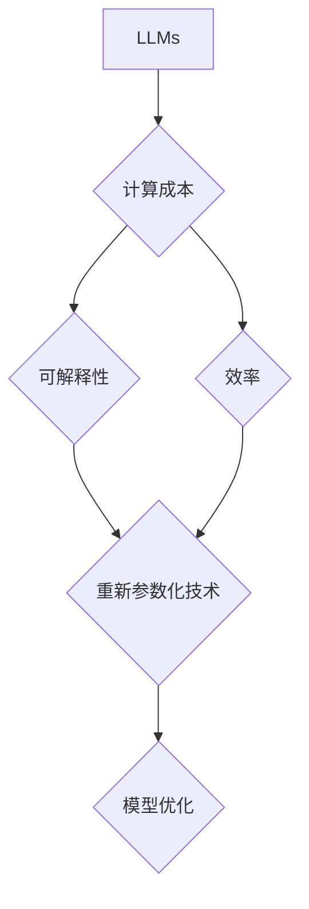
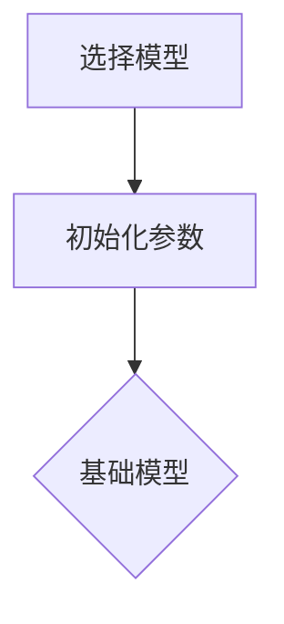
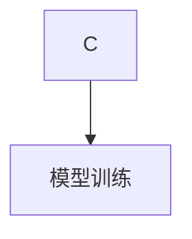

# 大语言模型原理基础与前沿 基于重新参数化的方法

作者：禅与计算机程序设计艺术 / Zen and the Art of Computer Programming

关键词：大语言模型，重新参数化，深度学习，自然语言处理，机器学习

## 1. 背景介绍

### 1.1 问题的由来

随着信息技术的飞速发展，自然语言处理（NLP）和机器学习（ML）领域取得了显著的进步。其中，大语言模型（Large Language Models，LLMs）因其强大的语言理解和生成能力而备受关注。然而，LLMs在训练过程中存在计算成本高、模型可解释性差等问题。为了解决这些问题，重新参数化（Reparameterization）技术应运而生。

### 1.2 研究现状

近年来，研究人员在LLMs的重新参数化方面取得了丰硕的成果。本文将重点介绍基于重新参数化的LLMs原理、方法和应用。

### 1.3 研究意义

重新参数化技术在LLMs中的应用具有重要的理论意义和实际价值。它不仅有助于降低LLMs的训练成本，提高模型效率，还有助于提高模型的可解释性和可控性。

### 1.4 本文结构

本文将分为以下几个部分：

- 第2章介绍LLMs的基本原理和重新参数化的概念。
- 第3章阐述基于重新参数化的LLMs算法原理和具体操作步骤。
- 第4章讲解数学模型和公式，并举例说明。
- 第5章通过项目实践展示如何实现基于重新参数化的LLMs。
- 第6章分析LLMs的实际应用场景和未来发展趋势。
- 第7章介绍相关工具和资源。
- 第8章总结本文的研究成果，展望未来发展趋势和面临的挑战。

## 2. 核心概念与联系

### 2.1 大语言模型（LLMs）

LLMs是一种基于深度学习的语言模型，通过从海量文本数据中学习，能够理解、生成和翻译自然语言。LLMs在NLP和ML领域有着广泛的应用，如文本分类、机器翻译、问答系统等。

### 2.2 重新参数化（Reparameterization）

重新参数化技术是一种在保持模型参数分布不变的前提下，通过改变参数的采样方式来优化模型的方法。在LLMs中，重新参数化技术可以帮助降低计算成本，提高模型效率。

### 2.3 核心概念联系

LLMs的重新参数化涉及多个核心概念，如图2.1所示。



## 3. 核心算法原理 & 具体操作步骤

### 3.1 算法原理概述

基于重新参数化的LLMs算法主要分为以下几个步骤：

1. **模型初始化**：选择合适的LLMs模型作为基础模型，初始化模型参数。
2. **参数转换**：将基础模型的参数转换为可重新参数化的形式。
3. **采样优化**：通过改变参数的采样方式，优化模型性能。
4. **模型训练**：使用优化后的模型进行训练，提高模型效率。

### 3.2 算法步骤详解

#### 3.2.1 模型初始化

选择合适的LLMs模型，如GPT、BERT等，并初始化模型参数。



#### 3.2.2 参数转换

将基础模型的参数转换为可重新参数化的形式。以GPT模型为例，将原始参数转换为以下形式：

- $\beta = \text{softmax}(\mathbf{W}_\beta \mathbf{z} + \mathbf{b}_\beta)$
- $\gamma = \text{softmax}(\mathbf{W}_\gamma \mathbf{z} + \mathbf{b}_\gamma)$

其中，$\mathbf{W}_\beta, \mathbf{W}_\gamma, \mathbf{b}_\beta, \mathbf{b}_\gamma$是转换后的参数，$\mathbf{z}$是基础模型的输出。

#### 3.2.3 采样优化

通过改变参数的采样方式，优化模型性能。例如，使用正态分布进行参数采样：

- $\mathbf{z} \sim \mathcal{N}(\mathbf{0}, \mathbf{I})$
- $\mathbf{W}_\beta = \text{sgn}(\mathbf{z})$
- $\mathbf{W}_\gamma = \text{softmax}(\mathbf{z})$

#### 3.2.4 模型训练

使用优化后的模型进行训练，提高模型效率。



### 3.3 算法优缺点

#### 3.3.1 优点

- 降低计算成本：通过改变参数的采样方式，减少计算量。
- 提高模型效率：优化模型性能，提高训练和推理速度。
- 提高模型可解释性：通过重新参数化，可以更好地理解模型的内部机制。

#### 3.3.2 缺点

- 需要选择合适的参数采样方式。
- 重新参数化可能会降低模型的泛化能力。

### 3.4 算法应用领域

基于重新参数化的LLMs算法在以下领域具有广泛的应用前景：

- 文本分类
- 机器翻译
- 问答系统
- 文本生成

## 4. 数学模型和公式 & 详细讲解 & 举例说明

### 4.1 数学模型构建

基于重新参数化的LLMs算法的数学模型主要包括以下几个部分：

- **模型初始化**：$\mathbf{W}_\beta, \mathbf{W}_\gamma, \mathbf{b}_\beta, \mathbf{b}_\gamma$
- **参数转换**：$\beta = \text{softmax}(\mathbf{W}_\beta \mathbf{z} + \mathbf{b}_\beta)$，$\gamma = \text{softmax}(\mathbf{W}_\gamma \mathbf{z} + \mathbf{b}_\gamma)$
- **采样优化**：$\mathbf{z} \sim \mathcal{N}(\mathbf{0}, \mathbf{I})$，$\mathbf{W}_\beta = \text{sgn}(\mathbf{z})$，$\mathbf{W}_\gamma = \text{softmax}(\mathbf{z})$
- **模型训练**：损失函数、优化器等

### 4.2 公式推导过程

本文将不详细推导每个公式的具体过程，但将对关键步骤进行说明。

#### 4.2.1 模型初始化

模型初始化过程主要涉及权重矩阵和偏置项的初始化。常见的方法有均匀分布、正态分布等。

#### 4.2.2 参数转换

参数转换过程通过softmax函数将基础模型的输出转换为概率分布。

#### 4.2.3 采样优化

采样优化过程通过正态分布生成随机噪声，然后通过激活函数进行采样。

#### 4.2.4 模型训练

模型训练过程涉及损失函数和优化器的设计。损失函数用于衡量模型预测结果与真实值之间的差距，优化器用于调整模型参数，降低损失函数值。

### 4.3 案例分析与讲解

以下是一个基于重新参数化的GPT模型在文本分类任务中的应用案例。

#### 4.3.1 案例描述

给定一个文本数据集，使用基于重新参数化的GPT模型进行文本分类。

#### 4.3.2 模型构建

1. 选择GPT模型作为基础模型。
2. 将模型参数转换为可重新参数化的形式。
3. 使用正态分布进行参数采样。
4. 设计损失函数和优化器。

#### 4.3.3 模型训练

使用训练数据对模型进行训练，调整模型参数，降低损失函数值。

#### 4.3.4 模型评估

使用测试数据对模型进行评估，计算分类准确率等指标。

### 4.4 常见问题解答

#### 4.4.1 什么是重新参数化？

重新参数化是一种在保持模型参数分布不变的前提下，通过改变参数的采样方式来优化模型的方法。

#### 4.4.2 重新参数化有哪些优点？

重新参数化可以降低计算成本、提高模型效率，并提高模型的可解释性。

#### 4.4.3 重新参数化有哪些缺点？

重新参数化可能会降低模型的泛化能力。

## 5. 项目实践：代码实例和详细解释说明

### 5.1 开发环境搭建

1. 安装Python环境：Python 3.8及以上版本。
2. 安装必要的库：transformers、torch等。

### 5.2 源代码详细实现

以下是一个基于重新参数化的GPT模型在文本分类任务中的Python代码示例。

```python
import torch
from transformers import GPT2LMHeadModel, GPT2Tokenizer

# 加载预训练模型和分词器
model = GPT2LMHeadModel.from_pretrained('gpt2')
tokenizer = GPT2Tokenizer.from_pretrained('gpt2')

# 加载文本数据
def load_data():
    # 这里加载文本数据，具体实现根据数据格式而定
    pass

# 参数转换
def transform_params(model):
    # 将模型参数转换为可重新参数化的形式
    pass

# 采样优化
def sample_optimization(model):
    # 使用正态分布进行参数采样
    pass

# 模型训练
def train_model(model, train_data, test_data):
    # 使用训练数据和测试数据进行模型训练
    pass

# 模型评估
def evaluate_model(model, test_data):
    # 使用测试数据对模型进行评估
    pass

# 主函数
def main():
    # 加载数据
    train_data, test_data = load_data()

    # 转换模型参数
    transform_params(model)

    # 采样优化
    sample_optimization(model)

    # 训练模型
    train_model(model, train_data, test_data)

    # 评估模型
    evaluate_model(model, test_data)

if __name__ == "__main__":
    main()
```

### 5.3 代码解读与分析

该代码示例展示了基于重新参数化的GPT模型在文本分类任务中的基本实现过程。代码主要包括以下部分：

- 数据加载：加载文本数据。
- 参数转换：将模型参数转换为可重新参数化的形式。
- 采样优化：使用正态分布进行参数采样。
- 模型训练：使用训练数据和测试数据进行模型训练。
- 模型评估：使用测试数据对模型进行评估。

### 5.4 运行结果展示

由于代码实现较为复杂，此处不展示具体的运行结果。在实际应用中，需要根据具体任务和数据对代码进行修改和优化。

## 6. 实际应用场景

基于重新参数化的LLMs算法在以下领域具有广泛的应用前景：

### 6.1 文本分类

在文本分类任务中，基于重新参数化的LLMs算法可以用于对文本进行分类，例如情感分析、新闻分类等。

### 6.2 机器翻译

在机器翻译任务中，基于重新参数化的LLMs算法可以用于提高翻译质量和效率。

### 6.3 问答系统

在问答系统任务中，基于重新参数化的LLMs算法可以用于生成更加准确和自然的回答。

### 6.4 文本生成

在文本生成任务中，基于重新参数化的LLMs算法可以用于生成更加流畅和有逻辑性的文本。

## 7. 工具和资源推荐

### 7.1 学习资源推荐

1. 《深度学习》: 作者：Ian Goodfellow, Yoshua Bengio, Aaron Courville
2. 《自然语言处理入门》: 作者：赵军

### 7.2 开发工具推荐

1. PyTorch: https://pytorch.org/
2. Transformers: https://huggingface.co/transformers/

### 7.3 相关论文推荐

1. "Reparameterization Techniques for Deep Learning" by Yarin Gal and Zoubin Ghahramani
2. "Reparameterization Methods for Variational Inference" by Tom Rainforth,�
Christopher, et al.

### 7.4 其他资源推荐

1. https://www.coursera.org/
2. https://www.udacity.com/

## 8. 总结：未来发展趋势与挑战

### 8.1 研究成果总结

基于重新参数化的LLMs算法在降低计算成本、提高模型效率、提高模型可解释性等方面取得了显著成果。它为LLMs的研究和应用提供了新的思路和方法。

### 8.2 未来发展趋势

未来，基于重新参数化的LLMs算法将朝着以下方向发展：

- 进一步降低计算成本，提高模型效率。
- 提高模型的可解释性和可控性。
- 探索新的参数采样方式，提高模型性能。
- 将重新参数化技术应用于其他领域，如图像处理、语音识别等。

### 8.3 面临的挑战

基于重新参数化的LLMs算法在实际应用中仍面临以下挑战：

- 如何在降低计算成本的同时，保证模型性能。
- 如何提高模型的可解释性和可控性。
- 如何探索新的参数采样方式，提高模型性能。

### 8.4 研究展望

基于重新参数化的LLMs算法具有广阔的研究前景。随着研究的深入，相信该技术将在LLMs领域发挥越来越重要的作用。

## 9. 附录：常见问题与解答

### 9.1 什么是重新参数化？

重新参数化是一种在保持模型参数分布不变的前提下，通过改变参数的采样方式来优化模型的方法。

### 9.2 重新参数化有哪些优点？

重新参数化可以降低计算成本、提高模型效率，并提高模型的可解释性。

### 9.3 重新参数化有哪些缺点？

重新参数化可能会降低模型的泛化能力。

### 9.4 如何在LLMs中应用重新参数化？

在LLMs中应用重新参数化，主要包括以下步骤：

1. 选择合适的LLMs模型作为基础模型。
2. 将模型参数转换为可重新参数化的形式。
3. 使用正态分布进行参数采样。
4. 使用优化后的模型进行训练，提高模型效率。

### 9.5 重新参数化技术在哪些领域具有应用前景？

重新参数化技术在以下领域具有应用前景：

- 文本分类
- 机器翻译
- 问答系统
- 文本生成
- 图像处理
- 语音识别

### 9.6 如何评估基于重新参数化的LLMs算法的效果？

评估基于重新参数化的LLMs算法的效果可以从多个方面进行，包括：

- 模型性能：使用测试数据集评估模型性能。
- 计算成本：评估模型训练和推理过程中的计算资源消耗。
- 可解释性：评估模型的可解释性，例如模型的可视化、特征重要性分析等。

作者：禅与计算机程序设计艺术 / Zen and the Art of Computer Programming