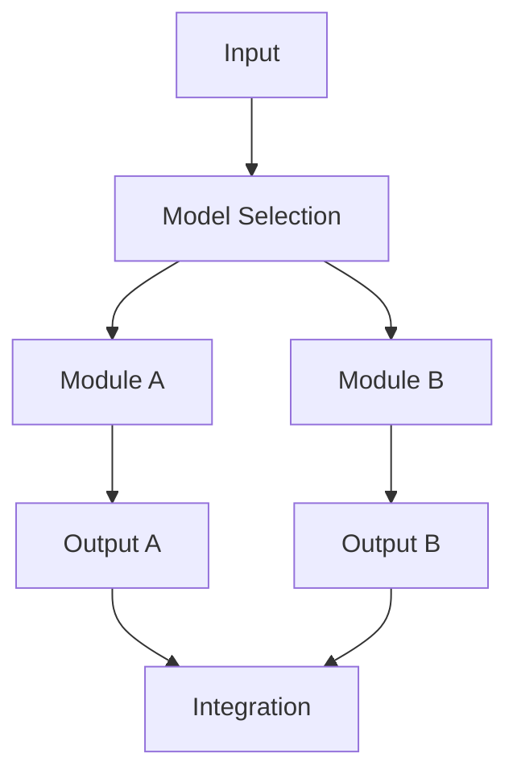

# 大语言模型原理基础与前沿 路由算法

作者：禅与计算机程序设计艺术 / Zen and the Art of Computer Programming

## 1. 背景介绍

### 1.1 问题的由来

随着互联网的普及和大数据技术的快速发展，语言模型在自然语言处理（Natural Language Processing, NLP）领域扮演着越来越重要的角色。大语言模型（Large Language Models, LLMs）如BERT、GPT、T5等，凭借其卓越的性能和广泛的应用场景，成为了当前研究的热点。然而，在LLMs的内部工作原理和应用过程中，路由算法扮演着至关重要的角色。

### 1.2 研究现状

路由算法在LLMs中的应用主要集中在以下几个方面：

1. **输入处理**：在处理输入文本时，路由算法负责将文本分割成合适的词元或子词，以便LLMs进行后续处理。
2. **内部注意力机制**：在LLMs的内部注意力机制中，路由算法负责根据上下文信息动态地调整注意力权重，以实现更精准的信息检索和语义理解。
3. **输出生成**：在LLMs生成文本输出时，路由算法负责根据生成过程中的上下文信息和预测结果，动态选择合适的词元或子词进行输出。

### 1.3 研究意义

深入研究和优化LLMs中的路由算法，对于提升LLMs的性能和应用效果具有重要意义。具体表现在以下方面：

1. **提高性能**：优化路由算法可以提升LLMs在文本理解、生成等方面的准确性和效率。
2. **扩展应用**：通过改进路由算法，可以使LLMs更好地适应不同应用场景，拓展其应用领域。
3. **降低资源消耗**：优化路由算法有助于减少LLMs的训练和推理过程中的资源消耗。

### 1.4 本文结构

本文将首先介绍LLMs中常用的路由算法，然后分析其原理和具体操作步骤，并结合实际案例进行详细讲解。最后，我们将探讨LLMs中路由算法的应用前景和挑战。

## 2. 核心概念与联系

### 2.1 路由算法的定义

路由算法是指在网络中根据一定的规则，将数据包从源节点传输到目标节点的一种计算方法。在LLMs中，路由算法负责根据上下文信息，将输入文本或内部信息动态地传递到相应的处理模块。

### 2.2 路由算法的类型

LLMs中常用的路由算法类型包括：

1. **基于规则的路由算法**：根据预设的规则，将输入或内部信息传递到相应的处理模块。
2. **基于模型的路由算法**：利用机器学习模型，根据上下文信息动态地选择合适的处理模块。
3. **基于图的路由算法**：将LLMs的内部结构建模为图，根据图中的路径信息进行路由。

### 2.3 路由算法与LLMs的关系

路由算法是LLMs的重要组成部分，其性能直接影响LLMs的整体性能。合理的路由算法可以使LLMs在处理文本信息时更加高效、准确，从而提升其在各种应用场景中的表现。

## 3. 核心算法原理与具体操作步骤

### 3.1 算法原理概述

LLMs中的路由算法主要基于以下原理：

1. **上下文信息**：根据上下文信息，动态调整路由路径，以实现更精准的信息检索和语义理解。
2. **模型选择**：根据任务需求和上下文信息，选择合适的处理模块，以提升处理效率和准确率。
3. **注意力机制**：利用注意力机制，使LLMs在处理文本信息时更加关注重要信息，从而提高理解能力。

### 3.2 算法步骤详解

以下是一个基于模型选择的LLMs路由算法的基本步骤：

1. **输入处理**：将输入文本分割成合适的词元或子词。
2. **上下文信息提取**：提取输入文本的上下文信息，为后续的路由决策提供依据。
3. **模型选择**：根据上下文信息和任务需求，选择合适的处理模块。
4. **信息传递**：将输入信息传递到选定的处理模块，进行后续处理。
5. **结果整合**：将处理模块的输出结果进行整合，得到最终的处理结果。

### 3.3 算法优缺点

**优点**：

1. 提升LLMs在文本理解、生成等方面的准确性和效率。
2. 扩展LLMs的应用领域，使其更好地适应不同场景。

**缺点**：

1. 模型选择和路由决策过程可能比较复杂，需要大量计算资源。
2. 依赖于训练数据的质量和模型的选择，可能存在一定的偏差。

### 3.4 算法应用领域

LLMs中的路由算法广泛应用于以下领域：

1. **文本分类**：根据输入文本的主题和情感，将文本分类到相应的类别。
2. **问答系统**：根据用户提问，从知识库中检索相关信息，并生成回答。
3. **机器翻译**：将一种语言的文本翻译成另一种语言。
4. **文本摘要**：从长文本中提取关键信息，生成简短的摘要。

## 4. 数学模型和公式 & 详细讲解 & 举例说明

### 4.1 数学模型构建

LLMs中的路由算法可以建模为一个图，其中节点代表处理模块，边代表信息传递路径。以下是一个简单的路由算法的数学模型：



### 4.2 公式推导过程

假设我们有$n$个处理模块，每个模块的输出概率为$p_i$，则根据全概率公式，最终输出结果的概率可以表示为：

$$P(Y) = \sum_{i=1}^n p_i P(Y | X_i)$$

其中，$X_i$表示从模块$i$接收到的信息，$Y$表示最终输出结果。

### 4.3 案例分析与讲解

以文本分类任务为例，我们可以将文本分割成多个词元，然后将每个词元作为输入信息，传递给不同的处理模块。每个处理模块负责提取词元对应的特征，并输出相应的概率分布。最终，我们将这些概率分布进行整合，选择概率最高的类别作为文本的分类结果。

### 4.4 常见问题解答

**问题1**：路由算法中的模型选择是否会影响最终结果？

**回答**：是的，模型选择对最终结果有一定影响。合适的模型可以根据任务需求和上下文信息，提高处理效率和准确率。

**问题2**：如何优化路由算法的性能？

**回答**：优化路由算法的性能可以从以下几个方面入手：

1. 选择合适的处理模块，使模块之间的协同工作更加高效。
2. 优化模型选择策略，使模型选择更加精确。
3. 使用注意力机制，使LLMs更加关注重要信息。

## 5. 项目实践：代码实例和详细解释说明

### 5.1 开发环境搭建

首先，我们需要搭建一个开发环境，包括以下工具和库：

1. **Python**：用于编写代码和运行程序。
2. **PyTorch**：用于构建和训练神经网络模型。
3. **Transformers**：用于加载和操作预训练的LLMs。

### 5.2 源代码详细实现

以下是一个简单的文本分类任务的路由算法示例，使用PyTorch和Transformers库实现：

```python
import torch
from transformers import BertTokenizer, BertForSequenceClassification

# 加载预训练的BERT模型和分词器
tokenizer = BertTokenizer.from_pretrained('bert-base-chinese')
model = BertForSequenceClassification.from_pretrained('bert-base-chinese')

# 加载测试数据
texts = ["这是一个文本分类任务示例。", "另一个文本分类任务示例。"]
labels = [0, 1]

# 编码数据
inputs = tokenizer(texts, padding=True, truncation=True, max_length=512, return_tensors='pt')

# 训练和推理
outputs = model(**inputs['input_ids'], labels=labels)
loss = outputs.loss
logits = outputs.logits

# 输出结果
predictions = torch.argmax(logits, dim=1)
print("预测结果：", predictions)
```

### 5.3 代码解读与分析

1. **导入库和模块**：首先导入所需的库和模块，包括PyTorch、Transformers等。
2. **加载预训练的BERT模型和分词器**：使用Transformers库加载预训练的BERT模型和分词器。
3. **加载测试数据**：加载测试数据，包括文本和对应的标签。
4. **编码数据**：使用分词器对文本进行编码，并添加padding和truncation，使所有输入文本长度一致。
5. **训练和推理**：将编码后的文本输入到BERT模型中，得到预测结果。
6. **输出结果**：输出预测结果。

通过这个示例，我们可以看到路由算法在文本分类任务中的应用。在实际应用中，可以根据具体任务需求，选择合适的LLMs和处理模块，以实现高效的文本处理。

## 6. 实际应用场景

LLMs中的路由算法在实际应用中具有广泛的应用场景，以下是一些典型案例：

### 6.1 文本分类

路由算法在文本分类任务中可以用于以下场景：

1. **新闻分类**：将新闻文本分类到相应的类别，如体育、娱乐、科技等。
2. **情感分析**：根据文本内容，判断文本的情感倾向，如正面、负面、中立等。
3. **垃圾邮件检测**：检测邮件是否为垃圾邮件，以减少垃圾邮件的干扰。

### 6.2 问答系统

路由算法在问答系统中可以用于以下场景：

1. **知识图谱问答**：根据用户提问，从知识图谱中检索相关信息，并生成回答。
2. **搜索引擎**：根据用户查询，从海量文本中检索相关信息，并生成回答。
3. **聊天机器人**：根据用户提问，从知识库中检索相关信息，并生成回答。

### 6.3 机器翻译

路由算法在机器翻译任务中可以用于以下场景：

1. **跨语言文本分类**：根据源语言文本，将其分类到相应的语言类别。
2. **机器翻译校正**：对机器翻译的结果进行校正，提高翻译质量。

### 6.4 文本摘要

路由算法在文本摘要任务中可以用于以下场景：

1. **新闻摘要**：从长篇新闻中提取关键信息，生成简短的摘要。
2. **会议摘要**：从会议记录中提取关键信息，生成简短的摘要。

## 7. 工具和资源推荐

### 7.1 学习资源推荐

1. **《深度学习》**: 作者：Ian Goodfellow, Yoshua Bengio, Aaron Courville
    - 详细介绍了深度学习的基础知识和实践，包括LLMs的原理和应用。
2. **《自然语言处理入门》**: 作者：赵军
    - 介绍了自然语言处理的基本概念和方法，包括LLMs在NLP中的应用。

### 7.2 开发工具推荐

1. **PyTorch**: [https://pytorch.org/](https://pytorch.org/)
    - 一个开源的深度学习框架，支持快速搭建和训练神经网络模型。
2. **Transformers**: [https://huggingface.co/transformers/](https://huggingface.co/transformers/)
    - 提供了丰富的预训练的LLMs和工具，方便研究和应用。

### 7.3 相关论文推荐

1. **BERT: Pre-training of Deep Bidirectional Transformers for Language Understanding**: [https://arxiv.org/abs/1810.04805](https://arxiv.org/abs/1810.04805)
    - 描述了BERT模型的设计和训练方法。
2. **GPT-3: Language Models are Few-Shot Learners**: [https://arxiv.org/abs/2005.00150](https://arxiv.org/abs/2005.00150)
    - 介绍了GPT-3模型的设计和性能。

### 7.4 其他资源推荐

1. **Hugging Face社区**: [https://huggingface.co/](https://huggingface.co/)
    - 提供了丰富的LLMs资源和工具。
2. **Kaggle**: [https://www.kaggle.com/](https://www.kaggle.com/)
    - 提供了大量的NLP数据集和比赛，方便学习和实践。

## 8. 总结：未来发展趋势与挑战

LLMs中的路由算法在自然语言处理领域具有重要地位，其发展呈现出以下趋势：

### 8.1 发展趋势

1. **多模态学习**：LLMs将融合文本、图像、音频等多模态信息，实现更丰富的语义理解和生成。
2. **自监督学习**：LLMs将利用自监督学习方法，无需大量标注数据进行预训练，降低训练成本。
3. **分布式训练**：LLMs将采用分布式训练技术，提高训练效率和资源利用率。

### 8.2 面临的挑战

1. **计算资源消耗**：LLMs的训练和推理需要大量计算资源，如何降低资源消耗成为重要挑战。
2. **数据隐私和安全**：LLMs在处理和存储数据时，需要考虑数据隐私和安全问题。
3. **可解释性和可控性**：LLMs的决策过程需要更加透明和可控，以增强用户信任。

LLMs中的路由算法在未来仍将面临诸多挑战，但同时也具有广阔的应用前景。通过不断的研究和创新，LLMs中的路由算法将为自然语言处理领域带来更多突破。

## 9. 附录：常见问题与解答

### 9.1 什么是路由算法？

路由算法是指在网络中根据一定的规则，将数据包从源节点传输到目标节点的一种计算方法。在LLMs中，路由算法负责根据上下文信息，将输入文本或内部信息动态地传递到相应的处理模块。

### 9.2 路由算法在LLMs中的作用是什么？

路由算法在LLMs中扮演着至关重要的角色，其主要作用包括：

1. **输入处理**：将输入文本分割成合适的词元或子词，以便LLMs进行后续处理。
2. **内部注意力机制**：根据上下文信息动态地调整注意力权重，以实现更精准的信息检索和语义理解。
3. **输出生成**：根据生成过程中的上下文信息和预测结果，动态选择合适的词元或子词进行输出。

### 9.3 如何优化LLMs中的路由算法？

优化LLMs中的路由算法可以从以下几个方面入手：

1. **模型选择**：根据任务需求和上下文信息，选择合适的处理模块，以提升处理效率和准确率。
2. **注意力机制**：利用注意力机制，使LLMs在处理文本信息时更加关注重要信息，从而提高理解能力。
3. **自监督学习**：利用自监督学习方法，无需大量标注数据进行预训练，降低训练成本。

### 9.4 路由算法在LLMs中的应用前景如何？

LLMs中的路由算法在自然语言处理领域具有重要地位，其应用前景广阔。随着LLMs的不断发展，路由算法将在以下方面发挥重要作用：

1. **文本分类**：根据输入文本的主题和情感，将文本分类到相应的类别。
2. **问答系统**：根据用户提问，从知识库中检索相关信息，并生成回答。
3. **机器翻译**：将一种语言的文本翻译成另一种语言。
4. **文本摘要**：从长文本中提取关键信息，生成简短的摘要。

### 9.5 未来研究方向

未来，LLMs中的路由算法的研究方向包括：

1. **多模态学习**：融合文本、图像、音频等多模态信息，实现更丰富的语义理解和生成。
2. **自监督学习**：利用自监督学习方法，无需大量标注数据进行预训练，降低训练成本。
3. **分布式训练**：采用分布式训练技术，提高训练效率和资源利用率。

LLMs中的路由算法在自然语言处理领域具有重要地位，其发展将不断推动LLMs的应用和创新。