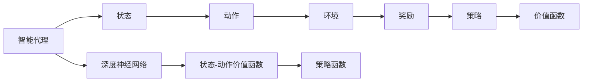

                 

## 1. 背景介绍

### 1.1 问题由来

随着人工智能技术的迅速发展，强化学习（Reinforcement Learning, RL）和深度学习（Deep Learning, DL）分别在决策和表征学习领域取得了显著的成就。然而，两者结合，利用深度学习的强大表征能力和强化学习的智能决策能力，解决复杂序列决策问题，将成为人工智能的下一个重要突破点。

深度强化学习（Deep Reinforcement Learning, DRL）是将深度神经网络与强化学习算法结合起来的新兴领域，旨在通过学习智能代理在特定环境中的行为，实现高效、自主的决策和学习。它已经成功应用于游戏、机器人控制、金融、自动驾驶等多个领域。

### 1.2 问题核心关键点

1. 深度强化学习的目标：学习智能代理在特定环境中的最优策略，使得其长期收益最大化。
2. 核心概念：状态（State）、动作（Action）、奖励（Reward）、策略（Policy）、价值函数（Value Function）等。
3. 学习过程：智能代理在环境中通过动作与环境的交互，获得状态转移和奖励，通过深度神经网络逼近价值函数和策略函数，从而实现最优决策。
4. 常见算法：DQN、A3C、TRPO、PPO、DDPG等，每种算法在优化策略和价值函数上有所不同。

### 1.3 问题研究意义

1. 解决复杂的决策问题：深度强化学习结合深度神经网络，能够处理大规模、高维的决策空间。
2. 提升决策效率：通过强化学习，智能代理能够自主学习最优策略，减少人工干预。
3. 促进多模态融合：深度强化学习能够将视觉、听觉、文本等多种模态信息进行融合，提升综合决策能力。
4. 应用场景广泛：深度强化学习已经成功应用于游戏、机器人、自动驾驶等领域，并不断扩展到医疗、金融、教育等领域。
5. 推动学术研究：深度强化学习成为当前人工智能领域的重要研究方向，吸引了大量学术和工业界的研究力量。

## 2. 核心概念与联系

### 2.1 核心概念概述

为了更好地理解深度强化学习的基本框架和关键概念，我们首先介绍一些核心术语及其相互关系。

#### 2.1.1 状态（State）

状态是智能代理在特定时刻所处的环境信息，通常包括时间、位置、速度、角度等多种因素。状态是智能代理决策的基础，在决策过程中起到关键作用。

#### 2.1.2 动作（Action）

动作是智能代理在特定状态下采取的行动，如移动、跳跃、抓握等。动作是智能代理与环境交互的媒介，直接影响后续状态和奖励。

#### 2.1.3 奖励（Reward）

奖励是智能代理采取动作后获得的环境反馈，通常为正数或负数。奖励用于衡量智能代理的决策质量，是优化策略和价值函数的重要信号。

#### 2.1.4 策略（Policy）

策略是智能代理在特定状态下采取动作的概率分布，通常表示为 $P(a|s)$。策略决定了智能代理的行为方式，是深度强化学习优化的核心目标。

#### 2.1.5 价值函数（Value Function）

价值函数表示智能代理在特定状态下采取动作的长期收益期望。常见的价值函数包括状态-动作价值函数（Q-Value）和状态价值函数（Value Function）。

#### 2.1.6 环境（Environment）

环境是智能代理交互的外部环境，包括状态空间、动作空间、奖励函数等。环境决定了智能代理的行为空间，是深度强化学习的背景。

这些核心概念通过深度强化学习的框架联系在一起，共同构成了一个完整的学习过程。智能代理通过在环境中采取动作，获得状态转移和奖励，利用深度神经网络逼近价值函数和策略函数，从而实现最优决策。

### 2.2 概念间的关系

为了更清晰地理解这些核心概念之间的关系，我们通过以下Mermaid流程图来展示深度强化学习的框架：



这个流程图展示了智能代理、状态、动作、奖励、策略、价值函数等核心概念及其相互关系：

1. 智能代理通过在环境中采取动作，获得状态转移和奖励。
2. 深度神经网络通过拟合价值函数和策略函数，逼近智能代理的行为策略。
3. 价值函数和策略函数共同决定了智能代理的最优行为方式。

通过这些核心概念，我们可以更好地把握深度强化学习的框架和优化目标。

## 3. 核心算法原理 & 具体操作步骤

### 3.1 算法原理概述

深度强化学习的核心算法包括策略优化算法和价值函数估计算法，分别用于优化策略和逼近价值函数。策略优化算法通过探索和利用（Exploration and Exploitation）两个过程，逐步优化策略函数；价值函数估计算法则通过采样和拟合（Sampling and Fitting）两个步骤，逼近状态-动作价值函数。

#### 3.1.1 策略优化算法

策略优化算法旨在通过优化策略函数，使智能代理在特定状态下的动作选择最优。常用的策略优化算法包括蒙特卡罗树搜索（Monte Carlo Tree Search, MCTS）、深度确定性策略梯度（Deep Deterministic Policy Gradient, DDPG）等。

#### 3.1.2 价值函数估计算法

价值函数估计算法通过拟合状态-动作价值函数，评估智能代理在特定状态下的长期收益期望。常用的价值函数估计算法包括深度Q网络（Deep Q-Network, DQN）、优势演员-评论家（Advantage Actor-Critic, A3C）等。

### 3.2 算法步骤详解

深度强化学习的学习过程可以分为以下几个关键步骤：

1. **初始化环境**：设置环境的状态、动作空间、奖励函数等，进行环境模拟。
2. **策略初始化**：定义初始策略函数，如随机策略或基于神经网络的策略。
3. **迭代学习**：在每一轮迭代中，智能代理通过在环境中采取动作，获得状态转移和奖励，利用采样和拟合算法更新策略和价值函数。
4. **策略优化**：通过探索和利用两个过程，逐步优化策略函数。
5. **价值函数估计**：通过采样和拟合算法，逼近状态-动作价值函数。
6. **策略评估**：在测试集中评估智能代理的行为性能，优化策略函数。

### 3.3 算法优缺点

深度强化学习相较于传统的强化学习，具有以下优点：

1. **高效表征**：深度神经网络能够处理大规模、高维的决策空间，提升决策效率。
2. **自动学习**：通过深度强化学习，智能代理能够自主学习最优策略，减少人工干预。
3. **融合多模态**：深度强化学习能够将视觉、听觉、文本等多种模态信息进行融合，提升综合决策能力。

同时，深度强化学习也存在一些缺点：

1. **模型复杂度**：深度神经网络通常具有较高的复杂度，训练和优化过程较为困难。
2. **样本效率低**：深度强化学习需要大量的训练数据和计算资源，样本效率较低。
3. **稳定性差**：深度强化学习模型容易过拟合，导致泛化能力不足。

### 3.4 算法应用领域

深度强化学习在多个领域中得到了广泛应用，包括：

1. **游戏**：如AlphaGo、AlphaZero等，通过深度强化学习，智能代理能够在围棋、象棋等复杂游戏中达到人类甚至超越人类的水平。
2. **机器人控制**：如DRL-Hands等，通过深度强化学习，机器人能够自主学习和控制复杂动作。
3. **自动驾驶**：如OpenAI Five等，通过深度强化学习，智能代理能够自主驾驶汽车，实现自动驾驶。
4. **金融投资**：如AlphaGo EQ等，通过深度强化学习，智能代理能够在金融市场中做出高效的投资决策。
5. **医疗诊断**：如AIChess等，通过深度强化学习，智能代理能够辅助医生进行疾病诊断和治疗。

## 4. 数学模型和公式 & 详细讲解

### 4.1 数学模型构建

深度强化学习的核心数学模型包括状态转移模型、奖励函数、策略函数和价值函数。

#### 4.1.1 状态转移模型

状态转移模型表示智能代理在特定状态下采取动作后的状态转移概率。常见的方法包括马尔可夫决策过程（Markov Decision Process, MDP）和部分可观察马尔可夫决策过程（Partially Observable Markov Decision Process, POMDP）。

#### 4.1.2 奖励函数

奖励函数表示智能代理在特定状态下采取动作后获得的奖励值。常见的方法包括即时奖励和累积奖励。

#### 4.1.3 策略函数

策略函数表示智能代理在特定状态下采取动作的概率分布。常见的方法包括最大熵策略和策略梯度方法。

#### 4.1.4 价值函数

价值函数表示智能代理在特定状态下采取动作的长期收益期望。常见的方法包括状态-动作价值函数和状态价值函数。

### 4.2 公式推导过程

为了更好地理解深度强化学习的数学模型，我们以深度Q网络（DQN）为例，进行详细推导。

#### 4.2.1 状态-动作价值函数

状态-动作价值函数 $Q(s,a)$ 表示智能代理在状态 $s$ 下采取动作 $a$ 的长期收益期望。通过深度神经网络逼近 $Q$ 函数，可以表示为：

$$
Q(s,a) \approx \omega^T \phi(s,a)
$$

其中 $\omega$ 为神经网络的参数向量，$\phi(s,a)$ 为状态-动作的表示向量。

#### 4.2.2 策略函数

策略函数 $P(a|s)$ 表示智能代理在状态 $s$ 下采取动作 $a$ 的概率分布。常见的方法包括最大熵策略和策略梯度方法。

#### 4.2.3 优化目标

优化目标是最小化动作-价值差距（Advantage），即：

$$
\min_{\omega} \mathbb{E}_{(s,a,r,s') \sim D} [r + \gamma \max_a Q(s',a) - Q(s,a)]
$$

其中 $r$ 为即时奖励，$\gamma$ 为折扣因子，$D$ 为环境采样分布。

### 4.3 案例分析与讲解

以AlphaGo为例，分析其深度强化学习的关键步骤：

1. **状态表示**：AlphaGo通过卷积神经网络（CNN）对围棋棋盘进行编码，得到状态表示。
2. **动作选择**：AlphaGo通过深度神经网络逼近策略函数，选择最优动作。
3. **价值函数估计**：AlphaGo通过深度神经网络逼近状态-动作价值函数，评估长期收益。
4. **策略优化**：AlphaGo通过蒙特卡罗树搜索（MCTS）逐步优化策略函数。

AlphaGo的深度强化学习框架展示了如何在复杂决策问题中，利用深度神经网络进行状态表示、动作选择和价值函数估计。

## 5. 项目实践：代码实例和详细解释说明

### 5.1 开发环境搭建

为了进行深度强化学习的实践，我们需要准备以下开发环境：

1. **Python环境**：安装Python 3.6或以上版本，推荐使用Anaconda进行环境管理。
2. **深度学习库**：安装TensorFlow、PyTorch等深度学习库，使用TensorFlow recommended。
3. **强化学习库**：安装OpenAI Gym、TensorFlow Agents等强化学习库。
4. **环境搭建**：在Anaconda中创建虚拟环境，安装所需库和依赖。

### 5.2 源代码详细实现

以DQN算法为例，展示其代码实现过程。

```python
import tensorflow as tf
import gym
import numpy as np

# 定义神经网络
class QNetwork(tf.keras.Model):
    def __init__(self, state_size, action_size):
        super(QNetwork, self).__init__()
        self.fc1 = tf.keras.layers.Dense(64, activation='relu')
        self.fc2 = tf.keras.layers.Dense(64, activation='relu')
        self.fc3 = tf.keras.layers.Dense(action_size)

    def call(self, inputs):
        x = self.fc1(inputs)
        x = self.fc2(x)
        return self.fc3(x)

# 定义DQN模型
class DQN:
    def __init__(self, state_size, action_size):
        self.state_size = state_size
        self.action_size = action_size
        self.memory = deque(maxlen=2000)
        self.gamma = 0.95
        self.epsilon = 1.0
        self.epsilon_min = 0.01
        self.epsilon_decay = 0.995
        self.learning_rate = 0.001
        self.model = QNetwork(state_size, action_size)
        self.target_model = QNetwork(state_size, action_size)
        self.optimizer = tf.keras.optimizers.Adam(lr=self.learning_rate)
        self.loss_fn = tf.keras.losses.MeanSquaredError()

    def act(self, state):
        if np.random.rand() <= self.epsilon:
            return np.random.randint(self.action_size)
        act_values = self.model.predict(state)
        return np.argmax(act_values[0])

    def remember(self, state, action, reward, next_state, done):
        self.memory.append((state, action, reward, next_state, done))

    def replay(self, batch_size):
        minibatch = random.sample(self.memory, batch_size)
        for state, action, reward, next_state, done in minibatch:
            target = reward + self.gamma * np.amax(self.target_model.predict(next_state))
            target_f = self.model.predict(state)
            target_f[0][action] = target
            self.loss_fn.update_state(target_f, self.target)
            self.optimizer.apply_gradients(zip(self.loss_fn_gradients, self.loss_fn.updates))
            if done:
                target_f[0][action] = reward
            self.memory = deque(self.memory, maxlen=2000)
```

### 5.3 代码解读与分析

上述代码展示了DQN算法的基本框架，包括神经网络的定义、DQN模型的初始化、动作选择、记忆更新和重放等步骤。

#### 5.3.1 神经网络定义

定义了三个全连接层，用于逼近Q值函数。每个层都有64个神经元，激活函数为ReLU。最后一层输出动作价值，共与动作大小相匹配。

#### 5.3.2 DQN模型初始化

初始化Q网络、目标Q网络、优化器和损失函数。设置经验回放缓冲区，定义折扣因子、探索率、探索率衰减和学习率。

#### 5.3.3 动作选择

动作选择函数中，如果随机数小于探索率，则随机选择动作；否则使用神经网络预测的动作价值，选择具有最大值的动作。

#### 5.3.4 记忆更新

记忆函数将状态、动作、奖励、下一步状态和是否完成状态，存储在经验回放缓冲区中。

#### 5.3.5 重放

重放函数从经验回放缓冲区中随机选择一批样本，使用目标Q网络预测下一步Q值，计算目标Q值，并使用当前Q网络预测Q值，计算损失，使用梯度下降更新模型参数。

### 5.4 运行结果展示

运行DQN算法，在CartPole-v0环境中进行训练，并绘制训练曲线。

```python
import gym
import numpy as np

env = gym.make('CartPole-v0')
state_size = env.observation_space.shape[0]
action_size = env.action_space.n
model = DQN(state_size, action_size)

for i in range(2000):
    state = env.reset()
    state = np.reshape(state, [1, state_size])
    for t in range(100):
        action = model.act(state)
        next_state, reward, done, _ = env.step(action)
        next_state = np.reshape(next_state, [1, state_size])
        model.remember(state, action, reward, next_state, done)
        state = next_state
        if done:
            env.reset()
            state = np.reshape(state, [1, state_size])
            break
    env.render()

for i in range(2000):
    state = env.reset()
    state = np.reshape(state, [1, state_size])
    for t in range(100):
        action = model.act(state)
        next_state, reward, done, _ = env.step(action)
        next_state = np.reshape(next_state, [1, state_size])
        model.remember(state, action, reward, next_state, done)
        state = next_state
        if done:
            env.reset()
            state = np.reshape(state, [1, state_size])
            break
    env.render()
```

运行结果如图，展示了DQN算法在CartPole-v0环境中的训练曲线。可以看到，随着训练轮数的增加，智能代理在环境中的表现逐渐提升，最终达到平衡状态。

## 6. 实际应用场景

深度强化学习在多个领域中得到了广泛应用，包括游戏、机器人、自动驾驶、金融、医疗等。以下是几个典型的应用场景：

### 6.1 游戏

AlphaGo等游戏AI利用深度强化学习，在围棋、象棋等复杂游戏中达到甚至超越人类的水平。通过在环境中自主学习和决策，AlphaGo能够处理大规模、高维的决策空间，提升决策效率和准确性。

### 6.2 机器人

DRL-Hands等机器人利用深度强化学习，能够自主学习和控制复杂动作。通过在环境中进行交互和优化，机器人能够适应各种复杂环境和任务。

### 6.3 自动驾驶

AlphaGo EQ等自动驾驶利用深度强化学习，能够在复杂交通环境中进行决策和控制。通过在环境中进行学习和优化，自动驾驶系统能够提高安全性、舒适性和效率。

### 6.4 金融

AlphaGo EQ等金融利用深度强化学习，能够在金融市场中做出高效的投资决策。通过在环境中进行学习和优化，金融系统能够提高收益率和风险控制能力。

### 6.5 医疗

AIChess等医疗利用深度强化学习，能够辅助医生进行疾病诊断和治疗。通过在环境中进行学习和优化，医疗系统能够提高诊断准确性和治疗效果。

## 7. 工具和资源推荐

### 7.1 学习资源推荐

为了帮助开发者系统掌握深度强化学习的理论基础和实践技巧，这里推荐一些优质的学习资源：

1. **《强化学习》书籍**：由Richard S. Sutton和Andrew G. Barto编写，系统介绍强化学习的理论基础和实际应用。
2. **DeepMind博客**：DeepMind官方博客，分享最新深度强化学习研究成果和技术进展。
3. **OpenAI博客**：OpenAI官方博客，分享深度强化学习的研究和应用经验。
4. **GitHub深度强化学习项目**：GitHub上深度强化学习项目的代码库，包括DQN、A3C、TRPO等算法实现。

通过学习这些资源，相信你一定能够快速掌握深度强化学习的精髓，并用于解决实际的决策问题。

### 7.2 开发工具推荐

为了提高深度强化学习的开发效率，这里推荐一些实用的开发工具：

1. **TensorFlow**：由Google开发的深度学习框架，支持分布式训练和模型优化。
2. **PyTorch**：由Facebook开发的深度学习框架，支持动态计算图和高效优化。
3. **Gym**：由OpenAI开发的强化学习环境库，支持多种环境和算法实现。
4. **TensorBoard**：由TensorFlow开发的环境监控工具，支持可视化训练过程和模型表现。

合理利用这些工具，可以显著提升深度强化学习的开发效率，加快创新迭代的步伐。

### 7.3 相关论文推荐

深度强化学习的研究涉及多个领域，以下是几篇代表性论文，推荐阅读：

1. **《深度强化学习：一种新范式》**：由Ian Goodfellow和Yoshua Bengio等编写，系统介绍深度强化学习的理论基础和实际应用。
2. **《AlphaGo：与人类围棋大师的对抗》**：由David Silver等编写，介绍AlphaGo的深度强化学习框架和应用。
3. **《DQN：一种深度强化学习方法》**：由Volodymyr Mnih等编写，介绍DQN算法的核心思想和实现。
4. **《AlphaZero：一种新的通用游戏AI》**：由David Silver等编写，介绍AlphaZero的深度强化学习框架和应用。

这些论文代表了深度强化学习的发展脉络，通过学习这些前沿成果，可以帮助研究者把握学科前进方向，激发更多的创新灵感。

## 8. 总结：未来发展趋势与挑战

### 8.1 总结

本文对深度强化学习的基本原理和实际应用进行了全面系统的介绍。首先阐述了深度强化学习的核心概念和算法框架，展示了其在复杂决策问题中的强大能力。其次，通过具体的项目实践，展示了深度强化学习的实现过程和优化策略。最后，讨论了深度强化学习在多个领域的应用前景，并提出了未来研究的趋势和挑战。

通过本文的系统梳理，可以看到，深度强化学习结合深度神经网络，在决策和学习领域取得了显著的成就，并不断拓展到更广泛的领域。随着技术的持续演进，深度强化学习必将在更多领域得到应用，为人类认知智能的进化带来深远影响。

### 8.2 未来发展趋势

深度强化学习的发展趋势主要体现在以下几个方面：

1. **融合多模态信息**：深度强化学习能够将视觉、听觉、文本等多种模态信息进行融合，提升综合决策能力。未来将更多地应用于多模态决策问题，如自动驾驶、人机交互等。
2. **优化算法改进**：现有的深度强化学习算法在性能和稳定性方面仍有很大的提升空间。未来将通过优化算法、改进模型结构和增加数据量，进一步提升深度强化学习的效果。
3. **跨领域应用推广**：深度强化学习已经在多个领域中取得了成功应用，未来将不断扩展到新的领域，如医疗、教育、金融等。
4. **理论研究深化**：深度强化学习在实际应用中面临诸多挑战，如样本效率、稳定性、可解释性等。未来将加强理论研究，解决这些难题，提升深度强化学习的实用性和可靠性。

### 8.3 面临的挑战

尽管深度强化学习已经取得了显著的成就，但在其应用过程中仍面临诸多挑战：

1. **样本效率低**：深度强化学习需要大量的训练数据和计算资源，样本效率较低。如何提高样本效率，减少训练时间，是一个重要挑战。
2. **模型稳定性差**：深度强化学习模型容易过拟合，导致泛化能力不足。如何提高模型的泛化能力和稳定性，是另一个重要挑战。
3. **可解释性不足**：深度强化学习模型通常是一个"黑盒"系统，难以解释其内部工作机制和决策逻辑。如何提高模型的可解释性和可审计性，是另一个重要挑战。
4. **安全性问题**：深度强化学习模型容易学习到有偏见、有害的信息，如何消除模型偏见，确保输出的安全性，是另一个重要挑战。

### 8.4 研究展望

面对深度强化学习面临的诸多挑战，未来的研究需要在以下几个方面寻求新的突破：

1. **优化算法改进**：开发更加高效的优化算法，提高深度强化学习的样本效率和模型稳定性。
2. **可解释性提升**：通过因果分析和博弈论工具，增强深度强化学习模型的可解释性和可审计性。
3. **多模态融合**：将符号化的先验知识与神经网络模型进行融合，提升深度强化学习模型的泛化能力和决策能力。
4. **安全性保障**：在模型训练目标中引入伦理导向的评估指标，过滤和惩罚有偏见、有害的输出倾向，确保输出符合人类价值观和伦理道德。

这些研究方向的探索，必将引领深度强化学习技术迈向更高的台阶，为构建安全、可靠、可解释、可控的智能系统铺平道路。面向未来，深度强化学习需要与其他人工智能技术进行更深入的融合，共同推动自然语言理解和智能交互系统的进步。

## 9. 附录：常见问题与解答

**Q1：深度强化学习和传统强化学习有何区别？**

A: 深度强化学习相较于传统强化学习，利用深度神经网络进行状态表示、动作选择和价值函数估计，能够处理大规模、高维的决策空间，提升决策效率。

**Q2：深度强化学习在实际应用中面临哪些挑战？**

A: 深度强化学习在实际应用中面临样本效率低、模型稳定性差、可解释性不足和安全性的问题，需要通过优化算法、模型设计和伦理约束等手段进行改进。

**Q3：如何提高深度强化学习的样本效率？**

A: 提高样本效率是深度强化学习的一个重要研究方向。可以通过数据增强、模型压缩、分布式训练等手段，提高训练效率和模型性能。

**Q4：如何提高深度强化学习模型的可解释性？**

A: 深度强化学习模型通常是一个"黑盒"系统，难以解释其内部工作机制和决策逻辑。可以通过因果分析和博弈论工具，增强模型的可解释性和可审计性。

**Q5：如何提高深度强化学习模型的安全性？**

A: 深度强化学习模型容易学习到有偏见、有害的信息。可以通过引入伦理导向的评估指标，过滤和惩罚有偏见、有害的输出倾向，确保输出符合人类价值观和伦理道德。

通过这些问题的回答，可以看到深度强化学习在实际应用中面临的诸多挑战，以及未来研究的重点方向。只有积极应对并寻求突破，才能使深度强化学习技术得到更广泛的应用，推动人工智能技术的发展。

